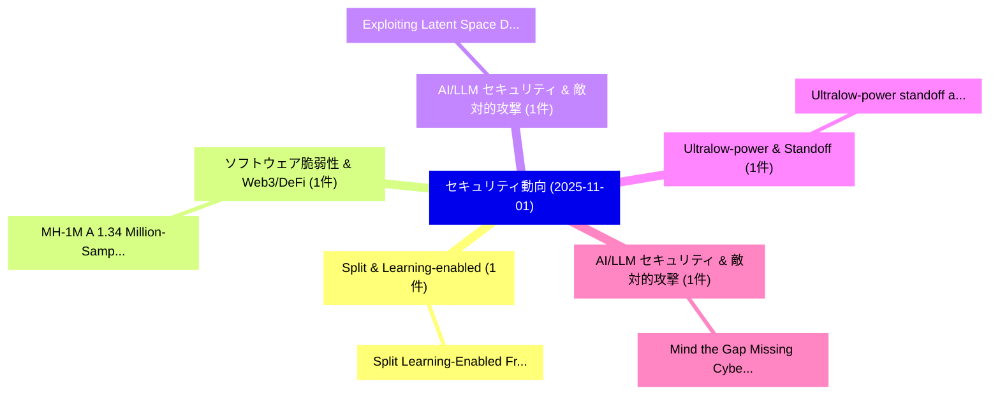

# 📅 02_daily: 日次エグゼクティブサマリー報告書 (2025-11-01)

**集計日時**: 2026-10-02 23:05:46 UTC  
**対象日付**: 2025-11-01  
**本日収集論文数**: 16 件  

---

## 💡 主要セキュリティ動向・脅威インサイト (Executive Insights)

本日の収集論文（計 16 件）において、以下の重点セキュリティ領域で活発な研究動向が確認されました：
- **Split & Learning-enabled** (1 件): 注目論文として 「Split Learning-Enabled Framewo...」 等が発表され、実務防御および攻撃検証の進展が見られます。
- **ソフトウェア脆弱性 & Web3/DeFi** (1 件): 注目論文として 「MH-1M: A 1.34 Million-Sample C...」 等が発表され、実務防御および攻撃検証の進展が見られます。
- **AI/LLM セキュリティ & 敵対的攻撃** (1 件): 注目論文として 「Exploiting Latent Space Discon...」 等が発表され、実務防御および攻撃検証の進展が見られます。
- **Ultralow-power & Standoff** (1 件): 注目論文として 「Ultralow-power standoff acoust...」 等が発表され、実務防御および攻撃検証の進展が見られます。
- **AI/LLM セキュリティ & 敵対的攻撃** (1 件): 注目論文として 「Mind the Gap: Missing Cyber Th...」 等が発表され、実務防御および攻撃検証の進展が見られます。

### 🗺️ 技術・脅威トピックマインドマップ

---

## 📌 日次セキュリティ論文一覧 (日本語表形式)

| No | arXiv ID | 論文タイトル (日本語訳) | 重要キーワード | 構造化エグゼクティブ要約 (背景・提案・影響) | 脅威分類 | 詳細リンク |
|---|---|---|---|---|---|---|
| 1 | `2511.00336v1` | [Split Learning-Enabled Framework for Secure and Light-weight Internet of Medical Things Systems（セキュリティ分析論文）](../../okf/papers/2025-11-01/2511.00336.md) | `Medical Things Systems`, `Split Learning`, `Light-weight Internet` | 【提案】概要 (Overview & Key Finding) 本論文「Split Learning-Enabled Framework for Secure and Light-w...。実証評価により経営層・セキュリティ管理者向け推奨アクション (E... | `executive-summary` | [arXiv](https://arxiv.org/abs/2511.00336v1) &#124; [OKF](../../okf/papers/2025-11-01/2511.00336.md) |
| 2 | `2511.00342v1` | [MH-1M: A 1.34 Million-Sample Comprehensive Multi-Feature Android Malware Dataset for Machine Learning, Deep Learning, 大規模言語モデル, and Threat Intelligence Research](../../okf/papers/2025-11-01/2511.00342.md) | `Feature Android Malware Dataset`, `Sample Comprehensive Multi`, `Threat Intelligence Research` | 【提案】概要 (Overview & Key Finding) 本論文「MH-1M: A 1.34 Million-Sample Comprehensive Multi-Featur...。実証評価により経営層・セキュリティ管理者向け推奨アクション (E... | `cs.AI` | [arXiv](https://arxiv.org/abs/2511.00342v1) &#124; [OKF](../../okf/papers/2025-11-01/2511.00342.md) |
| 3 | `2511.00346v1` | [Exploiting Latent Space Discontinuities for Building Universal LLM Jailbreaks and Data Extraction Attacks（セキュリティ分析論文）](../../okf/papers/2025-11-01/2511.00346.md) | `Exploiting Latent Space Discontinuities`, `Data Extraction Attacks`, `Building Universal` | 【提案】概要 (Overview & Key Finding) 本論文「Exploiting Latent Space Discontinuities for Building Un...。実証評価により経営層・セキュリティ管理者向け推奨アクション (E... | `cs.AI` | [arXiv](https://arxiv.org/abs/2511.00346v1) &#124; [OKF](../../okf/papers/2025-11-01/2511.00346.md) |
| 4 | `2511.00348v1` | [Ultralow-power standoff acoustic leak detection（セキュリティ分析論文）](../../okf/papers/2025-11-01/2511.00348.md) | `Ultralow-power standoff`, `Raw Meta`, `Executive Summary` | 【提案】概要 (Overview & Key Finding) 本論文「Ultralow-power standoff acoustic leak detection（セキュリティ分...。実証評価によりHasselbeck - **公開日時**: `2... | `executive-summary` | [arXiv](https://arxiv.org/abs/2511.00348v1) &#124; [OKF](../../okf/papers/2025-11-01/2511.00348.md) |
| 5 | `2511.00360v1` | [Mind the Gap: Missing Cyber Threat Coverage in NIDS Datasets for the Energy Sector（セキュリティ分析論文）](../../okf/papers/2025-11-01/2511.00360.md) | `Missing Cyber Threat Coverage`, `Energy Sector`, `Adrita Rahman Tory` | 【提案】概要 (Overview & Key Finding) 本論文「Mind the Gap: Missing Cyber 脅威 Coverage in NIDS Dataset...。実証評価により経営層・セキュリティ管理者向け推奨アクション (E... | `cs.AI` | [arXiv](https://arxiv.org/abs/2511.00360v1) &#124; [OKF](../../okf/papers/2025-11-01/2511.00360.md) |
| 6 | `2511.00361v1` | [MalDataGen: A Modular Framework for Synthetic Tabular Data Generation in マルウェア検出](../../okf/papers/2025-11-01/2511.00361.md) | `Synthetic Tabular Data Generation`, `Malware Detection`, `Angelo Gaspar Diniz Nogueira` | 【提案】概要 (Overview & Key Finding) 本論文「MalDataGen: A Modular Framework for Synthetic Tabular D...。実証評価により経営層・セキュリティ管理者向け推奨アクション (E... | `cs.AI` | [arXiv](https://arxiv.org/abs/2511.00361v1) &#124; [OKF](../../okf/papers/2025-11-01/2511.00361.md) |
| 7 | `2511.00363v1` | [Fast Networks for High-Performance Distributed Trust（セキュリティ分析論文）](../../okf/papers/2025-11-01/2511.00363.md) | `Performance Distributed Trust`, `Fast Networks`, `High-Performance Distributed` | 【提案】概要 (Overview & Key Finding) 本論文「Fast Networks for High-Performance Distributed Trust（セキ...。実証評価により経営層・セキュリティ管理者向け推奨アクション (E... | `cs.NI` | [arXiv](https://arxiv.org/abs/2511.00363v1) &#124; [OKF](../../okf/papers/2025-11-01/2511.00363.md) |
| 8 | `2511.00408v1` | [Penetrating the Hostile: Detecting DeFi Protocol Exploits through Cross-Contract Analysis（セキュリティ分析論文）](../../okf/papers/2025-11-01/2511.00408.md) | `Protocol Exploits`, `Xiaoqi Li`, `Wenkai Li` | 【提案】概要 (Overview & Key Finding) 本論文「Penetrating the Hostile: Detecting DeFi Protocol Exploi...。実証評価により経営層・セキュリティ管理者向け推奨アクション (E... | `cybersecurity` | [arXiv](https://arxiv.org/abs/2511.00408v1) &#124; [OKF](../../okf/papers/2025-11-01/2511.00408.md) |
| 9 | `2511.00415v1` | [Zero-Knowledge Extensions on Solana: A Theory of ZK Architecture（セキュリティ分析論文）](../../okf/papers/2025-11-01/2511.00415.md) | `Knowledge Extensions`, `Zero-Knowledge Extensions`, `Jotaro Yano` | 【提案】概要 (Overview & Key Finding) 本論文「Zero-Knowledge Extensions on Solana: A Theory of ZK Arc...。実証評価により経営層・セキュリティ管理者向け推奨アクション (E... | `cybersecurity` | [arXiv](https://arxiv.org/abs/2511.00415v1) &#124; [OKF](../../okf/papers/2025-11-01/2511.00415.md) |
| 10 | `2511.00446v1` | [ToxicTextCLIP: Text-Based Poisoning and Backdoor Attacks on CLIP Pre-training（セキュリティ分析論文）](../../okf/papers/2025-11-01/2511.00446.md) | `Based Poisoning`, `Backdoor Attacks`, `Text-Based Poisoning` | 【提案】概要 (Overview & Key Finding) 本論文「ToxicTextCLIP: Text-Based Poisoning and Backdoor Attack...。実証評価により経営層・セキュリティ管理者向け推奨アクション (E... | `cs.CV` | [arXiv](https://arxiv.org/abs/2511.00446v1) &#124; [OKF](../../okf/papers/2025-11-01/2511.00446.md) |
| 11 | `2511.00447v2` | [DRIP: Defending Prompt Injection via Token-wise Representation Editing and Residual Instruction Fusion（セキュリティ分析論文）](../../okf/papers/2025-11-01/2511.00447.md) | `Defending Prompt Injection`, `Residual Instruction Fusion`, `Representation Editing` | 【提案】概要 (Overview & Key Finding) 本論文「DRIP: Defending プロンプトインジェクション via Token-wise Representa...。実証評価により経営層・セキュリティ管理者向け推奨アクション (E... | `cs.AI` | [arXiv](https://arxiv.org/abs/2511.00447v2) &#124; [OKF](../../okf/papers/2025-11-01/2511.00447.md) |
| 12 | `2511.00460v1` | [Proactive DDoS Detection and Mitigation in Decentralized Software-Defined Networking via Port-Level Monitoring and Zero-Training 大規模言語モデル](../../okf/papers/2025-11-01/2511.00460.md) | `Decentralized Software`, `Defined Networking`, `Level Monitoring` | 【提案】概要 (Overview & Key Finding) 本論文「Proactive DDoS Detection and Mitigation in Decentralize...。実証評価により経営層・セキュリティ管理者向け推奨アクション (E... | `cs.AI` | [arXiv](https://arxiv.org/abs/2511.00460v1) &#124; [OKF](../../okf/papers/2025-11-01/2511.00460.md) |
| 13 | `2511.00481v1` | [An Efficient Anomaly Detection Framework for Wireless Sensor Networks Using Markov Process（セキュリティ分析論文）](../../okf/papers/2025-11-01/2511.00481.md) | `Wireless Sensor Networks Using Markov Process`, `Sudhanshu Kumar Jha`, `Omar Faruq Osama` | 【提案】概要 (Overview & Key Finding) 本論文「An Efficient Anomaly Detection Framework for Wireless S...。実証評価により経営層・セキュリティ管理者向け推奨アクション (E... | `cybersecurity` | [arXiv](https://arxiv.org/abs/2511.00481v1) &#124; [OKF](../../okf/papers/2025-11-01/2511.00481.md) |
| 14 | `2511.00509v1` | [Reimagining Safety Alignment with An Image（セキュリティ分析論文）](../../okf/papers/2025-11-01/2511.00509.md) | `Reimagining Safety Alignment`, `Yifan Xia`, `Guorui Chen` | 【提案】概要 (Overview & Key Finding) 本論文「Reimagining Safety Alignment with An Image（セキュリティ分析論文）」...。実証評価により経営層・セキュリティ管理者向け推奨アクション (E... | `cs.AI` | [arXiv](https://arxiv.org/abs/2511.00509v1) &#124; [OKF](../../okf/papers/2025-11-01/2511.00509.md) |
| 15 | `2511.00664v1` | [ShadowLogic: Backdoors in Any Whitebox LLM（セキュリティ分析論文）](../../okf/papers/2025-11-01/2511.00664.md) | `Kasimir Schulz`, `Amelia Kawasaki`, `Leo Ring` | 【提案】概要 (Overview & Key Finding) 本論文「ShadowLogic: Backdoors in Any Whitebox LLM（セキュリティ分析論文）」...。実証評価により経営層・セキュリティ管理者向け推奨アクション (E... | `cs.AI` | [arXiv](https://arxiv.org/abs/2511.00664v1) &#124; [OKF](../../okf/papers/2025-11-01/2511.00664.md) |
| 16 | `2511.00737v1` | [EP-HDC: Hyperdimensional Computing with Encrypted Parameters for High-Throughput Privacy-Preserving Inference（セキュリティ分析論文）](../../okf/papers/2025-11-01/2511.00737.md) | `Hyperdimensional Computing`, `Encrypted Parameters`, `Throughput Privacy` | 【提案】概要 (Overview & Key Finding) 本論文「EP-HDC: Hyperdimensional Computing with Encrypted Param...。実証評価により経営層・セキュリティ管理者向け推奨アクション (E... | `cs.AI` | [arXiv](https://arxiv.org/abs/2511.00737v1) &#124; [OKF](../../okf/papers/2025-11-01/2511.00737.md) |

