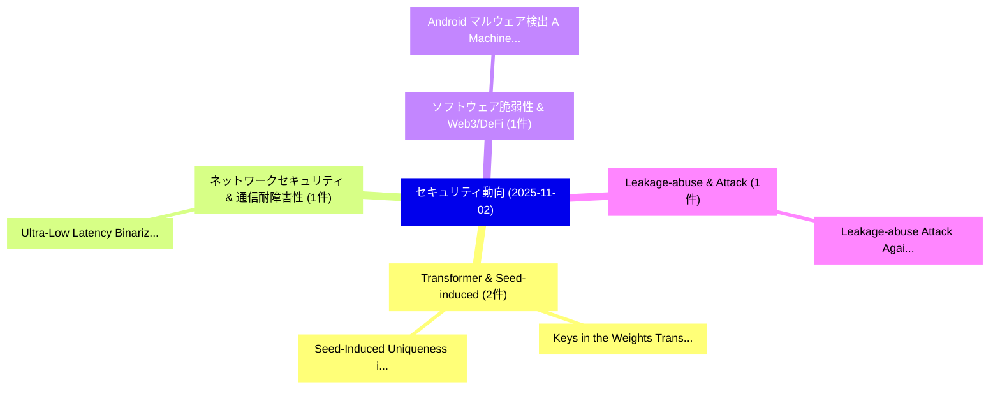

# 📅 02_daily: 日次エグゼクティブサマリー報告書 (2025-11-02)

**集計日時**: 2026-10-02 23:05:46 UTC  
**対象日付**: 2025-11-02  
**本日収集論文数**: 5 件  

---

## 💡 主要セキュリティ動向・脅威インサイト (Executive Insights)

本日の収集論文（計 5 件）において、以下の重点セキュリティ領域で活発な研究動向が確認されました：
- **Transformer & Seed-induced** (2 件): 注目論文として 「Keys in the Weights: Transform...」、「Seed-Induced Uniqueness in Tra...」 等が発表され、実務防御および攻撃検証の進展が見られます。
- **ネットワークセキュリティ & 通信耐障害性** (1 件): 注目論文として 「Ultra-Low Latency: Binarized N...」 等が発表され、実務防御および攻撃検証の進展が見られます。
- **ソフトウェア脆弱性 & Web3/DeFi** (1 件): 注目論文として 「Android マルウェア検出: A Machine Lea...」 等が発表され、実務防御および攻撃検証の進展が見られます。
- **Leakage-abuse & Attack** (1 件): 注目論文として 「Leakage-abuse Attack Against S...」 等が発表され、実務防御および攻撃検証の進展が見られます。

### 🗺️ 技術・脅威トピックマインドマップ

---

## 📌 日次セキュリティ論文一覧 (日本語表形式)

| No | arXiv ID | 論文タイトル (日本語訳) | 重要キーワード | 構造化エグゼクティブ要約 (背景・提案・影響) | 脅威分類 | 詳細リンク |
|---|---|---|---|---|---|---|
| 1 | `2511.00828v1` | [Ultra-Low Latency: Binarized Neural Network Architectures for In-Vehicle Network Intrusion Detectionに向けて](../../okf/papers/2025-11-02/2511.00828.md) | `Binarized Neural Network Architectures`, `Low Latency`, `Ultra-Low Latency` | 【提案】概要 (Overview & Key Finding) 本論文「Ultra-Low Latency: Binarized Neural Network Architectur...。実証評価により経営層・セキュリティ管理者向け推奨アクション (E... | `cs.AI` | [arXiv](https://arxiv.org/abs/2511.00828v1) &#124; [OKF](../../okf/papers/2025-11-02/2511.00828.md) |
| 2 | `2511.00894v1` | [Android マルウェア検出: A Machine Leaning Approach](../../okf/papers/2025-11-02/2511.00894.md) | `Android Malware Detection`, `Hasan Abdulla`, `Raw Meta` | 【提案】概要 (Overview & Key Finding) 本論文「Android マルウェア検出: A Machine Leaning Approach」（原題: Androi...。実証評価により経営層・セキュリティ管理者向け推奨アクション (E... | `cs.AI` | [arXiv](https://arxiv.org/abs/2511.00894v1) &#124; [OKF](../../okf/papers/2025-11-02/2511.00894.md) |
| 3 | `2511.00930v1` | [Leakage-abuse Attack Against Substring-SSE with Partially Known Dataset（セキュリティ分析論文）](../../okf/papers/2025-11-02/2511.00930.md) | `Partially Known Dataset`, `Leakage-abuse Attack`, `Xijie Ba` | 【提案】概要 (Overview & Key Finding) 本論文「Leakage-abuse Attack Against Substring-SSE with Partial...。実証評価により経営層・セキュリティ管理者向け推奨アクション (E... | `cybersecurity` | [arXiv](https://arxiv.org/abs/2511.00930v1) &#124; [OKF](../../okf/papers/2025-11-02/2511.00930.md) |
| 4 | `2511.00973v1` | [Keys in the Weights: Transformer Authentication Using Model-Bound Latent Representations（セキュリティ分析論文）](../../okf/papers/2025-11-02/2511.00973.md) | `Transformer Authentication Using Model`, `Bound Latent Representations`, `Model-Bound Latent` | 【提案】概要 (Overview & Key Finding) 本論文「Keys in the Weights: Transformer Authentication Using M...。実証評価により経営層・セキュリティ管理者向け推奨アクション (E... | `cs.AI` | [arXiv](https://arxiv.org/abs/2511.00973v1) &#124; [OKF](../../okf/papers/2025-11-02/2511.00973.md) |
| 5 | `2511.01023v1` | [Seed-Induced Uniqueness in Transformer Models: Subspace Alignment Governs Subliminal Transfer（セキュリティ分析論文）](../../okf/papers/2025-11-02/2511.01023.md) | `Subspace Alignment Governs Subliminal Transfer`, `Induced Uniqueness`, `Transformer Models` | 【提案】概要 (Overview & Key Finding) 本論文「Seed-Induced Uniqueness in Transformer Models: Subspace...。実証評価により経営層・セキュリティ管理者向け推奨アクション (E... | `cs.AI` | [arXiv](https://arxiv.org/abs/2511.01023v1) &#124; [OKF](../../okf/papers/2025-11-02/2511.01023.md) |

