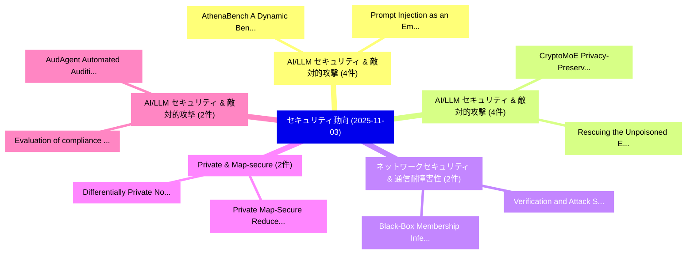

# 📅 02_daily: 日次エグゼクティブサマリー報告書 (2025-11-03)

**集計日時**: 2026-10-02 23:05:46 UTC  
**対象日付**: 2025-11-03  
**本日収集論文数**: 25 件  

---

## 💡 主要セキュリティ動向・脅威インサイト (Executive Insights)

本日の収集論文（計 25 件）において、以下の重点セキュリティ領域で活発な研究動向が確認されました：
- **AI/LLM セキュリティ & 敵対的攻撃** (4 件): 注目論文として 「AthenaBench: A Dynamic Benchma...」、「Prompt Injection as an Emergin...」 等が発表され、実務防御および攻撃検証の進展が見られます。
- **AI/LLM セキュリティ & 敵対的攻撃** (4 件): 注目論文として 「CryptoMoE: Privacy-Preserving ...」、「Rescuing the Unpoisoned: Effic...」 等が発表され、実務防御および攻撃検証の進展が見られます。
- **ネットワークセキュリティ & 通信耐障害性** (2 件): 注目論文として 「Verification and Attack Synthe...」、「Black-Box Membership Inference...」 等が発表され、実務防御および攻撃検証の進展が見られます。
- **Private & Map-secure** (2 件): 注目論文として 「Differentially Private Nonpara...」、「Private Map-Secure Reduce: Inf...」 等が発表され、実務防御および攻撃検証の進展が見られます。
- **AI/LLM セキュリティ & 敵対的攻撃** (2 件): 注目論文として 「Evaluation of compliance with ...」、「AudAgent: Automated Auditing o...」 等が発表され、実務防御および攻撃検証の進展が見られます。

### 🗺️ 技術・脅威トピックマインドマップ

---

## 📌 日次セキュリティ論文一覧 (日本語表形式)

| No | arXiv ID | 論文タイトル (日本語訳) | 重要キーワード | 構造化エグゼクティブ要約 (背景・提案・影響) | 脅威分類 | 詳細リンク |
|---|---|---|---|---|---|---|
| 1 | `2511.01124v1` | [Verification and Attack Synthesis for Network Protocols（セキュリティ分析論文）](../../okf/papers/2025-11-03/2511.01124.md) | `Attack Synthesis`, `Network Protocols`, `Raw Meta` | 【提案】概要 (Overview & Key Finding) 本論文「Verification and Attack Synthesis for Network Protocols...。実証評価により経営層・セキュリティ管理者向け推奨アクション (E... | `executive-summary` | [arXiv](https://arxiv.org/abs/2511.01124v1) &#124; [OKF](../../okf/papers/2025-11-03/2511.01124.md) |
| 2 | `2511.01144v2` | [AthenaBench: A Dynamic Benchmark for Evaluating LLMs in Cyber Threat Intelligence（セキュリティ分析論文）](../../okf/papers/2025-11-03/2511.01144.md) | `Cyber Threat Intelligence`, `Dynamic Benchmark`, `Md Tanvirul Alam` | 【提案】概要 (Overview & Key Finding) 本論文「AthenaBench: A Dynamic Benchmark for Evaluating LLMs in...。実証評価により経営層・セキュリティ管理者向け推奨アクション (E... | `cs.AI` | [arXiv](https://arxiv.org/abs/2511.01144v2) &#124; [OKF](../../okf/papers/2025-11-03/2511.01144.md) |
| 3 | `2511.01180v1` | [A Large Scale Study of AI-based Binary Function Similarity Detection Techniques for Security Researchers and Practitioners（セキュリティ分析論文）](../../okf/papers/2025-11-03/2511.01180.md) | `Binary Function Similarity Detection Techniques`, `Security Researchers`, `AI-based Binary` | 【提案】概要 (Overview & Key Finding) 本論文「A Large Scale Study of AI-based Binary Function Similar...。実証評価により経営層・セキュリティ管理者向け推奨アクション (E... | `executive-summary` | [arXiv](https://arxiv.org/abs/2511.01180v1) &#124; [OKF](../../okf/papers/2025-11-03/2511.01180.md) |
| 4 | `2511.01197v3` | [CryptoMoE: Privacy-Preserving and Scalable Mixture of Experts Inference via Balanced Expert Routing（セキュリティ分析論文）](../../okf/papers/2025-11-03/2511.01197.md) | `Balanced Expert Routing`, `Scalable Mixture`, `Experts Inference` | 【提案】概要 (Overview & Key Finding) 本論文「CryptoMoE: Privacy-Preserving and Scalable Mixture of E...。実証評価により経営層・セキュリティ管理者向け推奨アクション (E... | `cybersecurity` | [arXiv](https://arxiv.org/abs/2511.01197v3) &#124; [OKF](../../okf/papers/2025-11-03/2511.01197.md) |
| 5 | `2511.01268v1` | [Rescuing the Unpoisoned: Efficient Defense against Knowledge Corruption Attacks on RAG Systems（セキュリティ分析論文）](../../okf/papers/2025-11-03/2511.01268.md) | `Knowledge Corruption Attacks`, `Efficient Defense`, `Minseok Kim` | 【提案】概要 (Overview & Key Finding) 本論文「Rescuing the Unpoisoned: Efficient Defense against Know...。実証評価により経営層・セキュリティ管理者向け推奨アクション (E... | `cs.AI` | [arXiv](https://arxiv.org/abs/2511.01268v1) &#124; [OKF](../../okf/papers/2025-11-03/2511.01268.md) |
| 6 | `2511.01287v1` | ["Give a Positive Review Only": An Early Investigation Into In-Paper Prompt Injection Attacks and Defenses for AI Reviewers（セキュリティ分析論文）](../../okf/papers/2025-11-03/2511.01287.md) | `In-Paper Prompt`, `Qin Zhou`, `Zhexin Zhang` | 【提案】概要 (Overview & Key Finding) 本論文「"Give a Positive Review Only": An Early Investigation I...。実証評価により経営層・セキュリティ管理者向け推奨アクション (E... | `executive-summary` | [arXiv](https://arxiv.org/abs/2511.01287v1) &#124; [OKF](../../okf/papers/2025-11-03/2511.01287.md) |
| 7 | `2511.01303v2` | [Differentially Private Nonparametric Confidence Intervals Under Minimal Distributional Assumptions（セキュリティ分析論文）](../../okf/papers/2025-11-03/2511.01303.md) | `Tomer Shoham`, `Moshe Shenfeld`, `Noa Velner` | 【提案】概要 (Overview & Key Finding) 本論文「Differentially Private Nonparametric Confidence Interva...。実証評価により経営層・セキュリティ管理者向け推奨アクション (E... | `executive-summary` | [arXiv](https://arxiv.org/abs/2511.01303v2) &#124; [OKF](../../okf/papers/2025-11-03/2511.01303.md) |
| 8 | `2511.01391v1` | [Beyond Static Thresholds: Adaptive RRC Signaling Storm Detection with Extreme Value Theory（セキュリティ分析論文）](../../okf/papers/2025-11-03/2511.01391.md) | `Beyond Static Thresholds`, `Signaling Storm Detection`, `Extreme Value Theory` | 【提案】概要 (Overview & Key Finding) 本論文「Beyond Static Thresholds: Adaptive RRC Signaling Storm ...。実証評価により経営層・セキュリティ管理者向け推奨アクション (E... | `cs.NI` | [arXiv](https://arxiv.org/abs/2511.01391v1) &#124; [OKF](../../okf/papers/2025-11-03/2511.01391.md) |
| 9 | `2511.01393v1` | [ConneX: Automatically Resolving Transaction Opacity of Cross-Chain Bridges for Security Analysis（セキュリティ分析論文）](../../okf/papers/2025-11-03/2511.01393.md) | `Automatically Resolving Transaction Opacity`, `Chain Bridges`, `Cross-Chain Bridges` | 【提案】概要 (Overview & Key Finding) 本論文「ConneX: Automatically Resolving Transaction Opacity of ...。実証評価により経営層・セキュリティ管理者向け推奨アクション (E... | `cybersecurity` | [arXiv](https://arxiv.org/abs/2511.01393v1) &#124; [OKF](../../okf/papers/2025-11-03/2511.01393.md) |
| 10 | `2511.01451v1` | [Security-Aware Joint Sensing, Communication, and Computing Optimization in Low Altitude Wireless Networks（セキュリティ分析論文）](../../okf/papers/2025-11-03/2511.01451.md) | `Low Altitude Wireless Networks`, `Aware Joint Sensing`, `Computing Optimization` | 【提案】概要 (Overview & Key Finding) 本論文「Security-Aware Joint Sensing, Communication, and Comput...。実証評価により経営層・セキュリティ管理者向け推奨アクション (E... | `cybersecurity` | [arXiv](https://arxiv.org/abs/2511.01451v1) &#124; [OKF](../../okf/papers/2025-11-03/2511.01451.md) |
| 11 | `2511.01583v1` | [Federated Cyber Defense: Privacy-Preserving Ransomware Detection Across Distributed Systems（セキュリティ分析論文）](../../okf/papers/2025-11-03/2511.01583.md) | `Preserving Ransomware Detection Across Distributed Systems`, `Federated Cyber Defense`, `Privacy-Preserving Ransomware` | 【提案】概要 (Overview & Key Finding) 本論文「Federated Cyber Defense: Privacy-Preserving ランサムウェア Det...。実証評価により経営層・セキュリティ管理者向け推奨アクション (E... | `cs.AI` | [arXiv](https://arxiv.org/abs/2511.01583v1) &#124; [OKF](../../okf/papers/2025-11-03/2511.01583.md) |
| 12 | `2511.01598v1` | [Evaluation of compliance with democratic and technical standards of i-voting in elections to academic senates in Czech higher education（セキュリティ分析論文）](../../okf/papers/2025-11-03/2511.01598.md) | `Tomas Martinek`, `Michal Maly`, `Raw Meta` | 【提案】概要 (Overview & Key Finding) 本論文「Evaluation of compliance with democratic and technical ...。実証評価により経営層・セキュリティ管理者向け推奨アクション (E... | `executive-summary` | [arXiv](https://arxiv.org/abs/2511.01598v1) &#124; [OKF](../../okf/papers/2025-11-03/2511.01598.md) |
| 13 | `2511.01634v2` | [Prompt Injection as an Emerging Threat: Evaluating the Resilience of 大規模言語モデル](../../okf/papers/2025-11-03/2511.01634.md) | `Prompt Injection`, `Emerging Threat`, `Large Language Models` | 【提案】概要 (Overview & Key Finding) 本論文「プロンプトインジェクション as an Emerging 脅威: Evaluating the Resilie...。実証評価により経営層・セキュリティ管理者向け推奨アクション (E... | `cs.AI` | [arXiv](https://arxiv.org/abs/2511.01634v2) &#124; [OKF](../../okf/papers/2025-11-03/2511.01634.md) |
| 14 | `2511.01654v1` | [Panther: A Cost-Effective Privacy-Preserving Framework for GNN Training and Inference Services in Cloud Environments（セキュリティ分析論文）](../../okf/papers/2025-11-03/2511.01654.md) | `Effective Privacy`, `Inference Services`, `Cloud Environments` | 【提案】概要 (Overview & Key Finding) 本論文「Panther: A Cost-Effective Privacy-Preserving Framework ...。実証評価により経営層・セキュリティ管理者向け推奨アクション (E... | `executive-summary` | [arXiv](https://arxiv.org/abs/2511.01654v1) &#124; [OKF](../../okf/papers/2025-11-03/2511.01654.md) |
| 15 | `2511.01746v1` | [Scam Shield: Multi-Model Voting and Fine-Tuned LLMs Against Adversarial Attacks（セキュリティ分析論文）](../../okf/papers/2025-11-03/2511.01746.md) | `Scam Shield`, `Model Voting`, `Multi-Model Voting` | 【提案】概要 (Overview & Key Finding) 本論文「Scam Shield: Multi-Model Voting and Fine-Tuned LLMs Aga...。実証評価により経営層・セキュリティ管理者向け推奨アクション (E... | `cs.AI` | [arXiv](https://arxiv.org/abs/2511.01746v1) &#124; [OKF](../../okf/papers/2025-11-03/2511.01746.md) |
| 16 | `2511.01754v3` | [Access Hoare Logic（セキュリティ分析論文）](../../okf/papers/2025-11-03/2511.01754.md) | `Access Hoare Logic`, `Arnold Beckmann`, `Anton Setzer` | 【提案】概要 (Overview & Key Finding) 本論文「Access Hoare Logic（セキュリティ分析論文）」（原題: Access Hoare Logic ...。実証評価により経営層・セキュリティ管理者向け推奨アクション (E... | `cs.LO` | [arXiv](https://arxiv.org/abs/2511.01754v3) &#124; [OKF](../../okf/papers/2025-11-03/2511.01754.md) |
| 17 | `2511.01941v1` | [Detecting Vulnerabilities from Issue Reports for Internet-of-Things（セキュリティ分析論文）](../../okf/papers/2025-11-03/2511.01941.md) | `Detecting Vulnerabilities`, `Issue Reports`, `Sogol Masoumzadeh` | 【提案】概要 (Overview & Key Finding) 本論文「Detecting Vulnerabilities from Issue Reports for Intern...。実証評価により経営層・セキュリティ管理者向け推奨アクション (E... | `cs.AI` | [arXiv](https://arxiv.org/abs/2511.01941v1) &#124; [OKF](../../okf/papers/2025-11-03/2511.01941.md) |
| 18 | `2511.01952v1` | [Black-Box Membership Inference Attack for LVLMs via Prior Knowledge-Calibrated Memory Probing（セキュリティ分析論文）](../../okf/papers/2025-11-03/2511.01952.md) | `Box Membership Inference Attack`, `Calibrated Memory Probing`, `Black-Box Membership` | 【提案】概要 (Overview & Key Finding) 本論文「Black-Box Membership Inference Attack for LVLMs via Pri...。実証評価により経営層・セキュリティ管理者向け推奨アクション (E... | `cs.AI` | [arXiv](https://arxiv.org/abs/2511.01952v1) &#124; [OKF](../../okf/papers/2025-11-03/2511.01952.md) |
| 19 | `2511.02042v1` | [Quantum-Enhanced Generative Models for Rare Event Prediction（セキュリティ分析論文）](../../okf/papers/2025-11-03/2511.02042.md) | `Enhanced Generative Models`, `Rare Event Prediction`, `Quantum-Enhanced Generative` | 【提案】概要 (Overview & Key Finding) 本論文「量子-Enhanced Generative Models for Rare Event Prediction...。実証評価によりSalman - **公開日時**: `2025-... | `cs.AI` | [arXiv](https://arxiv.org/abs/2511.02042v1) &#124; [OKF](../../okf/papers/2025-11-03/2511.02042.md) |
| 20 | `2511.02055v1` | [Private Map-Secure Reduce: Infrastructure for Efficient AI Data Markets（セキュリティ分析論文）](../../okf/papers/2025-11-03/2511.02055.md) | `Private Map`, `Secure Reduce`, `Data Markets` | 【提案】概要 (Overview & Key Finding) 本論文「Private Map-Secure Reduce: Infrastructure for Efficient...。実証評価により経営層・セキュリティ管理者向け推奨アクション (E... | `cybersecurity` | [arXiv](https://arxiv.org/abs/2511.02055v1) &#124; [OKF](../../okf/papers/2025-11-03/2511.02055.md) |
| 21 | `2511.02083v2` | [Watermarking Discrete Diffusion Language Models（セキュリティ分析論文）](../../okf/papers/2025-11-03/2511.02083.md) | `Watermarking Discrete Diffusion Language Models`, `Avi Bagchi`, `Akhil Bhimaraju` | 【提案】概要 (Overview & Key Finding) 本論文「Watermarking Discrete Diffusion Language Models（セキュリティ分...。実証評価によりVarshney - **公開日時**: `202... | `cs.AI` | [arXiv](https://arxiv.org/abs/2511.02083v2) &#124; [OKF](../../okf/papers/2025-11-03/2511.02083.md) |
| 22 | `2511.02116v2` | [The SDSC Satellite Reverse Proxy Service for Launching Secure Jupyter Notebooks on High-Performance Computing Systems（セキュリティ分析論文）](../../okf/papers/2025-11-03/2511.02116.md) | `Satellite Reverse Proxy Service`, `Launching Secure Jupyter Notebooks`, `Performance Computing Systems` | 【提案】概要 (Overview & Key Finding) 本論文「The SDSC Satellite Reverse Proxy Service for Launching ...。実証評価により経営層・セキュリティ管理者向け推奨アクション (E... | `cybersecurity` | [arXiv](https://arxiv.org/abs/2511.02116v2) &#124; [OKF](../../okf/papers/2025-11-03/2511.02116.md) |
| 23 | `2511.02866v1` | [LM-Fix: Lightweight Bit-Flip Detection and Rapid Recovery Framework for Language Models（セキュリティ分析論文）](../../okf/papers/2025-11-03/2511.02866.md) | `Lightweight Bit`, `Flip Detection`, `Language Models` | 【提案】概要 (Overview & Key Finding) 本論文「LM-Fix: Lightweight Bit-Flip Detection and Rapid Recove...。実証評価により経営層・セキュリティ管理者向け推奨アクション (E... | `cs.AI` | [arXiv](https://arxiv.org/abs/2511.02866v1) &#124; [OKF](../../okf/papers/2025-11-03/2511.02866.md) |
| 24 | `2511.02868v1` | [Proof-of-Spiking-Neurons(PoSN): Neuromorphic Consensus for Next-Generation Blockchains（セキュリティ分析論文）](../../okf/papers/2025-11-03/2511.02868.md) | `Neuromorphic Consensus`, `Generation Blockchains`, `Next-Generation Blockchains` | 【提案】概要 (Overview & Key Finding) 本論文「Proof-of-Spiking-Neurons(PoSN): Neuromorphic Consensus ...。実証評価により経営層・セキュリティ管理者向け推奨アクション (E... | `cs.AI` | [arXiv](https://arxiv.org/abs/2511.02868v1) &#124; [OKF](../../okf/papers/2025-11-03/2511.02868.md) |
| 25 | `2511.07441v5` | [AudAgent: Automated Auditing of プライバシーポリシー Compliance in AI Agents](../../okf/papers/2025-11-03/2511.07441.md) | `Automated Auditing`, `Privacy Policy Compliance`, `Ye Zheng` | 【提案】概要 (Overview & Key Finding) 本論文「AudAgent: Automated Auditing of プライバシーポリシー Compliance i...。実証評価により経営層・セキュリティ管理者向け推奨アクション (E... | `cs.AI` | [arXiv](https://arxiv.org/abs/2511.07441v5) &#124; [OKF](../../okf/papers/2025-11-03/2511.07441.md) |

