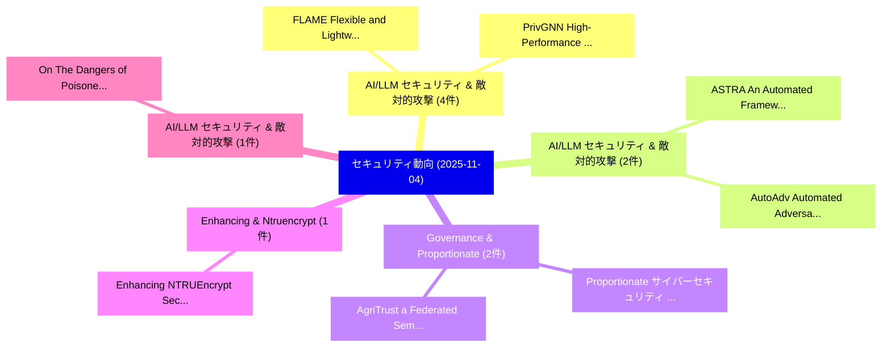

# 📅 02_daily: 日次エグゼクティブサマリー報告書 (2025-11-04)

**集計日時**: 2026-10-02 23:05:46 UTC  
**対象日付**: 2025-11-04  
**本日収集論文数**: 15 件  

---

## 💡 主要セキュリティ動向・脅威インサイト (Executive Insights)

本日の収集論文（計 15 件）において、以下の重点セキュリティ領域で活発な研究動向が確認されました：
- **AI/LLM セキュリティ & 敵対的攻撃** (4 件): 注目論文として 「FLAME: Flexible and Lightweigh...」、「PrivGNN: High-Performance Secu...」 等が発表され、実務防御および攻撃検証の進展が見られます。
- **AI/LLM セキュリティ & 敵対的攻撃** (2 件): 注目論文として 「ASTRA: An Automated Framework ...」、「AutoAdv: Automated Adversarial...」 等が発表され、実務防御および攻撃検証の進展が見られます。
- **Governance & Proportionate** (2 件): 注目論文として 「Proportionate サイバーセキュリティ for M...」、「AgriTrust: a Federated Semanti...」 等が発表され、実務防御および攻撃検証の進展が見られます。
- **Enhancing & Ntruencrypt** (1 件): 注目論文として 「Enhancing NTRUEncrypt Security...」 等が発表され、実務防御および攻撃検証の進展が見られます。
- **AI/LLM セキュリティ & 敵対的攻撃** (1 件): 注目論文として 「On The Dangers of Poisoned LLM...」 等が発表され、実務防御および攻撃検証の進展が見られます。

### 🗺️ 技術・脅威トピックマインドマップ

---

## 📌 日次セキュリティ論文一覧 (日本語表形式)

| No | arXiv ID | 論文タイトル (日本語訳) | 重要キーワード | 構造化エグゼクティブ要約 (背景・提案・影響) | 脅威分類 | 詳細リンク |
|---|---|---|---|---|---|---|
| 1 | `2511.02176v1` | [FLAME: Flexible and Lightweight Biometric Authentication Scheme in Malicious Environments（セキュリティ分析論文）](../../okf/papers/2025-11-04/2511.02176.md) | `Lightweight Biometric Authentication Scheme`, `Malicious Environments`, `Leo Yu Zhang` | 【提案】概要 (Overview & Key Finding) 本論文「FLAME: Flexible and Lightweight Biometric Authenticatio...。実証評価により経営層・セキュリティ管理者向け推奨アクション (E... | `cybersecurity` | [arXiv](https://arxiv.org/abs/2511.02176v1) &#124; [OKF](../../okf/papers/2025-11-04/2511.02176.md) |
| 2 | `2511.02185v1` | [PrivGNN: High-Performance Secure Inference for Cryptographic Graph Neural Networks（セキュリティ分析論文）](../../okf/papers/2025-11-04/2511.02185.md) | `Cryptographic Graph Neural Networks`, `Performance Secure Inference`, `High-Performance Secure` | 【提案】概要 (Overview & Key Finding) 本論文「PrivGNN: High-Performance Secure Inference for Cryptogr...。実証評価により経営層・セキュリティ管理者向け推奨アクション (E... | `executive-summary` | [arXiv](https://arxiv.org/abs/2511.02185v1) &#124; [OKF](../../okf/papers/2025-11-04/2511.02185.md) |
| 3 | `2511.02356v2` | [ASTRA: An Automated Framework for Strategy Discovery, Retrieval, and Evolution for Jailbreaking LLMs（セキュリティ分析論文）](../../okf/papers/2025-11-04/2511.02356.md) | `Strategy Discovery`, `Xu Liu`, `Yan Chen` | 【提案】概要 (Overview & Key Finding) 本論文「ASTRA: An Automated Framework for Strategy Discovery, R...。実証評価により経営層・セキュリティ管理者向け推奨アクション (E... | `executive-summary` | [arXiv](https://arxiv.org/abs/2511.02356v2) &#124; [OKF](../../okf/papers/2025-11-04/2511.02356.md) |
| 4 | `2511.02365v1` | [Enhancing NTRUEncrypt Security Using Markov Chain Monte Carlo Methods: Theory and Practice（セキュリティ分析論文）](../../okf/papers/2025-11-04/2511.02365.md) | `Security Using Markov Chain Monte Carlo Methods`, `Security Using Markov Ch`, `Edouard Filardo` | 【提案】概要 (Overview & Key Finding) 本論文「Enhancing NTRUEncrypt Security Using Markov Chain Monte...。実証評価により経営層・セキュリティ管理者向け推奨アクション (E... | `executive-summary` | [arXiv](https://arxiv.org/abs/2511.02365v1) &#124; [OKF](../../okf/papers/2025-11-04/2511.02365.md) |
| 5 | `2511.02376v3` | [AutoAdv: Automated Adversarial Prompting for Multi-Turn Jailbreaking of 大規模言語モデル](../../okf/papers/2025-11-04/2511.02376.md) | `Automated Adversarial Prompting`, `Turn Jailbreaking`, `Multi-Turn Jailbreaking` | 【提案】概要 (Overview & Key Finding) 本論文「AutoAdv: Automated Adversarial Prompting for Multi-Turn...。実証評価により経営層・セキュリティ管理者向け推奨アクション (E... | `cs.AI` | [arXiv](https://arxiv.org/abs/2511.02376v3) &#124; [OKF](../../okf/papers/2025-11-04/2511.02376.md) |
| 6 | `2511.02600v1` | [On The Dangers of Poisoned LLMs In Security Automation（セキュリティ分析論文）](../../okf/papers/2025-11-04/2511.02600.md) | `Patrick Karlsen`, `Even Eilertsen`, `Raw Meta` | 【提案】概要 (Overview & Key Finding) 本論文「On The Dangers of Poisoned LLMs In Security Automation（...。実証評価により経営層・セキュリティ管理者向け推奨アクション (E... | `cs.AI` | [arXiv](https://arxiv.org/abs/2511.02600v1) &#124; [OKF](../../okf/papers/2025-11-04/2511.02600.md) |
| 7 | `2511.02620v3` | [Verifying LLM Inference to Detect Model Weight Exfiltration（セキュリティ分析論文）](../../okf/papers/2025-11-04/2511.02620.md) | `Detect Model Weight Exfiltration`, `Roy Rinberg`, `Adam Karvonen` | 【提案】概要 (Overview & Key Finding) 本論文「Verifying LLM Inference to Detect Model Weight Exfiltra...。実証評価により経営層・セキュリティ管理者向け推奨アクション (E... | `executive-summary` | [arXiv](https://arxiv.org/abs/2511.02620v3) &#124; [OKF](../../okf/papers/2025-11-04/2511.02620.md) |
| 8 | `2511.02656v1` | [Bringing Private Reads to Hyperledger Fabric via Private Information Retrieval（セキュリティ分析論文）](../../okf/papers/2025-11-04/2511.02656.md) | `Bringing Private Reads`, `Private Information Retrieval`, `Hyperledger Fabric` | 【提案】概要 (Overview & Key Finding) 本論文「Bringing Private Reads to Hyperledger Fabric via Privat...。実証評価により経営層・セキュリティ管理者向け推奨アクション (E... | `cybersecurity` | [arXiv](https://arxiv.org/abs/2511.02656v1) &#124; [OKF](../../okf/papers/2025-11-04/2511.02656.md) |
| 9 | `2511.02780v3` | [PoCo: Agentic Proof-of-Concept Exploit Generation for Smart Contracts（セキュリティ分析論文）](../../okf/papers/2025-11-04/2511.02780.md) | `Concept Exploit Generation`, `Agentic Proof`, `Smart Contracts` | 【提案】概要 (Overview & Key Finding) 本論文「PoCo: Agentic Proof-of-Concept エクスプロイト Generation for ス...。実証評価により経営層・セキュリティ管理者向け推奨アクション (E... | `cs.AI` | [arXiv](https://arxiv.org/abs/2511.02780v3) &#124; [OKF](../../okf/papers/2025-11-04/2511.02780.md) |
| 10 | `2511.02894v3` | [Adaptive and Robust Data Poisoning Detection and Sanitization in Wearable IoT Systems using 大規模言語モデル](../../okf/papers/2025-11-04/2511.02894.md) | `Robust Data Poisoning Detection`, `Large Language Models`, `Ning Yang` | 【提案】概要 (Overview & Key Finding) 本論文「Adaptive and Robust Data Poisoning Detection and Saniti...。実証評価により経営層・セキュリティ管理者向け推奨アクション (E... | `executive-summary` | [arXiv](https://arxiv.org/abs/2511.02894v3) &#124; [OKF](../../okf/papers/2025-11-04/2511.02894.md) |
| 11 | `2511.02898v2` | [Proportionate サイバーセキュリティ for Micro-SMEs: A Governance Design Model under NIS2](../../okf/papers/2025-11-04/2511.02898.md) | `Governance Design Model`, `Proportionate Cybersecurity`, `Roberto Garrone` | 【提案】概要 (Overview & Key Finding) 本論文「Proportionate サイバーセキュリティ for Micro-SMEs: A Governance D...。実証評価により経営層・セキュリティ管理者向け推奨アクション (E... | `executive-summary` | [arXiv](https://arxiv.org/abs/2511.02898v2) &#124; [OKF](../../okf/papers/2025-11-04/2511.02898.md) |
| 12 | `2511.02924v2` | [Lightweight Session-Key Rekeying Framework for Secure IoT-Edge Communication（セキュリティ分析論文）](../../okf/papers/2025-11-04/2511.02924.md) | `Lightweight Session`, `Edge Communication`, `Session-Key Rekeying` | 【提案】概要 (Overview & Key Finding) 本論文「Lightweight Session-Key Rekeying Framework for Secure I...。実証評価により経営層・セキュリティ管理者向け推奨アクション (E... | `cybersecurity` | [arXiv](https://arxiv.org/abs/2511.02924v2) &#124; [OKF](../../okf/papers/2025-11-04/2511.02924.md) |
| 13 | `2511.02993v2` | [PrivyWave: Privacy-Aware Wireless Sensing of Heartbeat（セキュリティ分析論文）](../../okf/papers/2025-11-04/2511.02993.md) | `Aware Wireless Sensing`, `Privacy-Aware Wireless`, `Yixuan Gao` | 【提案】概要 (Overview & Key Finding) 本論文「PrivyWave: Privacy-Aware Wireless Sensing of Heartbeat（...。実証評価により経営層・セキュリティ管理者向け推奨アクション (E... | `executive-summary` | [arXiv](https://arxiv.org/abs/2511.02993v2) &#124; [OKF](../../okf/papers/2025-11-04/2511.02993.md) |
| 14 | `2511.03020v1` | [Exploratory Cyberattack Patterns on E-Commerce Platforms Using Statistical Methodsの分析](../../okf/papers/2025-11-04/2511.03020.md) | `E-Commerce Platforms`, `Commerce Platforms Using Statistical Methods`, `Commerce Platforms Using Statistical` | 【提案】概要 (Overview & Key Finding) 本論文「Exploratory Cyberattack Patterns on E-Commerce Platform...。実証評価により経営層・セキュリティ管理者向け推奨アクション (E... | `cs.AI` | [arXiv](https://arxiv.org/abs/2511.03020v1) &#124; [OKF](../../okf/papers/2025-11-04/2511.03020.md) |
| 15 | `2511.05572v1` | [AgriTrust: a Federated Semantic Governance Framework for Trusted Agricultural Data Sharing（セキュリティ分析論文）](../../okf/papers/2025-11-04/2511.05572.md) | `Trusted Agricultural Data Sharing`, `Ivan Bergier`, `Raw Meta` | 【提案】概要 (Overview & Key Finding) 本論文「AgriTrust: a Federated Semantic Governance Framework fo...。実証評価により経営層・セキュリティ管理者向け推奨アクション (E... | `cs.CE` | [arXiv](https://arxiv.org/abs/2511.05572v1) &#124; [OKF](../../okf/papers/2025-11-04/2511.05572.md) |

