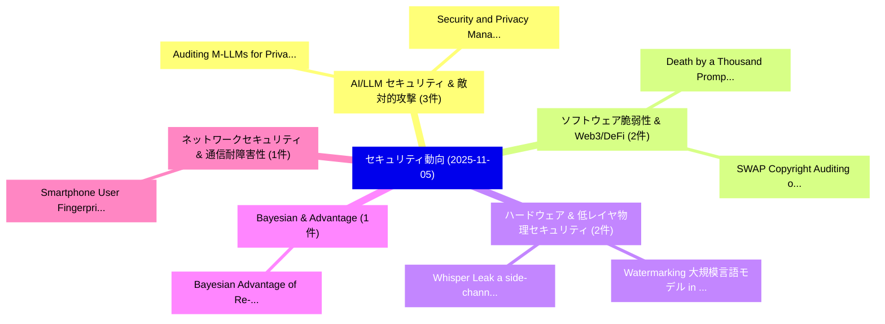

# 📅 02_daily: 日次エグゼクティブサマリー報告書 (2025-11-05)

**集計日時**: 2026-10-02 23:05:46 UTC  
**対象日付**: 2025-11-05  
**本日収集論文数**: 20 件  

---

## 💡 主要セキュリティ動向・脅威インサイト (Executive Insights)

本日の収集論文（計 20 件）において、以下の重点セキュリティ領域で活発な研究動向が確認されました：
- **AI/LLM セキュリティ & 敵対的攻撃** (3 件): 注目論文として 「Auditing M-LLMs for Privacy Ri...」、「Security and Privacy Managemen...」 等が発表され、実務防御および攻撃検証の進展が見られます。
- **ソフトウェア脆弱性 & Web3/DeFi** (2 件): 注目論文として 「Death by a Thousand Prompts: O...」、「SWAP: Copyright Auditing of So...」 等が発表され、実務防御および攻撃検証の進展が見られます。
- **ハードウェア & 低レイヤ物理セキュリティ** (2 件): 注目論文として 「Watermarking 大規模言語モデル in Europ...」、「Whisper Leak: a side-channel a...」 等が発表され、実務防御および攻撃検証の進展が見られます。
- **Bayesian & Advantage** (1 件): 注目論文として 「Bayesian Advantage of Re-Ident...」 等が発表され、実務防御および攻撃検証の進展が見られます。
- **ネットワークセキュリティ & 通信耐障害性** (1 件): 注目論文として 「Smartphone User Fingerprinting...」 等が発表され、実務防御および攻撃検証の進展が見られます。

### 🗺️ 技術・脅威トピックマインドマップ

---

## 📌 日次セキュリティ論文一覧 (日本語表形式)

| No | arXiv ID | 論文タイトル (日本語訳) | 重要キーワード | 構造化エグゼクティブ要約 (背景・提案・影響) | 脅威分類 | 詳細リンク |
|---|---|---|---|---|---|---|
| 1 | `2511.03213v1` | [Bayesian Advantage of Re-Identification Attack in the Shuffle Model（セキュリティ分析論文）](../../okf/papers/2025-11-05/2511.03213.md) | `Bayesian Advantage`, `Identification Attack`, `Shuffle Model` | 【提案】概要 (Overview & Key Finding) 本論文「Bayesian Advantage of Re-Identification Attack in the S...。実証評価により経営層・セキュリティ管理者向け推奨アクション (E... | `cybersecurity` | [arXiv](https://arxiv.org/abs/2511.03213v1) &#124; [OKF](../../okf/papers/2025-11-05/2511.03213.md) |
| 2 | `2511.03229v1` | [Smartphone User Fingerprinting on Wireless Traffic（セキュリティ分析論文）](../../okf/papers/2025-11-05/2511.03229.md) | `Smartphone User Fingerprinting`, `Wireless Traffic`, `Yong Huang` | 【提案】概要 (Overview & Key Finding) 本論文「Smartphone User Fingerprinting on Wireless Traffic（セキュリ...。実証評価により経営層・セキュリティ管理者向け推奨アクション (E... | `cybersecurity` | [arXiv](https://arxiv.org/abs/2511.03229v1) &#124; [OKF](../../okf/papers/2025-11-05/2511.03229.md) |
| 3 | `2511.03247v1` | [Death by a Thousand Prompts: Open Model Vulnerability Analysis（セキュリティ分析論文）](../../okf/papers/2025-11-05/2511.03247.md) | `Thousand Prompts`, `Harish Santhanalakshmi Ganesan`, `Amy Chang` | 【提案】概要 (Overview & Key Finding) 本論文「Death by a Thousand Prompts: Open Model 脆弱性 Analysis（セキ...。実証評価により経営層・セキュリティ管理者向け推奨アクション (E... | `executive-summary` | [arXiv](https://arxiv.org/abs/2511.03247v1) &#124; [OKF](../../okf/papers/2025-11-05/2511.03247.md) |
| 4 | `2511.03248v2` | [Auditing M-LLMs for Privacy Risks: A Synthetic Benchmark and Evaluation Framework（セキュリティ分析論文）](../../okf/papers/2025-11-05/2511.03248.md) | `Privacy Risks`, `Synthetic Benchmark`, `Junhao Li` | 【提案】概要 (Overview & Key Finding) 本論文「Auditing M-LLMs for Privacy Risks: A Synthetic Benchmar...。実証評価により経営層・セキュリティ管理者向け推奨アクション (E... | `cybersecurity` | [arXiv](https://arxiv.org/abs/2511.03248v2) &#124; [OKF](../../okf/papers/2025-11-05/2511.03248.md) |
| 5 | `2511.03271v1` | [Let the Bees Find the Weak Spots: A Path Planning Perspective on Multi-Turn Jailbreak Attacks against LLMs（セキュリティ分析論文）](../../okf/papers/2025-11-05/2511.03271.md) | `Path Planning Perspective`, `Turn Jailbreak Attacks`, `Bees Find` | 【提案】概要 (Overview & Key Finding) 本論文「Let the Bees Find the Weak Spots: A Path Planning Persp...。実証評価により経営層・セキュリティ管理者向け推奨アクション (E... | `executive-summary` | [arXiv](https://arxiv.org/abs/2511.03271v1) &#124; [OKF](../../okf/papers/2025-11-05/2511.03271.md) |
| 6 | `2511.03319v1` | [Two thousand years of the oracle problem. Insights from Ancient Delphi on the future of blockchain oracles（セキュリティ分析論文）](../../okf/papers/2025-11-05/2511.03319.md) | `Ancient Delphi`, `Giulio Caldarelli`, `Massimiliano Ornaghi` | 【提案】Insights from Ancient Delphi on the future of blockchain oracles ### (日本語題名: Two thousa...。実証評価により経営層・セキュリティ管理者向け推奨アクション (E... | `executive-summary` | [arXiv](https://arxiv.org/abs/2511.03319v1) &#124; [OKF](../../okf/papers/2025-11-05/2511.03319.md) |
| 7 | `2511.03341v1` | [LaMoS: Enabling Efficient Large Number Modular Multiplication through SRAM-based CiM Acceleration（セキュリティ分析論文）](../../okf/papers/2025-11-05/2511.03341.md) | `Enabling Efficient Large Number Modular Multiplication`, `SRAM-based CiM`, `Haomin Li` | 【提案】概要 (Overview & Key Finding) 本論文「LaMoS: Enabling Efficient Large Number Modular Multipli...。実証評価により経営層・セキュリティ管理者向け推奨アクション (E... | `executive-summary` | [arXiv](https://arxiv.org/abs/2511.03341v1) &#124; [OKF](../../okf/papers/2025-11-05/2511.03341.md) |
| 8 | `2511.03486v2` | [Federated Anonymous Blocklisting across Service Providers and its Application to Group Messaging（セキュリティ分析論文）](../../okf/papers/2025-11-05/2511.03486.md) | `Federated Anonymous Blocklisting`, `Service Providers`, `Group Messaging` | 【提案】概要 (Overview & Key Finding) 本論文「Federated Anonymous Blocklisting across Service Provide...。実証評価により経営層・セキュリティ管理者向け推奨アクション (E... | `cybersecurity` | [arXiv](https://arxiv.org/abs/2511.03486v2) &#124; [OKF](../../okf/papers/2025-11-05/2511.03486.md) |
| 9 | `2511.03538v1` | [Security and Privacy Management of IoT Using Quantum Computing（セキュリティ分析論文）](../../okf/papers/2025-11-05/2511.03538.md) | `Using Quantum Computing`, `Privacy Management`, `Jaydip Sen` | 【提案】概要 (Overview & Key Finding) 本論文「Security and Privacy Management of IoT Using 量子 Computi...。実証評価により経営層・セキュリティ管理者向け推奨アクション (E... | `cybersecurity` | [arXiv](https://arxiv.org/abs/2511.03538v1) &#124; [OKF](../../okf/papers/2025-11-05/2511.03538.md) |
| 10 | `2511.03622v1` | [Multi-robot searching with limited sensing range for static and mobile intruders（セキュリティ分析論文）](../../okf/papers/2025-11-05/2511.03622.md) | `Multi-robot searching`, `Swadhin Agrawal`, `Sujoy Bhore` | 【提案】概要 (Overview & Key Finding) 本論文「Multi-robot searching with limited sensing range for st...。実証評価により経営層・セキュリティ管理者向け推奨アクション (E... | `executive-summary` | [arXiv](https://arxiv.org/abs/2511.03622v1) &#124; [OKF](../../okf/papers/2025-11-05/2511.03622.md) |
| 11 | `2511.03641v1` | [Watermarking 大規模言語モデル in Europe: Interpreting the AI Act in Light of Technology](../../okf/papers/2025-11-05/2511.03641.md) | `Watermarking Large Language Models`, `Thomas Souverain`, `Raw Meta` | 【提案】概要 (Overview & Key Finding) 本論文「Watermarking 大規模言語モデル in Europe: Interpreting the AI Ac...。実証評価により経営層・セキュリティ管理者向け推奨アクション (E... | `cs.AI` | [arXiv](https://arxiv.org/abs/2511.03641v1) &#124; [OKF](../../okf/papers/2025-11-05/2511.03641.md) |
| 12 | `2511.03675v1` | [Whisper Leak: a side-channel attack on 大規模言語モデル](../../okf/papers/2025-11-05/2511.03675.md) | `Whisper Leak`, `side-channel attack`, `Large Language Models` | 【提案】概要 (Overview & Key Finding) 本論文「Whisper Leak: a サイドチャネル攻撃 on 大規模言語モデル」（原題: Whisper Leak...。実証評価により経営層・セキュリティ管理者向け推奨アクション (E... | `cs.AI` | [arXiv](https://arxiv.org/abs/2511.03675v1) &#124; [OKF](../../okf/papers/2025-11-05/2511.03675.md) |
| 13 | `2511.03799v1` | [Temporal Analysis Framework for Intrusion Detection Systems: A Novel Taxonomy for Time-Aware サイバーセキュリティ](../../okf/papers/2025-11-05/2511.03799.md) | `Intrusion Detection Systems`, `Aware Cybersecurity`, `Time-Aware Cybersecurity` | 【提案】概要 (Overview & Key Finding) 本論文「Temporal Analysis Framework for Intrusion Detection Sys...。実証評価により経営層・セキュリティ管理者向け推奨アクション (E... | `cybersecurity` | [arXiv](https://arxiv.org/abs/2511.03799v1) &#124; [OKF](../../okf/papers/2025-11-05/2511.03799.md) |
| 14 | `2511.03816v1` | [Just in Plain Sight: Unveiling CSAM Distribution Campaigns on the Clear Web（セキュリティ分析論文）](../../okf/papers/2025-11-05/2511.03816.md) | `Plain Sight`, `Distribution Campaigns`, `Clear Web` | 【提案】概要 (Overview & Key Finding) 本論文「Just in Plain Sight: Unveiling CSAM Distribution Campai...。実証評価により経営層・セキュリティ管理者向け推奨アクション (E... | `executive-summary` | [arXiv](https://arxiv.org/abs/2511.03816v1) &#124; [OKF](../../okf/papers/2025-11-05/2511.03816.md) |
| 15 | `2511.03825v1` | [How Different Tokenization Algorithms Impact LLMs and Transformer Models for Binary Code Analysis（セキュリティ分析論文）](../../okf/papers/2025-11-05/2511.03825.md) | `Transformer Models`, `Raisul Arefin Nahid`, `Ahmed Mostafa` | 【提案】概要 (Overview & Key Finding) 本論文「How Different Tokenization Algorithms Impact LLMs and T...。実証評価により経営層・セキュリティ管理者向け推奨アクション (E... | `cs.AI` | [arXiv](https://arxiv.org/abs/2511.03825v1) &#124; [OKF](../../okf/papers/2025-11-05/2511.03825.md) |
| 16 | `2511.03841v1` | [Security Agentic AI Communication Protocols: A Comparative Evaluationの分析](../../okf/papers/2025-11-05/2511.03841.md) | `Communication Protocols`, `Security Agentic`, `Yedidel Louck` | 【提案】概要 (Overview & Key Finding) 本論文「Security Agentic AI Communication Protocols: A Comparat...。実証評価により経営層・セキュリティ管理者向け推奨アクション (E... | `cybersecurity` | [arXiv](https://arxiv.org/abs/2511.03841v1) &#124; [OKF](../../okf/papers/2025-11-05/2511.03841.md) |
| 17 | `2511.03898v1` | [Secure Code Generation at Scale with Reflexion（セキュリティ分析論文）](../../okf/papers/2025-11-05/2511.03898.md) | `Secure Code Generation`, `Arup Datta`, `Ahmed Aljohani` | 【提案】概要 (Overview & Key Finding) 本論文「Secure Code Generation at Scale with Reflexion（セキュリティ分析...。実証評価により経営層・セキュリティ管理者向け推奨アクション (E... | `cs.CE` | [arXiv](https://arxiv.org/abs/2511.03898v1) &#124; [OKF](../../okf/papers/2025-11-05/2511.03898.md) |
| 18 | `2511.04707v2` | [Jailbreaking in the Haystack（セキュリティ分析論文）](../../okf/papers/2025-11-05/2511.04707.md) | `Rishi Rajesh Shah`, `Chen Henry Wu`, `Shashwat Saxena` | 【提案】概要 (Overview & Key Finding) 本論文「ジェイルブレイクing in the Haystack（セキュリティ分析論文）」（原題: ジェイルブレイクin...。実証評価により経営層・セキュリティ管理者向け推奨アクション (E... | `AI/ML Security` | [arXiv](https://arxiv.org/abs/2511.04707v2) &#124; [OKF](../../okf/papers/2025-11-05/2511.04707.md) |
| 19 | `2511.04711v2` | [SWAP: Copyright Auditing of Soft Prompts via Sequential Watermarkingに向けて](../../okf/papers/2025-11-05/2511.04711.md) | `Soft Prompts`, `Towards Copyright Auditing`, `Sequential Watermarking` | 【提案】概要 (Overview & Key Finding) 本論文「SWAP: Copyright Auditing of Soft Prompts via Sequential...。実証評価により経営層・セキュリティ管理者向け推奨アクション (E... | `cs.AI` | [arXiv](https://arxiv.org/abs/2511.04711v2) &#124; [OKF](../../okf/papers/2025-11-05/2511.04711.md) |
| 20 | `2511.05598v1` | [Diffusion-Based Image Editing: An Unforeseen Adversary to Robust Invisible Watermarks（セキュリティ分析論文）](../../okf/papers/2025-11-05/2511.05598.md) | `Based Image Editing`, `Robust Invisible Watermarks`, `Diffusion-Based Image` | 【提案】概要 (Overview & Key Finding) 本論文「Diffusion-Based Image Editing: An Unforeseen Adversary ...。実証評価により経営層・セキュリティ管理者向け推奨アクション (E... | `executive-summary` | [arXiv](https://arxiv.org/abs/2511.05598v1) &#124; [OKF](../../okf/papers/2025-11-05/2511.05598.md) |

