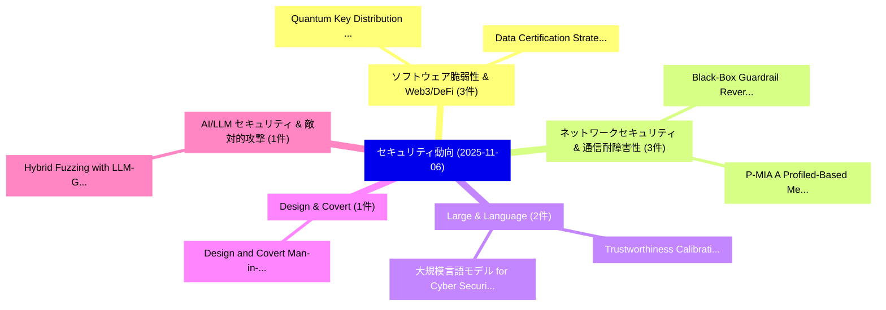

# 📅 02_daily: 日次エグゼクティブサマリー報告書 (2025-11-06)

**集計日時**: 2026-10-02 23:05:46 UTC  
**対象日付**: 2025-11-06  
**本日収集論文数**: 24 件  

---

## 💡 主要セキュリティ動向・脅威インサイト (Executive Insights)

本日の収集論文（計 24 件）において、以下の重点セキュリティ領域で活発な研究動向が確認されました：
- **ソフトウェア脆弱性 & Web3/DeFi** (3 件): 注目論文として 「Quantum Key Distribution via C...」、「Data Certification Strategies ...」 等が発表され、実務防御および攻撃検証の進展が見られます。
- **ネットワークセキュリティ & 通信耐障害性** (3 件): 注目論文として 「Black-Box Guardrail Reverse-en...」、「P-MIA: A Profiled-Based Member...」 等が発表され、実務防御および攻撃検証の進展が見られます。
- **Large & Language** (2 件): 注目論文として 「大規模言語モデル for Cyber Security」、「Trustworthiness Calibration Fr...」 等が発表され、実務防御および攻撃検証の進展が見られます。
- **Design & Covert** (1 件): 注目論文として 「Design and Covert Man-in-the-M...」 等が発表され、実務防御および攻撃検証の進展が見られます。
- **AI/LLM セキュリティ & 敵対的攻撃** (1 件): 注目論文として 「Hybrid Fuzzing with LLM-Guided...」 等が発表され、実務防御および攻撃検証の進展が見られます。

### 🗺️ 技術・脅威トピックマインドマップ

---

## 📌 日次セキュリティ論文一覧 (日本語表形式)

| No | arXiv ID | 論文タイトル (日本語訳) | 重要キーワード | 構造化エグゼクティブ要約 (背景・提案・影響) | 脅威分類 | 詳細リンク |
|---|---|---|---|---|---|---|
| 1 | `2511.03971v1` | [Design and Covert Man-in-the-Middle Cyberattacks on Water Treatment Plantsの検出](../../okf/papers/2025-11-06/2511.03971.md) | `Covert Man`, `Middle Cyberattacks`, `the-Middle Cyberattacks` | 【提案】概要 (Overview & Key Finding) 本論文「Design and Covert 中間者攻撃 Cyberattacks on Water Treatment...。実証評価により経営層・セキュリティ管理者向け推奨アクション (E... | `executive-summary` | [arXiv](https://arxiv.org/abs/2511.03971v1) &#124; [OKF](../../okf/papers/2025-11-06/2511.03971.md) |
| 2 | `2511.03995v1` | [Hybrid Fuzzing with LLM-Guided Input Mutation and Semantic Feedback（セキュリティ分析論文）](../../okf/papers/2025-11-06/2511.03995.md) | `Guided Input Mutation`, `Hybrid Fuzzing`, `Semantic Feedback` | 【提案】概要 (Overview & Key Finding) 本論文「Hybrid Fuzzing with LLM-Guided Input Mutation and Seman...。実証評価により経営層・セキュリティ管理者向け推奨アクション (E... | `cs.AI` | [arXiv](https://arxiv.org/abs/2511.03995v1) &#124; [OKF](../../okf/papers/2025-11-06/2511.03995.md) |
| 3 | `2511.04014v2` | [VulInstruct: Teaching LLMs Root-Cause Reasoning for 脆弱性検出 via Security Specifications](../../okf/papers/2025-11-06/2511.04014.md) | `Cause Reasoning`, `Root-Cause Reasoning`, `Security Specifications` | 【提案】概要 (Overview & Key Finding) 本論文「VulInstruct: Teaching LLMs Root-Cause Reasoning for 脆弱性...。実証評価により経営層・セキュリティ管理者向け推奨アクション (E... | `executive-summary` | [arXiv](https://arxiv.org/abs/2511.04014v2) &#124; [OKF](../../okf/papers/2025-11-06/2511.04014.md) |
| 4 | `2511.04021v2` | [OTS-PC: OTS-based Payment Channels for the Lightning Network（セキュリティ分析論文）](../../okf/papers/2025-11-06/2511.04021.md) | `Payment Channels`, `Lightning Network`, `OTS-based Payment` | 【提案】概要 (Overview & Key Finding) 本論文「OTS-PC: OTS-based Payment Channels for the Lightning Ne...。実証評価により経営層・セキュリティ管理者向け推奨アクション (E... | `cs.NI` | [arXiv](https://arxiv.org/abs/2511.04021v2) &#124; [OKF](../../okf/papers/2025-11-06/2511.04021.md) |
| 5 | `2511.04023v1` | [LLM-Driven Adaptive Source-Sink Identification and False Positive Mitigation for Static Analysis（セキュリティ分析論文）](../../okf/papers/2025-11-06/2511.04023.md) | `Driven Adaptive Source`, `False Positive Mitigation`, `Sink Identification` | 【提案】概要 (Overview & Key Finding) 本論文「LLM-Driven Adaptive Source-Sink Identification and Fals...。実証評価により経営層・セキュリティ管理者向け推奨アクション (E... | `executive-summary` | [arXiv](https://arxiv.org/abs/2511.04023v1) &#124; [OKF](../../okf/papers/2025-11-06/2511.04023.md) |
| 6 | `2511.04114v1` | [Automated and Explainable Denial of Service Analysis for AI-Driven Intrusion Detection Systems（セキュリティ分析論文）](../../okf/papers/2025-11-06/2511.04114.md) | `Driven Intrusion Detection Systems`, `Explainable Denial`, `AI-Driven Intrusion` | 【提案】概要 (Overview & Key Finding) 本論文「Automated and Explainable サービス運用妨害 Analysis for AI-Driv...。実証評価により経営層・セキュリティ管理者向け推奨アクション (E... | `cs.AI` | [arXiv](https://arxiv.org/abs/2511.04114v1) &#124; [OKF](../../okf/papers/2025-11-06/2511.04114.md) |
| 7 | `2511.04135v3` | [List Decoding of Reed-Solomon Codes and Folded Reed-Solomon Codes Over Galois Ring（セキュリティ分析論文）](../../okf/papers/2025-11-06/2511.04135.md) | `Reed-Solomon Codes`, `List Decoding`, `Solomon Codes` | 【提案】概要 (Overview & Key Finding) 本論文「List Decoding of Reed-Solomon Codes and Folded Reed-Sol...。実証評価により経営層・セキュリティ管理者向け推奨アクション (E... | `executive-summary` | [arXiv](https://arxiv.org/abs/2511.04135v3) &#124; [OKF](../../okf/papers/2025-11-06/2511.04135.md) |
| 8 | `2511.04188v4` | [Quantum Key Distribution via Charge Teleportation（セキュリティ分析論文）](../../okf/papers/2025-11-06/2511.04188.md) | `Quantum Key Distribution`, `Charge Teleportation`, `Amir Yona` | 【提案】概要 (Overview & Key Finding) 本論文「量子鍵配送 via Charge Teleportation（セキュリティ分析論文）」（原題: 量子鍵配送 v...。実証評価により経営層・セキュリティ管理者向け推奨アクション (E... | `executive-summary` | [arXiv](https://arxiv.org/abs/2511.04188v4) &#124; [OKF](../../okf/papers/2025-11-06/2511.04188.md) |
| 9 | `2511.04215v1` | [Black-Box Guardrail Reverse-engineering Attack（セキュリティ分析論文）](../../okf/papers/2025-11-06/2511.04215.md) | `Box Guardrail Reverse`, `Black-Box Guardrail`, `Reverse-engineering Attack` | 【提案】概要 (Overview & Key Finding) 本論文「Black-Box Guardrail Reverse-engineering Attack（セキュリティ分析...。実証評価により経営層・セキュリティ管理者向け推奨アクション (E... | `executive-summary` | [arXiv](https://arxiv.org/abs/2511.04215v1) &#124; [OKF](../../okf/papers/2025-11-06/2511.04215.md) |
| 10 | `2511.04250v2` | [Communication Complexity of Distributed Unitary Synthesis（セキュリティ分析論文）](../../okf/papers/2025-11-06/2511.04250.md) | `Distributed Unitary Synthesis`, `Communication Complexity`, `Longcheng Li` | 【提案】概要 (Overview & Key Finding) 本論文「Communication Complexity of Distributed Unitary Synthes...。実証評価により経営層・セキュリティ管理者向け推奨アクション (E... | `executive-summary` | [arXiv](https://arxiv.org/abs/2511.04250v2) &#124; [OKF](../../okf/papers/2025-11-06/2511.04250.md) |
| 11 | `2511.04261v1` | [A Parallel Region-Adaptive Differential Privacy Framework for Image Pixelization（セキュリティ分析論文）](../../okf/papers/2025-11-06/2511.04261.md) | `Parallel Region`, `Image Pixelization`, `Region-Adaptive Differential` | 【提案】概要 (Overview & Key Finding) 本論文「A Parallel Region-Adaptive 差分プライバシー Framework for Image...。実証評価により経営層・セキュリティ管理者向け推奨アクション (E... | `cybersecurity` | [arXiv](https://arxiv.org/abs/2511.04261v1) &#124; [OKF](../../okf/papers/2025-11-06/2511.04261.md) |
| 12 | `2511.04332v1` | [Differentially Private In-Context Learning with Nearest Neighbor Search（セキュリティ分析論文）](../../okf/papers/2025-11-06/2511.04332.md) | `Nearest Neighbor Search`, `Context Learning`, `In-Context Learning` | 【提案】概要 (Overview & Key Finding) 本論文「Differentially Private In-Context Learning with Nearest...。実証評価により経営層・セキュリティ管理者向け推奨アクション (E... | `cs.AI` | [arXiv](https://arxiv.org/abs/2511.04332v1) &#124; [OKF](../../okf/papers/2025-11-06/2511.04332.md) |
| 13 | `2511.04399v2` | [Tight a One-Shot Quantum Secret Sharing Schemeの分析](../../okf/papers/2025-11-06/2511.04399.md) | `One-Shot Quantum`, `Shot Quantum Secret Sharing Scheme`, `Shot Quantum Secret Sharing` | 【提案】概要 (Overview & Key Finding) 本論文「Tight a One-Shot 量子 Secret Sharing Schemeの分析」（原題: Tight...。実証評価により経営層・セキュリティ管理者向け推奨アクション (E... | `executive-summary` | [arXiv](https://arxiv.org/abs/2511.04399v2) &#124; [OKF](../../okf/papers/2025-11-06/2511.04399.md) |
| 14 | `2511.04409v1` | [Data Certification Strategies for Blockchain-based Traceability Systems（セキュリティ分析論文）](../../okf/papers/2025-11-06/2511.04409.md) | `Data Certification Strategies`, `Traceability Systems`, `Blockchain-based Traceability` | 【提案】概要 (Overview & Key Finding) 本論文「Data Certification Strategies for Blockchain-based Trac...。実証評価により経営層・セキュリティ管理者向け推奨アクション (E... | `cybersecurity` | [arXiv](https://arxiv.org/abs/2511.04409v1) &#124; [OKF](../../okf/papers/2025-11-06/2511.04409.md) |
| 15 | `2511.04440v1` | [Adversarially Robust and Interpretable Magecart マルウェア検出](../../okf/papers/2025-11-06/2511.04440.md) | `Adversarially Robust`, `Interpretable Magecart Malware Detection`, `Interpretable Magecart` | 【提案】概要 (Overview & Key Finding) 本論文「Adversarially Robust and Interpretable Magecart マルウェア検出...。実証評価により経営層・セキュリティ管理者向け推奨アクション (E... | `cybersecurity` | [arXiv](https://arxiv.org/abs/2511.04440v1) &#124; [OKF](../../okf/papers/2025-11-06/2511.04440.md) |
| 16 | `2511.04472v3` | [Evading and crashing anti-malware solutions via data collection overloading during analysis serialization（セキュリティ分析論文）](../../okf/papers/2025-11-06/2511.04472.md) | `anti-malware solutions`, `Evgenios Gkritsis`, `Constantinos Patsakis` | 【提案】概要 (Overview & Key Finding) 本論文「Evading and crashing anti-マルウェア solutions via data coll...。実証評価により経営層・セキュリティ管理者向け推奨アクション (E... | `cybersecurity` | [arXiv](https://arxiv.org/abs/2511.04472v3) &#124; [OKF](../../okf/papers/2025-11-06/2511.04472.md) |
| 17 | `2511.04508v1` | [大規模言語モデル for Cyber Security](../../okf/papers/2025-11-06/2511.04508.md) | `Cyber Security`, `Large Language Models`, `Aswani Kumar Cherukuri` | 【提案】概要 (Overview & Key Finding) 本論文「大規模言語モデル for Cyber Security」（原題: Large Language Models ...。実証評価により経営層・セキュリティ管理者向け推奨アクション (E... | `cybersecurity` | [arXiv](https://arxiv.org/abs/2511.04508v1) &#124; [OKF](../../okf/papers/2025-11-06/2511.04508.md) |
| 18 | `2511.04550v1` | [Confidential Computing for Cloud Security: Exploring Hardware based Encryption Using Trusted Execution Environments（セキュリティ分析論文）](../../okf/papers/2025-11-06/2511.04550.md) | `Encryption Using Trusted Execution Environments`, `Confidential Computing`, `Cloud Security` | 【提案】概要 (Overview & Key Finding) 本論文「Confidential Computing for Cloud Security: Exploring Ha...。実証評価により経営層・セキュリティ管理者向け推奨アクション (E... | `executive-summary` | [arXiv](https://arxiv.org/abs/2511.04550v1) &#124; [OKF](../../okf/papers/2025-11-06/2511.04550.md) |
| 19 | `2511.04633v2` | [Unclonable Cryptography in Linear Quantum Memory（セキュリティ分析論文）](../../okf/papers/2025-11-06/2511.04633.md) | `Linear Quantum Memory`, `Unclonable Cryptography`, `Omri Shmueli` | 【提案】概要 (Overview & Key Finding) 本論文「Unclonable 暗号技術 in Linear 量子 Memory（セキュリティ分析論文）」（原題: Un...。実証評価により経営層・セキュリティ管理者向け推奨アクション (E... | `executive-summary` | [arXiv](https://arxiv.org/abs/2511.04633v2) &#124; [OKF](../../okf/papers/2025-11-06/2511.04633.md) |
| 20 | `2511.04716v1` | [P-MIA: A Profiled-Based Membership Inference Attack on Cognitive Diagnosis Models（セキュリティ分析論文）](../../okf/papers/2025-11-06/2511.04716.md) | `Based Membership Inference Attack`, `Cognitive Diagnosis Models`, `Profiled-Based Membership` | 【提案】概要 (Overview & Key Finding) 本論文「P-MIA: A Profiled-Based Membership Inference Attack on ...。実証評価により経営層・セキュリティ管理者向け推奨アクション (E... | `cs.AI` | [arXiv](https://arxiv.org/abs/2511.04716v1) &#124; [OKF](../../okf/papers/2025-11-06/2511.04716.md) |
| 21 | `2511.04728v1` | [Trustworthiness Calibration Framework for Phishing Email Detection Using 大規模言語モデル](../../okf/papers/2025-11-06/2511.04728.md) | `Phishing Email Detection Using Large Language Models`, `Phishing Email Detection Using`, `Daniyal Ganiuly` | 【提案】概要 (Overview & Key Finding) 本論文「Trustworthiness Calibration Framework for Phishing Emai...。実証評価により経営層・セキュリティ管理者向け推奨アクション (E... | `cs.AI` | [arXiv](https://arxiv.org/abs/2511.04728v1) &#124; [OKF](../../okf/papers/2025-11-06/2511.04728.md) |
| 22 | `2511.04842v1` | [Security Evaluation of Quantum Circuit Split Compilation under an Oracle-Guided Attack（セキュリティ分析論文）](../../okf/papers/2025-11-06/2511.04842.md) | `Quantum Circuit Split Compilation`, `Guided Attack`, `Oracle-Guided Attack` | 【提案】概要 (Overview & Key Finding) 本論文「Security Evaluation of 量子 Circuit Split Compilation und...。実証評価により経営層・セキュリティ管理者向け推奨アクション (E... | `executive-summary` | [arXiv](https://arxiv.org/abs/2511.04842v1) &#124; [OKF](../../okf/papers/2025-11-06/2511.04842.md) |
| 23 | `2511.04860v2` | [GPT-5 at CTFs: Case Studies From Top-Tier サイバーセキュリティ Events](../../okf/papers/2025-11-06/2511.04860.md) | `Tier Cybersecurity Events`, `Top-Tier Cybersecurity`, `Artem Petrov` | 【提案】概要 (Overview & Key Finding) 本論文「GPT-5 at CTFs: Case Studies From Top-Tier サイバーセキュリティ Ev...。実証評価により経営層・セキュリティ管理者向け推奨アクション (E... | `cybersecurity` | [arXiv](https://arxiv.org/abs/2511.04860v2) &#124; [OKF](../../okf/papers/2025-11-06/2511.04860.md) |
| 24 | `2511.04882v1` | [Bit-Flipping Attack Exploration and Countermeasure in 5G Network（セキュリティ分析論文）](../../okf/papers/2025-11-06/2511.04882.md) | `Flipping Attack Exploration`, `Bit-Flipping Attack`, `Joon Kim` | 【提案】概要 (Overview & Key Finding) 本論文「Bit-Flipping Attack Exploration and Countermeasure in 5...。実証評価により経営層・セキュリティ管理者向け推奨アクション (E... | `cs.NI` | [arXiv](https://arxiv.org/abs/2511.04882v1) &#124; [OKF](../../okf/papers/2025-11-06/2511.04882.md) |

