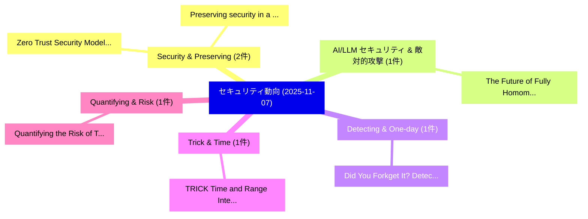

# 📅 02_daily: 日次エグゼクティブサマリー報告書 (2025-11-07)

**集計日時**: 2026-10-02 23:05:46 UTC  
**対象日付**: 2025-11-07  
**本日収集論文数**: 17 件  

---

## 💡 主要セキュリティ動向・脅威インサイト (Executive Insights)

本日の収集論文（計 17 件）において、以下の重点セキュリティ領域で活発な研究動向が確認されました：
- **Security & Preserving** (2 件): 注目論文として 「Zero Trust Security Model Impl...」、「Preserving security in a world...」 等が発表され、実務防御および攻撃検証の進展が見られます。
- **AI/LLM セキュリティ & 敵対的攻撃** (1 件): 注目論文として 「The Future of Fully Homomorphi...」 等が発表され、実務防御および攻撃検証の進展が見られます。
- **Detecting & One-day** (1 件): 注目論文として 「Did You Forkget It? Detecting ...」 等が発表され、実務防御および攻撃検証の進展が見られます。
- **Trick & Time** (1 件): 注目論文として 「TRICK: Time and Range Integrit...」 等が発表され、実務防御および攻撃検証の進展が見られます。
- **Quantifying & Risk** (1 件): 注目論文として 「Quantifying the Risk of Transf...」 等が発表され、実務防御および攻撃検証の進展が見られます。

### 🗺️ 技術・脅威トピックマインドマップ

---

## 📌 日次セキュリティ論文一覧 (日本語表形式)

| No | arXiv ID | 論文タイトル (日本語訳) | 重要キーワード | 構造化エグゼクティブ要約 (背景・提案・影響) | 脅威分類 | 詳細リンク |
|---|---|---|---|---|---|---|
| 1 | `2511.04925v1` | [Zero Trust Security Model Implementation in Microservices Architectures Using Identity Federation（セキュリティ分析論文）](../../okf/papers/2025-11-07/2511.04925.md) | `Zero Trust Security Model Implementation`, `Microservices Architectures Using Identity Federation`, `Microservices Architectures Using Identity Federat` | 【提案】概要 (Overview & Key Finding) 本論文「ゼロトラスト Security Model Implementation in Microservices A...。実証評価により経営層・セキュリティ管理者向け推奨アクション (E... | `cybersecurity` | [arXiv](https://arxiv.org/abs/2511.04925v1) &#124; [OKF](../../okf/papers/2025-11-07/2511.04925.md) |
| 2 | `2511.04946v1` | [The Future of Fully Homomorphic Encryption System: from a Storage I/O Perspective（セキュリティ分析論文）](../../okf/papers/2025-11-07/2511.04946.md) | `Fully Homomorphic Encryption System`, `Lei Chen`, `Erci Xu` | 【提案】概要 (Overview & Key Finding) 本論文「The Future of Fully 準同型暗号 System: from a Storage I/O Pe...。実証評価により経営層・セキュリティ管理者向け推奨アクション (E... | `executive-summary` | [arXiv](https://arxiv.org/abs/2511.04946v1) &#124; [OKF](../../okf/papers/2025-11-07/2511.04946.md) |
| 3 | `2511.05097v2` | [Did You Forkget It? Detecting One-Day Vulnerabilities in Open-source ForksWith Global History Analysis（セキュリティ分析論文）](../../okf/papers/2025-11-07/2511.05097.md) | `Detecting One`, `Day Vulnerabilities`, `One-Day Vulnerabilities` | 【提案】Detecting One-Day Vulnerabilities in Open-source ForksWith Global History Analysis ### ...。実証評価により経営層・セキュリティ管理者向け推奨アクション (E... | `executive-summary` | [arXiv](https://arxiv.org/abs/2511.05097v2) &#124; [OKF](../../okf/papers/2025-11-07/2511.05097.md) |
| 4 | `2511.05100v1` | [TRICK: Time and Range Integrity ChecK using Low Earth Orbiting Satellite for GNSSのセキュリティ強化](../../okf/papers/2025-11-07/2511.05100.md) | `Low Earth Orbiting Satellite`, `Range Integrity`, `Arslan Mumtaz` | 【提案】概要 (Overview & Key Finding) 本論文「TRICK: Time and Range Integrity ChecK using Low Earth O...。実証評価により経営層・セキュリティ管理者向け推奨アクション (E... | `cybersecurity` | [arXiv](https://arxiv.org/abs/2511.05100v1) &#124; [OKF](../../okf/papers/2025-11-07/2511.05100.md) |
| 5 | `2511.05102v1` | [Quantifying the Risk of Transferred Black Box Attacks（セキュリティ分析論文）](../../okf/papers/2025-11-07/2511.05102.md) | `Transferred Black Box Attacks`, `Disesdi Susanna Cox`, `Niklas Bunzel` | 【提案】概要 (Overview & Key Finding) 本論文「Quantifying the Risk of Transferred Black Box Attacks（セ...。実証評価により経営層・セキュリティ管理者向け推奨アクション (E... | `cs.CV` | [arXiv](https://arxiv.org/abs/2511.05102v1) &#124; [OKF](../../okf/papers/2025-11-07/2511.05102.md) |
| 6 | `2511.05110v2` | [PhantomFetch: Obfuscating Loads against Prefetcher Side-Channel Attacks（セキュリティ分析論文）](../../okf/papers/2025-11-07/2511.05110.md) | `Obfuscating Loads`, `Prefetcher Side`, `Channel Attacks` | 【提案】概要 (Overview & Key Finding) 本論文「PhantomFetch: Obfuscating Loads against Prefetcher サイドチ...。実証評価により経営層・セキュリティ管理者向け推奨アクション (E... | `executive-summary` | [arXiv](https://arxiv.org/abs/2511.05110v2) &#124; [OKF](../../okf/papers/2025-11-07/2511.05110.md) |
| 7 | `2511.05111v1` | [Confidentiality in a Card-Based Protocol Under Repeated Biased Shuffles（セキュリティ分析論文）](../../okf/papers/2025-11-07/2511.05111.md) | `Card-Based Protocol`, `Ahmet Cetinkaya`, `Raw Meta` | 【提案】概要 (Overview & Key Finding) 本論文「Confidentiality in a Card-Based Protocol Under Repeated...。実証評価により経営層・セキュリティ管理者向け推奨アクション (E... | `math.PR` | [arXiv](https://arxiv.org/abs/2511.05111v1) &#124; [OKF](../../okf/papers/2025-11-07/2511.05111.md) |
| 8 | `2511.05119v1` | [サイバーセキュリティ AI in OT: Insights from an AI Top-10 Ranker in the Dragos OT CTF 2025](../../okf/papers/2025-11-07/2511.05119.md) | `Top-10 Ranker`, `Luis Javier Navarrete`, `Francesco Balassone` | 【提案】概要 (Overview & Key Finding) 本論文「サイバーセキュリティ AI in OT: Insights from an AI Top-10 Ranker ...。実証評価により経営層・セキュリティ管理者向け推奨アクション (E... | `cybersecurity` | [arXiv](https://arxiv.org/abs/2511.05119v1) &#124; [OKF](../../okf/papers/2025-11-07/2511.05119.md) |
| 9 | `2511.05133v1` | [A Secured Intent-Based Networking (sIBN) with Data-Driven Time-Aware Intrusion Detection（セキュリティ分析論文）](../../okf/papers/2025-11-07/2511.05133.md) | `Aware Intrusion Detection`, `Secured Intent`, `Based Networking` | 【提案】概要 (Overview & Key Finding) 本論文「A Secured Intent-Based Networking (sIBN) with Data-Driv...。実証評価により経営層・セキュリティ管理者向け推奨アクション (E... | `cs.NI` | [arXiv](https://arxiv.org/abs/2511.05133v1) &#124; [OKF](../../okf/papers/2025-11-07/2511.05133.md) |
| 10 | `2511.05156v1` | [SmartSecChain-SDN: A Blockchain-Integrated Intelligent Framework for Secure and Efficient Software-Defined Networks（セキュリティ分析論文）](../../okf/papers/2025-11-07/2511.05156.md) | `Efficient Software`, `Defined Networks`, `Blockchain-Integrated Intelligent` | 【提案】概要 (Overview & Key Finding) 本論文「SmartSecChain-SDN: A Blockchain-Integrated Intelligent ...。実証評価により経営層・セキュリティ管理者向け推奨アクション (E... | `cs.NI` | [arXiv](https://arxiv.org/abs/2511.05156v1) &#124; [OKF](../../okf/papers/2025-11-07/2511.05156.md) |
| 11 | `2511.05185v1` | [Procedimiento de auditoría de ciberseguridad para sistemas autónomos: metodología, amenazas y mitigaciones（セキュリティ分析論文）](../../okf/papers/2025-11-07/2511.05185.md) | `Laura Inyesto`, `Francisco Javier`, `Manuel Guerrero` | 【提案】概要 (Overview & Key Finding) 本論文「Procedimiento de auditoría de ciberseguridad para siste...。実証評価により経営層・セキュリティ管理者向け推奨アクション (E... | `executive-summary` | [arXiv](https://arxiv.org/abs/2511.05185v1) &#124; [OKF](../../okf/papers/2025-11-07/2511.05185.md) |
| 12 | `2511.05193v1` | [BLADE: Behavior-Level Anomaly Detection Using Network Traffic in Web Services（セキュリティ分析論文）](../../okf/papers/2025-11-07/2511.05193.md) | `Level Anomaly Detection Using Network Traffic`, `Web Services`, `Behavior-Level Anomaly` | 【提案】概要 (Overview & Key Finding) 本論文「BLADE: Behavior-Level Anomaly Detection Using Network T...。実証評価により経営層・セキュリティ管理者向け推奨アクション (E... | `cybersecurity` | [arXiv](https://arxiv.org/abs/2511.05193v1) &#124; [OKF](../../okf/papers/2025-11-07/2511.05193.md) |
| 13 | `2511.05196v1` | [Optimization of Information Reconciliation for Decoy-State Quantum Key Distribution over a Satellite Downlink Channel（セキュリティ分析論文）](../../okf/papers/2025-11-07/2511.05196.md) | `State Quantum Key Distribution`, `Satellite Downlink Channel`, `Information Reconciliation` | 【提案】概要 (Overview & Key Finding) 本論文「Optimization of Information Reconciliation for Decoy-St...。実証評価により経営層・セキュリティ管理者向け推奨アクション (E... | `executive-summary` | [arXiv](https://arxiv.org/abs/2511.05196v1) &#124; [OKF](../../okf/papers/2025-11-07/2511.05196.md) |
| 14 | `2511.05319v2` | [$\mathbf{S^2LM}$: Semantic Steganography via Large Language Modelsに向けて](../../okf/papers/2025-11-07/2511.05319.md) | `Towards Semantic Steganography`, `Large Language Models`, `Semantic Steganography` | 【提案】概要 (Overview & Key Finding) 本論文「$\mathbf{S^2LM}$: Semantic Steganography via Large Lang...。実証評価により経営層・セキュリティ管理者向け推奨アクション (E... | `cs.CV` | [arXiv](https://arxiv.org/abs/2511.05319v2) &#124; [OKF](../../okf/papers/2025-11-07/2511.05319.md) |
| 15 | `2511.05359v1` | [ConVerse: Contextual Safety in Agent-to-Agent Conversationsのベンチマーク評価](../../okf/papers/2025-11-07/2511.05359.md) | `Benchmarking Contextual Safety`, `Agent Conversations`, `Contextual Safety` | 【提案】概要 (Overview & Key Finding) 本論文「ConVerse: Contextual Safety in Agent-to-Agent Conversat...。実証評価により経営層・セキュリティ管理者向け推奨アクション (E... | `executive-summary` | [arXiv](https://arxiv.org/abs/2511.05359v1) &#124; [OKF](../../okf/papers/2025-11-07/2511.05359.md) |
| 16 | `2511.05714v1` | [Preserving security in a world with powerful AI Considerations for the future Defense Architecture（セキュリティ分析論文）](../../okf/papers/2025-11-07/2511.05714.md) | `Defense Architecture`, `Nicholas Generous`, `Brian Cook` | 【提案】概要 (Overview & Key Finding) 本論文「Preserving security in a world with powerful AI Conside...。実証評価により経営層・セキュリティ管理者向け推奨アクション (E... | `executive-summary` | [arXiv](https://arxiv.org/abs/2511.05714v1) &#124; [OKF](../../okf/papers/2025-11-07/2511.05714.md) |
| 17 | `2511.11625v2` | [MedFedPure: A Medical Federated Framework with MAE-based Detection and Diffusion Purification for Inference-Time Attacks（セキュリティ分析論文）](../../okf/papers/2025-11-07/2511.11625.md) | `Diffusion Purification`, `Time Attacks`, `MAE-based Detection` | 【提案】概要 (Overview & Key Finding) 本論文「MedFedPure: A Medical Federated Framework with MAE-base...。実証評価により経営層・セキュリティ管理者向け推奨アクション (E... | `cs.AI` | [arXiv](https://arxiv.org/abs/2511.11625v2) &#124; [OKF](../../okf/papers/2025-11-07/2511.11625.md) |

