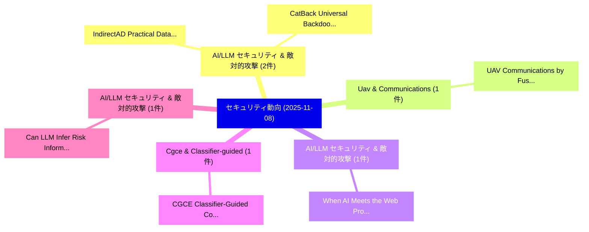

# 📅 02_daily: 日次エグゼクティブサマリー報告書 (2025-11-08)

**集計日時**: 2026-10-02 23:05:46 UTC  
**対象日付**: 2025-11-08  
**本日収集論文数**: 13 件  

---

## 💡 主要セキュリティ動向・脅威インサイト (Executive Insights)

本日の収集論文（計 13 件）において、以下の重点セキュリティ領域で活発な研究動向が確認されました：
- **AI/LLM セキュリティ & 敵対的攻撃** (2 件): 注目論文として 「IndirectAD: Practical Data Poi...」、「CatBack: Universal Backdoor At...」 等が発表され、実務防御および攻撃検証の進展が見られます。
- **Uav & Communications** (1 件): 注目論文として 「UAV Communications by Fusing C...」 等が発表され、実務防御および攻撃検証の進展が見られます。
- **AI/LLM セキュリティ & 敵対的攻撃** (1 件): 注目論文として 「When AI Meets the Web: Prompt ...」 等が発表され、実務防御および攻撃検証の進展が見られます。
- **Cgce & Classifier-guided** (1 件): 注目論文として 「CGCE: Classifier-Guided Concep...」 等が発表され、実務防御および攻撃検証の進展が見られます。
- **AI/LLM セキュリティ & 敵対的攻撃** (1 件): 注目論文として 「Can LLM Infer Risk Information...」 等が発表され、実務防御および攻撃検証の進展が見られます。

### 🗺️ 技術・脅威トピックマインドマップ

---

## 📌 日次セキュリティ論文一覧 (日本語表形式)

| No | arXiv ID | 論文タイトル (日本語訳) | 重要キーワード | 構造化エグゼクティブ要約 (背景・提案・影響) | 脅威分類 | 詳細リンク |
|---|---|---|---|---|---|---|
| 1 | `2511.05796v1` | [UAV Communications by Fusing Cross-Layer Fingerprintsのセキュリティ強化](../../okf/papers/2025-11-08/2511.05796.md) | `Fusing Cross`, `Layer Fingerprints`, `Cross-Layer Fingerprints` | 【提案】概要 (Overview & Key Finding) 本論文「UAV Communications by Fusing Cross-Layer Fingerprintsのセ...。実証評価により経営層・セキュリティ管理者向け推奨アクション (E... | `cybersecurity` | [arXiv](https://arxiv.org/abs/2511.05796v1) &#124; [OKF](../../okf/papers/2025-11-08/2511.05796.md) |
| 2 | `2511.05797v1` | [When AI Meets the Web: Prompt Injection Risks in Third-Party AI Chatbot Plugins（セキュリティ分析論文）](../../okf/papers/2025-11-08/2511.05797.md) | `Prompt Injection Risks`, `Chatbot Plugins`, `Third-Party AI` | 【提案】概要 (Overview & Key Finding) 本論文「When AI Meets the Web: プロンプトインジェクション Risks in Third-Par...。実証評価により経営層・セキュリティ管理者向け推奨アクション (E... | `cs.AI` | [arXiv](https://arxiv.org/abs/2511.05797v1) &#124; [OKF](../../okf/papers/2025-11-08/2511.05797.md) |
| 3 | `2511.05845v1` | [IndirectAD: Practical Data Poisoning Attacks against Recommender Systems for Item Promotion（セキュリティ分析論文）](../../okf/papers/2025-11-08/2511.05845.md) | `Practical Data Poisoning Attacks`, `Recommender Systems`, `Item Promotion` | 【提案】概要 (Overview & Key Finding) 本論文「IndirectAD: Practical Data Poisoning Attacks against Re...。実証評価により経営層・セキュリティ管理者向け推奨アクション (E... | `cybersecurity` | [arXiv](https://arxiv.org/abs/2511.05845v1) &#124; [OKF](../../okf/papers/2025-11-08/2511.05845.md) |
| 4 | `2511.05865v3` | [CGCE: Classifier-Guided Concept Erasure in Generative Models（セキュリティ分析論文）](../../okf/papers/2025-11-08/2511.05865.md) | `Guided Concept Erasure`, `Generative Models`, `Classifier-Guided Concept` | 【提案】概要 (Overview & Key Finding) 本論文「CGCE: Classifier-Guided Concept Erasure in Generative M...。実証評価によりPatel - **公開日時**: `2025-1... | `cs.AI` | [arXiv](https://arxiv.org/abs/2511.05865v3) &#124; [OKF](../../okf/papers/2025-11-08/2511.05865.md) |
| 5 | `2511.05867v3` | [Can LLM Infer Risk Information From MCP Server System Logs?（セキュリティ分析論文）](../../okf/papers/2025-11-08/2511.05867.md) | `Server System Logs`, `Jiayi Fu`, `Yuansen Zhang` | 【提案】### (日本語題名: Can LLM Infer Risk Information From MCP Server System Logs?（セキュリティ分析論文）)  >...。実証評価により経営層・セキュリティ管理者向け推奨アクション (E... | `executive-summary` | [arXiv](https://arxiv.org/abs/2511.05867v3) &#124; [OKF](../../okf/papers/2025-11-08/2511.05867.md) |
| 6 | `2511.05919v3` | [Injecting Falsehoods: Adversarial Man-in-the-Middle Attacks Undermining Factual Recall in LLMs（セキュリティ分析論文）](../../okf/papers/2025-11-08/2511.05919.md) | `Middle Attacks Undermining Factual Recall`, `Injecting Falsehoods`, `Adversarial Man` | 【提案】概要 (Overview & Key Finding) 本論文「Injecting Falsehoods: Adversarial 中間者攻撃 Attacks Undermi...。実証評価により経営層・セキュリティ管理者向け推奨アクション (E... | `cs.AI` | [arXiv](https://arxiv.org/abs/2511.05919v3) &#124; [OKF](../../okf/papers/2025-11-08/2511.05919.md) |
| 7 | `2511.06028v1` | [Cryptographic Binding Should Not Be Optional: A Formal-Methods FIDO UAF Channel Bindingの分析](../../okf/papers/2025-11-08/2511.06028.md) | `Formal-Methods FIDO`, `Channel Binding`, `Enis Golaszewski` | 【提案】背景とセキュリティ上の課題 (Background & Problem) 本研究はサイバー脅威環境におけるセキュリティ構造・脆弱性の検証を目的としています。(主要検出項目: ...。実証評価により経営層・セキュリティ管理者向け推奨アクション (E... | `cybersecurity` | [arXiv](https://arxiv.org/abs/2511.06028v1) &#124; [OKF](../../okf/papers/2025-11-08/2511.06028.md) |
| 8 | `2511.06056v1` | [Identity Card Presentation Attack Detection: A Systematic Review（セキュリティ分析論文）](../../okf/papers/2025-11-08/2511.06056.md) | `Identity Card Presentation Attack Detection`, `Systematic Review`, `Christoph Busch` | 【提案】概要 (Overview & Key Finding) 本論文「Identity Card Presentation Attack Detection: A Systemat...。実証評価によりSoto, Christoph Bus。 | `cs.CV` | [arXiv](https://arxiv.org/abs/2511.06056v1) &#124; [OKF](../../okf/papers/2025-11-08/2511.06056.md) |
| 9 | `2511.06064v1` | [A Privacy-Preserving 連合学習 Method with Homomorphic Encryption in Omics Data](../../okf/papers/2025-11-08/2511.06064.md) | `Homomorphic Encryption`, `Omics Data`, `Privacy-Preserving Federated` | 【提案】概要 (Overview & Key Finding) 本論文「A Privacy-Preserving 連合学習 Method with 準同型暗号 in Omics Da...。実証評価により経営層・セキュリティ管理者向け推奨アクション (E... | `cs.AI` | [arXiv](https://arxiv.org/abs/2511.06064v1) &#124; [OKF](../../okf/papers/2025-11-08/2511.06064.md) |
| 10 | `2511.06072v1` | [CatBack: Universal Backdoor Attacks on Tabular Data via Categorical Encoding（セキュリティ分析論文）](../../okf/papers/2025-11-08/2511.06072.md) | `Universal Backdoor Attacks`, `Tabular Data`, `Categorical Encoding` | 【提案】概要 (Overview & Key Finding) 本論文「CatBack: Universal Backdoor Attacks on Tabular Data via...。実証評価により経営層・セキュリティ管理者向け推奨アクション (E... | `executive-summary` | [arXiv](https://arxiv.org/abs/2511.06072v1) &#124; [OKF](../../okf/papers/2025-11-08/2511.06072.md) |
| 11 | `2511.06104v1` | [PraxiMLP: A Threshold-based Framework for Efficient Three-Party MLP with Practical Security（セキュリティ分析論文）](../../okf/papers/2025-11-08/2511.06104.md) | `Efficient Three`, `Practical Security`, `Three-Party MLP` | 【提案】概要 (Overview & Key Finding) 本論文「PraxiMLP: A Threshold-based Framework for Efficient Thr...。実証評価により経営層・セキュリティ管理者向け推奨アクション (E... | `cybersecurity` | [arXiv](https://arxiv.org/abs/2511.06104v1) &#124; [OKF](../../okf/papers/2025-11-08/2511.06104.md) |
| 12 | `2511.06130v1` | [Reliablocks: Developing Reliability Scores for Optimistic Rollups（セキュリティ分析論文）](../../okf/papers/2025-11-08/2511.06130.md) | `Developing Reliability Scores`, `Optimistic Rollups`, `Souradeep Das` | 【提案】概要 (Overview & Key Finding) 本論文「Reliablocks: Developing Reliability Scores for Optimist...。実証評価により経営層・セキュリティ管理者向け推奨アクション (E... | `executive-summary` | [arXiv](https://arxiv.org/abs/2511.06130v1) &#124; [OKF](../../okf/papers/2025-11-08/2511.06130.md) |
| 13 | `2511.15712v1` | [Secure Autonomous Agent Payments: Verifying Authenticity and Intent in a Trustless Environment（セキュリティ分析論文）](../../okf/papers/2025-11-08/2511.15712.md) | `Secure Autonomous Agent Payments`, `Verifying Authenticity`, `Trustless Environment` | 【提案】概要 (Overview & Key Finding) 本論文「Secure Autonomous Agent Payments: Verifying Authenticit...。実証評価により経営層・セキュリティ管理者向け推奨アクション (E... | `cs.AI` | [arXiv](https://arxiv.org/abs/2511.15712v1) &#124; [OKF](../../okf/papers/2025-11-08/2511.15712.md) |

