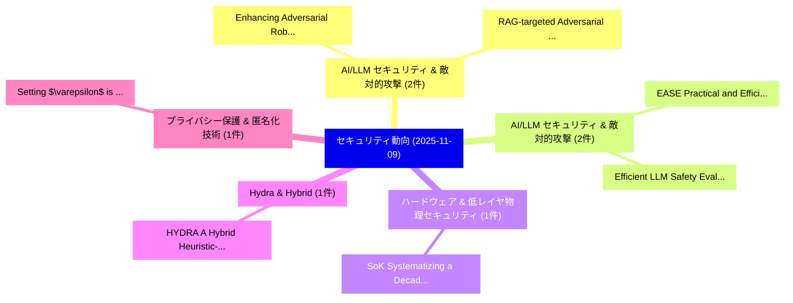

# 📅 02_daily: 日次エグゼクティブサマリー報告書 (2025-11-09)

**集計日時**: 2026-10-02 23:05:46 UTC  
**対象日付**: 2025-11-09  
**本日収集論文数**: 14 件  

---

## 💡 主要セキュリティ動向・脅威インサイト (Executive Insights)

本日の収集論文（計 14 件）において、以下の重点セキュリティ領域で活発な研究動向が確認されました：
- **AI/LLM セキュリティ & 敵対的攻撃** (2 件): 注目論文として 「Enhancing Adversarial Robustne...」、「RAG-targeted Adversarial Attac...」 等が発表され、実務防御および攻撃検証の進展が見られます。
- **AI/LLM セキュリティ & 敵対的攻撃** (2 件): 注目論文として 「Efficient LLM Safety Evaluatio...」、「EASE: Practical and Efficient ...」 等が発表され、実務防御および攻撃検証の進展が見られます。
- **ハードウェア & 低レイヤ物理セキュリティ** (1 件): 注目論文として 「SoK: Systematizing a Decade of...」 等が発表され、実務防御および攻撃検証の進展が見られます。
- **Hydra & Hybrid** (1 件): 注目論文として 「HYDRA: A Hybrid Heuristic-Guid...」 等が発表され、実務防御および攻撃検証の進展が見られます。
- **プライバシー保護 & 匿名化技術** (1 件): 注目論文として 「Setting $\varepsilon$ is not t...」 等が発表され、実務防御および攻撃検証の進展が見られます。

### 🗺️ 技術・脅威トピックマインドマップ

---

## 📌 日次セキュリティ論文一覧 (日本語表形式)

| No | arXiv ID | 論文タイトル (日本語訳) | 重要キーワード | 構造化エグゼクティブ要約 (背景・提案・影響) | 脅威分類 | 詳細リンク |
|---|---|---|---|---|---|---|
| 1 | `2511.06192v1` | [SoK: Systematizing a Decade of Architectural RowHammer Defenses Through the Lens of Streaming Algorithms（セキュリティ分析論文）](../../okf/papers/2025-11-09/2511.06192.md) | `Streaming Algorithms`, `Michael Jaemin Kim`, `Nam Sung Kim` | 【提案】概要 (Overview & Key Finding) 本論文「SoK: Systematizing a Decade of Architectural RowHammer ...。実証評価により経営層・セキュリティ管理者向け推奨アクション (E... | `executive-summary` | [arXiv](https://arxiv.org/abs/2511.06192v1) &#124; [OKF](../../okf/papers/2025-11-09/2511.06192.md) |
| 2 | `2511.06197v1` | [Enhancing Adversarial Robustness of IoT Intrusion Detection via SHAP-Based Attribution Fingerprinting（セキュリティ分析論文）](../../okf/papers/2025-11-09/2511.06197.md) | `Enhancing Adversarial Robustness`, `Based Attribution Fingerprinting`, `Intrusion Detection` | 【提案】概要 (Overview & Key Finding) 本論文「Enhancing Adversarial Robustness of IoT Intrusion Detec...。実証評価により経営層・セキュリティ管理者向け推奨アクション (E... | `cs.NI` | [arXiv](https://arxiv.org/abs/2511.06197v1) &#124; [OKF](../../okf/papers/2025-11-09/2511.06197.md) |
| 3 | `2511.06212v1` | [RAG-targeted Adversarial Attack on LLM-based Threat Detection and Mitigation Framework（セキュリティ分析論文）](../../okf/papers/2025-11-09/2511.06212.md) | `Adversarial Attack`, `Threat Detection`, `RAG-targeted Adversarial` | 【提案】概要 (Overview & Key Finding) 本論文「RAG-targeted 敵対的攻撃 on LLM-based 脅威 Detection and Mitiga...。実証評価により経営層・セキュリティ管理者向け推奨アクション (E... | `cs.AI` | [arXiv](https://arxiv.org/abs/2511.06212v1) &#124; [OKF](../../okf/papers/2025-11-09/2511.06212.md) |
| 4 | `2511.06220v2` | [HYDRA: A Hybrid Heuristic-Guided Deep Representation Architecture for Predicting Latent Zero-Day Vulnerabilities in Patched Functions（セキュリティ分析論文）](../../okf/papers/2025-11-09/2511.06220.md) | `Guided Deep Representation Architecture`, `Predicting Latent Zero`, `Hybrid Heuristic` | 【提案】概要 (Overview & Key Finding) 本論文「HYDRA: A Hybrid Heuristic-Guided Deep Representation Ar...。実証評価により経営層・セキュリティ管理者向け推奨アクション (E... | `executive-summary` | [arXiv](https://arxiv.org/abs/2511.06220v2) &#124; [OKF](../../okf/papers/2025-11-09/2511.06220.md) |
| 5 | `2511.06305v2` | [Setting $\varepsilon$ is not the Issue in Differential Privacy（セキュリティ分析論文）](../../okf/papers/2025-11-09/2511.06305.md) | `Differential Privacy`, `Edwige Cyffers`, `Raw Meta` | 【提案】背景とセキュリティ上の課題 (Background & Problem) 本研究はサイバー脅威環境におけるセキュリティ構造・脆弱性の検証を目的としています。(主要検出項目: ...。実証評価により経営層・セキュリティ管理者向け推奨アクション (E... | `executive-summary` | [arXiv](https://arxiv.org/abs/2511.06305v2) &#124; [OKF](../../okf/papers/2025-11-09/2511.06305.md) |
| 6 | `2511.06336v1` | [Enhancing Deep Learning-Based Rotational-XOR Attacks on Lightweight Block Ciphers Simon32/64 and Simeck32/64（セキュリティ分析論文）](../../okf/papers/2025-11-09/2511.06336.md) | `Enhancing Deep Learning`, `Lightweight Block Ciphers Simon32`, `Based Rotational` | 【提案】概要 (Overview & Key Finding) 本論文「Enhancing Deep Learning-Based Rotational-XOR Attacks on...。実証評価により経営層・セキュリティ管理者向け推奨アクション (E... | `cybersecurity` | [arXiv](https://arxiv.org/abs/2511.06336v1) &#124; [OKF](../../okf/papers/2025-11-09/2511.06336.md) |
| 7 | `2511.06390v3` | [Ghost in the Transformer: Detecting Model Reuse with Invariant Spectral Signatures（セキュリティ分析論文）](../../okf/papers/2025-11-09/2511.06390.md) | `Detecting Model Reuse`, `Invariant Spectral Signatures`, `Suqing Wang` | 【提案】概要 (Overview & Key Finding) 本論文「Ghost in the Transformer: Detecting Model Reuse with In...。実証評価により経営層・セキュリティ管理者向け推奨アクション (E... | `cs.AI` | [arXiv](https://arxiv.org/abs/2511.06390v3) &#124; [OKF](../../okf/papers/2025-11-09/2511.06390.md) |
| 8 | `2511.06394v2` | [A Visual Perception-Based Tunable Framework and Evaluation Benchmark for H.265/HEVC ROI Encryption（セキュリティ分析論文）](../../okf/papers/2025-11-09/2511.06394.md) | `Visual Perception`, `Perception-Based Tunable`, `Xiang Zhang` | 【提案】概要 (Overview & Key Finding) 本論文「A Visual Perception-Based Tunable Framework and Evaluat...。実証評価により経営層・セキュリティ管理者向け推奨アクション (E... | `cs.MM` | [arXiv](https://arxiv.org/abs/2511.06394v2) &#124; [OKF](../../okf/papers/2025-11-09/2511.06394.md) |
| 9 | `2511.06396v3` | [Efficient LLM Safety Evaluation through Multi-Agent Debate（セキュリティ分析論文）](../../okf/papers/2025-11-09/2511.06396.md) | `Agent Debate`, `Multi-Agent Debate`, `Dachuan Lin` | 【提案】概要 (Overview & Key Finding) 本論文「Efficient LLM Safety Evaluation through Multi-Agent Deb...。実証評価により経営層・セキュリティ管理者向け推奨アクション (E... | `cs.AI` | [arXiv](https://arxiv.org/abs/2511.06396v3) &#124; [OKF](../../okf/papers/2025-11-09/2511.06396.md) |
| 10 | `2511.06429v1` | [Inside LockBit: Technical, Behavioral, and Financial Anatomy of a Ransomware Empire（セキュリティ分析論文）](../../okf/papers/2025-11-09/2511.06429.md) | `Financial Anatomy`, `Ransomware Empire`, `Constantinos Patsakis` | 【提案】概要 (Overview & Key Finding) 本論文「Inside LockBit: Technical, Behavioral, and Financial An...。実証評価により経営層・セキュリティ管理者向け推奨アクション (E... | `cybersecurity` | [arXiv](https://arxiv.org/abs/2511.06429v1) &#124; [OKF](../../okf/papers/2025-11-09/2511.06429.md) |
| 11 | `2511.06512v1` | [EASE: Practical and Efficient Safety Alignment for Small Language Models（セキュリティ分析論文）](../../okf/papers/2025-11-09/2511.06512.md) | `Efficient Safety Alignment`, `Small Language Models`, `Haonan Shi` | 【提案】概要 (Overview & Key Finding) 本論文「EASE: Practical and Efficient Safety Alignment for Smal...。実証評価により経営層・セキュリティ管理者向け推奨アクション (E... | `executive-summary` | [arXiv](https://arxiv.org/abs/2511.06512v1) &#124; [OKF](../../okf/papers/2025-11-09/2511.06512.md) |
| 12 | `2511.06540v1` | [CYPRESS: Transferring Secrets in the Shadow of Visible Packets（セキュリティ分析論文）](../../okf/papers/2025-11-09/2511.06540.md) | `Transferring Secrets`, `Visible Packets`, `Sirus Shahini` | 【提案】概要 (Overview & Key Finding) 本論文「CYPRESS: Transferring Secrets in the Shadow of Visible ...。実証評価により経営層・セキュリティ管理者向け推奨アクション (E... | `cs.NI` | [arXiv](https://arxiv.org/abs/2511.06540v1) &#124; [OKF](../../okf/papers/2025-11-09/2511.06540.md) |
| 13 | `2511.06573v1` | [SteganoSNN: SNN-Based Audio-in-Image Steganography with Encryption（セキュリティ分析論文）](../../okf/papers/2025-11-09/2511.06573.md) | `Based Audio`, `Image Steganography`, `SNN-Based Audio` | 【提案】概要 (Overview & Key Finding) 本論文「SteganoSNN: SNN-Based Audio-in-Image Steganography with...。実証評価により経営層・セキュリティ管理者向け推奨アクション (E... | `cs.AI` | [arXiv](https://arxiv.org/abs/2511.06573v1) &#124; [OKF](../../okf/papers/2025-11-09/2511.06573.md) |
| 14 | `2511.07480v1` | [KG-DF: A Black-box Defense Framework against Jailbreak Attacks Based on Knowledge Graphs（セキュリティ分析論文）](../../okf/papers/2025-11-09/2511.07480.md) | `Jailbreak Attacks Based`, `Black-box Defense`, `Knowledge Graphs` | 【提案】概要 (Overview & Key Finding) 本論文「KG-DF: A Black-box Defense Framework against ジェイルブレイク A...。実証評価により経営層・セキュリティ管理者向け推奨アクション (E... | `cs.AI` | [arXiv](https://arxiv.org/abs/2511.07480v1) &#124; [OKF](../../okf/papers/2025-11-09/2511.07480.md) |

