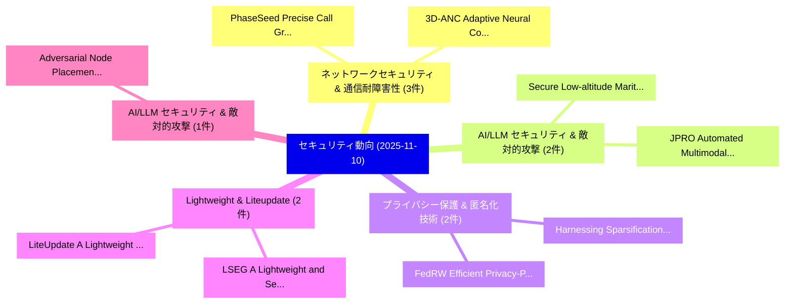

# 📅 02_daily: 日次エグゼクティブサマリー報告書 (2025-11-10)

**集計日時**: 2026-10-02 23:05:46 UTC  
**対象日付**: 2025-11-10  
**本日収集論文数**: 27 件  

---

## 💡 主要セキュリティ動向・脅威インサイト (Executive Insights)

本日の収集論文（計 27 件）において、以下の重点セキュリティ領域で活発な研究動向が確認されました：
- **ネットワークセキュリティ & 通信耐障害性** (3 件): 注目論文として 「PhaseSeed: Precise Call Graph ...」、「3D-ANC: Adaptive Neural Collap...」 等が発表され、実務防御および攻撃検証の進展が見られます。
- **AI/LLM セキュリティ & 敵対的攻撃** (2 件): 注目論文として 「Secure Low-altitude Maritime C...」、「JPRO: Automated Multimodal Jai...」 等が発表され、実務防御および攻撃検証の進展が見られます。
- **プライバシー保護 & 匿名化技術** (2 件): 注目論文として 「Harnessing Sparsification in 連...」、「FedRW: Efficient Privacy-Prese...」 等が発表され、実務防御および攻撃検証の進展が見られます。
- **Lightweight & Liteupdate** (2 件): 注目論文として 「LiteUpdate: A Lightweight Fram...」、「LSEG: A Lightweight and Secure...」 等が発表され、実務防御および攻撃検証の進展が見られます。
- **AI/LLM セキュリティ & 敵対的攻撃** (1 件): 注目論文として 「Adversarial Node Placement in ...」 等が発表され、実務防御および攻撃検証の進展が見られます。

### 🗺️ 技術・脅威トピックマインドマップ

---

## 📌 日次セキュリティ論文一覧 (日本語表形式)

| No | arXiv ID | 論文タイトル (日本語訳) | 重要キーワード | 構造化エグゼクティブ要約 (背景・提案・影響) | 脅威分類 | 詳細リンク |
|---|---|---|---|---|---|---|
| 1 | `2511.06659v1` | [Secure Low-altitude Maritime Communications via Intelligent Jamming（セキュリティ分析論文）](../../okf/papers/2025-11-10/2511.06659.md) | `Secure Low`, `Maritime Communications`, `Intelligent Jamming` | 【提案】概要 (Overview & Key Finding) 本論文「Secure Low-altitude Maritime Communications via Intelli...。実証評価により経営層・セキュリティ管理者向け推奨アクション (E... | `cybersecurity` | [arXiv](https://arxiv.org/abs/2511.06659v1) &#124; [OKF](../../okf/papers/2025-11-10/2511.06659.md) |
| 2 | `2511.06661v1` | [PhaseSeed: Precise Call Graph Construction for Split-Phase Applications using Dynamic Seeding（セキュリティ分析論文）](../../okf/papers/2025-11-10/2511.06661.md) | `Precise Call Graph Construction`, `Phase Applications`, `Dynamic Seeding` | 【提案】概要 (Overview & Key Finding) 本論文「PhaseSeed: Precise Call Graph Construction for Split-Ph...。実証評価により経営層・セキュリティ管理者向け推奨アクション (E... | `executive-summary` | [arXiv](https://arxiv.org/abs/2511.06661v1) &#124; [OKF](../../okf/papers/2025-11-10/2511.06661.md) |
| 3 | `2511.06742v1` | [Adversarial Node Placement in Decentralized 連合学習: Maximum Spanning-Centrality Strategy and Performance Analysis](../../okf/papers/2025-11-10/2511.06742.md) | `Adversarial Node Placement`, `Maximum Spanning`, `Centrality Strategy` | 【提案】概要 (Overview & Key Finding) 本論文「Adversarial Node Placement in Decentralized 連合学習: Maxim...。実証評価により経営層・セキュリティ管理者向け推奨アクション (E... | `cybersecurity` | [arXiv](https://arxiv.org/abs/2511.06742v1) &#124; [OKF](../../okf/papers/2025-11-10/2511.06742.md) |
| 4 | `2511.06852v4` | [Differentiated Directional Intervention A Framework for Evading LLM Safety Alignment（セキュリティ分析論文）](../../okf/papers/2025-11-10/2511.06852.md) | `Differentiated Directional Intervention`, `Safety Alignment`, `Peng Zhang` | 【提案】概要 (Overview & Key Finding) 本論文「Differentiated Directional Intervention A Framework for...。実証評価により経営層・セキュリティ管理者向け推奨アクション (E... | `cs.AI` | [arXiv](https://arxiv.org/abs/2511.06852v4) &#124; [OKF](../../okf/papers/2025-11-10/2511.06852.md) |
| 5 | `2511.06862v1` | [Generalized Security-Preserving Refinement for Concurrent Systems（セキュリティ分析論文）](../../okf/papers/2025-11-10/2511.06862.md) | `Generalized Security`, `Preserving Refinement`, `Concurrent Systems` | 【提案】概要 (Overview & Key Finding) 本論文「Generalized Security-Preserving Refinement for Concurre...。実証評価により経営層・セキュリティ管理者向け推奨アクション (E... | `cs.LO` | [arXiv](https://arxiv.org/abs/2511.06862v1) &#124; [OKF](../../okf/papers/2025-11-10/2511.06862.md) |
| 6 | `2511.06871v1` | [Nearly-Optimal Private Selection via Gaussian Mechanism（セキュリティ分析論文）](../../okf/papers/2025-11-10/2511.06871.md) | `Optimal Private Selection`, `Gaussian Mechanism`, `Nearly-Optimal Private` | 【提案】概要 (Overview & Key Finding) 本論文「Nearly-Optimal Private Selection via Gaussian Mechanism...。実証評価により経営層・セキュリティ管理者向け推奨アクション (E... | `executive-summary` | [arXiv](https://arxiv.org/abs/2511.06871v1) &#124; [OKF](../../okf/papers/2025-11-10/2511.06871.md) |
| 7 | `2511.06942v3` | [HLPD: Aligning LLMs to Human Language Preference for Machine-Revised Text Detection（セキュリティ分析論文）](../../okf/papers/2025-11-10/2511.06942.md) | `Human Language Preference`, `Revised Text Detection`, `Machine-Revised Text` | 【提案】概要 (Overview & Key Finding) 本論文「HLPD: Aligning LLMs to Human Language Preference for Ma...。実証評価により経営層・セキュリティ管理者向け推奨アクション (E... | `executive-summary` | [arXiv](https://arxiv.org/abs/2511.06942v3) &#124; [OKF](../../okf/papers/2025-11-10/2511.06942.md) |
| 8 | `2511.07033v1` | [Uncovering Pretraining Code in LLMs: A Syntax-Aware Attribution Approach（セキュリティ分析論文）](../../okf/papers/2025-11-10/2511.07033.md) | `Uncovering Pretraining Code`, `Syntax-Aware Attribution`, `Yuanheng Li` | 【提案】概要 (Overview & Key Finding) 本論文「Uncovering Pretraining Code in LLMs: A Syntax-Aware Att...。実証評価により経営層・セキュリティ管理者向け推奨アクション (E... | `cybersecurity` | [arXiv](https://arxiv.org/abs/2511.07033v1) &#124; [OKF](../../okf/papers/2025-11-10/2511.07033.md) |
| 9 | `2511.07040v2` | [3D-ANC: Adaptive Neural Collapse for Robust 3D Point Cloud Recognition（セキュリティ分析論文）](../../okf/papers/2025-11-10/2511.07040.md) | `Adaptive Neural Collapse`, `Point Cloud Recognition`, `Yuanmin Huang` | 【提案】概要 (Overview & Key Finding) 本論文「3D-ANC: Adaptive Neural Collapse for Robust 3D Point Cl...。実証評価により経営層・セキュリティ管理者向け推奨アクション (E... | `cs.CV` | [arXiv](https://arxiv.org/abs/2511.07040v2) &#124; [OKF](../../okf/papers/2025-11-10/2511.07040.md) |
| 10 | `2511.07049v1` | [From Pretrain to Pain: Adversarial Vulnerability of Video Foundation Models Without Task Knowledge（セキュリティ分析論文）](../../okf/papers/2025-11-10/2511.07049.md) | `Video Foundation Models Without Task Knowledge`, `Adversarial Vulnerability`, `Boon Poh Ng` | 【提案】背景とセキュリティ上の課題 (Background & Problem) 本研究はサイバー脅威環境におけるセキュリティ構造・脆弱性の検証を目的としています。(主要検出項目: ...。実証評価により経営層・セキュリティ管理者向け推奨アクション (E... | `cs.CV` | [arXiv](https://arxiv.org/abs/2511.07049v1) &#124; [OKF](../../okf/papers/2025-11-10/2511.07049.md) |
| 11 | `2511.07051v1` | [Improving Deepfake Detection with Reinforcement Learning-Based Adaptive Data Augmentation（セキュリティ分析論文）](../../okf/papers/2025-11-10/2511.07051.md) | `Based Adaptive Data Augmentation`, `Improving Deepfake Detection`, `Reinforcement Learning` | 【提案】概要 (Overview & Key Finding) 本論文「Improving Deepfake Detection with Reinforcement Learnin...。実証評価により経営層・セキュリティ管理者向け推奨アクション (E... | `cs.CV` | [arXiv](https://arxiv.org/abs/2511.07051v1) &#124; [OKF](../../okf/papers/2025-11-10/2511.07051.md) |
| 12 | `2511.07099v1` | [E2E-VGuard: Adversarial Prevention for Production LLM-based End-To-End Speech Synthesis（セキュリティ分析論文）](../../okf/papers/2025-11-10/2511.07099.md) | `End Speech Synthesis`, `Adversarial Prevention`, `LLM-based End` | 【提案】概要 (Overview & Key Finding) 本論文「E2E-VGuard: Adversarial Prevention for Production LLM-b...。実証評価により経営層・セキュリティ管理者向け推奨アクション (E... | `cs.AI` | [arXiv](https://arxiv.org/abs/2511.07099v1) &#124; [OKF](../../okf/papers/2025-11-10/2511.07099.md) |
| 13 | `2511.07123v2` | [Harnessing Sparsification in 連合学習: A Secure, Efficient, and Differentially Private Realization](../../okf/papers/2025-11-10/2511.07123.md) | `Differentially Private Realization`, `Harnessing Sparsification`, `Federated Learning` | 【提案】概要 (Overview & Key Finding) 本論文「Harnessing Sparsification in 連合学習: A Secure, Efficient,...。実証評価により経営層・セキュリティ管理者向け推奨アクション (E... | `cybersecurity` | [arXiv](https://arxiv.org/abs/2511.07123v2) &#124; [OKF](../../okf/papers/2025-11-10/2511.07123.md) |
| 14 | `2511.07170v2` | [On Stealing Graph Neural Network Models（セキュリティ分析論文）](../../okf/papers/2025-11-10/2511.07170.md) | `Marcin Podhajski`, `Franziska Boenisch`, `Adam Dziedzic` | 【提案】概要 (Overview & Key Finding) 本論文「On Stealing Graph Neural Network Models（セキュリティ分析論文）」（原題...。実証評価によりMichalak - **公開日時**: `202... | `executive-summary` | [arXiv](https://arxiv.org/abs/2511.07170v2) &#124; [OKF](../../okf/papers/2025-11-10/2511.07170.md) |
| 15 | `2511.07192v1` | [LiteUpdate: A Lightweight Framework for Updating AI-Generated Image Detectors（セキュリティ分析論文）](../../okf/papers/2025-11-10/2511.07192.md) | `Generated Image Detectors`, `AI-Generated Image`, `Jiajie Lu` | 【提案】概要 (Overview & Key Finding) 本論文「LiteUpdate: A Lightweight Framework for Updating AI-Gen...。実証評価により経営層・セキュリティ管理者向け推奨アクション (E... | `cs.CV` | [arXiv](https://arxiv.org/abs/2511.07192v1) &#124; [OKF](../../okf/papers/2025-11-10/2511.07192.md) |
| 16 | `2511.07210v3` | [Breaking the Stealth-Potency Trade-off in Clean-Image Backdoors with Generative Trigger Optimization（セキュリティ分析論文）](../../okf/papers/2025-11-10/2511.07210.md) | `Generative Trigger Optimization`, `Potency Trade`, `Image Backdoors` | 【提案】概要 (Overview & Key Finding) 本論文「Breaking the Stealth-Potency Trade-off in Clean-Image B...。実証評価により経営層・セキュリティ管理者向け推奨アクション (E... | `cs.CV` | [arXiv](https://arxiv.org/abs/2511.07210v3) &#124; [OKF](../../okf/papers/2025-11-10/2511.07210.md) |
| 17 | `2511.07242v4` | [Privacy on the Fly: A Predictive Adversarial Transformation Network for Mobile Sensor Data（セキュリティ分析論文）](../../okf/papers/2025-11-10/2511.07242.md) | `Predictive Adversarial Transformation Network`, `Mobile Sensor Data`, `Mobile Sensor Dat` | 【提案】概要 (Overview & Key Finding) 本論文「Privacy on the Fly: A Predictive Adversarial Transforma...。実証評価により経営層・セキュリティ管理者向け推奨アクション (E... | `cybersecurity` | [arXiv](https://arxiv.org/abs/2511.07242v4) &#124; [OKF](../../okf/papers/2025-11-10/2511.07242.md) |
| 18 | `2511.07315v1` | [JPRO: Automated Multimodal Jailbreaking via Multi-Agent Collaboration Framework（セキュリティ分析論文）](../../okf/papers/2025-11-10/2511.07315.md) | `Automated Multimodal Jailbreaking`, `Multi-Agent Collaboration`, `Yuxuan Zhou` | 【提案】概要 (Overview & Key Finding) 本論文「JPRO: Automated Multimodal ジェイルブレイクing via Multi-Agent ...。実証評価により経営層・セキュリティ管理者向け推奨アクション (E... | `cybersecurity` | [arXiv](https://arxiv.org/abs/2511.07315v1) &#124; [OKF](../../okf/papers/2025-11-10/2511.07315.md) |
| 19 | `2511.07503v3` | [Biologically-Informed Hybrid Membership Inference Attacks on Generative Genomic Models（セキュリティ分析論文）](../../okf/papers/2025-11-10/2511.07503.md) | `Informed Hybrid Membership Inference Attacks`, `Generative Genomic Models`, `Biologically-Informed Hybrid` | 【提案】概要 (Overview & Key Finding) 本論文「Biologically-Informed Hybrid Membership Inference Attac...。実証評価により経営層・セキュリティ管理者向け推奨アクション (E... | `cs.AI` | [arXiv](https://arxiv.org/abs/2511.07503v3) &#124; [OKF](../../okf/papers/2025-11-10/2511.07503.md) |
| 20 | `2511.07505v1` | [FedRW: Efficient Privacy-Preserving Data Reweighting for Enhancing 連合学習 of Language Models](../../okf/papers/2025-11-10/2511.07505.md) | `Preserving Data Reweighting`, `Efficient Privacy`, `Privacy-Preserving Data` | 【提案】概要 (Overview & Key Finding) 本論文「FedRW: Efficient Privacy-Preserving Data Reweighting fo...。実証評価により経営層・セキュリティ管理者向け推奨アクション (E... | `cs.AI` | [arXiv](https://arxiv.org/abs/2511.07505v1) &#124; [OKF](../../okf/papers/2025-11-10/2511.07505.md) |
| 21 | `2511.07548v1` | [LSEG: A Lightweight and Secure Key Exchange Protocol for Smart Grid Communication（セキュリティ分析論文）](../../okf/papers/2025-11-10/2511.07548.md) | `Secure Key Exchange Protocol`, `Smart Grid Communication`, `Muhammad Asfand Hafeez` | 【提案】概要 (Overview & Key Finding) 本論文「LSEG: A Lightweight and Secure Key Exchange Protocol fo...。実証評価により経営層・セキュリティ管理者向け推奨アクション (E... | `cybersecurity` | [arXiv](https://arxiv.org/abs/2511.07548v1) &#124; [OKF](../../okf/papers/2025-11-10/2511.07548.md) |
| 22 | `2511.07577v1` | [A Decentralized Retrieval Augmented Generation System with Source Reliabilities Secured on Blockchain（セキュリティ分析論文）](../../okf/papers/2025-11-10/2511.07577.md) | `Decentralized Retrieval Augmented Generation System`, `Source Reliabilities Secured`, `Yining Lu` | 【提案】概要 (Overview & Key Finding) 本論文「A Decentralized Retrieval Augmented Generation System w...。実証評価により経営層・セキュリティ管理者向け推奨アクション (E... | `executive-summary` | [arXiv](https://arxiv.org/abs/2511.07577v1) &#124; [OKF](../../okf/papers/2025-11-10/2511.07577.md) |
| 23 | `2511.07637v1` | [Private-RAG: Answering Multiple Queries with LLMs while Keeping Your Data Private（セキュリティ分析論文）](../../okf/papers/2025-11-10/2511.07637.md) | `Answering Multiple Queries`, `Ruihan Wu`, `Erchi Wang` | 【提案】概要 (Overview & Key Finding) 本論文「Private-RAG: Answering Multiple Queries with LLMs while...。実証評価により経営層・セキュリティ管理者向け推奨アクション (E... | `cs.AI` | [arXiv](https://arxiv.org/abs/2511.07637v1) &#124; [OKF](../../okf/papers/2025-11-10/2511.07637.md) |
| 24 | `2511.07645v2` | [A Self-Improving Architecture for Dynamic Safety in 大規模言語モデル](../../okf/papers/2025-11-10/2511.07645.md) | `Improving Architecture`, `Dynamic Safety`, `Self-Improving Architecture` | 【提案】概要 (Overview & Key Finding) 本論文「A Self-Improving Architecture for Dynamic Safety in 大規模...。実証評価により経営層・セキュリティ管理者向け推奨アクション (E... | `cs.AI` | [arXiv](https://arxiv.org/abs/2511.07645v2) &#124; [OKF](../../okf/papers/2025-11-10/2511.07645.md) |
| 25 | `2511.08637v3` | [How Do Data Owners Say No? A Case Study of Data Consent Mechanisms in Web-Scraped Vision-Language AI Training Datasets（セキュリティ分析論文）](../../okf/papers/2025-11-10/2511.08637.md) | `Data Consent Mechanisms`, `Scraped Vision`, `Training Datasets` | 【提案】A Case Study of Data Consent Mechanisms in Web-Scraped Vision-Language AI Training Data...。実証評価により経営層・セキュリティ管理者向け推奨アクション (E... | `cs.AI` | [arXiv](https://arxiv.org/abs/2511.08637v3) &#124; [OKF](../../okf/papers/2025-11-10/2511.08637.md) |
| 26 | `2511.08641v1` | [QOC DAO -- Stepwise Development an AI Driven Decentralized Autonomous Organizationに向けて](../../okf/papers/2025-11-10/2511.08641.md) | `Driven Decentralized Autonomous Organization`, `Stepwise Development Towards`, `Driven Decentralized Autonomous` | 【提案】概要 (Overview & Key Finding) 本論文「QOC DAO -- Stepwise Development an AI Driven Decentrali...。実証評価により経営層・セキュリティ管理者向け推奨アクション (E... | `executive-summary` | [arXiv](https://arxiv.org/abs/2511.08641v1) &#124; [OKF](../../okf/papers/2025-11-10/2511.08641.md) |
| 27 | `2601.06033v2` | [How Generative AI Empowers Attackers and Defenders Across the Trust & Safety Landscape（セキュリティ分析論文）](../../okf/papers/2025-11-10/2601.06033.md) | `Empowers Attackers`, `Defenders Across`, `Safety Landscape` | 【提案】概要 (Overview & Key Finding) 本論文「How Generative AI Empowers Attackers and Defenders Acro...。実証評価により経営層・セキュリティ管理者向け推奨アクション (E... | `executive-summary` | [arXiv](https://arxiv.org/abs/2601.06033v2) &#124; [OKF](../../okf/papers/2025-11-10/2601.06033.md) |

