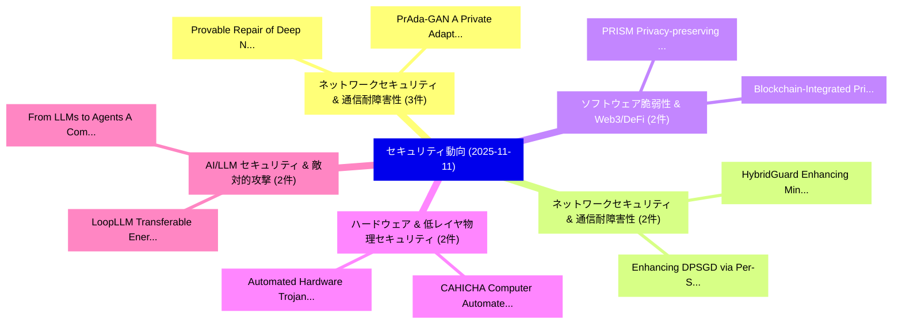

# 📅 02_daily: 日次エグゼクティブサマリー報告書 (2025-11-11)

**集計日時**: 2026-10-02 23:05:47 UTC  
**対象日付**: 2025-11-11  
**本日収集論文数**: 28 件  

---

## 💡 主要セキュリティ動向・脅威インサイト (Executive Insights)

本日の収集論文（計 28 件）において、以下の重点セキュリティ領域で活発な研究動向が確認されました：
- **ネットワークセキュリティ & 通信耐障害性** (3 件): 注目論文として 「Provable Repair of Deep Neural...」、「PrAda-GAN: A Private Adaptive ...」 等が発表され、実務防御および攻撃検証の進展が見られます。
- **ネットワークセキュリティ & 通信耐障害性** (2 件): 注目論文として 「HybridGuard: Enhancing Minorit...」、「Enhancing DPSGD via Per-Sample...」 等が発表され、実務防御および攻撃検証の進展が見られます。
- **ソフトウェア脆弱性 & Web3/DeFi** (2 件): 注目論文として 「PRISM: Privacy-preserving Infe...」、「Blockchain-Integrated Privacy-...」 等が発表され、実務防御および攻撃検証の進展が見られます。
- **ハードウェア & 低レイヤ物理セキュリティ** (2 件): 注目論文として 「CAHICHA: Computer Automated Ha...」、「Automated Hardware Trojan Inse...」 等が発表され、実務防御および攻撃検証の進展が見られます。
- **AI/LLM セキュリティ & 敵対的攻撃** (2 件): 注目論文として 「LoopLLM: Transferable Energy-L...」、「From LLMs to Agents: A Compara...」 等が発表され、実務防御および攻撃検証の進展が見られます。

### 🗺️ 技術・脅威トピックマインドマップ

---

## 📌 日次セキュリティ論文一覧 (日本語表形式)

| No | arXiv ID | 論文タイトル (日本語訳) | 重要キーワード | 構造化エグゼクティブ要約 (背景・提案・影響) | 脅威分類 | 詳細リンク |
|---|---|---|---|---|---|---|
| 1 | `2511.07741v1` | [Provable Repair of Deep Neural Network Defects by Preimage Synthesis and Property Refinement（セキュリティ分析論文）](../../okf/papers/2025-11-11/2511.07741.md) | `Deep Neural Network Defects`, `Provable Repair`, `Preimage Synthesis` | 【提案】概要 (Overview & Key Finding) 本論文「Provable Repair of Deep Neural Network Defects by Preim...。実証評価により経営層・セキュリティ管理者向け推奨アクション (E... | `executive-summary` | [arXiv](https://arxiv.org/abs/2511.07741v1) &#124; [OKF](../../okf/papers/2025-11-11/2511.07741.md) |
| 2 | `2511.07759v2` | [HiLoMix: Robust High- and Low-Frequency Graph Learning Framework for Mixing Address Association（セキュリティ分析論文）](../../okf/papers/2025-11-11/2511.07759.md) | `Mixing Address Association`, `Robust High`, `Low-Frequency Graph` | 【提案】概要 (Overview & Key Finding) 本論文「HiLoMix: Robust High- and Low-Frequency Graph Learning ...。実証評価により経営層・セキュリティ管理者向け推奨アクション (E... | `executive-summary` | [arXiv](https://arxiv.org/abs/2511.07759v2) &#124; [OKF](../../okf/papers/2025-11-11/2511.07759.md) |
| 3 | `2511.07772v2` | [SALT: Steering Activations Leakage-free Thinking in Chain of Thoughtに向けて](../../okf/papers/2025-11-11/2511.07772.md) | `Leakage-free Thinking`, `Steering Activations Leakage`, `Steering Activations` | 【提案】概要 (Overview & Key Finding) 本論文「SALT: Steering Activations Leakage-free Thinking in Cha...。実証評価により経営層・セキュリティ管理者向け推奨アクション (E... | `cs.AI` | [arXiv](https://arxiv.org/abs/2511.07772v2) &#124; [OKF](../../okf/papers/2025-11-11/2511.07772.md) |
| 4 | `2511.07793v1` | [HybridGuard: Enhancing Minority-Class Intrusion Detection in Dew-Enabled Edge-of-Things Networks（セキュリティ分析論文）](../../okf/papers/2025-11-11/2511.07793.md) | `Class Intrusion Detection`, `Enhancing Minority`, `Enabled Edge` | 【提案】概要 (Overview & Key Finding) 本論文「HybridGuard: Enhancing Minority-Class Intrusion Detecti...。実証評価により経営層・セキュリティ管理者向け推奨アクション (E... | `cs.AI` | [arXiv](https://arxiv.org/abs/2511.07793v1) &#124; [OKF](../../okf/papers/2025-11-11/2511.07793.md) |
| 5 | `2511.07807v1` | [PRISM: Privacy-preserving Inference System with Homomorphic Encryption and Modular Activation（セキュリティ分析論文）](../../okf/papers/2025-11-11/2511.07807.md) | `Inference System`, `Homomorphic Encryption`, `Modular Activation` | 【提案】概要 (Overview & Key Finding) 本論文「PRISM: Privacy-preserving Inference System with 準同型暗号 a...。実証評価により経営層・セキュリティ管理者向け推奨アクション (E... | `cs.AI` | [arXiv](https://arxiv.org/abs/2511.07807v1) &#124; [OKF](../../okf/papers/2025-11-11/2511.07807.md) |
| 6 | `2511.07818v1` | [Blockchain-Integrated Privacy-Preserving Medical Insurance Claim Processing Using Homomorphic Encryption（セキュリティ分析論文）](../../okf/papers/2025-11-11/2511.07818.md) | `Preserving Medical Insurance Claim Processing Using Homomorphic Encryption`, `Integrated Privacy`, `Blockchain-Integrated Privacy` | 【提案】概要 (Overview & Key Finding) 本論文「Blockchain-Integrated Privacy-Preserving Medical Insura...。実証評価により経営層・セキュリティ管理者向け推奨アクション (E... | `cybersecurity` | [arXiv](https://arxiv.org/abs/2511.07818v1) &#124; [OKF](../../okf/papers/2025-11-11/2511.07818.md) |
| 7 | `2511.07841v1` | [CAHICHA: Computer Automated Hardware Interaction test to tell Computer and Humans Apart（セキュリティ分析論文）](../../okf/papers/2025-11-11/2511.07841.md) | `Computer Automated Hardware Interaction`, `Humans Apart`, `Sibi Chakkaravarthy Sethuraman` | 【提案】概要 (Overview & Key Finding) 本論文「CAHICHA: Computer Automated Hardware Interaction test t...。実証評価により経営層・セキュリティ管理者向け推奨アクション (E... | `cybersecurity` | [arXiv](https://arxiv.org/abs/2511.07841v1) &#124; [OKF](../../okf/papers/2025-11-11/2511.07841.md) |
| 8 | `2511.07876v1` | [LoopLLM: Transferable Energy-Latency Attacks in LLMs via Repetitive Generation（セキュリティ分析論文）](../../okf/papers/2025-11-11/2511.07876.md) | `Transferable Energy`, `Latency Attacks`, `Energy-Latency Attacks` | 【提案】概要 (Overview & Key Finding) 本論文「LoopLLM: Transferable Energy-Latency Attacks in LLMs vi...。実証評価により経営層・セキュリティ管理者向け推奨アクション (E... | `cs.AI` | [arXiv](https://arxiv.org/abs/2511.07876v1) &#124; [OKF](../../okf/papers/2025-11-11/2511.07876.md) |
| 9 | `2511.07947v2` | [Class-feature Watermark: A Resilient Black-box Watermark Against Model Extraction Attacks（セキュリティ分析論文）](../../okf/papers/2025-11-11/2511.07947.md) | `Resilient Black`, `Class-feature Watermark`, `Black-box Watermark` | 【提案】概要 (Overview & Key Finding) 本論文「Class-feature Watermark: A Resilient Black-box Watermar...。実証評価により経営層・セキュリティ管理者向け推奨アクション (E... | `cs.CV` | [arXiv](https://arxiv.org/abs/2511.07947v2) &#124; [OKF](../../okf/papers/2025-11-11/2511.07947.md) |
| 10 | `2511.07997v1` | [PrAda-GAN: A Private Adaptive Generative Adversarial Network with Bayes Network Structure（セキュリティ分析論文）](../../okf/papers/2025-11-11/2511.07997.md) | `Private Adaptive Generative Adversarial Network`, `Bayes Network Structure`, `Ke Jia` | 【提案】概要 (Overview & Key Finding) 本論文「PrAda-GAN: A Private Adaptive Generative Adversarial Ne...。実証評価により経営層・セキュリティ管理者向け推奨アクション (E... | `stat.ME` | [arXiv](https://arxiv.org/abs/2511.07997v1) &#124; [OKF](../../okf/papers/2025-11-11/2511.07997.md) |
| 11 | `2511.08059v2` | ["I need to learn better searching tactics for プライバシーポリシー laws." Investigating Software Developers' Behavior When Using Sources on Privacy Issues](../../okf/papers/2025-11-11/2511.08059.md) | `Investigating Software Developers`, `Privacy Issues`, `Stefan Albert Horstmann` | 【提案】概要 (Overview & Key Finding) 本論文「"I need to learn better searching tactics for プライバシーポリシ...。実証評価により経営層・セキュリティ管理者向け推奨アクション (E... | `executive-summary` | [arXiv](https://arxiv.org/abs/2511.08059v2) &#124; [OKF](../../okf/papers/2025-11-11/2511.08059.md) |
| 12 | `2511.08060v1` | [From LLMs to Agents: A Comparative Evaluation of LLMs and LLM-based Agents in Security Patch Detection（セキュリティ分析論文）](../../okf/papers/2025-11-11/2511.08060.md) | `Security Patch Detection`, `LLM-based Agents`, `Junxiao Han` | 【提案】概要 (Overview & Key Finding) 本論文「From LLMs to Agents: A Comparative Evaluation of LLMs a...。実証評価により経営層・セキュリティ管理者向け推奨アクション (E... | `executive-summary` | [arXiv](https://arxiv.org/abs/2511.08060v1) &#124; [OKF](../../okf/papers/2025-11-11/2511.08060.md) |
| 13 | `2511.08207v1` | [FedPoP: 連合学習 Meets Proof of Participation](../../okf/papers/2025-11-11/2511.08207.md) | `Federated Learning Meets Proof`, `Meets Proof`, `Seoyeon Hwang` | 【提案】概要 (Overview & Key Finding) 本論文「FedPoP: 連合学習 Meets Proof of Participation」（原題: FedPoP: ...。実証評価により経営層・セキュリティ管理者向け推奨アクション (E... | `cs.AI` | [arXiv](https://arxiv.org/abs/2511.08207v1) &#124; [OKF](../../okf/papers/2025-11-11/2511.08207.md) |
| 14 | `2511.08282v1` | [SRE-Llama -- Fine-Tuned Meta's Llama LLM, 連合学習, Blockchain and NFT Enabled Site Reliability Engineering(SRE) Platform for Communication and Networking Software Services](../../okf/papers/2025-11-11/2511.08282.md) | `Enabled Site Reliability Engineering`, `Networking Software Services`, `Tuned Meta` | 【提案】概要 (Overview & Key Finding) 本論文「SRE-Llama -- Fine-Tuned Meta's Llama LLM, 連合学習, Blockch...。実証評価により経営層・セキュリティ管理者向け推奨アクション (E... | `cs.NI` | [arXiv](https://arxiv.org/abs/2511.08282v1) &#124; [OKF](../../okf/papers/2025-11-11/2511.08282.md) |
| 15 | `2511.08295v1` | [Publish Your Threat Models! The benefits far outweigh the dangers（セキュリティ分析論文）](../../okf/papers/2025-11-11/2511.08295.md) | `Loren Kohnfelder`, `Adam Shostack`, `Raw Meta` | 【提案】The benefits far outweigh the dangers ### (日本語題名: Publish Your 脅威 Models!。実証評価により経営層・セキュリティ管理者向け推奨アクション (Executive Recommen... | `executive-summary` | [arXiv](https://arxiv.org/abs/2511.08295v1) &#124; [OKF](../../okf/papers/2025-11-11/2511.08295.md) |
| 16 | `2511.08296v2` | [Plaintext Structure Vulnerability: Robust Cipher Identification via a Distributional Randomness Fingerprint Feature Extractor（セキュリティ分析論文）](../../okf/papers/2025-11-11/2511.08296.md) | `Distributional Randomness Fingerprint Feature Extractor`, `Plaintext Structure Vulnerability`, `Robust Cipher Identification` | 【提案】概要 (Overview & Key Finding) 本論文「Plaintext Structure 脆弱性: Robust Cipher Identification v...。実証評価により経営層・セキュリティ管理者向け推奨アクション (E... | `cybersecurity` | [arXiv](https://arxiv.org/abs/2511.08296v2) &#124; [OKF](../../okf/papers/2025-11-11/2511.08296.md) |
| 17 | `2511.08345v1` | [Revisiting Network Traffic Analysis: Compatible network flows for ML models（セキュリティ分析論文）](../../okf/papers/2025-11-11/2511.08345.md) | `Daniela Pinto`, `Eva Maia`, `Ivone Amorim` | 【提案】概要 (Overview & Key Finding) 本論文「Revisiting Network Traffic Analysis: Compatible network...。実証評価により経営層・セキュリティ管理者向け推奨アクション (E... | `cs.NI` | [arXiv](https://arxiv.org/abs/2511.08345v1) &#124; [OKF](../../okf/papers/2025-11-11/2511.08345.md) |
| 18 | `2511.08352v1` | [Endpoint Security Agent: A Comprehensive Approach to Real-time System Monitoring and Threat Detection（セキュリティ分析論文）](../../okf/papers/2025-11-11/2511.08352.md) | `Endpoint Security Agent`, `System Monitoring`, `Real-time System` | 【提案】概要 (Overview & Key Finding) 本論文「Endpoint Security Agent: A Comprehensive Approach to Re...。実証評価により経営層・セキュリティ管理者向け推奨アクション (E... | `cybersecurity` | [arXiv](https://arxiv.org/abs/2511.08352v1) &#124; [OKF](../../okf/papers/2025-11-11/2511.08352.md) |
| 19 | `2511.08367v1` | [Why does weak-OOD help? A Further Step Understanding Jailbreaking VLMsに向けて](../../okf/papers/2025-11-11/2511.08367.md) | `weak-OOD help`, `Yuxuan Zhou`, `Yuzhao Peng` | 【提案】A Further Step Towards Understanding ジェイルブレイクing VLMs ### (日本語題名: Why does weak-OOD help?。実証評価により経営層・セキュリティ管理者向け推奨アクション (Ex... | `cybersecurity` | [arXiv](https://arxiv.org/abs/2511.08367v1) &#124; [OKF](../../okf/papers/2025-11-11/2511.08367.md) |
| 20 | `2511.08403v1` | [Blockly2Hooks: Smart Contracts for Everyone with the XRP Ledger and Google Blockly（セキュリティ分析論文）](../../okf/papers/2025-11-11/2511.08403.md) | `Smart Contracts`, `Google Blockly`, `Lucian Trestioreanu` | 【提案】概要 (Overview & Key Finding) 本論文「Blockly2Hooks: スマートコントラクトs for Everyone with the XRP Le...。実証評価により経営層・セキュリティ管理者向け推奨アクション (E... | `cs.PL` | [arXiv](https://arxiv.org/abs/2511.08403v1) &#124; [OKF](../../okf/papers/2025-11-11/2511.08403.md) |
| 21 | `2511.08443v2` | [Coverage-Guided Pre-Silicon Fuzzing of Open-Source Processors based on Leakage Contracts（セキュリティ分析論文）](../../okf/papers/2025-11-11/2511.08443.md) | `Guided Pre`, `Silicon Fuzzing`, `Source Processors` | 【提案】概要 (Overview & Key Finding) 本論文「Coverage-Guided Pre-Silicon Fuzzing of Open-Source Proc...。実証評価により経営層・セキュリティ管理者向け推奨アクション (E... | `cybersecurity` | [arXiv](https://arxiv.org/abs/2511.08443v2) &#124; [OKF](../../okf/papers/2025-11-11/2511.08443.md) |
| 22 | `2511.08462v4` | [QLCoder: A Query Synthesizer For Static Security Vulnerabilitiesの分析](../../okf/papers/2025-11-11/2511.08462.md) | `Security Vulnerabilities`, `Claire Wang`, `Ziyang Li` | 【提案】概要 (Overview & Key Finding) 本論文「QLCoder: A Query Synthesizer For Static Security Vulner...。実証評価により経営層・セキュリティ管理者向け推奨アクション (E... | `cs.PL` | [arXiv](https://arxiv.org/abs/2511.08462v4) &#124; [OKF](../../okf/papers/2025-11-11/2511.08462.md) |
| 23 | `2511.08491v1` | [Toward Autonomous and Efficient サイバーセキュリティ: A Multi-Objective AutoML-based Intrusion Detection System](../../okf/papers/2025-11-11/2511.08491.md) | `Intrusion Detection System`, `Toward Autonomous`, `Multi-Objective AutoML` | 【提案】概要 (Overview & Key Finding) 本論文「Toward Autonomous and Efficient サイバーセキュリティ: A Multi-Obj...。実証評価により経営層・セキュリティ管理者向け推奨アクション (E... | `cs.NI` | [arXiv](https://arxiv.org/abs/2511.08491v1) &#124; [OKF](../../okf/papers/2025-11-11/2511.08491.md) |
| 24 | `2511.08660v1` | [Binary and Multiclass Cyberattack Classification on GeNIS Dataset（セキュリティ分析論文）](../../okf/papers/2025-11-11/2511.08660.md) | `Multiclass Cyberattack Classification`, `Miguel Silva`, `Daniela Pinto` | 【提案】概要 (Overview & Key Finding) 本論文「Binary and Multiclass Cyberattack Classification on GeN...。実証評価により経営層・セキュリティ管理者向け推奨アクション (E... | `cs.AI` | [arXiv](https://arxiv.org/abs/2511.08660v1) &#124; [OKF](../../okf/papers/2025-11-11/2511.08660.md) |
| 25 | `2511.08702v1` | [FAIRPLAI: A Human-in-the-Loop Approach to Fair and Private Machine Learning（セキュリティ分析論文）](../../okf/papers/2025-11-11/2511.08702.md) | `Private Machine Learning`, `David Sanchez`, `Holly Lopez` | 【提案】概要 (Overview & Key Finding) 本論文「FAIRPLAI: A Human-in-the-Loop Approach to Fair and Priv...。実証評価により経営層・セキュリティ管理者向け推奨アクション (E... | `cs.AI` | [arXiv](https://arxiv.org/abs/2511.08702v1) &#124; [OKF](../../okf/papers/2025-11-11/2511.08702.md) |
| 26 | `2511.08703v1` | [Automated Hardware Trojan Insertion in Industrial-Scale Designs（セキュリティ分析論文）](../../okf/papers/2025-11-11/2511.08703.md) | `Automated Hardware Trojan Insertion`, `Scale Designs`, `Industrial-Scale Designs` | 【提案】概要 (Overview & Key Finding) 本論文「Automated Hardware Trojan Insertion in Industrial-Scale...。実証評価により経営層・セキュリティ管理者向け推奨アクション (E... | `executive-summary` | [arXiv](https://arxiv.org/abs/2511.08703v1) &#124; [OKF](../../okf/papers/2025-11-11/2511.08703.md) |
| 27 | `2511.08841v1` | [Enhancing DPSGD via Per-Sample Momentum and Low-Pass Filtering（セキュリティ分析論文）](../../okf/papers/2025-11-11/2511.08841.md) | `Sample Momentum`, `Pass Filtering`, `Per-Sample Momentum` | 【提案】概要 (Overview & Key Finding) 本論文「Enhancing DPSGD via Per-Sample Momentum and Low-Pass Fi...。実証評価により経営層・セキュリティ管理者向け推奨アクション (E... | `cs.AI` | [arXiv](https://arxiv.org/abs/2511.08841v1) &#124; [OKF](../../okf/papers/2025-11-11/2511.08841.md) |
| 28 | `2511.08842v1` | [3D Guard-Layer: An Integrated Agentic AI Safety System for Edge Artificial Intelligence（セキュリティ分析論文）](../../okf/papers/2025-11-11/2511.08842.md) | `Edge Artificial Intelligence`, `Safety System`, `Eren Kurshan` | 【提案】概要 (Overview & Key Finding) 本論文「3D Guard-Layer: An Integrated Agentic AI Safety System ...。実証評価により経営層・セキュリティ管理者向け推奨アクション (E... | `cs.AI` | [arXiv](https://arxiv.org/abs/2511.08842v1) &#124; [OKF](../../okf/papers/2025-11-11/2511.08842.md) |

