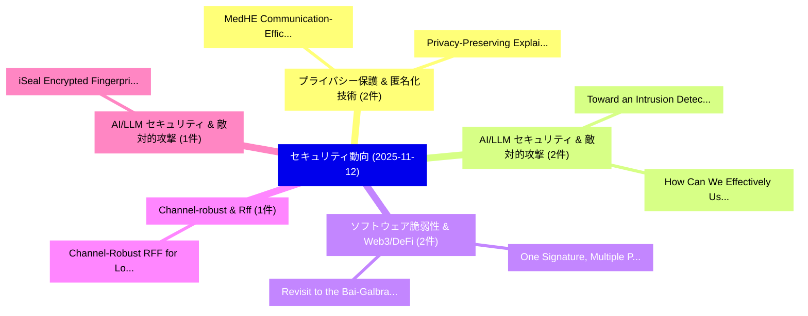

# 📅 02_daily: 日次エグゼクティブサマリー報告書 (2025-11-12)

**集計日時**: 2026-10-02 23:05:47 UTC  
**対象日付**: 2025-11-12  
**本日収集論文数**: 28 件  

---

## 💡 主要セキュリティ動向・脅威インサイト (Executive Insights)

本日の収集論文（計 28 件）において、以下の重点セキュリティ領域で活発な研究動向が確認されました：
- **プライバシー保護 & 匿名化技術** (2 件): 注目論文として 「MedHE: Communication-Efficient...」、「Privacy-Preserving Explainable...」 等が発表され、実務防御および攻撃検証の進展が見られます。
- **AI/LLM セキュリティ & 敵対的攻撃** (2 件): 注目論文として 「Toward an Intrusion Detection ...」、「How Can We Effectively Use LLM...」 等が発表され、実務防御および攻撃検証の進展が見られます。
- **ソフトウェア脆弱性 & Web3/DeFi** (2 件): 注目論文として 「One Signature, Multiple Paymen...」、「Revisit to the Bai-Galbraith s...」 等が発表され、実務防御および攻撃検証の進展が見られます。
- **Channel-robust & Rff** (1 件): 注目論文として 「Channel-Robust RFF for Low-Lat...」 等が発表され、実務防御および攻撃検証の進展が見られます。
- **AI/LLM セキュリティ & 敵対的攻撃** (1 件): 注目論文として 「iSeal: Encrypted Fingerprintin...」 等が発表され、実務防御および攻撃検証の進展が見られます。

### 🗺️ 技術・脅威トピックマインドマップ

---

## 📌 日次セキュリティ論文一覧 (日本語表形式)

| No | arXiv ID | 論文タイトル (日本語訳) | 重要キーワード | 構造化エグゼクティブ要約 (背景・提案・影響) | 脅威分類 | 詳細リンク |
|---|---|---|---|---|---|---|
| 1 | `2511.08902v1` | [Channel-Robust RFF for Low-Latency 5G Device Identification in SIMO Scenarios（セキュリティ分析論文）](../../okf/papers/2025-11-12/2511.08902.md) | `Device Identification`, `Channel-Robust RFF`, `Low-Latency 5G` | 【提案】概要 (Overview & Key Finding) 本論文「Channel-Robust RFF for Low-Latency 5G Device Identifica...。実証評価により経営層・セキュリティ管理者向け推奨アクション (E... | `cybersecurity` | [arXiv](https://arxiv.org/abs/2511.08902v1) &#124; [OKF](../../okf/papers/2025-11-12/2511.08902.md) |
| 2 | `2511.08905v3` | [iSeal: Encrypted Fingerprinting for Reliable LLM Ownership Verification（セキュリティ分析論文）](../../okf/papers/2025-11-12/2511.08905.md) | `Encrypted Fingerprinting`, `Ownership Verification`, `Mingyu Derek Ma` | 【提案】概要 (Overview & Key Finding) 本論文「iSeal: Encrypted Fingerprinting for Reliable LLM Owners...。実証評価により経営層・セキュリティ管理者向け推奨アクション (E... | `cs.AI` | [arXiv](https://arxiv.org/abs/2511.08905v3) &#124; [OKF](../../okf/papers/2025-11-12/2511.08905.md) |
| 3 | `2511.08944v1` | [Robust Backdoor Removal by Reconstructing Trigger-Activated Changes in Latent Representation（セキュリティ分析論文）](../../okf/papers/2025-11-12/2511.08944.md) | `Robust Backdoor Removal`, `Reconstructing Trigger`, `Activated Changes` | 【提案】概要 (Overview & Key Finding) 本論文「Robust Backdoor Removal by Reconstructing Trigger-Activ...。実証評価により経営層・セキュリティ管理者向け推奨アクション (E... | `executive-summary` | [arXiv](https://arxiv.org/abs/2511.08944v1) &#124; [OKF](../../okf/papers/2025-11-12/2511.08944.md) |
| 4 | `2511.08985v1` | [DeepTracer: Tracing Stolen Model via Deep Coupled Watermarks（セキュリティ分析論文）](../../okf/papers/2025-11-12/2511.08985.md) | `Tracing Stolen Model`, `Deep Coupled Watermarks`, `Yunfei Yang` | 【提案】概要 (Overview & Key Finding) 本論文「DeepTracer: Tracing Stolen Model via Deep Coupled Water...。実証評価により経営層・セキュリティ管理者向け推奨アクション (E... | `executive-summary` | [arXiv](https://arxiv.org/abs/2511.08985v1) &#124; [OKF](../../okf/papers/2025-11-12/2511.08985.md) |
| 5 | `2511.09043v1` | [MedHE: Communication-Efficient Privacy-Preserving 連合学習 with Adaptive Gradient Sparsification for Healthcare](../../okf/papers/2025-11-12/2511.09043.md) | `Adaptive Gradient Sparsification`, `Efficient Privacy`, `Communication-Efficient Privacy` | 【提案】概要 (Overview & Key Finding) 本論文「MedHE: Communication-Efficient Privacy-Preserving 連合学習 ...。実証評価により経営層・セキュリティ管理者向け推奨アクション (E... | `cs.AI` | [arXiv](https://arxiv.org/abs/2511.09043v1) &#124; [OKF](../../okf/papers/2025-11-12/2511.09043.md) |
| 6 | `2511.09051v1` | [Attack-Centric by Design: A Program-Structure Taxonomy of Smart Contract Vulnerabilities（セキュリティ分析論文）](../../okf/papers/2025-11-12/2511.09051.md) | `Smart Contract Vulnerabilities`, `Structure Taxonomy`, `Program-Structure Taxonomy` | 【提案】概要 (Overview & Key Finding) 本論文「Attack-Centric by Design: A Program-Structure Taxonomy ...。実証評価により経営層・セキュリティ管理者向け推奨アクション (E... | `executive-summary` | [arXiv](https://arxiv.org/abs/2511.09051v1) &#124; [OKF](../../okf/papers/2025-11-12/2511.09051.md) |
| 7 | `2511.09068v1` | [Toward an Intrusion Detection System for a Virtualization Framework in Edge Computing（セキュリティ分析論文）](../../okf/papers/2025-11-12/2511.09068.md) | `Intrusion Detection System`, `Edge Computing`, `Willian Tessaro Lunardi` | 【提案】概要 (Overview & Key Finding) 本論文「Toward an Intrusion Detection System for a Virtualizati...。実証評価により経営層・セキュリティ管理者向け推奨アクション (E... | `cybersecurity` | [arXiv](https://arxiv.org/abs/2511.09068v1) &#124; [OKF](../../okf/papers/2025-11-12/2511.09068.md) |
| 8 | `2511.09088v1` | [Improving Sustainability of Adversarial Examples in Class-Incremental Learning（セキュリティ分析論文）](../../okf/papers/2025-11-12/2511.09088.md) | `Improving Sustainability`, `Adversarial Examples`, `Incremental Learning` | 【提案】概要 (Overview & Key Finding) 本論文「Improving Sustainability of Adversarial Examples in Cla...。実証評価により経営層・セキュリティ管理者向け推奨アクション (E... | `cs.AI` | [arXiv](https://arxiv.org/abs/2511.09088v1) &#124; [OKF](../../okf/papers/2025-11-12/2511.09088.md) |
| 9 | `2511.09114v2` | [a Generalisable Cyber Defence Agent for Real-World Computer Networksに向けて](../../okf/papers/2025-11-12/2511.09114.md) | `Generalisable Cyber Defence Agent`, `Real-World Computer`, `World Computer Networks` | 【提案】概要 (Overview & Key Finding) 本論文「a Generalisable Cyber Defence Agent for Real-World Comp...。実証評価により経営層・セキュリティ管理者向け推奨アクション (E... | `executive-summary` | [arXiv](https://arxiv.org/abs/2511.09114v2) &#124; [OKF](../../okf/papers/2025-11-12/2511.09114.md) |
| 10 | `2511.09120v1` | [Differentially Private Rankings via Outranking Methods and Performance Data Aggregation（セキュリティ分析論文）](../../okf/papers/2025-11-12/2511.09120.md) | `Differentially Private Rankings`, `Performance Data Aggregation`, `Outranking Methods` | 【提案】概要 (Overview & Key Finding) 本論文「Differentially Private Rankings via Outranking Methods ...。実証評価により経営層・セキュリティ管理者向け推奨アクション (E... | `cs.AI` | [arXiv](https://arxiv.org/abs/2511.09120v1) &#124; [OKF](../../okf/papers/2025-11-12/2511.09120.md) |
| 11 | `2511.09134v1` | [One Signature, Multiple Payments: Demystifying and Detecting Signature Replay Vulnerabilities in Smart Contracts（セキュリティ分析論文）](../../okf/papers/2025-11-12/2511.09134.md) | `Detecting Signature Replay Vulnerabilities`, `One Signature`, `Multiple Payments` | 【提案】概要 (Overview & Key Finding) 本論文「One Signature, Multiple Payments: Demystifying and Dete...。実証評価により経営層・セキュリティ管理者向け推奨アクション (E... | `executive-summary` | [arXiv](https://arxiv.org/abs/2511.09134v1) &#124; [OKF](../../okf/papers/2025-11-12/2511.09134.md) |
| 12 | `2511.09252v1` | [Unveiling Hidden Threats: Using Fractal Triggers to Boost Stealthiness of Distributed Backdoor Attacks in 連合学習](../../okf/papers/2025-11-12/2511.09252.md) | `Unveiling Hidden Threats`, `Using Fractal Triggers`, `Distributed Backdoor Attacks` | 【提案】概要 (Overview & Key Finding) 本論文「Unveiling Hidden Threats: Using Fractal Triggers to Boo...。実証評価により経営層・セキュリティ管理者向け推奨アクション (E... | `cs.AI` | [arXiv](https://arxiv.org/abs/2511.09252v1) &#124; [OKF](../../okf/papers/2025-11-12/2511.09252.md) |
| 13 | `2511.09263v1` | [Slaying the Dragon: The Quest for Democracy in Decentralized Autonomous Organizations (DAOs)（セキュリティ分析論文）](../../okf/papers/2025-11-12/2511.09263.md) | `Decentralized Autonomous Organizations`, `Stefano Balietti`, `Pietro Saggese` | 【提案】概要 (Overview & Key Finding) 本論文「Slaying the Dragon: The Quest for Democracy in Decentra...。実証評価により経営層・セキュリティ管理者向け推奨アクション (E... | `executive-summary` | [arXiv](https://arxiv.org/abs/2511.09263v1) &#124; [OKF](../../okf/papers/2025-11-12/2511.09263.md) |
| 14 | `2511.09266v1` | [SecTracer: A Framework for Uncovering the Root Causes of Network Intrusions via Security Provenance（セキュリティ分析論文）](../../okf/papers/2025-11-12/2511.09266.md) | `Root Causes`, `Network Intrusions`, `Security Provenance` | 【提案】概要 (Overview & Key Finding) 本論文「SecTracer: A Framework for Uncovering the Root Causes o...。実証評価により経営層・セキュリティ管理者向け推奨アクション (E... | `cybersecurity` | [arXiv](https://arxiv.org/abs/2511.09266v1) &#124; [OKF](../../okf/papers/2025-11-12/2511.09266.md) |
| 15 | `2511.09316v1` | [AdaptDel: Adaptable Deletion Rate Randomized Smoothing for Certified Robustness（セキュリティ分析論文）](../../okf/papers/2025-11-12/2511.09316.md) | `Adaptable Deletion Rate Randomized Smoothing`, `Certified Robustness`, `Zhuoqun Huang` | 【提案】概要 (Overview & Key Finding) 本論文「AdaptDel: Adaptable Deletion Rate Randomized Smoothing ...。実証評価により経営層・セキュリティ管理者向け推奨アクション (E... | `executive-summary` | [arXiv](https://arxiv.org/abs/2511.09316v1) &#124; [OKF](../../okf/papers/2025-11-12/2511.09316.md) |
| 16 | `2511.09351v1` | [Quantum Meet-in-the-Middle Attacks on Key-Length Extension Constructions（セキュリティ分析論文）](../../okf/papers/2025-11-12/2511.09351.md) | `Length Extension Constructions`, `Quantum Meet`, `Middle Attacks` | 【提案】概要 (Overview & Key Finding) 本論文「量子 Meet-in-the-Middle Attacks on Key-Length Extension C...。実証評価により経営層・セキュリティ管理者向け推奨アクション (E... | `executive-summary` | [arXiv](https://arxiv.org/abs/2511.09351v1) &#124; [OKF](../../okf/papers/2025-11-12/2511.09351.md) |
| 17 | `2511.09492v2` | [Enhancing Password Security Through a High-Accuracy Scoring Framework Using Random Forests（セキュリティ分析論文）](../../okf/papers/2025-11-12/2511.09492.md) | `High-Accuracy Scoring`, `Muhammed El Mustaqeem Mazelan`, `Enhancing Password Security Thro` | 【提案】概要 (Overview & Key Finding) 本論文「Enhancing Password Security Through a High-Accuracy Sco...。実証評価により経営層・セキュリティ管理者向け推奨アクション (E... | `cs.AI` | [arXiv](https://arxiv.org/abs/2511.09492v2) &#124; [OKF](../../okf/papers/2025-11-12/2511.09492.md) |
| 18 | `2511.09552v1` | [Intelligent Carrier Allocation: A Cross-Modal Reasoning Framework for Adaptive Multimodal Steganography（セキュリティ分析論文）](../../okf/papers/2025-11-12/2511.09552.md) | `Intelligent Carrier Allocation`, `Adaptive Multimodal Steganography`, `Cross-Modal Reasoning` | 【提案】概要 (Overview & Key Finding) 本論文「Intelligent Carrier Allocation: A Cross-Modal Reasoning...。実証評価により経営層・セキュリティ管理者向け推奨アクション (E... | `cs.MM` | [arXiv](https://arxiv.org/abs/2511.09552v1) &#124; [OKF](../../okf/papers/2025-11-12/2511.09552.md) |
| 19 | `2511.09582v2` | [Revisit to the Bai-Galbraith signature scheme（セキュリティ分析論文）](../../okf/papers/2025-11-12/2511.09582.md) | `Bai-Galbraith signature`, `Banhirup Sengupta`, `Peenal Gupta` | 【提案】概要 (Overview & Key Finding) 本論文「Revisit to the Bai-Galbraith signature scheme（セキュリティ分析論...。実証評価により経営層・セキュリティ管理者向け推奨アクション (E... | `executive-summary` | [arXiv](https://arxiv.org/abs/2511.09582v2) &#124; [OKF](../../okf/papers/2025-11-12/2511.09582.md) |
| 20 | `2511.09603v1` | [An explainable Recursive Feature Elimination to detect Advanced Persistent Threats using Random Forest classifier（セキュリティ分析論文）](../../okf/papers/2025-11-12/2511.09603.md) | `Recursive Feature Elimination`, `Advanced Persistent Threats`, `Random Forest` | 【提案】概要 (Overview & Key Finding) 本論文「An explainable Recursive Feature Elimination to detect ...。実証評価により経営層・セキュリティ管理者向け推奨アクション (E... | `cs.AI` | [arXiv](https://arxiv.org/abs/2511.09603v1) &#124; [OKF](../../okf/papers/2025-11-12/2511.09603.md) |
| 21 | `2511.09606v2` | [How Can We Effectively Use LLMs for Phishing Detection?: Evaluating the Effectiveness of Large Language Model-based Phishing Detection Models（セキュリティ分析論文）](../../okf/papers/2025-11-12/2511.09606.md) | `Large Language Model`, `Phishing Detection Models`, `Phishing Detection` | 【提案】概要 (Overview & Key Finding) 本論文「How Can We Effectively Use LLMs for Phishing Detection?...。実証評価により経営層・セキュリティ管理者向け推奨アクション (E... | `cybersecurity` | [arXiv](https://arxiv.org/abs/2511.09606v2) &#124; [OKF](../../okf/papers/2025-11-12/2511.09606.md) |
| 22 | `2511.09610v1` | [Slice-Aware Spoofing Detection in 5G Networks Using Lightweight Machine Learning（セキュリティ分析論文）](../../okf/papers/2025-11-12/2511.09610.md) | `Networks Using Lightweight Machine Learning`, `Aware Spoofing Detection`, `Slice-Aware Spoofing` | 【提案】概要 (Overview & Key Finding) 本論文「Slice-Aware Spoofing Detection in 5G Networks Using Lig...。実証評価により経営層・セキュリティ管理者向け推奨アクション (E... | `cs.NI` | [arXiv](https://arxiv.org/abs/2511.09610v1) &#124; [OKF](../../okf/papers/2025-11-12/2511.09610.md) |
| 23 | `2511.09688v1` | [History-Aware Trajectory k-Anonymization Using an FPGA-Based Hardware Accelerator for Real-Time Location Services（セキュリティ分析論文）](../../okf/papers/2025-11-12/2511.09688.md) | `Based Hardware Accelerator`, `Time Location Services`, `Aware Trajectory` | 【提案】概要 (Overview & Key Finding) 本論文「History-Aware Trajectory k-Anonymization Using an FPGA-...。実証評価により経営層・セキュリティ管理者向け推奨アクション (E... | `executive-summary` | [arXiv](https://arxiv.org/abs/2511.09688v1) &#124; [OKF](../../okf/papers/2025-11-12/2511.09688.md) |
| 24 | `2511.09696v2` | [Cooperative Local Differential Privacy: Time Series Data in Distributed Environmentsのセキュリティ強化](../../okf/papers/2025-11-12/2511.09696.md) | `Cooperative Local Differential Privacy`, `Time Series Data`, `Securing Time Series Data` | 【提案】概要 (Overview & Key Finding) 本論文「Cooperative Local 差分プライバシー: Time Series Data in Distrib...。実証評価により経営層・セキュリティ管理者向け推奨アクション (E... | `cybersecurity` | [arXiv](https://arxiv.org/abs/2511.09696v2) &#124; [OKF](../../okf/papers/2025-11-12/2511.09696.md) |
| 25 | `2511.09775v2` | [Privacy-Preserving Explainable AIoT Application via SHAP Entropy Regularization（セキュリティ分析論文）](../../okf/papers/2025-11-12/2511.09775.md) | `Preserving Explainable`, `Privacy-Preserving Explainable`, `Entropy Regularization` | 【提案】概要 (Overview & Key Finding) 本論文「Privacy-Preserving Explainable AIoT Application via SHA...。実証評価により経営層・セキュリティ管理者向け推奨アクション (E... | `cs.NI` | [arXiv](https://arxiv.org/abs/2511.09775v2) &#124; [OKF](../../okf/papers/2025-11-12/2511.09775.md) |
| 26 | `2511.10698v1` | [Transferable Hypergraph Attack via Injecting Nodes into Pivotal Hyperedges（セキュリティ分析論文）](../../okf/papers/2025-11-12/2511.10698.md) | `Transferable Hypergraph Attack`, `Injecting Nodes`, `Pivotal Hyperedges` | 【提案】概要 (Overview & Key Finding) 本論文「Transferable Hypergraph Attack via Injecting Nodes into...。実証評価により経営層・セキュリティ管理者向け推奨アクション (E... | `cybersecurity` | [arXiv](https://arxiv.org/abs/2511.10698v1) &#124; [OKF](../../okf/papers/2025-11-12/2511.10698.md) |
| 27 | `2511.11693v1` | [Value-Aligned Prompt Moderation via Zero-Shot Agentic Rewriting for Safe Image Generation（セキュリティ分析論文）](../../okf/papers/2025-11-12/2511.11693.md) | `Aligned Prompt Moderation`, `Shot Agentic Rewriting`, `Safe Image Generation` | 【提案】概要 (Overview & Key Finding) 本論文「Value-Aligned Prompt Moderation via Zero-Shot Agentic R...。実証評価により経営層・セキュリティ管理者向け推奨アクション (E... | `cs.AI` | [arXiv](https://arxiv.org/abs/2511.11693v1) &#124; [OKF](../../okf/papers/2025-11-12/2511.11693.md) |
| 28 | `2511.11714v1` | [連合学習 for Pediatric Pneumonia Detection: Enabling Collaborative Diagnosis Without Sharing Patient Data](../../okf/papers/2025-11-12/2511.11714.md) | `Enabling Collaborative Diagnosis Without Sharing Patient Data`, `Pediatric Pneumonia Detection`, `Federated Learning` | 【提案】背景とセキュリティ上の課題 (Background & Problem) 本研究はサイバー脅威環境におけるセキュリティ構造・脆弱性の検証を目的としています。(主要検出項目: ...。実証評価により経営層・セキュリティ管理者向け推奨アクション (E... | `executive-summary` | [arXiv](https://arxiv.org/abs/2511.11714v1) &#124; [OKF](../../okf/papers/2025-11-12/2511.11714.md) |

