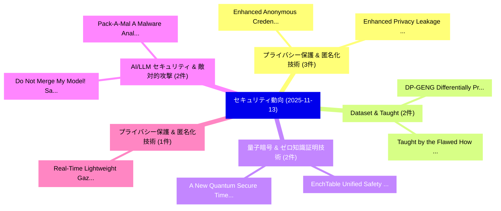

# 📅 02_daily: 日次エグゼクティブサマリー報告書 (2025-11-13)

**集計日時**: 2026-10-02 23:05:47 UTC  
**対象日付**: 2025-11-13  
**本日収集論文数**: 20 件  

---

## 💡 主要セキュリティ動向・脅威インサイト (Executive Insights)

本日の収集論文（計 20 件）において、以下の重点セキュリティ領域で活発な研究動向が確認されました：
- **プライバシー保護 & 匿名化技術** (3 件): 注目論文として 「Enhanced Anonymous Credentials...」、「Enhanced Privacy Leakage from ...」 等が発表され、実務防御および攻撃検証の進展が見られます。
- **Dataset & Taught** (2 件): 注目論文として 「DP-GENG : Differentially Priva...」、「Taught by the Flawed: How Data...」 等が発表され、実務防御および攻撃検証の進展が見られます。
- **量子暗号 & ゼロ知識証明技術** (2 件): 注目論文として 「EnchTable: Unified Safety Alig...」、「A New Quantum Secure Time Tran...」 等が発表され、実務防御および攻撃検証の進展が見られます。
- **AI/LLM セキュリティ & 敵対的攻撃** (2 件): 注目論文として 「Pack-A-Mal: A Malware Analysis...」、「Do Not Merge My Model! Safegua...」 等が発表され、実務防御および攻撃検証の進展が見られます。
- **プライバシー保護 & 匿名化技術** (1 件): 注目論文として 「Real-Time Lightweight Gaze Pri...」 等が発表され、実務防御および攻撃検証の進展が見られます。

### 🗺️ 技術・脅威トピックマインドマップ

---

## 📌 日次セキュリティ論文一覧 (日本語表形式)

| No | arXiv ID | 論文タイトル (日本語訳) | 重要キーワード | 構造化エグゼクティブ要約 (背景・提案・影響) | 脅威分類 | 詳細リンク |
|---|---|---|---|---|---|---|
| 1 | `2511.09846v1` | [Real-Time Lightweight Gaze Privacy-Preservation Techniques Validated via Offline Gaze-Based Interaction Simulation（セキュリティ分析論文）](../../okf/papers/2025-11-13/2511.09846.md) | `Time Lightweight Gaze Privacy`, `Preservation Techniques Validated`, `Based Interaction Simulation` | 【提案】概要 (Overview & Key Finding) 本論文「Real-Time Lightweight Gaze Privacy-Preservation Techniq...。実証評価により経営層・セキュリティ管理者向け推奨アクション (E... | `executive-summary` | [arXiv](https://arxiv.org/abs/2511.09846v1) &#124; [OKF](../../okf/papers/2025-11-13/2511.09846.md) |
| 2 | `2511.09876v1` | [DP-GENG : Differentially Private Dataset Distillation Guided by DP-Generated Data（セキュリティ分析論文）](../../okf/papers/2025-11-13/2511.09876.md) | `Differentially Private Dataset Distillation Guided`, `Generated Data`, `DP-Generated Data` | 【提案】概要 (Overview & Key Finding) 本論文「DP-GENG : Differentially Private Dataset Distillation G...。実証評価により経営層・セキュリティ管理者向け推奨アクション (E... | `cybersecurity` | [arXiv](https://arxiv.org/abs/2511.09876v1) &#124; [OKF](../../okf/papers/2025-11-13/2511.09876.md) |
| 3 | `2511.09879v1` | [Taught by the Flawed: How Dataset Insecurity Breeds Vulnerable AI Code（セキュリティ分析論文）](../../okf/papers/2025-11-13/2511.09879.md) | `Catherine Xia`, `Raw Meta`, `Executive Summary` | 【提案】概要 (Overview & Key Finding) 本論文「Taught by the Flawed: How Dataset Insecurity Breeds Vul...。実証評価により経営層・セキュリティ管理者向け推奨アクション (E... | `cs.AI` | [arXiv](https://arxiv.org/abs/2511.09879v1) &#124; [OKF](../../okf/papers/2025-11-13/2511.09879.md) |
| 4 | `2511.09880v1` | [EnchTable: Unified Safety Alignment Transfer in Fine-tuned 大規模言語モデル](../../okf/papers/2025-11-13/2511.09880.md) | `Unified Safety Alignment Transfer`, `Large Language Models`, `Fine-tuned Large` | 【提案】概要 (Overview & Key Finding) 本論文「EnchTable: Unified Safety Alignment Transfer in Fine-tu...。実証評価により経営層・セキュリティ管理者向け推奨アクション (E... | `executive-summary` | [arXiv](https://arxiv.org/abs/2511.09880v1) &#124; [OKF](../../okf/papers/2025-11-13/2511.09880.md) |
| 5 | `2511.09957v2` | [Pack-A-Mal: A Malware Analysis Framework for Open-Source Packages（セキュリティ分析論文）](../../okf/papers/2025-11-13/2511.09957.md) | `Source Packages`, `Open-Source Packages`, `Ly Vu` | 【提案】概要 (Overview & Key Finding) 本論文「Pack-A-Mal: A マルウェア Analysis Framework for Open-Source ...。実証評価により経営層・セキュリティ管理者向け推奨アクション (E... | `cybersecurity` | [arXiv](https://arxiv.org/abs/2511.09957v2) &#124; [OKF](../../okf/papers/2025-11-13/2511.09957.md) |
| 6 | `2511.10050v1` | [Trapped by Their Own Light: Deployable and Stealth Retroreflective Patch Attacks on Traffic Sign Recognition Systems（セキュリティ分析論文）](../../okf/papers/2025-11-13/2511.10050.md) | `Stealth Retroreflective Patch Attacks`, `Traffic Sign Recognition Systems`, `Qi Alfred Chen` | 【提案】概要 (Overview & Key Finding) 本論文「Trapped by Their Own Light: Deployable and Stealth Retr...。実証評価により経営層・セキュリティ管理者向け推奨アクション (E... | `cs.CV` | [arXiv](https://arxiv.org/abs/2511.10050v1) &#124; [OKF](../../okf/papers/2025-11-13/2511.10050.md) |
| 7 | `2511.10111v3` | [An the Security, Usability, and Automation Capabilities of Password Update Processes on Top-Ranked Websitesの分析](../../okf/papers/2025-11-13/2511.10111.md) | `Password Update Processes`, `Automation Capabilities`, `Ranked Websites` | 【提案】概要 (Overview & Key Finding) 本論文「An the Security, Usability, and Automation Capabilities...。実証評価により経営層・セキュリティ管理者向け推奨アクション (E... | `cybersecurity` | [arXiv](https://arxiv.org/abs/2511.10111v3) &#124; [OKF](../../okf/papers/2025-11-13/2511.10111.md) |
| 8 | `2511.10248v1` | [Pk-IOTA: Blockchain empowered Programmable Data Plane to secure OPC UA communications in Industry 4.0（セキュリティ分析論文）](../../okf/papers/2025-11-13/2511.10248.md) | `Programmable Data Plane`, `Rinieri Lorenzo`, `Gori Giacomo` | 【提案】概要 (Overview & Key Finding) 本論文「Pk-IOTA: Blockchain empowered Programmable Data Plane t...。実証評価により経営層・セキュリティ管理者向け推奨アクション (E... | `cs.NI` | [arXiv](https://arxiv.org/abs/2511.10248v1) &#124; [OKF](../../okf/papers/2025-11-13/2511.10248.md) |
| 9 | `2511.10265v1` | [Enhanced Anonymous Credentials for E-Voting Systems（セキュリティ分析論文）](../../okf/papers/2025-11-13/2511.10265.md) | `Enhanced Anonymous Credentials`, `Voting Systems`, `E-Voting Systems` | 【提案】概要 (Overview & Key Finding) 本論文「Enhanced Anonymous Credentials for E-Voting Systems（セキュ...。実証評価により経営層・セキュリティ管理者向け推奨アクション (E... | `cybersecurity` | [arXiv](https://arxiv.org/abs/2511.10265v1) &#124; [OKF](../../okf/papers/2025-11-13/2511.10265.md) |
| 10 | `2511.10423v2` | [Enhanced Privacy Leakage from Noise-Perturbed Gradients via Gradient-Guided Conditional Diffusion Models（セキュリティ分析論文）](../../okf/papers/2025-11-13/2511.10423.md) | `Enhanced Privacy Leakage`, `Guided Conditional Diffusion Models`, `Perturbed Gradients` | 【提案】概要 (Overview & Key Finding) 本論文「Enhanced Privacy Leakage from Noise-Perturbed Gradients...。実証評価により経営層・セキュリティ管理者向け推奨アクション (E... | `cybersecurity` | [arXiv](https://arxiv.org/abs/2511.10423v2) &#124; [OKF](../../okf/papers/2025-11-13/2511.10423.md) |
| 11 | `2511.10502v1` | [On the Detectability of Active Gradient Inversion Attacks in 連合学習](../../okf/papers/2025-11-13/2511.10502.md) | `Active Gradient Inversion Attacks`, `Federated Learning`, `Vincenzo Carletti` | 【提案】概要 (Overview & Key Finding) 本論文「On the Detectability of Active Gradient Inversion Attac...。実証評価により経営層・セキュリティ管理者向け推奨アクション (E... | `cs.AI` | [arXiv](https://arxiv.org/abs/2511.10502v1) &#124; [OKF](../../okf/papers/2025-11-13/2511.10502.md) |
| 12 | `2511.10516v1` | [How Worrying Are Privacy Attacks Against Machine Learning?（セキュリティ分析論文）](../../okf/papers/2025-11-13/2511.10516.md) | `Josep Domingo`, `Raw Meta`, `Executive Summary` | 【提案】### (日本語題名: How Worrying Are Privacy Attacks Against Machine Learning?（セキュリティ分析論文）)  > ...。実証評価により経営層・セキュリティ管理者向け推奨アクション (E... | `cybersecurity` | [arXiv](https://arxiv.org/abs/2511.10516v1) &#124; [OKF](../../okf/papers/2025-11-13/2511.10516.md) |
| 13 | `2511.10554v1` | [GraphFaaS: Serverless GNN Inference for Burst-Resilient, Real-Time Intrusion Detection（セキュリティ分析論文）](../../okf/papers/2025-11-13/2511.10554.md) | `Time Intrusion Detection`, `Real-Time Intrusion`, `Lingzhi Wang` | 【提案】概要 (Overview & Key Finding) 本論文「GraphFaaS: Serverless GNN Inference for Burst-Resilient...。実証評価により経営層・セキュリティ管理者向け推奨アクション (E... | `cybersecurity` | [arXiv](https://arxiv.org/abs/2511.10554v1) &#124; [OKF](../../okf/papers/2025-11-13/2511.10554.md) |
| 14 | `2511.10565v1` | [zkStruDul: Programming zkSNARKs with Structural Duality（セキュリティ分析論文）](../../okf/papers/2025-11-13/2511.10565.md) | `Structural Duality`, `Rahul Krishnan`, `Ashley Samuelson` | 【提案】概要 (Overview & Key Finding) 本論文「zkStruDul: Programming zkSNARKs with Structural Duality...。実証評価により経営層・セキュリティ管理者向け推奨アクション (E... | `cs.PL` | [arXiv](https://arxiv.org/abs/2511.10565v1) &#124; [OKF](../../okf/papers/2025-11-13/2511.10565.md) |
| 15 | `2511.10712v2` | [Do Not Merge My Model! Safeguarding Open-Source LLMs Against Unauthorized Model Merging（セキュリティ分析論文）](../../okf/papers/2025-11-13/2511.10712.md) | `Safeguarding Open`, `Open-Source LLMs`, `Qinfeng Li` | 【提案】Safeguarding Open-Source LLMs Against Unauthorized Model Merging（セキュリティ分析論文）)  > [!NOTE...。実証評価により経営層・セキュリティ管理者向け推奨アクション (E... | `cs.AI` | [arXiv](https://arxiv.org/abs/2511.10712v2) &#124; [OKF](../../okf/papers/2025-11-13/2511.10712.md) |
| 16 | `2511.10714v1` | [BadThink: Triggered Overthinking Attacks on Chain-of-Thought Reasoning in 大規模言語モデル](../../okf/papers/2025-11-13/2511.10714.md) | `Triggered Overthinking Attacks`, `Thought Reasoning`, `Large Language Models` | 【提案】概要 (Overview & Key Finding) 本論文「BadThink: Triggered Overthinking Attacks on Chain-of-Th...。実証評価により経営層・セキュリティ管理者向け推奨アクション (E... | `cs.AI` | [arXiv](https://arxiv.org/abs/2511.10714v1) &#124; [OKF](../../okf/papers/2025-11-13/2511.10714.md) |
| 17 | `2511.10720v1` | [PISanitizer: Preventing Prompt Injection to Long-Context LLMs via Prompt Sanitization（セキュリティ分析論文）](../../okf/papers/2025-11-13/2511.10720.md) | `Preventing Prompt Injection`, `Prompt Sanitization`, `Long-Context LLMs` | 【提案】概要 (Overview & Key Finding) 本論文「PISanitizer: Preventing プロンプトインジェクション to Long-Context L...。実証評価により経営層・セキュリティ管理者向け推奨アクション (E... | `cs.AI` | [arXiv](https://arxiv.org/abs/2511.10720v1) &#124; [OKF](../../okf/papers/2025-11-13/2511.10720.md) |
| 18 | `2511.10828v1` | [AFLGopher: Accelerating Directed Fuzzing via Feasibility-Aware Guidance（セキュリティ分析論文）](../../okf/papers/2025-11-13/2511.10828.md) | `Accelerating Directed Fuzzing`, `Aware Guidance`, `Feasibility-Aware Guidance` | 【提案】概要 (Overview & Key Finding) 本論文「AFLGopher: Accelerating Directed Fuzzing via Feasibilit...。実証評価により経営層・セキュリティ管理者向け推奨アクション (E... | `executive-summary` | [arXiv](https://arxiv.org/abs/2511.10828v1) &#124; [OKF](../../okf/papers/2025-11-13/2511.10828.md) |
| 19 | `2511.10847v1` | [A New Quantum Secure Time Transfer System（セキュリティ分析論文）](../../okf/papers/2025-11-13/2511.10847.md) | `New Quantum Secure Time Transfer System`, `Ravi Singh Adhikari`, `Aman Gupta` | 【提案】概要 (Overview & Key Finding) 本論文「A New 量子 Secure Time Transfer System（セキュリティ分析論文）」（原題: A...。実証評価により経営層・セキュリティ管理者向け推奨アクション (E... | `executive-summary` | [arXiv](https://arxiv.org/abs/2511.10847v1) &#124; [OKF](../../okf/papers/2025-11-13/2511.10847.md) |
| 20 | `2511.11759v1` | [Can AI Models be Jailbroken to Phish Elderly Victims? An End-to-End Evaluation（セキュリティ分析論文）](../../okf/papers/2025-11-13/2511.11759.md) | `Phish Elderly Victims`, `Fred Heiding`, `Simon Lermen` | 【提案】An End-to-End Evaluation ### (日本語題名: Can AI Models be Jailbroken to Phish Elderly Victims?。実証評価により経営層・セキュリティ管理者向け推奨アクション (E... | `cs.AI` | [arXiv](https://arxiv.org/abs/2511.11759v1) &#124; [OKF](../../okf/papers/2025-11-13/2511.11759.md) |

