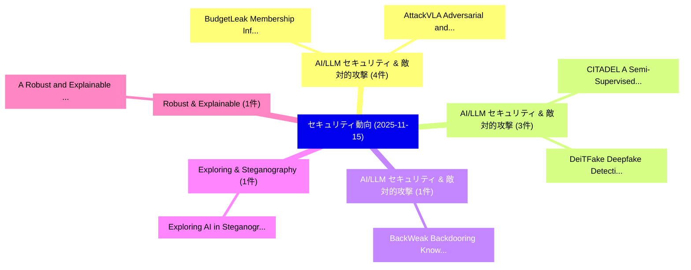

# 📅 02_daily: 日次エグゼクティブサマリー報告書 (2025-11-15)

**集計日時**: 2026-10-02 23:05:47 UTC  
**対象日付**: 2025-11-15  
**本日収集論文数**: 19 件  

---

## 💡 主要セキュリティ動向・脅威インサイト (Executive Insights)

本日の収集論文（計 19 件）において、以下の重点セキュリティ領域で活発な研究動向が確認されました：
- **AI/LLM セキュリティ & 敵対的攻撃** (4 件): 注目論文として 「BudgetLeak: Membership Inferen...」、「AttackVLA: Adversarial and Bac...」 等が発表され、実務防御および攻撃検証の進展が見られます。
- **AI/LLM セキュリティ & 敵対的攻撃** (3 件): 注目論文として 「CITADEL: A Semi-Supervised Act...」、「DeiTFake: Deepfake Detection M...」 等が発表され、実務防御および攻撃検証の進展が見られます。
- **AI/LLM セキュリティ & 敵対的攻撃** (1 件): 注目論文として 「BackWeak: Backdooring Knowledg...」 等が発表され、実務防御および攻撃検証の進展が見られます。
- **Exploring & Steganography** (1 件): 注目論文として 「Exploring AI in Steganography ...」 等が発表され、実務防御および攻撃検証の進展が見られます。
- **Robust & Explainable** (1 件): 注目論文として 「A Robust and Explainable Trans...」 等が発表され、実務防御および攻撃検証の進展が見られます。

### 🗺️ 技術・脅威トピックマインドマップ

---

## 📌 日次セキュリティ論文一覧 (日本語表形式)

| No | arXiv ID | 論文タイトル (日本語訳) | 重要キーワード | 構造化エグゼクティブ要約 (背景・提案・影響) | 脅威分類 | 詳細リンク |
|---|---|---|---|---|---|---|
| 1 | `2511.11979v3` | [CITADEL: A Semi-Supervised Active Learning Framework for マルウェア検出 Under Continuous Distribution Drift](../../okf/papers/2025-11-15/2511.11979.md) | `Semi-Supervised Active`, `Md Ahsanul Haque`, `Md Mahmuduzzaman Kamol` | 【提案】概要 (Overview & Key Finding) 本論文「CITADEL: A Semi-Supervised Active Learning Framework fo...。実証評価により経営層・セキュリティ管理者向け推奨アクション (E... | `cybersecurity` | [arXiv](https://arxiv.org/abs/2511.11979v3) &#124; [OKF](../../okf/papers/2025-11-15/2511.11979.md) |
| 2 | `2511.12043v1` | [BudgetLeak: Membership Inference Attacks on RAG Systems via the Generation Budget Side Channel（セキュリティ分析論文）](../../okf/papers/2025-11-15/2511.12043.md) | `Generation Budget Side Channel`, `Membership Inference Attacks`, `Hao Li` | 【提案】概要 (Overview & Key Finding) 本論文「BudgetLeak: Membership Inference Attacks on RAG Systems...。実証評価により経営層・セキュリティ管理者向け推奨アクション (E... | `cybersecurity` | [arXiv](https://arxiv.org/abs/2511.12043v1) &#124; [OKF](../../okf/papers/2025-11-15/2511.12043.md) |
| 3 | `2511.12046v2` | [BackWeak: Backdooring Knowledge Distillation Simply with Weak Triggers and Fine-tuning（セキュリティ分析論文）](../../okf/papers/2025-11-15/2511.12046.md) | `Backdooring Knowledge Distillation Simply`, `Weak Triggers`, `Shanmin Wang` | 【提案】概要 (Overview & Key Finding) 本論文「BackWeak: Backdooring Knowledge Distillation Simply wit...。実証評価により経営層・セキュリティ管理者向け推奨アクション (E... | `cs.AI` | [arXiv](https://arxiv.org/abs/2511.12046v2) &#124; [OKF](../../okf/papers/2025-11-15/2511.12046.md) |
| 4 | `2511.12048v1` | [DeiTFake: Deepfake Detection Model using DeiT Multi-Stage Training（セキュリティ分析論文）](../../okf/papers/2025-11-15/2511.12048.md) | `Deepfake Detection Model`, `Stage Training`, `Multi-Stage Training` | 【提案】概要 (Overview & Key Finding) 本論文「DeiTFake: Deepfake Detection Model using DeiT Multi-Sta...。実証評価により経営層・セキュリティ管理者向け推奨アクション (E... | `cs.CV` | [arXiv](https://arxiv.org/abs/2511.12048v1) &#124; [OKF](../../okf/papers/2025-11-15/2511.12048.md) |
| 5 | `2511.12052v1` | [Exploring AI in Steganography and Steganalysis: Trends, Clusters, and Sustainable Development Potential（セキュリティ分析論文）](../../okf/papers/2025-11-15/2511.12052.md) | `Sustainable Development Potential`, `Aditya Kumar Sahu`, `Chandan Kumar` | 【提案】概要 (Overview & Key Finding) 本論文「Exploring AI in Steganography and Steganalysis: Trends,...。実証評価により経営層・セキュリティ管理者向け推奨アクション (E... | `cs.AI` | [arXiv](https://arxiv.org/abs/2511.12052v1) &#124; [OKF](../../okf/papers/2025-11-15/2511.12052.md) |
| 6 | `2511.12085v3` | [A Robust and Explainable Transformer-Based Framework for Phishing Email Detection（セキュリティ分析論文）](../../okf/papers/2025-11-15/2511.12085.md) | `Phishing Email Detection`, `Explainable Transformer`, `Raw Meta` | 【提案】概要 (Overview & Key Finding) 本論文「A Robust and Explainable Transformer-Based Framework fo...。実証評価により経営層・セキュリティ管理者向け推奨アクション (E... | `cs.AI` | [arXiv](https://arxiv.org/abs/2511.12085v3) &#124; [OKF](../../okf/papers/2025-11-15/2511.12085.md) |
| 7 | `2511.12149v1` | [AttackVLA: Adversarial and Backdoor Attacks on Vision-Language-Action Modelsのベンチマーク評価](../../okf/papers/2025-11-15/2511.12149.md) | `Backdoor Attacks`, `Benchmarking Adversarial`, `Action Models` | 【提案】概要 (Overview & Key Finding) 本論文「AttackVLA: Adversarial and Backdoor Attacks on Vision-L...。実証評価により経営層・セキュリティ管理者向け推奨アクション (E... | `cs.AI` | [arXiv](https://arxiv.org/abs/2511.12149v1) &#124; [OKF](../../okf/papers/2025-11-15/2511.12149.md) |
| 8 | `2511.12164v1` | [Multi-Agent Collaborative Fuzzing with Continuous Reflection for Smart Contracts 脆弱性検出](../../okf/papers/2025-11-15/2511.12164.md) | `Agent Collaborative Fuzzing`, `Continuous Reflection`, `Multi-Agent Collaborative` | 【提案】概要 (Overview & Key Finding) 本論文「Multi-Agent Collaborative Fuzzing with Continuous Refle...。実証評価により経営層・セキュリティ管理者向け推奨アクション (E... | `executive-summary` | [arXiv](https://arxiv.org/abs/2511.12164v1) &#124; [OKF](../../okf/papers/2025-11-15/2511.12164.md) |
| 9 | `2511.12224v1` | [RulePilot: An LLM-Powered Agent for Security Rule Generation（セキュリティ分析論文）](../../okf/papers/2025-11-15/2511.12224.md) | `Security Rule Generation`, `Powered Agent`, `LLM-Powered Agent` | 【提案】概要 (Overview & Key Finding) 本論文「RulePilot: An LLM-Powered Agent for Security Rule Gener...。実証評価により経営層・セキュリティ管理者向け推奨アクション (E... | `cybersecurity` | [arXiv](https://arxiv.org/abs/2511.12224v1) &#124; [OKF](../../okf/papers/2025-11-15/2511.12224.md) |
| 10 | `2511.12225v1` | [eFPE: Design, Implementation, and Evaluation of a Lightweight Format-Preserving Encryption Algorithm for Embedded Systems（セキュリティ分析論文）](../../okf/papers/2025-11-15/2511.12225.md) | `Preserving Encryption Algorithm`, `Lightweight Format`, `Embedded Systems` | 【提案】概要 (Overview & Key Finding) 本論文「eFPE: Design, Implementation, and Evaluation of a Light...。実証評価により経営層・セキュリティ管理者向け推奨アクション (E... | `executive-summary` | [arXiv](https://arxiv.org/abs/2511.12225v1) &#124; [OKF](../../okf/papers/2025-11-15/2511.12225.md) |
| 11 | `2511.12265v2` | [Stabilizing Multi-Attack Adversarial Training via Bandit Optimization（セキュリティ分析論文）](../../okf/papers/2025-11-15/2511.12265.md) | `Attack Adversarial Training`, `Stabilizing Multi`, `Bandit Optimization` | 【提案】概要 (Overview & Key Finding) 本論文「Stabilizing Multi-Attack Adversarial Training via Bandi...。実証評価により経営層・セキュリティ管理者向け推奨アクション (E... | `cs.AI` | [arXiv](https://arxiv.org/abs/2511.12265v2) &#124; [OKF](../../okf/papers/2025-11-15/2511.12265.md) |
| 12 | `2511.12274v1` | [Software Supply Chain Security of Web3（セキュリティ分析論文）](../../okf/papers/2025-11-15/2511.12274.md) | `Software Supply Chain Security`, `Martin Monperrus`, `Raw Meta` | 【提案】概要 (Overview & Key Finding) 本論文「Software Supply Chain Security of Web3（セキュリティ分析論文）」（原題:...。実証評価により経営層・セキュリティ管理者向け推奨アクション (E... | `executive-summary` | [arXiv](https://arxiv.org/abs/2511.12274v1) &#124; [OKF](../../okf/papers/2025-11-15/2511.12274.md) |
| 13 | `2511.12295v1` | [Privacy-Preserving Prompt Injection Detection for LLMs Using 連合学習 and Embedding-Based NLP Classification](../../okf/papers/2025-11-15/2511.12295.md) | `Preserving Prompt Injection Detection`, `Privacy-Preserving Prompt`, `Embedding-Based NLP` | 【提案】概要 (Overview & Key Finding) 本論文「Privacy-Preserving プロンプトインジェクション Detection for LLMs Usi...。実証評価により経営層・セキュリティ管理者向け推奨アクション (E... | `cybersecurity` | [arXiv](https://arxiv.org/abs/2511.12295v1) &#124; [OKF](../../okf/papers/2025-11-15/2511.12295.md) |
| 14 | `2511.12313v2` | [An Improved Quantum Anonymous Notification Protocol for Quantum-Augmented Networks（セキュリティ分析論文）](../../okf/papers/2025-11-15/2511.12313.md) | `Augmented Networks`, `Quantum-Augmented Networks`, `Nitin Jha` | 【提案】概要 (Overview & Key Finding) 本論文「An Improved 量子 Anonymous Notification Protocol for 量子-A...。実証評価により経営層・セキュリティ管理者向け推奨アクション (E... | `executive-summary` | [arXiv](https://arxiv.org/abs/2511.12313v2) &#124; [OKF](../../okf/papers/2025-11-15/2511.12313.md) |
| 15 | `2511.12325v2` | [Dyadic-Chaotic Lifting S-Boxes for Enhanced Physical-Layer Security within 6G Networks（セキュリティ分析論文）](../../okf/papers/2025-11-15/2511.12325.md) | `Chaotic Lifting`, `Enhanced Physical`, `Layer Security` | 【提案】概要 (Overview & Key Finding) 本論文「Dyadic-Chaotic Lifting S-Boxes for Enhanced Physical-La...。実証評価により経営層・セキュリティ管理者向け推奨アクション (E... | `executive-summary` | [arXiv](https://arxiv.org/abs/2511.12325v2) &#124; [OKF](../../okf/papers/2025-11-15/2511.12325.md) |
| 16 | `2511.12377v1` | [On the Security and Privacy of AI-based Mobile Health Chatbots（セキュリティ分析論文）](../../okf/papers/2025-11-15/2511.12377.md) | `Mobile Health Chatbots`, `AI-based Mobile`, `Leonardo Horn Iwaya` | 【提案】概要 (Overview & Key Finding) 本論文「On the Security and Privacy of AI-based Mobile Health C...。実証評価により経営層・セキュリティ管理者向け推奨アクション (E... | `executive-summary` | [arXiv](https://arxiv.org/abs/2511.12377v1) &#124; [OKF](../../okf/papers/2025-11-15/2511.12377.md) |
| 17 | `2511.12385v1` | [GenSIaC: Toward Security-Aware Infrastructure-as-Code Generation with Large Language Models（セキュリティ分析論文）](../../okf/papers/2025-11-15/2511.12385.md) | `Large Language Models`, `Toward Security`, `Aware Infrastructure` | 【提案】概要 (Overview & Key Finding) 本論文「GenSIaC: Toward Security-Aware Infrastructure-as-Code G...。実証評価により経営層・セキュリティ管理者向け推奨アクション (E... | `executive-summary` | [arXiv](https://arxiv.org/abs/2511.12385v1) &#124; [OKF](../../okf/papers/2025-11-15/2511.12385.md) |
| 18 | `2511.13771v1` | [ExplainableGuard: Interpretable Adversarial Defense for 大規模言語モデル Using Chain-of-Thought Reasoning](../../okf/papers/2025-11-15/2511.13771.md) | `Interpretable Adversarial Defense`, `Thought Reasoning`, `Large Language Models Using Chain` | 【提案】概要 (Overview & Key Finding) 本論文「ExplainableGuard: Interpretable Adversarial Defense for...。実証評価により経営層・セキュリティ管理者向け推奨アクション (E... | `cs.AI` | [arXiv](https://arxiv.org/abs/2511.13771v1) &#124; [OKF](../../okf/papers/2025-11-15/2511.13771.md) |
| 19 | `2511.13777v1` | [Hashpower allocation in Pay-per-Share blockchain mining pools（セキュリティ分析論文）](../../okf/papers/2025-11-15/2511.13777.md) | `Olivier Goffard`, `Hansjoerg Albrecher`, `Pierre Fouque` | 【提案】概要 (Overview & Key Finding) 本論文「Hashpower allocation in Pay-per-Share blockchain mining...。実証評価により経営層・セキュリティ管理者向け推奨アクション (E... | `math.PR` | [arXiv](https://arxiv.org/abs/2511.13777v1) &#124; [OKF](../../okf/papers/2025-11-15/2511.13777.md) |

