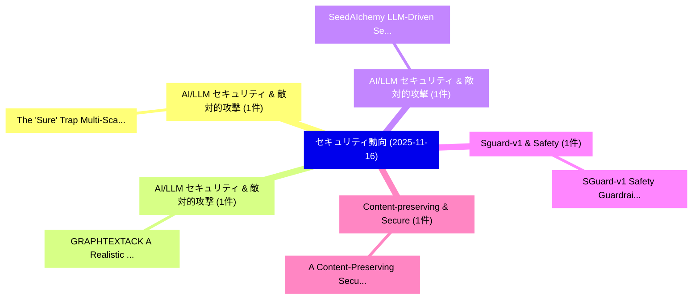

# 📅 02_daily: 日次エグゼクティブサマリー報告書 (2025-11-16)

**集計日時**: 2026-10-02 23:05:47 UTC  
**対象日付**: 2025-11-16  
**本日収集論文数**: 23 件  

---

## 💡 主要セキュリティ動向・脅威インサイト (Executive Insights)

本日の収集論文（計 23 件）において、以下の重点セキュリティ領域で活発な研究動向が確認されました：
- **AI/LLM セキュリティ & 敵対的攻撃** (1 件): 注目論文として 「The 'Sure' Trap: Multi-Scale P...」 等が発表され、実務防御および攻撃検証の進展が見られます。
- **AI/LLM セキュリティ & 敵対的攻撃** (1 件): 注目論文として 「GRAPHTEXTACK: A Realistic Blac...」 等が発表され、実務防御および攻撃検証の進展が見られます。
- **AI/LLM セキュリティ & 敵対的攻撃** (1 件): 注目論文として 「SeedAIchemy: LLM-Driven Seed C...」 等が発表され、実務防御および攻撃検証の進展が見られます。
- **Sguard-v1 & Safety** (1 件): 注目論文として 「SGuard-v1: Safety Guardrail fo...」 等が発表され、実務防御および攻撃検証の進展が見られます。
- **Content-preserving & Secure** (1 件): 注目論文として 「A Content-Preserving Secure Li...」 等が発表され、実務防御および攻撃検証の進展が見られます。

### 🗺️ 技術・脅威トピックマインドマップ

---

## 📌 日次セキュリティ論文一覧 (日本語表形式)

| No | arXiv ID | 論文タイトル (日本語訳) | 重要キーワード | 構造化エグゼクティブ要約 (背景・提案・影響) | 脅威分類 | 詳細リンク |
|---|---|---|---|---|---|---|
| 1 | `2511.12414v1` | [The 'Sure' Trap: Multi-Scale Poisoning Stealthy Compliance-Only Backdoors in Fine-Tuned Large Language Modelsの分析](../../okf/papers/2025-11-16/2511.12414.md) | `Multi-Scale Poisoning`, `Compliance-Only Backdoors`, `Fine-Tuned Large` | 【提案】概要 (Overview & Key Finding) 本論文「The 'Sure' Trap: Multi-Scale Poisoning Stealthy Complia...。実証評価により経営層・セキュリティ管理者向け推奨アクション (E... | `executive-summary` | [arXiv](https://arxiv.org/abs/2511.12414v1) &#124; [OKF](../../okf/papers/2025-11-16/2511.12414.md) |
| 2 | `2511.12423v1` | [GRAPHTEXTACK: A Realistic Black-Box Node Injection Attack on LLM-Enhanced GNNs（セキュリティ分析論文）](../../okf/papers/2025-11-16/2511.12423.md) | `Box Node Injection Attack`, `Realistic Black`, `Black-Box Node` | 【提案】概要 (Overview & Key Finding) 本論文「GRAPHTEXTACK: A Realistic Black-Box Node Injection Atta...。実証評価により経営層・セキュリティ管理者向け推奨アクション (E... | `executive-summary` | [arXiv](https://arxiv.org/abs/2511.12423v1) &#124; [OKF](../../okf/papers/2025-11-16/2511.12423.md) |
| 3 | `2511.12448v1` | [SeedAIchemy: LLM-Driven Seed Corpus Generation for Fuzzing（セキュリティ分析論文）](../../okf/papers/2025-11-16/2511.12448.md) | `Driven Seed Corpus Generation`, `LLM-Driven Seed`, `Aidan Wen` | 【提案】概要 (Overview & Key Finding) 本論文「SeedAIchemy: LLM-Driven Seed Corpus Generation for Fuzz...。実証評価によりAlzahrani, Jingzhi Jiang,... | `cs.AI` | [arXiv](https://arxiv.org/abs/2511.12448v1) &#124; [OKF](../../okf/papers/2025-11-16/2511.12448.md) |
| 4 | `2511.12497v1` | [SGuard-v1: Safety Guardrail for 大規模言語モデル](../../okf/papers/2025-11-16/2511.12497.md) | `Safety Guardrail`, `Large Language Models`, `Jaewoong Yun` | 【提案】概要 (Overview & Key Finding) 本論文「SGuard-v1: Safety Guardrail for 大規模言語モデル」（原題: SGuard-v1...。実証評価により経営層・セキュリティ管理者向け推奨アクション (E... | `cs.AI` | [arXiv](https://arxiv.org/abs/2511.12497v1) &#124; [OKF](../../okf/papers/2025-11-16/2511.12497.md) |
| 5 | `2511.12565v2` | [A Content-Preserving Secure Linguistic Steganography（セキュリティ分析論文）](../../okf/papers/2025-11-16/2511.12565.md) | `Preserving Secure Linguistic Steganography`, `Content-Preserving Secure`, `Lingyun Xiang` | 【提案】概要 (Overview & Key Finding) 本論文「A Content-Preserving Secure Linguistic Steganography（セキ...。実証評価により経営層・セキュリティ管理者向け推奨アクション (E... | `executive-summary` | [arXiv](https://arxiv.org/abs/2511.12565v2) &#124; [OKF](../../okf/papers/2025-11-16/2511.12565.md) |
| 6 | `2511.12626v3` | [Prrr: Personal Random Rewards for Blockchain Reporting（セキュリティ分析論文）](../../okf/papers/2025-11-16/2511.12626.md) | `Personal Random Rewards`, `Blockchain Reporting`, `Hongyin Chen` | 【提案】概要 (Overview & Key Finding) 本論文「Prrr: Personal Random Rewards for Blockchain Reporting（...。実証評価により経営層・セキュリティ管理者向け推奨アクション (E... | `executive-summary` | [arXiv](https://arxiv.org/abs/2511.12626v3) &#124; [OKF](../../okf/papers/2025-11-16/2511.12626.md) |
| 7 | `2511.12643v1` | [Adaptive Dual-Layer Web Application Firewall (ADL-WAF) Leveraging Machine Learning for Enhanced Anomaly and Threat Detection（セキュリティ分析論文）](../../okf/papers/2025-11-16/2511.12643.md) | `Layer Web Application Firewall`, `Leveraging Machine Learning`, `Adaptive Dual` | 【提案】概要 (Overview & Key Finding) 本論文「Adaptive Dual-Layer Web Application Firewall (ADL-WAF) ...。実証評価により経営層・セキュリティ管理者向け推奨アクション (E... | `cs.NI` | [arXiv](https://arxiv.org/abs/2511.12643v1) &#124; [OKF](../../okf/papers/2025-11-16/2511.12643.md) |
| 8 | `2511.12648v1` | [Scalable Hierarchical AI-Blockchain Framework for Real-Time Anomaly Detection in Large-Scale Autonomous Vehicle Networks（セキュリティ分析論文）](../../okf/papers/2025-11-16/2511.12648.md) | `Scale Autonomous Vehicle Networks`, `Time Anomaly Detection`, `Scalable Hierarchical` | 【提案】概要 (Overview & Key Finding) 本論文「Scalable Hierarchical AI-Blockchain Framework for Real-...。実証評価により経営層・セキュリティ管理者向け推奨アクション (E... | `cs.AI` | [arXiv](https://arxiv.org/abs/2511.12648v1) &#124; [OKF](../../okf/papers/2025-11-16/2511.12648.md) |
| 9 | `2511.12652v1` | [On Counts and Densities of Homogeneous Bent Functions: An Evolutionary Approach（セキュリティ分析論文）](../../okf/papers/2025-11-16/2511.12652.md) | `Homogeneous Bent Functions`, `Homogeneous Bent Fun`, `Claude Carlet` | 【提案】概要 (Overview & Key Finding) 本論文「On Counts and Densities of Homogeneous Bent Functions: ...。実証評価により経営層・セキュリティ管理者向け推奨アクション (E... | `executive-summary` | [arXiv](https://arxiv.org/abs/2511.12652v1) &#124; [OKF](../../okf/papers/2025-11-16/2511.12652.md) |
| 10 | `2511.12663v1` | [FLClear: Visually Verifiable Multi-Client Watermarking for 連合学習](../../okf/papers/2025-11-16/2511.12663.md) | `Visually Verifiable Multi`, `Client Watermarking`, `Multi-Client Watermarking` | 【提案】概要 (Overview & Key Finding) 本論文「FLClear: Visually Verifiable Multi-Client Watermarking ...。実証評価により経営層・セキュリティ管理者向け推奨アクション (E... | `cs.AI` | [arXiv](https://arxiv.org/abs/2511.12663v1) &#124; [OKF](../../okf/papers/2025-11-16/2511.12663.md) |
| 11 | `2511.12668v1` | [AI Bill of Materials and Beyond: Systematizing Security Assurance through the AI Risk Scanning (AIRS) Framework（セキュリティ分析論文）](../../okf/papers/2025-11-16/2511.12668.md) | `Systematizing Security Assurance`, `Risk Scanning`, `Catherine Chen Kieffer` | 【提案】概要 (Overview & Key Finding) 本論文「AI Bill of Materials and Beyond: Systematizing Security...。実証評価により経営層・セキュリティ管理者向け推奨アクション (E... | `cs.AI` | [arXiv](https://arxiv.org/abs/2511.12668v1) &#124; [OKF](../../okf/papers/2025-11-16/2511.12668.md) |
| 12 | `2511.12704v1` | [Offensive tool determination strategy R.I.D.D.L.E. + (C)（セキュリティ分析論文）](../../okf/papers/2025-11-16/2511.12704.md) | `Herman Errico`, `Raw Meta`, `Executive Summary` | 【提案】+ (C) ### (日本語題名: Offensive tool determination strategy R.I.D.D.L.E. + (C)（セキュリティ分析論文）)...。実証評価により経営層・セキュリティ管理者向け推奨アクション (E... | `cybersecurity` | [arXiv](https://arxiv.org/abs/2511.12704v1) &#124; [OKF](../../okf/papers/2025-11-16/2511.12704.md) |
| 13 | `2511.12710v2` | [Evolve the Method, Not the Prompts: Evolutionary Synthesis of Jailbreak Attacks on LLMs（セキュリティ分析論文）](../../okf/papers/2025-11-16/2511.12710.md) | `Evolutionary Synthesis`, `Jailbreak Attacks`, `Yunhao Chen` | 【提案】背景とセキュリティ上の課題 (Background & Problem) 本研究はサイバー脅威環境におけるセキュリティ構造・脆弱性の検証を目的としています。(主要検出項目: ...。実証評価により経営層・セキュリティ管理者向け推奨アクション (E... | `executive-summary` | [arXiv](https://arxiv.org/abs/2511.12710v2) &#124; [OKF](../../okf/papers/2025-11-16/2511.12710.md) |
| 14 | `2511.12739v1` | [ProxyPrints: From Database Breach to Spoof, A Plug-and-Play Defense for Biometric Systems（セキュリティ分析論文）](../../okf/papers/2025-11-16/2511.12739.md) | `Play Defense`, `Biometric Systems`, `Yaniv Hacmon` | 【提案】概要 (Overview & Key Finding) 本論文「ProxyPrints: From Database Breach to Spoof, A Plug-and-...。実証評価により経営層・セキュリティ管理者向け推奨アクション (E... | `cybersecurity` | [arXiv](https://arxiv.org/abs/2511.12739v1) &#124; [OKF](../../okf/papers/2025-11-16/2511.12739.md) |
| 15 | `2511.12743v1` | [An Evaluation Framework for Network IDS/IPS Datasets: Leveraging MITRE ATT&CK and Industry Relevance Metrics（セキュリティ分析論文）](../../okf/papers/2025-11-16/2511.12743.md) | `Industry Relevance Metrics`, `Adrita Rahman Tori`, `Khondokar Fida Hasan` | 【提案】概要 (Overview & Key Finding) 本論文「An Evaluation Framework for Network IDS/IPS Datasets: L...。実証評価により経営層・セキュリティ管理者向け推奨アクション (E... | `executive-summary` | [arXiv](https://arxiv.org/abs/2511.12743v1) &#124; [OKF](../../okf/papers/2025-11-16/2511.12743.md) |
| 16 | `2511.12752v1` | [Whose Narrative is it Anyway? A KV Cache Manipulation Attack（セキュリティ分析論文）](../../okf/papers/2025-11-16/2511.12752.md) | `Cache Manipulation Attack`, `Whose Narrative`, `Arun Baalaaji Sankar Ananthan` | 【提案】A KV Cache Manipulation Attack ### (日本語題名: Whose Narrative is it Anyway?。実証評価により経営層・セキュリティ管理者向け推奨アクション (Executive Recommend... | `cs.AI` | [arXiv](https://arxiv.org/abs/2511.12752v1) &#124; [OKF](../../okf/papers/2025-11-16/2511.12752.md) |
| 17 | `2511.12766v1` | [サイバーセキュリティ of High-Altitude Platform Stations: Threat Taxonomy, Attacks and Defenses with Standards Mapping - DDoS Attack Use Case](../../okf/papers/2025-11-16/2511.12766.md) | `Altitude Platform Stations`, `Attack Use Case`, `Threat Taxonomy` | 【提案】概要 (Overview & Key Finding) 本論文「サイバーセキュリティ of High-Altitude Platform Stations: 脅威 Taxon...。実証評価により経営層・セキュリティ管理者向け推奨アクション (E... | `cs.NI` | [arXiv](https://arxiv.org/abs/2511.12766v1) &#124; [OKF](../../okf/papers/2025-11-16/2511.12766.md) |
| 18 | `2511.12782v1` | [LLM Reinforcement in Context（セキュリティ分析論文）](../../okf/papers/2025-11-16/2511.12782.md) | `Thomas Rivasseau`, `Raw Meta`, `Executive Summary` | 【提案】概要 (Overview & Key Finding) 本論文「LLM Reinforcement in Context（セキュリティ分析論文）」（原題: LLM Reinf...。実証評価により経営層・セキュリティ管理者向け推奨アクション (E... | `executive-summary` | [arXiv](https://arxiv.org/abs/2511.12782v1) &#124; [OKF](../../okf/papers/2025-11-16/2511.12782.md) |
| 19 | `2511.12827v1` | [Efficient Adversarial Malware Defense via Trust-Based Raw Override and Confidence-Adaptive Bit-Depth Reduction（セキュリティ分析論文）](../../okf/papers/2025-11-16/2511.12827.md) | `Efficient Adversarial Malware Defense`, `Based Raw Override`, `Trust-Based Raw` | 【提案】概要 (Overview & Key Finding) 本論文「Efficient Adversarial マルウェア Defense via Trust-Based Raw...。実証評価により経営層・セキュリティ管理者向け推奨アクション (E... | `executive-summary` | [arXiv](https://arxiv.org/abs/2511.12827v1) &#124; [OKF](../../okf/papers/2025-11-16/2511.12827.md) |
| 20 | `2511.12830v1` | [Telekommunikationsüberwachung am Scheideweg: Zur Regulierbarkeit des Zugriffes auf verschlüsselte Kommunikation（セキュリティ分析論文）](../../okf/papers/2025-11-16/2511.12830.md) | `Zur Regulierbarkeit`, `Joanna Klauser`, `Bruno Albert` | 【提案】概要 (Overview & Key Finding) 本論文「Telekommunikationsüberwachung am Scheideweg: Zur Reguli...。実証評価により経営層・セキュリティ管理者向け推奨アクション (E... | `executive-summary` | [arXiv](https://arxiv.org/abs/2511.12830v1) &#124; [OKF](../../okf/papers/2025-11-16/2511.12830.md) |
| 21 | `2511.13781v1` | [Human-Centered Threat Modeling in Practice: Lessons, Challenges, and Paths Forward（セキュリティ分析論文）](../../okf/papers/2025-11-16/2511.13781.md) | `Centered Threat Modeling`, `Paths Forward`, `Human-Centered Threat` | 【提案】概要 (Overview & Key Finding) 本論文「Human-Centered 脅威 Modeling in Practice: Lessons, Challe...。実証評価により経営層・セキュリティ管理者向け推奨アクション (E... | `executive-summary` | [arXiv](https://arxiv.org/abs/2511.13781v1) &#124; [OKF](../../okf/papers/2025-11-16/2511.13781.md) |
| 22 | `2511.13788v2` | [Scaling Patterns in Adversarial Alignment: Evidence from Multi-LLM Jailbreak Experiments（セキュリティ分析論文）](../../okf/papers/2025-11-16/2511.13788.md) | `Scaling Patterns`, `Adversarial Alignment`, `Jailbreak Experiments` | 【提案】概要 (Overview & Key Finding) 本論文「Scaling Patterns in Adversarial Alignment: Evidence fro...。実証評価により経営層・セキュリティ管理者向け推奨アクション (E... | `cs.AI` | [arXiv](https://arxiv.org/abs/2511.13788v2) &#124; [OKF](../../okf/papers/2025-11-16/2511.13788.md) |
| 23 | `2511.13789v1` | [Uncovering and Aligning Anomalous Attention Heads to Defend Against NLP Backdoor Attacks（セキュリティ分析論文）](../../okf/papers/2025-11-16/2511.13789.md) | `Aligning Anomalous Attention Heads`, `Backdoor Attacks`, `Haotian Jin` | 【提案】概要 (Overview & Key Finding) 本論文「Uncovering and Aligning Anomalous Attention Heads to De...。実証評価により経営層・セキュリティ管理者向け推奨アクション (E... | `cs.AI` | [arXiv](https://arxiv.org/abs/2511.13789v1) &#124; [OKF](../../okf/papers/2025-11-16/2511.13789.md) |

