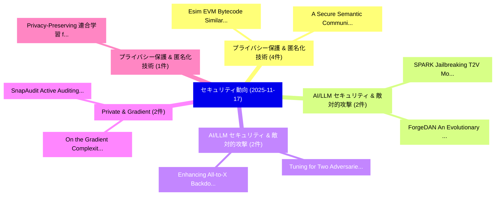

# 📅 02_daily: 日次エグゼクティブサマリー報告書 (2025-11-17)

**集計日時**: 2026-10-02 23:05:47 UTC  
**対象日付**: 2025-11-17  
**本日収集論文数**: 28 件  

---

## 💡 主要セキュリティ動向・脅威インサイト (Executive Insights)

本日の収集論文（計 28 件）において、以下の重点セキュリティ領域で活発な研究動向が確認されました：
- **プライバシー保護 & 匿名化技術** (4 件): 注目論文として 「Esim: EVM Bytecode Similarity ...」、「A Secure Semantic Communicatio...」 等が発表され、実務防御および攻撃検証の進展が見られます。
- **AI/LLM セキュリティ & 敵対的攻撃** (2 件): 注目論文として 「SPARK: Jailbreaking T2V Models...」、「ForgeDAN: An Evolutionary Fram...」 等が発表され、実務防御および攻撃検証の進展が見られます。
- **AI/LLM セキュリティ & 敵対的攻撃** (2 件): 注目論文として 「Enhancing All-to-X Backdoor At...」、「Tuning for Two Adversaries: En...」 等が発表され、実務防御および攻撃検証の進展が見られます。
- **Private & Gradient** (2 件): 注目論文として 「SnapAudit: Active Auditing of ...」、「On the Gradient Complexity of ...」 等が発表され、実務防御および攻撃検証の進展が見られます。
- **プライバシー保護 & 匿名化技術** (1 件): 注目論文として 「Privacy-Preserving 連合学習 from P...」 等が発表され、実務防御および攻撃検証の進展が見られます。

### 🗺️ 技術・脅威トピックマインドマップ

---

## 📌 日次セキュリティ論文一覧 (日本語表形式)

| No | arXiv ID | 論文タイトル (日本語訳) | 重要キーワード | 構造化エグゼクティブ要約 (背景・提案・影響) | 脅威分類 | 詳細リンク |
|---|---|---|---|---|---|---|
| 1 | `2511.12936v1` | [Privacy-Preserving 連合学習 from Partial Decryption Verifiable Threshold Multi-Client Functional Encryption](../../okf/papers/2025-11-17/2511.12936.md) | `Partial Decryption Verifiable Threshold Multi`, `Client Functional Encryption`, `Multi-Client Functional` | 【提案】概要 (Overview & Key Finding) 本論文「Privacy-Preserving 連合学習 from Partial Decryption Verifia...。実証評価により経営層・セキュリティ管理者向け推奨アクション (E... | `cs.AI` | [arXiv](https://arxiv.org/abs/2511.12936v1) &#124; [OKF](../../okf/papers/2025-11-17/2511.12936.md) |
| 2 | `2511.12956v1` | [T2I-Based Physical-World Appearance Attack against Traffic Sign Recognition Systems in Autonomous Driving（セキュリティ分析論文）](../../okf/papers/2025-11-17/2511.12956.md) | `Traffic Sign Recognition Systems`, `World Appearance Attack`, `Based Physical` | 【提案】概要 (Overview & Key Finding) 本論文「T2I-Based Physical-World Appearance Attack against Traf...。実証評価により経営層・セキュリティ管理者向け推奨アクション (E... | `cs.CV` | [arXiv](https://arxiv.org/abs/2511.12956v1) &#124; [OKF](../../okf/papers/2025-11-17/2511.12956.md) |
| 3 | `2511.12971v1` | [Esim: EVM Bytecode Similarity Detection Based on Stable-Semantic Graph（セキュリティ分析論文）](../../okf/papers/2025-11-17/2511.12971.md) | `Bytecode Similarity Detection Based`, `Semantic Graph`, `Stable-Semantic Graph` | 【提案】概要 (Overview & Key Finding) 本論文「Esim: EVM Bytecode Similarity Detection Based on Stable...。実証評価により経営層・セキュリティ管理者向け推奨アクション (E... | `cs.AI` | [arXiv](https://arxiv.org/abs/2511.12971v1) &#124; [OKF](../../okf/papers/2025-11-17/2511.12971.md) |
| 4 | `2511.12981v1` | [The Grain Family of Stream Ciphers: an Abstraction, Strengthening of Components and New Concrete Instantiations（セキュリティ分析論文）](../../okf/papers/2025-11-17/2511.12981.md) | `New Concrete Instantiations`, `Stream Ciphers`, `Palash Sarkar` | 【提案】概要 (Overview & Key Finding) 本論文「The Grain Family of Stream Ciphers: an Abstraction, Str...。実証評価により経営層・セキュリティ管理者向け推奨アクション (E... | `cybersecurity` | [arXiv](https://arxiv.org/abs/2511.12981v1) &#124; [OKF](../../okf/papers/2025-11-17/2511.12981.md) |
| 5 | `2511.12982v1` | [SafeGRPO: Self-Rewarded Multimodal Safety Alignment via Rule-Governed Policy Optimization（セキュリティ分析論文）](../../okf/papers/2025-11-17/2511.12982.md) | `Rewarded Multimodal Safety Alignment`, `Governed Policy Optimization`, `Self-Rewarded Multimodal` | 【提案】概要 (Overview & Key Finding) 本論文「SafeGRPO: Self-Rewarded Multimodal Safety Alignment via...。実証評価により経営層・セキュリティ管理者向け推奨アクション (E... | `cs.CV` | [arXiv](https://arxiv.org/abs/2511.12982v1) &#124; [OKF](../../okf/papers/2025-11-17/2511.12982.md) |
| 6 | `2511.12993v3` | [SmartPoC: Generating Executable and Validated PoCs for Smart Contract Bug Reports（セキュリティ分析論文）](../../okf/papers/2025-11-17/2511.12993.md) | `Smart Contract Bug Reports`, `Generating Executable`, `Longfei Chen` | 【提案】概要 (Overview & Key Finding) 本論文「SmartPoC: Generating Executable and Validated PoCs for ...。実証評価により経営層・セキュリティ管理者向け推奨アクション (E... | `executive-summary` | [arXiv](https://arxiv.org/abs/2511.12993v3) &#124; [OKF](../../okf/papers/2025-11-17/2511.12993.md) |
| 7 | `2511.13127v3` | [SPARK: Jailbreaking T2V Models by Synergistically Prompting Auditory and Recontextualized Knowledge（セキュリティ分析論文）](../../okf/papers/2025-11-17/2511.13127.md) | `Synergistically Prompting Auditory`, `Recontextualized Knowledge`, `Zonghao Ying` | 【提案】概要 (Overview & Key Finding) 本論文「SPARK: ジェイルブレイクing T2V Models by Synergistically Prompt...。実証評価により経営層・セキュリティ管理者向け推奨アクション (E... | `cs.CV` | [arXiv](https://arxiv.org/abs/2511.13127v3) &#124; [OKF](../../okf/papers/2025-11-17/2511.13127.md) |
| 8 | `2511.13143v1` | [SoK: The Last Line of Defense: On Backdoor Defense Evaluation（セキュリティ分析論文）](../../okf/papers/2025-11-17/2511.13143.md) | `Gorka Abad`, `Stefanos Koffas`, `Behrad Tajalli` | 【提案】概要 (Overview & Key Finding) 本論文「SoK: The Last Line of Defense: On Backdoor Defense Eval...。実証評価により経営層・セキュリティ管理者向け推奨アクション (E... | `cs.AI` | [arXiv](https://arxiv.org/abs/2511.13143v1) &#124; [OKF](../../okf/papers/2025-11-17/2511.13143.md) |
| 9 | `2511.13246v1` | [A Secure Semantic Communication System Based on Knowledge Graph（セキュリティ分析論文）](../../okf/papers/2025-11-17/2511.13246.md) | `Secure Semantic Communication System Based`, `Knowledge Graph`, `Qin Guo` | 【提案】概要 (Overview & Key Finding) 本論文「A Secure Semantic Communication System Based on Knowled...。実証評価により経営層・セキュリティ管理者向け推奨アクション (E... | `cs.NI` | [arXiv](https://arxiv.org/abs/2511.13246v1) &#124; [OKF](../../okf/papers/2025-11-17/2511.13246.md) |
| 10 | `2511.13248v1` | [DualTAP: A Dual-Task Adversarial Protector for Mobile MLLMエージェント](../../okf/papers/2025-11-17/2511.13248.md) | `Task Adversarial Protector`, `Dual-Task Adversarial`, `Wei Yang Bryan Lim` | 【提案】概要 (Overview & Key Finding) 本論文「DualTAP: A Dual-Task Adversarial Protector for Mobile M...。実証評価により経営層・セキュリティ管理者向け推奨アクション (E... | `cybersecurity` | [arXiv](https://arxiv.org/abs/2511.13248v1) &#124; [OKF](../../okf/papers/2025-11-17/2511.13248.md) |
| 11 | `2511.13319v1` | [Whistledown: Combining User-Level Privacy with Conversational Coherence in LLMs（セキュリティ分析論文）](../../okf/papers/2025-11-17/2511.13319.md) | `Combining User`, `Level Privacy`, `Conversational Coherence` | 【提案】概要 (Overview & Key Finding) 本論文「Whistledown: Combining User-Level Privacy with Conversa...。実証評価により経営層・セキュリティ管理者向け推奨アクション (E... | `cs.AI` | [arXiv](https://arxiv.org/abs/2511.13319v1) &#124; [OKF](../../okf/papers/2025-11-17/2511.13319.md) |
| 12 | `2511.13329v1` | [RegionMarker: A Region-Triggered Semantic Watermarking Framework for Embedding-as-a-Service Copyright Protection（セキュリティ分析論文）](../../okf/papers/2025-11-17/2511.13329.md) | `Service Copyright Protection`, `Region-Triggered Semantic`, `a-Service Copyright` | 【提案】概要 (Overview & Key Finding) 本論文「RegionMarker: A Region-Triggered Semantic Watermarking ...。実証評価により経営層・セキュリティ管理者向け推奨アクション (E... | `executive-summary` | [arXiv](https://arxiv.org/abs/2511.13329v1) &#124; [OKF](../../okf/papers/2025-11-17/2511.13329.md) |
| 13 | `2511.13333v1` | [AutoMalDesc: Large-Scale Script Analysis for Cyber Threat Research（セキュリティ分析論文）](../../okf/papers/2025-11-17/2511.13333.md) | `Cyber Threat Research`, `Large-Scale Script`, `Alexandra Daniela Damir` | 【提案】概要 (Overview & Key Finding) 本論文「AutoMalDesc: Large-Scale Script Analysis for Cyber 脅威 R...。実証評価により経営層・セキュリティ管理者向け推奨アクション (E... | `cs.AI` | [arXiv](https://arxiv.org/abs/2511.13333v1) &#124; [OKF](../../okf/papers/2025-11-17/2511.13333.md) |
| 14 | `2511.13356v1` | [Enhancing All-to-X Backdoor Attacks with Optimized Target Class Mapping（セキュリティ分析論文）](../../okf/papers/2025-11-17/2511.13356.md) | `Optimized Target Class Mapping`, `Backdoor Attacks`, `Lei Wang` | 【提案】概要 (Overview & Key Finding) 本論文「Enhancing All-to-X Backdoor Attacks with Optimized Targ...。実証評価により経営層・セキュリティ管理者向け推奨アクション (E... | `cs.AI` | [arXiv](https://arxiv.org/abs/2511.13356v1) &#124; [OKF](../../okf/papers/2025-11-17/2511.13356.md) |
| 15 | `2511.13365v2` | [InfoDecom: Decomposing Information for Defending Against Privacy Leakage in Split Inference（セキュリティ分析論文）](../../okf/papers/2025-11-17/2511.13365.md) | `Decomposing Information`, `Split Inference`, `Ruijun Deng` | 【提案】概要 (Overview & Key Finding) 本論文「InfoDecom: Decomposing Information for Defending Agains...。実証評価により経営層・セキュリティ管理者向け推奨アクション (E... | `cs.AI` | [arXiv](https://arxiv.org/abs/2511.13365v2) &#124; [OKF](../../okf/papers/2025-11-17/2511.13365.md) |
| 16 | `2511.13502v3` | [SnapAudit: Active Auditing of Differentially Private In-Context Learning via Snapshot-Based Simulation（セキュリティ分析論文）](../../okf/papers/2025-11-17/2511.13502.md) | `Active Auditing`, `Context Learning`, `Based Simulation` | 【提案】概要 (Overview & Key Finding) 本論文「SnapAudit: Active Auditing of Differentially Private In...。実証評価により経営層・セキュリティ管理者向け推奨アクション (E... | `cybersecurity` | [arXiv](https://arxiv.org/abs/2511.13502v3) &#124; [OKF](../../okf/papers/2025-11-17/2511.13502.md) |
| 17 | `2511.13517v1` | [Interpretable Ransomware Detection Using Hybrid Large Language Models: A Comparative BERT, RoBERTa, and DeBERTa Through LIME and SHAPの分析](../../okf/papers/2025-11-17/2511.13517.md) | `Interpretable Ransomware Detection Using Hybrid Large Language Models`, `Mike Nkongolo Wa Nkongolo`, `Elodie Mutombo Ngoie` | 【提案】概要 (Overview & Key Finding) 本論文「Interpretable ランサムウェア Detection Using Hybrid Large Lang...。実証評価により経営層・セキュリティ管理者向け推奨アクション (E... | `cybersecurity` | [arXiv](https://arxiv.org/abs/2511.13517v1) &#124; [OKF](../../okf/papers/2025-11-17/2511.13517.md) |
| 18 | `2511.13548v1` | [ForgeDAN: An Evolutionary Framework for Jailbreaking Aligned 大規模言語モデル](../../okf/papers/2025-11-17/2511.13548.md) | `Jailbreaking Aligned Large Language Models`, `Jailbreaking Aligned`, `Jailbreaking Aligned Large` | 【提案】概要 (Overview & Key Finding) 本論文「ForgeDAN: An Evolutionary Framework for ジェイルブレイクing Ali...。実証評価により経営層・セキュリティ管理者向け推奨アクション (E... | `cs.AI` | [arXiv](https://arxiv.org/abs/2511.13548v1) &#124; [OKF](../../okf/papers/2025-11-17/2511.13548.md) |
| 19 | `2511.13576v1` | [Exploring the Effectiveness of Google Play Store's Privacy Transparency Channels（セキュリティ分析論文）](../../okf/papers/2025-11-17/2511.13576.md) | `Google Play Store`, `Privacy Transparency Channels`, `Anhao Xiang` | 【提案】概要 (Overview & Key Finding) 本論文「Exploring the Effectiveness of Google Play Store's Priv...。実証評価により経営層・セキュリティ管理者向け推奨アクション (E... | `executive-summary` | [arXiv](https://arxiv.org/abs/2511.13576v1) &#124; [OKF](../../okf/papers/2025-11-17/2511.13576.md) |
| 20 | `2511.13598v1` | [Robust Client-Server Watermarking for Split 連合学習](../../okf/papers/2025-11-17/2511.13598.md) | `Robust Client`, `Server Watermarking`, `Client-Server Watermarking` | 【提案】概要 (Overview & Key Finding) 本論文「Robust Client-Server Watermarking for Split 連合学習」（原題: R...。実証評価により経営層・セキュリティ管理者向け推奨アクション (E... | `cs.AI` | [arXiv](https://arxiv.org/abs/2511.13598v1) &#124; [OKF](../../okf/papers/2025-11-17/2511.13598.md) |
| 21 | `2511.13641v2` | [It's a Feature, Not a Bug: Secure and Auditable State Rollback for Confidential Cloud Applications（セキュリティ分析論文）](../../okf/papers/2025-11-17/2511.13641.md) | `Auditable State Rollback`, `Confidential Cloud Applications`, `Quinn Burke` | 【提案】背景とセキュリティ上の課題 (Background & Problem) 本研究はサイバー脅威環境におけるセキュリティ構造・脆弱性の検証を目的としています。(主要検出項目: ...。実証評価により経営層・セキュリティ管理者向け推奨アクション (E... | `cybersecurity` | [arXiv](https://arxiv.org/abs/2511.13641v2) &#124; [OKF](../../okf/papers/2025-11-17/2511.13641.md) |
| 22 | `2511.13654v2` | [Tuning for Two Adversaries: Enhancing the Robustness Against Transfer and Query-Based Attacks using Hyperparameter Tuning（セキュリティ分析論文）](../../okf/papers/2025-11-17/2511.13654.md) | `Two Adversaries`, `Based Attacks`, `Hyperparameter Tuning` | 【提案】概要 (Overview & Key Finding) 本論文「Tuning for Two Adversaries: Enhancing the Robustness Ag...。実証評価により経営層・セキュリティ管理者向け推奨アクション (E... | `cs.CV` | [arXiv](https://arxiv.org/abs/2511.13654v2) &#124; [OKF](../../okf/papers/2025-11-17/2511.13654.md) |
| 23 | `2511.13717v1` | [TZ-LLM: Protecting On-Device 大規模言語モデル with Arm TrustZone](../../okf/papers/2025-11-17/2511.13717.md) | `Device Large Language Models`, `On-Device Large`, `Xunjie Wang` | 【提案】概要 (Overview & Key Finding) 本論文「TZ-LLM: Protecting On-Device 大規模言語モデル with Arm TrustZon...。実証評価により経営層・セキュリティ管理者向け推奨アクション (E... | `cybersecurity` | [arXiv](https://arxiv.org/abs/2511.13717v1) &#124; [OKF](../../okf/papers/2025-11-17/2511.13717.md) |
| 24 | `2511.13808v1` | [Zipf-Gramming: Scaling Byte N-Grams Up to Production Sized Malware Corpora（セキュリティ分析論文）](../../okf/papers/2025-11-17/2511.13808.md) | `Production Sized Malware Corpora`, `Scaling Byte`, `Edward Raff` | 【提案】概要 (Overview & Key Finding) 本論文「Zipf-Gramming: Scaling Byte N-Grams Up to Production Si...。実証評価により経営層・セキュリティ管理者向け推奨アクション (E... | `executive-summary` | [arXiv](https://arxiv.org/abs/2511.13808v1) &#124; [OKF](../../okf/papers/2025-11-17/2511.13808.md) |
| 25 | `2511.13893v1` | [Beyond One-Size-Fits-All: Neural Networks for Differentially Private Tabular Data Synthesis（セキュリティ分析論文）](../../okf/papers/2025-11-17/2511.13893.md) | `Differentially Private Tabular Data Synthesis`, `Beyond One`, `Neural Networks` | 【提案】概要 (Overview & Key Finding) 本論文「Beyond One-Size-Fits-All: Neural Networks for Different...。実証評価により経営層・セキュリティ管理者向け推奨アクション (E... | `executive-summary` | [arXiv](https://arxiv.org/abs/2511.13893v1) &#124; [OKF](../../okf/papers/2025-11-17/2511.13893.md) |
| 26 | `2511.13939v1` | [The Battle of Metasurfaces: Understanding Security in Smart Radio Environments（セキュリティ分析論文）](../../okf/papers/2025-11-17/2511.13939.md) | `Smart Radio Environments`, `Understanding Security`, `Paul Staat` | 【提案】概要 (Overview & Key Finding) 本論文「The Battle of Metasurfaces: Understanding Security in S...。実証評価により経営層・セキュリティ管理者向け推奨アクション (E... | `cybersecurity` | [arXiv](https://arxiv.org/abs/2511.13939v1) &#124; [OKF](../../okf/papers/2025-11-17/2511.13939.md) |
| 27 | `2511.13999v2` | [On the Gradient Complexity of Private Optimization with Private Oracles（セキュリティ分析論文）](../../okf/papers/2025-11-17/2511.13999.md) | `Gradient Complexity`, `Private Optimization`, `Private Oracles` | 【提案】概要 (Overview & Key Finding) 本論文「On the Gradient Complexity of Private Optimization with...。実証評価により経営層・セキュリティ管理者向け推奨アクション (E... | `executive-summary` | [arXiv](https://arxiv.org/abs/2511.13999v2) &#124; [OKF](../../okf/papers/2025-11-17/2511.13999.md) |
| 28 | `2511.15730v2` | [A Detailed Comparative Blockchain Consensus Mechanismsの分析](../../okf/papers/2025-11-17/2511.15730.md) | `Detailed Comparative Blockchain Consensus`, `Blockchain Consensus Mechanisms`, `Kaeli Andrews` | 【提案】概要 (Overview & Key Finding) 本論文「A Detailed Comparative Blockchain Consensus Mechanismsの...。実証評価によりNgo, Md Amiruzzaman - **公... | `cs.CE` | [arXiv](https://arxiv.org/abs/2511.15730v2) &#124; [OKF](../../okf/papers/2025-11-17/2511.15730.md) |

