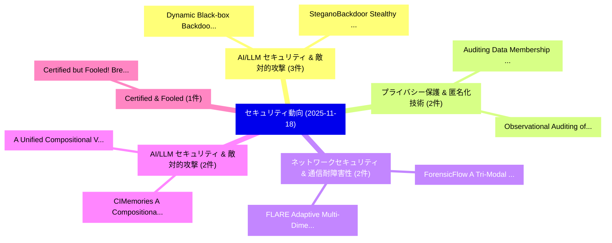

# 📅 02_daily: 日次エグゼクティブサマリー報告書 (2025-11-18)

**集計日時**: 2026-10-02 23:05:48 UTC  
**対象日付**: 2025-11-18  
**本日収集論文数**: 26 件  

---

## 💡 主要セキュリティ動向・脅威インサイト (Executive Insights)

本日の収集論文（計 26 件）において、以下の重点セキュリティ領域で活発な研究動向が確認されました：
- **AI/LLM セキュリティ & 敵対的攻撃** (3 件): 注目論文として 「Dynamic Black-box Backdoor Att...」、「SteganoBackdoor: Stealthy and ...」 等が発表され、実務防御および攻撃検証の進展が見られます。
- **プライバシー保護 & 匿名化技術** (2 件): 注目論文として 「Auditing Data Membership in Re...」、「Observational Auditing of Labe...」 等が発表され、実務防御および攻撃検証の進展が見られます。
- **ネットワークセキュリティ & 通信耐障害性** (2 件): 注目論文として 「ForensicFlow: A Tri-Modal Adap...」、「FLARE: Adaptive Multi-Dimensio...」 等が発表され、実務防御および攻撃検証の進展が見られます。
- **AI/LLM セキュリティ & 敵対的攻撃** (2 件): 注目論文として 「A Unified Compositional View o...」、「CIMemories: A Compositional Be...」 等が発表され、実務防御および攻撃検証の進展が見られます。
- **Certified & Fooled** (1 件): 注目論文として 「Certified but Fooled! Breaking...」 等が発表され、実務防御および攻撃検証の進展が見られます。

### 🗺️ 技術・脅威トピックマインドマップ

---

## 📌 日次セキュリティ論文一覧 (日本語表形式)

| No | arXiv ID | 論文タイトル (日本語訳) | 重要キーワード | 構造化エグゼクティブ要約 (背景・提案・影響) | 脅威分類 | 詳細リンク |
|---|---|---|---|---|---|---|
| 1 | `2511.14003v1` | [Certified but Fooled! Breaking Certified Defences with Ghost Certificates（セキュリティ分析論文）](../../okf/papers/2025-11-18/2511.14003.md) | `Breaking Certified Defences`, `Ghost Certificates`, `Quoc Viet Vo` | 【提案】Breaking Certified Defences with Ghost Certificates ### (日本語題名: Certified but Fooled!。実証評価によりHaq, Paul Montag。 | `cs.CV` | [arXiv](https://arxiv.org/abs/2511.14003v1) &#124; [OKF](../../okf/papers/2025-11-18/2511.14003.md) |
| 2 | `2511.14005v1` | [Privis: Content-Aware Secure Volumetric Video Deliveryに向けて](../../okf/papers/2025-11-18/2511.14005.md) | `Content-Aware Secure`, `Aware Secure Volumetric Video Delivery`, `Aware Secure Volumetric Video` | 【提案】概要 (Overview & Key Finding) 本論文「Privis: Content-Aware Secure Volumetric Video Deliveryに...。実証評価により経営層・セキュリティ管理者向け推奨アクション (E... | `cs.MM` | [arXiv](https://arxiv.org/abs/2511.14005v1) &#124; [OKF](../../okf/papers/2025-11-18/2511.14005.md) |
| 3 | `2511.14032v3` | [GeoGuard: UWB Timing-Encoded Key Reconstruction for Location-Dependent, Geographically Bounded Decryption（セキュリティ分析論文）](../../okf/papers/2025-11-18/2511.14032.md) | `Encoded Key Reconstruction`, `Geographically Bounded Decryption`, `Timing-Encoded Key` | 【提案】概要 (Overview & Key Finding) 本論文「GeoGuard: UWB Timing-Encoded Key Reconstruction for Loc...。実証評価により経営層・セキュリティ管理者向け推奨アクション (E... | `cybersecurity` | [arXiv](https://arxiv.org/abs/2511.14032v3) &#124; [OKF](../../okf/papers/2025-11-18/2511.14032.md) |
| 4 | `2511.14045v2` | [Auditing Data Membership in Reinforcement Learning With Verifiable Rewards（セキュリティ分析論文）](../../okf/papers/2025-11-18/2511.14045.md) | `Auditing Data Membership`, `Yule Liu`, `Heyi Zhang` | 【提案】概要 (Overview & Key Finding) 本論文「Auditing Data Membership in Reinforcement Learning With...。実証評価により経営層・セキュリティ管理者向け推奨アクション (E... | `cs.AI` | [arXiv](https://arxiv.org/abs/2511.14045v2) &#124; [OKF](../../okf/papers/2025-11-18/2511.14045.md) |
| 5 | `2511.14061v2` | [Hardness of Range Avoidance and Proof Complexity Generators from Demi-Bits（セキュリティ分析論文）](../../okf/papers/2025-11-18/2511.14061.md) | `Proof Complexity Generators`, `Range Avoidance`, `Hanlin Ren` | 【提案】概要 (Overview & Key Finding) 本論文「Hardness of Range Avoidance and Proof Complexity Genera...。実証評価により経営層・セキュリティ管理者向け推奨アクション (E... | `executive-summary` | [arXiv](https://arxiv.org/abs/2511.14061v2) &#124; [OKF](../../okf/papers/2025-11-18/2511.14061.md) |
| 6 | `2511.14074v1` | [Dynamic Black-box Backdoor Attacks on IoT Sensory Data（セキュリティ分析論文）](../../okf/papers/2025-11-18/2511.14074.md) | `Dynamic Black`, `Backdoor Attacks`, `Sensory Data` | 【提案】概要 (Overview & Key Finding) 本論文「Dynamic Black-box Backdoor Attacks on IoT Sensory Data（...。実証評価により経営層・セキュリティ管理者向け推奨アクション (E... | `executive-summary` | [arXiv](https://arxiv.org/abs/2511.14074v1) &#124; [OKF](../../okf/papers/2025-11-18/2511.14074.md) |
| 7 | `2511.14084v3` | [Observational Auditing of Label Privacy（セキュリティ分析論文）](../../okf/papers/2025-11-18/2511.14084.md) | `Observational Auditing`, `Label Privacy`, `Iden Kalemaj` | 【提案】概要 (Overview & Key Finding) 本論文「Observational Auditing of Label Privacy（セキュリティ分析論文）」（原題...。実証評価により経営層・セキュリティ管理者向け推奨アクション (E... | `executive-summary` | [arXiv](https://arxiv.org/abs/2511.14084v3) &#124; [OKF](../../okf/papers/2025-11-18/2511.14084.md) |
| 8 | `2511.14088v2` | [Resolving Availability and Run-time Integrity Conflicts in Real-Time Embedded Systems（セキュリティ分析論文）](../../okf/papers/2025-11-18/2511.14088.md) | `Time Embedded Systems`, `Resolving Availability`, `Integrity Conflicts` | 【提案】概要 (Overview & Key Finding) 本論文「Resolving Availability and Run-time Integrity Conflicts...。実証評価により経営層・セキュリティ管理者向け推奨アクション (E... | `cybersecurity` | [arXiv](https://arxiv.org/abs/2511.14088v2) &#124; [OKF](../../okf/papers/2025-11-18/2511.14088.md) |
| 9 | `2511.14129v1` | [MalRAG: A Retrieval-Augmented LLM Framework for Open-set Malicious Traffic Identification（セキュリティ分析論文）](../../okf/papers/2025-11-18/2511.14129.md) | `Malicious Traffic Identification`, `Retrieval-Augmented LLM`, `Open-set Malicious` | 【提案】概要 (Overview & Key Finding) 本論文「MalRAG: A Retrieval-Augmented LLM Framework for Open-se...。実証評価により経営層・セキュリティ管理者向け推奨アクション (E... | `executive-summary` | [arXiv](https://arxiv.org/abs/2511.14129v1) &#124; [OKF](../../okf/papers/2025-11-18/2511.14129.md) |
| 10 | `2511.14132v1` | [A Fuzzy Logic-Based Cryptographic Framework For Real-Time Dynamic Key Generation For Enhanced Data Encryption（セキュリティ分析論文）](../../okf/papers/2025-11-18/2511.14132.md) | `Fuzzy Logic`, `Logic-Based Cryptographic`, `Real-Time Dynamic` | 【提案】概要 (Overview & Key Finding) 本論文「A Fuzzy Logic-Based Cryptographic Framework For Real-Ti...。実証評価により経営層・セキュリティ管理者向け推奨アクション (E... | `cybersecurity` | [arXiv](https://arxiv.org/abs/2511.14132v1) &#124; [OKF](../../okf/papers/2025-11-18/2511.14132.md) |
| 11 | `2511.14140v1` | [Beyond Fixed and Dynamic Prompts: Embedded Jailbreak Templates for Advancing LLM Security（セキュリティ分析論文）](../../okf/papers/2025-11-18/2511.14140.md) | `Embedded Jailbreak Templates`, `Beyond Fixed`, `Dynamic Prompts` | 【提案】概要 (Overview & Key Finding) 本論文「Beyond Fixed and Dynamic Prompts: Embedded ジェイルブレイク Tem...。実証評価により経営層・セキュリティ管理者向け推奨アクション (E... | `cybersecurity` | [arXiv](https://arxiv.org/abs/2511.14140v1) &#124; [OKF](../../okf/papers/2025-11-18/2511.14140.md) |
| 12 | `2511.14195v2` | [N-GLARE: An Non-Generative Latent Representation-Efficient LLM Safety Evaluator（セキュリティ分析論文）](../../okf/papers/2025-11-18/2511.14195.md) | `Generative Latent Representation`, `Non-Generative Latent`, `Representation-Efficient LLM` | 【提案】概要 (Overview & Key Finding) 本論文「N-GLARE: An Non-Generative Latent Representation-Effici...。実証評価により経営層・セキュリティ管理者向け推奨アクション (E... | `executive-summary` | [arXiv](https://arxiv.org/abs/2511.14195v2) &#124; [OKF](../../okf/papers/2025-11-18/2511.14195.md) |
| 13 | `2511.14301v3` | [SteganoBackdoor: Stealthy and Data-Efficient Backdoor Attacks on Language Models（セキュリティ分析論文）](../../okf/papers/2025-11-18/2511.14301.md) | `Efficient Backdoor Attacks`, `Language Models`, `Data-Efficient Backdoor` | 【提案】概要 (Overview & Key Finding) 本論文「SteganoBackdoor: Stealthy and Data-Efficient Backdoor A...。実証評価により経営層・セキュリティ管理者向け推奨アクション (E... | `executive-summary` | [arXiv](https://arxiv.org/abs/2511.14301v3) &#124; [OKF](../../okf/papers/2025-11-18/2511.14301.md) |
| 14 | `2511.14406v2` | [Watch Out for the Lifespan: Evaluating Backdoor Attacks Against Federated Model Adaptation（セキュリティ分析論文）](../../okf/papers/2025-11-18/2511.14406.md) | `Bastien Vuillod`, `Alain Moellic`, `Max Dutertre` | 【提案】概要 (Overview & Key Finding) 本論文「Watch Out for the Lifespan: Evaluating Backdoor Attacks...。実証評価により経営層・セキュリティ管理者向け推奨アクション (E... | `executive-summary` | [arXiv](https://arxiv.org/abs/2511.14406v2) &#124; [OKF](../../okf/papers/2025-11-18/2511.14406.md) |
| 15 | `2511.14422v1` | [Sigil: Server-Enforced Watermarking in U-Shaped Split 連合学習 via Gradient Injection](../../okf/papers/2025-11-18/2511.14422.md) | `Enforced Watermarking`, `Server-Enforced Watermarking`, `U-Shaped Split` | 【提案】概要 (Overview & Key Finding) 本論文「Sigil: Server-Enforced Watermarking in U-Shaped Split 連...。実証評価により経営層・セキュリティ管理者向け推奨アクション (E... | `cs.AI` | [arXiv](https://arxiv.org/abs/2511.14422v1) &#124; [OKF](../../okf/papers/2025-11-18/2511.14422.md) |
| 16 | `2511.14524v2` | [Compression with Privacy-Preserving Random Access（セキュリティ分析論文）](../../okf/papers/2025-11-18/2511.14524.md) | `Preserving Random Access`, `Privacy-Preserving Random`, `Venkat Chandar` | 【提案】概要 (Overview & Key Finding) 本論文「Compression with Privacy-Preserving Random Access（セキュリテ...。実証評価により経営層・セキュリティ管理者向け推奨アクション (E... | `executive-summary` | [arXiv](https://arxiv.org/abs/2511.14524v2) &#124; [OKF](../../okf/papers/2025-11-18/2511.14524.md) |
| 17 | `2511.14554v2` | [ForensicFlow: A Tri-Modal Adaptive Network for Robust Deepfake Detection（セキュリティ分析論文）](../../okf/papers/2025-11-18/2511.14554.md) | `Modal Adaptive Network`, `Robust Deepfake Detection`, `Tri-Modal Adaptive` | 【提案】概要 (Overview & Key Finding) 本論文「ForensicFlow: A Tri-Modal Adaptive Network for Robust D...。実証評価により経営層・セキュリティ管理者向け推奨アクション (E... | `cs.CV` | [arXiv](https://arxiv.org/abs/2511.14554v2) &#124; [OKF](../../okf/papers/2025-11-18/2511.14554.md) |
| 18 | `2511.14611v1` | [SecureSign: Bridging Security and UX in Mobile Web3 through Emulated EIP-6963 Sandboxing（セキュリティ分析論文）](../../okf/papers/2025-11-18/2511.14611.md) | `Bridging Security`, `Mobile Web3`, `EIP-6963 Sandboxing` | 【提案】概要 (Overview & Key Finding) 本論文「SecureSign: Bridging Security and UX in Mobile Web3 thr...。実証評価により経営層・セキュリティ管理者向け推奨アクション (E... | `executive-summary` | [arXiv](https://arxiv.org/abs/2511.14611v1) &#124; [OKF](../../okf/papers/2025-11-18/2511.14611.md) |
| 19 | `2511.14715v3` | [FLARE: Adaptive Multi-Dimensional Reputation for Robust Client Reliability in 連合学習](../../okf/papers/2025-11-18/2511.14715.md) | `Robust Client Reliability`, `Adaptive Multi`, `Dimensional Reputation` | 【提案】概要 (Overview & Key Finding) 本論文「FLARE: Adaptive Multi-Dimensional Reputation for Robust...。実証評価により経営層・セキュリティ管理者向け推奨アクション (E... | `cs.AI` | [arXiv](https://arxiv.org/abs/2511.14715v3) &#124; [OKF](../../okf/papers/2025-11-18/2511.14715.md) |
| 20 | `2511.14717v1` | [A Unified Compositional View of Attack Tree Metrics（セキュリティ分析論文）](../../okf/papers/2025-11-18/2511.14717.md) | `Unified Compositional View`, `Attack Tree Metrics`, `Benedikt Peterseim` | 【提案】概要 (Overview & Key Finding) 本論文「A Unified Compositional View of Attack Tree Metrics（セキュ...。実証評価により経営層・セキュリティ管理者向け推奨アクション (E... | `cybersecurity` | [arXiv](https://arxiv.org/abs/2511.14717v1) &#124; [OKF](../../okf/papers/2025-11-18/2511.14717.md) |
| 21 | `2511.14876v1` | [Attacking Autonomous Driving Agents with Adversarial Machine Learning: A Holistic Evaluation with the CARLA Leaderboard（セキュリティ分析論文）](../../okf/papers/2025-11-18/2511.14876.md) | `Attacking Autonomous Driving Agents`, `Adversarial Machine Learning`, `Henry Wong` | 【提案】概要 (Overview & Key Finding) 本論文「Attacking Autonomous Driving Agents with Adversarial Ma...。実証評価により経営層・セキュリティ管理者向け推奨アクション (E... | `cs.CV` | [arXiv](https://arxiv.org/abs/2511.14876v1) &#124; [OKF](../../okf/papers/2025-11-18/2511.14876.md) |
| 22 | `2511.14908v1` | [On-Premise SLMs vs. Commercial LLMs: Prompt Engineering and Incident Classification in SOCs and CSIRTs（セキュリティ分析論文）](../../okf/papers/2025-11-18/2511.14908.md) | `On-Premise SLMs`, `Prompt Engineering`, `Incident Classification` | 【提案】概要 (Overview & Key Finding) 本論文「On-Premise SLMs vs. Commercial LLMs: Prompt Engineering...。実証評価により経営層・セキュリティ管理者向け推奨アクション (E... | `cs.AI` | [arXiv](https://arxiv.org/abs/2511.14908v1) &#124; [OKF](../../okf/papers/2025-11-18/2511.14908.md) |
| 23 | `2511.14937v1` | [CIMemories: A Compositional Benchmark for Contextual Integrity of Persistent Memory in LLMs（セキュリティ分析論文）](../../okf/papers/2025-11-18/2511.14937.md) | `Compositional Benchmark`, `Contextual Integrity`, `Persistent Memory` | 【提案】概要 (Overview & Key Finding) 本論文「CIMemories: A Compositional Benchmark for Contextual In...。実証評価により経営層・セキュリティ管理者向け推奨アクション (E... | `cybersecurity` | [arXiv](https://arxiv.org/abs/2511.14937v1) &#124; [OKF](../../okf/papers/2025-11-18/2511.14937.md) |
| 24 | `2511.14963v1` | [LFreeDA: Label-Free Drift Adaptation for Windows マルウェア検出](../../okf/papers/2025-11-18/2511.14963.md) | `Free Drift Adaptation`, `Label-Free Drift`, `Windows Malware Detection` | 【提案】概要 (Overview & Key Finding) 本論文「LFreeDA: Label-Free Drift Adaptation for Windows マルウェア検...。実証評価により経営層・セキュリティ管理者向け推奨アクション (E... | `cybersecurity` | [arXiv](https://arxiv.org/abs/2511.14963v1) &#124; [OKF](../../okf/papers/2025-11-18/2511.14963.md) |
| 25 | `2511.15744v1` | [AnonLFI 2.0: Extensible Architecture for PII Pseudonymization in CSIRTs with OCR and Technical Recognizers（セキュリティ分析論文）](../../okf/papers/2025-11-18/2511.15744.md) | `Extensible Architecture`, `Technical Recognizers`, `Cristhian Kapelinski` | 【提案】概要 (Overview & Key Finding) 本論文「AnonLFI 2.0: Extensible Architecture for PII Pseudonymi...。実証評価により経営層・セキュリティ管理者向け推奨アクション (E... | `cybersecurity` | [arXiv](https://arxiv.org/abs/2511.15744v1) &#124; [OKF](../../okf/papers/2025-11-18/2511.15744.md) |
| 26 | `2511.15745v1` | [Structured Extraction of Vulnerabilities in OpenVAS and Tenable WAS Reports Using LLMs（セキュリティ分析論文）](../../okf/papers/2025-11-18/2511.15745.md) | `Structured Extraction`, `Reports Using`, `Beatriz Machado` | 【提案】概要 (Overview & Key Finding) 本論文「Structured Extraction of Vulnerabilities in OpenVAS and...。実証評価により経営層・セキュリティ管理者向け推奨アクション (E... | `cybersecurity` | [arXiv](https://arxiv.org/abs/2511.15745v1) &#124; [OKF](../../okf/papers/2025-11-18/2511.15745.md) |

