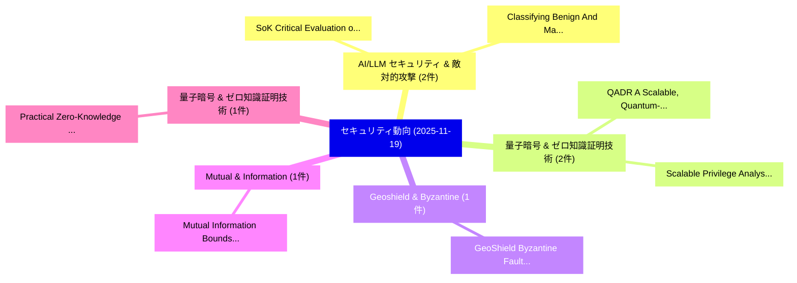

# 📅 02_daily: 日次エグゼクティブサマリー報告書 (2025-11-19)

**集計日時**: 2026-10-02 23:05:48 UTC  
**対象日付**: 2025-11-19  
**本日収集論文数**: 23 件  

---

## 💡 主要セキュリティ動向・脅威インサイト (Executive Insights)

本日の収集論文（計 23 件）において、以下の重点セキュリティ領域で活発な研究動向が確認されました：
- **AI/LLM セキュリティ & 敵対的攻撃** (2 件): 注目論文として 「SoK: Critical Evaluation of Qu...」、「Classifying Benign And Malicio...」 等が発表され、実務防御および攻撃検証の進展が見られます。
- **量子暗号 & ゼロ知識証明技術** (2 件): 注目論文として 「QADR: A Scalable, Quantum-Resi...」、「Scalable Privilege Analysis fo...」 等が発表され、実務防御および攻撃検証の進展が見られます。
- **Geoshield & Byzantine** (1 件): 注目論文として 「GeoShield: Byzantine Fault Det...」 等が発表され、実務防御および攻撃検証の進展が見られます。
- **Mutual & Information** (1 件): 注目論文として 「Mutual Information Bounds in t...」 等が発表され、実務防御および攻撃検証の進展が見られます。
- **量子暗号 & ゼロ知識証明技術** (1 件): 注目論文として 「Practical Zero-Knowledge Proof...」 等が発表され、実務防御および攻撃検証の進展が見られます。

### 🗺️ 技術・脅威トピックマインドマップ

---

## 📌 日次セキュリティ論文一覧 (日本語表形式)

| No | arXiv ID | 論文タイトル (日本語訳) | 重要キーワード | 構造化エグゼクティブ要約 (背景・提案・影響) | 脅威分類 | 詳細リンク |
|---|---|---|---|---|---|---|
| 1 | `2511.14989v4` | [SoK: Critical Evaluation of Quantum Machine Learning for Adversarial Robustness（セキュリティ分析論文）](../../okf/papers/2025-11-19/2511.14989.md) | `Quantum Machine Learning`, `Adversarial Robustness`, `Md Mahmudul Alam Imon` | 【提案】概要 (Overview & Key Finding) 本論文「SoK: Critical Evaluation of 量子 Machine Learning for Adv...。実証評価により# SoK: Critical Evaluatio... | `cybersecurity` | [arXiv](https://arxiv.org/abs/2511.14989v4) &#124; [OKF](../../okf/papers/2025-11-19/2511.14989.md) |
| 2 | `2511.15031v1` | [GeoShield: Byzantine Fault Detection and Recovery for Geo-Distributed Real-Time Cyber-Physical Systems（セキュリティ分析論文）](../../okf/papers/2025-11-19/2511.15031.md) | `Byzantine Fault Detection`, `Distributed Real`, `Time Cyber` | 【提案】概要 (Overview & Key Finding) 本論文「GeoShield: Byzantine Fault Detection and Recovery for G...。実証評価により経営層・セキュリティ管理者向け推奨アクション (E... | `executive-summary` | [arXiv](https://arxiv.org/abs/2511.15031v1) &#124; [OKF](../../okf/papers/2025-11-19/2511.15031.md) |
| 3 | `2511.15033v1` | [Classifying Benign And Malicious Packages Using Machine Learningに向けて](../../okf/papers/2025-11-19/2511.15033.md) | `Cong Nguyen`, `Thanh Nguyen`, `Giau Ung` | 【提案】概要 (Overview & Key Finding) 本論文「Classifying Benign And Malicious Packages Using Machine...。実証評価により経営層・セキュリティ管理者向け推奨アクション (E... | `cybersecurity` | [arXiv](https://arxiv.org/abs/2511.15033v1) &#124; [OKF](../../okf/papers/2025-11-19/2511.15033.md) |
| 4 | `2511.15051v1` | [Mutual Information Bounds in the Shuffle Model（セキュリティ分析論文）](../../okf/papers/2025-11-19/2511.15051.md) | `Mutual Information Bounds`, `Shuffle Model`, `Pengcheng Su` | 【提案】概要 (Overview & Key Finding) 本論文「Mutual Information Bounds in the Shuffle Model（セキュリティ分析...。実証評価により経営層・セキュリティ管理者向け推奨アクション (E... | `executive-summary` | [arXiv](https://arxiv.org/abs/2511.15051v1) &#124; [OKF](../../okf/papers/2025-11-19/2511.15051.md) |
| 5 | `2511.15071v1` | [Practical Zero-Knowledge Proof for PSPACEに向けて](../../okf/papers/2025-11-19/2511.15071.md) | `Knowledge Proof`, `Zero-Knowledge Proof`, `Towards Practical Zero` | 【提案】概要 (Overview & Key Finding) 本論文「Practical ゼロ知識証明 for PSPACEに向けて」（原題: Towards Practical ...。実証評価によりMeel, Ning Luo - **公開日時**... | `cs.LO` | [arXiv](https://arxiv.org/abs/2511.15071v1) &#124; [OKF](../../okf/papers/2025-11-19/2511.15071.md) |
| 6 | `2511.15097v2` | [MAIF: Enforcing AI Trust and Provenance with an Artifact-Centric Agentic Paradigm（セキュリティ分析論文）](../../okf/papers/2025-11-19/2511.15097.md) | `Centric Agentic Paradigm`, `Artifact-Centric Agentic`, `Vineeth Sai Narajala` | 【提案】概要 (Overview & Key Finding) 本論文「MAIF: Enforcing AI Trust and Provenance with an Artifac...。実証評価により経営層・セキュリティ管理者向け推奨アクション (E... | `cs.AI` | [arXiv](https://arxiv.org/abs/2511.15097v2) &#124; [OKF](../../okf/papers/2025-11-19/2511.15097.md) |
| 7 | `2511.15165v2` | [Can MLLMs Detect Phishing? A Comprehensive Security Benchmark Suite Focusing on Dynamic Threats and Multimodal Evaluation in Academic Environments（セキュリティ分析論文）](../../okf/papers/2025-11-19/2511.15165.md) | `Comprehensive Security Benchmark Suite Focusing`, `Detect Phishing`, `Dynamic Threats` | 【提案】A Comprehensive Security Benchmark Suite Focusing on Dynamic Threats and Multimodal Eva...。実証評価により経営層・セキュリティ管理者向け推奨アクション (E... | `cs.AI` | [arXiv](https://arxiv.org/abs/2511.15165v2) &#124; [OKF](../../okf/papers/2025-11-19/2511.15165.md) |
| 8 | `2511.15203v1` | [Taxonomy, Evaluation and Exploitation of IPI-Centric LLM Agent Defense Frameworks（セキュリティ分析論文）](../../okf/papers/2025-11-19/2511.15203.md) | `Agent Defense Frameworks`, `IPI-Centric LLM`, `Zimo Ji` | 【提案】概要 (Overview & Key Finding) 本論文「Taxonomy, Evaluation and Exploitation of IPI-Centric LL...。実証評価により経営層・セキュリティ管理者向け推奨アクション (E... | `cs.AI` | [arXiv](https://arxiv.org/abs/2511.15203v1) &#124; [OKF](../../okf/papers/2025-11-19/2511.15203.md) |
| 9 | `2511.15206v1` | [Trustworthy GenAI over 6G: Integrated Applications and Security Frameworks（セキュリティ分析論文）](../../okf/papers/2025-11-19/2511.15206.md) | `Integrated Applications`, `Security Frameworks`, `Bui Duc Son` | 【提案】概要 (Overview & Key Finding) 本論文「Trustworthy GenAI over 6G: Integrated Applications and ...。実証評価により経営層・セキュリティ管理者向け推奨アクション (E... | `executive-summary` | [arXiv](https://arxiv.org/abs/2511.15206v1) &#124; [OKF](../../okf/papers/2025-11-19/2511.15206.md) |
| 10 | `2511.15272v1` | [QADR: A Scalable, Quantum-Resistant Protocol for Anonymous Data Reporting（セキュリティ分析論文）](../../okf/papers/2025-11-19/2511.15272.md) | `Anonymous Data Reporting`, `Resistant Protocol`, `Quantum-Resistant Protocol` | 【提案】概要 (Overview & Key Finding) 本論文「QADR: A Scalable, 量子-Resistant Protocol for Anonymous D...。実証評価により経営層・セキュリティ管理者向け推奨アクション (E... | `cs.NI` | [arXiv](https://arxiv.org/abs/2511.15272v1) &#124; [OKF](../../okf/papers/2025-11-19/2511.15272.md) |
| 11 | `2511.15278v1` | [Privacy-Preserving IoT in Connected Aircraft Cabin（セキュリティ分析論文）](../../okf/papers/2025-11-19/2511.15278.md) | `Connected Aircraft Cabin`, `Privacy-Preserving IoT`, `Nilesh Vyas` | 【提案】概要 (Overview & Key Finding) 本論文「Privacy-Preserving IoT in Connected Aircraft Cabin（セキュリ...。実証評価により経営層・セキュリティ管理者向け推奨アクション (E... | `cs.NI` | [arXiv](https://arxiv.org/abs/2511.15278v1) &#124; [OKF](../../okf/papers/2025-11-19/2511.15278.md) |
| 12 | `2511.15361v2` | [BlueBottle: Fast and Robust Blockchains through Subsystem Specialization（セキュリティ分析論文）](../../okf/papers/2025-11-19/2511.15361.md) | `Robust Blockchains`, `Subsystem Specialization`, `Preston Vander Vos` | 【提案】概要 (Overview & Key Finding) 本論文「BlueBottle: Fast and Robust Blockchains through Subsyst...。実証評価により経営層・セキュリティ管理者向け推奨アクション (E... | `executive-summary` | [arXiv](https://arxiv.org/abs/2511.15361v2) &#124; [OKF](../../okf/papers/2025-11-19/2511.15361.md) |
| 13 | `2511.15421v1` | [When Can You Trust Bitcoin? Value-Dependent Block Confirmation to Determine Transaction Finalit（セキュリティ分析論文）](../../okf/papers/2025-11-19/2511.15421.md) | `Dependent Block Confirmation`, `Determine Transaction Finalit`, `Value-Dependent Block` | 【提案】Value-Dependent Block Confirmation to Determine Transaction Finalit ### (日本語題名: When Ca...。実証評価により経営層・セキュリティ管理者向け推奨アクション (E... | `executive-summary` | [arXiv](https://arxiv.org/abs/2511.15421v1) &#124; [OKF](../../okf/papers/2025-11-19/2511.15421.md) |
| 14 | `2511.15434v1` | [Small Language Models for Phishing Website Detection: Cost, Performance, and Privacy Trade-Offs（セキュリティ分析論文）](../../okf/papers/2025-11-19/2511.15434.md) | `Small Language Models`, `Phishing Website Detection`, `Privacy Trade` | 【提案】概要 (Overview & Key Finding) 本論文「Small Language Models for Phishing Website Detection: C...。実証評価により経営層・セキュリティ管理者向け推奨アクション (E... | `cs.AI` | [arXiv](https://arxiv.org/abs/2511.15434v1) &#124; [OKF](../../okf/papers/2025-11-19/2511.15434.md) |
| 15 | `2511.15463v1` | [How To Cook The Fragmented Rug Pull?（セキュリティ分析論文）](../../okf/papers/2025-11-19/2511.15463.md) | `Minh Trung Tran`, `Nasrin Sohrabi`, `Zahir Tari` | 【提案】### (日本語題名: How To Cook The Fragmented Rug Pull?（セキュリティ分析論文）)  > [!NOTE] > **OKF Metada...。実証評価により経営層・セキュリティ管理者向け推奨アクション (E... | `cs.CE` | [arXiv](https://arxiv.org/abs/2511.15463v1) &#124; [OKF](../../okf/papers/2025-11-19/2511.15463.md) |
| 16 | `2511.15465v1` | [Overview of Routing Approaches in Quantum Key Distribution Networks（セキュリティ分析論文）](../../okf/papers/2025-11-19/2511.15465.md) | `Quantum Key Distribution Networks`, `Routing Approaches`, `Armando Nolasco Pinto` | 【提案】概要 (Overview & Key Finding) 本論文「Overview of Routing Approaches in 量子鍵配送 Networks（セキュリティ...。実証評価により経営層・セキュリティ管理者向け推奨アクション (E... | `cs.ET` | [arXiv](https://arxiv.org/abs/2511.15465v1) &#124; [OKF](../../okf/papers/2025-11-19/2511.15465.md) |
| 17 | `2511.15479v1` | [a Formal Verification of Secure Vehicle Software Updatesに向けて](../../okf/papers/2025-11-19/2511.15479.md) | `Formal Verification`, `Secure Vehicle Software Updates`, `Secure Vehicle Software` | 【提案】概要 (Overview & Key Finding) 本論文「a Formal Verification of Secure Vehicle Software Update...。実証評価により経営層・セキュリティ管理者向け推奨アクション (E... | `cs.LO` | [arXiv](https://arxiv.org/abs/2511.15479v1) &#124; [OKF](../../okf/papers/2025-11-19/2511.15479.md) |
| 18 | `2511.15517v2` | [Beluga: Block Synchronization for BFT Consensus Protocols（セキュリティ分析論文）](../../okf/papers/2025-11-19/2511.15517.md) | `Block Synchronization`, `Consensus Protocols`, `Tasos Kichidis` | 【提案】概要 (Overview & Key Finding) 本論文「Beluga: Block Synchronization for BFT Consensus Protoco...。実証評価により経営層・セキュリティ管理者向け推奨アクション (E... | `executive-summary` | [arXiv](https://arxiv.org/abs/2511.15517v2) &#124; [OKF](../../okf/papers/2025-11-19/2511.15517.md) |
| 19 | `2511.15556v1` | [Event-based Data Format Standard (EVT+)（セキュリティ分析論文）](../../okf/papers/2025-11-19/2511.15556.md) | `Data Format Standard`, `Event-based Data`, `Mohammad Imran Vakil` | 【提案】概要 (Overview & Key Finding) 本論文「Event-based Data Format Standard (EVT+)（セキュリティ分析論文）」（原題...。実証評価によりDang, Ian Pardee, Paul Co... | `executive-summary` | [arXiv](https://arxiv.org/abs/2511.15556v1) &#124; [OKF](../../okf/papers/2025-11-19/2511.15556.md) |
| 20 | `2511.15571v1` | [Transferable Dual-Domain Feature Importance Attack against AI-Generated Image Detector（セキュリティ分析論文）](../../okf/papers/2025-11-19/2511.15571.md) | `Domain Feature Importance Attack`, `Generated Image Detector`, `Transferable Dual` | 【提案】概要 (Overview & Key Finding) 本論文「Transferable Dual-Domain Feature Importance Attack agai...。実証評価により経営層・セキュリティ管理者向け推奨アクション (E... | `cs.CV` | [arXiv](https://arxiv.org/abs/2511.15571v1) &#124; [OKF](../../okf/papers/2025-11-19/2511.15571.md) |
| 21 | `2511.15759v1` | [AI Agents Against Prompt Injection Attacksのセキュリティ強化](../../okf/papers/2025-11-19/2511.15759.md) | `Badrinath Ramakrishnan`, `Akshaya Balaji`, `Raw Meta` | 【提案】概要 (Overview & Key Finding) 本論文「AI Agents Against プロンプトインジェクション Attacksのセキュリティ強化」（原題: S...。実証評価により経営層・セキュリティ管理者向け推奨アクション (E... | `cs.AI` | [arXiv](https://arxiv.org/abs/2511.15759v1) &#124; [OKF](../../okf/papers/2025-11-19/2511.15759.md) |
| 22 | `2511.15763v1` | [Identifying the Supply Chain of AI for Trustworthiness and Risk Management in Critical Applications（セキュリティ分析論文）](../../okf/papers/2025-11-19/2511.15763.md) | `Supply Chain`, `Risk Management`, `Critical Applications` | 【提案】概要 (Overview & Key Finding) 本論文「Identifying the Supply Chain of AI for Trustworthiness ...。実証評価により経営層・セキュリティ管理者向け推奨アクション (E... | `cs.AI` | [arXiv](https://arxiv.org/abs/2511.15763v1) &#124; [OKF](../../okf/papers/2025-11-19/2511.15763.md) |
| 23 | `2511.15837v1` | [Scalable Privilege Analysis for Multi-Cloud Big Data Platforms: A Hypergraph Approach（セキュリティ分析論文）](../../okf/papers/2025-11-19/2511.15837.md) | `Cloud Big Data Platforms`, `Multi-Cloud Big`, `Sai Sitharaman` | 【提案】概要 (Overview & Key Finding) 本論文「Scalable Privilege Analysis for Multi-Cloud Big Data Pl...。実証評価により経営層・セキュリティ管理者向け推奨アクション (E... | `cybersecurity` | [arXiv](https://arxiv.org/abs/2511.15837v1) &#124; [OKF](../../okf/papers/2025-11-19/2511.15837.md) |

