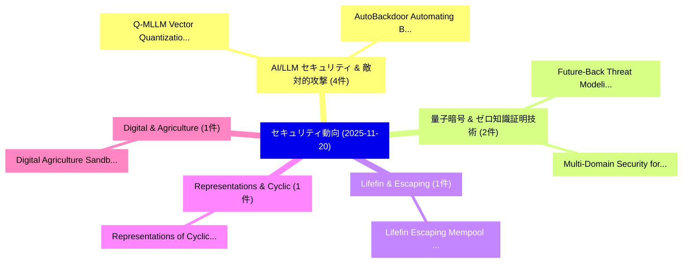

# 📅 02_daily: 日次エグゼクティブサマリー報告書 (2025-11-20)

**集計日時**: 2026-10-02 23:05:48 UTC  
**対象日付**: 2025-11-20  
**本日収集論文数**: 23 件  

---

## 💡 主要セキュリティ動向・脅威インサイト (Executive Insights)

本日の収集論文（計 23 件）において、以下の重点セキュリティ領域で活発な研究動向が確認されました：
- **AI/LLM セキュリティ & 敵対的攻撃** (4 件): 注目論文として 「Q-MLLM: Vector Quantization fo...」、「AutoBackdoor: Automating Backd...」 等が発表され、実務防御および攻撃検証の進展が見られます。
- **量子暗号 & ゼロ知識証明技術** (2 件): 注目論文として 「Future-Back Threat Modeling: A...」、「Multi-Domain Security for 6G I...」 等が発表され、実務防御および攻撃検証の進展が見られます。
- **Lifefin & Escaping** (1 件): 注目論文として 「Lifefin: Escaping Mempool Expl...」 等が発表され、実務防御および攻撃検証の進展が見られます。
- **Representations & Cyclic** (1 件): 注目論文として 「Representations of Cyclic Diag...」 等が発表され、実務防御および攻撃検証の進展が見られます。
- **Digital & Agriculture** (1 件): 注目論文として 「Digital Agriculture Sandbox fo...」 等が発表され、実務防御および攻撃検証の進展が見られます。

### 🗺️ 技術・脅威トピックマインドマップ

---

## 📌 日次セキュリティ論文一覧 (日本語表形式)

| No | arXiv ID | 論文タイトル (日本語訳) | 重要キーワード | 構造化エグゼクティブ要約 (背景・提案・影響) | 脅威分類 | 詳細リンク |
|---|---|---|---|---|---|---|
| 1 | `2511.15936v2` | [Lifefin: Escaping Mempool Explosions in DAG-based BFT（セキュリティ分析論文）](../../okf/papers/2025-11-20/2511.15936.md) | `Escaping Mempool Explosions`, `DAG-based BFT`, `Jianting Zhang` | 【提案】概要 (Overview & Key Finding) 本論文「Lifefin: Escaping Mempool Explosions in DAG-based BFT（セ...。実証評価により経営層・セキュリティ管理者向け推奨アクション (E... | `cybersecurity` | [arXiv](https://arxiv.org/abs/2511.15936v2) &#124; [OKF](../../okf/papers/2025-11-20/2511.15936.md) |
| 2 | `2511.15945v1` | [Representations of Cyclic Diagram Monoids（セキュリティ分析論文）](../../okf/papers/2025-11-20/2511.15945.md) | `Cyclic Diagram Monoids`, `Jason Liu`, `Raw Meta` | 【提案】概要 (Overview & Key Finding) 本論文「Representations of Cyclic Diagram Monoids（セキュリティ分析論文）」（...。実証評価により経営層・セキュリティ管理者向け推奨アクション (E... | `executive-summary` | [arXiv](https://arxiv.org/abs/2511.15945v1) &#124; [OKF](../../okf/papers/2025-11-20/2511.15945.md) |
| 3 | `2511.15990v1` | [Digital Agriculture Sandbox for Collaborative Research（セキュリティ分析論文）](../../okf/papers/2025-11-20/2511.15990.md) | `Digital Agriculture Sandbox`, `Collaborative Research`, `Osama Zafar` | 【提案】概要 (Overview & Key Finding) 本論文「Digital Agriculture Sandbox for Collaborative Research（...。実証評価により経営層・セキュリティ管理者向け推奨アクション (E... | `executive-summary` | [arXiv](https://arxiv.org/abs/2511.15990v1) &#124; [OKF](../../okf/papers/2025-11-20/2511.15990.md) |
| 4 | `2511.15998v2` | [Hiding in the AI Traffic: Abusing MCP for LLM-Powered Agentic Red Teaming（セキュリティ分析論文）](../../okf/papers/2025-11-20/2511.15998.md) | `Powered Agentic Red Teaming`, `LLM-Powered Agentic`, `Anna Baron Garcia` | 【提案】概要 (Overview & Key Finding) 本論文「Hiding in the AI Traffic: Abusing MCP for LLM-Powered A...。実証評価により経営層・セキュリティ管理者向け推奨アクション (E... | `cs.AI` | [arXiv](https://arxiv.org/abs/2511.15998v2) &#124; [OKF](../../okf/papers/2025-11-20/2511.15998.md) |
| 5 | `2511.16009v1` | [Nonadaptive One-Way to Hiding Implies Adaptive Quantum Reprogramming（セキュリティ分析論文）](../../okf/papers/2025-11-20/2511.16009.md) | `Hiding Implies Adaptive Quantum Reprogramming`, `Nonadaptive One`, `Joseph Jaeger` | 【提案】概要 (Overview & Key Finding) 本論文「Nonadaptive One-Way to Hiding Implies Adaptive 量子 Repro...。実証評価により経営層・セキュリティ管理者向け推奨アクション (E... | `executive-summary` | [arXiv](https://arxiv.org/abs/2511.16009v1) &#124; [OKF](../../okf/papers/2025-11-20/2511.16009.md) |
| 6 | `2511.16034v1` | [A Quantum-Secure and Blockchain-Integrated E-Voting Framework with Identity Validation（セキュリティ分析論文）](../../okf/papers/2025-11-20/2511.16034.md) | `Identity Validation`, `Blockchain-Integrated E`, `Ashwin Poudel` | 【提案】概要 (Overview & Key Finding) 本論文「A 量子-Secure and Blockchain-Integrated E-Voting Framewor...。実証評価により経営層・セキュリティ管理者向け推奨アクション (E... | `cybersecurity` | [arXiv](https://arxiv.org/abs/2511.16034v1) &#124; [OKF](../../okf/papers/2025-11-20/2511.16034.md) |
| 7 | `2511.16088v3` | [Future-Back Threat Modeling: A Foresight-Driven Security Framework（セキュリティ分析論文）](../../okf/papers/2025-11-20/2511.16088.md) | `Back Threat Modeling`, `Future-Back Threat`, `Foresight-Driven Security` | 【提案】概要 (Overview & Key Finding) 本論文「Future-Back 脅威 Modeling: A Foresight-Driven Security Fr...。実証評価により経営層・セキュリティ管理者向け推奨アクション (E... | `Cryptography` | [arXiv](https://arxiv.org/abs/2511.16088v3) &#124; [OKF](../../okf/papers/2025-11-20/2511.16088.md) |
| 8 | `2511.16110v1` | [Multi-Faceted Attack: Exposing Cross-Model Vulnerabilities in Defense-Equipped Vision-Language Models（セキュリティ分析論文）](../../okf/papers/2025-11-20/2511.16110.md) | `Faceted Attack`, `Exposing Cross`, `Model Vulnerabilities` | 【提案】概要 (Overview & Key Finding) 本論文「Multi-Faceted Attack: Exposing Cross-Model Vulnerabilit...。実証評価により経営層・セキュリティ管理者向け推奨アクション (E... | `cybersecurity` | [arXiv](https://arxiv.org/abs/2511.16110v1) &#124; [OKF](../../okf/papers/2025-11-20/2511.16110.md) |
| 9 | `2511.16192v1` | [ART: A Graph-based Framework for Investigating Illicit Activity in Monero via Address-Ring-Transaction Structures（セキュリティ分析論文）](../../okf/papers/2025-11-20/2511.16192.md) | `Investigating Illicit Activity`, `Transaction Structures`, `Andrea Venturi` | 【提案】概要 (Overview & Key Finding) 本論文「ART: A Graph-based Framework for Investigating Illicit ...。実証評価により経営層・セキュリティ管理者向け推奨アクション (E... | `cs.ET` | [arXiv](https://arxiv.org/abs/2511.16192v1) &#124; [OKF](../../okf/papers/2025-11-20/2511.16192.md) |
| 10 | `2511.16209v2` | [PSM: Prompt Sensitivity Minimization via LLM-Guided Black-Box Optimization（セキュリティ分析論文）](../../okf/papers/2025-11-20/2511.16209.md) | `Prompt Sensitivity Minimization`, `Guided Black`, `Box Optimization` | 【提案】概要 (Overview & Key Finding) 本論文「PSM: Prompt Sensitivity Minimization via LLM-Guided Bla...。実証評価により経営層・セキュリティ管理者向け推奨アクション (E... | `executive-summary` | [arXiv](https://arxiv.org/abs/2511.16209v2) &#124; [OKF](../../okf/papers/2025-11-20/2511.16209.md) |
| 11 | `2511.16229v1` | [Q-MLLM: Vector Quantization for Robust Multimodal Large Language Model Security（セキュリティ分析論文）](../../okf/papers/2025-11-20/2511.16229.md) | `Robust Multimodal Large Language Model Security`, `Vector Quantization`, `Wei Zhao` | 【提案】概要 (Overview & Key Finding) 本論文「Q-MLLM: Vector Quantization for Robust Multimodal Large...。実証評価により経営層・セキュリティ管理者向け推奨アクション (E... | `cs.AI` | [arXiv](https://arxiv.org/abs/2511.16229v1) &#124; [OKF](../../okf/papers/2025-11-20/2511.16229.md) |
| 12 | `2511.16278v1` | ["To Survive, I Must Defect": Jailbreaking LLMs via the Game-Theory Scenarios（セキュリティ分析論文）](../../okf/papers/2025-11-20/2511.16278.md) | `Must Defect`, `Theory Scenarios`, `Game-Theory Scenarios` | 【提案】概要 (Overview & Key Finding) 本論文「"To Survive, I Must Defect": ジェイルブレイクing LLMs via the G...。実証評価により経営層・セキュリティ管理者向け推奨アクション (E... | `cs.AI` | [arXiv](https://arxiv.org/abs/2511.16278v1) &#124; [OKF](../../okf/papers/2025-11-20/2511.16278.md) |
| 13 | `2511.16316v2` | [Multi-Domain Security for 6G ISAC: Challenges and Opportunities in Transportation（セキュリティ分析論文）](../../okf/papers/2025-11-20/2511.16316.md) | `Domain Security`, `Multi-Domain Security`, `Musa Furkan Keskin` | 【提案】概要 (Overview & Key Finding) 本論文「Multi-Domain Security for 6G ISAC: Challenges and Oppor...。実証評価により経営層・セキュリティ管理者向け推奨アクション (E... | `cybersecurity` | [arXiv](https://arxiv.org/abs/2511.16316v2) &#124; [OKF](../../okf/papers/2025-11-20/2511.16316.md) |
| 14 | `2511.16347v1` | [The Shawshank Redemption of Embodied AI: Understanding and Indirect Environmental Jailbreaksのベンチマーク評価](../../okf/papers/2025-11-20/2511.16347.md) | `Benchmarking Indirect Environmental Jailbreaks`, `Indirect Environmental`, `Chunyang Li` | 【提案】概要 (Overview & Key Finding) 本論文「The Shawshank Redemption of Embodied AI: Understanding ...。実証評価により経営層・セキュリティ管理者向け推奨アクション (E... | `executive-summary` | [arXiv](https://arxiv.org/abs/2511.16347v1) &#124; [OKF](../../okf/papers/2025-11-20/2511.16347.md) |
| 15 | `2511.16377v2` | [Optimal Fairness under Local Differential Privacy（セキュリティ分析論文）](../../okf/papers/2025-11-20/2511.16377.md) | `Local Differential Privacy`, `Optimal Fairness`, `Hrad Ghoukasian` | 【提案】概要 (Overview & Key Finding) 本論文「Optimal Fairness under Local 差分プライバシー（セキュリティ分析論文）」（原題: ...。実証評価により経営層・セキュリティ管理者向け推奨アクション (E... | `executive-summary` | [arXiv](https://arxiv.org/abs/2511.16377v2) &#124; [OKF](../../okf/papers/2025-11-20/2511.16377.md) |
| 16 | `2511.16468v1` | [Optimizing Quantum Key Distribution Network Performance using Graph Neural Networks（セキュリティ分析論文）](../../okf/papers/2025-11-20/2511.16468.md) | `Optimizing Quantum Key Distribution Network Performance`, `Graph Neural Networks`, `Akshit Pramod Anchan` | 【提案】概要 (Overview & Key Finding) 本論文「Optimizing 量子鍵配送 Network Performance using Graph Neural...。実証評価により経営層・セキュリティ管理者向け推奨アクション (E... | `cs.NI` | [arXiv](https://arxiv.org/abs/2511.16468v1) &#124; [OKF](../../okf/papers/2025-11-20/2511.16468.md) |
| 17 | `2511.16560v1` | [Auditable Ledger Snapshot for Non-Repudiable Cross-Blockchain Communication（セキュリティ分析論文）](../../okf/papers/2025-11-20/2511.16560.md) | `Auditable Ledger Snapshot`, `Repudiable Cross`, `Blockchain Communication` | 【提案】概要 (Overview & Key Finding) 本論文「Auditable Ledger Snapshot for Non-Repudiable Cross-Bloc...。実証評価により経営層・セキュリティ管理者向け推奨アクション (E... | `executive-summary` | [arXiv](https://arxiv.org/abs/2511.16560v1) &#124; [OKF](../../okf/papers/2025-11-20/2511.16560.md) |
| 18 | `2511.16604v1` | [Systematically Deconstructing APVD Steganography and its Payload with a Unified Deep Learning Paradigm（セキュリティ分析論文）](../../okf/papers/2025-11-20/2511.16604.md) | `Unified Deep Learning Paradigm`, `Systematically Deconstructing`, `Kabbo Jit Deb` | 【提案】概要 (Overview & Key Finding) 本論文「Systematically Deconstructing APVD Steganography and it...。実証評価により経営層・セキュリティ管理者向け推奨アクション (E... | `cybersecurity` | [arXiv](https://arxiv.org/abs/2511.16604v1) &#124; [OKF](../../okf/papers/2025-11-20/2511.16604.md) |
| 19 | `2511.16709v1` | [AutoBackdoor: Automating Backdoor Attacks via LLMエージェント](../../okf/papers/2025-11-20/2511.16709.md) | `Automating Backdoor Attacks`, `Nay Myat Min`, `Yige Li` | 【提案】概要 (Overview & Key Finding) 本論文「AutoBackdoor: Automating Backdoor Attacks via LLMエージェント...。実証評価により経営層・セキュリティ管理者向け推奨アクション (E... | `cs.AI` | [arXiv](https://arxiv.org/abs/2511.16709v1) &#124; [OKF](../../okf/papers/2025-11-20/2511.16709.md) |
| 20 | `2511.16716v1` | [Password Strength Analysis Through Social Network Data Exposure: A Combined Approach Relying on Data Reconstruction and Generative Models（セキュリティ分析論文）](../../okf/papers/2025-11-20/2511.16716.md) | `Data Reconstruction`, `Generative Models`, `Maurizio Atzori` | 【提案】概要 (Overview & Key Finding) 本論文「Password Strength Analysis Through Social Network Data ...。実証評価により経営層・セキュリティ管理者向け推奨アクション (E... | `cs.AI` | [arXiv](https://arxiv.org/abs/2511.16716v1) &#124; [OKF](../../okf/papers/2025-11-20/2511.16716.md) |
| 21 | `2511.16765v2` | [RampoNN: A Reachability-Guided System Falsification for Efficient Cyber-Kinetic 脆弱性検出](../../okf/papers/2025-11-20/2511.16765.md) | `Guided System Falsification`, `Efficient Cyber`, `Reachability-Guided System` | 【提案】概要 (Overview & Key Finding) 本論文「RampoNN: A Reachability-Guided System Falsification for...。実証評価により経営層・セキュリティ管理者向け推奨アクション (E... | `executive-summary` | [arXiv](https://arxiv.org/abs/2511.16765v2) &#124; [OKF](../../okf/papers/2025-11-20/2511.16765.md) |
| 22 | `2511.16792v1` | [Membership Inference Attacks Beyond Overfitting（セキュリティ分析論文）](../../okf/papers/2025-11-20/2511.16792.md) | `Membership Inference Attacks Beyond Overfitting`, `Mona Khalil`, `Alberto Blanco` | 【提案】概要 (Overview & Key Finding) 本論文「Membership Inference Attacks Beyond Overfitting（セキュリティ分...。実証評価により経営層・セキュリティ管理者向け推奨アクション (E... | `executive-summary` | [arXiv](https://arxiv.org/abs/2511.16792v1) &#124; [OKF](../../okf/papers/2025-11-20/2511.16792.md) |
| 23 | `2511.16822v1` | [A Robust 連合学習 Approach for Combating Attacks Against IoT Systems Under non-IID Challenges](../../okf/papers/2025-11-20/2511.16822.md) | `non-IID Challenges`, `Zubair Md Fadlullah`, `Eyad Gad` | 【提案】概要 (Overview & Key Finding) 本論文「A Robust 連合学習 Approach for Combating Attacks Against Io...。実証評価により経営層・セキュリティ管理者向け推奨アクション (E... | `cs.AI` | [arXiv](https://arxiv.org/abs/2511.16822v1) &#124; [OKF](../../okf/papers/2025-11-20/2511.16822.md) |

