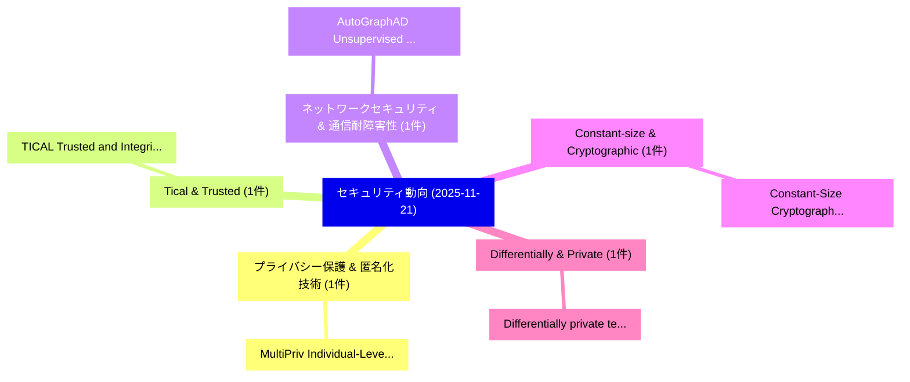

# 📅 02_daily: 日次エグゼクティブサマリー報告書 (2025-11-21)

**集計日時**: 2026-10-02 23:05:48 UTC  
**対象日付**: 2025-11-21  
**本日収集論文数**: 20 件  

---

## 💡 主要セキュリティ動向・脅威インサイト (Executive Insights)

本日の収集論文（計 20 件）において、以下の重点セキュリティ領域で活発な研究動向が確認されました：
- **プライバシー保護 & 匿名化技術** (1 件): 注目論文として 「MultiPriv: Individual-Level Pr...」 等が発表され、実務防御および攻撃検証の進展が見られます。
- **Tical & Trusted** (1 件): 注目論文として 「TICAL: Trusted and Integrity-p...」 等が発表され、実務防御および攻撃検証の進展が見られます。
- **ネットワークセキュリティ & 通信耐障害性** (1 件): 注目論文として 「AutoGraphAD: Unsupervised netw...」 等が発表され、実務防御および攻撃検証の進展が見られます。
- **Constant-size & Cryptographic** (1 件): 注目論文として 「Constant-Size Cryptographic Ev...」 等が発表され、実務防御および攻撃検証の進展が見られます。
- **Differentially & Private** (1 件): 注目論文として 「Differentially private testing...」 等が発表され、実務防御および攻撃検証の進展が見られます。

### 🗺️ 技術・脅威トピックマインドマップ

---

## 📌 日次セキュリティ論文一覧 (日本語表形式)

| No | arXiv ID | 論文タイトル (日本語訳) | 重要キーワード | 構造化エグゼクティブ要約 (背景・提案・影響) | 脅威分類 | 詳細リンク |
|---|---|---|---|---|---|---|
| 1 | `2511.16940v3` | [MultiPriv: Individual-Level Privacy Reasoning in Vision-Language Modelsのベンチマーク評価](../../okf/papers/2025-11-21/2511.16940.md) | `Level Privacy Reasoning`, `Individual-Level Privacy`, `Benchmarking Individual` | 【提案】概要 (Overview & Key Finding) 本論文「MultiPriv: Individual-Level Privacy Reasoning in Vision...。実証評価により経営層・セキュリティ管理者向け推奨アクション (E... | `cs.CV` | [arXiv](https://arxiv.org/abs/2511.16940v3) &#124; [OKF](../../okf/papers/2025-11-21/2511.16940.md) |
| 2 | `2511.17070v2` | [TICAL: Trusted and Integrity-protected Compilation of AppLications（セキュリティ分析論文）](../../okf/papers/2025-11-21/2511.17070.md) | `Integrity-protected Compilation`, `Nikson Kanti Paul`, `Robert Krahn` | 【提案】概要 (Overview & Key Finding) 本論文「TICAL: Trusted and Integrity-protected Compilation of A...。実証評価により経営層・セキュリティ管理者向け推奨アクション (E... | `cybersecurity` | [arXiv](https://arxiv.org/abs/2511.17070v2) &#124; [OKF](../../okf/papers/2025-11-21/2511.17070.md) |
| 3 | `2511.17113v3` | [AutoGraphAD: Unsupervised network anomaly detection using Variational Graph Autoencoders（セキュリティ分析論文）](../../okf/papers/2025-11-21/2511.17113.md) | `Variational Graph Autoencoders`, `Georgios Anyfantis`, `Pere Barlet` | 【提案】概要 (Overview & Key Finding) 本論文「AutoGraphAD: Unsupervised network anomaly detection usi...。実証評価により経営層・セキュリティ管理者向け推奨アクション (E... | `cs.AI` | [arXiv](https://arxiv.org/abs/2511.17113v3) &#124; [OKF](../../okf/papers/2025-11-21/2511.17113.md) |
| 4 | `2511.17118v2` | [Constant-Size Cryptographic Evidence Structures for Regulated AI Workflows（セキュリティ分析論文）](../../okf/papers/2025-11-21/2511.17118.md) | `Size Cryptographic Evidence Structures`, `Constant-Size Cryptographic`, `Leo Kao` | 【提案】概要 (Overview & Key Finding) 本論文「Constant-Size Cryptographic Evidence Structures for Reg...。実証評価により経営層・セキュリティ管理者向け推奨アクション (E... | `cybersecurity` | [arXiv](https://arxiv.org/abs/2511.17118v2) &#124; [OKF](../../okf/papers/2025-11-21/2511.17118.md) |
| 5 | `2511.17167v2` | [Differentially private testing for relevant dependencies in high dimensions（セキュリティ分析論文）](../../okf/papers/2025-11-21/2511.17167.md) | `Patrick Bastian`, `Holger Dette`, `Martin Dunsche` | 【提案】概要 (Overview & Key Finding) 本論文「Differentially private testing for relevant dependencie...。実証評価により経営層・セキュリティ管理者向け推奨アクション (E... | `stat.ME` | [arXiv](https://arxiv.org/abs/2511.17167v2) &#124; [OKF](../../okf/papers/2025-11-21/2511.17167.md) |
| 6 | `2511.17194v1` | [Steering in the Shadows: Causal Amplification for Activation Space Attacks in 大規模言語モデル](../../okf/papers/2025-11-21/2511.17194.md) | `Activation Space Attacks`, `Causal Amplification`, `Large Language Models` | 【提案】概要 (Overview & Key Finding) 本論文「Steering in the Shadows: Causal Amplification for Activ...。実証評価により経営層・セキュリティ管理者向け推奨アクション (E... | `cybersecurity` | [arXiv](https://arxiv.org/abs/2511.17194v1) &#124; [OKF](../../okf/papers/2025-11-21/2511.17194.md) |
| 7 | `2511.17260v3` | [Persistent BitTorrent Trackers（セキュリティ分析論文）](../../okf/papers/2025-11-21/2511.17260.md) | `Xavier Wicht`, `Zhengwei Tong`, `Shunfan Zhou` | 【提案】概要 (Overview & Key Finding) 本論文「Persistent BitTorrent Trackers（セキュリティ分析論文）」（原題: Persist...。実証評価により経営層・セキュリティ管理者向け推奨アクション (E... | `cybersecurity` | [arXiv](https://arxiv.org/abs/2511.17260v3) &#124; [OKF](../../okf/papers/2025-11-21/2511.17260.md) |
| 8 | `2511.17283v2` | [ThreadFuzzer: Fuzzing Framework for Thread Protocol（セキュリティ分析論文）](../../okf/papers/2025-11-21/2511.17283.md) | `Thread Protocol`, `Jakob Heirwegh`, `Bart Preneel` | 【提案】概要 (Overview & Key Finding) 本論文「ThreadFuzzer: Fuzzing Framework for Thread Protocol（セキュ...。実証評価により経営層・セキュリティ管理者向け推奨アクション (E... | `cybersecurity` | [arXiv](https://arxiv.org/abs/2511.17283v2) &#124; [OKF](../../okf/papers/2025-11-21/2511.17283.md) |
| 9 | `2511.17464v1` | [A Patient-Centric Blockchain Framework for Secure Electronic Health Record Management: Decoupling Data Storage from Access Control（セキュリティ分析論文）](../../okf/papers/2025-11-21/2511.17464.md) | `Secure Electronic Health Record Management`, `Decoupling Data Storage`, `Access Control` | 【提案】概要 (Overview & Key Finding) 本論文「A Patient-Centric Blockchain Framework for Secure Elect...。実証評価により経営層・セキュリティ管理者向け推奨アクション (E... | `executive-summary` | [arXiv](https://arxiv.org/abs/2511.17464v1) &#124; [OKF](../../okf/papers/2025-11-21/2511.17464.md) |
| 10 | `2511.17666v1` | [Evaluating Adversarial Vulnerabilities in Modern 大規模言語モデル](../../okf/papers/2025-11-21/2511.17666.md) | `Evaluating Adversarial Vulnerabilities`, `Modern Large Language Models`, `Tom Perel` | 【提案】概要 (Overview & Key Finding) 本論文「Evaluating Adversarial Vulnerabilities in Modern 大規模言語モ...。実証評価により経営層・セキュリティ管理者向け推奨アクション (E... | `cs.AI` | [arXiv](https://arxiv.org/abs/2511.17666v1) &#124; [OKF](../../okf/papers/2025-11-21/2511.17666.md) |
| 11 | `2511.17671v1` | [MURMUR: Using cross-user chatter to break collaborative language agents in groups（セキュリティ分析論文）](../../okf/papers/2025-11-21/2511.17671.md) | `cross-user chatter`, `Atharv Singh Patlan`, `Peiyao Sheng` | 【提案】概要 (Overview & Key Finding) 本論文「MURMUR: Using cross-user chatter to break collaborative...。実証評価により経営層・セキュリティ管理者向け推奨アクション (E... | `cs.AI` | [arXiv](https://arxiv.org/abs/2511.17671v1) &#124; [OKF](../../okf/papers/2025-11-21/2511.17671.md) |
| 12 | `2511.17692v1` | [QDNA-ID Quantum Device Native Authentication（セキュリティ分析論文）](../../okf/papers/2025-11-21/2511.17692.md) | `Quantum Device Native Authentication`, `QDNA-ID Quantum`, `Raw Meta` | 【提案】概要 (Overview & Key Finding) 本論文「QDNA-ID 量子 Device Native Authentication（セキュリティ分析論文）」（原題...。実証評価によりNeamah - **公開日時**: `2025-... | `executive-summary` | [arXiv](https://arxiv.org/abs/2511.17692v1) &#124; [OKF](../../okf/papers/2025-11-21/2511.17692.md) |
| 13 | `2511.17726v1` | [Pre-cache: A Microarchitectural Solution to prevent Meltdown and Spectre（セキュリティ分析論文）](../../okf/papers/2025-11-21/2511.17726.md) | `Microarchitectural Solution`, `Subhash Sethumurugan`, `Hari Cherupalli` | 【提案】概要 (Overview & Key Finding) 本論文「Pre-cache: A Microarchitectural Solution to prevent Mel...。実証評価により経営層・セキュリティ管理者向け推奨アクション (E... | `executive-summary` | [arXiv](https://arxiv.org/abs/2511.17726v1) &#124; [OKF](../../okf/papers/2025-11-21/2511.17726.md) |
| 14 | `2511.17748v1` | [The Dark Side of Flexibility: How Aggregated Cyberattacks Threaten the Power Grid（セキュリティ分析論文）](../../okf/papers/2025-11-21/2511.17748.md) | `Power Grid`, `Zeeshan Afzal`, `Mikael Asplund` | 【提案】概要 (Overview & Key Finding) 本論文「The Dark Side of Flexibility: How Aggregated Cyberattac...。実証評価により経営層・セキュリティ管理者向け推奨アクション (E... | `cybersecurity` | [arXiv](https://arxiv.org/abs/2511.17748v1) &#124; [OKF](../../okf/papers/2025-11-21/2511.17748.md) |
| 15 | `2511.17761v1` | [StealthCup: Realistic, Multi-Stage, Evasion-Focused CTF for IDSのベンチマーク評価](../../okf/papers/2025-11-21/2511.17761.md) | `Evasion-Focused CTF`, `Manuel Kern`, `Dominik Steffan` | 【提案】概要 (Overview & Key Finding) 本論文「StealthCup: Realistic, Multi-Stage, Evasion-Focused CTF...。実証評価により経営層・セキュリティ管理者向け推奨アクション (E... | `cybersecurity` | [arXiv](https://arxiv.org/abs/2511.17761v1) &#124; [OKF](../../okf/papers/2025-11-21/2511.17761.md) |
| 16 | `2511.17773v3` | [Optimized Memory Tagging on AmpereOne Processors（セキュリティ分析論文）](../../okf/papers/2025-11-21/2511.17773.md) | `Optimized Memory Tagging`, `Ramya Jayaram Masti`, `Shivnandan Kaushik` | 【提案】概要 (Overview & Key Finding) 本論文「Optimized Memory Tagging on AmpereOne Processors（セキュリティ...。実証評価により経営層・セキュリティ管理者向け推奨アクション (E... | `executive-summary` | [arXiv](https://arxiv.org/abs/2511.17773v3) &#124; [OKF](../../okf/papers/2025-11-21/2511.17773.md) |
| 17 | `2511.17799v1` | [Characteristics, Root Causes, and Incomplete Security Bug Fixes in the Linux Kernelの検出](../../okf/papers/2025-11-21/2511.17799.md) | `Incomplete Security Bug Fixes`, `Root Causes`, `Linux Kernel` | 【提案】概要 (Overview & Key Finding) 本論文「Characteristics, Root Causes, and Incomplete Security B...。実証評価により経営層・セキュリティ管理者向け推奨アクション (E... | `cybersecurity` | [arXiv](https://arxiv.org/abs/2511.17799v1) &#124; [OKF](../../okf/papers/2025-11-21/2511.17799.md) |
| 18 | `2511.17842v1` | [Homomorphic Encryption-based Vaults for Anonymous Balances on VM-enabled Blockchains（セキュリティ分析論文）](../../okf/papers/2025-11-21/2511.17842.md) | `Homomorphic Encryption`, `Anonymous Balances`, `Encryption-based Vaults` | 【提案】概要 (Overview & Key Finding) 本論文「準同型暗号-based Vaults for Anonymous Balances on VM-enabled...。実証評価により経営層・セキュリティ管理者向け推奨アクション (E... | `cybersecurity` | [arXiv](https://arxiv.org/abs/2511.17842v1) &#124; [OKF](../../okf/papers/2025-11-21/2511.17842.md) |
| 19 | `2511.19464v1` | [Temperature in SLMs: Impact on Incident Categorization in On-Premises Environments（セキュリティ分析論文）](../../okf/papers/2025-11-21/2511.19464.md) | `Incident Categorization`, `Premises Environments`, `On-Premises Environments` | 【提案】概要 (Overview & Key Finding) 本論文「Temperature in SLMs: Impact on Incident Categorization ...。実証評価により経営層・セキュリティ管理者向け推奨アクション (E... | `cs.AI` | [arXiv](https://arxiv.org/abs/2511.19464v1) &#124; [OKF](../../okf/papers/2025-11-21/2511.19464.md) |
| 20 | `2512.20622v1` | [How Feasible are Passive Network Attacks on 5G Networks and Beyond? A Survey（セキュリティ分析論文）](../../okf/papers/2025-11-21/2512.20622.md) | `Passive Network Attacks`, `Atmane Ayoub Mansour Bahar`, `Romaric Duvignau` | 【提案】A Survey ### (日本語題名: How Feasible are Passive Network Attacks on 5G Networks and Beyond?。実証評価により経営層・セキュリティ管理者向け推奨アクション (Exe... | `cs.NI` | [arXiv](https://arxiv.org/abs/2512.20622v1) &#124; [OKF](../../okf/papers/2025-11-21/2512.20622.md) |

