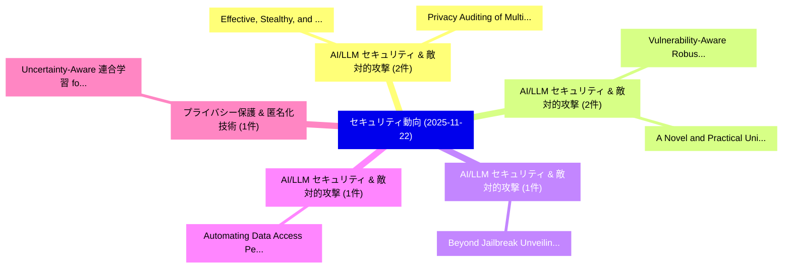

# 📅 02_daily: 日次エグゼクティブサマリー報告書 (2025-11-22)

**集計日時**: 2026-10-02 23:05:48 UTC  
**対象日付**: 2025-11-22  
**本日収集論文数**: 13 件  

---

## 💡 主要セキュリティ動向・脅威インサイト (Executive Insights)

本日の収集論文（計 13 件）において、以下の重点セキュリティ領域で活発な研究動向が確認されました：
- **AI/LLM セキュリティ & 敵対的攻撃** (2 件): 注目論文として 「Effective, Stealthy, and Persi...」、「Privacy Auditing of Multi-doma...」 等が発表され、実務防御および攻撃検証の進展が見られます。
- **AI/LLM セキュリティ & 敵対的攻撃** (2 件): 注目論文として 「Vulnerability-Aware Robust Mul...」、「A Novel and Practical Universa...」 等が発表され、実務防御および攻撃検証の進展が見られます。
- **AI/LLM セキュリティ & 敵対的攻撃** (1 件): 注目論文として 「Beyond Jailbreak: Unveiling Ri...」 等が発表され、実務防御および攻撃検証の進展が見られます。
- **AI/LLM セキュリティ & 敵対的攻撃** (1 件): 注目論文として 「Automating Data Access Permiss...」 等が発表され、実務防御および攻撃検証の進展が見られます。
- **プライバシー保護 & 匿名化技術** (1 件): 注目論文として 「Uncertainty-Aware 連合学習 for Cyb...」 等が発表され、実務防御および攻撃検証の進展が見られます。

### 🗺️ 技術・脅威トピックマインドマップ

---

## 📌 日次セキュリティ論文一覧 (日本語表形式)

| No | arXiv ID | 論文タイトル (日本語訳) | 重要キーワード | 構造化エグゼクティブ要約 (背景・提案・影響) | 脅威分類 | 詳細リンク |
|---|---|---|---|---|---|---|
| 1 | `2511.17874v2` | [Beyond Jailbreak: Unveiling Risks in LLM Applications Arising from Blurred Capability Boundaries（セキュリティ分析論文）](../../okf/papers/2025-11-22/2511.17874.md) | `Blurred Capability Boundaries`, `Beyond Jailbreak`, `Unveiling Risks` | 【提案】概要 (Overview & Key Finding) 本論文「Beyond ジェイルブレイク: Unveiling Risks in LLM Applications Ar...。実証評価により経営層・セキュリティ管理者向け推奨アクション (E... | `cybersecurity` | [arXiv](https://arxiv.org/abs/2511.17874v2) &#124; [OKF](../../okf/papers/2025-11-22/2511.17874.md) |
| 2 | `2511.17959v1` | [Automating Data Access Permissions in AI Agentsに向けて](../../okf/papers/2025-11-22/2511.17959.md) | `Towards Automating Data Access Permissions`, `Automating Data Access Permissions`, `Yuhao Wu` | 【提案】概要 (Overview & Key Finding) 本論文「Automating Data Access Permissions in AI Agentsに向けて」（原題...。実証評価により経営層・セキュリティ管理者向け推奨アクション (E... | `cs.AI` | [arXiv](https://arxiv.org/abs/2511.17959v1) &#124; [OKF](../../okf/papers/2025-11-22/2511.17959.md) |
| 3 | `2511.17968v1` | [Uncertainty-Aware 連合学習 for Cyber-Resilient Microgrid Energy Management](../../okf/papers/2025-11-22/2511.17968.md) | `Resilient Microgrid Energy Management`, `Cyber-Resilient Microgrid`, `Aware Federated Learning` | 【提案】概要 (Overview & Key Finding) 本論文「Uncertainty-Aware 連合学習 for Cyber-Resilient Microgrid En...。実証評価により経営層・セキュリティ管理者向け推奨アクション (E... | `executive-summary` | [arXiv](https://arxiv.org/abs/2511.17968v1) &#124; [OKF](../../okf/papers/2025-11-22/2511.17968.md) |
| 4 | `2511.17978v1` | [Federated Anomaly Detection and Mitigation for EV Charging Forecasting Under Cyberattacks（セキュリティ分析論文）](../../okf/papers/2025-11-22/2511.17978.md) | `Federated Anomaly Detection`, `Oluleke Babayomi`, `Seong Kim` | 【提案】概要 (Overview & Key Finding) 本論文「Federated Anomaly Detection and Mitigation for EV Charg...。実証評価により経営層・セキュリティ管理者向け推奨アクション (E... | `executive-summary` | [arXiv](https://arxiv.org/abs/2511.17978v1) &#124; [OKF](../../okf/papers/2025-11-22/2511.17978.md) |
| 5 | `2511.17982v1` | [Effective, Stealthy, and Persistent Backdoor Attacks Targeting Graph Foundation Modelsに向けて](../../okf/papers/2025-11-22/2511.17982.md) | `Persistent Backdoor Attacks Targeting Graph Foundation`, `Persistent Backdoor Attacks Targeting Graph Foundation Models`, `Towards Effective` | 【提案】概要 (Overview & Key Finding) 本論文「Effective, Stealthy, and Persistent Backdoor Attacks Ta...。実証評価により経営層・セキュリティ管理者向け推奨アクション (E... | `cs.AI` | [arXiv](https://arxiv.org/abs/2511.17982v1) &#124; [OKF](../../okf/papers/2025-11-22/2511.17982.md) |
| 6 | `2511.17989v1` | [Privacy Auditing of Multi-domain Graph Pre-trained Model under Membership Inference Attacks（セキュリティ分析論文）](../../okf/papers/2025-11-22/2511.17989.md) | `Membership Inference Attacks`, `Privacy Auditing`, `Graph Pre` | 【提案】概要 (Overview & Key Finding) 本論文「Privacy Auditing of Multi-domain Graph Pre-trained Mode...。実証評価により経営層・セキュリティ管理者向け推奨アクション (E... | `cs.AI` | [arXiv](https://arxiv.org/abs/2511.17989v1) &#124; [OKF](../../okf/papers/2025-11-22/2511.17989.md) |
| 7 | `2511.18025v1` | [Correlated-Sequence Differential Privacy（セキュリティ分析論文）](../../okf/papers/2025-11-22/2511.18025.md) | `Sequence Differential Privacy`, `Correlated-Sequence Differential`, `Yifan Luo` | 【提案】概要 (Overview & Key Finding) 本論文「Correlated-Sequence 差分プライバシー（セキュリティ分析論文）」（原題: Correlate...。実証評価により経営層・セキュリティ管理者向け推奨アクション (E... | `executive-summary` | [arXiv](https://arxiv.org/abs/2511.18025v1) &#124; [OKF](../../okf/papers/2025-11-22/2511.18025.md) |
| 8 | `2511.18045v1` | [SCI-IoT: A Quantitative Framework for Trust Scoring and Certification of IoT Devices（セキュリティ分析論文）](../../okf/papers/2025-11-22/2511.18045.md) | `Trust Scoring`, `Chinmay Prawah Pant`, `Shreyansh Swami` | 【提案】概要 (Overview & Key Finding) 本論文「SCI-IoT: A Quantitative Framework for Trust Scoring and...。実証評価により経営層・セキュリティ管理者向け推奨アクション (E... | `cybersecurity` | [arXiv](https://arxiv.org/abs/2511.18045v1) &#124; [OKF](../../okf/papers/2025-11-22/2511.18045.md) |
| 9 | `2511.18098v1` | [Harnessing the Power of LLMs for ABAC Policy Miningに向けて](../../okf/papers/2025-11-22/2511.18098.md) | `Towards Harnessing`, `Policy Mining`, `Shamik Sural` | 【提案】概要 (Overview & Key Finding) 本論文「Harnessing the Power of LLMs for ABAC Policy Miningに向けて...。実証評価により経営層・セキュリティ管理者向け推奨アクション (E... | `executive-summary` | [arXiv](https://arxiv.org/abs/2511.18098v1) &#124; [OKF](../../okf/papers/2025-11-22/2511.18098.md) |
| 10 | `2511.18114v1` | [ASTRA: Agentic Steerability and Risk Assessment Framework（セキュリティ分析論文）](../../okf/papers/2025-11-22/2511.18114.md) | `Agentic Steerability`, `Itay Hazan`, `Yael Mathov` | 【提案】概要 (Overview & Key Finding) 本論文「ASTRA: Agentic Steerability and Risk Assessment Framewo...。実証評価により経営層・セキュリティ管理者向け推奨アクション (E... | `cybersecurity` | [arXiv](https://arxiv.org/abs/2511.18114v1) &#124; [OKF](../../okf/papers/2025-11-22/2511.18114.md) |
| 11 | `2511.18138v1` | [Vulnerability-Aware Robust Multimodal Adversarial Training（セキュリティ分析論文）](../../okf/papers/2025-11-22/2511.18138.md) | `Aware Robust Multimodal Adversarial Training`, `Vulnerability-Aware Robust`, `Junrui Zhang` | 【提案】概要 (Overview & Key Finding) 本論文「脆弱性-Aware Robust Multimodal Adversarial Training（セキュリティ...。実証評価により経営層・セキュリティ管理者向け推奨アクション (E... | `executive-summary` | [arXiv](https://arxiv.org/abs/2511.18138v1) &#124; [OKF](../../okf/papers/2025-11-22/2511.18138.md) |
| 12 | `2511.18155v1` | [eBPF-PATROL: Protective Agent for Threat Recognition and Overreach Limitation using eBPF in Containerized and Virtualized Environments（セキュリティ分析論文）](../../okf/papers/2025-11-22/2511.18155.md) | `Protective Agent`, `Threat Recognition`, `Overreach Limitation` | 【提案】概要 (Overview & Key Finding) 本論文「eBPF-PATROL: Protective Agent for 脅威 Recognition and Ov...。実証評価により経営層・セキュリティ管理者向け推奨アクション (E... | `executive-summary` | [arXiv](https://arxiv.org/abs/2511.18155v1) &#124; [OKF](../../okf/papers/2025-11-22/2511.18155.md) |
| 13 | `2511.18223v1` | [A Novel and Practical Universal Adversarial Perturbations against Deep Reinforcement Learning based Intrusion Detection Systems（セキュリティ分析論文）](../../okf/papers/2025-11-22/2511.18223.md) | `Practical Universal Adversarial Perturbations`, `Deep Reinforcement Learning`, `Intrusion Detection Systems` | 【提案】概要 (Overview & Key Finding) 本論文「A Novel and Practical Universal Adversarial Perturbatio...。実証評価により経営層・セキュリティ管理者向け推奨アクション (E... | `cs.AI` | [arXiv](https://arxiv.org/abs/2511.18223v1) &#124; [OKF](../../okf/papers/2025-11-22/2511.18223.md) |

