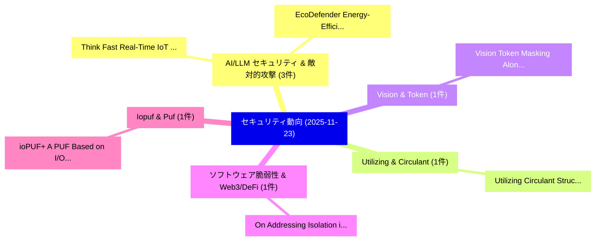

# 📅 02_daily: 日次エグゼクティブサマリー報告書 (2025-11-23)

**集計日時**: 2026-10-02 23:05:48 UTC  
**対象日付**: 2025-11-23  
**本日収集論文数**: 17 件  

---

## 💡 主要セキュリティ動向・脅威インサイト (Executive Insights)

本日の収集論文（計 17 件）において、以下の重点セキュリティ領域で活発な研究動向が確認されました：
- **AI/LLM セキュリティ & 敵対的攻撃** (3 件): 注目論文として 「Think Fast: Real-Time IoT Intr...」、「EcoDefender: Energy-Efficient ...」 等が発表され、実務防御および攻撃検証の進展が見られます。
- **Utilizing & Circulant** (1 件): 注目論文として 「Utilizing Circulant Structure ...」 等が発表され、実務防御および攻撃検証の進展が見られます。
- **Vision & Token** (1 件): 注目論文として 「Vision Token Masking Alone Can...」 等が発表され、実務防御および攻撃検証の進展が見られます。
- **ソフトウェア脆弱性 & Web3/DeFi** (1 件): 注目論文として 「On Addressing Isolation in Blo...」 等が発表され、実務防御および攻撃検証の進展が見られます。
- **Iopuf & Puf** (1 件): 注目論文として 「ioPUF+: A PUF Based on I/O Pul...」 等が発表され、実務防御および攻撃検証の進展が見られます。

### 🗺️ 技術・脅威トピックマインドマップ

---

## 📌 日次セキュリティ論文一覧 (日本語表形式)

| No | arXiv ID | 論文タイトル (日本語訳) | 重要キーワード | 構造化エグゼクティブ要約 (背景・提案・影響) | 脅威分類 | 詳細リンク |
|---|---|---|---|---|---|---|
| 1 | `2511.18226v2` | [Utilizing Circulant Structure to Optimize the Implementations of Linear Layers（セキュリティ分析論文）](../../okf/papers/2025-11-23/2511.18226.md) | `Utilizing Circulant Structure`, `Linear Layers`, `Buji Xu` | 【提案】概要 (Overview & Key Finding) 本論文「Utilizing Circulant Structure to Optimize the Implement...。実証評価により経営層・セキュリティ管理者向け推奨アクション (E... | `executive-summary` | [arXiv](https://arxiv.org/abs/2511.18226v2) &#124; [OKF](../../okf/papers/2025-11-23/2511.18226.md) |
| 2 | `2511.18230v1` | [Think Fast: Real-Time IoT Intrusion Reasoning Using IDS and LLMs at the Edge Gateway（セキュリティ分析論文）](../../okf/papers/2025-11-23/2511.18230.md) | `Intrusion Reasoning Using`, `Think Fast`, `Edge Gateway` | 【提案】概要 (Overview & Key Finding) 本論文「Think Fast: Real-Time IoT Intrusion Reasoning Using IDS...。実証評価により経営層・セキュリティ管理者向け推奨アクション (E... | `cybersecurity` | [arXiv](https://arxiv.org/abs/2511.18230v1) &#124; [OKF](../../okf/papers/2025-11-23/2511.18230.md) |
| 3 | `2511.18235v3` | [EcoDefender: Energy-Efficient Hybrid Anomaly Detection for IoT Edge Gateways（セキュリティ分析論文）](../../okf/papers/2025-11-23/2511.18235.md) | `Efficient Hybrid Anomaly Detection`, `Edge Gateways`, `Energy-Efficient Hybrid` | 【提案】概要 (Overview & Key Finding) 本論文「EcoDefender: Energy-Efficient Hybrid Anomaly Detection ...。実証評価により経営層・セキュリティ管理者向け推奨アクション (E... | `cybersecurity` | [arXiv](https://arxiv.org/abs/2511.18235v3) &#124; [OKF](../../okf/papers/2025-11-23/2511.18235.md) |
| 4 | `2511.18240v5` | [Green Deep Reinforcement Learning for IoT Edge Intrusion Detection（セキュリティ分析論文）](../../okf/papers/2025-11-23/2511.18240.md) | `Green Deep Reinforcement Learning`, `Edge Intrusion Detection`, `Saeid Jamshidi` | 【提案】概要 (Overview & Key Finding) 本論文「Green Deep Reinforcement Learning for IoT Edge Intrusio...。実証評価により経営層・セキュリティ管理者向け推奨アクション (E... | `cybersecurity` | [arXiv](https://arxiv.org/abs/2511.18240v5) &#124; [OKF](../../okf/papers/2025-11-23/2511.18240.md) |
| 5 | `2511.18272v1` | [Vision Token Masking Alone Cannot Prevent PHI Leakage in Medical Document OCR: A Systematic Evaluation（セキュリティ分析論文）](../../okf/papers/2025-11-23/2511.18272.md) | `Medical Document`, `Vision Token Masking Al`, `Raw Meta` | 【提案】背景とセキュリティ上の課題 (Background & Problem) 本研究はサイバー脅威環境におけるセキュリティ構造・脆弱性の検証を目的としています。(主要検出項目: ...。実証評価により概要 (Overview & Key Findin... | `cs.CV` | [arXiv](https://arxiv.org/abs/2511.18272v1) &#124; [OKF](../../okf/papers/2025-11-23/2511.18272.md) |
| 6 | `2511.18379v1` | [On Addressing Isolation in Blockchain-Based Self-Sovereign Identity（セキュリティ分析論文）](../../okf/papers/2025-11-23/2511.18379.md) | `Based Self`, `Sovereign Identity`, `Blockchain-Based Self` | 【提案】概要 (Overview & Key Finding) 本論文「On Addressing Isolation in Blockchain-Based Self-Sovere...。実証評価により経営層・セキュリティ管理者向け推奨アクション (E... | `cybersecurity` | [arXiv](https://arxiv.org/abs/2511.18379v1) &#124; [OKF](../../okf/papers/2025-11-23/2511.18379.md) |
| 7 | `2511.18412v2` | [ioPUF+: A PUF Based on I/O Pull-Up/Down Resistors for Secret Key Generation in IoT Nodes（セキュリティ分析論文）](../../okf/papers/2025-11-23/2511.18412.md) | `Secret Key Generation`, `Dilli Babu Porlapothula`, `Ananya Lakshmi Ravi` | 【提案】概要 (Overview & Key Finding) 本論文「ioPUF+: A PUF Based on I/O Pull-Up/Down Resistors for S...。実証評価により経営層・セキュリティ管理者向け推奨アクション (E... | `executive-summary` | [arXiv](https://arxiv.org/abs/2511.18412v2) &#124; [OKF](../../okf/papers/2025-11-23/2511.18412.md) |
| 8 | `2511.18438v1` | [LLMs as Firmware Experts: A Runtime-Grown Tree-of-Agents Framework（セキュリティ分析論文）](../../okf/papers/2025-11-23/2511.18438.md) | `Firmware Experts`, `Grown Tree`, `Runtime-Grown Tree` | 【提案】概要 (Overview & Key Finding) 本論文「LLMs as Firmware Experts: A Runtime-Grown Tree-of-Agent...。実証評価により経営層・セキュリティ管理者向け推奨アクション (E... | `executive-summary` | [arXiv](https://arxiv.org/abs/2511.18438v1) &#124; [OKF](../../okf/papers/2025-11-23/2511.18438.md) |
| 9 | `2511.18467v1` | [Shadows in the Code: Exploring the Risks and Defenses of LLM-based Multi-Agent Software Development Systems（セキュリティ分析論文）](../../okf/papers/2025-11-23/2511.18467.md) | `Agent Software Development Systems`, `LLM-based Multi`, `Xiaoqing Wang` | 【提案】概要 (Overview & Key Finding) 本論文「Shadows in the Code: Exploring the Risks and Defenses o...。実証評価により経営層・セキュリティ管理者向け推奨アクション (E... | `cs.AI` | [arXiv](https://arxiv.org/abs/2511.18467v1) &#124; [OKF](../../okf/papers/2025-11-23/2511.18467.md) |
| 10 | `2511.18498v1` | [DEXO: A Secure and Fair Exchange Mechanism for Decentralized IoT Data Markets（セキュリティ分析論文）](../../okf/papers/2025-11-23/2511.18498.md) | `Fair Exchange Mechanism`, `Data Markets`, `Yue Li` | 【提案】概要 (Overview & Key Finding) 本論文「DEXO: A Secure and Fair Exchange Mechanism for Decentra...。実証評価により経営層・セキュリティ管理者向け推奨アクション (E... | `cybersecurity` | [arXiv](https://arxiv.org/abs/2511.18498v1) &#124; [OKF](../../okf/papers/2025-11-23/2511.18498.md) |
| 11 | `2511.18531v2` | [LockForge: Automating Paper-to-Code for Logic Locking with Multi-Agent Reasoning LLMs（セキュリティ分析論文）](../../okf/papers/2025-11-23/2511.18531.md) | `Logic Locking`, `Agent Reasoning`, `Multi-Agent Reasoning` | 【提案】概要 (Overview & Key Finding) 本論文「LockForge: Automating Paper-to-Code for Logic Locking w...。実証評価により経営層・セキュリティ管理者向け推奨アクション (E... | `cs.PL` | [arXiv](https://arxiv.org/abs/2511.18531v2) &#124; [OKF](../../okf/papers/2025-11-23/2511.18531.md) |
| 12 | `2511.18568v2` | [Zero-Trust Strategies for O-RAN Cellular Networks: Principles, Challenges and Research Directions（セキュリティ分析論文）](../../okf/papers/2025-11-23/2511.18568.md) | `Trust Strategies`, `Cellular Networks`, `Research Directions` | 【提案】概要 (Overview & Key Finding) 本論文「ゼロトラスト Strategies for O-RAN Cellular Networks: Principl...。実証評価により経営層・セキュリティ管理者向け推奨アクション (E... | `cybersecurity` | [arXiv](https://arxiv.org/abs/2511.18568v2) &#124; [OKF](../../okf/papers/2025-11-23/2511.18568.md) |
| 13 | `2511.18581v2` | [TASO: Jailbreak LLMs via Alternative Template and Suffix Optimization（セキュリティ分析論文）](../../okf/papers/2025-11-23/2511.18581.md) | `Alternative Template`, `Suffix Optimization`, `Yanting Wang` | 【提案】概要 (Overview & Key Finding) 本論文「TASO: ジェイルブレイク LLMs via Alternative Template and Suffix...。実証評価により経営層・セキュリティ管理者向け推奨アクション (E... | `cybersecurity` | [arXiv](https://arxiv.org/abs/2511.18581v2) &#124; [OKF](../../okf/papers/2025-11-23/2511.18581.md) |
| 14 | `2511.18608v1` | [From Reviewers' Lens: Understanding Bug Bounty Report Invalid Reasons with LLMs（セキュリティ分析論文）](../../okf/papers/2025-11-23/2511.18608.md) | `Understanding Bug Bounty Report Invalid Reasons`, `Ali Abdullah Ahmad`, `Jiangrui Zheng` | 【提案】概要 (Overview & Key Finding) 本論文「From Reviewers' Lens: Understanding Bug Bounty Report I...。実証評価により経営層・セキュリティ管理者向け推奨アクション (E... | `executive-summary` | [arXiv](https://arxiv.org/abs/2511.18608v1) &#124; [OKF](../../okf/papers/2025-11-23/2511.18608.md) |
| 15 | `2511.18653v1` | [FHE-Agent: Automating CKKS Configuration for Practical Encrypted Inference via an LLM-Guided Agentic Framework（セキュリティ分析論文）](../../okf/papers/2025-11-23/2511.18653.md) | `Practical Encrypted Inference`, `LLM-Guided Agentic`, `Nuo Xu` | 【提案】概要 (Overview & Key Finding) 本論文「FHE-Agent: Automating CKKS Configuration for Practical ...。実証評価により経営層・セキュリティ管理者向け推奨アクション (E... | `cs.AI` | [arXiv](https://arxiv.org/abs/2511.18653v1) &#124; [OKF](../../okf/papers/2025-11-23/2511.18653.md) |
| 16 | `2511.19498v2` | [Hierarchical Dual-Strategy Unlearning for Biomedical and Healthcare Intelligence Using Imperfect and Privacy-Sensitive Medical Data（セキュリティ分析論文）](../../okf/papers/2025-11-23/2511.19498.md) | `Healthcare Intelligence Using Imperfect`, `Sensitive Medical Data`, `Hierarchical Dual` | 【提案】概要 (Overview & Key Finding) 本論文「Hierarchical Dual-Strategy Unlearning for Biomedical an...。実証評価により経営層・セキュリティ管理者向け推奨アクション (E... | `cs.AI` | [arXiv](https://arxiv.org/abs/2511.19498v2) &#124; [OKF](../../okf/papers/2025-11-23/2511.19498.md) |
| 17 | `2511.19499v1` | [Beyond Binary Classification: A Semi-supervised Approach to Generalized AI-generated Image Detection（セキュリティ分析論文）](../../okf/papers/2025-11-23/2511.19499.md) | `Beyond Binary Classification`, `Image Detection`, `AI-generated Image` | 【提案】概要 (Overview & Key Finding) 本論文「Beyond Binary Classification: A Semi-supervised Approac...。実証評価により経営層・セキュリティ管理者向け推奨アクション (E... | `cs.AI` | [arXiv](https://arxiv.org/abs/2511.19499v1) &#124; [OKF](../../okf/papers/2025-11-23/2511.19499.md) |

