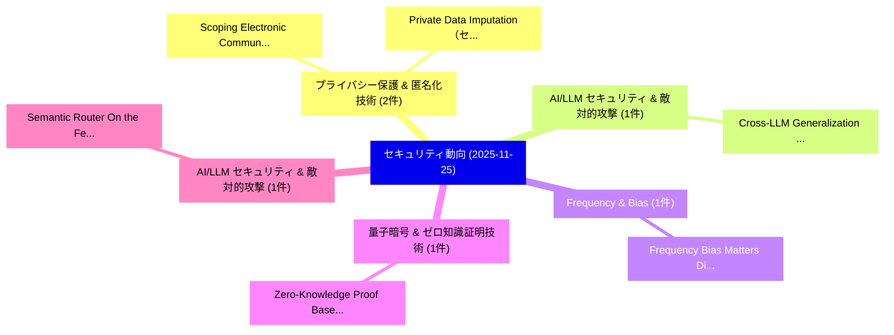

# 📅 02_daily: 日次エグゼクティブサマリー報告書 (2025-11-25)

**集計日時**: 2026-10-02 23:05:48 UTC  
**対象日付**: 2025-11-25  
**本日収集論文数**: 27 件  

---

## 💡 主要セキュリティ動向・脅威インサイト (Executive Insights)

本日の収集論文（計 27 件）において、以下の重点セキュリティ領域で活発な研究動向が確認されました：
- **プライバシー保護 & 匿名化技術** (2 件): 注目論文として 「Scoping Electronic Communicati...」、「Private Data Imputation（セキュリティ...」 等が発表され、実務防御および攻撃検証の進展が見られます。
- **AI/LLM セキュリティ & 敵対的攻撃** (1 件): 注目論文として 「Cross-LLM Generalization of Be...」 等が発表され、実務防御および攻撃検証の進展が見られます。
- **Frequency & Bias** (1 件): 注目論文として 「Frequency Bias Matters: Diving...」 等が発表され、実務防御および攻撃検証の進展が見られます。
- **量子暗号 & ゼロ知識証明技術** (1 件): 注目論文として 「Zero-Knowledge Proof Based Ver...」 等が発表され、実務防御および攻撃検証の進展が見られます。
- **AI/LLM セキュリティ & 敵対的攻撃** (1 件): 注目論文として 「Semantic Router: On the Feasib...」 等が発表され、実務防御および攻撃検証の進展が見られます。

### 🗺️ 技術・脅威トピックマインドマップ

---

## 📌 日次セキュリティ論文一覧 (日本語表形式)

| No | arXiv ID | 論文タイトル (日本語訳) | 重要キーワード | 構造化エグゼクティブ要約 (背景・提案・影響) | 脅威分類 | 詳細リンク |
|---|---|---|---|---|---|---|
| 1 | `2511.19874v1` | [Cross-LLM Generalization of Behavioral Backdoor Detection in AI Agent Supply Chains（セキュリティ分析論文）](../../okf/papers/2025-11-25/2511.19874.md) | `Behavioral Backdoor Detection`, `Agent Supply Chains`, `Cross-LLM Generalization` | 【提案】概要 (Overview & Key Finding) 本論文「Cross-LLM Generalization of Behavioral Backdoor Detecti...。実証評価により経営層・セキュリティ管理者向け推奨アクション (E... | `cs.AI` | [arXiv](https://arxiv.org/abs/2511.19874v1) &#124; [OKF](../../okf/papers/2025-11-25/2511.19874.md) |
| 2 | `2511.19886v1` | [Frequency Bias Matters: Diving into Robust and Generalized Deep Image Forgery Detection（セキュリティ分析論文）](../../okf/papers/2025-11-25/2511.19886.md) | `Generalized Deep Image Forgery Detection`, `Frequency Bias Matters`, `Chi Liu` | 【提案】概要 (Overview & Key Finding) 本論文「Frequency Bias Matters: Diving into Robust and Generali...。実証評価により経営層・セキュリティ管理者向け推奨アクション (E... | `cs.CV` | [arXiv](https://arxiv.org/abs/2511.19886v1) &#124; [OKF](../../okf/papers/2025-11-25/2511.19886.md) |
| 3 | `2511.19902v1` | [Zero-Knowledge Proof Based Verifiable Inference of Models（セキュリティ分析論文）](../../okf/papers/2025-11-25/2511.19902.md) | `Knowledge Proof Based Verifiable Inference`, `Zero-Knowledge Proof`, `Yunxiao Wang` | 【提案】概要 (Overview & Key Finding) 本論文「ゼロ知識証明 Based Verifiable Inference of Models（セキュリティ分析論文）...。実証評価により経営層・セキュリティ管理者向け推奨アクション (E... | `cs.AI` | [arXiv](https://arxiv.org/abs/2511.19902v1) &#124; [OKF](../../okf/papers/2025-11-25/2511.19902.md) |
| 4 | `2511.20002v3` | [Semantic Router: On the Feasibility of Hijacking MLLMs via a Single Adversarial Perturbation（セキュリティ分析論文）](../../okf/papers/2025-11-25/2511.20002.md) | `Single Adversarial Perturbation`, `Semantic Router`, `Single Adversarial Pertur` | 【提案】概要 (Overview & Key Finding) 本論文「Semantic Router: On the Feasibility of Hijacking MLLMs ...。実証評価により経営層・セキュリティ管理者向け推奨アクション (E... | `cs.AI` | [arXiv](https://arxiv.org/abs/2511.20002v3) &#124; [OKF](../../okf/papers/2025-11-25/2511.20002.md) |
| 5 | `2511.20229v1` | [Improving the Identification of Real-world Malware's DNS Covert Channels Using Locality Sensitive Hashing（セキュリティ分析論文）](../../okf/papers/2025-11-25/2511.20229.md) | `Covert Channels Using Locality Sensitive Hashing`, `Real-world Malware`, `Pascal Ruffing` | 【提案】概要 (Overview & Key Finding) 本論文「Improving the Identification of Real-world マルウェア's DNS ...。実証評価により経営層・セキュリティ管理者向け推奨アクション (E... | `cs.NI` | [arXiv](https://arxiv.org/abs/2511.20229v1) &#124; [OKF](../../okf/papers/2025-11-25/2511.20229.md) |
| 6 | `2511.20252v1` | [Hey there! You are using WhatsApp: Enumerating Three Billion Accounts for Security and Privacy（セキュリティ分析論文）](../../okf/papers/2025-11-25/2511.20252.md) | `Enumerating Three Billion Accounts`, `Johanna Ullrich`, `Aljosha Judmayer` | 【提案】You are using WhatsApp: Enumerating Three Billion Accounts for Security and Privacy ###...。実証評価により経営層・セキュリティ管理者向け推奨アクション (E... | `executive-summary` | [arXiv](https://arxiv.org/abs/2511.20252v1) &#124; [OKF](../../okf/papers/2025-11-25/2511.20252.md) |
| 7 | `2511.20284v2` | [Can LLMs Make (Personalized) Access Control Decisions?（セキュリティ分析論文）](../../okf/papers/2025-11-25/2511.20284.md) | `Access Control Decisions`, `Lara Magdalena Lazier`, `Friederike Groschupp` | 【提案】### (日本語題名: Can LLMs Make (Personalized) アクセス制御 Decisions?（セキュリティ分析論文）)  > [!NOTE] > **...。実証評価により経営層・セキュリティ管理者向け推奨アクション (E... | `cs.AI` | [arXiv](https://arxiv.org/abs/2511.20284v2) &#124; [OKF](../../okf/papers/2025-11-25/2511.20284.md) |
| 8 | `2511.20290v2` | [APT-CGLP: Advanced Persistent Threat Hunting via Contrastive Graph-Language Pre-Training（セキュリティ分析論文）](../../okf/papers/2025-11-25/2511.20290.md) | `Advanced Persistent Threat Hunting`, `Contrastive Graph`, `Language Pre` | 【提案】概要 (Overview & Key Finding) 本論文「APT-CGLP: Advanced Persistent 脅威 Hunting via Contrastiv...。実証評価により経営層・セキュリティ管理者向け推奨アクション (E... | `cybersecurity` | [arXiv](https://arxiv.org/abs/2511.20290v2) &#124; [OKF](../../okf/papers/2025-11-25/2511.20290.md) |
| 9 | `2511.20313v2` | [A Reality Check on SBOM-based Vulnerability Management: An Empirical Study and A Path Forward（セキュリティ分析論文）](../../okf/papers/2025-11-25/2511.20313.md) | `Reality Check`, `SBOM-based Vulnerability`, `Vulnerability Management` | 【提案】概要 (Overview & Key Finding) 本論文「A Reality Check on SBOM-based 脆弱性 Management: An Empiri...。実証評価により経営層・セキュリティ管理者向け推奨アクション (E... | `cybersecurity` | [arXiv](https://arxiv.org/abs/2511.20313v2) &#124; [OKF](../../okf/papers/2025-11-25/2511.20313.md) |
| 10 | `2511.20480v1` | [Ranking-Enhanced Anomaly Detection Using Active Learning-Assisted Attention Adversarial Dual AutoEncoders（セキュリティ分析論文）](../../okf/papers/2025-11-25/2511.20480.md) | `Enhanced Anomaly Detection Using Active Learning`, `Assisted Attention Adversarial Dual`, `Ranking-Enhanced Anomaly` | 【提案】概要 (Overview & Key Finding) 本論文「Ranking-Enhanced Anomaly Detection Using Active Learnin...。実証評価により経営層・セキュリティ管理者向け推奨アクション (E... | `cs.AI` | [arXiv](https://arxiv.org/abs/2511.20480v1) &#124; [OKF](../../okf/papers/2025-11-25/2511.20480.md) |
| 11 | `2511.20500v1` | [From One Attack Domain to Another: Contrastive Transfer Learning with Siamese Networks for APT Detection（セキュリティ分析論文）](../../okf/papers/2025-11-25/2511.20500.md) | `Contrastive Transfer Learning`, `Siamese Networks`, `Sidahmed Benabderrahmane` | 【提案】概要 (Overview & Key Finding) 本論文「From One Attack Domain to Another: Contrastive Transfer...。実証評価により経営層・セキュリティ管理者向け推奨アクション (E... | `cs.AI` | [arXiv](https://arxiv.org/abs/2511.20500v1) &#124; [OKF](../../okf/papers/2025-11-25/2511.20500.md) |
| 12 | `2511.20505v2` | [ACE-GF: A Generative Framework for Atomic Cryptographic Entities（セキュリティ分析論文）](../../okf/papers/2025-11-25/2511.20505.md) | `Atomic Cryptographic Entities`, `Jian Sheng Wang`, `Raw Meta` | 【提案】概要 (Overview & Key Finding) 本論文「ACE-GF: A Generative Framework for Atomic Cryptographic...。実証評価により経営層・セキュリティ管理者向け推奨アクション (E... | `cybersecurity` | [arXiv](https://arxiv.org/abs/2511.20505v2) &#124; [OKF](../../okf/papers/2025-11-25/2511.20505.md) |
| 13 | `2511.20533v1` | [Engel p-adic Isogeny-based Cryptography over Laurent Series: Foundations, Security, and an ESP32 Implementation（セキュリティ分析論文）](../../okf/papers/2025-11-25/2511.20533.md) | `Laurent Series`, `p-adic Isogeny`, `Ilias Cherkaoui` | 【提案】概要 (Overview & Key Finding) 本論文「Engel p-adic Isogeny-based 暗号技術 over Laurent Series: Fo...。実証評価により経営層・セキュリティ管理者向け推奨アクション (E... | `executive-summary` | [arXiv](https://arxiv.org/abs/2511.20533v1) &#124; [OKF](../../okf/papers/2025-11-25/2511.20533.md) |
| 14 | `2511.20555v2` | [PILOT: Command-line Interface Fuzzing via Path-Guided, Iterative Large Language Model Prompting（セキュリティ分析論文）](../../okf/papers/2025-11-25/2511.20555.md) | `Iterative Large Language Model Prompting`, `Command-line Interface`, `Interface Fuzzing` | 【提案】概要 (Overview & Key Finding) 本論文「PILOT: Command-line Interface Fuzzing via Path-Guided, ...。実証評価により経営層・セキュリティ管理者向け推奨アクション (E... | `cybersecurity` | [arXiv](https://arxiv.org/abs/2511.20555v2) &#124; [OKF](../../okf/papers/2025-11-25/2511.20555.md) |
| 15 | `2511.20597v2` | [BrowseSafe: Understanding and Preventing Prompt Injection Within AI Browser Agents（セキュリティ分析論文）](../../okf/papers/2025-11-25/2511.20597.md) | `Preventing Prompt Injection Within`, `Browser Agents`, `Kaiyuan Zhang` | 【提案】概要 (Overview & Key Finding) 本論文「BrowseSafe: Understanding and Preventing プロンプトインジェクション ...。実証評価により経営層・セキュリティ管理者向け推奨アクション (E... | `cs.AI` | [arXiv](https://arxiv.org/abs/2511.20597v2) &#124; [OKF](../../okf/papers/2025-11-25/2511.20597.md) |
| 16 | `2511.20602v1` | [Quantum Key Distribution: Bridging Theoretical Security Proofs, Practical Attacks, and Error Correction for Quantum-Augmented Networks（セキュリティ分析論文）](../../okf/papers/2025-11-25/2511.20602.md) | `Bridging Theoretical Security Proofs`, `Quantum Key Distribution`, `Practical Attacks` | 【提案】概要 (Overview & Key Finding) 本論文「量子鍵配送: Bridging Theoretical Security Proofs, Practical ...。実証評価により経営層・セキュリティ管理者向け推奨アクション (E... | `executive-summary` | [arXiv](https://arxiv.org/abs/2511.20602v1) &#124; [OKF](../../okf/papers/2025-11-25/2511.20602.md) |
| 17 | `2511.20630v3` | [Quantum-Resistant Authentication Scheme for RFID Systems Using Lattice-Based Cryptography（セキュリティ分析論文）](../../okf/papers/2025-11-25/2511.20630.md) | `Resistant Authentication Scheme`, `Systems Using Lattice`, `Quantum-Resistant Authentication` | 【提案】概要 (Overview & Key Finding) 本論文「量子-Resistant Authentication Scheme for RFID Systems Usi...。実証評価により経営層・セキュリティ管理者向け推奨アクション (E... | `cybersecurity` | [arXiv](https://arxiv.org/abs/2511.20630v3) &#124; [OKF](../../okf/papers/2025-11-25/2511.20630.md) |
| 18 | `2511.20744v1` | [Scoping Electronic Communication Privacy Rules: Data, Services and Values（セキュリティ分析論文）](../../okf/papers/2025-11-25/2511.20744.md) | `Scoping Electronic Communication Privacy Rules`, `Frederik Zuiderveen Borgesius`, `Raw Meta` | 【提案】概要 (Overview & Key Finding) 本論文「Scoping Electronic Communication Privacy Rules: Data, S...。実証評価により経営層・セキュリティ管理者向け推奨アクション (E... | `executive-summary` | [arXiv](https://arxiv.org/abs/2511.20744v1) &#124; [OKF](../../okf/papers/2025-11-25/2511.20744.md) |
| 19 | `2511.20799v1` | [Memories Retrieved from Many Paths: A Multi-Prefix Framework for Robust Training Data Leakage in Large Language Modelsの検出](../../okf/papers/2025-11-25/2511.20799.md) | `Memories Retrieved`, `Many Paths`, `Robust Training Data Leakage` | 【提案】概要 (Overview & Key Finding) 本論文「Memories Retrieved from Many Paths: A Multi-Prefix Fram...。実証評価により経営層・セキュリティ管理者向け推奨アクション (E... | `cs.AI` | [arXiv](https://arxiv.org/abs/2511.20799v1) &#124; [OKF](../../okf/papers/2025-11-25/2511.20799.md) |
| 20 | `2511.20801v1` | [A Research and Development Portfolio of GNN Centric マルウェア検出, Explainability, and Dataset Curation](../../okf/papers/2025-11-25/2511.20801.md) | `Development Portfolio`, `Dataset Curation`, `Centric Malware Detection` | 【提案】概要 (Overview & Key Finding) 本論文「A Research and Development Portfolio of GNN Centric マルウ...。実証評価により経営層・セキュリティ管理者向け推奨アクション (E... | `cybersecurity` | [arXiv](https://arxiv.org/abs/2511.20801v1) &#124; [OKF](../../okf/papers/2025-11-25/2511.20801.md) |
| 21 | `2511.20832v1` | [Private Data Imputation（セキュリティ分析論文）](../../okf/papers/2025-11-25/2511.20832.md) | `Private Data Imputation`, `Abdelkarim Kati`, `Florian Kerschbaum` | 【提案】概要 (Overview & Key Finding) 本論文「Private Data Imputation（セキュリティ分析論文）」（原題: Private Data I...。実証評価により経営層・セキュリティ管理者向け推奨アクション (E... | `cybersecurity` | [arXiv](https://arxiv.org/abs/2511.20832v1) &#124; [OKF](../../okf/papers/2025-11-25/2511.20832.md) |
| 22 | `2511.20878v2` | [Supporting Students in Navigating LLM-Generated Insecure Code（セキュリティ分析論文）](../../okf/papers/2025-11-25/2511.20878.md) | `Generated Insecure Code`, `Supporting Students`, `LLM-Generated Insecure` | 【提案】概要 (Overview & Key Finding) 本論文「Supporting Students in Navigating LLM-Generated Insecur...。実証評価により経営層・セキュリティ管理者向け推奨アクション (E... | `cybersecurity` | [arXiv](https://arxiv.org/abs/2511.20878v2) &#124; [OKF](../../okf/papers/2025-11-25/2511.20878.md) |
| 23 | `2511.20902v1` | [A Taxonomy of Pix Fraud in Brazil: Attack Methodologies, AI-Driven Amplification, and Defensive Strategies（セキュリティ分析論文）](../../okf/papers/2025-11-25/2511.20902.md) | `Pix Fraud`, `Attack Methodologies`, `Driven Amplification` | 【提案】概要 (Overview & Key Finding) 本論文「A Taxonomy of Pix Fraud in Brazil: Attack Methodologies...。実証評価により経営層・セキュリティ管理者向け推奨アクション (E... | `cs.AI` | [arXiv](https://arxiv.org/abs/2511.20902v1) &#124; [OKF](../../okf/papers/2025-11-25/2511.20902.md) |
| 24 | `2511.20920v1` | [the Model Context Protocol (MCP): Risks, Controls, and Governanceのセキュリティ強化](../../okf/papers/2025-11-25/2511.20920.md) | `Model Context Protocol`, `Herman Errico`, `Jiquan Ngiam` | 【提案】概要 (Overview & Key Finding) 本論文「the Model Context Protocol (MCP): Risks, Controls, and ...。実証評価により経営層・セキュリティ管理者向け推奨アクション (E... | `cybersecurity` | [arXiv](https://arxiv.org/abs/2511.20920v1) &#124; [OKF](../../okf/papers/2025-11-25/2511.20920.md) |
| 25 | `2511.20922v3` | [Readout-Side Bypass for Residual Hybrid Quantum-Classical Models（セキュリティ分析論文）](../../okf/papers/2025-11-25/2511.20922.md) | `Residual Hybrid Quantum`, `Side Bypass`, `Classical Models` | 【提案】概要 (Overview & Key Finding) 本論文「Readout-Side Bypass for Residual Hybrid 量子-Classical Mo...。実証評価により経営層・セキュリティ管理者向け推奨アクション (E... | `executive-summary` | [arXiv](https://arxiv.org/abs/2511.20922v3) &#124; [OKF](../../okf/papers/2025-11-25/2511.20922.md) |
| 26 | `2511.21764v1` | [Adaptive Polymorphic Malware: Leveraging Mutation Engines and YARA Rules for Enhanced Securityの検出](../../okf/papers/2025-11-25/2511.21764.md) | `Leveraging Mutation Engines`, `Adaptive Polymorphic Malware`, `Adaptive Detection` | 【提案】概要 (Overview & Key Finding) 本論文「Adaptive Polymorphic マルウェア: Leveraging Mutation Engines...。実証評価により経営層・セキュリティ管理者向け推奨アクション (E... | `cybersecurity` | [arXiv](https://arxiv.org/abs/2511.21764v1) &#124; [OKF](../../okf/papers/2025-11-25/2511.21764.md) |
| 27 | `2511.21768v1` | [Categorical Framework for Quantum-Resistant Zero-Trust AI Security（セキュリティ分析論文）](../../okf/papers/2025-11-25/2511.21768.md) | `Resistant Zero`, `Quantum-Resistant Zero`, `Raw Meta` | 【提案】概要 (Overview & Key Finding) 本論文「Categorical Framework for 量子-Resistant ゼロトラスト AI Securi...。実証評価によりClarke, J.。 | `executive-summary` | [arXiv](https://arxiv.org/abs/2511.21768v1) &#124; [OKF](../../okf/papers/2025-11-25/2511.21768.md) |

