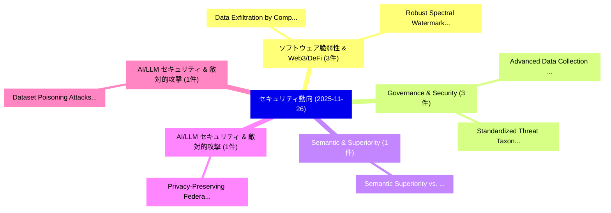

# 📅 02_daily: 日次エグゼクティブサマリー報告書 (2025-11-26)

**集計日時**: 2026-10-02 23:05:48 UTC  
**対象日付**: 2025-11-26  
**本日収集論文数**: 22 件  

---

## 💡 主要セキュリティ動向・脅威インサイト (Executive Insights)

本日の収集論文（計 22 件）において、以下の重点セキュリティ領域で活発な研究動向が確認されました：
- **ソフトウェア脆弱性 & Web3/DeFi** (3 件): 注目論文として 「Data Exfiltration by Compressi...」、「Robust Spectral Watermark for ...」 等が発表され、実務防御および攻撃検証の進展が見られます。
- **Governance & Security** (3 件): 注目論文として 「Advanced Data Collection Techn...」、「Standardized Threat Taxonomy f...」 等が発表され、実務防御および攻撃検証の進展が見られます。
- **Semantic & Superiority** (1 件): 注目論文として 「Semantic Superiority vs. Foren...」 等が発表され、実務防御および攻撃検証の進展が見られます。
- **AI/LLM セキュリティ & 敵対的攻撃** (1 件): 注目論文として 「Privacy-Preserving Federated V...」 等が発表され、実務防御および攻撃検証の進展が見られます。
- **AI/LLM セキュリティ & 敵対的攻撃** (1 件): 注目論文として 「Dataset Poisoning Attacks on B...」 等が発表され、実務防御および攻撃検証の進展が見られます。

### 🗺️ 技術・脅威トピックマインドマップ

---

## 📌 日次セキュリティ論文一覧 (日本語表形式)

| No | arXiv ID | 論文タイトル (日本語訳) | 重要キーワード | 構造化エグゼクティブ要約 (背景・提案・影響) | 脅威分類 | 詳細リンク |
|---|---|---|---|---|---|---|
| 1 | `2511.20944v4` | [Semantic Superiority vs. Forensic Efficiency: A Comparative Deep Learning and Psycholinguistics for Business Email Compromise Detectionの分析](../../okf/papers/2025-11-26/2511.20944.md) | `Semantic Superiority`, `Forensic Efficiency`, `Business Email Compromise Detection` | 【提案】概要 (Overview & Key Finding) 本論文「Semantic Superiority vs. Forensic Efficiency: A Compara...。実証評価により経営層・セキュリティ管理者向け推奨アクション (E... | `executive-summary` | [arXiv](https://arxiv.org/abs/2511.20944v4) &#124; [OKF](../../okf/papers/2025-11-26/2511.20944.md) |
| 2 | `2511.20983v1` | [Privacy-Preserving Federated Vision Transformer Learning Leveraging Lightweight Homomorphic Encryption in Medical AI（セキュリティ分析論文）](../../okf/papers/2025-11-26/2511.20983.md) | `Preserving Federated Vision Transformer Learning Leveraging Lightweight Homomorphic Encryption`, `Privacy-Preserving Federated`, `Al Amin` | 【提案】概要 (Overview & Key Finding) 本論文「Privacy-Preserving Federated Vision Transformer Learnin...。実証評価により経営層・セキュリティ管理者向け推奨アクション (E... | `cs.CV` | [arXiv](https://arxiv.org/abs/2511.20983v1) &#124; [OKF](../../okf/papers/2025-11-26/2511.20983.md) |
| 3 | `2511.20992v2` | [Dataset Poisoning Attacks on Behavioral Cloning Policies（セキュリティ分析論文）](../../okf/papers/2025-11-26/2511.20992.md) | `Dataset Poisoning Attacks`, `Behavioral Cloning Policies`, `Akansha Kalra` | 【提案】概要 (Overview & Key Finding) 本論文「Dataset Poisoning Attacks on Behavioral Cloning Policie...。実証評価により経営層・セキュリティ管理者向け推奨アクション (E... | `executive-summary` | [arXiv](https://arxiv.org/abs/2511.20992v2) &#124; [OKF](../../okf/papers/2025-11-26/2511.20992.md) |
| 4 | `2511.20994v1` | [GuardTrace-VL: Detecting Unsafe Multimodel Reasoning via Iterative Safety Supervision（セキュリティ分析論文）](../../okf/papers/2025-11-26/2511.20994.md) | `Detecting Unsafe Multimodel Reasoning`, `Iterative Safety Supervision`, `Yuxiao Xiang` | 【提案】概要 (Overview & Key Finding) 本論文「GuardTrace-VL: Detecting Unsafe Multimodel Reasoning vi...。実証評価により経営層・セキュリティ管理者向け推奨アクション (E... | `cs.AI` | [arXiv](https://arxiv.org/abs/2511.20994v1) &#124; [OKF](../../okf/papers/2025-11-26/2511.20994.md) |
| 5 | `2511.21020v1` | [Road Network-Aware Personalized Trajectory Protection with Differential Privacy under Spatiotemporal Correlations（セキュリティ分析論文）](../../okf/papers/2025-11-26/2511.21020.md) | `Aware Personalized Trajectory Protection`, `Road Network`, `Differential Privacy` | 【提案】概要 (Overview & Key Finding) 本論文「Road Network-Aware Personalized Trajectory Protection w...。実証評価により経営層・セキュリティ管理者向け推奨アクション (E... | `cybersecurity` | [arXiv](https://arxiv.org/abs/2511.21020v1) &#124; [OKF](../../okf/papers/2025-11-26/2511.21020.md) |
| 6 | `2511.21180v1` | [CAHS-Attack: CLIP-Aware Heuristic Search Attack Method for Stable Diffusion（セキュリティ分析論文）](../../okf/papers/2025-11-26/2511.21180.md) | `Stable Diffusion`, `CLIP-Aware Heuristic`, `Shuhan Xia` | 【提案】概要 (Overview & Key Finding) 本論文「CAHS-Attack: CLIP-Aware Heuristic Search Attack Method ...。実証評価により経営層・セキュリティ管理者向け推奨アクション (E... | `cs.AI` | [arXiv](https://arxiv.org/abs/2511.21180v1) &#124; [OKF](../../okf/papers/2025-11-26/2511.21180.md) |
| 7 | `2511.21216v1` | [AuthenLoRA: Entangling Stylization with Imperceptible Watermarks for Copyright-Secure LoRA Adapters（セキュリティ分析論文）](../../okf/papers/2025-11-26/2511.21216.md) | `Entangling Stylization`, `Imperceptible Watermarks`, `Copyright-Secure LoRA` | 【提案】概要 (Overview & Key Finding) 本論文「AuthenLoRA: Entangling Stylization with Imperceptible W...。実証評価により経営層・セキュリティ管理者向け推奨アクション (E... | `cybersecurity` | [arXiv](https://arxiv.org/abs/2511.21216v1) &#124; [OKF](../../okf/papers/2025-11-26/2511.21216.md) |
| 8 | `2511.21227v2` | [Data Exfiltration by Compression Attack: Definition and Evaluation on Medical Image Data（セキュリティ分析論文）](../../okf/papers/2025-11-26/2511.21227.md) | `Medical Image Data`, `Data Exfiltration`, `Compression Attack` | 【提案】概要 (Overview & Key Finding) 本論文「Data Exfiltration by Compression Attack: Definition and...。実証評価により経営層・セキュリティ管理者向け推奨アクション (E... | `cybersecurity` | [arXiv](https://arxiv.org/abs/2511.21227v2) &#124; [OKF](../../okf/papers/2025-11-26/2511.21227.md) |
| 9 | `2511.21291v1` | [Illuminating the Black Box: Real-Time Monitoring of Backdoor Unlearning in CNNs via Explainable AI（セキュリティ分析論文）](../../okf/papers/2025-11-26/2511.21291.md) | `Black Box`, `Time Monitoring`, `Real-Time Monitoring` | 【提案】概要 (Overview & Key Finding) 本論文「Illuminating the Black Box: Real-Time Monitoring of Bac...。実証評価により経営層・セキュリティ管理者向け推奨アクション (E... | `cybersecurity` | [arXiv](https://arxiv.org/abs/2511.21291v1) &#124; [OKF](../../okf/papers/2025-11-26/2511.21291.md) |
| 10 | `2511.21301v1` | [Empirical Assessment of the Code Comprehension Effort Needed to Attack Programs Protected with Obfuscation（セキュリティ分析論文）](../../okf/papers/2025-11-26/2511.21301.md) | `Code Comprehension Effort Needed`, `Attack Programs Protected`, `Empirical Assessment` | 【提案】概要 (Overview & Key Finding) 本論文「Empirical Assessment of the Code Comprehension Effort N...。実証評価により経営層・セキュリティ管理者向け推奨アクション (E... | `cybersecurity` | [arXiv](https://arxiv.org/abs/2511.21301v1) &#124; [OKF](../../okf/papers/2025-11-26/2511.21301.md) |
| 11 | `2511.21448v5` | [The Phish, The Spam, and The Valid: Generating Feature-Rich Emails for LLMsのベンチマーク評価](../../okf/papers/2025-11-26/2511.21448.md) | `Generating Feature`, `Rich Emails`, `Feature-Rich Emails` | 【提案】概要 (Overview & Key Finding) 本論文「The Phish, The Spam, and The Valid: Generating Feature-...。実証評価により経営層・セキュリティ管理者向け推奨アクション (E... | `cs.DB` | [arXiv](https://arxiv.org/abs/2511.21448v5) &#124; [OKF](../../okf/papers/2025-11-26/2511.21448.md) |
| 12 | `2511.21552v1` | [MAD-DAG: Protecting Blockchain Consensus from MEV（セキュリティ分析論文）](../../okf/papers/2025-11-26/2511.21552.md) | `Protecting Blockchain Consensus`, `Roi Bar`, `Aviv Tamar` | 【提案】概要 (Overview & Key Finding) 本論文「MAD-DAG: Protecting Blockchain Consensus from MEV（セキュリテ...。実証評価により経営層・セキュリティ管理者向け推奨アクション (E... | `executive-summary` | [arXiv](https://arxiv.org/abs/2511.21552v1) &#124; [OKF](../../okf/papers/2025-11-26/2511.21552.md) |
| 13 | `2511.21600v2` | [Robust Spectral Watermark for Synthetic Tabular Data（セキュリティ分析論文）](../../okf/papers/2025-11-26/2511.21600.md) | `Robust Spectral Watermark`, `Synthetic Tabular Data`, `Yizhou Zhao` | 【提案】概要 (Overview & Key Finding) 本論文「Robust Spectral Watermark for Synthetic Tabular Data（セキ...。実証評価により経営層・セキュリティ管理者向け推奨アクション (E... | `executive-summary` | [arXiv](https://arxiv.org/abs/2511.21600v2) &#124; [OKF](../../okf/papers/2025-11-26/2511.21600.md) |
| 14 | `2511.21795v1` | [Advanced Data Collection Techniques in Cloud Security: A Multi-Modal Deep Learning Autoencoder Approach（セキュリティ分析論文）](../../okf/papers/2025-11-26/2511.21795.md) | `Advanced Data Collection Techniques`, `Cloud Security`, `Multi-Modal Deep` | 【提案】概要 (Overview & Key Finding) 本論文「Advanced Data Collection Techniques in Cloud Security: ...。実証評価により経営層・セキュリティ管理者向け推奨アクション (E... | `cybersecurity` | [arXiv](https://arxiv.org/abs/2511.21795v1) &#124; [OKF](../../okf/papers/2025-11-26/2511.21795.md) |
| 15 | `2511.21803v1` | [Cross-Layer Wireless Misbehavior Using 5G RAN Telemetry and Operational Metadataの検出](../../okf/papers/2025-11-26/2511.21803.md) | `Layer Wireless Misbehavior Using`, `Wireless Misbehavior Using`, `Layer Detection` | 【提案】概要 (Overview & Key Finding) 本論文「Cross-Layer Wireless Misbehavior Using 5G RAN Telemetry...。実証評価により経営層・セキュリティ管理者向け推奨アクション (E... | `cybersecurity` | [arXiv](https://arxiv.org/abs/2511.21803v1) &#124; [OKF](../../okf/papers/2025-11-26/2511.21803.md) |
| 16 | `2511.21804v2` | [Beyond Membership: Limitations of Add/Remove Adjacency in Differential Privacy（セキュリティ分析論文）](../../okf/papers/2025-11-26/2511.21804.md) | `Beyond Membership`, `Remove Adjacency`, `Differential Privacy` | 【提案】概要 (Overview & Key Finding) 本論文「Beyond Membership: Limitations of Add/Remove Adjacency ...。実証評価により経営層・セキュリティ管理者向け推奨アクション (E... | `executive-summary` | [arXiv](https://arxiv.org/abs/2511.21804v2) &#124; [OKF](../../okf/papers/2025-11-26/2511.21804.md) |
| 17 | `2511.21842v1` | [Unsupervised Anomaly Detection for Smart IoT Devices: Performance and Resource Comparison（セキュリティ分析論文）](../../okf/papers/2025-11-26/2511.21842.md) | `Unsupervised Anomaly Detection`, `Resource Comparison`, `Sad Abdullah Sami` | 【提案】概要 (Overview & Key Finding) 本論文「Unsupervised Anomaly Detection for Smart IoT Devices: P...。実証評価により経営層・セキュリティ管理者向け推奨アクション (E... | `executive-summary` | [arXiv](https://arxiv.org/abs/2511.21842v1) &#124; [OKF](../../okf/papers/2025-11-26/2511.21842.md) |
| 18 | `2511.21901v1` | [Standardized Threat Taxonomy for AI Security, Governance, and Regulatory Compliance（セキュリティ分析論文）](../../okf/papers/2025-11-26/2511.21901.md) | `Standardized Threat Taxonomy`, `Regulatory Compliance`, `Hernan Huwyler` | 【提案】概要 (Overview & Key Finding) 本論文「Standardized 脅威 Taxonomy for AI Security, Governance, a...。実証評価により経営層・セキュリティ管理者向け推奨アクション (E... | `cs.AI` | [arXiv](https://arxiv.org/abs/2511.21901v1) &#124; [OKF](../../okf/papers/2025-11-26/2511.21901.md) |
| 19 | `2512.00094v1` | [HMARK: Radioactive Multi-Bit Semantic-Latent Watermarking for Diffusion Models（セキュリティ分析論文）](../../okf/papers/2025-11-26/2512.00094.md) | `Radioactive Multi`, `Bit Semantic`, `Latent Watermarking` | 【提案】概要 (Overview & Key Finding) 本論文「HMARK: Radioactive Multi-Bit Semantic-Latent Watermarki...。実証評価により経営層・セキュリティ管理者向け推奨アクション (E... | `cs.CV` | [arXiv](https://arxiv.org/abs/2512.00094v1) &#124; [OKF](../../okf/papers/2025-11-26/2512.00094.md) |
| 20 | `2512.02046v2` | [Global AI Governance Overview: Understanding Regulatory Requirements Across Global Jurisdictions（セキュリティ分析論文）](../../okf/papers/2025-11-26/2512.02046.md) | `Understanding Regulatory Requirements Across Global Jurisdictions`, `Governance Overview`, `Mariia Kyrychenko` | 【提案】概要 (Overview & Key Finding) 本論文「Global AI Governance Overview: Understanding Regulatory...。実証評価により経営層・セキュリティ管理者向け推奨アクション (E... | `executive-summary` | [arXiv](https://arxiv.org/abs/2512.02046v2) &#124; [OKF](../../okf/papers/2025-11-26/2512.02046.md) |
| 21 | `2512.02047v2` | [Copyright in AI Pre-Training Data Filtering: Regulatory Landscape and Mitigation Strategies（セキュリティ分析論文）](../../okf/papers/2025-11-26/2512.02047.md) | `Training Data Filtering`, `Pre-Training Data`, `Regulatory Landscape` | 【提案】概要 (Overview & Key Finding) 本論文「Copyright in AI Pre-Training Data Filtering: Regulatory...。実証評価により経営層・セキュリティ管理者向け推奨アクション (E... | `executive-summary` | [arXiv](https://arxiv.org/abs/2512.02047v2) &#124; [OKF](../../okf/papers/2025-11-26/2512.02047.md) |
| 22 | `2512.07866v1` | [Command & Control (C2) Traffic Detection Via Algorithm Generated Domain (Dga) Classification Using Deep Learning And Natural Language Processing（セキュリティ分析論文）](../../okf/papers/2025-11-26/2512.07866.md) | `Traffic Detection Via Algorithm Generated Domain`, `Maria Milena Araujo Felix`, `Raw Meta` | 【提案】概要 (Overview & Key Finding) 本論文「Command & Control (C2) Traffic Detection Via Algorithm ...。実証評価により経営層・セキュリティ管理者向け推奨アクション (E... | `cs.AI` | [arXiv](https://arxiv.org/abs/2512.07866v1) &#124; [OKF](../../okf/papers/2025-11-26/2512.07866.md) |

