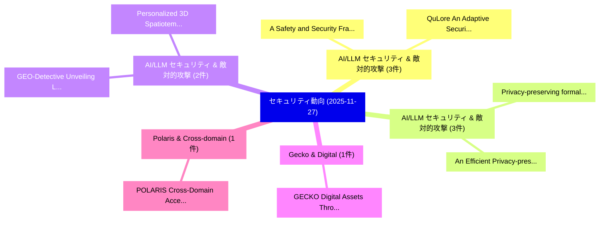

# 📅 02_daily: 日次エグゼクティブサマリー報告書 (2025-11-27)

**集計日時**: 2026-10-02 23:05:49 UTC  
**対象日付**: 2025-11-27  
**本日収集論文数**: 26 件  

---

## 💡 主要セキュリティ動向・脅威インサイト (Executive Insights)

本日の収集論文（計 26 件）において、以下の重点セキュリティ領域で活発な研究動向が確認されました：
- **AI/LLM セキュリティ & 敵対的攻撃** (3 件): 注目論文として 「A Safety and Security Framewor...」、「QuLore: An Adaptive Security F...」 等が発表され、実務防御および攻撃検証の進展が見られます。
- **AI/LLM セキュリティ & 敵対的攻撃** (3 件): 注目論文として 「Privacy-preserving formal conc...」、「An Efficient Privacy-preservin...」 等が発表され、実務防御および攻撃検証の進展が見られます。
- **AI/LLM セキュリティ & 敵対的攻撃** (2 件): 注目論文として 「Personalized 3D Spatiotemporal...」、「GEO-Detective: Unveiling Locat...」 等が発表され、実務防御および攻撃検証の進展が見られます。
- **Gecko & Digital** (1 件): 注目論文として 「GECKO: Digital Assets Through(...」 等が発表され、実務防御および攻撃検証の進展が見られます。
- **Polaris & Cross-domain** (1 件): 注目論文として 「POLARIS: Cross-Domain Access C...」 等が発表され、実務防御および攻撃検証の進展が見られます。

### 🗺️ 技術・脅威トピックマインドマップ

---

## 📌 日次セキュリティ論文一覧 (日本語表形式)

| No | arXiv ID | 論文タイトル (日本語訳) | 重要キーワード | 構造化エグゼクティブ要約 (背景・提案・影響) | 脅威分類 | 詳細リンク |
|---|---|---|---|---|---|---|
| 1 | `2511.21990v1` | [A Safety and Security Framework for Real-World Agentic Systems（セキュリティ分析論文）](../../okf/papers/2025-11-27/2511.21990.md) | `World Agentic Systems`, `Real-World Agentic`, `Shaona Ghosh` | 【提案】概要 (Overview & Key Finding) 本論文「A Safety and Security Framework for Real-World Agentic ...。実証評価により経営層・セキュリティ管理者向け推奨アクション (E... | `cs.AI` | [arXiv](https://arxiv.org/abs/2511.21990v1) &#124; [OKF](../../okf/papers/2025-11-27/2511.21990.md) |
| 2 | `2511.21999v1` | [GECKO: Digital Assets Through(out) the Physical World (Extended Technical Report)のセキュリティ強化](../../okf/papers/2025-11-27/2511.21999.md) | `Extended Technical Report`, `Physical World`, `Nico Hauser` | 【提案】概要 (Overview & Key Finding) 本論文「GECKO: Digital Assets Through(out) the Physical World (...。実証評価により経営層・セキュリティ管理者向け推奨アクション (E... | `cybersecurity` | [arXiv](https://arxiv.org/abs/2511.21999v1) &#124; [OKF](../../okf/papers/2025-11-27/2511.21999.md) |
| 3 | `2511.22017v1` | [POLARIS: Cross-Domain Access Control via Verifiable Identity and Policy-Based Authorization（セキュリティ分析論文）](../../okf/papers/2025-11-27/2511.22017.md) | `Domain Access Control`, `Verifiable Identity`, `Based Authorization` | 【提案】概要 (Overview & Key Finding) 本論文「POLARIS: Cross-Domain アクセス制御 via Verifiable Identity an...。実証評価により経営層・セキュリティ管理者向け推奨アクション (E... | `cybersecurity` | [arXiv](https://arxiv.org/abs/2511.22017v1) &#124; [OKF](../../okf/papers/2025-11-27/2511.22017.md) |
| 4 | `2511.22044v1` | [Distillability of LLM Security Logic: Predicting Attack Success Rate of Outline Filling Attack via Ranking Regression（セキュリティ分析論文）](../../okf/papers/2025-11-27/2511.22044.md) | `Predicting Attack Success Rate`, `Outline Filling Attack`, `Security Logic` | 【提案】概要 (Overview & Key Finding) 本論文「Distillability of LLM Security Logic: Predicting Attack...。実証評価により経営層・セキュリティ管理者向け推奨アクション (E... | `cs.AI` | [arXiv](https://arxiv.org/abs/2511.22044v1) &#124; [OKF](../../okf/papers/2025-11-27/2511.22044.md) |
| 5 | `2511.22047v1` | [Evaluating the Robustness of Large Language Model Safety Guardrails Against Adversarial Attacks（セキュリティ分析論文）](../../okf/papers/2025-11-27/2511.22047.md) | `Raw Meta`, `Executive Summary`, `Key Finding` | 【提案】概要 (Overview & Key Finding) 本論文「Evaluating the Robustness of Large Language Model Safet...。実証評価により経営層・セキュリティ管理者向け推奨アクション (E... | `cybersecurity` | [arXiv](https://arxiv.org/abs/2511.22047v1) &#124; [OKF](../../okf/papers/2025-11-27/2511.22047.md) |
| 6 | `2511.22095v1` | [Binary-30K: A Heterogeneous Dataset for Deep Learning in Binary Analysis and マルウェア検出](../../okf/papers/2025-11-27/2511.22095.md) | `Heterogeneous Dataset`, `Deep Learning`, `Malware Detection` | 【提案】概要 (Overview & Key Finding) 本論文「Binary-30K: A Heterogeneous Dataset for Deep Learning i...。実証評価により経営層・セキュリティ管理者向け推奨アクション (E... | `cs.AI` | [arXiv](https://arxiv.org/abs/2511.22095v1) &#124; [OKF](../../okf/papers/2025-11-27/2511.22095.md) |
| 7 | `2511.22117v1` | [Privacy-preserving formal concept analysis: A homomorphic encryption-based concept construction（セキュリティ分析論文）](../../okf/papers/2025-11-27/2511.22117.md) | `Privacy-preserving formal`, `encryption-based concept`, `Qiangqiang Chen` | 【提案】概要 (Overview & Key Finding) 本論文「Privacy-preserving formal concept analysis: A 準同型暗号-bas...。実証評価により経営層・セキュリティ管理者向け推奨アクション (E... | `executive-summary` | [arXiv](https://arxiv.org/abs/2511.22117v1) &#124; [OKF](../../okf/papers/2025-11-27/2511.22117.md) |
| 8 | `2511.22147v1` | [RemedyGS: Defend 3D Gaussian Splatting against Computation Cost Attacks（セキュリティ分析論文）](../../okf/papers/2025-11-27/2511.22147.md) | `Computation Cost Attacks`, `Gaussian Splatting`, `Yanping Li` | 【提案】概要 (Overview & Key Finding) 本論文「RemedyGS: Defend 3D Gaussian Splatting against Computat...。実証評価により経営層・セキュリティ管理者向け推奨アクション (E... | `cs.AI` | [arXiv](https://arxiv.org/abs/2511.22147v1) &#124; [OKF](../../okf/papers/2025-11-27/2511.22147.md) |
| 9 | `2511.22180v2` | [Personalized 3D Spatiotemporal Trajectory Privacy Protection with Differential and Distortion Geo-Perturbation（セキュリティ分析論文）](../../okf/papers/2025-11-27/2511.22180.md) | `Spatiotemporal Trajectory Privacy Protection`, `Distortion Geo`, `Minghui Min` | 【提案】概要 (Overview & Key Finding) 本論文「Personalized 3D Spatiotemporal Trajectory Privacy Prote...。実証評価により経営層・セキュリティ管理者向け推奨アクション (E... | `cybersecurity` | [arXiv](https://arxiv.org/abs/2511.22180v2) &#124; [OKF](../../okf/papers/2025-11-27/2511.22180.md) |
| 10 | `2511.22189v1` | [Department-Specific Security Awareness Campaigns: A Cross-Organizational Study of HR and Accounting（セキュリティ分析論文）](../../okf/papers/2025-11-27/2511.22189.md) | `Specific Security Awareness Campaigns`, `Department-Specific Security`, `Matthias Pfister` | 【提案】概要 (Overview & Key Finding) 本論文「Department-Specific Security Awareness Campaigns: A Cro...。実証評価により経営層・セキュリティ管理者向け推奨アクション (E... | `cybersecurity` | [arXiv](https://arxiv.org/abs/2511.22189v1) &#124; [OKF](../../okf/papers/2025-11-27/2511.22189.md) |
| 11 | `2511.22215v1` | [Real-PGDN: A Two-level Classification Method for Full-Process Recognition of Newly Registered Pornographic and Gambling Domain Names（セキュリティ分析論文）](../../okf/papers/2025-11-27/2511.22215.md) | `Newly Registered Pornographic`, `Gambling Domain Names`, `Process Recognition` | 【提案】概要 (Overview & Key Finding) 本論文「Real-PGDN: A Two-level Classification Method for Full-P...。実証評価により経営層・セキュリティ管理者向け推奨アクション (E... | `executive-summary` | [arXiv](https://arxiv.org/abs/2511.22215v1) &#124; [OKF](../../okf/papers/2025-11-27/2511.22215.md) |
| 12 | `2511.22259v2` | [Silence Speaks Volumes: A New Paradigm for Covert Communication via History Timing Patterns（セキュリティ分析論文）](../../okf/papers/2025-11-27/2511.22259.md) | `Silence Speaks Volumes`, `History Timing Patterns`, `New Paradigm` | 【提案】概要 (Overview & Key Finding) 本論文「Silence Speaks Volumes: A New Paradigm for Covert Commu...。実証評価により経営層・セキュリティ管理者向け推奨アクション (E... | `cs.NI` | [arXiv](https://arxiv.org/abs/2511.22259v2) &#124; [OKF](../../okf/papers/2025-11-27/2511.22259.md) |
| 13 | `2511.22317v1` | [Enhancing the Security of Rollup Sequencers using Decentrally Attested TEEs（セキュリティ分析論文）](../../okf/papers/2025-11-27/2511.22317.md) | `Rollup Sequencers`, `Decentrally Attested`, `Giovanni Maria Cristiano` | 【提案】概要 (Overview & Key Finding) 本論文「Enhancing the Security of Rollup Sequencers using Decen...。実証評価により経営層・セキュリティ管理者向け推奨アクション (E... | `cybersecurity` | [arXiv](https://arxiv.org/abs/2511.22317v1) &#124; [OKF](../../okf/papers/2025-11-27/2511.22317.md) |
| 14 | `2511.22340v1` | [Keyless Entry: Breaking and Entering eMMC RPMB with EMFI（セキュリティ分析論文）](../../okf/papers/2025-11-27/2511.22340.md) | `Keyless Entry`, `Aya Fukami`, `Richard Buurke` | 【提案】概要 (Overview & Key Finding) 本論文「Keyless Entry: Breaking and Entering eMMC RPMB with EMF...。実証評価により経営層・セキュリティ管理者向け推奨アクション (E... | `cybersecurity` | [arXiv](https://arxiv.org/abs/2511.22340v1) &#124; [OKF](../../okf/papers/2025-11-27/2511.22340.md) |
| 15 | `2511.22359v1` | [UniBOM -- A Unified SBOM Analysis and Visualisation Tool for IoT Systems and Beyond（セキュリティ分析論文）](../../okf/papers/2025-11-27/2511.22359.md) | `Visualisation Tool`, `Vadim Safronov`, `Ionut Bostan` | 【提案】概要 (Overview & Key Finding) 本論文「UniBOM -- A Unified SBOM Analysis and Visualisation Too...。実証評価により経営層・セキュリティ管理者向け推奨アクション (E... | `executive-summary` | [arXiv](https://arxiv.org/abs/2511.22359v1) &#124; [OKF](../../okf/papers/2025-11-27/2511.22359.md) |
| 16 | `2511.22415v1` | [Exposing Vulnerabilities in RL: A Novel Stealthy Backdoor Attack through Reward Poisoning（セキュリティ分析論文）](../../okf/papers/2025-11-27/2511.22415.md) | `Exposing Vulnerabilities`, `Reward Poisoning`, `Bokang Zhang` | 【提案】概要 (Overview & Key Finding) 本論文「Exposing Vulnerabilities in RL: A Novel Stealthy Backdo...。実証評価により経営層・セキュリティ管理者向け推奨アクション (E... | `cybersecurity` | [arXiv](https://arxiv.org/abs/2511.22415v1) &#124; [OKF](../../okf/papers/2025-11-27/2511.22415.md) |
| 17 | `2511.22416v2` | [QuLore: An Adaptive Security Framework to Extend Quantum-Safe Communications to Real-World Networks（セキュリティ分析論文）](../../okf/papers/2025-11-27/2511.22416.md) | `Extend Quantum`, `Safe Communications`, `World Networks` | 【提案】概要 (Overview & Key Finding) 本論文「QuLore: An Adaptive Security Framework to Extend 量子-Saf...。実証評価により経営層・セキュリティ管理者向け推奨アクション (E... | `cybersecurity` | [arXiv](https://arxiv.org/abs/2511.22416v2) &#124; [OKF](../../okf/papers/2025-11-27/2511.22416.md) |
| 18 | `2511.22434v1` | [FastFHE: Packing-Scalable and Depthwise-Separable CNN Inference Over FHE（セキュリティ分析論文）](../../okf/papers/2025-11-27/2511.22434.md) | `Depthwise-Separable CNN`, `Wenbo Song`, `Xinxin Fan` | 【提案】概要 (Overview & Key Finding) 本論文「FastFHE: Packing-Scalable and Depthwise-Separable CNN I...。実証評価により経営層・セキュリティ管理者向け推奨アクション (E... | `cs.AI` | [arXiv](https://arxiv.org/abs/2511.22434v1) &#124; [OKF](../../okf/papers/2025-11-27/2511.22434.md) |
| 19 | `2511.22441v1` | [GEO-Detective: Unveiling Location Privacy Risks in Images with LLMエージェント](../../okf/papers/2025-11-27/2511.22441.md) | `Unveiling Location Privacy Risks`, `Xinyu Zhang`, `Yixin Wu` | 【提案】概要 (Overview & Key Finding) 本論文「GEO-Detective: Unveiling Location Privacy Risks in Imag...。実証評価により経営層・セキュリティ管理者向け推奨アクション (E... | `cs.AI` | [arXiv](https://arxiv.org/abs/2511.22441v1) &#124; [OKF](../../okf/papers/2025-11-27/2511.22441.md) |
| 20 | `2511.22681v2` | [CacheTrap: Unveiling a Stealthier Gray-Box Trojan against LLMs（セキュリティ分析論文）](../../okf/papers/2025-11-27/2511.22681.md) | `Stealthier Gray`, `Box Trojan`, `Gray-Box Trojan` | 【提案】概要 (Overview & Key Finding) 本論文「CacheTrap: Unveiling a Stealthier Gray-Box Trojan again...。実証評価によりAlmalky, Gamana Aragon。 | `cybersecurity` | [arXiv](https://arxiv.org/abs/2511.22681v2) &#124; [OKF](../../okf/papers/2025-11-27/2511.22681.md) |
| 21 | `2511.22700v2` | [Invisible Hands: Gray-Box Bit Flip Attack for Steering LLMs Without Knowledge of Gradients, Data, and Weights（セキュリティ分析論文）](../../okf/papers/2025-11-27/2511.22700.md) | `Box Bit Flip Attack`, `Invisible Hands`, `Without Knowledge` | 【提案】背景とセキュリティ上の課題 (Background & Problem) 本研究はサイバー脅威環境におけるセキュリティ構造・脆弱性の検証を目的としています。(主要検出項目: ...。実証評価により経営層・セキュリティ管理者向け推奨アクション (E... | `cybersecurity` | [arXiv](https://arxiv.org/abs/2511.22700v2) &#124; [OKF](../../okf/papers/2025-11-27/2511.22700.md) |
| 22 | `2511.22788v1` | [PRISM: Privacy-Aware Routing for Adaptive Cloud-Edge LLM Inference via Semantic Sketch Collaboration（セキュリティ分析論文）](../../okf/papers/2025-11-27/2511.22788.md) | `Semantic Sketch Collaboration`, `Aware Routing`, `Adaptive Cloud` | 【提案】概要 (Overview & Key Finding) 本論文「PRISM: Privacy-Aware Routing for Adaptive Cloud-Edge LL...。実証評価により経営層・セキュリティ管理者向け推奨アクション (E... | `executive-summary` | [arXiv](https://arxiv.org/abs/2511.22788v1) &#124; [OKF](../../okf/papers/2025-11-27/2511.22788.md) |
| 23 | `2511.22791v1` | [An Efficient Privacy-preserving Intrusion Detection Scheme for UAV Swarm Networks（セキュリティ分析論文）](../../okf/papers/2025-11-27/2511.22791.md) | `Intrusion Detection Scheme`, `Swarm Networks`, `Privacy-preserving Intrusion` | 【提案】概要 (Overview & Key Finding) 本論文「An Efficient Privacy-preserving Intrusion Detection Sch...。実証評価により経営層・セキュリティ管理者向け推奨アクション (E... | `executive-summary` | [arXiv](https://arxiv.org/abs/2511.22791v1) &#124; [OKF](../../okf/papers/2025-11-27/2511.22791.md) |
| 24 | `2512.00098v1` | [Guarding Against Malicious Biased Threats (GAMBiT): Experimental Design of Cognitive Sensors and Triggers with Behavioral Impact Analysis（セキュリティ分析論文）](../../okf/papers/2025-11-27/2512.00098.md) | `Cognitive Sensors`, `Brandon Beltz`, `Yu Chen` | 【提案】概要 (Overview & Key Finding) 本論文「Guarding Against Malicious Biased Threats (GAMBiT): Exp...。実証評価により経営層・セキュリティ管理者向け推奨アクション (E... | `executive-summary` | [arXiv](https://arxiv.org/abs/2512.00098v1) &#124; [OKF](../../okf/papers/2025-11-27/2512.00098.md) |
| 25 | `2512.00110v2` | [Post-Quantum-Resilient Audit Evidence for Long-Lived Regulated Systems: Security Models, Migration Patterns, and Case Study（セキュリティ分析論文）](../../okf/papers/2025-11-27/2512.00110.md) | `Resilient Audit Evidence`, `Lived Regulated Systems`, `Security Models` | 【提案】概要 (Overview & Key Finding) 本論文「Post-量子-Resilient Audit Evidence for Long-Lived Regulat...。実証評価により経営層・セキュリティ管理者向け推奨アクション (E... | `executive-summary` | [arXiv](https://arxiv.org/abs/2512.00110v2) &#124; [OKF](../../okf/papers/2025-11-27/2512.00110.md) |
| 26 | `2512.00119v1` | [NetDeTox: Adversarial and Efficient Evasion of Hardware-Security GNNs via RL-LLM Orchestration（セキュリティ分析論文）](../../okf/papers/2025-11-27/2512.00119.md) | `Efficient Evasion`, `Hardware-Security GNNs`, `RL-LLM Orchestration` | 【提案】概要 (Overview & Key Finding) 本論文「NetDeTox: Adversarial and Efficient Evasion of Hardware...。実証評価により経営層・セキュリティ管理者向け推奨アクション (E... | `cs.AI` | [arXiv](https://arxiv.org/abs/2512.00119v1) &#124; [OKF](../../okf/papers/2025-11-27/2512.00119.md) |

