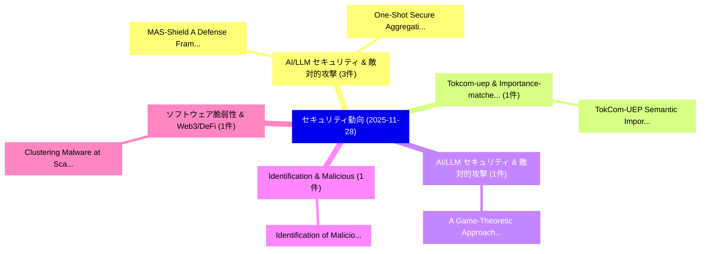

# 📅 02_daily: 日次エグゼクティブサマリー報告書 (2025-11-28)

**集計日時**: 2026-10-02 23:05:49 UTC  
**対象日付**: 2025-11-28  
**本日収集論文数**: 18 件  

---

## 💡 主要セキュリティ動向・脅威インサイト (Executive Insights)

本日の収集論文（計 18 件）において、以下の重点セキュリティ領域で活発な研究動向が確認されました：
- **AI/LLM セキュリティ & 敵対的攻撃** (3 件): 注目論文として 「MAS-Shield: A Defense Framewor...」、「One-Shot Secure Aggregation: A...」 等が発表され、実務防御および攻撃検証の進展が見られます。
- **Tokcom-uep & Importance-matched** (1 件): 注目論文として 「TokCom-UEP: Semantic Importanc...」 等が発表され、実務防御および攻撃検証の進展が見られます。
- **AI/LLM セキュリティ & 敵対的攻撃** (1 件): 注目論文として 「A Game-Theoretic Approach for ...」 等が発表され、実務防御および攻撃検証の進展が見られます。
- **Identification & Malicious** (1 件): 注目論文として 「Identification of Malicious Po...」 等が発表され、実務防御および攻撃検証の進展が見られます。
- **ソフトウェア脆弱性 & Web3/DeFi** (1 件): 注目論文として 「Clustering Malware at Scale: A...」 等が発表され、実務防御および攻撃検証の進展が見られます。

### 🗺️ 技術・脅威トピックマインドマップ

---

## 📌 日次セキュリティ論文一覧 (日本語表形式)

| No | arXiv ID | 論文タイトル (日本語訳) | 重要キーワード | 構造化エグゼクティブ要約 (背景・提案・影響) | 脅威分類 | 詳細リンク |
|---|---|---|---|---|---|---|
| 1 | `2511.22859v1` | [TokCom-UEP: Semantic Importance-Matched Unequal Error Protection for Resilient Image Transmission（セキュリティ分析論文）](../../okf/papers/2025-11-28/2511.22859.md) | `Matched Unequal Error Protection`, `Resilient Image Transmission`, `Semantic Importance` | 【提案】概要 (Overview & Key Finding) 本論文「TokCom-UEP: Semantic Importance-Matched Unequal Error P...。実証評価により経営層・セキュリティ管理者向け推奨アクション (E... | `executive-summary` | [arXiv](https://arxiv.org/abs/2511.22859v1) &#124; [OKF](../../okf/papers/2025-11-28/2511.22859.md) |
| 2 | `2511.22924v2` | [MAS-Shield: A Defense Framework for Secure and Efficient LLM MAS（セキュリティ分析論文）](../../okf/papers/2025-11-28/2511.22924.md) | `Kaixiang Wang`, `Zhaojiacheng Zhou`, `Bunyod Suvonov` | 【提案】概要 (Overview & Key Finding) 本論文「MAS-Shield: A Defense Framework for Secure and Efficien...。実証評価により経営層・セキュリティ管理者向け推奨アクション (E... | `cs.AI` | [arXiv](https://arxiv.org/abs/2511.22924v2) &#124; [OKF](../../okf/papers/2025-11-28/2511.22924.md) |
| 3 | `2511.23026v1` | [A Game-Theoretic Approach for Adversarial Information Fusion in Distributed Sensor Networks（セキュリティ分析論文）](../../okf/papers/2025-11-28/2511.23026.md) | `Adversarial Information Fusion`, `Distributed Sensor Networks`, `Kassem Kallas` | 【提案】概要 (Overview & Key Finding) 本論文「A Game-Theoretic Approach for Adversarial Information F...。実証評価により経営層・セキュリティ管理者向け推奨アクション (E... | `executive-summary` | [arXiv](https://arxiv.org/abs/2511.23026v1) &#124; [OKF](../../okf/papers/2025-11-28/2511.23026.md) |
| 4 | `2511.23183v1` | [Identification of Malicious Posts on the Dark Web Using Supervised Machine Learning（セキュリティ分析論文）](../../okf/papers/2025-11-28/2511.23183.md) | `Dark Web Using Supervised Machine Learning`, `Malicious Posts`, `Gustavo Di Giovanni Bernardo` | 【提案】概要 (Overview & Key Finding) 本論文「Identification of Malicious Posts on the Dark Web Using...。実証評価により経営層・セキュリティ管理者向け推奨アクション (E... | `cs.AI` | [arXiv](https://arxiv.org/abs/2511.23183v1) &#124; [OKF](../../okf/papers/2025-11-28/2511.23183.md) |
| 5 | `2511.23198v2` | [Clustering Malware at Scale: A First Full-Benchmark Study（セキュリティ分析論文）](../../okf/papers/2025-11-28/2511.23198.md) | `Clustering Malware`, `First Full`, `Martin Mocko` | 【提案】概要 (Overview & Key Finding) 本論文「Clustering マルウェア at Scale: A First Full-Benchmark Study...。実証評価により経営層・セキュリティ管理者向け推奨アクション (E... | `executive-summary` | [arXiv](https://arxiv.org/abs/2511.23198v2) &#124; [OKF](../../okf/papers/2025-11-28/2511.23198.md) |
| 6 | `2511.23200v2` | [From Coordinates to Context: An LLM-Bootstrapped Semantic Encoding Framework for Privacy-Preserving Mobile Sensing Stress Recognition（セキュリティ分析論文）](../../okf/papers/2025-11-28/2511.23200.md) | `Preserving Mobile Sensing Stress Recognition`, `LLM-Bootstrapped Semantic`, `Privacy-Preserving Mobile` | 【提案】概要 (Overview & Key Finding) 本論文「From Coordinates to Context: An LLM-Bootstrapped Semant...。実証評価により経営層・セキュリティ管理者向け推奨アクション (E... | `executive-summary` | [arXiv](https://arxiv.org/abs/2511.23200v2) &#124; [OKF](../../okf/papers/2025-11-28/2511.23200.md) |
| 7 | `2511.23252v1` | [One-Shot Secure Aggregation: A Hybrid Cryptographic Protocol for Private 連合学習 in IoT](../../okf/papers/2025-11-28/2511.23252.md) | `Shot Secure Aggregation`, `Hybrid Cryptographic Protocol`, `One-Shot Secure` | 【提案】概要 (Overview & Key Finding) 本論文「One-Shot Secure Aggregation: A Hybrid Cryptographic Pro...。実証評価により経営層・セキュリティ管理者向け推奨アクション (E... | `cs.AI` | [arXiv](https://arxiv.org/abs/2511.23252v1) &#124; [OKF](../../okf/papers/2025-11-28/2511.23252.md) |
| 8 | `2511.23278v2` | [RetryGuard: Preventing Self-Inflicted and Attack-Driven Retry Storms in Cloud Applications（セキュリティ分析論文）](../../okf/papers/2025-11-28/2511.23278.md) | `Driven Retry Storms`, `Preventing Self`, `Cloud Applications` | 【提案】概要 (Overview & Key Finding) 本論文「RetryGuard: Preventing Self-Inflicted and Attack-Driven...。実証評価により経営層・セキュリティ管理者向け推奨アクション (E... | `Cryptography` | [arXiv](https://arxiv.org/abs/2511.23278v2) &#124; [OKF](../../okf/papers/2025-11-28/2511.23278.md) |
| 9 | `2511.23393v2` | [FedSGT: Exact Federated Unlearning via Sequential Group-based Training（セキュリティ分析論文）](../../okf/papers/2025-11-28/2511.23393.md) | `Exact Federated Unlearning`, `Sequential Group`, `Group-based Training` | 【提案】概要 (Overview & Key Finding) 本論文「FedSGT: Exact Federated Unlearning via Sequential Group...。実証評価により経営層・セキュリティ管理者向け推奨アクション (E... | `cybersecurity` | [arXiv](https://arxiv.org/abs/2511.23393v2) &#124; [OKF](../../okf/papers/2025-11-28/2511.23393.md) |
| 10 | `2511.23406v1` | [Quantum Private Distributed Matrix Multiplication With Degree Tables（セキュリティ分析論文）](../../okf/papers/2025-11-28/2511.23406.md) | `Mohamed Nomeir`, `Alptug Aytekin`, `Lei Hu` | 【提案】概要 (Overview & Key Finding) 本論文「量子 Private Distributed Matrix Multiplication With Degre...。実証評価により経営層・セキュリティ管理者向け推奨アクション (E... | `cs.NI` | [arXiv](https://arxiv.org/abs/2511.23406v1) &#124; [OKF](../../okf/papers/2025-11-28/2511.23406.md) |
| 11 | `2511.23408v1` | [Evaluating LLMs for One-Shot Patching of Real and Artificial Vulnerabilities（セキュリティ分析論文）](../../okf/papers/2025-11-28/2511.23408.md) | `Shot Patching`, `Artificial Vulnerabilities`, `One-Shot Patching` | 【提案】概要 (Overview & Key Finding) 本論文「Evaluating LLMs for One-Shot Patching of Real and Artif...。実証評価により経営層・セキュリティ管理者向け推奨アクション (E... | `cs.AI` | [arXiv](https://arxiv.org/abs/2511.23408v1) &#124; [OKF](../../okf/papers/2025-11-28/2511.23408.md) |
| 12 | `2512.00136v1` | [An Empirical Study on the Security Vulnerabilities of GPTs（セキュリティ分析論文）](../../okf/papers/2025-11-28/2512.00136.md) | `Security Vulnerabilities`, `Tong Wu`, `Weibin Wu` | 【提案】概要 (Overview & Key Finding) 本論文「An Empirical Study on the Security Vulnerabilities of G...。実証評価により経営層・セキュリティ管理者向け推奨アクション (E... | `executive-summary` | [arXiv](https://arxiv.org/abs/2512.00136v1) &#124; [OKF](../../okf/papers/2025-11-28/2512.00136.md) |
| 13 | `2512.00142v1` | [DeFi TrustBoost: Blockchain and AI for Trustworthy Decentralized Financial Decisions（セキュリティ分析論文）](../../okf/papers/2025-11-28/2512.00142.md) | `Trustworthy Decentralized Financial Decisions`, `Trustworthy Decentralized Financial Decisi`, `Swati Sachan` | 【提案】概要 (Overview & Key Finding) 本論文「DeFi TrustBoost: Blockchain and AI for Trustworthy Dece...。実証評価により経営層・セキュリティ管理者向け推奨アクション (E... | `cs.AI` | [arXiv](https://arxiv.org/abs/2512.00142v1) &#124; [OKF](../../okf/papers/2025-11-28/2512.00142.md) |
| 14 | `2512.00218v2` | [Reasoning Under Pressure: How do Training Incentives Influence Chain-of-Thought Monitorability?（セキュリティ分析論文）](../../okf/papers/2025-11-28/2512.00218.md) | `Training Incentives Influence Chain`, `Thought Monitorability`, `Francis Rhys Ward` | 【提案】### (日本語題名: Reasoning Under Pressure: How do Training Incentives Influence Chain-of-Tho...。実証評価により経営層・セキュリティ管理者向け推奨アクション (E... | `cs.AI` | [arXiv](https://arxiv.org/abs/2512.00218v2) &#124; [OKF](../../okf/papers/2025-11-28/2512.00218.md) |
| 15 | `2512.00251v1` | [SD-CGAN: Conditional Sinkhorn Divergence GAN for DDoS Anomaly Detection in IoT Networks（セキュリティ分析論文）](../../okf/papers/2025-11-28/2512.00251.md) | `Conditional Sinkhorn Divergence`, `Anomaly Detection`, `Henry Onyeka` | 【提案】概要 (Overview & Key Finding) 本論文「SD-CGAN: Conditional Sinkhorn Divergence GAN for DDoS A...。実証評価により経営層・セキュリティ管理者向け推奨アクション (E... | `executive-summary` | [arXiv](https://arxiv.org/abs/2512.00251v1) &#124; [OKF](../../okf/papers/2025-11-28/2512.00251.md) |
| 16 | `2512.03079v1` | [Watermarks for Embeddings-as-a-Service 大規模言語モデル](../../okf/papers/2025-11-28/2512.03079.md) | `Service Large Language Models`, `a-Service Large`, `Anudeex Shetty` | 【提案】概要 (Overview & Key Finding) 本論文「Watermarks for Embeddings-as-a-Service 大規模言語モデル」（原題: Wa...。実証評価により経営層・セキュリティ管理者向け推奨アクション (E... | `executive-summary` | [arXiv](https://arxiv.org/abs/2512.03079v1) &#124; [OKF](../../okf/papers/2025-11-28/2512.03079.md) |
| 17 | `2512.04106v1` | [Retrieval-Augmented Few-Shot Prompting Versus Fine-Tuning for Code 脆弱性検出](../../okf/papers/2025-11-28/2512.04106.md) | `Shot Prompting Versus Fine`, `Code Vulnerability Detection`, `Fouad Trad` | 【提案】概要 (Overview & Key Finding) 本論文「Retrieval-Augmented Few-Shot Prompting Versus Fine-Tuni...。実証評価により経営層・セキュリティ管理者向け推奨アクション (E... | `cs.AI` | [arXiv](https://arxiv.org/abs/2512.04106v1) &#124; [OKF](../../okf/papers/2025-11-28/2512.04106.md) |
| 18 | `2512.09934v1` | [IoTEdu: Access Control, Detection, and Automatic Incident Response in Academic IoT Networks（セキュリティ分析論文）](../../okf/papers/2025-11-28/2512.09934.md) | `Automatic Incident Response`, `Access Control`, `Joner Assolin` | 【提案】概要 (Overview & Key Finding) 本論文「IoTEdu: アクセス制御, Detection, and Automatic Incident Respo...。実証評価により経営層・セキュリティ管理者向け推奨アクション (E... | `cs.NI` | [arXiv](https://arxiv.org/abs/2512.09934v1) &#124; [OKF](../../okf/papers/2025-11-28/2512.09934.md) |

