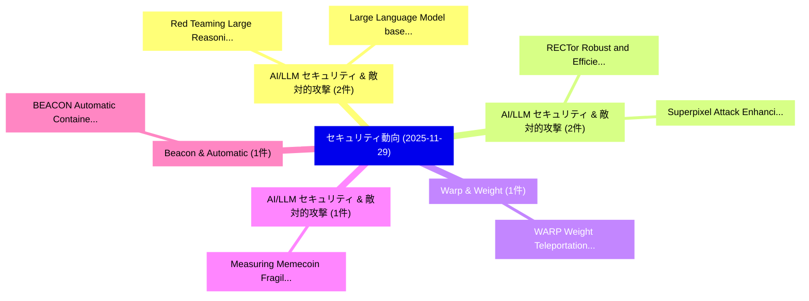

# 📅 02_daily: 日次エグゼクティブサマリー報告書 (2025-11-29)

**集計日時**: 2026-10-02 23:05:49 UTC  
**対象日付**: 2025-11-29  
**本日収集論文数**: 16 件  

---

## 💡 主要セキュリティ動向・脅威インサイト (Executive Insights)

本日の収集論文（計 16 件）において、以下の重点セキュリティ領域で活発な研究動向が確認されました：
- **AI/LLM セキュリティ & 敵対的攻撃** (2 件): 注目論文として 「Red Teaming Large Reasoning Mo...」、「Large Language Model based Sma...」 等が発表され、実務防御および攻撃検証の進展が見られます。
- **AI/LLM セキュリティ & 敵対的攻撃** (2 件): 注目論文として 「RECTor: Robust and Efficient C...」、「Superpixel Attack: Enhancing B...」 等が発表され、実務防御および攻撃検証の進展が見られます。
- **Warp & Weight** (1 件): 注目論文として 「WARP: Weight Teleportation for...」 等が発表され、実務防御および攻撃検証の進展が見られます。
- **AI/LLM セキュリティ & 敵対的攻撃** (1 件): 注目論文として 「Measuring Memecoin Fragility（セ...」 等が発表され、実務防御および攻撃検証の進展が見られます。
- **Beacon & Automatic** (1 件): 注目論文として 「BEACON: Automatic Container Po...」 等が発表され、実務防御および攻撃検証の進展が見られます。

### 🗺️ 技術・脅威トピックマインドマップ

---

## 📌 日次セキュリティ論文一覧 (日本語表形式)

| No | arXiv ID | 論文タイトル (日本語訳) | 重要キーワード | 構造化エグゼクティブ要約 (背景・提案・影響) | 脅威分類 | 詳細リンク |
|---|---|---|---|---|---|---|
| 1 | `2512.00272v2` | [WARP: Weight Teleportation for Attack-Resilient Unlearning Protocols（セキュリティ分析論文）](../../okf/papers/2025-11-29/2512.00272.md) | `Resilient Unlearning Protocols`, `Weight Teleportation`, `Attack-Resilient Unlearning` | 【提案】概要 (Overview & Key Finding) 本論文「WARP: Weight Teleportation for Attack-Resilient Unlearn...。実証評価により経営層・セキュリティ管理者向け推奨アクション (E... | `cs.AI` | [arXiv](https://arxiv.org/abs/2512.00272v2) &#124; [OKF](../../okf/papers/2025-11-29/2512.00272.md) |
| 2 | `2512.00377v2` | [Measuring Memecoin Fragility（セキュリティ分析論文）](../../okf/papers/2025-11-29/2512.00377.md) | `Measuring Memecoin Fragility`, `Tsz Hon Yuen`, `Yuexin Xiang` | 【提案】概要 (Overview & Key Finding) 本論文「Measuring Memecoin Fragility（セキュリティ分析論文）」（原題: Measuring...。実証評価により経営層・セキュリティ管理者向け推奨アクション (E... | `executive-summary` | [arXiv](https://arxiv.org/abs/2512.00377v2) &#124; [OKF](../../okf/papers/2025-11-29/2512.00377.md) |
| 3 | `2512.00412v4` | [Red Teaming Large Reasoning Models（セキュリティ分析論文）](../../okf/papers/2025-11-29/2512.00412.md) | `Red Teaming Large Reasoning Models`, `Jiawei Chen`, `Yang Yang` | 【提案】概要 (Overview & Key Finding) 本論文「Red Teaming Large Reasoning Models（セキュリティ分析論文）」（原題: Red...。実証評価により経営層・セキュリティ管理者向け推奨アクション (E... | `cs.AI` | [arXiv](https://arxiv.org/abs/2512.00412v4) &#124; [OKF](../../okf/papers/2025-11-29/2512.00412.md) |
| 4 | `2512.00414v1` | [BEACON: Automatic Container Policy Generation using Environment-aware Dynamic Analysis（セキュリティ分析論文）](../../okf/papers/2025-11-29/2512.00414.md) | `Automatic Container Policy Generation`, `Environment-aware Dynamic`, `Automatic Container Pol` | 【提案】概要 (Overview & Key Finding) 本論文「BEACON: Automatic Container Policy Generation using Env...。実証評価により経営層・セキュリティ管理者向け推奨アクション (E... | `cybersecurity` | [arXiv](https://arxiv.org/abs/2512.00414v1) &#124; [OKF](../../okf/papers/2025-11-29/2512.00414.md) |
| 5 | `2512.00434v1` | [Privacy-Preserving Generative Modeling and Clinical Validation of Longitudinal Health Records for Chronic Disease（セキュリティ分析論文）](../../okf/papers/2025-11-29/2512.00434.md) | `Preserving Generative Modeling`, `Longitudinal Health Records`, `Clinical Validation` | 【提案】概要 (Overview & Key Finding) 本論文「Privacy-Preserving Generative Modeling and Clinical Val...。実証評価により経営層・セキュリティ管理者向け推奨アクション (E... | `executive-summary` | [arXiv](https://arxiv.org/abs/2512.00434v1) &#124; [OKF](../../okf/papers/2025-11-29/2512.00434.md) |
| 6 | `2512.00436v1` | [RECTor: Robust and Efficient Correlation Attack on Tor（セキュリティ分析論文）](../../okf/papers/2025-11-29/2512.00436.md) | `Efficient Correlation Attack`, `Dinil Mon Divakaran`, `Binghui Wu` | 【提案】概要 (Overview & Key Finding) 本論文「RECTor: Robust and Efficient Correlation Attack on Tor（...。実証評価により経営層・セキュリティ管理者向け推奨アクション (E... | `cs.NI` | [arXiv](https://arxiv.org/abs/2512.00436v1) &#124; [OKF](../../okf/papers/2025-11-29/2512.00436.md) |
| 7 | `2512.00480v1` | [A Unified Framework for Constructing Information-Theoretic Private Information Retrieval（セキュリティ分析論文）](../../okf/papers/2025-11-29/2512.00480.md) | `Theoretic Private Information Retrieval`, `Constructing Information`, `Information-Theoretic Private` | 【提案】概要 (Overview & Key Finding) 本論文「A Unified Framework for Constructing Information-Theore...。実証評価により経営層・セキュリティ管理者向け推奨アクション (E... | `executive-summary` | [arXiv](https://arxiv.org/abs/2512.00480v1) &#124; [OKF](../../okf/papers/2025-11-29/2512.00480.md) |
| 8 | `2512.00591v1` | [TrojanLoC: LLM-based Framework for RTL Trojan Localization（セキュリティ分析論文）](../../okf/papers/2025-11-29/2512.00591.md) | `Trojan Localization`, `Raghu Vamshi Hemadri`, `Weihua Xiao` | 【提案】概要 (Overview & Key Finding) 本論文「TrojanLoC: LLM-based Framework for RTL Trojan Localizat...。実証評価により経営層・セキュリティ管理者向け推奨アクション (E... | `cybersecurity` | [arXiv](https://arxiv.org/abs/2512.00591v1) &#124; [OKF](../../okf/papers/2025-11-29/2512.00591.md) |
| 9 | `2512.00595v1` | [IslandRun: Privacy-Aware Multi-Objective Orchestration for Distributed AI Inference（セキュリティ分析論文）](../../okf/papers/2025-11-29/2512.00595.md) | `Aware Multi`, `Objective Orchestration`, `Privacy-Aware Multi` | 【提案】概要 (Overview & Key Finding) 本論文「IslandRun: Privacy-Aware Multi-Objective Orchestration ...。実証評価により経営層・セキュリティ管理者向け推奨アクション (E... | `cs.AI` | [arXiv](https://arxiv.org/abs/2512.00595v1) &#124; [OKF](../../okf/papers/2025-11-29/2512.00595.md) |
| 10 | `2512.00635v1` | [Extended Abstract: Synthesizable Low-overhead Circuit-level Countermeasures and Pro-Active Detection Techniques for Power and EM SCA（セキュリティ分析論文）](../../okf/papers/2025-11-29/2512.00635.md) | `Active Detection Techniques`, `Extended Abstract`, `Synthesizable Low` | 【提案】概要 (Overview & Key Finding) 本論文「Extended Abstract: Synthesizable Low-overhead Circuit-l...。実証評価により経営層・セキュリティ管理者向け推奨アクション (E... | `cybersecurity` | [arXiv](https://arxiv.org/abs/2512.00635v1) &#124; [OKF](../../okf/papers/2025-11-29/2512.00635.md) |
| 11 | `2512.00645v1` | [Blockchain-based vs. SQL Database Systems for Digital Twin Evidence Management: A Comparative Forensic Analysis（セキュリティ分析論文）](../../okf/papers/2025-11-29/2512.00645.md) | `Digital Twin Evidence Management`, `Database Systems`, `Blockchain-based vs` | 【提案】概要 (Overview & Key Finding) 本論文「Blockchain-based vs. SQL Database Systems for Digital T...。実証評価により経営層・セキュリティ管理者向け推奨アクション (E... | `cs.DB` | [arXiv](https://arxiv.org/abs/2512.00645v1) &#124; [OKF](../../okf/papers/2025-11-29/2512.00645.md) |
| 12 | `2512.02062v1` | [Superpixel Attack: Enhancing Black-box Adversarial Attack with Image-driven Division Areas（セキュリティ分析論文）](../../okf/papers/2025-11-29/2512.02062.md) | `Superpixel Attack`, `Enhancing Black`, `Adversarial Attack` | 【提案】概要 (Overview & Key Finding) 本論文「Superpixel Attack: Enhancing Black-box 敵対的攻撃 with Image...。実証評価により経営層・セキュリティ管理者向け推奨アクション (E... | `cs.AI` | [arXiv](https://arxiv.org/abs/2512.02062v1) &#124; [OKF](../../okf/papers/2025-11-29/2512.02062.md) |
| 13 | `2512.02069v1` | [Large Language Model based Smart Contract Auditing with LLMBugScanner（セキュリティ分析論文）](../../okf/papers/2025-11-29/2512.02069.md) | `Large Language Model`, `Smart Contract Auditing`, `Yining Yuan` | 【提案】概要 (Overview & Key Finding) 本論文「Large Language Model based スマートコントラクト Auditing with LLM...。実証評価により経営層・セキュリティ管理者向け推奨アクション (E... | `cs.AI` | [arXiv](https://arxiv.org/abs/2512.02069v1) &#124; [OKF](../../okf/papers/2025-11-29/2512.02069.md) |
| 14 | `2512.03088v2` | [How DeFi Protocols Choose Oracle Providers: Evidence on Sourcing, Dependence, and Switching Costs（セキュリティ分析論文）](../../okf/papers/2025-11-29/2512.03088.md) | `Protocols Choose Oracle Providers`, `Switching Costs`, `Protocols Choose Oracle Provi` | 【提案】概要 (Overview & Key Finding) 本論文「How DeFi Protocols Choose Oracle Providers: Evidence on...。実証評価により経営層・セキュリティ管理者向け推奨アクション (E... | `executive-summary` | [arXiv](https://arxiv.org/abs/2512.03088v2) &#124; [OKF](../../okf/papers/2025-11-29/2512.03088.md) |
| 15 | `2512.03089v1` | [Password-Activated Shutdown Protocols for Misaligned Frontier Agents（セキュリティ分析論文）](../../okf/papers/2025-11-29/2512.03089.md) | `Activated Shutdown Protocols`, `Misaligned Frontier Agents`, `Password-Activated Shutdown` | 【提案】概要 (Overview & Key Finding) 本論文「Password-Activated Shutdown Protocols for Misaligned Fr...。実証評価により経営層・セキュリティ管理者向け推奨アクション (E... | `cs.AI` | [arXiv](https://arxiv.org/abs/2512.03089v1) &#124; [OKF](../../okf/papers/2025-11-29/2512.03089.md) |
| 16 | `2512.22128v1` | [Pruning Graphs by Adversarial Robustness Evaluation to Strengthen GNN Defenses（セキュリティ分析論文）](../../okf/papers/2025-11-29/2512.22128.md) | `Pruning Graphs`, `Yongyu Wang`, `Raw Meta` | 【提案】概要 (Overview & Key Finding) 本論文「Pruning Graphs by Adversarial Robustness Evaluation to ...。実証評価により# Pruning Graphs by Adver... | `executive-summary` | [arXiv](https://arxiv.org/abs/2512.22128v1) &#124; [OKF](../../okf/papers/2025-11-29/2512.22128.md) |

