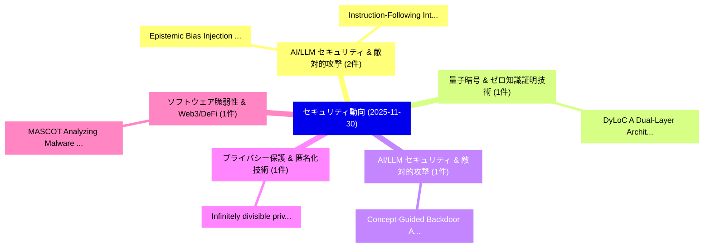

# 📅 02_daily: 日次エグゼクティブサマリー報告書 (2025-11-30)

**集計日時**: 2026-10-02 23:05:49 UTC  
**対象日付**: 2025-11-30  
**本日収集論文数**: 10 件  

---

## 💡 主要セキュリティ動向・脅威インサイト (Executive Insights)

本日の収集論文（計 10 件）において、以下の重点セキュリティ領域で活発な研究動向が確認されました：
- **AI/LLM セキュリティ & 敵対的攻撃** (2 件): 注目論文として 「Epistemic Bias Injection: Mani...」、「Instruction-Following Intent A...」 等が発表され、実務防御および攻撃検証の進展が見られます。
- **量子暗号 & ゼロ知識証明技術** (1 件): 注目論文として 「DyLoC: A Dual-Layer Architectu...」 等が発表され、実務防御および攻撃検証の進展が見られます。
- **AI/LLM セキュリティ & 敵対的攻撃** (1 件): 注目論文として 「Concept-Guided Backdoor Attack...」 等が発表され、実務防御および攻撃検証の進展が見られます。
- **プライバシー保護 & 匿名化技術** (1 件): 注目論文として 「Infinitely divisible privacy a...」 等が発表され、実務防御および攻撃検証の進展が見られます。
- **ソフトウェア脆弱性 & Web3/DeFi** (1 件): 注目論文として 「MASCOT: Analyzing Malware Evol...」 等が発表され、実務防御および攻撃検証の進展が見られます。

### 🗺️ 技術・脅威トピックマインドマップ

---

## 📌 日次セキュリティ論文一覧 (日本語表形式)

| No | arXiv ID | 論文タイトル (日本語訳) | 重要キーワード | 構造化エグゼクティブ要約 (背景・提案・影響) | 脅威分類 | 詳細リンク |
|---|---|---|---|---|---|---|
| 1 | `2512.00699v1` | [DyLoC: A Dual-Layer Architecture for Secure and Trainable Quantum Machine Learning Under Polynomial-DLA constraint（セキュリティ分析論文）](../../okf/papers/2025-11-30/2512.00699.md) | `Layer Architecture`, `Dual-Layer Architecture`, `Polynomial-DLA constraint` | 【提案】概要 (Overview & Key Finding) 本論文「DyLoC: A Dual-Layer Architecture for Secure and Trainab...。実証評価により経営層・セキュリティ管理者向け推奨アクション (E... | `executive-summary` | [arXiv](https://arxiv.org/abs/2512.00699v1) &#124; [OKF](../../okf/papers/2025-11-30/2512.00699.md) |
| 2 | `2512.00713v2` | [Concept-Guided Backdoor Attack on Vision Language Models（セキュリティ分析論文）](../../okf/papers/2025-11-30/2512.00713.md) | `Guided Backdoor Attack`, `Vision Language Models`, `Concept-Guided Backdoor` | 【提案】概要 (Overview & Key Finding) 本論文「Concept-Guided Backdoor Attack on Vision Language Model...。実証評価により経営層・セキュリティ管理者向け推奨アクション (E... | `cs.AI` | [arXiv](https://arxiv.org/abs/2512.00713v2) &#124; [OKF](../../okf/papers/2025-11-30/2512.00713.md) |
| 3 | `2512.00734v1` | [Infinitely divisible privacy and beyond I: resolution of the $s^2=2k$ conjecture（セキュリティ分析論文）](../../okf/papers/2025-11-30/2512.00734.md) | `Aaradhya Pandey`, `Arian Maleki`, `Sanjeev Kulkarni` | 【提案】概要 (Overview & Key Finding) 本論文「Infinitely divisible privacy and beyond I: resolution o...。実証評価により経営層・セキュリティ管理者向け推奨アクション (E... | `math.PR` | [arXiv](https://arxiv.org/abs/2512.00734v1) &#124; [OKF](../../okf/papers/2025-11-30/2512.00734.md) |
| 4 | `2512.00741v1` | [MASCOT: Analyzing Malware Evolution Through A Well-Curated Source Code Dataset（セキュリティ分析論文）](../../okf/papers/2025-11-30/2512.00741.md) | `Curated Source Code Dataset`, `Well-Curated Source`, `Analyzing Malware Evolution Thro` | 【提案】概要 (Overview & Key Finding) 本論文「MASCOT: Analyzing マルウェア Evolution Through A Well-Curate...。実証評価により経営層・セキュリティ管理者向け推奨アクション (E... | `cs.AI` | [arXiv](https://arxiv.org/abs/2512.00741v1) &#124; [OKF](../../okf/papers/2025-11-30/2512.00741.md) |
| 5 | `2512.00804v3` | [Epistemic Bias Injection: Manipulating LLM Opinion via Selective Context Retrieval（セキュリティ分析論文）](../../okf/papers/2025-11-30/2512.00804.md) | `Epistemic Bias Injection`, `Selective Context Retrieval`, `Hao Wu` | 【提案】概要 (Overview & Key Finding) 本論文「Epistemic Bias Injection: Manipulating LLM Opinion via ...。実証評価により経営層・セキュリティ管理者向け推奨アクション (E... | `cs.DB` | [arXiv](https://arxiv.org/abs/2512.00804v3) &#124; [OKF](../../okf/papers/2025-11-30/2512.00804.md) |
| 6 | `2512.00833v2` | [Logic Encryption: This Time for Real（セキュリティ分析論文）](../../okf/papers/2025-11-30/2512.00833.md) | `Logic Encryption`, `Rupesh Raj Karn`, `Lakshmi Likhitha Mankali` | 【提案】概要 (Overview & Key Finding) 本論文「Logic Encryption: This Time for Real（セキュリティ分析論文）」（原題: L...。実証評価により経営層・セキュリティ管理者向け推奨アクション (E... | `executive-summary` | [arXiv](https://arxiv.org/abs/2512.00833v2) &#124; [OKF](../../okf/papers/2025-11-30/2512.00833.md) |
| 7 | `2512.00857v1` | [Hesperus is Phosphorus: Mapping Threat Actor Naming Taxonomies at Scale（セキュリティ分析論文）](../../okf/papers/2025-11-30/2512.00857.md) | `Mapping Threat Actor Naming Taxonomies`, `Gonzalo Roa`, `Manuel Suarez` | 【提案】概要 (Overview & Key Finding) 本論文「Hesperus is Phosphorus: Mapping 脅威 Actor Naming Taxonom...。実証評価により経営層・セキュリティ管理者向け推奨アクション (E... | `cybersecurity` | [arXiv](https://arxiv.org/abs/2512.00857v1) &#124; [OKF](../../okf/papers/2025-11-30/2512.00857.md) |
| 8 | `2512.00966v1` | [Instruction-Following Intent AnalysisによるIndirect Prompt Injectionの軽減](../../okf/papers/2025-11-30/2512.00966.md) | `Instruction-Following Intent`, `Mitigating Indirect Prompt Injection`, `Following Intent` | 【提案】概要 (Overview & Key Finding) 本論文「Instruction-Following Intent AnalysisによるIndirect プロンプトイ...。実証評価により経営層・セキュリティ管理者向け推奨アクション (E... | `executive-summary` | [arXiv](https://arxiv.org/abs/2512.00966v1) &#124; [OKF](../../okf/papers/2025-11-30/2512.00966.md) |
| 9 | `2512.01115v3` | [Sliced Rényi Pufferfish Privacy: Directional Additive Noise Mechanism and Private Learning with Gradient Clipping（セキュリティ分析論文）](../../okf/papers/2025-11-30/2512.01115.md) | `Directional Additive Noise Mechanism`, `Pufferfish Privacy`, `Private Learning` | 【提案】概要 (Overview & Key Finding) 本論文「Sliced Rényi Pufferfish Privacy: Directional Additive N...。実証評価により経営層・セキュリティ管理者向け推奨アクション (E... | `cybersecurity` | [arXiv](https://arxiv.org/abs/2512.01115v3) &#124; [OKF](../../okf/papers/2025-11-30/2512.01115.md) |
| 10 | `2512.03462v1` | [A Hybrid Deep Learning and Anomaly Detection Framework for Real-Time Malicious URL Classification（セキュリティ分析論文）](../../okf/papers/2025-11-30/2512.03462.md) | `Hybrid Deep Learning`, `Time Malicious`, `Real-Time Malicious` | 【提案】概要 (Overview & Key Finding) 本論文「A Hybrid Deep Learning and Anomaly Detection Framework ...。実証評価により経営層・セキュリティ管理者向け推奨アクション (E... | `executive-summary` | [arXiv](https://arxiv.org/abs/2512.03462v1) &#124; [OKF](../../okf/papers/2025-11-30/2512.03462.md) |

