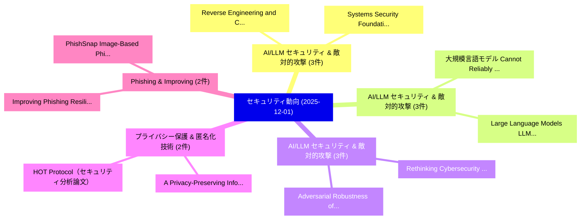

# 📅 02_daily: 日次エグゼクティブサマリー報告書 (2025-12-01)

**集計日時**: 2026-10-02 23:05:49 UTC  
**対象日付**: 2025-12-01  
**本日収集論文数**: 37 件  

---

## 💡 主要セキュリティ動向・脅威インサイト (Executive Insights)

本日の収集論文（計 37 件）において、以下の重点セキュリティ領域で活発な研究動向が確認されました：
- **AI/LLM セキュリティ & 敵対的攻撃** (3 件): 注目論文として 「Reverse Engineering and Contro...」、「Systems Security Foundations f...」 等が発表され、実務防御および攻撃検証の進展が見られます。
- **AI/LLM セキュリティ & 敵対的攻撃** (3 件): 注目論文として 「大規模言語モデル Cannot Reliably Detec...」、「Large Language Models (LLMs) f...」 等が発表され、実務防御および攻撃検証の進展が見られます。
- **AI/LLM セキュリティ & 敵対的攻撃** (3 件): 注目論文として 「Rethinking Cybersecurity Ontol...」、「Adversarial Robustness of Traf...」 等が発表され、実務防御および攻撃検証の進展が見られます。
- **プライバシー保護 & 匿名化技術** (2 件): 注目論文として 「A Privacy-Preserving Informati...」、「HOT Protocol（セキュリティ分析論文）」 等が発表され、実務防御および攻撃検証の進展が見られます。
- **Phishing & Improving** (2 件): 注目論文として 「Improving Phishing Resilience ...」、「PhishSnap: Image-Based Phishin...」 等が発表され、実務防御および攻撃検証の進展が見られます。

### 🗺️ 技術・脅威トピックマインドマップ

---

## 📌 日次セキュリティ論文一覧 (日本語表形式)

| No | arXiv ID | 論文タイトル (日本語訳) | 重要キーワード | 構造化エグゼクティブ要約 (背景・提案・影響) | 脅威分類 | 詳細リンク |
|---|---|---|---|---|---|---|
| 1 | `2512.01164v1` | [Reverse Engineering and Control-Aware Security the ArduPilot UAV Frameworkの分析](../../okf/papers/2025-12-01/2512.01164.md) | `Reverse Engineering`, `Control-Aware Security`, `Aware Security` | 【提案】概要 (Overview & Key Finding) 本論文「Reverse Engineering and Control-Aware Security the Ardu...。実証評価により経営層・セキュリティ管理者向け推奨アクション (E... | `executive-summary` | [arXiv](https://arxiv.org/abs/2512.01164v1) &#124; [OKF](../../okf/papers/2025-12-01/2512.01164.md) |
| 2 | `2512.01185v1` | [DefenSee: Dissecting Threat from Sight and Text -- A Multi-View Defensive Pipeline for Multi-modal Jailbreaks（セキュリティ分析論文）](../../okf/papers/2025-12-01/2512.01185.md) | `View Defensive Pipeline`, `Dissecting Threat`, `Multi-View Defensive` | 【提案】概要 (Overview & Key Finding) 本論文「DefenSee: Dissecting 脅威 from Sight and Text -- A Multi-...。実証評価により経営層・セキュリティ管理者向け推奨アクション (E... | `cybersecurity` | [arXiv](https://arxiv.org/abs/2512.01185v1) &#124; [OKF](../../okf/papers/2025-12-01/2512.01185.md) |
| 3 | `2512.01233v1` | [CTF Archive: Capture, Curate, Learn Forever（セキュリティ分析論文）](../../okf/papers/2025-12-01/2512.01233.md) | `Learn Forever`, `Pratham Gupta`, `Aditya Gabani` | 【提案】概要 (Overview & Key Finding) 本論文「CTF Archive: Capture, Curate, Learn Forever（セキュリティ分析論文）...。実証評価により経営層・セキュリティ管理者向け推奨アクション (E... | `cybersecurity` | [arXiv](https://arxiv.org/abs/2512.01233v1) &#124; [OKF](../../okf/papers/2025-12-01/2512.01233.md) |
| 4 | `2512.01247v1` | [and Understanding Safety Risks in AI Character Platformsのベンチマーク評価](../../okf/papers/2025-12-01/2512.01247.md) | `Understanding Safety Risks`, `Character Platforms`, `Yiluo Wei` | 【提案】概要 (Overview & Key Finding) 本論文「and Understanding Safety Risks in AI Character Platform...。実証評価により経営層・セキュリティ管理者向け推奨アクション (E... | `executive-summary` | [arXiv](https://arxiv.org/abs/2512.01247v1) &#124; [OKF](../../okf/papers/2025-12-01/2512.01247.md) |
| 5 | `2512.01255v1` | [大規模言語モデル Cannot Reliably Detect Vulnerabilities in JavaScript: The First Systematic Benchmark and Evaluation](../../okf/papers/2025-12-01/2512.01255.md) | `Qingyuan Fei`, `Xin Liu`, `Song Li` | 【提案】背景とセキュリティ上の課題 (Background & Problem) 本研究はサイバー脅威環境におけるセキュリティ構造・脆弱性の検証を目的としています。(主要検出項目: ...。実証評価により経営層・セキュリティ管理者向け推奨アクション (E... | `executive-summary` | [arXiv](https://arxiv.org/abs/2512.01255v1) &#124; [OKF](../../okf/papers/2025-12-01/2512.01255.md) |
| 6 | `2512.01295v2` | [Systems Security Foundations for Agentic Computing（セキュリティ分析論文）](../../okf/papers/2025-12-01/2512.01295.md) | `Systems Security Foundations`, `Agentic Computing`, `Mihai Christodorescu` | 【提案】概要 (Overview & Key Finding) 本論文「Systems Security Foundations for Agentic Computing（セキュリ...。実証評価により経営層・セキュリティ管理者向け推奨アクション (E... | `cybersecurity` | [arXiv](https://arxiv.org/abs/2512.01295v2) &#124; [OKF](../../okf/papers/2025-12-01/2512.01295.md) |
| 7 | `2512.01326v1` | [Large Language Models (LLMs) from Prompt Injection Attacksのセキュリティ強化](../../okf/papers/2025-12-01/2512.01326.md) | `Securing Large Language Models`, `Prompt Injection Attacks`, `Large Language Models` | 【提案】概要 (Overview & Key Finding) 本論文「Large Language Models (LLMs) from プロンプトインジェクション Attacks...。実証評価により経営層・セキュリティ管理者向け推奨アクション (E... | `executive-summary` | [arXiv](https://arxiv.org/abs/2512.01326v1) &#124; [OKF](../../okf/papers/2025-12-01/2512.01326.md) |
| 8 | `2512.01335v1` | [EmoRAG: Evaluating RAG Robustness to Symbolic Perturbations（セキュリティ分析論文）](../../okf/papers/2025-12-01/2512.01335.md) | `Symbolic Perturbations`, `Xinyun Zhou`, `Xinfeng Li` | 【提案】概要 (Overview & Key Finding) 本論文「EmoRAG: Evaluating RAG Robustness to Symbolic Perturbat...。実証評価により# EmoRAG: Evaluating RAG ... | `cs.AI` | [arXiv](https://arxiv.org/abs/2512.01335v1) &#124; [OKF](../../okf/papers/2025-12-01/2512.01335.md) |
| 9 | `2512.01353v3` | [The Trojan Knowledge: Bypassing Commercial LLM Guardrails via Harmless Prompt Weaving and Adaptive Tree Search（セキュリティ分析論文）](../../okf/papers/2025-12-01/2512.01353.md) | `Harmless Prompt Weaving`, `Adaptive Tree Search`, `Bypassing Commercial` | 【提案】概要 (Overview & Key Finding) 本論文「The Trojan Knowledge: Bypassing Commercial LLM Guardrai...。実証評価により経営層・セキュリティ管理者向け推奨アクション (E... | `cybersecurity` | [arXiv](https://arxiv.org/abs/2512.01353v3) &#124; [OKF](../../okf/papers/2025-12-01/2512.01353.md) |
| 10 | `2512.01391v1` | [INFERMAL: Inferential maliciously registered domainsの分析](../../okf/papers/2025-12-01/2512.01391.md) | `Yevheniya Nosyk`, `Sourena Maroofi`, `Jan Bayer` | 【提案】概要 (Overview & Key Finding) 本論文「INFERMAL: Inferential maliciously registered domainsの分析...。実証評価により経営層・セキュリティ管理者向け推奨アクション (E... | `cs.NI` | [arXiv](https://arxiv.org/abs/2512.01391v1) &#124; [OKF](../../okf/papers/2025-12-01/2512.01391.md) |
| 11 | `2512.01396v1` | [BackportBench: A Multilingual Benchmark for Automated Backporting of Patches（セキュリティ分析論文）](../../okf/papers/2025-12-01/2512.01396.md) | `Multilingual Benchmark`, `Automated Backporting`, `Zhiqing Zhong` | 【提案】概要 (Overview & Key Finding) 本論文「BackportBench: A Multilingual Benchmark for Automated B...。実証評価により経営層・セキュリティ管理者向け推奨アクション (E... | `executive-summary` | [arXiv](https://arxiv.org/abs/2512.01396v1) &#124; [OKF](../../okf/papers/2025-12-01/2512.01396.md) |
| 12 | `2512.01437v5` | [Inside Qubic's Selfish Mining Campaign on Monero: Evidence, Tactics, and Limits（セキュリティ分析論文）](../../okf/papers/2025-12-01/2512.01437.md) | `Selfish Mining Campaign`, `Inside Qubic`, `Suhyeon Lee` | 【提案】概要 (Overview & Key Finding) 本論文「Inside Qubic's Selfish Mining Campaign on Monero: Evide...。実証評価により経営層・セキュリティ管理者向け推奨アクション (E... | `cybersecurity` | [arXiv](https://arxiv.org/abs/2512.01437v5) &#124; [OKF](../../okf/papers/2025-12-01/2512.01437.md) |
| 13 | `2512.01574v1` | [IVE: An Accelerator for Single-Server Private Information Retrieval Using Versatile Processing Elements（セキュリティ分析論文）](../../okf/papers/2025-12-01/2512.01574.md) | `Server Private Information Retrieval Using Versatile Processing Elements`, `Single-Server Private`, `Jung Ho Ahn` | 【提案】概要 (Overview & Key Finding) 本論文「IVE: An Accelerator for Single-Server Private Informati...。実証評価により経営層・セキュリティ管理者向け推奨アクション (E... | `executive-summary` | [arXiv](https://arxiv.org/abs/2512.01574v1) &#124; [OKF](../../okf/papers/2025-12-01/2512.01574.md) |
| 14 | `2512.01577v1` | [Beyond the Hype: A Large-Scale Empirical On-Chain Transactions in NFT Scamsの分析](../../okf/papers/2025-12-01/2512.01577.md) | `Chain Transactions`, `Large-Scale Empirical`, `On-Chain Transactions` | 【提案】概要 (Overview & Key Finding) 本論文「Beyond the Hype: A Large-Scale Empirical On-Chain Trans...。実証評価により経営層・セキュリティ管理者向け推奨アクション (E... | `cybersecurity` | [arXiv](https://arxiv.org/abs/2512.01577v1) &#124; [OKF](../../okf/papers/2025-12-01/2512.01577.md) |
| 15 | `2512.01594v5` | [CAEC: Confidential, Attestable, and Efficient Inter-CVM Communication with Arm CCA（セキュリティ分析論文）](../../okf/papers/2025-12-01/2512.01594.md) | `Efficient Inter`, `Inter-CVM Communication`, `Amir Al Sadi` | 【提案】概要 (Overview & Key Finding) 本論文「CAEC: Confidential, Attestable, and Efficient Inter-CVM...。実証評価により経営層・セキュリティ管理者向け推奨アクション (E... | `executive-summary` | [arXiv](https://arxiv.org/abs/2512.01594v5) &#124; [OKF](../../okf/papers/2025-12-01/2512.01594.md) |
| 16 | `2512.01595v1` | [WhiteLie: A Robust System for Spoofing User Data in Android Platforms（セキュリティ分析論文）](../../okf/papers/2025-12-01/2512.01595.md) | `Spoofing User Data`, `Robust System`, `Android Platforms` | 【提案】概要 (Overview & Key Finding) 本論文「WhiteLie: A Robust System for Spoofing User Data in And...。実証評価により経営層・セキュリティ管理者向け推奨アクション (E... | `cybersecurity` | [arXiv](https://arxiv.org/abs/2512.01595v1) &#124; [OKF](../../okf/papers/2025-12-01/2512.01595.md) |
| 17 | `2512.01596v2` | [a Multi-Layer Defence Framework for Securing Near-Real-Time Operations in Open RANに向けて](../../okf/papers/2025-12-01/2512.01596.md) | `Securing Near`, `Time Operations`, `Multi-Layer Defence` | 【提案】概要 (Overview & Key Finding) 本論文「a Multi-Layer Defence Framework for Securing Near-Real-...。実証評価により経営層・セキュリティ管理者向け推奨アクション (E... | `cs.NI` | [arXiv](https://arxiv.org/abs/2512.01596v2) &#124; [OKF](../../okf/papers/2025-12-01/2512.01596.md) |
| 18 | `2512.01604v1` | [On the Context-Hiding Property of Shamir-Based Homomorphic Secret Sharing（セキュリティ分析論文）](../../okf/papers/2025-12-01/2512.01604.md) | `Based Homomorphic Secret Sharing`, `Hiding Property`, `Context-Hiding Property` | 【提案】概要 (Overview & Key Finding) 本論文「On the Context-Hiding Property of Shamir-Based Homomorp...。実証評価により経営層・セキュリティ管理者向け推奨アクション (E... | `cybersecurity` | [arXiv](https://arxiv.org/abs/2512.01604v1) &#124; [OKF](../../okf/papers/2025-12-01/2512.01604.md) |
| 19 | `2512.01651v1` | [Rethinking Cybersecurity Ontology Classification and Evaluation: a Credibility-Centered Frameworkに向けて](../../okf/papers/2025-12-01/2512.01651.md) | `Rethinking Cybersecurity Ontology Classification`, `Antoine Leblanc`, `Jacques Robin` | 【提案】概要 (Overview & Key Finding) 本論文「Rethinking Cybersecurity Ontology Classification and Ev...。実証評価により経営層・セキュリティ管理者向け推奨アクション (E... | `cybersecurity` | [arXiv](https://arxiv.org/abs/2512.01651v1) &#124; [OKF](../../okf/papers/2025-12-01/2512.01651.md) |
| 20 | `2512.01666v1` | [Demystifying Feature Engineering in Malware API Call Sequencesの分析](../../okf/papers/2025-12-01/2512.01666.md) | `Demystifying Feature Engineering`, `Call Sequences`, `Tianheng Qu` | 【提案】概要 (Overview & Key Finding) 本論文「Demystifying Feature Engineering in マルウェア API Call Sequ...。実証評価により経営層・セキュリティ管理者向け推奨アクション (E... | `cybersecurity` | [arXiv](https://arxiv.org/abs/2512.01666v1) &#124; [OKF](../../okf/papers/2025-12-01/2512.01666.md) |
| 21 | `2512.01727v1` | [AI-Driven サイバーセキュリティ Testbed for Nuclear Infrastructure: Comprehensive Evaluation Using METL Operational Data](../../okf/papers/2025-12-01/2512.01727.md) | `Nuclear Infrastructure`, `Operational Data`, `Driven Cybersecurity Testbed` | 【提案】概要 (Overview & Key Finding) 本論文「AI-Driven サイバーセキュリティ Testbed for Nuclear Infrastructure...。実証評価により経営層・セキュリティ管理者向け推奨アクション (E... | `cybersecurity` | [arXiv](https://arxiv.org/abs/2512.01727v1) &#124; [OKF](../../okf/papers/2025-12-01/2512.01727.md) |
| 22 | `2512.01832v1` | [A Privacy-Preserving Information-Sharing Protocol for Federated Authentication（セキュリティ分析論文）](../../okf/papers/2025-12-01/2512.01832.md) | `Preserving Information`, `Sharing Protocol`, `Federated Authentication` | 【提案】概要 (Overview & Key Finding) 本論文「A Privacy-Preserving Information-Sharing Protocol for F...。実証評価により経営層・セキュリティ管理者向け推奨アクション (E... | `cybersecurity` | [arXiv](https://arxiv.org/abs/2512.01832v1) &#124; [OKF](../../okf/papers/2025-12-01/2512.01832.md) |
| 23 | `2512.01845v1` | [JPEGs Just Got Snipped: Croppable Signatures Against Deepfake Images（セキュリティ分析論文）](../../okf/papers/2025-12-01/2512.01845.md) | `Pericle Perazzo`, `Massimiliano Mattei`, `Giuseppe Anastasi` | 【提案】概要 (Overview & Key Finding) 本論文「JPEGs Just Got Snipped: Croppable Signatures Against De...。実証評価により経営層・セキュリティ管理者向け推奨アクション (E... | `cybersecurity` | [arXiv](https://arxiv.org/abs/2512.01845v1) &#124; [OKF](../../okf/papers/2025-12-01/2512.01845.md) |
| 24 | `2512.01891v1` | [Behind the Curtain: How Shared Hosting Providers Respond to Vulnerability Notifications（セキュリティ分析論文）](../../okf/papers/2025-12-01/2512.01891.md) | `Vulnerability Notifications`, `Giada Stivala`, `Rafael Mrowczynski` | 【提案】概要 (Overview & Key Finding) 本論文「Behind the Curtain: How Shared Hosting Providers Respon...。実証評価により経営層・セキュリティ管理者向け推奨アクション (E... | `cybersecurity` | [arXiv](https://arxiv.org/abs/2512.01891v1) &#124; [OKF](../../okf/papers/2025-12-01/2512.01891.md) |
| 25 | `2512.01893v1` | [Improving Phishing Resilience with AI-Generated Training: Evidence on Prompting, Personalization, and Duration（セキュリティ分析論文）](../../okf/papers/2025-12-01/2512.01893.md) | `Improving Phishing Resilience`, `Generated Training`, `AI-Generated Training` | 【提案】概要 (Overview & Key Finding) 本論文「Improving Phishing Resilience with AI-Generated Trainin...。実証評価により経営層・セキュリティ管理者向け推奨アクション (E... | `cybersecurity` | [arXiv](https://arxiv.org/abs/2512.01893v1) &#124; [OKF](../../okf/papers/2025-12-01/2512.01893.md) |
| 26 | `2512.01974v1` | [The Equivalence of Fast Algorithms for Convolution, Parallel FIR Filters, Polynomial Modular Multiplication, and Pointwise Multiplication in DFT/NTT Domain（セキュリティ分析論文）](../../okf/papers/2025-12-01/2512.01974.md) | `Polynomial Modular Multiplication`, `Fast Algorithms`, `Pointwise Multiplication` | 【提案】概要 (Overview & Key Finding) 本論文「The Equivalence of Fast Algorithms for Convolution, Par...。実証評価により経営層・セキュリティ管理者向け推奨アクション (E... | `executive-summary` | [arXiv](https://arxiv.org/abs/2512.01974v1) &#124; [OKF](../../okf/papers/2025-12-01/2512.01974.md) |
| 27 | `2512.02082v1` | [Deterministic Random Bit Generators Based on Ascon for Embedded Systems（セキュリティ分析論文）](../../okf/papers/2025-12-01/2512.02082.md) | `Deterministic Random Bit Generators Based`, `Embedded Systems`, `Raw Meta` | 【提案】概要 (Overview & Key Finding) 本論文「Deterministic Random Bit Generators Based on Ascon for ...。実証評価によりChen - **公。 | `cybersecurity` | [arXiv](https://arxiv.org/abs/2512.02082v1) &#124; [OKF](../../okf/papers/2025-12-01/2512.02082.md) |
| 28 | `2512.02087v1` | [A survey about Hidden Subgroup Problem from a mathematical and cryptographic perspective（セキュリティ分析論文）](../../okf/papers/2025-12-01/2512.02087.md) | `Hidden Subgroup Problem`, `Simone Dutto`, `Pietro Mercuri` | 【提案】概要 (Overview & Key Finding) 本論文「A survey about Hidden Subgroup Problem from a mathemati...。実証評価により経営層・セキュリティ管理者向け推奨アクション (E... | `cybersecurity` | [arXiv](https://arxiv.org/abs/2512.02087v1) &#124; [OKF](../../okf/papers/2025-12-01/2512.02087.md) |
| 29 | `2512.02157v1` | [Factor(T,U): Factored Cognition Strengthens Monitoring of Untrusted AI（セキュリティ分析論文）](../../okf/papers/2025-12-01/2512.02157.md) | `Factored Cognition Strengthens Monitoring`, `Aaron Sandoval`, `Cody Rushing` | 【提案】概要 (Overview & Key Finding) 本論文「Factor(T,U): Factored Cognition Strengthens Monitoring ...。実証評価により経営層・セキュリティ管理者向け推奨アクション (E... | `executive-summary` | [arXiv](https://arxiv.org/abs/2512.02157v1) &#124; [OKF](../../okf/papers/2025-12-01/2512.02157.md) |
| 30 | `2512.02243v1` | [PhishSnap: Image-Based Phishing Detection Using Perceptual Hashing（セキュリティ分析論文）](../../okf/papers/2025-12-01/2512.02243.md) | `Based Phishing Detection Using Perceptual Hashing`, `Image-Based Phishing`, `Md Abdul Ahad Minhaz` | 【提案】概要 (Overview & Key Finding) 本論文「PhishSnap: Image-Based Phishing Detection Using Percept...。実証評価により経営層・セキュリティ管理者向け推奨アクション (E... | `cs.CV` | [arXiv](https://arxiv.org/abs/2512.02243v1) &#124; [OKF](../../okf/papers/2025-12-01/2512.02243.md) |
| 31 | `2512.02259v1` | [CVE Breadcrumbs: Tracking Vulnerabilities Through Versioned Apache Libraries（セキュリティ分析論文）](../../okf/papers/2025-12-01/2512.02259.md) | `Derek Garcia`, `Briana Lee`, `Ibrahim Matar` | 【提案】概要 (Overview & Key Finding) 本論文「CVE Breadcrumbs: Tracking Vulnerabilities Through Versi...。実証評価により経営層・セキュリティ管理者向け推奨アクション (E... | `executive-summary` | [arXiv](https://arxiv.org/abs/2512.02259v1) &#124; [OKF](../../okf/papers/2025-12-01/2512.02259.md) |
| 32 | `2512.02270v1` | [Property-Guided Cyber-Physical Reduction and Surrogation for Safety Analysis in Robotic Vehicles（セキュリティ分析論文）](../../okf/papers/2025-12-01/2512.02270.md) | `Guided Cyber`, `Property-Guided Cyber`, `Physical Reduction` | 【提案】概要 (Overview & Key Finding) 本論文「Property-Guided Cyber-Physical Reduction and Surrogatio...。実証評価により経営層・セキュリティ管理者向け推奨アクション (E... | `executive-summary` | [arXiv](https://arxiv.org/abs/2512.02270v1) &#124; [OKF](../../okf/papers/2025-12-01/2512.02270.md) |
| 33 | `2512.02276v1` | [Adversarial Robustness of Traffic Classification under Resource Constraints: Input Structure Matters（セキュリティ分析論文）](../../okf/papers/2025-12-01/2512.02276.md) | `Input Structure Matters`, `Adversarial Robustness`, `Traffic Classification` | 【提案】概要 (Overview & Key Finding) 本論文「Adversarial Robustness of Traffic Classification under ...。実証評価により経営層・セキュリティ管理者向け推奨アクション (E... | `cs.NI` | [arXiv](https://arxiv.org/abs/2512.02276v1) &#124; [OKF](../../okf/papers/2025-12-01/2512.02276.md) |
| 34 | `2512.02287v1` | [HOT Protocol（セキュリティ分析論文）](../../okf/papers/2025-12-01/2512.02287.md) | `Peter Volnov`, `Georgii Kuksa`, `Andrey Zhevlakov` | 【提案】概要 (Overview & Key Finding) 本論文「HOT Protocol（セキュリティ分析論文）」（原題: HOT Protocol / arXiv: 251...。実証評価により経営層・セキュリティ管理者向け推奨アクション (E... | `cybersecurity` | [arXiv](https://arxiv.org/abs/2512.02287v1) &#124; [OKF](../../okf/papers/2025-12-01/2512.02287.md) |
| 35 | `2512.03097v1` | [Many-to-One Adversarial Consensus: Exposing Multi-Agent Collusion Risks in AI-Based Healthcare（セキュリティ分析論文）](../../okf/papers/2025-12-01/2512.03097.md) | `One Adversarial Consensus`, `Agent Collusion Risks`, `Exposing Multi` | 【提案】概要 (Overview & Key Finding) 本論文「Many-to-One Adversarial Consensus: Exposing Multi-Agent...。実証評価により経営層・セキュリティ管理者向け推奨アクション (E... | `executive-summary` | [arXiv](https://arxiv.org/abs/2512.03097v1) &#124; [OKF](../../okf/papers/2025-12-01/2512.03097.md) |
| 36 | `2512.03100v1` | [Ensemble Privacy Defense for Knowledge-Intensive LLMs against Membership Inference Attacks（セキュリティ分析論文）](../../okf/papers/2025-12-01/2512.03100.md) | `Ensemble Privacy Defense`, `Membership Inference Attacks`, `Knowledge-Intensive LLMs` | 【提案】概要 (Overview & Key Finding) 本論文「Ensemble Privacy Defense for Knowledge-Intensive LLMs a...。実証評価により経営層・セキュリティ管理者向け推奨アクション (E... | `cs.AI` | [arXiv](https://arxiv.org/abs/2512.03100v1) &#124; [OKF](../../okf/papers/2025-12-01/2512.03100.md) |
| 37 | `2601.00798v1` | [Aplicacion de analitica de datos para la deteccion de anomalias y fortalecimiento de la seguridad en la red WiFi del campus universitario de la Universidad Nacional del Altiplano（セキュリティ分析論文）](../../okf/papers/2025-12-01/2601.00798.md) | `Universidad Nacional`, `Adiv Brander Cari Quispe`, `del` | 【提案】概要 (Overview & Key Finding) 本論文「Aplicacion de analitica de datos para la deteccion de a...。実証評価により経営層・セキュリティ管理者向け推奨アクション (Ex。 | `cybersecurity` | [arXiv](https://arxiv.org/abs/2601.00798v1) &#124; [OKF](../../okf/papers/2025-12-01/2601.00798.md) |

