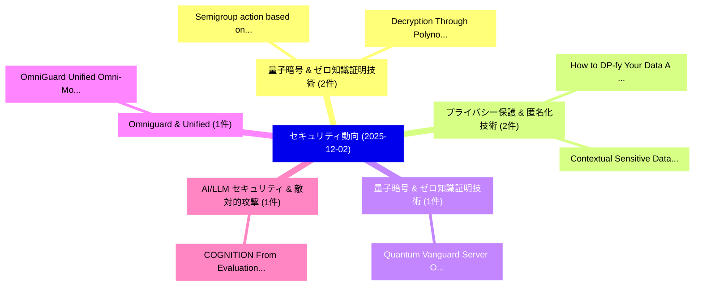

# 📅 02_daily: 日次エグゼクティブサマリー報告書 (2025-12-02)

**集計日時**: 2026-10-02 23:05:49 UTC  
**対象日付**: 2025-12-02  
**本日収集論文数**: 22 件  

---

## 💡 主要セキュリティ動向・脅威インサイト (Executive Insights)

本日の収集論文（計 22 件）において、以下の重点セキュリティ領域で活発な研究動向が確認されました：
- **量子暗号 & ゼロ知識証明技術** (2 件): 注目論文として 「Semigroup action based on skew...」、「Decryption Through Polynomial ...」 等が発表され、実務防御および攻撃検証の進展が見られます。
- **プライバシー保護 & 匿名化技術** (2 件): 注目論文として 「How to DP-fy Your Data: A Prac...」、「Contextual Sensitive Data Dete...」 等が発表され、実務防御および攻撃検証の進展が見られます。
- **量子暗号 & ゼロ知識証明技術** (1 件): 注目論文として 「Quantum Vanguard: Server Optim...」 等が発表され、実務防御および攻撃検証の進展が見られます。
- **Omniguard & Unified** (1 件): 注目論文として 「OmniGuard: Unified Omni-Modal ...」 等が発表され、実務防御および攻撃検証の進展が見られます。
- **AI/LLM セキュリティ & 敵対的攻撃** (1 件): 注目論文として 「COGNITION: From Evaluation to ...」 等が発表され、実務防御および攻撃検証の進展が見られます。

### 🗺️ 技術・脅威トピックマインドマップ

---

## 📌 日次セキュリティ論文一覧 (日本語表形式)

| No | arXiv ID | 論文タイトル (日本語訳) | 重要キーワード | 構造化エグゼクティブ要約 (背景・提案・影響) | 脅威分類 | 詳細リンク |
|---|---|---|---|---|---|---|
| 1 | `2512.02301v1` | [Quantum Vanguard: Server Optimized Privacy Fortified Federated Intelligence for Future Vehicles（セキュリティ分析論文）](../../okf/papers/2025-12-02/2512.02301.md) | `Server Optimized Privacy Fortified Federated Intelligence`, `Quantum Vanguard`, `Future Vehicles` | 【提案】概要 (Overview & Key Finding) 本論文「量子 Vanguard: Server Optimized Privacy Fortified Federat...。実証評価により経営層・セキュリティ管理者向け推奨アクション (E... | `cybersecurity` | [arXiv](https://arxiv.org/abs/2512.02301v1) &#124; [OKF](../../okf/papers/2025-12-02/2512.02301.md) |
| 2 | `2512.02306v1` | [OmniGuard: Unified Omni-Modal Guardrails with Deliberate Reasoning（セキュリティ分析論文）](../../okf/papers/2025-12-02/2512.02306.md) | `Unified Omni`, `Modal Guardrails`, `Deliberate Reasoning` | 【提案】概要 (Overview & Key Finding) 本論文「OmniGuard: Unified Omni-Modal Guardrails with Deliberat...。実証評価により経営層・セキュリティ管理者向け推奨アクション (E... | `cs.AI` | [arXiv](https://arxiv.org/abs/2512.02306v1) &#124; [OKF](../../okf/papers/2025-12-02/2512.02306.md) |
| 3 | `2512.02318v4` | [COGNITION: From Evaluation to Defense against Multimodal LLM CAPTCHA Solvers（セキュリティ分析論文）](../../okf/papers/2025-12-02/2512.02318.md) | `Junyu Wang`, `Changjia Zhu`, `Yuanbo Zhou` | 【提案】概要 (Overview & Key Finding) 本論文「COGNITION: From Evaluation to Defense against Multimoda...。実証評価により経営層・セキュリティ管理者向け推奨アクション (E... | `cs.AI` | [arXiv](https://arxiv.org/abs/2512.02318v4) &#124; [OKF](../../okf/papers/2025-12-02/2512.02318.md) |
| 4 | `2512.02321v1` | [LeechHijack: Covert Computational Resource Exploitation in Intelligent Agent Systems（セキュリティ分析論文）](../../okf/papers/2025-12-02/2512.02321.md) | `Covert Computational Resource Exploitation`, `Intelligent Agent Systems`, `Yuanhe Zhang` | 【提案】概要 (Overview & Key Finding) 本論文「LeechHijack: Covert Computational Resource Exploitation...。実証評価により経営層・セキュリティ管理者向け推奨アクション (E... | `executive-summary` | [arXiv](https://arxiv.org/abs/2512.02321v1) &#124; [OKF](../../okf/papers/2025-12-02/2512.02321.md) |
| 5 | `2512.02399v2` | [AtomGraph: Tackling Atomicity Violation in Smart Contracts using Multimodal GCNs（セキュリティ分析論文）](../../okf/papers/2025-12-02/2512.02399.md) | `Tackling Atomicity Violation`, `Smart Contracts`, `Xiaoqi Li` | 【提案】概要 (Overview & Key Finding) 本論文「AtomGraph: Tackling Atomicity Violation in スマートコントラクトs ...。実証評価により経営層・セキュリティ管理者向け推奨アクション (E... | `cybersecurity` | [arXiv](https://arxiv.org/abs/2512.02399v2) &#124; [OKF](../../okf/papers/2025-12-02/2512.02399.md) |
| 6 | `2512.02410v1` | [Decentralized Multi-Agent System with Trust-Aware Communication（セキュリティ分析論文）](../../okf/papers/2025-12-02/2512.02410.md) | `Decentralized Multi`, `Agent System`, `Aware Communication` | 【提案】概要 (Overview & Key Finding) 本論文「Decentralized Multi-Agent System with Trust-Aware Commu...。実証評価により経営層・セキュリティ管理者向け推奨アクション (E... | `executive-summary` | [arXiv](https://arxiv.org/abs/2512.02410v1) &#124; [OKF](../../okf/papers/2025-12-02/2512.02410.md) |
| 7 | `2512.02414v1` | [Characterizing Cyber Attacks against Space Infrastructures with Missing Data: Framework and Case Study（セキュリティ分析論文）](../../okf/papers/2025-12-02/2512.02414.md) | `Characterizing Cyber Attacks`, `Space Infrastructures`, `Missing Data` | 【提案】概要 (Overview & Key Finding) 本論文「Characterizing Cyber Attacks against Space Infrastructu...。実証評価により経営層・セキュリティ管理者向け推奨アクション (E... | `cybersecurity` | [arXiv](https://arxiv.org/abs/2512.02414v1) &#124; [OKF](../../okf/papers/2025-12-02/2512.02414.md) |
| 8 | `2512.02418v3` | [Leveraging 大規模言語モデル to Bridge Cross-Domain Transparency in Stablecoins](../../okf/papers/2025-12-02/2512.02418.md) | `Bridge Cross`, `Domain Transparency`, `Cross-Domain Transparency` | 【提案】概要 (Overview & Key Finding) 本論文「Leveraging 大規模言語モデル to Bridge Cross-Domain Transparency...。実証評価により経営層・セキュリティ管理者向け推奨アクション (E... | `executive-summary` | [arXiv](https://arxiv.org/abs/2512.02418v3) &#124; [OKF](../../okf/papers/2025-12-02/2512.02418.md) |
| 9 | `2512.02534v1` | [Crowdsourcing Cryptocurrency Laundering via Multi-Task Collaborationの検出](../../okf/papers/2025-12-02/2512.02534.md) | `Crowdsourcing Cryptocurrency Laundering`, `Task Collaboration`, `Multi-Task Collaboration` | 【提案】概要 (Overview & Key Finding) 本論文「Crowdsourcing Cryptocurrency Laundering via Multi-Task ...。実証評価により経営層・セキュリティ管理者向け推奨アクション (E... | `cybersecurity` | [arXiv](https://arxiv.org/abs/2512.02534v1) &#124; [OKF](../../okf/papers/2025-12-02/2512.02534.md) |
| 10 | `2512.02598v1` | [Equilibrium SAT based PQC: New aegis against quantum computing（セキュリティ分析論文）](../../okf/papers/2025-12-02/2512.02598.md) | `Bae Cho`, `Raw Meta`, `Executive Summary` | 【提案】概要 (Overview & Key Finding) 本論文「Equilibrium SAT based PQC: New aegis against 量子 computi...。実証評価により経営層・セキュリティ管理者向け推奨アクション (E... | `cybersecurity` | [arXiv](https://arxiv.org/abs/2512.02598v1) &#124; [OKF](../../okf/papers/2025-12-02/2512.02598.md) |
| 11 | `2512.02600v1` | [S3C2 SICP Summit 2025-06: Vulnerability Response Summit（セキュリティ分析論文）](../../okf/papers/2025-12-02/2512.02600.md) | `Vulnerability Response Summit`, `Anna Lena Rotthaler`, `Juraj Somorovsky` | 【提案】概要 (Overview & Key Finding) 本論文「S3C2 SICP Summit 2025-06: 脆弱性 Response Summit（セキュリティ分析論...。実証評価により経営層・セキュリティ管理者向け推奨アクション (E... | `cybersecurity` | [arXiv](https://arxiv.org/abs/2512.02600v1) &#124; [OKF](../../okf/papers/2025-12-02/2512.02600.md) |
| 12 | `2512.02603v1` | [Semigroup action based on skew polynomial evaluation with applications to Cryptography（セキュリティ分析論文）](../../okf/papers/2025-12-02/2512.02603.md) | `Juan Antonio`, `Raw Meta`, `Executive Summary` | 【提案】概要 (Overview & Key Finding) 本論文「Semigroup action based on skew polynomial evaluation wi...。実証評価により経営層・セキュリティ管理者向け推奨アクション (E... | `executive-summary` | [arXiv](https://arxiv.org/abs/2512.02603v1) &#124; [OKF](../../okf/papers/2025-12-02/2512.02603.md) |
| 13 | `2512.02625v1` | [CryptoQA: A Large-scale Question-answering Dataset for AI-assisted Cryptography（セキュリティ分析論文）](../../okf/papers/2025-12-02/2512.02625.md) | `Large-scale Question`, `AI-assisted Cryptography`, `Mayar Elfares` | 【提案】概要 (Overview & Key Finding) 本論文「CryptoQA: A Large-scale Question-answering Dataset for ...。実証評価により経営層・セキュリティ管理者向け推奨アクション (E... | `cs.AI` | [arXiv](https://arxiv.org/abs/2512.02625v1) &#124; [OKF](../../okf/papers/2025-12-02/2512.02625.md) |
| 14 | `2512.02654v1` | [サイバーセキュリティ AI: The World's Top AI Agent for Security Capture-the-Flag (CTF)](../../okf/papers/2025-12-02/2512.02654.md) | `Security Capture`, `Luis Javier Navarrete`, `Francesco Balassone` | 【提案】概要 (Overview & Key Finding) 本論文「サイバーセキュリティ AI: The World's Top AI Agent for Security Ca...。実証評価により経営層・セキュリティ管理者向け推奨アクション (E... | `cybersecurity` | [arXiv](https://arxiv.org/abs/2512.02654v1) &#124; [OKF](../../okf/papers/2025-12-02/2512.02654.md) |
| 15 | `2512.02822v2` | [Decryption Through Polynomial Ambiguity: Noise-Enhanced High-Memory Convolutional Codes for Post-Quantum Cryptography（セキュリティ分析論文）](../../okf/papers/2025-12-02/2512.02822.md) | `Memory Convolutional Codes`, `Enhanced High`, `Noise-Enhanced High` | 【提案】概要 (Overview & Key Finding) 本論文「Decryption Through Polynomial Ambiguity: Noise-Enhanced...。実証評価により経営層・セキュリティ管理者向け推奨アクション (E... | `cybersecurity` | [arXiv](https://arxiv.org/abs/2512.02822v2) &#124; [OKF](../../okf/papers/2025-12-02/2512.02822.md) |
| 16 | `2512.02918v3` | [Belobog: Move Language Fuzzing Framework For Real-World Smart Contracts（セキュリティ分析論文）](../../okf/papers/2025-12-02/2512.02918.md) | `World Smart Contracts`, `Real-World Smart`, `Ziqiao Kong` | 【提案】概要 (Overview & Key Finding) 本論文「Belobog: Move Language Fuzzing Framework For Real-World...。実証評価により経営層・セキュリティ管理者向け推奨アクション (E... | `cs.PL` | [arXiv](https://arxiv.org/abs/2512.02918v3) &#124; [OKF](../../okf/papers/2025-12-02/2512.02918.md) |
| 17 | `2512.02973v1` | [Contextual Image Attack: How Visual Context Exposes Multimodal Safety Vulnerabilities（セキュリティ分析論文）](../../okf/papers/2025-12-02/2512.02973.md) | `Contextual Image Attack`, `Yuan Xiong`, `Ziqi Miao` | 【提案】概要 (Overview & Key Finding) 本論文「Contextual Image Attack: How Visual Context Exposes Mul...。実証評価により経営層・セキュリティ管理者向け推奨アクション (E... | `cs.CV` | [arXiv](https://arxiv.org/abs/2512.02973v1) &#124; [OKF](../../okf/papers/2025-12-02/2512.02973.md) |
| 18 | `2512.03121v2` | [Lost in Modality: Evaluating the Effectiveness of Text-Based Membership Inference Attacks on Large Multimodal Models（セキュリティ分析論文）](../../okf/papers/2025-12-02/2512.03121.md) | `Based Membership Inference Attacks`, `Large Multimodal Models`, `Text-Based Membership` | 【提案】概要 (Overview & Key Finding) 本論文「Lost in Modality: Evaluating the Effectiveness of Text-...。実証評価により# Lost in Modality: Evalu... | `cs.AI` | [arXiv](https://arxiv.org/abs/2512.03121v2) &#124; [OKF](../../okf/papers/2025-12-02/2512.03121.md) |
| 19 | `2512.03207v2` | [Technical Report: The Need for a (Research) Sandstorm through the Privacy Sandbox（セキュリティ分析論文）](../../okf/papers/2025-12-02/2512.03207.md) | `Technical Report`, `Privacy Sandbox`, `Yohan Beugin` | 【提案】概要 (Overview & Key Finding) 本論文「Technical Report: The Need for a (Research) Sandstorm t...。実証評価により経営層・セキュリティ管理者向け推奨アクション (E... | `cybersecurity` | [arXiv](https://arxiv.org/abs/2512.03207v2) &#124; [OKF](../../okf/papers/2025-12-02/2512.03207.md) |
| 20 | `2512.03238v2` | [How to DP-fy Your Data: A Practical Guide to Generating Synthetic Data With Differential Privacy（セキュリティ分析論文）](../../okf/papers/2025-12-02/2512.03238.md) | `Practical Guide`, `Natalia Ponomareva`, `Zheng Xu` | 【提案】概要 (Overview & Key Finding) 本論文「How to DP-fy Your Data: A Practical Guide to Generating...。実証評価により経営層・セキュリティ管理者向け推奨アクション (E... | `cs.AI` | [arXiv](https://arxiv.org/abs/2512.03238v2) &#124; [OKF](../../okf/papers/2025-12-02/2512.03238.md) |
| 21 | `2512.03310v3` | [Randomized Masked Finetuning: An Efficient Way to Mitigate Memorization of PIIs in LLMs（セキュリティ分析論文）](../../okf/papers/2025-12-02/2512.03310.md) | `Randomized Masked Finetuning`, `Mitigate Memorization`, `Kunj Joshi` | 【提案】概要 (Overview & Key Finding) 本論文「Randomized Masked Finetuning: An Efficient Way to Mitig...。実証評価により経営層・セキュリティ管理者向け推奨アクション (E... | `executive-summary` | [arXiv](https://arxiv.org/abs/2512.03310v3) &#124; [OKF](../../okf/papers/2025-12-02/2512.03310.md) |
| 22 | `2512.04120v2` | [Contextual Sensitive Data Detectionに向けて](../../okf/papers/2025-12-02/2512.04120.md) | `Towards Contextual Sensitive Data Detection`, `Contextual Sensitive Data`, `Liang Telkamp` | 【提案】概要 (Overview & Key Finding) 本論文「Contextual Sensitive Data Detectionに向けて」（原題: Towards Co...。実証評価により経営層・セキュリティ管理者向け推奨アクション (E... | `cs.DB` | [arXiv](https://arxiv.org/abs/2512.04120v2) &#124; [OKF](../../okf/papers/2025-12-02/2512.04120.md) |

