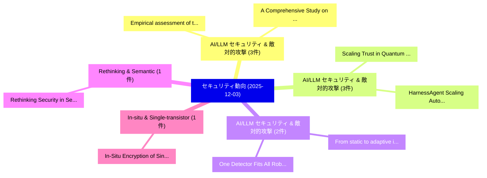

# 📅 02_daily: 日次エグゼクティブサマリー報告書 (2025-12-03)

**集計日時**: 2026-10-02 23:05:49 UTC  
**対象日付**: 2025-12-03  
**本日収集論文数**: 31 件  

---

## 💡 主要セキュリティ動向・脅威インサイト (Executive Insights)

本日の収集論文（計 31 件）において、以下の重点セキュリティ領域で活発な研究動向が確認されました：
- **AI/LLM セキュリティ & 敵対的攻撃** (3 件): 注目論文として 「Empirical assessment of the pe...」、「A Comprehensive Study on the I...」 等が発表され、実務防御および攻撃検証の進展が見られます。
- **AI/LLM セキュリティ & 敵対的攻撃** (3 件): 注目論文として 「Scaling Trust in Quantum 連合学習:...」、「HarnessAgent: Scaling Automati...」 等が発表され、実務防御および攻撃検証の進展が見られます。
- **AI/LLM セキュリティ & 敵対的攻撃** (2 件): 注目論文として 「From static to adaptive: immun...」、「One Detector Fits All: Robust ...」 等が発表され、実務防御および攻撃検証の進展が見られます。
- **Rethinking & Semantic** (1 件): 注目論文として 「Rethinking Security in Semanti...」 等が発表され、実務防御および攻撃検証の進展が見られます。
- **In-situ & Single-transistor** (1 件): 注目論文として 「In-Situ Encryption of Single-T...」 等が発表され、実務防御および攻撃検証の進展が見られます。

### 🗺️ 技術・脅威トピックマインドマップ

---

## 📌 日次セキュリティ論文一覧 (日本語表形式)

| No | arXiv ID | 論文タイトル (日本語訳) | 重要キーワード | 構造化エグゼクティブ要約 (背景・提案・影響) | 脅威分類 | 詳細リンク |
|---|---|---|---|---|---|---|
| 1 | `2512.03351v1` | [Empirical assessment of the perception of graphical threat model acceptability（セキュリティ分析論文）](../../okf/papers/2025-12-03/2512.03351.md) | `Olga Gadyatskaya`, `Raw Meta`, `Executive Summary` | 【提案】概要 (Overview & Key Finding) 本論文「Empirical assessment of the perception of graphical 脅威 ...。実証評価により経営層・セキュリティ管理者向け推奨アクション (E... | `cybersecurity` | [arXiv](https://arxiv.org/abs/2512.03351v1) &#124; [OKF](../../okf/papers/2025-12-03/2512.03351.md) |
| 2 | `2512.03356v2` | [From static to adaptive: immune memory-based jailbreak detection for 大規模言語モデル](../../okf/papers/2025-12-03/2512.03356.md) | `memory-based jailbreak`, `Jun Leng`, `Yu Liu` | 【提案】概要 (Overview & Key Finding) 本論文「From static to adaptive: immune memory-based ジェイルブレイク d...。実証評価により経営層・セキュリティ管理者向け推奨アクション (E... | `cybersecurity` | [arXiv](https://arxiv.org/abs/2512.03356v2) &#124; [OKF](../../okf/papers/2025-12-03/2512.03356.md) |
| 3 | `2512.03358v1` | [Scaling Trust in Quantum 連合学習: A Multi-Protocol Privacy Design](../../okf/papers/2025-12-03/2512.03358.md) | `Protocol Privacy Design`, `Scaling Trust`, `Multi-Protocol Privacy` | 【提案】概要 (Overview & Key Finding) 本論文「Scaling Trust in 量子 連合学習: A Multi-Protocol Privacy Desi...。実証評価により経営層・セキュリティ管理者向け推奨アクション (E... | `cybersecurity` | [arXiv](https://arxiv.org/abs/2512.03358v1) &#124; [OKF](../../okf/papers/2025-12-03/2512.03358.md) |
| 4 | `2512.03361v1` | [Rethinking Security in Semantic Communication: Latent Manipulation as a New Threat（セキュリティ分析論文）](../../okf/papers/2025-12-03/2512.03361.md) | `Rethinking Security`, `Semantic Communication`, `Latent Manipulation` | 【提案】概要 (Overview & Key Finding) 本論文「Rethinking Security in Semantic Communication: Latent M...。実証評価により経営層・セキュリティ管理者向け推奨アクション (E... | `executive-summary` | [arXiv](https://arxiv.org/abs/2512.03361v1) &#124; [OKF](../../okf/papers/2025-12-03/2512.03361.md) |
| 5 | `2512.03420v3` | [HarnessAgent: Scaling Automatic Fuzzing Harness Construction with Tool-Augmented LLM Pipelines（セキュリティ分析論文）](../../okf/papers/2025-12-03/2512.03420.md) | `Scaling Automatic Fuzzing Harness Construction`, `Tool-Augmented LLM`, `Kang Yang` | 【提案】概要 (Overview & Key Finding) 本論文「HarnessAgent: Scaling Automatic Fuzzing Harness Constru...。実証評価により経営層・セキュリティ管理者向け推奨アクション (E... | `executive-summary` | [arXiv](https://arxiv.org/abs/2512.03420v3) &#124; [OKF](../../okf/papers/2025-12-03/2512.03420.md) |
| 6 | `2512.03461v1` | [In-Situ Encryption of Single-Transistor Nonvolatile Memories without Density Loss（セキュリティ分析論文）](../../okf/papers/2025-12-03/2512.03461.md) | `Transistor Nonvolatile Memories`, `Situ Encryption`, `Density Loss` | 【提案】背景とセキュリティ上の課題 (Background & Problem) 本研究はサイバー脅威環境におけるセキュリティ構造・脆弱性の検証を目的としています。(主要検出項目: ...。実証評価により経営層・セキュリティ管理者向け推奨アクション (E... | `cs.ET` | [arXiv](https://arxiv.org/abs/2512.03461v1) &#124; [OKF](../../okf/papers/2025-12-03/2512.03461.md) |
| 7 | `2512.03465v6` | [Tuning for TraceTarnish: Techniques, Trends, and Testing Tangible Traits（セキュリティ分析論文）](../../okf/papers/2025-12-03/2512.03465.md) | `Testing Tangible Traits`, `Robert Dilworth`, `Raw Meta` | 【提案】概要 (Overview & Key Finding) 本論文「Tuning for TraceTarnish: Techniques, Trends, and Testin...。実証評価により経営層・セキュリティ管理者向け推奨アクション (E... | `executive-summary` | [arXiv](https://arxiv.org/abs/2512.03465v6) &#124; [OKF](../../okf/papers/2025-12-03/2512.03465.md) |
| 8 | `2512.03536v1` | [Mobility Induced Sensitivity of UAV based Nodes to Jamming in Private 5G Airfield Networks An Experimental Study（セキュリティ分析論文）](../../okf/papers/2025-12-03/2512.03536.md) | `Mobility Induced Sensitivity`, `Pavlo Mykytyn`, `Ronald Chitauro` | 【提案】概要 (Overview & Key Finding) 本論文「Mobility Induced Sensitivity of UAV based Nodes to Jamm...。実証評価により経営層・セキュリティ管理者向け推奨アクション (E... | `cs.NI` | [arXiv](https://arxiv.org/abs/2512.03536v1) &#124; [OKF](../../okf/papers/2025-12-03/2512.03536.md) |
| 9 | `2512.03551v1` | [A User Centric Group Authentication Scheme for Secure Communication（セキュリティ分析論文）](../../okf/papers/2025-12-03/2512.03551.md) | `User Centric Group Authentication Scheme`, `Secure Communication`, `Oylum Gerenli` | 【提案】概要 (Overview & Key Finding) 本論文「A User Centric Group Authentication Scheme for Secure C...。実証評価により経営層・セキュリティ管理者向け推奨アクション (E... | `cybersecurity` | [arXiv](https://arxiv.org/abs/2512.03551v1) &#124; [OKF](../../okf/papers/2025-12-03/2512.03551.md) |
| 10 | `2512.03564v1` | [Irreversible Machine Unlearning for Diffusion Modelsに向けて](../../okf/papers/2025-12-03/2512.03564.md) | `Towards Irreversible Machine Unlearning`, `Irreversible Machine Unlearning`, `Diffusion Models` | 【提案】概要 (Overview & Key Finding) 本論文「Irreversible Machine Unlearning for Diffusion Modelsに向け...。実証評価により経営層・セキュリティ管理者向け推奨アクション (E... | `executive-summary` | [arXiv](https://arxiv.org/abs/2512.03564v1) &#124; [OKF](../../okf/papers/2025-12-03/2512.03564.md) |
| 11 | `2512.03580v1` | [Dynamic Optical Test for Bot Identification (DOT-BI): A simple check to identify bots in surveys and online processes（セキュリティ分析論文）](../../okf/papers/2025-12-03/2512.03580.md) | `Dynamic Optical Test`, `Bot Identification`, `Malte Bleeker` | 【提案】概要 (Overview & Key Finding) 本論文「Dynamic Optical Test for Bot Identification (DOT-BI): A...。実証評価により経営層・セキュリティ管理者向け推奨アクション (E... | `cs.CV` | [arXiv](https://arxiv.org/abs/2512.03580v1) &#124; [OKF](../../okf/papers/2025-12-03/2512.03580.md) |
| 12 | `2512.03620v1` | [SELF: A Robust Singular Value and Eigenvalue Approach for LLM Fingerprinting（セキュリティ分析論文）](../../okf/papers/2025-12-03/2512.03620.md) | `Robust Singular Value`, `Hanxiu Zhang`, `Yue Zheng` | 【提案】概要 (Overview & Key Finding) 本論文「SELF: A Robust Singular Value and Eigenvalue Approach f...。実証評価により経営層・セキュリティ管理者向け推奨アクション (E... | `cs.AI` | [arXiv](https://arxiv.org/abs/2512.03620v1) &#124; [OKF](../../okf/papers/2025-12-03/2512.03620.md) |
| 13 | `2512.03641v1` | [A Descriptive Model for Modelling Attacker Decision-Making in Cyber-Deception（セキュリティ分析論文）](../../okf/papers/2025-12-03/2512.03641.md) | `Modelling Attacker Decision`, `Descriptive Model`, `Raw Meta` | 【提案】概要 (Overview & Key Finding) 本論文「A Descriptive Model for Modelling Attacker Decision-Mak...。実証評価によりGuidetti, N.。 | `cybersecurity` | [arXiv](https://arxiv.org/abs/2512.03641v1) &#124; [OKF](../../okf/papers/2025-12-03/2512.03641.md) |
| 14 | `2512.03669v1` | [Privacy-Preserving Range Queries with Secure Learned Spatial Index over Encrypted Dataに向けて](../../okf/papers/2025-12-03/2512.03669.md) | `Secure Learned Spatial Index`, `Preserving Range Queries`, `Privacy-Preserving Range` | 【提案】概要 (Overview & Key Finding) 本論文「Privacy-Preserving Range Queries with Secure Learned Sp...。実証評価により経営層・セキュリティ管理者向け推奨アクション (E... | `cs.DB` | [arXiv](https://arxiv.org/abs/2512.03669v1) &#124; [OKF](../../okf/papers/2025-12-03/2512.03669.md) |
| 15 | `2512.03720v1` | [Context-Aware Hierarchical Learning: A Two-Step Paradigm Safer LLMsに向けて](../../okf/papers/2025-12-03/2512.03720.md) | `Aware Hierarchical Learning`, `Context-Aware Hierarchical`, `Two-Step Paradigm` | 【提案】概要 (Overview & Key Finding) 本論文「Context-Aware Hierarchical Learning: A Two-Step Paradig...。実証評価により経営層・セキュリティ管理者向け推奨アクション (E... | `cs.AI` | [arXiv](https://arxiv.org/abs/2512.03720v1) &#124; [OKF](../../okf/papers/2025-12-03/2512.03720.md) |
| 16 | `2512.03765v1` | [The Treasury Proof Ledger: A Cryptographic Framework for Accountable Bitcoin Treasuries（セキュリティ分析論文）](../../okf/papers/2025-12-03/2512.03765.md) | `Accountable Bitcoin Treasuries`, `Carlos Puente`, `Raw Meta` | 【提案】概要 (Overview & Key Finding) 本論文「The Treasury Proof Ledger: A Cryptographic Framework fo...。実証評価により経営層・セキュリティ管理者向け推奨アクション (E... | `cybersecurity` | [arXiv](https://arxiv.org/abs/2512.03765v1) &#124; [OKF](../../okf/papers/2025-12-03/2512.03765.md) |
| 17 | `2512.03771v2` | [In-Context Representation Hijacking（セキュリティ分析論文）](../../okf/papers/2025-12-03/2512.03771.md) | `Context Representation Hijacking`, `In-Context Representation`, `Itay Yona` | 【提案】概要 (Overview & Key Finding) 本論文「In-Context Representation Hijacking（セキュリティ分析論文）」（原題: In...。実証評価により経営層・セキュリティ管理者向け推奨アクション (E... | `cs.AI` | [arXiv](https://arxiv.org/abs/2512.03771v2) &#124; [OKF](../../okf/papers/2025-12-03/2512.03771.md) |
| 18 | `2512.03775v1` | ["MCP Does Not Stand for Misuse Cryptography Protocol": Uncovering Cryptographic Misuse in Model Context Protocol at Scale（セキュリティ分析論文）](../../okf/papers/2025-12-03/2512.03775.md) | `Misuse Cryptography Protocol`, `Uncovering Cryptographic Misuse`, `Model Context Protocol` | 【提案】背景とセキュリティ上の課題 (Background & Problem) 本研究はサイバー脅威環境におけるセキュリティ構造・脆弱性の検証を目的としています。(主要検出項目: ...。実証評価により経営層・セキュリティ管理者向け推奨アクション (E... | `cybersecurity` | [arXiv](https://arxiv.org/abs/2512.03775v1) &#124; [OKF](../../okf/papers/2025-12-03/2512.03775.md) |
| 19 | `2512.03791v1` | [CCN: Decentralized Cross-Chain Channel Networks Supporting Secure and Privacy-Preserving Multi-Hop Interactions（セキュリティ分析論文）](../../okf/papers/2025-12-03/2512.03791.md) | `Chain Channel Networks Supporting Secure`, `Decentralized Cross`, `Preserving Multi` | 【提案】概要 (Overview & Key Finding) 本論文「CCN: Decentralized Cross-Chain Channel Networks Support...。実証評価により経営層・セキュリティ管理者向け推奨アクション (E... | `cybersecurity` | [arXiv](https://arxiv.org/abs/2512.03791v1) &#124; [OKF](../../okf/papers/2025-12-03/2512.03791.md) |
| 20 | `2512.03792v1` | [Unfolding Challenges in and Regulating Unmanned Air Vehiclesのセキュリティ強化](../../okf/papers/2025-12-03/2512.03792.md) | `Unfolding Challenges`, `Regulating Unmanned Air Vehicles`, `Regulating Unmanned Air` | 【提案】概要 (Overview & Key Finding) 本論文「Unfolding Challenges in and Regulating Unmanned Air Veh...。実証評価により経営層・セキュリティ管理者向け推奨アクション (E... | `cybersecurity` | [arXiv](https://arxiv.org/abs/2512.03792v1) &#124; [OKF](../../okf/papers/2025-12-03/2512.03792.md) |
| 21 | `2512.03816v2` | [Log Probability Tracking of LLM APIs（セキュリティ分析論文）](../../okf/papers/2025-12-03/2512.03816.md) | `Log Probability Tracking`, `Erwan Le Merrer`, `Gilles Tredan` | 【提案】概要 (Overview & Key Finding) 本論文「Log Probability Tracking of LLM APIs（セキュリティ分析論文）」（原題: L...。実証評価により経営層・セキュリティ管理者向け推奨アクション (E... | `executive-summary` | [arXiv](https://arxiv.org/abs/2512.03816v2) &#124; [OKF](../../okf/papers/2025-12-03/2512.03816.md) |
| 22 | `2512.03868v1` | [A Comprehensive Study on the Impact of Vulnerable Dependencies on Open-Source Software（セキュリティ分析論文）](../../okf/papers/2025-12-03/2512.03868.md) | `Vulnerable Dependencies`, `Source Software`, `Open-Source Software` | 【提案】概要 (Overview & Key Finding) 本論文「A Comprehensive Study on the Impact of Vulnerable Depen...。実証評価により経営層・セキュリティ管理者向け推奨アクション (E... | `executive-summary` | [arXiv](https://arxiv.org/abs/2512.03868v1) &#124; [OKF](../../okf/papers/2025-12-03/2512.03868.md) |
| 23 | `2512.04008v2` | [Efficient Public Verification of Private ML via Regularization（セキュリティ分析論文）](../../okf/papers/2025-12-03/2512.04008.md) | `Efficient Public Verification`, `Ruha Bell`, `Anvith Thudi` | 【提案】概要 (Overview & Key Finding) 本論文「Efficient Public Verification of Private ML via Regular...。実証評価により経営層・セキュリティ管理者向け推奨アクション (E... | `executive-summary` | [arXiv](https://arxiv.org/abs/2512.04008v2) &#124; [OKF](../../okf/papers/2025-12-03/2512.04008.md) |
| 24 | `2512.04044v1` | [MarkTune: Improving the Quality-Detectability Trade-off in Open-Weight LLM Watermarking（セキュリティ分析論文）](../../okf/papers/2025-12-03/2512.04044.md) | `Detectability Trade`, `Quality-Detectability Trade`, `Open-Weight LLM` | 【提案】概要 (Overview & Key Finding) 本論文「MarkTune: Improving the Quality-Detectability Trade-off...。実証評価により経営層・セキュリティ管理者向け推奨アクション (E... | `cs.AI` | [arXiv](https://arxiv.org/abs/2512.04044v1) &#124; [OKF](../../okf/papers/2025-12-03/2512.04044.md) |
| 25 | `2512.04129v2` | [Don't Trust Your Upstream: Exploiting LLM Multi-Agent System via Topology-Guided Adversarial Propagation（セキュリティ分析論文）](../../okf/papers/2025-12-03/2512.04129.md) | `Guided Adversarial Propagation`, `Agent System`, `Multi-Agent System` | 【提案】概要 (Overview & Key Finding) 本論文「Don't Trust Your Upstream: Exploiting LLM Multi-Agent S...。実証評価により経営層・セキュリティ管理者向け推奨アクション (E... | `cybersecurity` | [arXiv](https://arxiv.org/abs/2512.04129v2) &#124; [OKF](../../okf/papers/2025-12-03/2512.04129.md) |
| 26 | `2512.04237v1` | [Primitive Vector Cipher(PVC): A Hybrid Encryption Scheme based on the Vector Computational Diffie-Hellman (V-CDH) Problem（セキュリティ分析論文）](../../okf/papers/2025-12-03/2512.04237.md) | `Primitive Vector Cipher`, `Hybrid Encryption Scheme`, `Vector Computational Diffie` | 【提案】概要 (Overview & Key Finding) 本論文「Primitive Vector Cipher(PVC): A Hybrid Encryption Schem...。実証評価により経営層・セキュリティ管理者向け推奨アクション (E... | `cybersecurity` | [arXiv](https://arxiv.org/abs/2512.04237v1) &#124; [OKF](../../okf/papers/2025-12-03/2512.04237.md) |
| 27 | `2512.04254v1` | [Hey GPT-OSS, Looks Like You Got It -- Now Walk Me Through It! An Assessment of the Reasoning Language Models Chain of Thought Mechanism for Digital Forensics（セキュリティ分析論文）](../../okf/papers/2025-12-03/2512.04254.md) | `Reasoning Language Models Chain`, `Thought Mechanism`, `Digital Forensics` | 【提案】An Assessment of the Reasoning Language Models Chain of Thought Mechanism for Digital F...。実証評価により経営層・セキュリティ管理者向け推奨アクション (E... | `cs.AI` | [arXiv](https://arxiv.org/abs/2512.04254v1) &#124; [OKF](../../okf/papers/2025-12-03/2512.04254.md) |
| 28 | `2512.04259v2` | [WildCode Revisited: A Comprehensive Empirical Study on the Security of LLM-Generated Code（セキュリティ分析論文）](../../okf/papers/2025-12-03/2512.04259.md) | `Generated Code`, `LLM-Generated Code`, `Wilfried Patrick Konan` | 【提案】概要 (Overview & Key Finding) 本論文「WildCode Revisited: A Comprehensive Empirical Study on ...。実証評価により経営層・セキュリティ管理者向け推奨アクション (E... | `executive-summary` | [arXiv](https://arxiv.org/abs/2512.04259v2) &#124; [OKF](../../okf/papers/2025-12-03/2512.04259.md) |
| 29 | `2512.04260v2` | [Breaking Isolation: A New Perspective on Hypervisor Exploitation via Cross-Domain Attacks（セキュリティ分析論文）](../../okf/papers/2025-12-03/2512.04260.md) | `Breaking Isolation`, `New Perspective`, `Hypervisor Exploitation` | 【提案】概要 (Overview & Key Finding) 本論文「Breaking Isolation: A New Perspective on Hypervisor Exp...。実証評価により経営層・セキュリティ管理者向け推奨アクション (E... | `cybersecurity` | [arXiv](https://arxiv.org/abs/2512.04260v2) &#124; [OKF](../../okf/papers/2025-12-03/2512.04260.md) |
| 30 | `2512.04338v1` | [One Detector Fits All: Robust and Adaptive Malicious Packages from PyPI to Enterprisesの検出](../../okf/papers/2025-12-03/2512.04338.md) | `Adaptive Malicious Packages`, `Adaptive Detection`, `Malicious Packages` | 【提案】概要 (Overview & Key Finding) 本論文「One Detector Fits All: Robust and Adaptive Malicious Pa...。実証評価により経営層・セキュリティ管理者向け推奨アクション (E... | `executive-summary` | [arXiv](https://arxiv.org/abs/2512.04338v1) &#124; [OKF](../../okf/papers/2025-12-03/2512.04338.md) |
| 31 | `2512.09938v1` | [Blockchain-Anchored Audit Trail Model for Transparent Inter-Operator Settlement（セキュリティ分析論文）](../../okf/papers/2025-12-03/2512.09938.md) | `Anchored Audit Trail Model`, `Transparent Inter`, `Operator Settlement` | 【提案】概要 (Overview & Key Finding) 本論文「Blockchain-Anchored Audit Trail Model for Transparent I...。実証評価により経営層・セキュリティ管理者向け推奨アクション (E... | `executive-summary` | [arXiv](https://arxiv.org/abs/2512.09938v1) &#124; [OKF](../../okf/papers/2025-12-03/2512.09938.md) |

