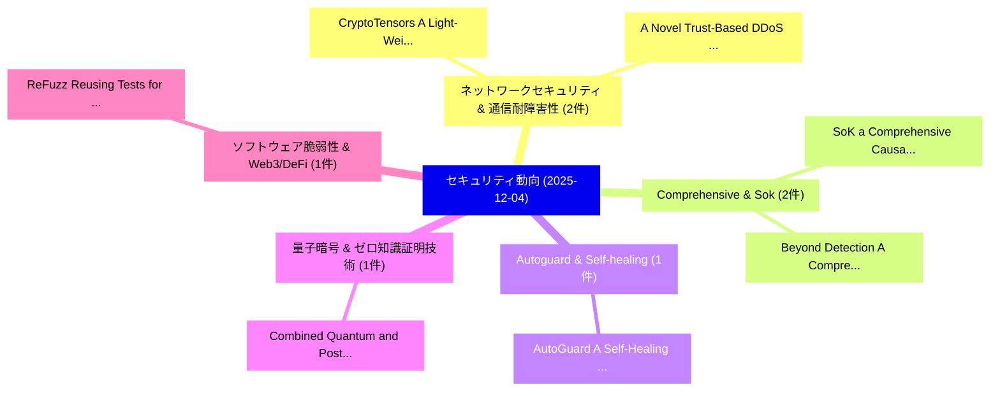

# 📅 02_daily: 日次エグゼクティブサマリー報告書 (2025-12-04)

**集計日時**: 2026-10-02 23:05:49 UTC  
**対象日付**: 2025-12-04  
**本日収集論文数**: 18 件  

---

## 💡 主要セキュリティ動向・脅威インサイト (Executive Insights)

本日の収集論文（計 18 件）において、以下の重点セキュリティ領域で活発な研究動向が確認されました：
- **ネットワークセキュリティ & 通信耐障害性** (2 件): 注目論文として 「CryptoTensors: A Light-Weight ...」、「A Novel Trust-Based DDoS Cyber...」 等が発表され、実務防御および攻撃検証の進展が見られます。
- **Comprehensive & Sok** (2 件): 注目論文として 「SoK: a Comprehensive Causality...」、「Beyond Detection: A Comprehens...」 等が発表され、実務防御および攻撃検証の進展が見られます。
- **Autoguard & Self-healing** (1 件): 注目論文として 「AutoGuard: A Self-Healing Proa...」 等が発表され、実務防御および攻撃検証の進展が見られます。
- **量子暗号 & ゼロ知識証明技術** (1 件): 注目論文として 「Combined Quantum and Post-Quan...」 等が発表され、実務防御および攻撃検証の進展が見られます。
- **ソフトウェア脆弱性 & Web3/DeFi** (1 件): 注目論文として 「ReFuzz: Reusing Tests for Proc...」 等が発表され、実務防御および攻撃検証の進展が見られます。

### 🗺️ 技術・脅威トピックマインドマップ

---

## 📌 日次セキュリティ論文一覧 (日本語表形式)

| No | arXiv ID | 論文タイトル (日本語訳) | 重要キーワード | 構造化エグゼクティブ要約 (背景・提案・影響) | 脅威分類 | 詳細リンク |
|---|---|---|---|---|---|---|
| 1 | `2512.04368v1` | [AutoGuard: A Self-Healing Proactive Security Layer for DevSecOps Pipelines Using Reinforcement Learning（セキュリティ分析論文）](../../okf/papers/2025-12-04/2512.04368.md) | `Healing Proactive Security Layer`, `Pipelines Using Reinforcement Learning`, `Self-Healing Proactive` | 【提案】概要 (Overview & Key Finding) 本論文「AutoGuard: A Self-Healing Proactive Security Layer for ...。実証評価により経営層・セキュリティ管理者向け推奨アクション (E... | `cs.AI` | [arXiv](https://arxiv.org/abs/2512.04368v1) &#124; [OKF](../../okf/papers/2025-12-04/2512.04368.md) |
| 2 | `2512.04429v1` | [Combined Quantum and Post-Quantum Security Performance Under Finite Keys（セキュリティ分析論文）](../../okf/papers/2025-12-04/2512.04429.md) | `Combined Quantum`, `Post-Quantum Security`, `Ravi Singh Adhikari` | 【提案】概要 (Overview & Key Finding) 本論文「Combined 量子 and Post-量子 Security Performance Under Fini...。実証評価により経営層・セキュリティ管理者向け推奨アクション (E... | `executive-summary` | [arXiv](https://arxiv.org/abs/2512.04429v1) &#124; [OKF](../../okf/papers/2025-12-04/2512.04429.md) |
| 3 | `2512.04436v2` | [ReFuzz: Reusing Tests for Processor Fuzzing with Contextual Bandits（セキュリティ分析論文）](../../okf/papers/2025-12-04/2512.04436.md) | `Reusing Tests`, `Processor Fuzzing`, `Contextual Bandits` | 【提案】概要 (Overview & Key Finding) 本論文「ReFuzz: Reusing Tests for Processor Fuzzing with Contex...。実証評価により経営層・セキュリティ管理者向け推奨アクション (E... | `cybersecurity` | [arXiv](https://arxiv.org/abs/2512.04436v2) &#124; [OKF](../../okf/papers/2025-12-04/2512.04436.md) |
| 4 | `2512.04580v2` | [CryptoTensors: A Light-Weight Large Language Model File Format for Highly-Secure Model Distribution（セキュリティ分析論文）](../../okf/papers/2025-12-04/2512.04580.md) | `Weight Large Language Model File Format`, `Secure Model Distribution`, `Light-Weight Large` | 【提案】概要 (Overview & Key Finding) 本論文「CryptoTensors: A Light-Weight Large Language Model File...。実証評価により経営層・セキュリティ管理者向け推奨アクション (E... | `cs.AI` | [arXiv](https://arxiv.org/abs/2512.04580v2) &#124; [OKF](../../okf/papers/2025-12-04/2512.04580.md) |
| 5 | `2512.04590v2` | [Exploiting ftrace's function_graph Tracer Features for Machine Learning: A Case Study on Encryption Detection（セキュリティ分析論文）](../../okf/papers/2025-12-04/2512.04590.md) | `Tracer Features`, `Machine Learning`, `Encryption Detection` | 【提案】概要 (Overview & Key Finding) 本論文「Exploiting ftrace's function_graph Tracer Features for ...。実証評価により経営層・セキュリティ管理者向け推奨アクション (E... | `executive-summary` | [arXiv](https://arxiv.org/abs/2512.04590v2) &#124; [OKF](../../okf/papers/2025-12-04/2512.04590.md) |
| 6 | `2512.04611v2` | [PBFuzz: Agentic Directed Fuzzing for PoV Generation（セキュリティ分析論文）](../../okf/papers/2025-12-04/2512.04611.md) | `Agentic Directed Fuzzing`, `Haochen Zeng`, `Andrew Bao` | 【提案】概要 (Overview & Key Finding) 本論文「PBFuzz: Agentic Directed Fuzzing for PoV Generation（セキュ...。実証評価により経営層・セキュリティ管理者向け推奨アクション (E... | `executive-summary` | [arXiv](https://arxiv.org/abs/2512.04611v2) &#124; [OKF](../../okf/papers/2025-12-04/2512.04611.md) |
| 7 | `2512.04668v4` | [Topology Matters: Measuring Memory Leakage in Multi-Agent LLMs（セキュリティ分析論文）](../../okf/papers/2025-12-04/2512.04668.md) | `Measuring Memory Leakage`, `Topology Matters`, `Multi-Agent LLMs` | 【提案】概要 (Overview & Key Finding) 本論文「Topology Matters: Measuring Memory Leakage in Multi-Age...。実証評価により経営層・セキュリティ管理者向け推奨アクション (E... | `cs.AI` | [arXiv](https://arxiv.org/abs/2512.04668v4) &#124; [OKF](../../okf/papers/2025-12-04/2512.04668.md) |
| 8 | `2512.04675v1` | [CryptGleeok-128の分析](../../okf/papers/2025-12-04/2512.04675.md) | `Siwei Chen`, `Peipei Xie`, `Shengyuan Xu` | 【提案】概要 (Overview & Key Finding) 本論文「CryptGleeok-128の分析」（原題: Cryptanalysis of Gleeok-128 / a...。実証評価により経営層・セキュリティ管理者向け推奨アクション (E... | `cybersecurity` | [arXiv](https://arxiv.org/abs/2512.04675v1) &#124; [OKF](../../okf/papers/2025-12-04/2512.04675.md) |
| 9 | `2512.04785v1` | [ASTRIDE: A Security Threat Modeling Platform for Agentic-AI Applications（セキュリティ分析論文）](../../okf/papers/2025-12-04/2512.04785.md) | `Security Threat Modeling Platform`, `Agentic-AI Applications`, `Ng Wee Keong` | 【提案】概要 (Overview & Key Finding) 本論文「ASTRIDE: A Security 脅威 Modeling Platform for Agentic-AI...。実証評価により経営層・セキュリティ管理者向け推奨アクション (E... | `cs.AI` | [arXiv](https://arxiv.org/abs/2512.04785v1) &#124; [OKF](../../okf/papers/2025-12-04/2512.04785.md) |
| 10 | `2512.04841v1` | [SoK: a Comprehensive Causality Analysis Framework for Large Language Model Security（セキュリティ分析論文）](../../okf/papers/2025-12-04/2512.04841.md) | `Large Language Model Security`, `Wei Zhao`, `Zhe Li` | 【提案】概要 (Overview & Key Finding) 本論文「SoK: a Comprehensive Causality Analysis Framework for L...。実証評価により経営層・セキュリティ管理者向け推奨アクション (E... | `cs.AI` | [arXiv](https://arxiv.org/abs/2512.04841v1) &#124; [OKF](../../okf/papers/2025-12-04/2512.04841.md) |
| 11 | `2512.04855v1` | [A Novel Trust-Based DDoS Cyberattack Detection Model for Smart Business Environments（セキュリティ分析論文）](../../okf/papers/2025-12-04/2512.04855.md) | `Cyberattack Detection Model`, `Smart Business Environments`, `Trust-Based DDoS` | 【提案】概要 (Overview & Key Finding) 本論文「A Novel Trust-Based DDoS Cyberattack Detection Model fo...。実証評価により経営層・セキュリティ管理者向け推奨アクション (E... | `cybersecurity` | [arXiv](https://arxiv.org/abs/2512.04855v1) &#124; [OKF](../../okf/papers/2025-12-04/2512.04855.md) |
| 12 | `2512.04908v1` | [Logic-Driven サイバーセキュリティ: A Novel Framework for System Log Anomaly Detection using Answer Set Programming](../../okf/papers/2025-12-04/2512.04908.md) | `System Log Anomaly Detection`, `Answer Set Programming`, `Driven Cybersecurity` | 【提案】概要 (Overview & Key Finding) 本論文「Logic-Driven サイバーセキュリティ: A Novel Framework for System L...。実証評価により経営層・セキュリティ管理者向け推奨アクション (E... | `cs.LO` | [arXiv](https://arxiv.org/abs/2512.04908v1) &#124; [OKF](../../okf/papers/2025-12-04/2512.04908.md) |
| 13 | `2512.04950v1` | [Opacity problems in multi-energy timed automata（セキュリティ分析論文）](../../okf/papers/2025-12-04/2512.04950.md) | `multi-energy timed`, `Lydia Bakiri`, `Raw Meta` | 【提案】概要 (Overview & Key Finding) 本論文「Opacity problems in multi-energy timed automata（セキュリティ分...。実証評価により経営層・セキュリティ管理者向け推奨アクション (E... | `cybersecurity` | [arXiv](https://arxiv.org/abs/2512.04950v1) &#124; [OKF](../../okf/papers/2025-12-04/2512.04950.md) |
| 14 | `2512.05065v3` | [Personalizing Agent Privacy Decisions via Logical Entailment（セキュリティ分析論文）](../../okf/papers/2025-12-04/2512.05065.md) | `Personalizing Agent Privacy Decisions`, `Logical Entailment`, `James Flemings` | 【提案】概要 (Overview & Key Finding) 本論文「Personalizing Agent Privacy Decisions via Logical Entai...。実証評価により経営層・セキュリティ管理者向け推奨アクション (E... | `cybersecurity` | [arXiv](https://arxiv.org/abs/2512.05065v3) &#124; [OKF](../../okf/papers/2025-12-04/2512.05065.md) |
| 15 | `2512.05069v2` | [Hybrid Quantum-Classical Autoencoders for Unsupervised Network Intrusion Detection（セキュリティ分析論文）](../../okf/papers/2025-12-04/2512.05069.md) | `Unsupervised Network Intrusion Detection`, `Hybrid Quantum`, `Classical Autoencoders` | 【提案】概要 (Overview & Key Finding) 本論文「Hybrid 量子-Classical Autoencoders for Unsupervised Netwo...。実証評価により経営層・セキュリティ管理者向け推奨アクション (E... | `executive-summary` | [arXiv](https://arxiv.org/abs/2512.05069v2) &#124; [OKF](../../okf/papers/2025-12-04/2512.05069.md) |
| 16 | `2512.05288v1` | [Beyond Detection: A Comprehensive Benchmark and Study on Representation Learning for Fine-Grained Webshell Family Classification（セキュリティ分析論文）](../../okf/papers/2025-12-04/2512.05288.md) | `Grained Webshell Family Classification`, `Beyond Detection`, `Comprehensive Benchmark` | 【提案】概要 (Overview & Key Finding) 本論文「Beyond Detection: A Comprehensive Benchmark and Study o...。実証評価により経営層・セキュリティ管理者向け推奨アクション (E... | `cs.AI` | [arXiv](https://arxiv.org/abs/2512.05288v1) &#124; [OKF](../../okf/papers/2025-12-04/2512.05288.md) |
| 17 | `2512.05321v1` | [A Practical Honeypot-Based Threat Intelligence Framework for Cyber Defence in the Cloud（セキュリティ分析論文）](../../okf/papers/2025-12-04/2512.05321.md) | `Practical Honeypot`, `Cyber Defence`, `Honeypot-Based Threat` | 【提案】概要 (Overview & Key Finding) 本論文「A Practical Honeypot-Based 脅威 Intelligence Framework fo...。実証評価により経営層・セキュリティ管理者向け推奨アクション (E... | `cybersecurity` | [arXiv](https://arxiv.org/abs/2512.05321v1) &#124; [OKF](../../okf/papers/2025-12-04/2512.05321.md) |
| 18 | `2512.06033v2` | [Sell Data to AI Algorithms Without Revealing It: Secure Data Valuation and Sharing via Homomorphic Encryption（セキュリティ分析論文）](../../okf/papers/2025-12-04/2512.06033.md) | `Secure Data Valuation`, `Sell Data`, `Homomorphic Encryption` | 【提案】背景とセキュリティ上の課題 (Background & Problem) 本研究はサイバー脅威環境におけるセキュリティ構造・脆弱性の検証を目的としています。(主要検出項目: ...。実証評価により経営層・セキュリティ管理者向け推奨アクション (E... | `executive-summary` | [arXiv](https://arxiv.org/abs/2512.06033v2) &#124; [OKF](../../okf/papers/2025-12-04/2512.06033.md) |

