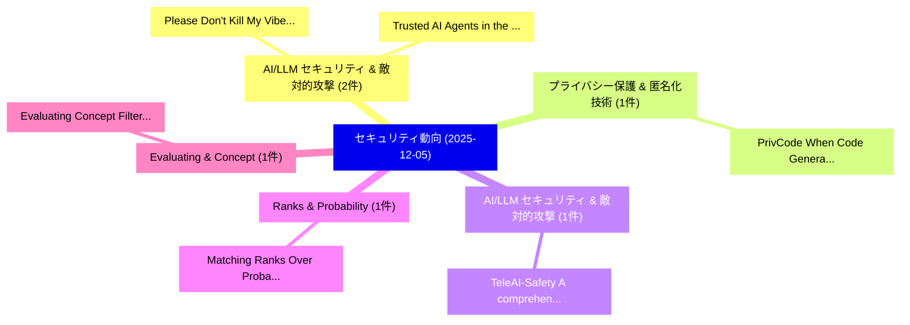

# 📅 02_daily: 日次エグゼクティブサマリー報告書 (2025-12-05)

**集計日時**: 2026-10-02 23:05:49 UTC  
**対象日付**: 2025-12-05  
**本日収集論文数**: 13 件  

---

## 💡 主要セキュリティ動向・脅威インサイト (Executive Insights)

本日の収集論文（計 13 件）において、以下の重点セキュリティ領域で活発な研究動向が確認されました：
- **AI/LLM セキュリティ & 敵対的攻撃** (2 件): 注目論文として 「Please Don't Kill My Vibe: Emp...」、「Trusted AI Agents in the Cloud...」 等が発表され、実務防御および攻撃検証の進展が見られます。
- **プライバシー保護 & 匿名化技術** (1 件): 注目論文として 「PrivCode: When Code Generation...」 等が発表され、実務防御および攻撃検証の進展が見られます。
- **AI/LLM セキュリティ & 敵対的攻撃** (1 件): 注目論文として 「TeleAI-Safety: A comprehensive...」 等が発表され、実務防御および攻撃検証の進展が見られます。
- **Ranks & Probability** (1 件): 注目論文として 「Matching Ranks Over Probabilit...」 等が発表され、実務防御および攻撃検証の進展が見られます。
- **Evaluating & Concept** (1 件): 注目論文として 「Evaluating Concept Filtering D...」 等が発表され、実務防御および攻撃検証の進展が見られます。

### 🗺️ 技術・脅威トピックマインドマップ

---

## 📌 日次セキュリティ論文一覧 (日本語表形式)

| No | arXiv ID | 論文タイトル (日本語訳) | 重要キーワード | 構造化エグゼクティブ要約 (背景・提案・影響) | 脅威分類 | 詳細リンク |
|---|---|---|---|---|---|---|
| 1 | `2512.05374v1` | [Please Don't Kill My Vibe: Empowering Agents with Data Flow Control（セキュリティ分析論文）](../../okf/papers/2025-12-05/2512.05374.md) | `Data Flow Control`, `Please Don`, `Empowering Agents` | 【提案】概要 (Overview & Key Finding) 本論文「Please Don't Kill My Vibe: Empowering Agents with Data ...。実証評価により経営層・セキュリティ管理者向け推奨アクション (E... | `cs.DB` | [arXiv](https://arxiv.org/abs/2512.05374v1) &#124; [OKF](../../okf/papers/2025-12-05/2512.05374.md) |
| 2 | `2512.05459v3` | [PrivCode: When Code Generation Meets Differential Privacy（セキュリティ分析論文）](../../okf/papers/2025-12-05/2512.05459.md) | `Terry Yue Zhuo`, `Zheng Liu`, `Chen Gong` | 【提案】概要 (Overview & Key Finding) 本論文「PrivCode: When Code Generation Meets 差分プライバシー（セキュリティ分析論...。実証評価により経営層・セキュリティ管理者向け推奨アクション (E... | `cybersecurity` | [arXiv](https://arxiv.org/abs/2512.05459v3) &#124; [OKF](../../okf/papers/2025-12-05/2512.05459.md) |
| 3 | `2512.05485v2` | [TeleAI-Safety: A comprehensive LLM jailbreaking benchmark attacks, defenses, and evaluationsに向けて](../../okf/papers/2025-12-05/2512.05485.md) | `Xiuyuan Chen`, `Jian Zhao`, `Yuan Xun` | 【提案】概要 (Overview & Key Finding) 本論文「TeleAI-Safety: A comprehensive LLM ジェイルブレイクing benchmar...。実証評価により経営層・セキュリティ管理者向け推奨アクション (E... | `cybersecurity` | [arXiv](https://arxiv.org/abs/2512.05485v2) &#124; [OKF](../../okf/papers/2025-12-05/2512.05485.md) |
| 4 | `2512.05518v2` | [Matching Ranks Over Probability Yields Truly Deep Safety Alignment（セキュリティ分析論文）](../../okf/papers/2025-12-05/2512.05518.md) | `Jason Vega`, `Gagandeep Singh`, `Raw Meta` | 【提案】概要 (Overview & Key Finding) 本論文「Matching Ranks Over Probability Yields Truly Deep Safet...。実証評価により経営層・セキュリティ管理者向け推奨アクション (E... | `cs.AI` | [arXiv](https://arxiv.org/abs/2512.05518v2) &#124; [OKF](../../okf/papers/2025-12-05/2512.05518.md) |
| 5 | `2512.05707v2` | [Evaluating Concept Filtering Defenses against Child Sexual Abuse Material Generation by Text-to-Image Models（セキュリティ分析論文）](../../okf/papers/2025-12-05/2512.05707.md) | `Child Sexual Abuse Material Generation`, `Evaluating Concept Filtering Defenses`, `Image Models` | 【提案】概要 (Overview & Key Finding) 本論文「Evaluating Concept Filtering Defenses against Child Sex...。実証評価により経営層・セキュリティ管理者向け推奨アクション (E... | `cybersecurity` | [arXiv](https://arxiv.org/abs/2512.05707v2) &#124; [OKF](../../okf/papers/2025-12-05/2512.05707.md) |
| 6 | `2512.05745v1` | [ARGUS: Defending Against Multimodal Indirect Prompt Injection via Steering Instruction-Following Behavior（セキュリティ分析論文）](../../okf/papers/2025-12-05/2512.05745.md) | `Steering Instruction`, `Following Behavior`, `Instruction-Following Behavior` | 【提案】概要 (Overview & Key Finding) 本論文「ARGUS: Defending Against Multimodal Indirect プロンプトインジェク...。実証評価により経営層・セキュリティ管理者向け推奨アクション (E... | `cs.MM` | [arXiv](https://arxiv.org/abs/2512.05745v1) &#124; [OKF](../../okf/papers/2025-12-05/2512.05745.md) |
| 7 | `2512.05951v2` | [Trusted AI Agents in the Cloud（セキュリティ分析論文）](../../okf/papers/2025-12-05/2512.05951.md) | `Teofil Bodea`, `Masanori Misono`, `Julian Pritzi` | 【提案】概要 (Overview & Key Finding) 本論文「Trusted AI Agents in the Cloud（セキュリティ分析論文）」（原題: Trusted...。実証評価により経営層・セキュリティ管理者向け推奨アクション (E... | `cs.AI` | [arXiv](https://arxiv.org/abs/2512.05951v2) &#124; [OKF](../../okf/papers/2025-12-05/2512.05951.md) |
| 8 | `2512.06048v1` | [The Road of Adaptive AI for Precision in サイバーセキュリティ](../../okf/papers/2025-12-05/2512.06048.md) | `Sahil Garg`, `Raw Meta`, `Executive Summary` | 【提案】概要 (Overview & Key Finding) 本論文「The Road of Adaptive AI for Precision in サイバーセキュリティ」（原題...。実証評価により経営層・セキュリティ管理者向け推奨アクション (E... | `cs.AI` | [arXiv](https://arxiv.org/abs/2512.06048v1) &#124; [OKF](../../okf/papers/2025-12-05/2512.06048.md) |
| 9 | `2512.06123v1` | [Toward Patch Robustness Certification and Detection for Deep Learning Systems Beyond Consistent Samples（セキュリティ分析論文）](../../okf/papers/2025-12-05/2512.06123.md) | `Deep Learning Systems Beyond Consistent Samples`, `Toward Patch Robustness Certification`, `Qilin Zhou` | 【提案】概要 (Overview & Key Finding) 本論文「Toward Patch Robustness Certification and Detection for...。実証評価により経営層・セキュリティ管理者向け推奨アクション (E... | `cs.AI` | [arXiv](https://arxiv.org/abs/2512.06123v1) &#124; [OKF](../../okf/papers/2025-12-05/2512.06123.md) |
| 10 | `2512.06155v1` | [Sift or Get Off the PoC: Applying Information Retrieval to Vulnerability Research with SiftRank（セキュリティ分析論文）](../../okf/papers/2025-12-05/2512.06155.md) | `Applying Information Retrieval`, `Vulnerability Research`, `Caleb Gross` | 【提案】概要 (Overview & Key Finding) 本論文「Sift or Get Off the PoC: Applying Information Retrieval...。実証評価により経営層・セキュリティ管理者向け推奨アクション (E... | `executive-summary` | [arXiv](https://arxiv.org/abs/2512.06155v1) &#124; [OKF](../../okf/papers/2025-12-05/2512.06155.md) |
| 11 | `2512.06172v1` | [DEFEND: Poisoned Model Detection and Malicious Client Exclusion Mechanism for Secure 連合学習-based Road Condition Classification](../../okf/papers/2025-12-05/2512.06172.md) | `Malicious Client Exclusion Mechanism`, `Poisoned Model Detection`, `Road Condition Classification` | 【提案】概要 (Overview & Key Finding) 本論文「DEFEND: Poisoned Model Detection and Malicious Client E...。実証評価により経営層・セキュリティ管理者向け推奨アクション (E... | `cs.AI` | [arXiv](https://arxiv.org/abs/2512.06172v1) &#124; [OKF](../../okf/papers/2025-12-05/2512.06172.md) |
| 12 | `2512.09941v1` | [Fourier Sparsity of Delta Functions and Matching Vector PIRs（セキュリティ分析論文）](../../okf/papers/2025-12-05/2512.09941.md) | `Fourier Sparsity`, `Delta Functions`, `Matching Vector` | 【提案】概要 (Overview & Key Finding) 本論文「Fourier Sparsity of Delta Functions and Matching Vector...。実証評価により経営層・セキュリティ管理者向け推奨アクション (E... | `math.CO` | [arXiv](https://arxiv.org/abs/2512.09941v1) &#124; [OKF](../../okf/papers/2025-12-05/2512.09941.md) |
| 13 | `2512.13703v1` | [Safe2Harm: Semantic Isomorphism Attacks for Jailbreaking 大規模言語モデル](../../okf/papers/2025-12-05/2512.13703.md) | `Semantic Isomorphism Attacks`, `Jailbreaking Large Language Models`, `Fan Yang` | 【提案】概要 (Overview & Key Finding) 本論文「Safe2Harm: Semantic Isomorphism Attacks for ジェイルブレイクing...。実証評価により経営層・セキュリティ管理者向け推奨アクション (E... | `cs.AI` | [arXiv](https://arxiv.org/abs/2512.13703v1) &#124; [OKF](../../okf/papers/2025-12-05/2512.13703.md) |

