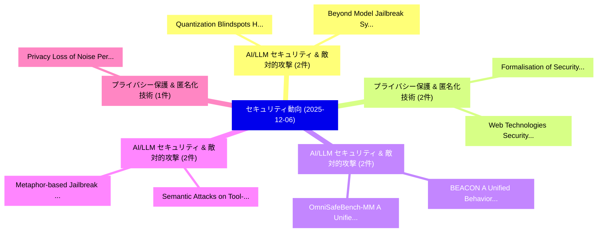

# 📅 02_daily: 日次エグゼクティブサマリー報告書 (2025-12-06)

**集計日時**: 2026-10-02 23:05:50 UTC  
**対象日付**: 2025-12-06  
**本日収集論文数**: 16 件  

---

## 💡 主要セキュリティ動向・脅威インサイト (Executive Insights)

本日の収集論文（計 16 件）において、以下の重点セキュリティ領域で活発な研究動向が確認されました：
- **AI/LLM セキュリティ & 敵対的攻撃** (2 件): 注目論文として 「Quantization Blindspots: How M...」、「Beyond Model Jailbreak: System...」 等が発表され、実務防御および攻撃検証の進展が見られます。
- **プライバシー保護 & 匿名化技術** (2 件): 注目論文として 「Web Technologies Security in t...」、「Formalisation of Security for ...」 等が発表され、実務防御および攻撃検証の進展が見られます。
- **AI/LLM セキュリティ & 敵対的攻撃** (2 件): 注目論文として 「BEACON: A Unified Behavioral-T...」、「OmniSafeBench-MM: A Unified Be...」 等が発表され、実務防御および攻撃検証の進展が見られます。
- **AI/LLM セキュリティ & 敵対的攻撃** (2 件): 注目論文として 「Semantic Attacks on Tool-Augme...」、「Metaphor-based Jailbreak Attac...」 等が発表され、実務防御および攻撃検証の進展が見られます。
- **プライバシー保護 & 匿名化技術** (1 件): 注目論文として 「Privacy Loss of Noise Perturba...」 等が発表され、実務防御および攻撃検証の進展が見られます。

### 🗺️ 技術・脅威トピックマインドマップ

---

## 📌 日次セキュリティ論文一覧 (日本語表形式)

| No | arXiv ID | 論文タイトル (日本語訳) | 重要キーワード | 構造化エグゼクティブ要約 (背景・提案・影響) | 脅威分類 | 詳細リンク |
|---|---|---|---|---|---|---|
| 1 | `2512.06243v1` | [Quantization Blindspots: How Model Compression Breaks Backdoor Defenses（セキュリティ分析論文）](../../okf/papers/2025-12-06/2512.06243.md) | `Quantization Blindspots`, `Rohan Pandey`, `Eric Ye` | 【提案】概要 (Overview & Key Finding) 本論文「Quantization Blindspots: How Model Compression Breaks B...。実証評価により経営層・セキュリティ管理者向け推奨アクション (E... | `executive-summary` | [arXiv](https://arxiv.org/abs/2512.06243v1) &#124; [OKF](../../okf/papers/2025-12-06/2512.06243.md) |
| 2 | `2512.06253v5` | [Privacy Loss of Noise Perturbation via Concentration A Product Measureの分析](../../okf/papers/2025-12-06/2512.06253.md) | `Privacy Loss`, `Noise Perturbation`, `Product Measure` | 【提案】概要 (Overview & Key Finding) 本論文「Privacy Loss of Noise Perturbation via Concentration A ...。実証評価により経営層・セキュリティ管理者向け推奨アクション (E... | `cybersecurity` | [arXiv](https://arxiv.org/abs/2512.06253v5) &#124; [OKF](../../okf/papers/2025-12-06/2512.06253.md) |
| 3 | `2512.06304v1` | [Degrading Voice: A Comprehensive Overview of Robust Voice Conversion Through Input Manipulation（セキュリティ分析論文）](../../okf/papers/2025-12-06/2512.06304.md) | `Degrading Voice`, `Comprehensive Overview`, `Robust Voice Conve` | 【提案】概要 (Overview & Key Finding) 本論文「Degrading Voice: A Comprehensive Overview of Robust Voi...。実証評価により経営層・セキュリティ管理者向け推奨アクション (E... | `cs.AI` | [arXiv](https://arxiv.org/abs/2512.06304v1) &#124; [OKF](../../okf/papers/2025-12-06/2512.06304.md) |
| 4 | `2512.06364v4` | [JEEVHITAA -- An HCAI Ecosystem to Support Collective Care（セキュリティ分析論文）](../../okf/papers/2025-12-06/2512.06364.md) | `Support Collective Care`, `Shyama Sastha Krishnamoorthy Srinivasan`, `Harsh Pala` | 【提案】概要 (Overview & Key Finding) 本論文「JEEVHITAA -- An HCAI Ecosystem to Support Collective Ca...。実証評価により経営層・セキュリティ管理者向け推奨アクション (E... | `cs.AI` | [arXiv](https://arxiv.org/abs/2512.06364v4) &#124; [OKF](../../okf/papers/2025-12-06/2512.06364.md) |
| 5 | `2512.06387v1` | [Beyond Model Jailbreak: Systematic Dissection of the "Ten DeadlySins" in Embodied Intelligence（セキュリティ分析論文）](../../okf/papers/2025-12-06/2512.06387.md) | `Beyond Model Jailbreak`, `Systematic Dissection`, `Embodied Intelligence` | 【提案】概要 (Overview & Key Finding) 本論文「Beyond Model ジェイルブレイク: Systematic Dissection of the "Te...。実証評価により経営層・セキュリティ管理者向け推奨アクション (E... | `executive-summary` | [arXiv](https://arxiv.org/abs/2512.06387v1) &#124; [OKF](../../okf/papers/2025-12-06/2512.06387.md) |
| 6 | `2512.06390v1` | [Web Technologies Security in the AI Era: A Survey of CDN-Enhanced Defenses（セキュリティ分析論文）](../../okf/papers/2025-12-06/2512.06390.md) | `Web Technologies Security`, `Enhanced Defenses`, `CDN-Enhanced Defenses` | 【提案】概要 (Overview & Key Finding) 本論文「Web Technologies Security in the AI Era: A Survey of CD...。実証評価により経営層・セキュリティ管理者向け推奨アクション (E... | `cs.NI` | [arXiv](https://arxiv.org/abs/2512.06390v1) &#124; [OKF](../../okf/papers/2025-12-06/2512.06390.md) |
| 7 | `2512.06396v1` | [AgenticCyber: A GenAI-Powered Multi-Agent System for Multimodal Threat Detection and Adaptive Response in サイバーセキュリティ](../../okf/papers/2025-12-06/2512.06396.md) | `Multimodal Threat Detection`, `Powered Multi`, `Agent System` | 【提案】概要 (Overview & Key Finding) 本論文「AgenticCyber: A GenAI-Powered Multi-Agent System for Mu...。実証評価により経営層・セキュリティ管理者向け推奨アクション (E... | `cs.AI` | [arXiv](https://arxiv.org/abs/2512.06396v1) &#124; [OKF](../../okf/papers/2025-12-06/2512.06396.md) |
| 8 | `2512.06411v1` | [KyFrog: A High-Security LWE-Based KEM Inspired by ML-KEM（セキュリティ分析論文）](../../okf/papers/2025-12-06/2512.06411.md) | `High-Security LWE`, `Victor Duarte Melo`, `Raw Meta` | 【提案】概要 (Overview & Key Finding) 本論文「KyFrog: A High-Security LWE-Based KEM Inspired by ML-KE...。実証評価によりBuchanan - **公開日時**: `202... | `executive-summary` | [arXiv](https://arxiv.org/abs/2512.06411v1) &#124; [OKF](../../okf/papers/2025-12-06/2512.06411.md) |
| 9 | `2512.06467v1` | [Formalisation of Security for 連合学習 with DP and Attacker Advantage in IIIf for Satellite Swarms -- Extended Version](../../okf/papers/2025-12-06/2512.06467.md) | `Attacker Advantage`, `Satellite Swarms`, `Extended Version` | 【提案】概要 (Overview & Key Finding) 本論文「Formalisation of Security for 連合学習 with DP and Attacker...。実証評価により経営層・セキュリティ管理者向け推奨アクション (E... | `cs.LO` | [arXiv](https://arxiv.org/abs/2512.06467v1) &#124; [OKF](../../okf/papers/2025-12-06/2512.06467.md) |
| 10 | `2512.06500v1` | [PDRIMA: A Policy-Driven Runtime Integrity Measurement and Attestation Approach for ARM TrustZone-based TEE（セキュリティ分析論文）](../../okf/papers/2025-12-06/2512.06500.md) | `Driven Runtime Integrity Measurement`, `Policy-Driven Runtime`, `TrustZone-based TEE` | 【提案】概要 (Overview & Key Finding) 本論文「PDRIMA: A Policy-Driven Runtime Integrity Measurement a...。実証評価により経営層・セキュリティ管理者向け推奨アクション (E... | `cybersecurity` | [arXiv](https://arxiv.org/abs/2512.06500v1) &#124; [OKF](../../okf/papers/2025-12-06/2512.06500.md) |
| 11 | `2512.06555v1` | [BEACON: A Unified Behavioral-Tactical Framework for Explainable Cybercrime Analysis with 大規模言語モデル](../../okf/papers/2025-12-06/2512.06555.md) | `Unified Behavioral`, `Large Language Models`, `Sandeep Kumar Shukla` | 【提案】概要 (Overview & Key Finding) 本論文「BEACON: A Unified Behavioral-Tactical Framework for Exp...。実証評価により経営層・セキュリティ管理者向け推奨アクション (E... | `cs.AI` | [arXiv](https://arxiv.org/abs/2512.06555v1) &#124; [OKF](../../okf/papers/2025-12-06/2512.06555.md) |
| 12 | `2512.06556v2` | [Semantic Attacks on Tool-Augmented LLMs: the Model Context Protocol Against Descriptor-Level Manipulationのセキュリティ強化](../../okf/papers/2025-12-06/2512.06556.md) | `Semantic Attacks`, `Tool-Augmented LLMs`, `Level Manipulation` | 【提案】概要 (Overview & Key Finding) 本論文「Semantic Attacks on Tool-Augmented LLMs: the Model Cont...。実証評価により経営層・セキュリティ管理者向け推奨アクション (E... | `cs.AI` | [arXiv](https://arxiv.org/abs/2512.06556v2) &#124; [OKF](../../okf/papers/2025-12-06/2512.06556.md) |
| 13 | `2512.06557v1` | [Characterizing Large-Scale Adversarial Activities Through Large-Scale Honey-Nets（セキュリティ分析論文）](../../okf/papers/2025-12-06/2512.06557.md) | `Characterizing Large`, `Scale Honey`, `Large-Scale Adversarial` | 【提案】概要 (Overview & Key Finding) 本論文「Characterizing Large-Scale Adversarial Activities Throu...。実証評価により経営層・セキュリティ管理者向け推奨アクション (E... | `executive-summary` | [arXiv](https://arxiv.org/abs/2512.06557v1) &#124; [OKF](../../okf/papers/2025-12-06/2512.06557.md) |
| 14 | `2512.06589v1` | [OmniSafeBench-MM: A Unified Benchmark and Toolbox for Multimodal Jailbreak Attack-Defense Evaluation（セキュリティ分析論文）](../../okf/papers/2025-12-06/2512.06589.md) | `Multimodal Jailbreak Attack`, `Unified Benchmark`, `Xiaojun Jia` | 【提案】概要 (Overview & Key Finding) 本論文「OmniSafeBench-MM: A Unified Benchmark and Toolbox for M...。実証評価により経営層・セキュリティ管理者向け推奨アクション (E... | `cs.CV` | [arXiv](https://arxiv.org/abs/2512.06589v1) &#124; [OKF](../../okf/papers/2025-12-06/2512.06589.md) |
| 15 | `2512.10766v2` | [Metaphor-based Jailbreak Attacks on Text-to-Image Models（セキュリティ分析論文）](../../okf/papers/2025-12-06/2512.10766.md) | `Jailbreak Attacks`, `Image Models`, `Metaphor-based Jailbreak` | 【提案】概要 (Overview & Key Finding) 本論文「Metaphor-based ジェイルブレイク Attacks on Text-to-Image Models...。実証評価により経営層・セキュリティ管理者向け推奨アクション (E... | `cs.AI` | [arXiv](https://arxiv.org/abs/2512.10766v2) &#124; [OKF](../../okf/papers/2025-12-06/2512.10766.md) |
| 16 | `2512.13709v1` | [Smart Surveillance: Identifying IoT Device Behaviours using ML-Powered Traffic Analysis（セキュリティ分析論文）](../../okf/papers/2025-12-06/2512.13709.md) | `Smart Surveillance`, `Device Behaviours`, `ML-Powered Traffic` | 【提案】概要 (Overview & Key Finding) 本論文「Smart Surveillance: Identifying IoT Device Behaviours u...。実証評価により経営層・セキュリティ管理者向け推奨アクション (E... | `executive-summary` | [arXiv](https://arxiv.org/abs/2512.13709v1) &#124; [OKF](../../okf/papers/2025-12-06/2512.13709.md) |

