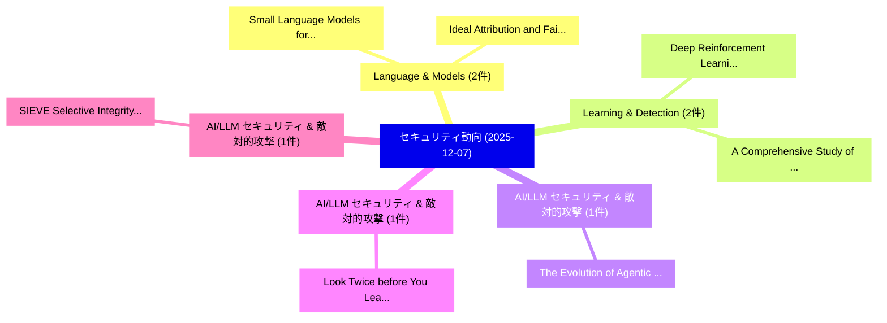

# 📅 02_daily: 日次エグゼクティブサマリー報告書 (2025-12-07)

**集計日時**: 2026-10-02 23:05:50 UTC  
**対象日付**: 2025-12-07  
**本日収集論文数**: 17 件  

---

## 💡 主要セキュリティ動向・脅威インサイト (Executive Insights)

本日の収集論文（計 17 件）において、以下の重点セキュリティ領域で活発な研究動向が確認されました：
- **Language & Models** (2 件): 注目論文として 「Small Language Models for Secu...」、「Ideal Attribution and Faithful...」 等が発表され、実務防御および攻撃検証の進展が見られます。
- **Learning & Detection** (2 件): 注目論文として 「Deep Reinforcement Learning fo...」、「A Comprehensive Study of Super...」 等が発表され、実務防御および攻撃検証の進展が見られます。
- **AI/LLM セキュリティ & 敵対的攻撃** (1 件): 注目論文として 「The Evolution of Agentic AI in...」 等が発表され、実務防御および攻撃検証の進展が見られます。
- **AI/LLM セキュリティ & 敵対的攻撃** (1 件): 注目論文として 「Look Twice before You Leap: A ...」 等が発表され、実務防御および攻撃検証の進展が見られます。
- **AI/LLM セキュリティ & 敵対的攻撃** (1 件): 注目論文として 「SIEVE: Selective Integrity Ver...」 等が発表され、実務防御および攻撃検証の進展が見られます。

### 🗺️ 技術・脅威トピックマインドマップ

---

## 📌 日次セキュリティ論文一覧 (日本語表形式)

| No | arXiv ID | 論文タイトル (日本語訳) | 重要キーワード | 構造化エグゼクティブ要約 (背景・提案・影響) | 脅威分類 | 詳細リンク |
|---|---|---|---|---|---|---|
| 1 | `2512.06659v1` | [The Evolution of Agentic AI in サイバーセキュリティ: From Single LLM Reasoners to Multi-Agent Systems and Autonomous Pipelines](../../okf/papers/2025-12-07/2512.06659.md) | `Agent Systems`, `Autonomous Pipelines`, `Multi-Agent Systems` | 【提案】概要 (Overview & Key Finding) 本論文「The Evolution of Agentic AI in サイバーセキュリティ: From Single ...。実証評価により経営層・セキュリティ管理者向け推奨アクション (E... | `cybersecurity` | [arXiv](https://arxiv.org/abs/2512.06659v1) &#124; [OKF](../../okf/papers/2025-12-07/2512.06659.md) |
| 2 | `2512.06660v2` | [Small Language Models for Security Query Generation in SOC Workflowsに向けて](../../okf/papers/2025-12-07/2512.06660.md) | `Security Query Generation`, `Towards Small Language Models`, `Small Language Models` | 【提案】概要 (Overview & Key Finding) 本論文「Small Language Models for Security Query Generation in ...。実証評価により経営層・セキュリティ管理者向け推奨アクション (E... | `cs.AI` | [arXiv](https://arxiv.org/abs/2512.06660v2) &#124; [OKF](../../okf/papers/2025-12-07/2512.06660.md) |
| 3 | `2512.06713v3` | [Look Twice before You Leap: A Rational Framework for Localized Adversarial Anonymization（セキュリティ分析論文）](../../okf/papers/2025-12-07/2512.06713.md) | `Localized Adversarial Anonymization`, `Look Twice`, `Donghang Duan` | 【提案】概要 (Overview & Key Finding) 本論文「Look Twice before You Leap: A Rational Framework for Lo...。実証評価により経営層・セキュリティ管理者向け推奨アクション (E... | `executive-summary` | [arXiv](https://arxiv.org/abs/2512.06713v3) &#124; [OKF](../../okf/papers/2025-12-07/2512.06713.md) |
| 4 | `2512.06716v3` | [SIEVE: Selective Integrity Verification and Escalation for Defending LLMエージェント against Indirect Prompt Injection](../../okf/papers/2025-12-07/2512.06716.md) | `Selective Integrity Verification`, `Indirect Prompt Injection`, `Zhibo Liang` | 【提案】概要 (Overview & Key Finding) 本論文「SIEVE: Selective Integrity Verification and Escalation ...。実証評価により経営層・セキュリティ管理者向け推奨アクション (E... | `cs.AI` | [arXiv](https://arxiv.org/abs/2512.06716v3) &#124; [OKF](../../okf/papers/2025-12-07/2512.06716.md) |
| 5 | `2512.06747v1` | [PrivLLMSwarm: Privacy-Preserving LLM-Driven UAV Swarms for Secure IoT Surveillance（セキュリティ分析論文）](../../okf/papers/2025-12-07/2512.06747.md) | `Privacy-Preserving LLM`, `Jifar Wakuma Ayana`, `Huang Qiming` | 【提案】概要 (Overview & Key Finding) 本論文「PrivLLMSwarm: Privacy-Preserving LLM-Driven UAV Swarms ...。実証評価により経営層・セキュリティ管理者向け推奨アクション (E... | `cs.AI` | [arXiv](https://arxiv.org/abs/2512.06747v1) &#124; [OKF](../../okf/papers/2025-12-07/2512.06747.md) |
| 6 | `2512.06781v3` | [From Description to Score: Can LLMs Quantify Vulnerabilities?（セキュリティ分析論文）](../../okf/papers/2025-12-07/2512.06781.md) | `Quantify Vulnerabilities`, `Sima Jafarikhah`, `Daniel Thompson` | 【提案】### (日本語題名: From Description to Score: Can LLMs Quantify Vulnerabilities?（セキュリティ分析論文）) ...。実証評価により経営層・セキュリティ管理者向け推奨アクション (E... | `cs.PL` | [arXiv](https://arxiv.org/abs/2512.06781v3) &#124; [OKF](../../okf/papers/2025-12-07/2512.06781.md) |
| 7 | `2512.06846v2` | [CKG-LLM: LLM-Assisted Smart Contract Access Control Vulnerabilities Based on Knowledge Graphsの検出](../../okf/papers/2025-12-07/2512.06846.md) | `Assisted Smart Contract Access Control Vulnerabilities Based`, `Smart Contract Access Control Vulnerabilities Based`, `LLM-Assisted Smart` | 【提案】概要 (Overview & Key Finding) 本論文「CKG-LLM: LLM-Assisted スマートコントラクト アクセス制御 Vulnerabilities...。実証評価により経営層・セキュリティ管理者向け推奨アクション (E... | `cybersecurity` | [arXiv](https://arxiv.org/abs/2512.06846v2) &#124; [OKF](../../okf/papers/2025-12-07/2512.06846.md) |
| 8 | `2512.06899v2` | [Patronus: Identifying and Mitigating Transferable Backdoors in Pre-trained Language Models（セキュリティ分析論文）](../../okf/papers/2025-12-07/2512.06899.md) | `Mitigating Transferable Backdoors`, `Language Models`, `Pre-trained Language` | 【提案】概要 (Overview & Key Finding) 本論文「Patronus: Identifying and Mitigating Transferable Backd...。実証評価により経営層・セキュリティ管理者向け推奨アクション (E... | `cybersecurity` | [arXiv](https://arxiv.org/abs/2512.06899v2) &#124; [OKF](../../okf/papers/2025-12-07/2512.06899.md) |
| 9 | `2512.06906v2` | [MINES: Explainable Anomaly Detection through Web API Invariant Inference（セキュリティ分析論文）](../../okf/papers/2025-12-07/2512.06906.md) | `Explainable Anomaly Detection`, `Invariant Inference`, `Chun Fung Amos Kwok` | 【提案】概要 (Overview & Key Finding) 本論文「MINES: Explainable Anomaly Detection through Web API In...。実証評価により経営層・セキュリティ管理者向け推奨アクション (E... | `cs.DB` | [arXiv](https://arxiv.org/abs/2512.06906v2) &#124; [OKF](../../okf/papers/2025-12-07/2512.06906.md) |
| 10 | `2512.06914v2` | [SoK: Trust-Authorization Mismatch in LLM Agent Interactions（セキュリティ分析論文）](../../okf/papers/2025-12-07/2512.06914.md) | `Authorization Mismatch`, `Agent Interactions`, `Trust-Authorization Mismatch` | 【提案】概要 (Overview & Key Finding) 本論文「SoK: Trust-Authorization Mismatch in LLM Agent Interact...。実証評価により経営層・セキュリティ管理者向け推奨アクション (E... | `cs.AI` | [arXiv](https://arxiv.org/abs/2512.06914v2) &#124; [OKF](../../okf/papers/2025-12-07/2512.06914.md) |
| 11 | `2512.06925v1` | [Deep Reinforcement Learning for Phishing Detection with Transformer-Based Semantic Features（セキュリティ分析論文）](../../okf/papers/2025-12-07/2512.06925.md) | `Deep Reinforcement Learning`, `Based Semantic Features`, `Phishing Detection` | 【提案】概要 (Overview & Key Finding) 本論文「Deep Reinforcement Learning for Phishing Detection with...。実証評価により経営層・セキュリティ管理者向け推奨アクション (E... | `cs.AI` | [arXiv](https://arxiv.org/abs/2512.06925v1) &#124; [OKF](../../okf/papers/2025-12-07/2512.06925.md) |
| 12 | `2512.06971v1` | [Prediction with Expert Advice under Local Differential Privacy（セキュリティ分析論文）](../../okf/papers/2025-12-07/2512.06971.md) | `Local Differential Privacy`, `Expert Advice`, `Ben Jacobsen` | 【提案】概要 (Overview & Key Finding) 本論文「Prediction with Expert Advice under Local 差分プライバシー（セキュリ...。実証評価により経営層・セキュリティ管理者向け推奨アクション (E... | `executive-summary` | [arXiv](https://arxiv.org/abs/2512.06971v1) &#124; [OKF](../../okf/papers/2025-12-07/2512.06971.md) |
| 13 | `2512.07030v1` | [A Comprehensive Study of Supervised Machine Learning Models for Zero-Day Attack Detection: Analyzing Performance on Imbalanced Data（セキュリティ分析論文）](../../okf/papers/2025-12-07/2512.07030.md) | `Supervised Machine Learning Models`, `Day Attack Detection`, `Analyzing Performance` | 【提案】概要 (Overview & Key Finding) 本論文「A Comprehensive Study of Supervised Machine Learning Mo...。実証評価により経営層・セキュリティ管理者向け推奨アクション (E... | `cs.AI` | [arXiv](https://arxiv.org/abs/2512.07030v1) &#124; [OKF](../../okf/papers/2025-12-07/2512.07030.md) |
| 14 | `2512.07033v1` | [Managed TLS Under Migration: Authentication Authority Across CDN and Hosting Transitions（セキュリティ分析論文）](../../okf/papers/2025-12-07/2512.07033.md) | `Authentication Authority Across`, `Hosting Transitions`, `Daniyal Ganiuly` | 【提案】概要 (Overview & Key Finding) 本論文「Managed TLS Under Migration: Authentication Authority A...。実証評価により経営層・セキュリティ管理者向け推奨アクション (E... | `cs.NI` | [arXiv](https://arxiv.org/abs/2512.07033v1) &#124; [OKF](../../okf/papers/2025-12-07/2512.07033.md) |
| 15 | `2512.07038v1` | [Ideal Attribution and Faithful Watermarks for Language Models（セキュリティ分析論文）](../../okf/papers/2025-12-07/2512.07038.md) | `Ideal Attribution`, `Faithful Watermarks`, `Language Models` | 【提案】概要 (Overview & Key Finding) 本論文「Ideal Attribution and Faithful Watermarks for Language ...。実証評価により経営層・セキュリティ管理者向け推奨アクション (E... | `executive-summary` | [arXiv](https://arxiv.org/abs/2512.07038v1) &#124; [OKF](../../okf/papers/2025-12-07/2512.07038.md) |
| 16 | `2512.11878v3` | [A Technical Policy Blueprint for Trustworthy Decentralized AI（セキュリティ分析論文）](../../okf/papers/2025-12-07/2512.11878.md) | `Technical Policy Blueprint`, `Trustworthy Decentralized`, `Hasan Kassem` | 【提案】概要 (Overview & Key Finding) 本論文「A Technical Policy Blueprint for Trustworthy Decentrali...。実証評価により経営層・セキュリティ管理者向け推奨アクション (E... | `executive-summary` | [arXiv](https://arxiv.org/abs/2512.11878v3) &#124; [OKF](../../okf/papers/2025-12-07/2512.11878.md) |
| 17 | `2601.11550v1` | [Uniqueness ratio as a predictor of a privacy leakage（セキュリティ分析論文）](../../okf/papers/2025-12-07/2601.11550.md) | `Raw Meta`, `Executive Summary`, `Key Finding` | 【提案】概要 (Overview & Key Finding) 本論文「Uniqueness ratio as a predictor of a privacy leakage（セキ...。実証評価によりAlSalem AlKhashti - **公開日... | `cs.DB` | [arXiv](https://arxiv.org/abs/2601.11550v1) &#124; [OKF](../../okf/papers/2025-12-07/2601.11550.md) |

