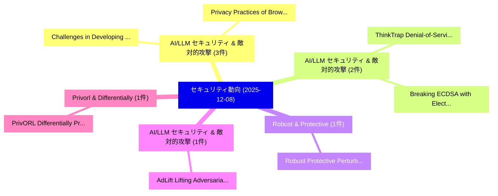

# 📅 02_daily: 日次エグゼクティブサマリー報告書 (2025-12-08)

**集計日時**: 2026-10-02 23:05:50 UTC  
**対象日付**: 2025-12-08  
**本日収集論文数**: 17 件  

---

## 💡 主要セキュリティ動向・脅威インサイト (Executive Insights)

本日の収集論文（計 17 件）において、以下の重点セキュリティ領域で活発な研究動向が確認されました：
- **AI/LLM セキュリティ & 敵対的攻撃** (3 件): 注目論文として 「Challenges in Developing Secur...」、「Privacy Practices of Browser A...」 等が発表され、実務防御および攻撃検証の進展が見られます。
- **AI/LLM セキュリティ & 敵対的攻撃** (2 件): 注目論文として 「ThinkTrap: Denial-of-Service A...」、「Breaking ECDSA with Electromag...」 等が発表され、実務防御および攻撃検証の進展が見られます。
- **Robust & Protective** (1 件): 注目論文として 「Robust Protective Perturbation...」 等が発表され、実務防御および攻撃検証の進展が見られます。
- **AI/LLM セキュリティ & 敵対的攻撃** (1 件): 注目論文として 「AdLift: Lifting Adversarial Pe...」 等が発表され、実務防御および攻撃検証の進展が見られます。
- **Privorl & Differentially** (1 件): 注目論文として 「PrivORL: Differentially Privat...」 等が発表され、実務防御および攻撃検証の進展が見られます。

### 🗺️ 技術・脅威トピックマインドマップ

---

## 📌 日次セキュリティ論文一覧 (日本語表形式)

| No | arXiv ID | 論文タイトル (日本語訳) | 重要キーワード | 構造化エグゼクティブ要約 (背景・提案・影響) | 脅威分類 | 詳細リンク |
|---|---|---|---|---|---|---|
| 1 | `2512.07086v1` | [ThinkTrap: Denial-of-Service Attacks against Black-box LLM Services via Infinite Thinking（セキュリティ分析論文）](../../okf/papers/2025-12-08/2512.07086.md) | `Service Attacks`, `Infinite Thinking`, `Black-box LLM` | 【提案】概要 (Overview & Key Finding) 本論文「ThinkTrap: Denial-of-Service Attacks against Black-box ...。実証評価により経営層・セキュリティ管理者向け推奨アクション (E... | `cs.AI` | [arXiv](https://arxiv.org/abs/2512.07086v1) &#124; [OKF](../../okf/papers/2025-12-08/2512.07086.md) |
| 2 | `2512.07228v1` | [Robust Protective Perturbation against DeepFake Face Swappingに向けて](../../okf/papers/2025-12-08/2512.07228.md) | `Towards Robust Protective Perturbation`, `Robust Protective Perturbation`, `Face Swapping` | 【提案】概要 (Overview & Key Finding) 本論文「Robust Protective Perturbation against DeepFake Face Sw...。実証評価により経営層・セキュリティ管理者向け推奨アクション (E... | `cs.AI` | [arXiv](https://arxiv.org/abs/2512.07228v1) &#124; [OKF](../../okf/papers/2025-12-08/2512.07228.md) |
| 3 | `2512.07247v1` | [AdLift: Lifting Adversarial Perturbations to Safeguard 3D Gaussian Splatting Assets Against Instruction-Driven Editing（セキュリティ分析論文）](../../okf/papers/2025-12-08/2512.07247.md) | `Lifting Adversarial Perturbations`, `Driven Editing`, `Instruction-Driven Editing` | 【提案】概要 (Overview & Key Finding) 本論文「AdLift: Lifting Adversarial Perturbations to Safeguard ...。実証評価により経営層・セキュリティ管理者向け推奨アクション (E... | `cs.CV` | [arXiv](https://arxiv.org/abs/2512.07247v1) &#124; [OKF](../../okf/papers/2025-12-08/2512.07247.md) |
| 4 | `2512.07292v2` | [Breaking ECDSA with Electromagnetic Side-Channel Attacks: Challenges and Practicality on Modern Smartphones（セキュリティ分析論文）](../../okf/papers/2025-12-08/2512.07292.md) | `Electromagnetic Side`, `Channel Attacks`, `Modern Smartphones` | 【提案】概要 (Overview & Key Finding) 本論文「Breaking ECDSA with Electromagnetic サイドチャネル攻撃 Attacks: ...。実証評価により経営層・セキュリティ管理者向け推奨アクション (E... | `cybersecurity` | [arXiv](https://arxiv.org/abs/2512.07292v2) &#124; [OKF](../../okf/papers/2025-12-08/2512.07292.md) |
| 5 | `2512.07342v2` | [PrivORL: Differentially Private Synthetic Dataset for Offline Reinforcement Learning（セキュリティ分析論文）](../../okf/papers/2025-12-08/2512.07342.md) | `Differentially Private Synthetic Dataset`, `Offline Reinforcement Learning`, `Offline Reinforcement Learni` | 【提案】概要 (Overview & Key Finding) 本論文「PrivORL: Differentially Private Synthetic Dataset for O...。実証評価により経営層・セキュリティ管理者向け推奨アクション (E... | `executive-summary` | [arXiv](https://arxiv.org/abs/2512.07342v2) &#124; [OKF](../../okf/papers/2025-12-08/2512.07342.md) |
| 6 | `2512.07368v1` | [Challenges in Developing Secure Software -- Results of an Interview Study in the German Software Industry（セキュリティ分析論文）](../../okf/papers/2025-12-08/2512.07368.md) | `Developing Secure Software`, `German Software Industry`, `Timo Langstrof` | 【提案】概要 (Overview & Key Finding) 本論文「Challenges in Developing Secure Software -- Results of ...。実証評価により経営層・セキュリティ管理者向け推奨アクション (E... | `executive-summary` | [arXiv](https://arxiv.org/abs/2512.07368v1) &#124; [OKF](../../okf/papers/2025-12-08/2512.07368.md) |
| 7 | `2512.07495v1` | [Amulet: Fast TEE-Shielded Inference for On-Device Model Protection（セキュリティ分析論文）](../../okf/papers/2025-12-08/2512.07495.md) | `Device Model Protection`, `Shielded Inference`, `TEE-Shielded Inference` | 【提案】概要 (Overview & Key Finding) 本論文「Amulet: Fast TEE-Shielded Inference for On-Device Model...。実証評価により経営層・セキュリティ管理者向け推奨アクション (E... | `cybersecurity` | [arXiv](https://arxiv.org/abs/2512.07495v1) &#124; [OKF](../../okf/papers/2025-12-08/2512.07495.md) |
| 8 | `2512.07520v1` | [aLEAKator: HDL Mixed-Domain Simulation for Masked Hardware \& Software Formal Verification（セキュリティ分析論文）](../../okf/papers/2025-12-08/2512.07520.md) | `Software Formal Verification`, `Domain Simulation`, `Masked Hardware` | 【提案】概要 (Overview & Key Finding) 本論文「aLEAKator: HDL Mixed-Domain Simulation for Masked Hardw...。実証評価により経営層・セキュリティ管理者向け推奨アクション (E... | `executive-summary` | [arXiv](https://arxiv.org/abs/2512.07520v1) &#124; [OKF](../../okf/papers/2025-12-08/2512.07520.md) |
| 9 | `2512.07533v1` | [VulnLLM-R: Specialized Reasoning LLM with Agent Scaffold for 脆弱性検出](../../okf/papers/2025-12-08/2512.07533.md) | `Specialized Reasoning`, `Agent Scaffold`, `Vulnerability Detection` | 【提案】概要 (Overview & Key Finding) 本論文「VulnLLM-R: Specialized Reasoning LLM with Agent Scaffol...。実証評価により経営層・セキュリティ管理者向け推奨アクション (E... | `cs.AI` | [arXiv](https://arxiv.org/abs/2512.07533v1) &#124; [OKF](../../okf/papers/2025-12-08/2512.07533.md) |
| 10 | `2512.07574v1` | [Precise Liver Tumor Segmentation in CT Using a Hybrid Deep Learning-Radiomics Framework（セキュリティ分析論文）](../../okf/papers/2025-12-08/2512.07574.md) | `Precise Liver Tumor Segmentation`, `Hybrid Deep Learning`, `Xuecheng Li` | 【提案】概要 (Overview & Key Finding) 本論文「Precise Liver Tumor Segmentation in CT Using a Hybrid D...。実証評価により経営層・セキュリティ管理者向け推奨アクション (E... | `cs.CV` | [arXiv](https://arxiv.org/abs/2512.07574v1) &#124; [OKF](../../okf/papers/2025-12-08/2512.07574.md) |
| 11 | `2512.07725v1` | [Privacy Practices of Browser Agents（セキュリティ分析論文）](../../okf/papers/2025-12-08/2512.07725.md) | `Privacy Practices`, `Browser Agents`, `Ali Shahin Shamsabadi` | 【提案】概要 (Overview & Key Finding) 本論文「Privacy Practices of Browser Agents（セキュリティ分析論文）」（原題: Pr...。実証評価により経営層・セキュリティ管理者向け推奨アクション (E... | `cybersecurity` | [arXiv](https://arxiv.org/abs/2512.07725v1) &#124; [OKF](../../okf/papers/2025-12-08/2512.07725.md) |
| 12 | `2512.07814v2` | [Understanding Privacy Risks in Code Models Through Training Dynamics: A Causal Approach（セキュリティ分析論文）](../../okf/papers/2025-12-08/2512.07814.md) | `Understanding Privacy Risks`, `Understanding Privacy Ri`, `Hua Yang` | 【提案】概要 (Overview & Key Finding) 本論文「Understanding Privacy Risks in Code Models Through Trai...。実証評価により経営層・セキュリティ管理者向け推奨アクション (E... | `cs.AI` | [arXiv](https://arxiv.org/abs/2512.07814v2) &#124; [OKF](../../okf/papers/2025-12-08/2512.07814.md) |
| 13 | `2512.07827v1` | [An Adaptive Multi-Layered Honeynet Architecture for Threat Behavior Analysis via Deep Learning（セキュリティ分析論文）](../../okf/papers/2025-12-08/2512.07827.md) | `Layered Honeynet Architecture`, `Multi-Layered Honeynet`, `Deep Learning` | 【提案】概要 (Overview & Key Finding) 本論文「An Adaptive Multi-Layered Honeynet Architecture for 脅威 ...。実証評価により経営層・セキュリティ管理者向け推奨アクション (E... | `executive-summary` | [arXiv](https://arxiv.org/abs/2512.07827v1) &#124; [OKF](../../okf/papers/2025-12-08/2512.07827.md) |
| 14 | `2512.07909v1` | [Agentic Artificial Intelligence for Ethical サイバーセキュリティ in Uganda: A Reinforcement Learning Framework for Threat Detection in Resource-Constrained Environments](../../okf/papers/2025-12-08/2512.07909.md) | `Agentic Artificial Intelligence`, `Threat Detection`, `Constrained Environments` | 【提案】概要 (Overview & Key Finding) 本論文「Agentic Artificial Intelligence for Ethical サイバーセキュリティ ...。実証評価により経営層・セキュリティ管理者向け推奨アクション (E... | `executive-summary` | [arXiv](https://arxiv.org/abs/2512.07909v1) &#124; [OKF](../../okf/papers/2025-12-08/2512.07909.md) |
| 15 | `2512.08067v1` | [CapsuleFS A Multi-credential DataCapsule Filesystem（セキュリティ分析論文）](../../okf/papers/2025-12-08/2512.08067.md) | `Multi-credential DataCapsule`, `Qingyang Hu`, `Yucheng Huang` | 【提案】概要 (Overview & Key Finding) 本論文「CapsuleFS A Multi-credential DataCapsule Filesystem（セキュ...。実証評価により経営層・セキュリティ管理者向け推奨アクション (E... | `executive-summary` | [arXiv](https://arxiv.org/abs/2512.08067v1) &#124; [OKF](../../okf/papers/2025-12-08/2512.08067.md) |
| 16 | `2512.08104v3` | [AgentCrypt: Advancing Privacy and (Secure) Computation in AI Agent Collaboration（セキュリティ分析論文）](../../okf/papers/2025-12-08/2512.08104.md) | `Advancing Privacy`, `Agent Collaboration`, `Udari Madhushani Sehwag` | 【提案】概要 (Overview & Key Finding) 本論文「AgentCrypt: Advancing Privacy and (Secure) Computation ...。実証評価により経営層・セキュリティ管理者向け推奨アクション (E... | `cybersecurity` | [arXiv](https://arxiv.org/abs/2512.08104v3) &#124; [OKF](../../okf/papers/2025-12-08/2512.08104.md) |
| 17 | `2512.08107v1` | [Detecting Ambiguity Aversion in Cyberattack Behavior to Inform Cognitive Defense Strategies（セキュリティ分析論文）](../../okf/papers/2025-12-08/2512.08107.md) | `Detecting Ambiguity Aversion`, `Inform Cognitive Defense Strategies`, `Cyberattack Behavior` | 【提案】概要 (Overview & Key Finding) 本論文「Detecting Ambiguity Aversion in Cyberattack Behavior to...。実証評価により経営層・セキュリティ管理者向け推奨アクション (E... | `executive-summary` | [arXiv](https://arxiv.org/abs/2512.08107v1) &#124; [OKF](../../okf/papers/2025-12-08/2512.08107.md) |

