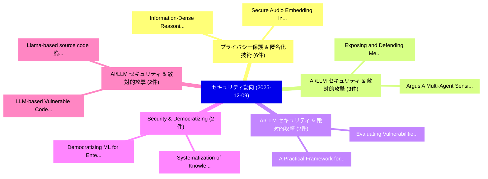

# 📅 02_daily: 日次エグゼクティブサマリー報告書 (2025-12-09)

**集計日時**: 2026-10-02 23:05:50 UTC  
**対象日付**: 2025-12-09  
**本日収集論文数**: 34 件  

---

## 💡 主要セキュリティ動向・脅威インサイト (Executive Insights)

本日の収集論文（計 34 件）において、以下の重点セキュリティ領域で活発な研究動向が確認されました：
- **プライバシー保護 & 匿名化技術** (6 件): 注目論文として 「Information-Dense Reasoning fo...」、「Secure Audio Embedding in Imag...」 等が発表され、実務防御および攻撃検証の進展が見られます。
- **AI/LLM セキュリティ & 敵対的攻撃** (3 件): 注目論文として 「Exposing and Defending Members...」、「Argus: A Multi-Agent Sensitive...」 等が発表され、実務防御および攻撃検証の進展が見られます。
- **AI/LLM セキュリティ & 敵対的攻撃** (2 件): 注目論文として 「A Practical Framework for Eval...」、「Evaluating Vulnerabilities of ...」 等が発表され、実務防御および攻撃検証の進展が見られます。
- **Security & Democratizing** (2 件): 注目論文として 「Systematization of Knowledge: ...」、「Democratizing ML for Enterpris...」 等が発表され、実務防御および攻撃検証の進展が見られます。
- **AI/LLM セキュリティ & 敵対的攻撃** (2 件): 注目論文として 「LLM-based Vulnerable Code Augm...」、「Llama-based source code 脆弱性検出:...」 等が発表され、実務防御および攻撃検証の進展が見られます。

### 🗺️ 技術・脅威トピックマインドマップ

---

## 📌 日次セキュリティ論文一覧 (日本語表形式)

| No | arXiv ID | 論文タイトル (日本語訳) | 重要キーワード | 構造化エグゼクティブ要約 (背景・提案・影響) | 脅威分類 | 詳細リンク |
|---|---|---|---|---|---|---|
| 1 | `2512.08169v1` | [Information-Dense Reasoning for Efficient and Auditable Security Alert Triage（セキュリティ分析論文）](../../okf/papers/2025-12-09/2512.08169.md) | `Auditable Security Alert Triage`, `Dense Reasoning`, `Information-Dense Reasoning` | 【提案】概要 (Overview & Key Finding) 本論文「Information-Dense Reasoning for Efficient and Auditable...。実証評価により経営層・セキュリティ管理者向け推奨アクション (E... | `cs.AI` | [arXiv](https://arxiv.org/abs/2512.08169v1) &#124; [OKF](../../okf/papers/2025-12-09/2512.08169.md) |
| 2 | `2512.08172v1` | [Security Integer Learning with Errors with Rejection Samplingの分析](../../okf/papers/2025-12-09/2512.08172.md) | `Security Integer Learning`, `Integer Learning`, `Rejection Sampling` | 【提案】概要 (Overview & Key Finding) 本論文「Security Integer Learning with Errors with Rejection Sa...。実証評価により経営層・セキュリティ管理者向け推奨アクション (E... | `executive-summary` | [arXiv](https://arxiv.org/abs/2512.08172v1) &#124; [OKF](../../okf/papers/2025-12-09/2512.08172.md) |
| 3 | `2512.08185v1` | [A Practical Framework for Evaluating Medical AI Security: Reproducible Assessment of Jailbreaking and Privacy Vulnerabilities Across Clinical Specialties（セキュリティ分析論文）](../../okf/papers/2025-12-09/2512.08185.md) | `Privacy Vulnerabilities Across Clinical Specialties`, `Evaluating Medical`, `Reproducible Assessment` | 【提案】概要 (Overview & Key Finding) 本論文「A Practical Framework for Evaluating Medical AI Securit...。実証評価により経営層・セキュリティ管理者向け推奨アクション (E... | `cs.AI` | [arXiv](https://arxiv.org/abs/2512.08185v1) &#124; [OKF](../../okf/papers/2025-12-09/2512.08185.md) |
| 4 | `2512.08204v1` | [Evaluating Vulnerabilities of Connected Vehicles Under Cyber Attacks by Attack-Defense Tree（セキュリティ分析論文）](../../okf/papers/2025-12-09/2512.08204.md) | `Evaluating Vulnerabilities`, `Defense Tree`, `Attack-Defense Tree` | 【提案】概要 (Overview & Key Finding) 本論文「Evaluating Vulnerabilities of Connected Vehicles Under ...。実証評価により経営層・セキュリティ管理者向け推奨アクション (E... | `cs.NI` | [arXiv](https://arxiv.org/abs/2512.08204v1) &#124; [OKF](../../okf/papers/2025-12-09/2512.08204.md) |
| 5 | `2512.08289v3` | [MIRAGE: Misleading Retrieval-Augmented Generation via Black-box and Query-agnostic Poisoning Attacks（セキュリティ分析論文）](../../okf/papers/2025-12-09/2512.08289.md) | `Misleading Retrieval`, `Augmented Generation`, `Poisoning Attacks` | 【提案】概要 (Overview & Key Finding) 本論文「MIRAGE: Misleading Retrieval-Augmented Generation via B...。実証評価により経営層・セキュリティ管理者向け推奨アクション (E... | `cybersecurity` | [arXiv](https://arxiv.org/abs/2512.08289v3) &#124; [OKF](../../okf/papers/2025-12-09/2512.08289.md) |
| 6 | `2512.08290v2` | [Systematization of Knowledge: Security and Safety in the Model Context Protocol Ecosystem（セキュリティ分析論文）](../../okf/papers/2025-12-09/2512.08290.md) | `Model Context Protocol Ecosystem`, `Shiva Gaire`, `Srijan Gyawali` | 【提案】概要 (Overview & Key Finding) 本論文「Systematization of Knowledge: Security and Safety in th...。実証評価により経営層・セキュリティ管理者向け推奨アクション (E... | `cs.AI` | [arXiv](https://arxiv.org/abs/2512.08290v2) &#124; [OKF](../../okf/papers/2025-12-09/2512.08290.md) |
| 7 | `2512.08291v1` | [Exposing and Defending Membership Leakage in Vulnerability Prediction Models（セキュリティ分析論文）](../../okf/papers/2025-12-09/2512.08291.md) | `Defending Membership Leakage`, `Vulnerability Prediction Models`, `Yihan Liao` | 【提案】概要 (Overview & Key Finding) 本論文「Exposing and Defending Membership Leakage in 脆弱性 Predic...。実証評価により経営層・セキュリティ管理者向け推奨アクション (E... | `executive-summary` | [arXiv](https://arxiv.org/abs/2512.08291v1) &#124; [OKF](../../okf/papers/2025-12-09/2512.08291.md) |
| 8 | `2512.08299v1` | [Secure Audio Embedding in Images using Nature-Inspired Optimization（セキュリティ分析論文）](../../okf/papers/2025-12-09/2512.08299.md) | `Secure Audio Embedding`, `Inspired Optimization`, `Nature-Inspired Optimization` | 【提案】概要 (Overview & Key Finding) 本論文「Secure Audio Embedding in Images using Nature-Inspired ...。実証評価により経営層・セキュリティ管理者向け推奨アクション (E... | `cybersecurity` | [arXiv](https://arxiv.org/abs/2512.08299v1) &#124; [OKF](../../okf/papers/2025-12-09/2512.08299.md) |
| 9 | `2512.08310v1` | [Privacy-Preserving Identifier Checking in 5G（セキュリティ分析論文）](../../okf/papers/2025-12-09/2512.08310.md) | `Preserving Identifier Checking`, `Privacy-Preserving Identifier`, `Maryam Zarezadeh` | 【提案】概要 (Overview & Key Finding) 本論文「Privacy-Preserving Identifier Checking in 5G（セキュリティ分析論文...。実証評価によりGräfenstein, Stefan Köpse... | `cybersecurity` | [arXiv](https://arxiv.org/abs/2512.08310v1) &#124; [OKF](../../okf/papers/2025-12-09/2512.08310.md) |
| 10 | `2512.08320v1` | [Developing a Strong CPS Defender: An Evolutionary Approach（セキュリティ分析論文）](../../okf/papers/2025-12-09/2512.08320.md) | `Qingyuan Hu`, `Jun Sun`, `Yuqi Chen` | 【提案】概要 (Overview & Key Finding) 本論文「Developing a Strong CPS Defender: An Evolutionary Appro...。実証評価によりPoskitt, Jun Sun, Yuqi Ch... | `cybersecurity` | [arXiv](https://arxiv.org/abs/2512.08320v1) &#124; [OKF](../../okf/papers/2025-12-09/2512.08320.md) |
| 11 | `2512.08326v1` | [Argus: A Multi-Agent Sensitive Information Leakage Detection Framework Based on Hierarchical Reference Relationships（セキュリティ分析論文）](../../okf/papers/2025-12-09/2512.08326.md) | `Hierarchical Reference Relationships`, `Multi-Agent Sensitive`, `Bin Wang` | 【提案】概要 (Overview & Key Finding) 本論文「Argus: A Multi-Agent Sensitive Information Leakage Dete...。実証評価により経営層・セキュリティ管理者向け推奨アクション (E... | `cs.AI` | [arXiv](https://arxiv.org/abs/2512.08326v1) &#124; [OKF](../../okf/papers/2025-12-09/2512.08326.md) |
| 12 | `2512.08372v3` | [USCSA: Evolution-Aware Security Analysis for Proxy-Based Upgradeable Smart Contracts（セキュリティ分析論文）](../../okf/papers/2025-12-09/2512.08372.md) | `Based Upgradeable Smart Contracts`, `Evolution-Aware Security`, `Proxy-Based Upgradeable` | 【提案】概要 (Overview & Key Finding) 本論文「USCSA: Evolution-Aware Security Analysis for Proxy-Base...。実証評価により経営層・セキュリティ管理者向け推奨アクション (E... | `cybersecurity` | [arXiv](https://arxiv.org/abs/2512.08372v3) &#124; [OKF](../../okf/papers/2025-12-09/2512.08372.md) |
| 13 | `2512.08417v3` | [Attention is All You Need to Defend Against Indirect Prompt Injection Attacks in LLMs（セキュリティ分析論文）](../../okf/papers/2025-12-09/2512.08417.md) | `Yinan Zhong`, `Qianhao Miao`, `Yanjiao Chen` | 【提案】概要 (Overview & Key Finding) 本論文「Attention is All You Need to Defend Against Indirect プロ...。実証評価により経営層・セキュリティ管理者向け推奨アクション (E... | `cybersecurity` | [arXiv](https://arxiv.org/abs/2512.08417v3) &#124; [OKF](../../okf/papers/2025-12-09/2512.08417.md) |
| 14 | `2512.08493v2` | [LLM-based Vulnerable Code Augmentation: Generate or Refactor?（セキュリティ分析論文）](../../okf/papers/2025-12-09/2512.08493.md) | `Vulnerable Code Augmentation`, `LLM-based Vulnerable`, `Dyna Soumhane Ouchebara` | 【提案】### (日本語題名: LLM-based Vulnerable Code Augmentation: Generate or Refactor?（セキュリティ分析論文）) ...。実証評価により経営層・セキュリティ管理者向け推奨アクション (E... | `cs.AI` | [arXiv](https://arxiv.org/abs/2512.08493v2) &#124; [OKF](../../okf/papers/2025-12-09/2512.08493.md) |
| 15 | `2512.08558v1` | [Labeled Delegated PSI and its Applications in the Public Sector（セキュリティ分析論文）](../../okf/papers/2025-12-09/2512.08558.md) | `Labeled Delegated`, `Public Sector`, `Bart De Decker` | 【提案】概要 (Overview & Key Finding) 本論文「Labeled Delegated PSI and its Applications in the Publi...。実証評価により経営層・セキュリティ管理者向け推奨アクション (E... | `cybersecurity` | [arXiv](https://arxiv.org/abs/2512.08558v1) &#124; [OKF](../../okf/papers/2025-12-09/2512.08558.md) |
| 16 | `2512.08575v1` | [Integrating Public Input and Technical Expertise for Effective サイバーセキュリティ Policy Formulation](../../okf/papers/2025-12-09/2512.08575.md) | `Integrating Public Input`, `Technical Expertise`, `Effective Cybersecurity Policy Formulation` | 【提案】概要 (Overview & Key Finding) 本論文「Integrating Public Input and Technical Expertise for Ef...。実証評価により経営層・セキュリティ管理者向け推奨アクション (E... | `executive-summary` | [arXiv](https://arxiv.org/abs/2512.08575v1) &#124; [OKF](../../okf/papers/2025-12-09/2512.08575.md) |
| 17 | `2512.08623v1` | [An Efficient Secret Communication Scheme for the Bosonic Wiretap Channel（セキュリティ分析論文）](../../okf/papers/2025-12-09/2512.08623.md) | `Bosonic Wiretap Channel`, `Ligong Wang`, `Raw Meta` | 【提案】概要 (Overview & Key Finding) 本論文「An Efficient Secret Communication Scheme for the Bosoni...。実証評価により経営層・セキュリティ管理者向け推奨アクション (E... | `executive-summary` | [arXiv](https://arxiv.org/abs/2512.08623v1) &#124; [OKF](../../okf/papers/2025-12-09/2512.08623.md) |
| 18 | `2512.08782v1` | [An Explainable AI Model for the Detecting Malicious Smart Contracts Based on EVM Opcode Based Features（セキュリティ分析論文）](../../okf/papers/2025-12-09/2512.08782.md) | `Detecting Malicious Smart Contracts Based`, `Opcode Based Features`, `Roopak Surendran` | 【提案】概要 (Overview & Key Finding) 本論文「An Explainable AI Model for the Detecting Malicious スマー...。実証評価により経営層・セキュリティ管理者向け推奨アクション (E... | `cybersecurity` | [arXiv](https://arxiv.org/abs/2512.08782v1) &#124; [OKF](../../okf/papers/2025-12-09/2512.08782.md) |
| 19 | `2512.08802v1` | [Democratizing ML for Enterprise Security: A Self-Sustained Attack Detection Framework（セキュリティ分析論文）](../../okf/papers/2025-12-09/2512.08802.md) | `Enterprise Security`, `Self-Sustained Attack`, `Sadegh Momeni` | 【提案】概要 (Overview & Key Finding) 本論文「Democratizing ML for Enterprise Security: A Self-Sustai...。実証評価により経営層・セキュリティ管理者向け推奨アクション (E... | `cs.AI` | [arXiv](https://arxiv.org/abs/2512.08802v1) &#124; [OKF](../../okf/papers/2025-12-09/2512.08802.md) |
| 20 | `2512.08809v3` | [PrivTune: Efficient and Privacy-Preserving Fine-Tuning of 大規模言語モデル via Device-Cloud Collaboration](../../okf/papers/2025-12-09/2512.08809.md) | `Preserving Fine`, `Privacy-Preserving Fine`, `Cloud Collaboration` | 【提案】概要 (Overview & Key Finding) 本論文「PrivTune: Efficient and Privacy-Preserving Fine-Tuning ...。実証評価により経営層・セキュリティ管理者向け推奨アクション (E... | `cs.AI` | [arXiv](https://arxiv.org/abs/2512.08809v3) &#124; [OKF](../../okf/papers/2025-12-09/2512.08809.md) |
| 21 | `2512.08856v3` | [Can the GPC standard eliminate consent banners in the EU?（セキュリティ分析論文）](../../okf/papers/2025-12-09/2512.08856.md) | `Frederik Zuiderveen Borgesius`, `Cristiana Teixeira Santos`, `Sebastian Zimmeck` | 【提案】### (日本語題名: Can the GPC standard eliminate consent banners in the EU?（セキュリティ分析論文）)  > [...。実証評価によりPandit, Frederik Zuiderve... | `executive-summary` | [arXiv](https://arxiv.org/abs/2512.08856v3) &#124; [OKF](../../okf/papers/2025-12-09/2512.08856.md) |
| 22 | `2512.08858v1` | [NecoFuzz: Effective Fuzzing of Nested Virtualization via Fuzz-Harness Virtual Machines（セキュリティ分析論文）](../../okf/papers/2025-12-09/2512.08858.md) | `Harness Virtual Machines`, `Effective Fuzzing`, `Nested Virtualization` | 【提案】概要 (Overview & Key Finding) 本論文「NecoFuzz: Effective Fuzzing of Nested Virtualization vi...。実証評価により経営層・セキュリティ管理者向け推奨アクション (E... | `executive-summary` | [arXiv](https://arxiv.org/abs/2512.08858v1) &#124; [OKF](../../okf/papers/2025-12-09/2512.08858.md) |
| 23 | `2512.08862v1` | [Secure and Privacy-Preserving 連合学習 for Next-Generation Underground Mine Safety](../../okf/papers/2025-12-09/2512.08862.md) | `Generation Underground Mine Safety`, `Next-Generation Underground`, `Preserving Federated Learning` | 【提案】概要 (Overview & Key Finding) 本論文「Secure and Privacy-Preserving 連合学習 for Next-Generation ...。実証評価により経営層・セキュリティ管理者向け推奨アクション (E... | `executive-summary` | [arXiv](https://arxiv.org/abs/2512.08862v1) &#124; [OKF](../../okf/papers/2025-12-09/2512.08862.md) |
| 24 | `2512.08869v1` | [Differentially Private Synthetic Data Generation Using Context-Aware GANs（セキュリティ分析論文）](../../okf/papers/2025-12-09/2512.08869.md) | `Differentially Private Synthetic Data Generation Using Context`, `Context-Aware GANs`, `Anantaa Kotal` | 【提案】概要 (Overview & Key Finding) 本論文「Differentially Private Synthetic Data Generation Using ...。実証評価により経営層・セキュリティ管理者向け推奨アクション (E... | `cs.AI` | [arXiv](https://arxiv.org/abs/2512.08869v1) &#124; [OKF](../../okf/papers/2025-12-09/2512.08869.md) |
| 25 | `2512.08882v1` | [Decentralized Trust for Space AI: Blockchain-Based 連合学習 Across Multi-Vendor LEO Satellite Networks](../../okf/papers/2025-12-09/2512.08882.md) | `Decentralized Trust`, `Satellite Networks`, `Multi-Vendor LEO` | 【提案】概要 (Overview & Key Finding) 本論文「Decentralized Trust for Space AI: Blockchain-Based 連合学習...。実証評価により経営層・セキュリティ管理者向け推奨アクション (E... | `executive-summary` | [arXiv](https://arxiv.org/abs/2512.08882v1) &#124; [OKF](../../okf/papers/2025-12-09/2512.08882.md) |
| 26 | `2512.08918v2` | [Improved Pseudorandom Codes from Permuted Puzzles（セキュリティ分析論文）](../../okf/papers/2025-12-09/2512.08918.md) | `Improved Pseudorandom Codes`, `Permuted Puzzles`, `Miranda Christ` | 【提案】概要 (Overview & Key Finding) 本論文「Improved Pseudorandom Codes from Permuted Puzzles（セキュリテ...。実証評価により経営層・セキュリティ管理者向け推奨アクション (E... | `cybersecurity` | [arXiv](https://arxiv.org/abs/2512.08918v2) &#124; [OKF](../../okf/papers/2025-12-09/2512.08918.md) |
| 27 | `2512.09006v1` | [Llama-based source code 脆弱性検出: Prompt engineering vs Fine tuning](../../okf/papers/2025-12-09/2512.09006.md) | `Llama-based source`, `Dyna Soumhane Ouchebara`, `Raw Meta` | 【提案】概要 (Overview & Key Finding) 本論文「Llama-based source code 脆弱性検出: Prompt engineering vs Fi...。実証評価により経営層・セキュリティ管理者向け推奨アクション (E... | `cs.AI` | [arXiv](https://arxiv.org/abs/2512.09006v1) &#124; [OKF](../../okf/papers/2025-12-09/2512.09006.md) |
| 28 | `2512.09049v1` | [EMMap: A Systematic Framework for Spatial EMFI Mapping and Fault Classification on Microcontrollers（セキュリティ分析論文）](../../okf/papers/2025-12-09/2512.09049.md) | `Fault Classification`, `Gandham Sai Santhosh`, `Siddhartha Sanjay Naik` | 【提案】概要 (Overview & Key Finding) 本論文「EMMap: A Systematic Framework for Spatial EMFI Mapping ...。実証評価により経営層・セキュリティ管理者向け推奨アクション (E... | `cybersecurity` | [arXiv](https://arxiv.org/abs/2512.09049v1) &#124; [OKF](../../okf/papers/2025-12-09/2512.09049.md) |
| 29 | `2512.09150v1` | [Exposing Vulnerabilities in Counterfeit Prevention Systems Utilizing Physically Unclonable Surface Features（セキュリティ分析論文）](../../okf/papers/2025-12-09/2512.09150.md) | `Counterfeit Prevention Systems Utilizing Physically Unclonable Surface Features`, `Exposing Vulnerabilities`, `Counterfeit Prevention Systems` | 【提案】概要 (Overview & Key Finding) 本論文「Exposing Vulnerabilities in Counterfeit Prevention Syst...。実証評価により経営層・セキュリティ管理者向け推奨アクション (E... | `executive-summary` | [arXiv](https://arxiv.org/abs/2512.09150v1) &#124; [OKF](../../okf/papers/2025-12-09/2512.09150.md) |
| 30 | `2512.09953v2` | [ZK-APEX: Zero-Knowledge Approximate Personalized Unlearning with Executable Proofs（セキュリティ分析論文）](../../okf/papers/2025-12-09/2512.09953.md) | `Knowledge Approximate Personalized Unlearning`, `Zero-Knowledge Approximate`, `Executable Proofs` | 【提案】概要 (Overview & Key Finding) 本論文「ZK-APEX: Zero-Knowledge Approximate Personalized Unlear...。実証評価により経営層・セキュリティ管理者向け推奨アクション (E... | `cs.AI` | [arXiv](https://arxiv.org/abs/2512.09953v2) &#124; [OKF](../../okf/papers/2025-12-09/2512.09953.md) |
| 31 | `2512.09954v1` | [Cross-Layer Isochronous Diffusion Protocol (CIDP): A Rigorous Information-Theoretic and Control-Theoretic Framework for Sovereign Tactical Anonymity（セキュリティ分析論文）](../../okf/papers/2025-12-09/2512.09954.md) | `Layer Isochronous Diffusion Protocol`, `Sovereign Tactical Anonymity`, `Rigorous Information` | 【提案】概要 (Overview & Key Finding) 本論文「Cross-Layer Isochronous Diffusion Protocol (CIDP): A Ri...。実証評価により経営層・セキュリティ管理者向け推奨アクション (E... | `cybersecurity` | [arXiv](https://arxiv.org/abs/2512.09954v1) &#124; [OKF](../../okf/papers/2025-12-09/2512.09954.md) |
| 32 | `2512.09957v2` | [CloudFix: Automated Policy Repair for Cloud Access Control Policies Using 大規模言語モデル](../../okf/papers/2025-12-09/2512.09957.md) | `Automated Policy Repair`, `Cloud Access Control Policies Using Large Language Models`, `Cloud Access Control Policies Using` | 【提案】概要 (Overview & Key Finding) 本論文「CloudFix: Automated Policy Repair for Cloud アクセス制御 Poli...。実証評価により経営層・セキュリティ管理者向け推奨アクション (E... | `executive-summary` | [arXiv](https://arxiv.org/abs/2512.09957v2) &#124; [OKF](../../okf/papers/2025-12-09/2512.09957.md) |
| 33 | `2512.09958v1` | [When Quantum 連合学習 Meets Blockchain in 6G Networks](../../okf/papers/2025-12-09/2512.09958.md) | `Meets Blockchain`, `Md Bokhtiar Al Zami`, `Tuy Tan Nguyen` | 【提案】概要 (Overview & Key Finding) 本論文「When 量子 連合学習 Meets Blockchain in 6G Networks」（原題: When ...。実証評価によりNguyen, Md Bokhtiar Al Za... | `executive-summary` | [arXiv](https://arxiv.org/abs/2512.09958v1) &#124; [OKF](../../okf/papers/2025-12-09/2512.09958.md) |
| 34 | `2512.09959v1` | [TRUCE: TRUsted Compliance Enforcement Service for Secure Health Data Exchange（セキュリティ分析論文）](../../okf/papers/2025-12-09/2512.09959.md) | `Secure Health Data Exchange`, `Compliance Enforcement Service`, `Karuna Pande Joshi` | 【提案】概要 (Overview & Key Finding) 本論文「TRUCE: TRUsted Compliance Enforcement Service for Secur...。実証評価により経営層・セキュリティ管理者向け推奨アクション (E... | `cybersecurity` | [arXiv](https://arxiv.org/abs/2512.09959v1) &#124; [OKF](../../okf/papers/2025-12-09/2512.09959.md) |

