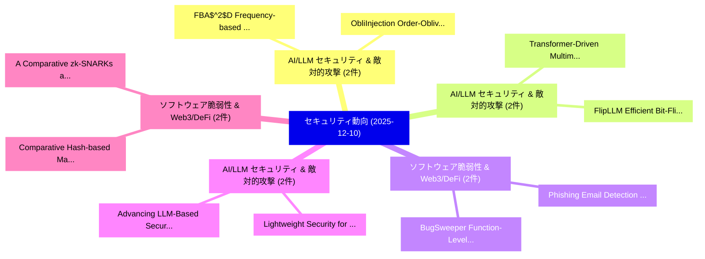

# 📅 02_daily: 日次エグゼクティブサマリー報告書 (2025-12-10)

**集計日時**: 2026-10-02 23:05:50 UTC  
**対象日付**: 2025-12-10  
**本日収集論文数**: 26 件  

---

## 💡 主要セキュリティ動向・脅威インサイト (Executive Insights)

本日の収集論文（計 26 件）において、以下の重点セキュリティ領域で活発な研究動向が確認されました：
- **AI/LLM セキュリティ & 敵対的攻撃** (2 件): 注目論文として 「FBA$^2$D: Frequency-based Blac...」、「ObliInjection: Order-Oblivious...」 等が発表され、実務防御および攻撃検証の進展が見られます。
- **AI/LLM セキュリティ & 敵対的攻撃** (2 件): 注目論文として 「Transformer-Driven Multimodal ...」、「FlipLLM: Efficient Bit-Flip At...」 等が発表され、実務防御および攻撃検証の進展が見られます。
- **ソフトウェア脆弱性 & Web3/DeFi** (2 件): 注目論文として 「BugSweeper: Function-Level Sma...」、「Phishing Email Detection Using...」 等が発表され、実務防御および攻撃検証の進展が見られます。
- **AI/LLM セキュリティ & 敵対的攻撃** (2 件): 注目論文として 「Advancing LLM-Based Security A...」、「Lightweight Security for Priva...」 等が発表され、実務防御および攻撃検証の進展が見られます。
- **ソフトウェア脆弱性 & Web3/DeFi** (2 件): 注目論文として 「Comparative Hash-based Malware...」、「A Comparative zk-SNARKs and zk...」 等が発表され、実務防御および攻撃検証の進展が見られます。

### 🗺️ 技術・脅威トピックマインドマップ

---

## 📌 日次セキュリティ論文一覧 (日本語表形式)

| No | arXiv ID | 論文タイトル (日本語訳) | 重要キーワード | 構造化エグゼクティブ要約 (背景・提案・影響) | 脅威分類 | 詳細リンク |
|---|---|---|---|---|---|---|
| 1 | `2512.09233v1` | [the Security Design, Engineering, and Implementation of the SecureDNA Systemの分析](../../okf/papers/2025-12-10/2512.09233.md) | `Security Design`, `Romanik Romano`, `Edward Zieglar` | 【提案】概要 (Overview & Key Finding) 本論文「the Security Design, Engineering, and Implementation of...。実証評価により経営層・セキュリティ管理者向け推奨アクション (E... | `cybersecurity` | [arXiv](https://arxiv.org/abs/2512.09233v1) &#124; [OKF](../../okf/papers/2025-12-10/2512.09233.md) |
| 2 | `2512.09264v1` | [FBA$^2$D: Frequency-based Black-box Attack for AI-generated Image Detection（セキュリティ分析論文）](../../okf/papers/2025-12-10/2512.09264.md) | `Image Detection`, `Frequency-based Black`, `AI-generated Image` | 【提案】概要 (Overview & Key Finding) 本論文「FBA$^2$D: Frequency-based Black-box Attack for AI-gener...。実証評価により経営層・セキュリティ管理者向け推奨アクション (E... | `cs.AI` | [arXiv](https://arxiv.org/abs/2512.09264v1) &#124; [OKF](../../okf/papers/2025-12-10/2512.09264.md) |
| 3 | `2512.09300v1` | [ZeroOS: A Universal Modular Library OS for zkVMs（セキュリティ分析論文）](../../okf/papers/2025-12-10/2512.09300.md) | `Universal Modular Library`, `Guangxian Zou`, `Isaac Zhang` | 【提案】概要 (Overview & Key Finding) 本論文「ZeroOS: A Universal Modular Library OS for zkVMs（セキュリティ...。実証評価によりWong, Saeid Yazdinejad, D... | `executive-summary` | [arXiv](https://arxiv.org/abs/2512.09300v1) &#124; [OKF](../../okf/papers/2025-12-10/2512.09300.md) |
| 4 | `2512.09309v1` | [A Distributed Framework for Privacy-Enhanced Vision Transformers on the Edge（セキュリティ分析論文）](../../okf/papers/2025-12-10/2512.09309.md) | `Enhanced Vision Transformers`, `Privacy-Enhanced Vision`, `Zihao Ding` | 【提案】概要 (Overview & Key Finding) 本論文「A Distributed Framework for Privacy-Enhanced Vision Tra...。実証評価により経営層・セキュリティ管理者向け推奨アクション (E... | `cs.CV` | [arXiv](https://arxiv.org/abs/2512.09309v1) &#124; [OKF](../../okf/papers/2025-12-10/2512.09309.md) |
| 5 | `2512.09311v1` | [Transformer-Driven Multimodal Fusion for Explainable Suspiciousness Estimation in Visual Surveillance（セキュリティ分析論文）](../../okf/papers/2025-12-10/2512.09311.md) | `Driven Multimodal Fusion`, `Explainable Suspiciousness Estimation`, `Visual Surveillance` | 【提案】概要 (Overview & Key Finding) 本論文「Transformer-Driven Multimodal Fusion for Explainable Su...。実証評価により経営層・セキュリティ管理者向け推奨アクション (E... | `cs.CV` | [arXiv](https://arxiv.org/abs/2512.09311v1) &#124; [OKF](../../okf/papers/2025-12-10/2512.09311.md) |
| 6 | `2512.09321v3` | [ObliInjection: Order-Oblivious Prompt Injection Attack to LLMエージェント with Multi-source Data](../../okf/papers/2025-12-10/2512.09321.md) | `Oblivious Prompt Injection Attack`, `Order-Oblivious Prompt`, `Multi-source Data` | 【提案】概要 (Overview & Key Finding) 本論文「ObliInjection: Order-Oblivious プロンプトインジェクション Attack to ...。実証評価により経営層・セキュリティ管理者向け推奨アクション (E... | `cybersecurity` | [arXiv](https://arxiv.org/abs/2512.09321v3) &#124; [OKF](../../okf/papers/2025-12-10/2512.09321.md) |
| 7 | `2512.09385v2` | [BugSweeper: Function-Level Smart Contract Vulnerabilities Using Graph Neural Networksの検出](../../okf/papers/2025-12-10/2512.09385.md) | `Level Smart Contract Vulnerabilities Using Graph Neural`, `Smart Contract Vulnerabilities Using Graph Neural Networks`, `Level Detection` | 【提案】概要 (Overview & Key Finding) 本論文「BugSweeper: Function-Level スマートコントラクト Vulnerabilities U...。実証評価により経営層・セキュリティ管理者向け推奨アクション (E... | `cs.AI` | [arXiv](https://arxiv.org/abs/2512.09385v2) &#124; [OKF](../../okf/papers/2025-12-10/2512.09385.md) |
| 8 | `2512.09409v1` | [Proof of Trusted Execution: A Consensus Paradigm for Deterministic Blockchain Finality（セキュリティ分析論文）](../../okf/papers/2025-12-10/2512.09409.md) | `Deterministic Blockchain Finality`, `Trusted Execution`, `Consensus Paradigm` | 【提案】概要 (Overview & Key Finding) 本論文「Proof of Trusted Execution: A Consensus Paradigm for De...。実証評価により経営層・セキュリティ管理者向け推奨アクション (E... | `cybersecurity` | [arXiv](https://arxiv.org/abs/2512.09409v1) &#124; [OKF](../../okf/papers/2025-12-10/2512.09409.md) |
| 9 | `2512.09442v1` | [Reference Recommendation based Membership Inference Attack against Hybrid-based Recommender Systems（セキュリティ分析論文）](../../okf/papers/2025-12-10/2512.09442.md) | `Membership Inference Attack`, `Reference Recommendation`, `Hybrid-based Recommender` | 【提案】概要 (Overview & Key Finding) 本論文「Reference Recommendation based Membership Inference Att...。実証評価により経営層・セキュリティ管理者向け推奨アクション (E... | `cybersecurity` | [arXiv](https://arxiv.org/abs/2512.09442v1) &#124; [OKF](../../okf/papers/2025-12-10/2512.09442.md) |
| 10 | `2512.09485v1` | [Advancing LLM-Based Security Automation with Customized Group Relative Policy Optimization for Zero-Touch Networks（セキュリティ分析論文）](../../okf/papers/2025-12-10/2512.09485.md) | `Customized Group Relative Policy Optimization`, `Based Security Automation`, `Touch Networks` | 【提案】概要 (Overview & Key Finding) 本論文「Advancing LLM-Based Security Automation with Customized...。実証評価により経営層・セキュリティ管理者向け推奨アクション (E... | `cs.AI` | [arXiv](https://arxiv.org/abs/2512.09485v1) &#124; [OKF](../../okf/papers/2025-12-10/2512.09485.md) |
| 11 | `2512.09539v1` | [Comparative Hash-based Malware Clustering via K-Meansの分析](../../okf/papers/2025-12-10/2512.09539.md) | `Malware Clustering`, `Hash-based Malware`, `Comparative Hash` | 【提案】概要 (Overview & Key Finding) 本論文「Comparative Hash-based マルウェア Clustering via K-Meansの分析」...。実証評価により経営層・セキュリティ管理者向け推奨アクション (E... | `executive-summary` | [arXiv](https://arxiv.org/abs/2512.09539v1) &#124; [OKF](../../okf/papers/2025-12-10/2512.09539.md) |
| 12 | `2512.09549v2` | [Chasing Shadows: Pitfalls in LLM Security Research（セキュリティ分析論文）](../../okf/papers/2025-12-10/2512.09549.md) | `Chasing Shadows`, `Security Research`, `Jonathan Evertz` | 【提案】概要 (Overview & Key Finding) 本論文「Chasing Shadows: Pitfalls in LLM Security Research（セキュリ...。実証評価により経営層・セキュリティ管理者向け推奨アクション (E... | `cybersecurity` | [arXiv](https://arxiv.org/abs/2512.09549v2) &#124; [OKF](../../okf/papers/2025-12-10/2512.09549.md) |
| 13 | `2512.09699v2` | [Device Independent Quantum Secret Sharing Using Multiparty Pseudo-telepathy Game（セキュリティ分析論文）](../../okf/papers/2025-12-10/2512.09699.md) | `Device Independent Quantum Secret Sharing Using Multiparty Pseudo`, `Pseudo-telepathy Game`, `Santanu Majhi` | 【提案】概要 (Overview & Key Finding) 本論文「Device Independent 量子 Secret Sharing Using Multiparty P...。実証評価により経営層・セキュリティ管理者向け推奨アクション (E... | `executive-summary` | [arXiv](https://arxiv.org/abs/2512.09699v2) &#124; [OKF](../../okf/papers/2025-12-10/2512.09699.md) |
| 14 | `2512.09742v1` | [Weird Generalization and Inductive Backdoors: New Ways to Corrupt LLMs（セキュリティ分析論文）](../../okf/papers/2025-12-10/2512.09742.md) | `Weird Generalization`, `Inductive Backdoors`, `New Ways` | 【提案】概要 (Overview & Key Finding) 本論文「Weird Generalization and Inductive Backdoors: New Ways ...。実証評価により経営層・セキュリティ管理者向け推奨アクション (E... | `cs.AI` | [arXiv](https://arxiv.org/abs/2512.09742v1) &#124; [OKF](../../okf/papers/2025-12-10/2512.09742.md) |
| 15 | `2512.09769v3` | [Defining Cost Function of Steganography with 大規模言語モデル](../../okf/papers/2025-12-10/2512.09769.md) | `Defining Cost Function`, `Large Language Models`, `Hanzhou Wu` | 【提案】概要 (Overview & Key Finding) 本論文「Defining Cost Function of Steganography with 大規模言語モデル」（...。実証評価により経営層・セキュリティ管理者向け推奨アクション (E... | `cybersecurity` | [arXiv](https://arxiv.org/abs/2512.09769v3) &#124; [OKF](../../okf/papers/2025-12-10/2512.09769.md) |
| 16 | `2512.09862v1` | [True Random Number Generators on IQM Spark（セキュリティ分析論文）](../../okf/papers/2025-12-10/2512.09862.md) | `True Random Number Generators`, `Andrzej Gnatowski`, `Raw Meta` | 【提案】概要 (Overview & Key Finding) 本論文「True Random Number Generators on IQM Spark（セキュリティ分析論文）」...。実証評価により経営層・セキュリティ管理者向け推奨アクション (E... | `executive-summary` | [arXiv](https://arxiv.org/abs/2512.09862v1) &#124; [OKF](../../okf/papers/2025-12-10/2512.09862.md) |
| 17 | `2512.09872v1` | [FlipLLM: Efficient Bit-Flip Attacks on Multimodal LLMs using Reinforcement Learning（セキュリティ分析論文）](../../okf/papers/2025-12-10/2512.09872.md) | `Efficient Bit`, `Flip Attacks`, `Reinforcement Learning` | 【提案】概要 (Overview & Key Finding) 本論文「FlipLLM: Efficient Bit-Flip Attacks on Multimodal LLMs ...。実証評価により経営層・セキュリティ管理者向け推奨アクション (E... | `cs.AI` | [arXiv](https://arxiv.org/abs/2512.09872v1) &#124; [OKF](../../okf/papers/2025-12-10/2512.09872.md) |
| 18 | `2512.09882v2` | [Comparing AI Agents to サイバーセキュリティ Professionals in Real-World Penetration Testing](../../okf/papers/2025-12-10/2512.09882.md) | `World Penetration Testing`, `Real-World Penetration`, `Cybersecurity Professionals` | 【提案】概要 (Overview & Key Finding) 本論文「Comparing AI Agents to サイバーセキュリティ Professionals in Real...。実証評価により経営層・セキュリティ管理者向け推奨アクション (E... | `cs.AI` | [arXiv](https://arxiv.org/abs/2512.09882v2) &#124; [OKF](../../okf/papers/2025-12-10/2512.09882.md) |
| 19 | `2512.09883v1` | [ByteShield: Adversarially Robust End-to-End マルウェア検出 through Byte Masking](../../okf/papers/2025-12-10/2512.09883.md) | `Adversarially Robust End`, `Byte Masking`, `End Malware Detection` | 【提案】概要 (Overview & Key Finding) 本論文「ByteShield: Adversarially Robust End-to-End マルウェア検出 thr...。実証評価により経営層・セキュリティ管理者向け推奨アクション (E... | `cybersecurity` | [arXiv](https://arxiv.org/abs/2512.09883v1) &#124; [OKF](../../okf/papers/2025-12-10/2512.09883.md) |
| 20 | `2512.10020v1` | [A Comparative zk-SNARKs and zk-STARKs: Theory and Practiceの分析](../../okf/papers/2025-12-10/2512.10020.md) | `Ayush Nainwal`, `Atharva Kamble`, `Nitin Awathare` | 【提案】概要 (Overview & Key Finding) 本論文「A Comparative zk-SNARKs and zk-STARKs: Theory and Pract...。実証評価により経営層・セキュリティ管理者向け推奨アクション (E... | `executive-summary` | [arXiv](https://arxiv.org/abs/2512.10020v1) &#124; [OKF](../../okf/papers/2025-12-10/2512.10020.md) |
| 21 | `2512.10029v1` | [Malicious GenAI Chrome Extensions: Unpacking Data Exfiltration and Malicious Behaviours（セキュリティ分析論文）](../../okf/papers/2025-12-10/2512.10029.md) | `Unpacking Data Exfiltration`, `Chrome Extensions`, `Malicious Behaviours` | 【提案】概要 (Overview & Key Finding) 本論文「Malicious GenAI Chrome Extensions: Unpacking Data Exfil...。実証評価により経営層・セキュリティ管理者向け推奨アクション (E... | `cybersecurity` | [arXiv](https://arxiv.org/abs/2512.10029v1) &#124; [OKF](../../okf/papers/2025-12-10/2512.10029.md) |
| 22 | `2512.10088v1` | [Evaluation of Risk and Resilience of the MBTA Green Rapid Transit System（セキュリティ分析論文）](../../okf/papers/2025-12-10/2512.10088.md) | `Green Rapid Transit System`, `Anil Kumar Gorthi`, `Raw Meta` | 【提案】概要 (Overview & Key Finding) 本論文「Evaluation of Risk and Resilience of the MBTA Green Rap...。実証評価により経営層・セキュリティ管理者向け推奨アクション (E... | `cybersecurity` | [arXiv](https://arxiv.org/abs/2512.10088v1) &#124; [OKF](../../okf/papers/2025-12-10/2512.10088.md) |
| 23 | `2512.10104v2` | [Phishing Email Detection Using 大規模言語モデル](../../okf/papers/2025-12-10/2512.10104.md) | `Phishing Email Detection Using Large Language Models`, `Phishing Email Detection Using`, `Najmul Hasan` | 【提案】概要 (Overview & Key Finding) 本論文「Phishing Email Detection Using 大規模言語モデル」（原題: Phishing E...。実証評価により経営層・セキュリティ管理者向け推奨アクション (E... | `cs.AI` | [arXiv](https://arxiv.org/abs/2512.10104v2) &#124; [OKF](../../okf/papers/2025-12-10/2512.10104.md) |
| 24 | `2512.10135v1` | [Lightweight Security for Private Networks: Real-World Evaluation of WireGuard（セキュリティ分析論文）](../../okf/papers/2025-12-10/2512.10135.md) | `Lightweight Security`, `Private Networks`, `Hubert Djuitcheu` | 【提案】概要 (Overview & Key Finding) 本論文「Lightweight Security for Private Networks: Real-World E...。実証評価により経営層・セキュリティ管理者向け推奨アクション (E... | `cs.NI` | [arXiv](https://arxiv.org/abs/2512.10135v1) &#124; [OKF](../../okf/papers/2025-12-10/2512.10135.md) |
| 25 | `2512.10998v1` | [SCOUT: A Defense Against Data Poisoning Attacks in Fine-Tuned Language Models（セキュリティ分析論文）](../../okf/papers/2025-12-10/2512.10998.md) | `Tuned Language Models`, `Fine-Tuned Language`, `Mohamed Afane` | 【提案】概要 (Overview & Key Finding) 本論文「SCOUT: A Defense Against Data Poisoning Attacks in Fine...。実証評価により経営層・セキュリティ管理者向け推奨アクション (E... | `executive-summary` | [arXiv](https://arxiv.org/abs/2512.10998v1) &#124; [OKF](../../okf/papers/2025-12-10/2512.10998.md) |
| 26 | `2512.20641v2` | [Topological and Temporal Stability the Lightning Networkの分析](../../okf/papers/2025-12-10/2512.20641.md) | `Lightning Network`, `Temporal Stability`, `Danila Valko` | 【提案】概要 (Overview & Key Finding) 本論文「Topological and Temporal Stability the Lightning Networ...。実証評価により経営層・セキュリティ管理者向け推奨アクション (E... | `executive-summary` | [arXiv](https://arxiv.org/abs/2512.20641v2) &#124; [OKF](../../okf/papers/2025-12-10/2512.20641.md) |

