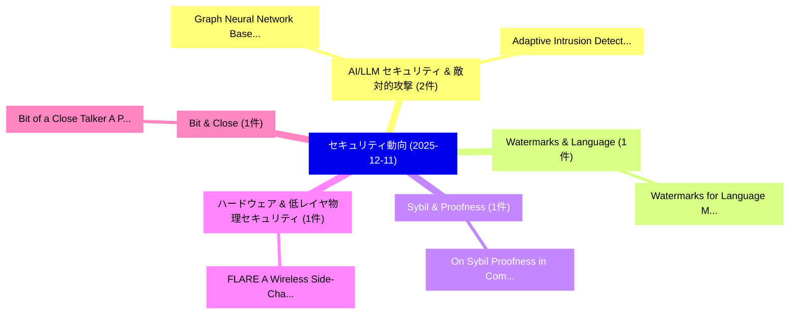

# 📅 02_daily: 日次エグゼクティブサマリー報告書 (2025-12-11)

**集計日時**: 2026-10-02 23:05:50 UTC  
**対象日付**: 2025-12-11  
**本日収集論文数**: 27 件  

---

## 💡 主要セキュリティ動向・脅威インサイト (Executive Insights)

本日の収集論文（計 27 件）において、以下の重点セキュリティ領域で活発な研究動向が確認されました：
- **AI/LLM セキュリティ & 敵対的攻撃** (2 件): 注目論文として 「Graph Neural Network Based Ada...」、「Adaptive Intrusion Detection S...」 等が発表され、実務防御および攻撃検証の進展が見られます。
- **Watermarks & Language** (1 件): 注目論文として 「Watermarks for Language Models...」 等が発表され、実務防御および攻撃検証の進展が見られます。
- **Sybil & Proofness** (1 件): 注目論文として 「On Sybil Proofness in Competit...」 等が発表され、実務防御および攻撃検証の進展が見られます。
- **ハードウェア & 低レイヤ物理セキュリティ** (1 件): 注目論文として 「FLARE: A Wireless Side-Channel...」 等が発表され、実務防御および攻撃検証の進展が見られます。
- **Bit & Close** (1 件): 注目論文として 「Bit of a Close Talker: A Pract...」 等が発表され、実務防御および攻撃検証の進展が見られます。

### 🗺️ 技術・脅威トピックマインドマップ

---

## 📌 日次セキュリティ論文一覧 (日本語表形式)

| No | arXiv ID | 論文タイトル (日本語訳) | 重要キーワード | 構造化エグゼクティブ要約 (背景・提案・影響) | 脅威分類 | 詳細リンク |
|---|---|---|---|---|---|---|
| 1 | `2512.10185v1` | [Watermarks for Language Models via Probabilistic Automata（セキュリティ分析論文）](../../okf/papers/2025-12-11/2512.10185.md) | `Language Models`, `Probabilistic Automata`, `Yangkun Wang` | 【提案】概要 (Overview & Key Finding) 本論文「Watermarks for Language Models via Probabilistic Automa...。実証評価により経営層・セキュリティ管理者向け推奨アクション (E... | `executive-summary` | [arXiv](https://arxiv.org/abs/2512.10185v1) &#124; [OKF](../../okf/papers/2025-12-11/2512.10185.md) |
| 2 | `2512.10203v1` | [On Sybil Proofness in Competitive Combinatorial Exchanges（セキュリティ分析論文）](../../okf/papers/2025-12-11/2512.10203.md) | `Competitive Combinatorial Exchanges`, `Abhimanyu Nag`, `Raw Meta` | 【提案】概要 (Overview & Key Finding) 本論文「On Sybil Proofness in Competitive Combinatorial Exchang...。実証評価により経営層・セキュリティ管理者向け推奨アクション (E... | `econ.TH` | [arXiv](https://arxiv.org/abs/2512.10203v1) &#124; [OKF](../../okf/papers/2025-12-11/2512.10203.md) |
| 3 | `2512.10280v1` | [Graph Neural Network Based Adaptive Threat Detection for Cloud Identity and Access Management Logs（セキュリティ分析論文）](../../okf/papers/2025-12-11/2512.10280.md) | `Graph Neural Network Based Adaptive Threat Detection`, `Access Management Logs`, `Cloud Identity` | 【提案】概要 (Overview & Key Finding) 本論文「Graph Neural Network Based Adaptive 脅威 Detection for Cl...。実証評価により経営層・セキュリティ管理者向け推奨アクション (E... | `cs.AI` | [arXiv](https://arxiv.org/abs/2512.10280v1) &#124; [OKF](../../okf/papers/2025-12-11/2512.10280.md) |
| 4 | `2512.10296v1` | [FLARE: A Wireless Side-Channel Fingerprinting Attack on 連合学習](../../okf/papers/2025-12-11/2512.10296.md) | `Channel Fingerprinting Attack`, `Wireless Side`, `Side-Channel Fingerprinting` | 【提案】概要 (Overview & Key Finding) 本論文「FLARE: A Wireless サイドチャネル攻撃 Fingerprinting Attack on 連合...。実証評価により経営層・セキュリティ管理者向け推奨アクション (E... | `cs.AI` | [arXiv](https://arxiv.org/abs/2512.10296v1) &#124; [OKF](../../okf/papers/2025-12-11/2512.10296.md) |
| 5 | `2512.10361v3` | [Bit of a Close Talker: A Practical Guide to Serverless Cloud Co-Location Attacks（セキュリティ分析論文）](../../okf/papers/2025-12-11/2512.10361.md) | `Serverless Cloud Co`, `Close Talker`, `Practical Guide` | 【提案】概要 (Overview & Key Finding) 本論文「Bit of a Close Talker: A Practical Guide to Serverless ...。実証評価により経営層・セキュリティ管理者向け推奨アクション (E... | `executive-summary` | [arXiv](https://arxiv.org/abs/2512.10361v3) &#124; [OKF](../../okf/papers/2025-12-11/2512.10361.md) |
| 6 | `2512.10372v1` | [D2M: A Decentralized, Privacy-Preserving, Incentive-Compatible Data Marketplace for Collaborative Learning（セキュリティ分析論文）](../../okf/papers/2025-12-11/2512.10372.md) | `Compatible Data Marketplace`, `Collaborative Learning`, `Incentive-Compatible Data` | 【提案】概要 (Overview & Key Finding) 本論文「D2M: A Decentralized, Privacy-Preserving, Incentive-Com...。実証評価により経営層・セキュリティ管理者向け推奨アクション (E... | `cs.AI` | [arXiv](https://arxiv.org/abs/2512.10372v1) &#124; [OKF](../../okf/papers/2025-12-11/2512.10372.md) |
| 7 | `2512.10426v3` | [Differential Privacy for Secure Machine Learning in Healthcare IoT-Cloud Systems（セキュリティ分析論文）](../../okf/papers/2025-12-11/2512.10426.md) | `Secure Machine Learning`, `Differential Privacy`, `Cloud Systems` | 【提案】概要 (Overview & Key Finding) 本論文「差分プライバシー for Secure Machine Learning in Healthcare IoT-...。実証評価により経営層・セキュリティ管理者向け推奨アクション (E... | `executive-summary` | [arXiv](https://arxiv.org/abs/2512.10426v3) &#124; [OKF](../../okf/papers/2025-12-11/2512.10426.md) |
| 8 | `2512.10449v3` | [When Reject Turns into Accept: Quantifying the Vulnerability of LLM-Based Scientific Reviewers to Indirect Prompt Injection（セキュリティ分析論文）](../../okf/papers/2025-12-11/2512.10449.md) | `Based Scientific Reviewers`, `Indirect Prompt Injection`, `LLM-Based Scientific` | 【提案】概要 (Overview & Key Finding) 本論文「When Reject Turns into Accept: Quantifying the 脆弱性 of L...。実証評価により経営層・セキュリティ管理者向け推奨アクション (E... | `cs.AI` | [arXiv](https://arxiv.org/abs/2512.10449v3) &#124; [OKF](../../okf/papers/2025-12-11/2512.10449.md) |
| 9 | `2512.10470v1` | [Stealth and Evasion in Rogue AP Attacks: An Modern Detection and Bypass Techniquesの分析](../../okf/papers/2025-12-11/2512.10470.md) | `Modern Detection`, `Bypass Techniques`, `Kaleb Bacztub` | 【提案】概要 (Overview & Key Finding) 本論文「Stealth and Evasion in Rogue AP Attacks: An Modern Dete...。実証評価により経営層・セキュリティ管理者向け推奨アクション (E... | `cybersecurity` | [arXiv](https://arxiv.org/abs/2512.10470v1) &#124; [OKF](../../okf/papers/2025-12-11/2512.10470.md) |
| 10 | `2512.10485v3` | [From Lab to Reality: A Practical Evaluation of Deep Learning Models and LLMs for 脆弱性検出](../../okf/papers/2025-12-11/2512.10485.md) | `Deep Learning Models`, `Vulnerability Detection`, `Chaomeng Lu` | 【提案】概要 (Overview & Key Finding) 本論文「From Lab to Reality: A Practical Evaluation of Deep Lea...。実証評価により経営層・セキュリティ管理者向け推奨アクション (E... | `AI/ML Security` | [arXiv](https://arxiv.org/abs/2512.10485v3) &#124; [OKF](../../okf/papers/2025-12-11/2512.10485.md) |
| 11 | `2512.10487v1` | [LLM-Assisted AHP for Explainable Cyber Range Evaluation（セキュリティ分析論文）](../../okf/papers/2025-12-11/2512.10487.md) | `LLM-Assisted AHP`, `Vyron Kampourakis`, `Georgios Kavallieratos` | 【提案】概要 (Overview & Key Finding) 本論文「LLM-Assisted AHP for Explainable Cyber Range Evaluation...。実証評価により経営層・セキュリティ管理者向け推奨アクション (E... | `cybersecurity` | [arXiv](https://arxiv.org/abs/2512.10487v1) &#124; [OKF](../../okf/papers/2025-12-11/2512.10487.md) |
| 12 | `2512.10600v1` | [Authority Backdoor: A Certifiable Backdoor Mechanism for Authoring DNNs（セキュリティ分析論文）](../../okf/papers/2025-12-11/2512.10600.md) | `Certifiable Backdoor Mechanism`, `Authority Backdoor`, `Han Yang` | 【提案】概要 (Overview & Key Finding) 本論文「Authority Backdoor: A Certifiable Backdoor Mechanism fo...。実証評価により経営層・セキュリティ管理者向け推奨アクション (E... | `executive-summary` | [arXiv](https://arxiv.org/abs/2512.10600v1) &#124; [OKF](../../okf/papers/2025-12-11/2512.10600.md) |
| 13 | `2512.10636v1` | [Objectives and Design Principles in Offline Payments with Central Bank Digital Currency (CBDC)（セキュリティ分析論文）](../../okf/papers/2025-12-11/2512.10636.md) | `Central Bank Digital Currency`, `Design Principles`, `Offline Payments` | 【提案】概要 (Overview & Key Finding) 本論文「Objectives and Design Principles in Offline Payments wi...。実証評価により経営層・セキュリティ管理者向け推奨アクション (E... | `cybersecurity` | [arXiv](https://arxiv.org/abs/2512.10636v1) &#124; [OKF](../../okf/papers/2025-12-11/2512.10636.md) |
| 14 | `2512.10637v2` | [Adaptive Intrusion Detection System Leveraging Dynamic Neural Models with Adversarial Learning for 5G/6G Networks（セキュリティ分析論文）](../../okf/papers/2025-12-11/2512.10637.md) | `Adaptive Intrusion Detection System Leveraging Dynamic Neural Models`, `Adversarial Learning`, `Tarunpreet Bhatia` | 【提案】概要 (Overview & Key Finding) 本論文「Adaptive Intrusion Detection System Leveraging Dynamic ...。実証評価により経営層・セキュリティ管理者向け推奨アクション (E... | `executive-summary` | [arXiv](https://arxiv.org/abs/2512.10637v2) &#124; [OKF](../../okf/papers/2025-12-11/2512.10637.md) |
| 15 | `2512.10652v3` | [TriDF: Evaluating Perception, Detection, and Hallucination for Interpretable DeepFake Detection（セキュリティ分析論文）](../../okf/papers/2025-12-11/2512.10652.md) | `Evaluating Perception`, `Yu Jiang`, `Yang Huang` | 【提案】概要 (Overview & Key Finding) 本論文「TriDF: Evaluating Perception, Detection, and Hallucinat...。実証評価により経営層・セキュリティ管理者向け推奨アクション (E... | `cs.CV` | [arXiv](https://arxiv.org/abs/2512.10652v3) &#124; [OKF](../../okf/papers/2025-12-11/2512.10652.md) |
| 16 | `2512.10653v1` | [Virtual camera detection: Catching video injection attacks in remote biometric systems（セキュリティ分析論文）](../../okf/papers/2025-12-11/2512.10653.md) | `Daniyar Kurmankhojayev`, `Andrei Shadrikov`, `Dmitrii Gordin` | 【提案】概要 (Overview & Key Finding) 本論文「Virtual camera detection: Catching video injection atta...。実証評価により経営層・セキュリティ管理者向け推奨アクション (E... | `executive-summary` | [arXiv](https://arxiv.org/abs/2512.10653v1) &#124; [OKF](../../okf/papers/2025-12-11/2512.10653.md) |
| 17 | `2512.10667v1` | [A Proof of Success and Reward Distribution Protocol for Multi-bridge Architecture in Cross-chain Communication（セキュリティ分析論文）](../../okf/papers/2025-12-11/2512.10667.md) | `Reward Distribution Protocol`, `Multi-bridge Architecture`, `Cross-chain Communication` | 【提案】概要 (Overview & Key Finding) 本論文「A Proof of Success and Reward Distribution Protocol for...。実証評価により経営層・セキュリティ管理者向け推奨アクション (E... | `cs.ET` | [arXiv](https://arxiv.org/abs/2512.10667v1) &#124; [OKF](../../okf/papers/2025-12-11/2512.10667.md) |
| 18 | `2512.10732v1` | [TriHaRd: Higher Resilience for TEE Trusted Time（セキュリティ分析論文）](../../okf/papers/2025-12-11/2512.10732.md) | `Higher Resilience`, `Trusted Time`, `Sonia Ben Mokhtar` | 【提案】概要 (Overview & Key Finding) 本論文「TriHaRd: Higher Resilience for TEE Trusted Time（セキュリティ分...。実証評価により経営層・セキュリティ管理者向け推奨アクション (E... | `executive-summary` | [arXiv](https://arxiv.org/abs/2512.10732v1) &#124; [OKF](../../okf/papers/2025-12-11/2512.10732.md) |
| 19 | `2512.11004v1` | [Enhancing the Practical Reliability of Shor's Quantum Algorithm via Generalized Period Decomposition: Theory and Large-Scale Empirical Validation（セキュリティ分析論文）](../../okf/papers/2025-12-11/2512.11004.md) | `Generalized Period Decomposition`, `Scale Empirical Validation`, `Practical Reliability` | 【提案】概要 (Overview & Key Finding) 本論文「Enhancing the Practical Reliability of Shor's 量子 Algori...。実証評価により経営層・セキュリティ管理者向け推奨アクション (E... | `executive-summary` | [arXiv](https://arxiv.org/abs/2512.11004v1) &#124; [OKF](../../okf/papers/2025-12-11/2512.11004.md) |
| 20 | `2512.11087v1` | [Clip-and-Verify: Linear Constraint-Driven Domain Clipping for Accelerating Neural Network Verification（セキュリティ分析論文）](../../okf/papers/2025-12-11/2512.11087.md) | `Accelerating Neural Network Verification`, `Driven Domain Clipping`, `Linear Constraint` | 【提案】概要 (Overview & Key Finding) 本論文「Clip-and-Verify: Linear Constraint-Driven Domain Clippi...。実証評価により経営層・セキュリティ管理者向け推奨アクション (E... | `cs.AI` | [arXiv](https://arxiv.org/abs/2512.11087v1) &#124; [OKF](../../okf/papers/2025-12-11/2512.11087.md) |
| 21 | `2512.11107v1` | [Digital Coherent-State QRNG Using System-Jitter Entropy via Random Permutation（セキュリティ分析論文）](../../okf/papers/2025-12-11/2512.11107.md) | `Digital Coherent`, `Using System`, `Jitter Entropy` | 【提案】概要 (Overview & Key Finding) 本論文「Digital Coherent-State QRNG Using System-Jitter Entropy...。実証評価により経営層・セキュリティ管理者向け推奨アクション (E... | `executive-summary` | [arXiv](https://arxiv.org/abs/2512.11107v1) &#124; [OKF](../../okf/papers/2025-12-11/2512.11107.md) |
| 22 | `2512.11112v1` | [An LLVM-Based Optimization Pipeline for SPDZ（セキュリティ分析論文）](../../okf/papers/2025-12-11/2512.11112.md) | `Based Optimization Pipeline`, `LLVM-Based Optimization`, `Tianye Dai` | 【提案】概要 (Overview & Key Finding) 本論文「An LLVM-Based Optimization Pipeline for SPDZ（セキュリティ分析論文...。実証評価により経営層・セキュリティ管理者向け推奨アクション (E... | `executive-summary` | [arXiv](https://arxiv.org/abs/2512.11112v1) &#124; [OKF](../../okf/papers/2025-12-11/2512.11112.md) |
| 23 | `2512.11122v1` | [サイバーセキュリティ policy adoption in South Africa: Does public trust matter?](../../okf/papers/2025-12-11/2512.11122.md) | `South Africa`, `Mbali Nkosi`, `Mike Nkongolo` | 【提案】### (日本語題名: サイバーセキュリティ policy adoption in South Africa: Does public trust matter?)  > [...。実証評価により経営層・セキュリティ管理者向け推奨アクション (E... | `executive-summary` | [arXiv](https://arxiv.org/abs/2512.11122v1) &#124; [OKF](../../okf/papers/2025-12-11/2512.11122.md) |
| 24 | `2512.11135v1` | [Network and Compiler Optimizations for Efficient Linear Algebra Kernels in Private Transformer Inference（セキュリティ分析論文）](../../okf/papers/2025-12-11/2512.11135.md) | `Efficient Linear Algebra Kernels`, `Private Transformer Inference`, `Compiler Optimizations` | 【提案】概要 (Overview & Key Finding) 本論文「Network and Compiler Optimizations for Efficient Linear...。実証評価により経営層・セキュリティ管理者向け推奨アクション (E... | `cybersecurity` | [arXiv](https://arxiv.org/abs/2512.11135v1) &#124; [OKF](../../okf/papers/2025-12-11/2512.11135.md) |
| 25 | `2512.11143v1` | [Automated Penetration Testing with LLMエージェント and Classical Planning](../../okf/papers/2025-12-11/2512.11143.md) | `Automated Penetration Testing`, `Classical Planning`, `Lingzhi Wang` | 【提案】概要 (Overview & Key Finding) 本論文「Automated Penetration Testing with LLMエージェント and Classi...。実証評価により経営層・セキュリティ管理者向け推奨アクション (E... | `cybersecurity` | [arXiv](https://arxiv.org/abs/2512.11143v1) &#124; [OKF](../../okf/papers/2025-12-11/2512.11143.md) |
| 26 | `2512.11147v1` | [MiniScope: A Least Privilege Framework for Authorizing Tool Calling Agents（セキュリティ分析論文）](../../okf/papers/2025-12-11/2512.11147.md) | `Authorizing Tool Calling Agents`, `Authorizing Tool Calling Ag`, `Raluca Ada Popa` | 【提案】概要 (Overview & Key Finding) 本論文「MiniScope: A Least Privilege Framework for Authorizing ...。実証評価により経営層・セキュリティ管理者向け推奨アクション (E... | `cs.AI` | [arXiv](https://arxiv.org/abs/2512.11147v1) &#124; [OKF](../../okf/papers/2025-12-11/2512.11147.md) |
| 27 | `2512.14737v1` | [Zero-Knowledge Audit for Internet of Agents: Privacy-Preserving Communication Verification with Model Context Protocol（セキュリティ分析論文）](../../okf/papers/2025-12-11/2512.14737.md) | `Preserving Communication Verification`, `Model Context Protocol`, `Knowledge Audit` | 【提案】概要 (Overview & Key Finding) 本論文「Zero-Knowledge Audit for Internet of Agents: Privacy-Pr...。実証評価により経営層・セキュリティ管理者向け推奨アクション (E... | `cs.AI` | [arXiv](https://arxiv.org/abs/2512.14737v1) &#124; [OKF](../../okf/papers/2025-12-11/2512.14737.md) |

