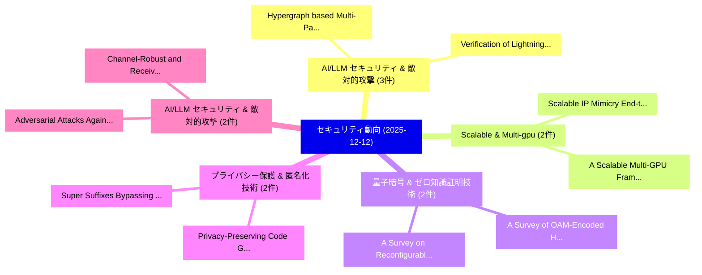

# 📅 02_daily: 日次エグゼクティブサマリー報告書 (2025-12-12)

**集計日時**: 2026-10-02 23:05:50 UTC  
**対象日付**: 2025-12-12  
**本日収集論文数**: 29 件  

---

## 💡 主要セキュリティ動向・脅威インサイト (Executive Insights)

本日の収集論文（計 29 件）において、以下の重点セキュリティ領域で活発な研究動向が確認されました：
- **AI/LLM セキュリティ & 敵対的攻撃** (3 件): 注目論文として 「Hypergraph based Multi-Party P...」、「Verification of Lightning Netw...」 等が発表され、実務防御および攻撃検証の進展が見られます。
- **Scalable & Multi-gpu** (2 件): 注目論文として 「A Scalable Multi-GPU Framework...」、「Scalable IP Mimicry: End-to-En...」 等が発表され、実務防御および攻撃検証の進展が見られます。
- **量子暗号 & ゼロ知識証明技術** (2 件): 注目論文として 「A Survey of OAM-Encoded High-D...」、「A Survey on Reconfigurable Int...」 等が発表され、実務防御および攻撃検証の進展が見られます。
- **プライバシー保護 & 匿名化技術** (2 件): 注目論文として 「Privacy-Preserving Code Genera...」、「Super Suffixes: Bypassing Text...」 等が発表され、実務防御および攻撃検証の進展が見られます。
- **AI/LLM セキュリティ & 敵対的攻撃** (2 件): 注目論文として 「Adversarial Attacks Against De...」、「Channel-Robust and Receiver-In...」 等が発表され、実務防御および攻撃検証の進展が見られます。

### 🗺️ 技術・脅威トピックマインドマップ

---

## 📌 日次セキュリティ論文一覧 (日本語表形式)

| No | arXiv ID | 論文タイトル (日本語訳) | 重要キーワード | 構造化エグゼクティブ要約 (背景・提案・影響) | 脅威分類 | 詳細リンク |
|---|---|---|---|---|---|---|
| 1 | `2512.11269v1` | [A Scalable Multi-GPU Framework for Encrypted Large-Model Inference（セキュリティ分析論文）](../../okf/papers/2025-12-12/2512.11269.md) | `Scalable Multi`, `Encrypted Large`, `Model Inference` | 【提案】概要 (Overview & Key Finding) 本論文「A Scalable Multi-GPU Framework for Encrypted Large-Mode...。実証評価によりSullivan, Wenti。 | `cs.AI` | [arXiv](https://arxiv.org/abs/2512.11269v1) &#124; [OKF](../../okf/papers/2025-12-12/2512.11269.md) |
| 2 | `2512.11272v1` | [Vision-Based Learning for Cyberattack Detection in Blockchain Smart Contracts and Transactions（セキュリティ分析論文）](../../okf/papers/2025-12-12/2512.11272.md) | `Blockchain Smart Contracts`, `Based Learning`, `Vision-Based Learning` | 【提案】概要 (Overview & Key Finding) 本論文「Vision-Based Learning for Cyberattack Detection in Bloc...。実証評価により経営層・セキュリティ管理者向け推奨アクション (E... | `cybersecurity` | [arXiv](https://arxiv.org/abs/2512.11272v1) &#124; [OKF](../../okf/papers/2025-12-12/2512.11272.md) |
| 3 | `2512.11286v2` | [A Survey of OAM-Encoded High-Dimensional Quantum Key Distribution: Foundations, Experiments, and Recent Trends（セキュリティ分析論文）](../../okf/papers/2025-12-12/2512.11286.md) | `Dimensional Quantum Key Distribution`, `Encoded High`, `OAM-Encoded High` | 【提案】概要 (Overview & Key Finding) 本論文「A Survey of OAM-Encoded High-Dimensional 量子鍵配送: Foundat...。実証評価により経営層・セキュリティ管理者向け推奨アクション (E... | `executive-summary` | [arXiv](https://arxiv.org/abs/2512.11286v2) &#124; [OKF](../../okf/papers/2025-12-12/2512.11286.md) |
| 4 | `2512.11316v1` | [Visualisation for the CIS benchmark scanning results（セキュリティ分析論文）](../../okf/papers/2025-12-12/2512.11316.md) | `Zhenshuo Zhao`, `Maria Spichkova`, `Duttkumari Champavat` | 【提案】概要 (Overview & Key Finding) 本論文「Visualisation for the CIS benchmark scanning results（セキ...。実証評価によりZulkefli, Pradhuman Khand。 | `executive-summary` | [arXiv](https://arxiv.org/abs/2512.11316v1) &#124; [OKF](../../okf/papers/2025-12-12/2512.11316.md) |
| 5 | `2512.11431v1` | [Proving DNSSEC Correctness: A Formal Approach to Secure Domain Name Resolution（セキュリティ分析論文）](../../okf/papers/2025-12-12/2512.11431.md) | `Secure Domain Name Resolution`, `Qifan Zhang`, `Zilin Shen` | 【提案】概要 (Overview & Key Finding) 本論文「Proving DNSSEC Correctness: A Formal Approach to Secure...。実証評価により経営層・セキュリティ管理者向け推奨アクション (E... | `cs.NI` | [arXiv](https://arxiv.org/abs/2512.11431v1) &#124; [OKF](../../okf/papers/2025-12-12/2512.11431.md) |
| 6 | `2512.11482v1` | [Privacy-Preserving Code Generation: Differentially Private Code Language Modelsに向けて](../../okf/papers/2025-12-12/2512.11482.md) | `Preserving Code Generation`, `Privacy-Preserving Code`, `Differentially Private Code Language Models` | 【提案】概要 (Overview & Key Finding) 本論文「Privacy-Preserving Code Generation: Differentially Priv...。実証評価により経営層・セキュリティ管理者向け推奨アクション (E... | `cs.AI` | [arXiv](https://arxiv.org/abs/2512.11482v1) &#124; [OKF](../../okf/papers/2025-12-12/2512.11482.md) |
| 7 | `2512.11484v1` | [Capacitive Touchscreens at Risk: Recovering Handwritten Trajectory on Smartphone via Electromagnetic Emanations（セキュリティ分析論文）](../../okf/papers/2025-12-12/2512.11484.md) | `Recovering Handwritten Trajectory`, `Capacitive Touchscreens`, `Electromagnetic Emanations` | 【提案】概要 (Overview & Key Finding) 本論文「Capacitive Touchscreens at Risk: Recovering Handwritten...。実証評価により経営層・セキュリティ管理者向け推奨アクション (E... | `cs.AI` | [arXiv](https://arxiv.org/abs/2512.11484v1) &#124; [OKF](../../okf/papers/2025-12-12/2512.11484.md) |
| 8 | `2512.11602v1` | [Granite: Granular Runtime Enforcement for GitHub Actions Permissions（セキュリティ分析論文）](../../okf/papers/2025-12-12/2512.11602.md) | `Granular Runtime Enforcement`, `Actions Permissions`, `Mojtaba Moazen` | 【提案】概要 (Overview & Key Finding) 本論文「Granite: Granular Runtime Enforcement for GitHub Action...。実証評価によりM Ahmadian, M。 | `cybersecurity` | [arXiv](https://arxiv.org/abs/2512.11602v1) &#124; [OKF](../../okf/papers/2025-12-12/2512.11602.md) |
| 9 | `2512.11690v1` | [Leveraging FPGAs for Homomorphic Matrix-Vector Multiplication in Oblivious Message Retrieval（セキュリティ分析論文）](../../okf/papers/2025-12-12/2512.11690.md) | `Oblivious Message Retrieval`, `Homomorphic Matrix`, `Vector Multiplication` | 【提案】概要 (Overview & Key Finding) 本論文「Leveraging FPGAs for Homomorphic Matrix-Vector Multipli...。実証評価により経営層・セキュリティ管理者向け推奨アクション (E... | `executive-summary` | [arXiv](https://arxiv.org/abs/2512.11690v1) &#124; [OKF](../../okf/papers/2025-12-12/2512.11690.md) |
| 10 | `2512.11699v1` | [SoK: Demystifying the multiverse of MPC protocols（セキュリティ分析論文）](../../okf/papers/2025-12-12/2512.11699.md) | `Roberta De Viti`, `Vaastav Anand`, `Pierfrancesco Ingo` | 【提案】概要 (Overview & Key Finding) 本論文「SoK: Demystifying the multiverse of MPC protocols（セキュリテ...。実証評価により経営層・セキュリティ管理者向け推奨アクション (E... | `cybersecurity` | [arXiv](https://arxiv.org/abs/2512.11699v1) &#124; [OKF](../../okf/papers/2025-12-12/2512.11699.md) |
| 11 | `2512.11775v2` | [Hypergraph based Multi-Party Payment Channel（セキュリティ分析論文）](../../okf/papers/2025-12-12/2512.11775.md) | `Party Payment Channel`, `Multi-Party Payment`, `Ayush Nainwal` | 【提案】概要 (Overview & Key Finding) 本論文「Hypergraph based Multi-Party Payment Channel（セキュリティ分析論文...。実証評価により経営層・セキュリティ管理者向け推奨アクション (E... | `cs.NI` | [arXiv](https://arxiv.org/abs/2512.11775v2) &#124; [OKF](../../okf/papers/2025-12-12/2512.11775.md) |
| 12 | `2512.11783v1` | [Super Suffixes: Bypassing Text Generation Alignment and Guard Models Simultaneously（セキュリティ分析論文）](../../okf/papers/2025-12-12/2512.11783.md) | `Bypassing Text Generation Alignment`, `Guard Models Simultaneously`, `Super Suffixes` | 【提案】概要 (Overview & Key Finding) 本論文「Super Suffixes: Bypassing Text Generation Alignment and...。実証評価により経営層・セキュリティ管理者向け推奨アクション (E... | `cs.AI` | [arXiv](https://arxiv.org/abs/2512.11783v1) &#124; [OKF](../../okf/papers/2025-12-12/2512.11783.md) |
| 13 | `2512.12002v1` | [Adversarial Attacks Against Deep Learning-Based Radio Frequency Fingerprint Identification（セキュリティ分析論文）](../../okf/papers/2025-12-12/2512.12002.md) | `Based Radio Frequency Fingerprint Identification`, `Learning-Based Radio`, `Jie Ma` | 【提案】概要 (Overview & Key Finding) 本論文「敵対的攻撃s Against Deep Learning-Based Radio Frequency Fing...。実証評価により経営層・セキュリティ管理者向け推奨アクション (E... | `executive-summary` | [arXiv](https://arxiv.org/abs/2512.12002v1) &#124; [OKF](../../okf/papers/2025-12-12/2512.12002.md) |
| 14 | `2512.12006v2` | [MVP-ORAM: a Wait-free Concurrent ORAM for Confidential BFT Storage（セキュリティ分析論文）](../../okf/papers/2025-12-12/2512.12006.md) | `Wait-free Concurrent`, `Robin Vassantlal`, `Hasan Heydari` | 【提案】概要 (Overview & Key Finding) 本論文「MVP-ORAM: a Wait-free Concurrent ORAM for Confidential ...。実証評価により経営層・セキュリティ管理者向け推奨アクション (E... | `executive-summary` | [arXiv](https://arxiv.org/abs/2512.12006v2) &#124; [OKF](../../okf/papers/2025-12-12/2512.12006.md) |
| 15 | `2512.12024v2` | [Model checking of hyperproperties for high-level relational models（セキュリティ分析論文）](../../okf/papers/2025-12-12/2512.12024.md) | `high-level relational`, `Nuno Macedo`, `Hugo Pacheco` | 【提案】概要 (Overview & Key Finding) 本論文「Model checking of hyperproperties for high-level relati...。実証評価により経営層・セキュリティ管理者向け推奨アクション (E... | `executive-summary` | [arXiv](https://arxiv.org/abs/2512.12024v2) &#124; [OKF](../../okf/papers/2025-12-12/2512.12024.md) |
| 16 | `2512.12061v2` | [Scalable IP Mimicry: End-to-End Deceptive IP Blending to Overcome Rectification and Scale Limitations of IP Camouflage（セキュリティ分析論文）](../../okf/papers/2025-12-12/2512.12061.md) | `End Deceptive`, `Overcome Rectification`, `Scale Limitations` | 【提案】概要 (Overview & Key Finding) 本論文「Scalable IP Mimicry: End-to-End Deceptive IP Blending t...。実証評価により経営層・セキュリティ管理者向け推奨アクション (E... | `cybersecurity` | [arXiv](https://arxiv.org/abs/2512.12061v2) &#124; [OKF](../../okf/papers/2025-12-12/2512.12061.md) |
| 17 | `2512.12069v3` | [Rethinking Jailbreak Large Vision Language Models with Representational Contrastive Scoringの検出](../../okf/papers/2025-12-12/2512.12069.md) | `Rethinking Jailbreak Large Vision Language Models`, `Large Vision Language Models`, `Representational Contrastive` | 【提案】概要 (Overview & Key Finding) 本論文「Rethinking ジェイルブレイク Large Vision Language Models with R...。実証評価により経営層・セキュリティ管理者向け推奨アクション (E... | `cs.AI` | [arXiv](https://arxiv.org/abs/2512.12069v3) &#124; [OKF](../../okf/papers/2025-12-12/2512.12069.md) |
| 18 | `2512.12070v1` | [Channel-Robust and Receiver-Independent Radio Frequency Fingerprint Identificationに向けて](../../okf/papers/2025-12-12/2512.12070.md) | `Receiver-Independent Radio`, `Independent Radio Frequency Fingerprint Identification`, `Independent Radio Frequency Fingerprint` | 【提案】概要 (Overview & Key Finding) 本論文「Channel-Robust and Receiver-Independent Radio Frequency...。実証評価により経営層・セキュリティ管理者向け推奨アクション (E... | `cybersecurity` | [arXiv](https://arxiv.org/abs/2512.12070v1) &#124; [OKF](../../okf/papers/2025-12-12/2512.12070.md) |
| 19 | `2512.12078v3` | [The Procedural Semantics Gap in Structured CTI: A Measurement-Driven STIX Analysis for APT Emulation（セキュリティ分析論文）](../../okf/papers/2025-12-12/2512.12078.md) | `Measurement-Driven STIX`, `Lopes Roth Ferraz`, `Sidnei Barbieri` | 【提案】概要 (Overview & Key Finding) 本論文「The Procedural Semantics Gap in Structured CTI: A Measu...。実証評価により経営層・セキュリティ管理者向け推奨アクション (E... | `cybersecurity` | [arXiv](https://arxiv.org/abs/2512.12078v3) &#124; [OKF](../../okf/papers/2025-12-12/2512.12078.md) |
| 20 | `2512.12086v2` | [CLOAK: Contrastive Guidance for Latent Diffusion-Based Data Obfuscation（セキュリティ分析論文）](../../okf/papers/2025-12-12/2512.12086.md) | `Based Data Obfuscation`, `Contrastive Guidance`, `Latent Diffusion` | 【提案】概要 (Overview & Key Finding) 本論文「CLOAK: Contrastive Guidance for Latent Diffusion-Based ...。実証評価により経営層・セキュリティ管理者向け推奨アクション (E... | `executive-summary` | [arXiv](https://arxiv.org/abs/2512.12086v2) &#124; [OKF](../../okf/papers/2025-12-12/2512.12086.md) |
| 21 | `2512.12090v2` | [SPDMark: Selective Parameter Displacement for Robust Video Watermarking（セキュリティ分析論文）](../../okf/papers/2025-12-12/2512.12090.md) | `Selective Parameter Displacement`, `Robust Video Watermarking`, `Samar Fares` | 【提案】概要 (Overview & Key Finding) 本論文「SPDMark: Selective Parameter Displacement for Robust Vi...。実証評価により経営層・セキュリティ管理者向け推奨アクション (E... | `cs.CV` | [arXiv](https://arxiv.org/abs/2512.12090v2) &#124; [OKF](../../okf/papers/2025-12-12/2512.12090.md) |
| 22 | `2512.12095v3` | [Verification of Lightning Network Channel Balances with Trusted Execution Environments (TEE)（セキュリティ分析論文）](../../okf/papers/2025-12-12/2512.12095.md) | `Lightning Network Channel Balances`, `Trusted Execution Environments`, `Trusted Execution Enviro` | 【提案】概要 (Overview & Key Finding) 本論文「Verification of Lightning Network Channel Balances with...。実証評価により経営層・セキュリティ管理者向け推奨アクション (E... | `cybersecurity` | [arXiv](https://arxiv.org/abs/2512.12095v3) &#124; [OKF](../../okf/papers/2025-12-12/2512.12095.md) |
| 23 | `2512.14741v1` | [Persistent Backdoor Attacks under Continual Fine-Tuning of LLMs（セキュリティ分析論文）](../../okf/papers/2025-12-12/2512.14741.md) | `Persistent Backdoor Attacks`, `Continual Fine`, `Jing Cui` | 【提案】概要 (Overview & Key Finding) 本論文「Persistent Backdoor Attacks under Continual Fine-Tuning...。実証評価により経営層・セキュリティ管理者向け推奨アクション (E... | `cs.AI` | [arXiv](https://arxiv.org/abs/2512.14741v1) &#124; [OKF](../../okf/papers/2025-12-12/2512.14741.md) |
| 24 | `2512.14742v1` | [Quantum-Augmented AI/ML for O-RAN: Hierarchical Threat Detection with Synergistic Intelligence and Interpretability (Technical Report)（セキュリティ分析論文）](../../okf/papers/2025-12-12/2512.14742.md) | `Hierarchical Threat Detection`, `Synergistic Intelligence`, `Technical Report` | 【提案】概要 (Overview & Key Finding) 本論文「量子-Augmented AI/ML for O-RAN: Hierarchical 脅威 Detection...。実証評価により経営層・セキュリティ管理者向け推奨アクション (E... | `cs.AI` | [arXiv](https://arxiv.org/abs/2512.14742v1) &#124; [OKF](../../okf/papers/2025-12-12/2512.14742.md) |
| 25 | `2512.14745v1` | [Factor(U,T): Controlling Untrusted AI by Monitoring their Plans（セキュリティ分析論文）](../../okf/papers/2025-12-12/2512.14745.md) | `Controlling Untrusted`, `Edward Lue Chee Lip`, `Anthony Channg` | 【提案】概要 (Overview & Key Finding) 本論文「Factor(U,T): Controlling Untrusted AI by Monitoring the...。実証評価により経営層・セキュリティ管理者向け推奨アクション (E... | `cs.AI` | [arXiv](https://arxiv.org/abs/2512.14745v1) &#124; [OKF](../../okf/papers/2025-12-12/2512.14745.md) |
| 26 | `2512.14746v1` | [BLINDSPOT: Enabling Bystander-Controlled Privacy Signaling for Camera-Enabled Devices（セキュリティ分析論文）](../../okf/papers/2025-12-12/2512.14746.md) | `Controlled Privacy Signaling`, `Enabling Bystander`, `Enabled Devices` | 【提案】概要 (Overview & Key Finding) 本論文「BLINDSPOT: Enabling Bystander-Controlled Privacy Signal...。実証評価により経営層・セキュリティ管理者向け推奨アクション (E... | `cs.ET` | [arXiv](https://arxiv.org/abs/2512.14746v1) &#124; [OKF](../../okf/papers/2025-12-12/2512.14746.md) |
| 27 | `2512.15754v1` | [A Survey on Reconfigurable Intelligent Surfaces in Practical Systems: Security and Privacy Perspectives（セキュリティ分析論文）](../../okf/papers/2025-12-12/2512.15754.md) | `Reconfigurable Intelligent Surfaces`, `Practical Systems`, `Privacy Perspectives` | 【提案】概要 (Overview & Key Finding) 本論文「A Survey on Reconfigurable Intelligent Surfaces in Prac...。実証評価により経営層・セキュリティ管理者向け推奨アクション (E... | `cs.NI` | [arXiv](https://arxiv.org/abs/2512.15754v1) &#124; [OKF](../../okf/papers/2025-12-12/2512.15754.md) |
| 28 | `2512.15768v1` | [PHANTOM: Progressive High-fidelity Adversarial Network for Threat Object Modeling（セキュリティ分析論文）](../../okf/papers/2025-12-12/2512.15768.md) | `Threat Object Modeling`, `Progressive High`, `Adversarial Network` | 【提案】概要 (Overview & Key Finding) 本論文「PHANTOM: Progressive High-fidelity Adversarial Network ...。実証評価により経営層・セキュリティ管理者向け推奨アクション (E... | `cs.AI` | [arXiv](https://arxiv.org/abs/2512.15768v1) &#124; [OKF](../../okf/papers/2025-12-12/2512.15768.md) |
| 29 | `2512.15769v2` | [Data-Chain Backdoor: Do You Trust Diffusion Models as Generative Data Supplier?（セキュリティ分析論文）](../../okf/papers/2025-12-12/2512.15769.md) | `Generative Data Supplier`, `Chain Backdoor`, `Data-Chain Backdoor` | 【提案】### (日本語題名: Data-Chain Backdoor: Do You Trust Diffusion Models as Generative Data Suppl...。実証評価により経営層・セキュリティ管理者向け推奨アクション (E... | `cs.AI` | [arXiv](https://arxiv.org/abs/2512.15769v2) &#124; [OKF](../../okf/papers/2025-12-12/2512.15769.md) |

