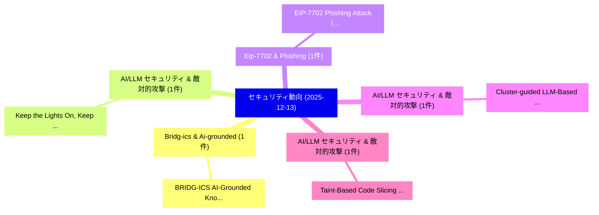

# 📅 02_daily: 日次エグゼクティブサマリー報告書 (2025-12-13)

**集計日時**: 2026-10-02 23:05:50 UTC  
**対象日付**: 2025-12-13  
**本日収集論文数**: 9 件  

---

## 💡 主要セキュリティ動向・脅威インサイト (Executive Insights)

本日の収集論文（計 9 件）において、以下の重点セキュリティ領域で活発な研究動向が確認されました：
- **Bridg-ics & Ai-grounded** (1 件): 注目論文として 「BRIDG-ICS: AI-Grounded Knowled...」 等が発表され、実務防御および攻撃検証の進展が見られます。
- **AI/LLM セキュリティ & 敵対的攻撃** (1 件): 注目論文として 「Keep the Lights On, Keep the L...」 等が発表され、実務防御および攻撃検証の進展が見られます。
- **Eip-7702 & Phishing** (1 件): 注目論文として 「EIP-7702 Phishing Attack（セキュリテ...」 等が発表され、実務防御および攻撃検証の進展が見られます。
- **AI/LLM セキュリティ & 敵対的攻撃** (1 件): 注目論文として 「Cluster-guided LLM-Based Anony...」 等が発表され、実務防御および攻撃検証の進展が見られます。
- **AI/LLM セキュリティ & 敵対的攻撃** (1 件): 注目論文として 「Taint-Based Code Slicing for L...」 等が発表され、実務防御および攻撃検証の進展が見られます。

### 🗺️ 技術・脅威トピックマインドマップ

---

## 📌 日次セキュリティ論文一覧 (日本語表形式)

| No | arXiv ID | 論文タイトル (日本語訳) | 重要キーワード | 構造化エグゼクティブ要約 (背景・提案・影響) | 脅威分類 | 詳細リンク |
|---|---|---|---|---|---|---|
| 1 | `2512.12112v2` | [BRIDG-ICS: AI-Grounded Knowledge Graphs for Intelligent Threat Analytics in Industry~5.0 Cyber-Physical Systems（セキュリティ分析論文）](../../okf/papers/2025-12-13/2512.12112.md) | `Grounded Knowledge Graphs`, `Intelligent Threat Analytics`, `Physical Systems` | 【提案】概要 (Overview & Key Finding) 本論文「BRIDG-ICS: AI-Grounded Knowledge Graphs for Intelligent...。実証評価により経営層・セキュリティ管理者向け推奨アクション (E... | `cybersecurity` | [arXiv](https://arxiv.org/abs/2512.12112v2) &#124; [OKF](../../okf/papers/2025-12-13/2512.12112.md) |
| 2 | `2512.12154v1` | [Keep the Lights On, Keep the Lengths in Check: Plug-In Adversarial Detection for Time-Series LLMs in Energy Forecasting（セキュリティ分析論文）](../../okf/papers/2025-12-13/2512.12154.md) | `Energy Forecasting`, `Plug-In Adversarial`, `Time-Series LLMs` | 【提案】概要 (Overview & Key Finding) 本論文「Keep the Lights On, Keep the Lengths in Check: Plug-In ...。実証評価により経営層・セキュリティ管理者向け推奨アクション (E... | `executive-summary` | [arXiv](https://arxiv.org/abs/2512.12154v1) &#124; [OKF](../../okf/papers/2025-12-13/2512.12154.md) |
| 3 | `2512.12174v1` | [EIP-7702 Phishing Attack（セキュリティ分析論文）](../../okf/papers/2025-12-13/2512.12174.md) | `Phishing Attack`, `EIP-7702 Phishing`, `Minfeng Qi` | 【提案】概要 (Overview & Key Finding) 本論文「EIP-7702 Phishing Attack（セキュリティ分析論文）」（原題: EIP-7702 Phis...。実証評価により経営層・セキュリティ管理者向け推奨アクション (E... | `cybersecurity` | [arXiv](https://arxiv.org/abs/2512.12174v1) &#124; [OKF](../../okf/papers/2025-12-13/2512.12174.md) |
| 4 | `2512.12224v1` | [Cluster-guided LLM-Based Anonymization of Software Analytics Data: Studying Privacy-Utility Trade-offs in JIT Defect Prediction（セキュリティ分析論文）](../../okf/papers/2025-12-13/2512.12224.md) | `Software Analytics Data`, `Based Anonymization`, `Studying Privacy` | 【提案】概要 (Overview & Key Finding) 本論文「Cluster-guided LLM-Based Anonymization of Software Anal...。実証評価により経営層・セキュリティ管理者向け推奨アクション (E... | `executive-summary` | [arXiv](https://arxiv.org/abs/2512.12224v1) &#124; [OKF](../../okf/papers/2025-12-13/2512.12224.md) |
| 5 | `2512.12313v3` | [Taint-Based Code Slicing for LLMs-based Malicious NPM Package Detection（セキュリティ分析論文）](../../okf/papers/2025-12-13/2512.12313.md) | `Based Code Slicing`, `Taint-Based Code`, `LLMs-based Malicious` | 【提案】概要 (Overview & Key Finding) 本論文「Taint-Based Code Slicing for LLMs-based Malicious NPM P...。実証評価により経営層・セキュリティ管理者向け推奨アクション (E... | `cybersecurity` | [arXiv](https://arxiv.org/abs/2512.12313v3) &#124; [OKF](../../okf/papers/2025-12-13/2512.12313.md) |
| 6 | `2512.12324v3` | [UniMark: Artificial Intelligence Generated Content Identification Toolkit（セキュリティ分析論文）](../../okf/papers/2025-12-13/2512.12324.md) | `Artificial Intelligence Generated Content Identification Toolkit`, `Meilin Li`, `Yi Yu` | 【提案】概要 (Overview & Key Finding) 本論文「UniMark: Artificial Intelligence Generated Content Iden...。実証評価により経営層・セキュリティ管理者向け推奨アクション (E... | `cs.AI` | [arXiv](https://arxiv.org/abs/2512.12324v3) &#124; [OKF](../../okf/papers/2025-12-13/2512.12324.md) |
| 7 | `2512.12332v1` | [Dynamic Homophily with Imperfect Recall: Modeling Resilience in Adversarial Networks（セキュリティ分析論文）](../../okf/papers/2025-12-13/2512.12332.md) | `Dynamic Homophily`, `Imperfect Recall`, `Modeling Resilience` | 【提案】概要 (Overview & Key Finding) 本論文「Dynamic Homophily with Imperfect Recall: Modeling Resil...。実証評価により経営層・セキュリティ管理者向け推奨アクション (E... | `cs.AI` | [arXiv](https://arxiv.org/abs/2512.12332v1) &#124; [OKF](../../okf/papers/2025-12-13/2512.12332.md) |
| 8 | `2512.12483v3` | [Mage: Cracking Elliptic Curve Cryptography with Cross-Axis Transformers（セキュリティ分析論文）](../../okf/papers/2025-12-13/2512.12483.md) | `Cracking Elliptic Curve Cryptography`, `Axis Transformers`, `Cross-Axis Transformers` | 【提案】概要 (Overview & Key Finding) 本論文「Mage: Cracking Elliptic Curve 暗号技術 with Cross-Axis Tran...。実証評価により経営層・セキュリティ管理者向け推奨アクション (E... | `cs.AI` | [arXiv](https://arxiv.org/abs/2512.12483v3) &#124; [OKF](../../okf/papers/2025-12-13/2512.12483.md) |
| 9 | `2512.14748v1` | [Modeling the Interdependent Coupling of Safety and Security for Connected and Automated Vehicles: A Copula-Based Integrated Risk Analysis Approach（セキュリティ分析論文）](../../okf/papers/2025-12-13/2512.14748.md) | `Interdependent Coupling`, `Automated Vehicles`, `Copula-Based Integrated` | 【提案】概要 (Overview & Key Finding) 本論文「Modeling the Interdependent Coupling of Safety and Secu...。実証評価により経営層・セキュリティ管理者向け推奨アクション (E... | `cybersecurity` | [arXiv](https://arxiv.org/abs/2512.14748v1) &#124; [OKF](../../okf/papers/2025-12-13/2512.14748.md) |

