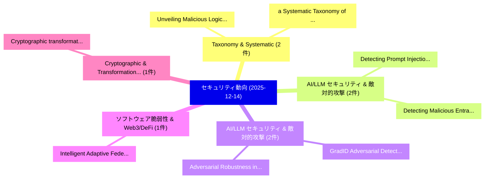

# 📅 02_daily: 日次エグゼクティブサマリー報告書 (2025-12-14)

**集計日時**: 2026-10-02 23:05:50 UTC  
**対象日付**: 2025-12-14  
**本日収集論文数**: 19 件  

---

## 💡 主要セキュリティ動向・脅威インサイト (Executive Insights)

本日の収集論文（計 19 件）において、以下の重点セキュリティ領域で活発な研究動向が確認されました：
- **Taxonomy & Systematic** (2 件): 注目論文として 「Unveiling Malicious Logic: a S...」、「a Systematic Taxonomy of Attac...」 等が発表され、実務防御および攻撃検証の進展が見られます。
- **AI/LLM セキュリティ & 敵対的攻撃** (2 件): 注目論文として 「Detecting Prompt Injection Att...」、「Detecting Malicious Entra OAut...」 等が発表され、実務防御および攻撃検証の進展が見られます。
- **AI/LLM セキュリティ & 敵対的攻撃** (2 件): 注目論文として 「GradID: Adversarial Detection ...」、「Adversarial Robustness in Fina...」 等が発表され、実務防御および攻撃検証の進展が見られます。
- **ソフトウェア脆弱性 & Web3/DeFi** (1 件): 注目論文として 「Intelligent Adaptive Federated...」 等が発表され、実務防御および攻撃検証の進展が見られます。
- **Cryptographic & Transformations** (1 件): 注目論文として 「Cryptographic transformations ...」 等が発表され、実務防御および攻撃検証の進展が見られます。

### 🗺️ 技術・脅威トピックマインドマップ

---

## 📌 日次セキュリティ論文一覧 (日本語表形式)

| No | arXiv ID | 論文タイトル (日本語訳) | 重要キーワード | 構造化エグゼクティブ要約 (背景・提案・影響) | 脅威分類 | 詳細リンク |
|---|---|---|---|---|---|---|
| 1 | `2512.12559v1` | [Unveiling Malicious Logic: a Statement-Level Taxonomy and Dataset for Securing Python Packagesに向けて](../../okf/papers/2025-12-14/2512.12559.md) | `Unveiling Malicious Logic`, `Level Taxonomy`, `Statement-Level Taxonomy` | 【提案】概要 (Overview & Key Finding) 本論文「Unveiling Malicious Logic: a Statement-Level Taxonomy a...。実証評価により経営層・セキュリティ管理者向け推奨アクション (E... | `cybersecurity` | [arXiv](https://arxiv.org/abs/2512.12559v1) &#124; [OKF](../../okf/papers/2025-12-14/2512.12559.md) |
| 2 | `2512.12568v1` | [Intelligent Adaptive Federated Byzantine Agreement for Robust Blockchain Consensus（セキュリティ分析論文）](../../okf/papers/2025-12-14/2512.12568.md) | `Intelligent Adaptive Federated Byzantine Agreement`, `Robust Blockchain Consensus`, `Erdhi Widyarto Nugroho` | 【提案】概要 (Overview & Key Finding) 本論文「Intelligent Adaptive Federated Byzantine Agreement for ...。実証評価により経営層・セキュリティ管理者向け推奨アクション (E... | `cybersecurity` | [arXiv](https://arxiv.org/abs/2512.12568v1) &#124; [OKF](../../okf/papers/2025-12-14/2512.12568.md) |
| 3 | `2512.12580v2` | [Cryptographic transformations over polyadic rings（セキュリティ分析論文）](../../okf/papers/2025-12-14/2512.12580.md) | `Steven Duplij`, `Qiang Guo`, `Na Fu` | 【提案】概要 (Overview & Key Finding) 本論文「Cryptographic transformations over polyadic rings（セキュリテ...。実証評価により経営層・セキュリティ管理者向け推奨アクション (E... | `math-ph` | [arXiv](https://arxiv.org/abs/2512.12580v2) &#124; [OKF](../../okf/papers/2025-12-14/2512.12580.md) |
| 4 | `2512.12583v1` | [Detecting Prompt Injection Attacks Against Application Using Classifiers（セキュリティ分析論文）](../../okf/papers/2025-12-14/2512.12583.md) | `Mohammad Rafid Hamid`, `Abrar Faiaz Khan`, `Safwan Shaheer` | 【提案】概要 (Overview & Key Finding) 本論文「Detecting プロンプトインジェクション Attacks Against Application Usi...。実証評価により経営層・セキュリティ管理者向け推奨アクション (E... | `cs.AI` | [arXiv](https://arxiv.org/abs/2512.12583v1) &#124; [OKF](../../okf/papers/2025-12-14/2512.12583.md) |
| 5 | `2512.12593v1` | [SHERLOCK: A Deep Learning Approach To Detect Software Vulnerabilities（セキュリティ分析論文）](../../okf/papers/2025-12-14/2512.12593.md) | `Saadh Jawwadh`, `Guhanathan Poravi`, `Raw Meta` | 【提案】概要 (Overview & Key Finding) 本論文「SHERLOCK: A Deep Learning Approach To Detect Software V...。実証評価により経営層・セキュリティ管理者向け推奨アクション (E... | `executive-summary` | [arXiv](https://arxiv.org/abs/2512.12593v1) &#124; [OKF](../../okf/papers/2025-12-14/2512.12593.md) |
| 6 | `2512.12594v2` | [ceLLMate: Sandboxing Browser AI Agents（セキュリティ分析論文）](../../okf/papers/2025-12-14/2512.12594.md) | `Sandboxing Browser`, `Luoxi Meng`, `Henry Feng` | 【提案】概要 (Overview & Key Finding) 本論文「ceLLMate: Sandboxing Browser AI Agents（セキュリティ分析論文）」（原題:...。実証評価により経営層・セキュリティ管理者向け推奨アクション (E... | `executive-summary` | [arXiv](https://arxiv.org/abs/2512.12594v2) &#124; [OKF](../../okf/papers/2025-12-14/2512.12594.md) |
| 7 | `2512.12729v1` | [RunPBA -- Runtime attestation for microcontrollers with PACBTI（セキュリティ分析論文）](../../okf/papers/2025-12-14/2512.12729.md) | `Raw Meta`, `Executive Summary`, `Key Finding` | 【提案】概要 (Overview & Key Finding) 本論文「RunPBA -- Runtime attestation for microcontrollers with...。実証評価によりResende, Luís Antunes - *... | `cybersecurity` | [arXiv](https://arxiv.org/abs/2512.12729v1) &#124; [OKF](../../okf/papers/2025-12-14/2512.12729.md) |
| 8 | `2512.12827v1` | [GradID: Adversarial Detection via Intrinsic Dimensionality of Gradients（セキュリティ分析論文）](../../okf/papers/2025-12-14/2512.12827.md) | `Adversarial Detection`, `Intrinsic Dimensionality`, `Mohammad Mahdi Razmjoo` | 【提案】概要 (Overview & Key Finding) 本論文「GradID: Adversarial Detection via Intrinsic Dimensional...。実証評価により経営層・セキュリティ管理者向け推奨アクション (E... | `cs.CV` | [arXiv](https://arxiv.org/abs/2512.12827v1) &#124; [OKF](../../okf/papers/2025-12-14/2512.12827.md) |
| 9 | `2512.12829v2` | [a Systematic Taxonomy of Attacks against Space Infrastructuresに向けて](../../okf/papers/2025-12-14/2512.12829.md) | `Systematic Taxonomy`, `Space Infrastructures`, `Jose Luis Castanon Remy` | 【提案】概要 (Overview & Key Finding) 本論文「a Systematic Taxonomy of Attacks against Space Infrastr...。実証評価により経営層・セキュリティ管理者向け推奨アクション (E... | `cybersecurity` | [arXiv](https://arxiv.org/abs/2512.12829v2) &#124; [OKF](../../okf/papers/2025-12-14/2512.12829.md) |
| 10 | `2512.12837v1` | [Algorithmic Criminal Liability in Greenwashing: Comparing India, United States, and European Union（セキュリティ分析論文）](../../okf/papers/2025-12-14/2512.12837.md) | `Algorithmic Criminal Liability`, `Comparing India`, `United States` | 【提案】概要 (Overview & Key Finding) 本論文「Algorithmic Criminal Liability in Greenwashing: Compari...。実証評価により経営層・セキュリティ管理者向け推奨アクション (E... | `cs.AI` | [arXiv](https://arxiv.org/abs/2512.12837v1) &#124; [OKF](../../okf/papers/2025-12-14/2512.12837.md) |
| 11 | `2512.14751v3` | [One Leak Away: How Pretrained Model Exposure Amplifies Jailbreak Risks in Finetuned LLMs（セキュリティ分析論文）](../../okf/papers/2025-12-14/2512.14751.md) | `One Leak Away`, `Yixin Tan`, `Zhe Yu` | 【提案】概要 (Overview & Key Finding) 本論文「One Leak Away: How Pretrained Model Exposure Amplifies ...。実証評価により経営層・セキュリティ管理者向け推奨アクション (E... | `cs.AI` | [arXiv](https://arxiv.org/abs/2512.14751v3) &#124; [OKF](../../okf/papers/2025-12-14/2512.14751.md) |
| 12 | `2512.14753v1` | [CODE ACROSTIC: Robust Watermarking for Code Generation（セキュリティ分析論文）](../../okf/papers/2025-12-14/2512.14753.md) | `Robust Watermarking`, `Code Generation`, `Li Lin` | 【提案】概要 (Overview & Key Finding) 本論文「CODE ACROSTIC: Robust Watermarking for Code Generation（...。実証評価により経営層・セキュリティ管理者向け推奨アクション (E... | `cs.AI` | [arXiv](https://arxiv.org/abs/2512.14753v1) &#124; [OKF](../../okf/papers/2025-12-14/2512.14753.md) |
| 13 | `2512.15777v1` | [Variable Record Table: A Unified Hardware-Assisted Framework for Runtime Security（セキュリティ分析論文）](../../okf/papers/2025-12-14/2512.15777.md) | `Variable Record Table`, `Unified Hardware`, `Runtime Security` | 【提案】概要 (Overview & Key Finding) 本論文「Variable Record Table: A Unified Hardware-Assisted Fram...。実証評価により経営層・セキュリティ管理者向け推奨アクション (E... | `cybersecurity` | [arXiv](https://arxiv.org/abs/2512.15777v1) &#124; [OKF](../../okf/papers/2025-12-14/2512.15777.md) |
| 14 | `2512.15778v2` | [COBRA: Catastrophic Bit-flip Reliability State-Space Modelsの分析](../../okf/papers/2025-12-14/2512.15778.md) | `Catastrophic Bit`, `Bit-flip Reliability`, `Space Models` | 【提案】概要 (Overview & Key Finding) 本論文「COBRA: Catastrophic Bit-flip Reliability State-Space Mo...。実証評価により経営層・セキュリティ管理者向け推奨アクション (E... | `executive-summary` | [arXiv](https://arxiv.org/abs/2512.15778v2) &#124; [OKF](../../okf/papers/2025-12-14/2512.15778.md) |
| 15 | `2512.15779v1` | [Hyperparameter Tuning-Based Optimized Performance Machine Learning Algorithms for Network Intrusion Detectionの分析](../../okf/papers/2025-12-14/2512.15779.md) | `Hyperparameter Tuning`, `Tuning-Based Optimized`, `Based Optimized Performance Machine Learning Algorithms` | 【提案】概要 (Overview & Key Finding) 本論文「Hyperparameter Tuning-Based Optimized Performance Machi...。実証評価により経営層・セキュリティ管理者向け推奨アクション (E... | `cs.NI` | [arXiv](https://arxiv.org/abs/2512.15779v1) &#124; [OKF](../../okf/papers/2025-12-14/2512.15779.md) |
| 16 | `2512.15780v1` | [Adversarial Robustness in Financial Machine Learning: Defenses, Economic Impact, and Governance Evidence（セキュリティ分析論文）](../../okf/papers/2025-12-14/2512.15780.md) | `Financial Machine Learning`, `Adversarial Robustness`, `Economic Impact` | 【提案】概要 (Overview & Key Finding) 本論文「Adversarial Robustness in Financial Machine Learning: D...。実証評価により経営層・セキュリティ管理者向け推奨アクション (E... | `cs.AI` | [arXiv](https://arxiv.org/abs/2512.15780v1) &#124; [OKF](../../okf/papers/2025-12-14/2512.15780.md) |
| 17 | `2512.15781v1` | [Detecting Malicious Entra OAuth Apps with LLM-Based Permission Risk Scoring（セキュリティ分析論文）](../../okf/papers/2025-12-14/2512.15781.md) | `Based Permission Risk Scoring`, `Detecting Malicious Entra`, `LLM-Based Permission` | 【提案】概要 (Overview & Key Finding) 本論文「Detecting Malicious Entra OAuth Apps with LLM-Based Per...。実証評価により経営層・セキュリティ管理者向け推奨アクション (E... | `cybersecurity` | [arXiv](https://arxiv.org/abs/2512.15781v1) &#124; [OKF](../../okf/papers/2025-12-14/2512.15781.md) |
| 18 | `2512.15782v1` | [Auto-Tuning Safety Guardrails for Black-Box 大規模言語モデル](../../okf/papers/2025-12-14/2512.15782.md) | `Tuning Safety Guardrails`, `Auto-Tuning Safety`, `Box Large Language Models` | 【提案】概要 (Overview & Key Finding) 本論文「Auto-Tuning Safety Guardrails for Black-Box 大規模言語モデル」（原...。実証評価により経営層・セキュリティ管理者向け推奨アクション (E... | `executive-summary` | [arXiv](https://arxiv.org/abs/2512.15782v1) &#124; [OKF](../../okf/papers/2025-12-14/2512.15782.md) |
| 19 | `2602.22218v1` | [サイバーセキュリティ Data Extraction from Common Crawl](../../okf/papers/2025-12-14/2602.22218.md) | `Common Crawl`, `Cybersecurity Data Extraction`, `Data Extraction` | 【提案】概要 (Overview & Key Finding) 本論文「サイバーセキュリティ Data Extraction from Common Crawl」（原題: Cyber...。実証評価により経営層・セキュリティ管理者向け推奨アクション (E... | `executive-summary` | [arXiv](https://arxiv.org/abs/2602.22218v1) &#124; [OKF](../../okf/papers/2025-12-14/2602.22218.md) |

