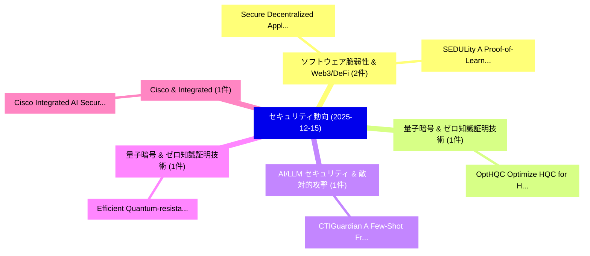

# 📅 02_daily: 日次エグゼクティブサマリー報告書 (2025-12-15)

**集計日時**: 2026-10-02 23:05:51 UTC  
**対象日付**: 2025-12-15  
**本日収集論文数**: 24 件  

---

## 💡 主要セキュリティ動向・脅威インサイト (Executive Insights)

本日の収集論文（計 24 件）において、以下の重点セキュリティ領域で活発な研究動向が確認されました：
- **ソフトウェア脆弱性 & Web3/DeFi** (2 件): 注目論文として 「Secure Decentralized Applicati...」、「SEDULity: A Proof-of-Learning ...」 等が発表され、実務防御および攻撃検証の進展が見られます。
- **量子暗号 & ゼロ知識証明技術** (1 件): 注目論文として 「OptHQC: Optimize HQC for High-...」 等が発表され、実務防御および攻撃検証の進展が見られます。
- **AI/LLM セキュリティ & 敵対的攻撃** (1 件): 注目論文として 「CTIGuardian: A Few-Shot Framew...」 等が発表され、実務防御および攻撃検証の進展が見られます。
- **量子暗号 & ゼロ知識証明技術** (1 件): 注目論文として 「Efficient Quantum-resistant De...」 等が発表され、実務防御および攻撃検証の進展が見られます。
- **Cisco & Integrated** (1 件): 注目論文として 「Cisco Integrated AI Security a...」 等が発表され、実務防御および攻撃検証の進展が見られます。

### 🗺️ 技術・脅威トピックマインドマップ

---

## 📌 日次セキュリティ論文一覧 (日本語表形式)

| No | arXiv ID | 論文タイトル (日本語訳) | 重要キーワード | 構造化エグゼクティブ要約 (背景・提案・影響) | 脅威分類 | 詳細リンク |
|---|---|---|---|---|---|---|
| 1 | `2512.12904v1` | [OptHQC: Optimize HQC for High-Performance Post-Quantum Cryptography（セキュリティ分析論文）](../../okf/papers/2025-12-15/2512.12904.md) | `Performance Post`, `Quantum Cryptography`, `High-Performance Post` | 【提案】概要 (Overview & Key Finding) 本論文「OptHQC: Optimize HQC for High-Performance ポスト量子暗号（セキュリテ...。実証評価により経営層・セキュリティ管理者向け推奨アクション (E... | `cybersecurity` | [arXiv](https://arxiv.org/abs/2512.12904v1) &#124; [OKF](../../okf/papers/2025-12-15/2512.12904.md) |
| 2 | `2512.12914v1` | [CTIGuardian: A Few-Shot Framework for Mitigating Privacy Leakage in Fine-Tuned LLMs（セキュリティ分析論文）](../../okf/papers/2025-12-15/2512.12914.md) | `Mitigating Privacy Leakage`, `Fine-Tuned LLMs`, `Shashie Dilhara Batan Arachchige` | 【提案】概要 (Overview & Key Finding) 本論文「CTIGuardian: A Few-Shot Framework for Mitigating Privac...。実証評価により経営層・セキュリティ管理者向け推奨アクション (E... | `cs.AI` | [arXiv](https://arxiv.org/abs/2512.12914v1) &#124; [OKF](../../okf/papers/2025-12-15/2512.12914.md) |
| 3 | `2512.12917v1` | [Efficient Quantum-resistant Delegable Data Analysis Scheme with Revocation and Keyword Search in Mobile Cloud Computing（セキュリティ分析論文）](../../okf/papers/2025-12-15/2512.12917.md) | `Mobile Cloud Computing`, `Efficient Quantum`, `Keyword Search` | 【提案】概要 (Overview & Key Finding) 本論文「Efficient 量子-resistant Delegable Data Analysis Scheme w...。実証評価により経営層・セキュリティ管理者向け推奨アクション (E... | `cybersecurity` | [arXiv](https://arxiv.org/abs/2512.12917v1) &#124; [OKF](../../okf/papers/2025-12-15/2512.12917.md) |
| 4 | `2512.12921v1` | [Cisco Integrated AI Security and Safety Framework Report（セキュリティ分析論文）](../../okf/papers/2025-12-15/2512.12921.md) | `Cisco Integrated`, `Amy Chang`, `Tiffany Saade` | 【提案】概要 (Overview & Key Finding) 本論文「Cisco Integrated AI Security and Safety Framework Repor...。実証評価により経営層・セキュリティ管理者向け推奨アクション (E... | `cs.AI` | [arXiv](https://arxiv.org/abs/2512.12921v1) &#124; [OKF](../../okf/papers/2025-12-15/2512.12921.md) |
| 5 | `2512.12989v2` | [Quantigence: A Multi-Agent Framework for Post-Quantum Security Analysis on Commodity Hardware（セキュリティ分析論文）](../../okf/papers/2025-12-15/2512.12989.md) | `Post-Quantum Security`, `Commodity Hardware`, `Abdulmalik Alquwayfili` | 【提案】概要 (Overview & Key Finding) 本論文「Quantigence: A Multi-Agent Framework for Post-量子 Securi...。実証評価により経営層・セキュリティ管理者向け推奨アクション (E... | `executive-summary` | [arXiv](https://arxiv.org/abs/2512.12989v2) &#124; [OKF](../../okf/papers/2025-12-15/2512.12989.md) |
| 6 | `2512.13039v2` | [Bi-Erasing: A Bidirectional Framework for Concept Removal in Diffusion Models（セキュリティ分析論文）](../../okf/papers/2025-12-15/2512.13039.md) | `Concept Removal`, `Diffusion Models`, `Hao Chen` | 【提案】概要 (Overview & Key Finding) 本論文「Bi-Erasing: A Bidirectional Framework for Concept Remov...。実証評価により経営層・セキュリティ管理者向け推奨アクション (E... | `cs.CV` | [arXiv](https://arxiv.org/abs/2512.13039v2) &#124; [OKF](../../okf/papers/2025-12-15/2512.13039.md) |
| 7 | `2512.13119v1` | [Less Is More: Sparse and Cooperative Perturbation for Point Cloud Attacks（セキュリティ分析論文）](../../okf/papers/2025-12-15/2512.13119.md) | `Point Cloud Attacks`, `Cooperative Perturbation`, `Keke Tang` | 【提案】概要 (Overview & Key Finding) 本論文「Less Is More: Sparse and Cooperative Perturbation for P...。実証評価により経営層・セキュリティ管理者向け推奨アクション (E... | `cybersecurity` | [arXiv](https://arxiv.org/abs/2512.13119v1) &#124; [OKF](../../okf/papers/2025-12-15/2512.13119.md) |
| 8 | `2512.13199v1` | [Investigation of a Bit-Sequence Reconciliation Protocol Based on Neural TPM Networks in Secure Quantum Communications（セキュリティ分析論文）](../../okf/papers/2025-12-15/2512.13199.md) | `Sequence Reconciliation Protocol Based`, `Secure Quantum Communications`, `Bit-Sequence Reconciliation` | 【提案】概要 (Overview & Key Finding) 本論文「Investigation of a Bit-Sequence Reconciliation Protocol...。実証評価により経営層・セキュリティ管理者向け推奨アクション (E... | `executive-summary` | [arXiv](https://arxiv.org/abs/2512.13199v1) &#124; [OKF](../../okf/papers/2025-12-15/2512.13199.md) |
| 9 | `2512.13207v2` | [Evaluating Federated Learning for Temperature Forecastingに対する敵対的攻撃](../../okf/papers/2025-12-15/2512.13207.md) | `Evaluating Adversarial Attacks`, `Evaluating Federated Learning`, `Federated Learning` | 【提案】概要 (Overview & Key Finding) 本論文「Evaluating Federated Learning for Temperature Forecasti...。実証評価により経営層・セキュリティ管理者向け推奨アクション (E... | `executive-summary` | [arXiv](https://arxiv.org/abs/2512.13207v2) &#124; [OKF](../../okf/papers/2025-12-15/2512.13207.md) |
| 10 | `2512.13213v1` | [Secure Decentralized Applications and Consensus Protocols in Blockchains (on Selfish Mining, Undercutting Attacks, DAG-Based Blockchains, E-Voting, Cryptocurrency Wallets, Secure-Logging, and CBDC)に向けて](../../okf/papers/2025-12-15/2512.13213.md) | `Consensus Protocols`, `Selfish Mining`, `Undercutting Attacks` | 【提案】概要 (Overview & Key Finding) 本論文「Secure Decentralized Applications and Consensus Protoco...。実証評価により提案アプローチ・技術革新 (Technical I... | `executive-summary` | [arXiv](https://arxiv.org/abs/2512.13213v1) &#124; [OKF](../../okf/papers/2025-12-15/2512.13213.md) |
| 11 | `2512.13325v2` | [Security and Detectability Unicode Text Watermarking Methods against Large Language Modelsの分析](../../okf/papers/2025-12-15/2512.13325.md) | `Detectability Unicode Text Watermarking Methods`, `Unicode Text Watermarking Methods`, `Large Language` | 【提案】概要 (Overview & Key Finding) 本論文「Security and Detectability Unicode Text Watermarking Me...。実証評価により経営層・セキュリティ管理者向け推奨アクション (E... | `cs.AI` | [arXiv](https://arxiv.org/abs/2512.13325v2) &#124; [OKF](../../okf/papers/2025-12-15/2512.13325.md) |
| 12 | `2512.13333v2` | [Quantum Disruption: An SOK of How Post-Quantum Attackers Reshape Blockchain Security and Performance（セキュリティ分析論文）](../../okf/papers/2025-12-15/2512.13333.md) | `Quantum Attackers Reshape Blockchain Security`, `Quantum Disruption`, `Post-Quantum Attackers` | 【提案】概要 (Overview & Key Finding) 本論文「量子 Disruption: An SOK of How Post-量子 Attackers Reshape ...。実証評価により経営層・セキュリティ管理者向け推奨アクション (E... | `cybersecurity` | [arXiv](https://arxiv.org/abs/2512.13333v2) &#124; [OKF](../../okf/papers/2025-12-15/2512.13333.md) |
| 13 | `2512.13352v3` | [On the Effectiveness of Membership Inference in Targeted Data Extraction from 大規模言語モデル](../../okf/papers/2025-12-15/2512.13352.md) | `Targeted Data Extraction`, `Membership Inference`, `Large Language Models` | 【提案】概要 (Overview & Key Finding) 本論文「On the Effectiveness of Membership Inference in Targete...。実証評価により経営層・セキュリティ管理者向け推奨アクション (E... | `executive-summary` | [arXiv](https://arxiv.org/abs/2512.13352v3) &#124; [OKF](../../okf/papers/2025-12-15/2512.13352.md) |
| 14 | `2512.13361v1` | [Automated User Identification from Facial Thermograms with Siamese Networks（セキュリティ分析論文）](../../okf/papers/2025-12-15/2512.13361.md) | `Automated User Identification`, `Facial Thermograms`, `Siamese Networks` | 【提案】概要 (Overview & Key Finding) 本論文「Automated User Identification from Facial Thermograms w...。実証評価により経営層・セキュリティ管理者向け推奨アクション (E... | `cs.CV` | [arXiv](https://arxiv.org/abs/2512.13361v1) &#124; [OKF](../../okf/papers/2025-12-15/2512.13361.md) |
| 15 | `2512.13430v2` | [Weak Enforcement and Low Compliance in PCI DSS: A Comparative Security Study（セキュリティ分析論文）](../../okf/papers/2025-12-15/2512.13430.md) | `Weak Enforcement`, `Low Compliance`, `Soonwon Park` | 【提案】概要 (Overview & Key Finding) 本論文「Weak Enforcement and Low Compliance in PCI DSS: A Compa...。実証評価により経営層・セキュリティ管理者向け推奨アクション (E... | `executive-summary` | [arXiv](https://arxiv.org/abs/2512.13430v2) &#124; [OKF](../../okf/papers/2025-12-15/2512.13430.md) |
| 16 | `2512.13501v1` | [Behavior-Aware and Generalizable Defense Against Black-Box Adversarial Attacks for ML-Based IDS（セキュリティ分析論文）](../../okf/papers/2025-12-15/2512.13501.md) | `Box Adversarial Attacks`, `Black-Box Adversarial`, `ML-Based IDS` | 【提案】概要 (Overview & Key Finding) 本論文「Behavior-Aware and Generalizable Defense Against Black-...。実証評価により経営層・セキュリティ管理者向け推奨アクション (E... | `cs.AI` | [arXiv](https://arxiv.org/abs/2512.13501v1) &#124; [OKF](../../okf/papers/2025-12-15/2512.13501.md) |
| 17 | `2512.13613v1` | [QoeSiGN: Qualified Collaborative eSignaturesに向けて](../../okf/papers/2025-12-15/2512.13613.md) | `Towards Qualified Collaborative`, `Qualified Collaborative`, `Stephan Krenn` | 【提案】概要 (Overview & Key Finding) 本論文「QoeSiGN: Qualified Collaborative eSignaturesに向けて」（原題: Q...。実証評価によりKoch, Stephan Krenn, Alex... | `cybersecurity` | [arXiv](https://arxiv.org/abs/2512.13613v1) &#124; [OKF](../../okf/papers/2025-12-15/2512.13613.md) |
| 18 | `2512.13628v3` | [Certified-Everlasting Quantum NIZK Proofs（セキュリティ分析論文）](../../okf/papers/2025-12-15/2512.13628.md) | `Everlasting Quantum`, `Certified-Everlasting Quantum`, `Nikhil Pappu` | 【提案】概要 (Overview & Key Finding) 本論文「Certified-Everlasting 量子 NIZK Proofs（セキュリティ分析論文）」（原題: C...。実証評価により経営層・セキュリティ管理者向け推奨アクション (E... | `executive-summary` | [arXiv](https://arxiv.org/abs/2512.13628v3) &#124; [OKF](../../okf/papers/2025-12-15/2512.13628.md) |
| 19 | `2512.13666v2` | [SEDULity: A Proof-of-Learning Framework for Distributed and Secure Blockchains with Efficient Useful Work（セキュリティ分析論文）](../../okf/papers/2025-12-15/2512.13666.md) | `Secure Blockchains`, `Weihang Cao`, `Mustafa Doger` | 【提案】概要 (Overview & Key Finding) 本論文「SEDULity: A Proof-of-Learning Framework for Distributed...。実証評価により経営層・セキュリティ管理者向け推奨アクション (E... | `executive-summary` | [arXiv](https://arxiv.org/abs/2512.13666v2) &#124; [OKF](../../okf/papers/2025-12-15/2512.13666.md) |
| 20 | `2512.13767v1` | [Stability-Drift Early Warning for Cyber-Physical Systems Under Degradation Attacks（セキュリティ分析論文）](../../okf/papers/2025-12-15/2512.13767.md) | `Drift Early Warning`, `Stability-Drift Early`, `Cyber-Physical Systems` | 【提案】概要 (Overview & Key Finding) 本論文「Stability-Drift Early Warning for Cyber-Physical System...。実証評価により経営層・セキュリティ管理者向け推奨アクション (E... | `cybersecurity` | [arXiv](https://arxiv.org/abs/2512.13767v1) &#124; [OKF](../../okf/papers/2025-12-15/2512.13767.md) |
| 21 | `2512.14759v1` | [Quantum Resource Low-Round Keccak/SHA-3 Preimage Attack: From Classical 2^57.8 to Quantum 2^28.9 using Qiskit Modelingの分析](../../okf/papers/2025-12-15/2512.14759.md) | `Round Keccak`, `Preimage Attack`, `Low-Round Keccak` | 【提案】概要 (Overview & Key Finding) 本論文「量子 Resource Low-Round Keccak/SHA-3 Preimage Attack: Fro...。実証評価により経営層・セキュリティ管理者向け推奨アクション (E... | `executive-summary` | [arXiv](https://arxiv.org/abs/2512.14759v1) &#124; [OKF](../../okf/papers/2025-12-15/2512.14759.md) |
| 22 | `2512.15790v1` | [Bilevel Optimization for Covert Memory Tampering in Heterogeneous Multi-Agent Architectures (XAMT)（セキュリティ分析論文）](../../okf/papers/2025-12-15/2512.15790.md) | `Covert Memory Tampering`, `Bilevel Optimization`, `Heterogeneous Multi` | 【提案】概要 (Overview & Key Finding) 本論文「Bilevel Optimization for Covert Memory Tampering in Het...。実証評価により経営層・セキュリティ管理者向け推奨アクション (E... | `cybersecurity` | [arXiv](https://arxiv.org/abs/2512.15790v1) &#124; [OKF](../../okf/papers/2025-12-15/2512.15790.md) |
| 23 | `2512.19711v1` | [PHANTOM: PHysical ANamorphic Threats Obstructing Connected Vehicle Mobility（セキュリティ分析論文）](../../okf/papers/2025-12-15/2512.19711.md) | `Threats Obstructing Connected Vehicle Mobility`, `Md Nahid Hasan Shuvo`, `Moinul Hossain` | 【提案】概要 (Overview & Key Finding) 本論文「PHANTOM: PHysical ANamorphic Threats Obstructing Connec...。実証評価により経営層・セキュリティ管理者向け推奨アクション (E... | `cs.AI` | [arXiv](https://arxiv.org/abs/2512.19711v1) &#124; [OKF](../../okf/papers/2025-12-15/2512.19711.md) |
| 24 | `2512.22154v1` | [Practical challenges of control monitoring in frontier AI deployments（セキュリティ分析論文）](../../okf/papers/2025-12-15/2512.22154.md) | `David Lindner`, `Charlie Griffin`, `Tomek Korbak` | 【提案】概要 (Overview & Key Finding) 本論文「Practical challenges of control monitoring in frontier ...。実証評価により経営層・セキュリティ管理者向け推奨アクション (E... | `cs.AI` | [arXiv](https://arxiv.org/abs/2512.22154v1) &#124; [OKF](../../okf/papers/2025-12-15/2512.22154.md) |

