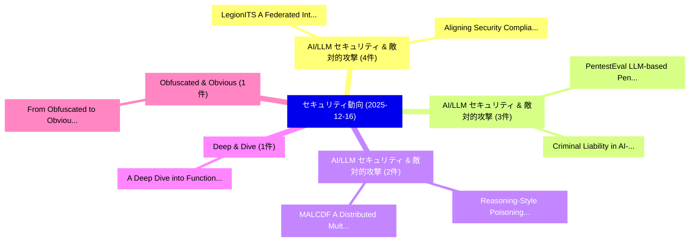

# 📅 02_daily: 日次エグゼクティブサマリー報告書 (2025-12-16)

**集計日時**: 2026-10-02 23:05:51 UTC  
**対象日付**: 2025-12-16  
**本日収集論文数**: 28 件  

---

## 💡 主要セキュリティ動向・脅威インサイト (Executive Insights)

本日の収集論文（計 28 件）において、以下の重点セキュリティ領域で活発な研究動向が確認されました：
- **AI/LLM セキュリティ & 敵対的攻撃** (4 件): 注目論文として 「LegionITS: A Federated Intrusi...」、「Aligning Security Compliance a...」 等が発表され、実務防御および攻撃検証の進展が見られます。
- **AI/LLM セキュリティ & 敵対的攻撃** (3 件): 注目論文として 「PentestEval: LLM-based Penetra...」、「Criminal Liability in AI-Enabl...」 等が発表され、実務防御および攻撃検証の進展が見られます。
- **AI/LLM セキュリティ & 敵対的攻撃** (2 件): 注目論文として 「Reasoning-Style Poisoning of L...」、「MALCDF: A Distributed Multi-Ag...」 等が発表され、実務防御および攻撃検証の進展が見られます。
- **Deep & Dive** (1 件): 注目論文として 「A Deep Dive into Function Inli...」 等が発表され、実務防御および攻撃検証の進展が見られます。
- **Obfuscated & Obvious** (1 件): 注目論文として 「From Obfuscated to Obvious: A ...」 等が発表され、実務防御および攻撃検証の進展が見られます。

### 🗺️ 技術・脅威トピックマインドマップ

---

## 📌 日次セキュリティ論文一覧 (日本語表形式)

| No | arXiv ID | 論文タイトル (日本語訳) | 重要キーワード | 構造化エグゼクティブ要約 (背景・提案・影響) | 脅威分類 | 詳細リンク |
|---|---|---|---|---|---|---|
| 1 | `2512.14045v1` | [A Deep Dive into Function Inlining and its Security Implications for ML-based Binary Analysis（セキュリティ分析論文）](../../okf/papers/2025-12-16/2512.14045.md) | `Deep Dive`, `Function Inlining`, `Security Implications` | 【提案】概要 (Overview & Key Finding) 本論文「A Deep Dive into Function Inlining and its Security Imp...。実証評価により経営層・セキュリティ管理者向け推奨アクション (E... | `cs.PL` | [arXiv](https://arxiv.org/abs/2512.14045v1) &#124; [OKF](../../okf/papers/2025-12-16/2512.14045.md) |
| 2 | `2512.14070v1` | [From Obfuscated to Obvious: A Comprehensive JavaScript Deobfuscation Tool for Security Analysis（セキュリティ分析論文）](../../okf/papers/2025-12-16/2512.14070.md) | `Deobfuscation Tool`, `Dongchao Zhou`, `Lingyun Ying` | 【提案】概要 (Overview & Key Finding) 本論文「From Obfuscated to Obvious: A Comprehensive JavaScript ...。実証評価により経営層・セキュリティ管理者向け推奨アクション (E... | `executive-summary` | [arXiv](https://arxiv.org/abs/2512.14070v1) &#124; [OKF](../../okf/papers/2025-12-16/2512.14070.md) |
| 3 | `2512.14130v1` | [UIXPOSE: Mobile マルウェア検出 via Intention-Behaviour Discrepancy Analysis](../../okf/papers/2025-12-16/2512.14130.md) | `Intention-Behaviour Discrepancy`, `Mobile Malware Detection`, `Amirmohammad Pasdar` | 【提案】概要 (Overview & Key Finding) 本論文「UIXPOSE: Mobile マルウェア検出 via Intention-Behaviour Discrep...。実証評価により経営層・セキュリティ管理者向け推奨アクション (E... | `cs.AI` | [arXiv](https://arxiv.org/abs/2512.14130v1) &#124; [OKF](../../okf/papers/2025-12-16/2512.14130.md) |
| 4 | `2512.14139v1` | [HAL -- An Open-Source Framework for Gate-Level Netlist Analysis（セキュリティ分析論文）](../../okf/papers/2025-12-16/2512.14139.md) | `Gate-Level Netlist`, `Julian Speith`, `Marc Fyrbiak` | 【提案】概要 (Overview & Key Finding) 本論文「HAL -- An Open-Source Framework for Gate-Level Netlist ...。実証評価により経営層・セキュリティ管理者向け推奨アクション (E... | `cybersecurity` | [arXiv](https://arxiv.org/abs/2512.14139v1) &#124; [OKF](../../okf/papers/2025-12-16/2512.14139.md) |
| 5 | `2512.14158v1` | [CIS-BA: Continuous Interaction Space Based Backdoor Attack for Object Detection in the Real-World（セキュリティ分析論文）](../../okf/papers/2025-12-16/2512.14158.md) | `Continuous Interaction Space Based Backdoor Attack`, `Object Detection`, `Shuxin Zhao` | 【提案】概要 (Overview & Key Finding) 本論文「CIS-BA: Continuous Interaction Space Based Backdoor Att...。実証評価により経営層・セキュリティ管理者向け推奨アクション (E... | `cs.CV` | [arXiv](https://arxiv.org/abs/2512.14158v1) &#124; [OKF](../../okf/papers/2025-12-16/2512.14158.md) |
| 6 | `2512.14166v2` | [IntentMiner: Intent Inversion Attack via Tool Call Analysis in the Model Context Protocol（セキュリティ分析論文）](../../okf/papers/2025-12-16/2512.14166.md) | `Intent Inversion Attack`, `Model Context Protocol`, `Yunhao Yao` | 【提案】概要 (Overview & Key Finding) 本論文「IntentMiner: Intent Inversion Attack via Tool Call Anal...。実証評価により経営層・セキュリティ管理者向け推奨アクション (E... | `cs.AI` | [arXiv](https://arxiv.org/abs/2512.14166v2) &#124; [OKF](../../okf/papers/2025-12-16/2512.14166.md) |
| 7 | `2512.14233v1` | [PentestEval: LLM-based Penetration Testing with Modular and Stage-Level Designのベンチマーク評価](../../okf/papers/2025-12-16/2512.14233.md) | `Penetration Testing`, `LLM-based Penetration`, `Level Design` | 【提案】概要 (Overview & Key Finding) 本論文「PentestEval: LLM-based Penetration Testing with Modular...。実証評価により経営層・セキュリティ管理者向け推奨アクション (E... | `cs.AI` | [arXiv](https://arxiv.org/abs/2512.14233v1) &#124; [OKF](../../okf/papers/2025-12-16/2512.14233.md) |
| 8 | `2512.14242v1` | [LegionITS: A Federated Intrusion-Tolerant System Architecture（セキュリティ分析論文）](../../okf/papers/2025-12-16/2512.14242.md) | `Tolerant System Architecture`, `Federated Intrusion`, `Intrusion-Tolerant System` | 【提案】概要 (Overview & Key Finding) 本論文「LegionITS: A Federated Intrusion-Tolerant System Archit...。実証評価によりCorreia, Rolando Mart。 | `executive-summary` | [arXiv](https://arxiv.org/abs/2512.14242v1) &#124; [OKF](../../okf/papers/2025-12-16/2512.14242.md) |
| 9 | `2512.14330v1` | [Criminal Liability in AI-Enabled 自動運転車両: A Comparative Study](../../okf/papers/2025-12-16/2512.14330.md) | `Criminal Liability`, `Enabled Autonomous Vehicles`, `AI-Enabled Autonomous` | 【提案】概要 (Overview & Key Finding) 本論文「Criminal Liability in AI-Enabled 自動運転車両: A Comparative ...。実証評価により経営層・セキュリティ管理者向け推奨アクション (E... | `cs.AI` | [arXiv](https://arxiv.org/abs/2512.14330v1) &#124; [OKF](../../okf/papers/2025-12-16/2512.14330.md) |
| 10 | `2512.14376v1` | [Lost in the Pages: WebAssembly Code Recovery through SEV-SNP's Exposed Address Space（セキュリティ分析論文）](../../okf/papers/2025-12-16/2512.14376.md) | `Exposed Address Space`, `Code Recovery`, `Markus Berthilsson` | 【提案】概要 (Overview & Key Finding) 本論文「Lost in the Pages: WebAssembly Code Recovery through SE...。実証評価により経営層・セキュリティ管理者向け推奨アクション (E... | `cybersecurity` | [arXiv](https://arxiv.org/abs/2512.14376v1) &#124; [OKF](../../okf/papers/2025-12-16/2512.14376.md) |
| 11 | `2512.14422v1` | [Hybrid Ensemble Method for Detecting Cyber-Attacks in Water Distribution Systems Using the BATADAL Dataset（セキュリティ分析論文）](../../okf/papers/2025-12-16/2512.14422.md) | `Water Distribution Systems Using`, `Detecting Cyber`, `Waqas Ahmed` | 【提案】概要 (Overview & Key Finding) 本論文「Hybrid Ensemble Method for Detecting Cyber-Attacks in W...。実証評価により経営層・セキュリティ管理者向け推奨アクション (E... | `executive-summary` | [arXiv](https://arxiv.org/abs/2512.14422v1) &#124; [OKF](../../okf/papers/2025-12-16/2512.14422.md) |
| 12 | `2512.14439v1` | [VICTOR: Dataset Copyright Auditing in Video Recognition Systems（セキュリティ分析論文）](../../okf/papers/2025-12-16/2512.14439.md) | `Dataset Copyright Auditing`, `Video Recognition Systems`, `Quan Yuan` | 【提案】概要 (Overview & Key Finding) 本論文「VICTOR: Dataset Copyright Auditing in Video Recognition...。実証評価により経営層・セキュリティ管理者向け推奨アクション (E... | `cs.CV` | [arXiv](https://arxiv.org/abs/2512.14439v1) &#124; [OKF](../../okf/papers/2025-12-16/2512.14439.md) |
| 13 | `2512.14448v1` | [Reasoning-Style Poisoning of LLMエージェント via Stealthy Style Transfer: Process-Level Attacks and Runtime Monitoring in RSV Space](../../okf/papers/2025-12-16/2512.14448.md) | `Stealthy Style Transfer`, `Style Poisoning`, `Reasoning-Style Poisoning` | 【提案】概要 (Overview & Key Finding) 本論文「Reasoning-Style Poisoning of LLMエージェント via Stealthy Sty...。実証評価により経営層・セキュリティ管理者向け推奨アクション (E... | `cs.AI` | [arXiv](https://arxiv.org/abs/2512.14448v1) &#124; [OKF](../../okf/papers/2025-12-16/2512.14448.md) |
| 14 | `2512.14453v1` | [Aligning Security Compliance and DevOps: A Longitudinal Study（セキュリティ分析論文）](../../okf/papers/2025-12-16/2512.14453.md) | `Aligning Security Compliance`, `Florian Angermeir`, `Daniel Mendez` | 【提案】概要 (Overview & Key Finding) 本論文「Aligning Security Compliance and DevOps: A Longitudinal...。実証評価により経営層・セキュリティ管理者向け推奨アクション (E... | `executive-summary` | [arXiv](https://arxiv.org/abs/2512.14453v1) &#124; [OKF](../../okf/papers/2025-12-16/2512.14453.md) |
| 15 | `2512.14557v1` | [PrivATE: Differentially Private Average Treatment Effect Estimation for Observational Data（セキュリティ分析論文）](../../okf/papers/2025-12-16/2512.14557.md) | `Differentially Private Average Treatment Effect Estimation`, `Observational Data`, `Quan Yuan` | 【提案】概要 (Overview & Key Finding) 本論文「PrivATE: Differentially Private Average Treatment Effec...。実証評価により経営層・セキュリティ管理者向け推奨アクション (E... | `cybersecurity` | [arXiv](https://arxiv.org/abs/2512.14557v1) &#124; [OKF](../../okf/papers/2025-12-16/2512.14557.md) |
| 16 | `2512.14582v1` | [Exploiting Reset Operations in Cloud-based Quantum Computers to Run Quantum Circuits for Free（セキュリティ分析論文）](../../okf/papers/2025-12-16/2512.14582.md) | `Exploiting Reset Operations`, `Run Quantum Circuits`, `Quantum Computers` | 【提案】概要 (Overview & Key Finding) 本論文「Exploiting Reset Operations in Cloud-based 量子 Computers...。実証評価により経営層・セキュリティ管理者向け推奨アクション (E... | `executive-summary` | [arXiv](https://arxiv.org/abs/2512.14582v1) &#124; [OKF](../../okf/papers/2025-12-16/2512.14582.md) |
| 17 | `2512.14600v1` | [PerProb: Indirectly Evaluating Memorization in 大規模言語モデル](../../okf/papers/2025-12-16/2512.14600.md) | `Indirectly Evaluating Memorization`, `Large Language Models`, `Yihan Liao` | 【提案】概要 (Overview & Key Finding) 本論文「PerProb: Indirectly Evaluating Memorization in 大規模言語モデル...。実証評価により経営層・セキュリティ管理者向け推奨アクション (E... | `cybersecurity` | [arXiv](https://arxiv.org/abs/2512.14600v1) &#124; [OKF](../../okf/papers/2025-12-16/2512.14600.md) |
| 18 | `2512.14767v1` | [Privacy-Preserving Feature Valuation in Vertical 連合学習 Using Shapley-CMI and PSI Permutation](../../okf/papers/2025-12-16/2512.14767.md) | `Preserving Feature Valuation`, `Privacy-Preserving Feature`, `Vertical Federated Learning Using Shapley` | 【提案】概要 (Overview & Key Finding) 本論文「Privacy-Preserving Feature Valuation in Vertical 連合学習 U...。実証評価により経営層・セキュリティ管理者向け推奨アクション (E... | `cs.AI` | [arXiv](https://arxiv.org/abs/2512.14767v1) &#124; [OKF](../../okf/papers/2025-12-16/2512.14767.md) |
| 19 | `2512.14778v1` | [サイバーセキュリティ skills in new graduates: a Philippine perspective](../../okf/papers/2025-12-16/2512.14778.md) | `John Paul`, `Raw Meta`, `Executive Summary` | 【提案】概要 (Overview & Key Finding) 本論文「サイバーセキュリティ skills in new graduates: a Philippine perspe...。実証評価によりCanlas - **公開日時**: `2025-... | `executive-summary` | [arXiv](https://arxiv.org/abs/2512.14778v1) &#124; [OKF](../../okf/papers/2025-12-16/2512.14778.md) |
| 20 | `2512.14846v1` | [MALCDF: A Distributed Multi-Agent LLM Framework for Real-Time Cyber（セキュリティ分析論文）](../../okf/papers/2025-12-16/2512.14846.md) | `Distributed Multi`, `Time Cyber`, `Multi-Agent LLM` | 【提案】概要 (Overview & Key Finding) 本論文「MALCDF: A Distributed Multi-Agent LLM Framework for Rea...。実証評価により経営層・セキュリティ管理者向け推奨アクション (E... | `cs.AI` | [arXiv](https://arxiv.org/abs/2512.14846v1) &#124; [OKF](../../okf/papers/2025-12-16/2512.14846.md) |
| 21 | `2512.14860v1` | [Penetration Testing of Agentic AI: A Comparative Security Analysis Across Models and Frameworks（セキュリティ分析論文）](../../okf/papers/2025-12-16/2512.14860.md) | `Penetration Testing`, `Raw Meta`, `Executive Summary` | 【提案】概要 (Overview & Key Finding) 本論文「Penetration Testing of Agentic AI: A Comparative Securi...。実証評価により経営層・セキュリティ管理者向け推奨アクション (E... | `cs.AI` | [arXiv](https://arxiv.org/abs/2512.14860v1) &#124; [OKF](../../okf/papers/2025-12-16/2512.14860.md) |
| 22 | `2512.14935v1` | [Cloud Security Leveraging AI: A Fusion-Based AISOC for Malware and Log Behaviour Detection（セキュリティ分析論文）](../../okf/papers/2025-12-16/2512.14935.md) | `Cloud Security Leveraging`, `Log Behaviour Detection`, `Fusion-Based AISOC` | 【提案】概要 (Overview & Key Finding) 本論文「Cloud Security Leveraging AI: A Fusion-Based AISOC for ...。実証評価により経営層・セキュリティ管理者向け推奨アクション (E... | `executive-summary` | [arXiv](https://arxiv.org/abs/2512.14935v1) &#124; [OKF](../../okf/papers/2025-12-16/2512.14935.md) |
| 23 | `2512.14958v1` | [Intrusion Detection in Internet of Vehicles Using Machine Learning（セキュリティ分析論文）](../../okf/papers/2025-12-16/2512.14958.md) | `Vehicles Using Machine Learning`, `Intrusion Detection`, `Hop Le` | 【提案】概要 (Overview & Key Finding) 本論文「Intrusion Detection in Internet of Vehicles Using Machi...。実証評価により経営層・セキュリティ管理者向け推奨アクション (E... | `executive-summary` | [arXiv](https://arxiv.org/abs/2512.14958v1) &#124; [OKF](../../okf/papers/2025-12-16/2512.14958.md) |
| 24 | `2512.15641v2` | [ComMark: Covert and Robust Black-Box Model Watermarking with Compressed Samples（セキュリティ分析論文）](../../okf/papers/2025-12-16/2512.15641.md) | `Box Model Watermarking`, `Robust Black`, `Compressed Samples` | 【提案】概要 (Overview & Key Finding) 本論文「ComMark: Covert and Robust Black-Box Model Watermarking...。実証評価により経営層・セキュリティ管理者向け推奨アクション (E... | `cybersecurity` | [arXiv](https://arxiv.org/abs/2512.15641v2) &#124; [OKF](../../okf/papers/2025-12-16/2512.15641.md) |
| 25 | `2512.15794v1` | [Data Protection and Corporate Reputation Management in the Digital Era（セキュリティ分析論文）](../../okf/papers/2025-12-16/2512.15794.md) | `Corporate Reputation Management`, `Data Protection`, `Digital Era` | 【提案】概要 (Overview & Key Finding) 本論文「Data Protection and Corporate Reputation Management in ...。実証評価により経営層・セキュリティ管理者向け推奨アクション (E... | `executive-summary` | [arXiv](https://arxiv.org/abs/2512.15794v1) &#124; [OKF](../../okf/papers/2025-12-16/2512.15794.md) |
| 26 | `2512.15799v1` | [Cybercrime and Computer Forensics in Epoch of Artificial Intelligence in India（セキュリティ分析論文）](../../okf/papers/2025-12-16/2512.15799.md) | `Computer Forensics`, `Artificial Intelligence`, `Sahibpreet Singh` | 【提案】概要 (Overview & Key Finding) 本論文「Cybercrime and Computer Forensics in Epoch of Artificia...。実証評価により経営層・セキュリティ管理者向け推奨アクション (E... | `cs.AI` | [arXiv](https://arxiv.org/abs/2512.15799v1) &#124; [OKF](../../okf/papers/2025-12-16/2512.15799.md) |
| 27 | `2512.15803v1` | [An empirical zero-day vulnerabilities disclosed by the zero day initiativeの分析](../../okf/papers/2025-12-16/2512.15803.md) | `zero-day vulnerabilities`, `Apurva Shet`, `Izzat Alsmadi` | 【提案】概要 (Overview & Key Finding) 本論文「An empirical zero-day vulnerabilities disclosed by the ...。実証評価により経営層・セキュリティ管理者向け推奨アクション (E... | `executive-summary` | [arXiv](https://arxiv.org/abs/2512.15803v1) &#124; [OKF](../../okf/papers/2025-12-16/2512.15803.md) |
| 28 | `2512.20649v1` | [AIAuditTrack: A Framework for AI Security system（セキュリティ分析論文）](../../okf/papers/2025-12-16/2512.20649.md) | `Zixun Luo`, `Yuhang Fan`, `Yufei Li` | 【提案】概要 (Overview & Key Finding) 本論文「AIAuditTrack: A Framework for AI Security system（セキュリティ...。実証評価により経営層・セキュリティ管理者向け推奨アクション (E... | `cs.AI` | [arXiv](https://arxiv.org/abs/2512.20649v1) &#124; [OKF](../../okf/papers/2025-12-16/2512.20649.md) |

