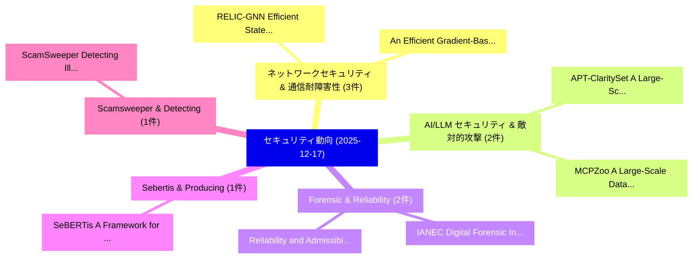

# 📅 02_daily: 日次エグゼクティブサマリー報告書 (2025-12-17)

**集計日時**: 2026-10-02 23:05:51 UTC  
**対象日付**: 2025-12-17  
**本日収集論文数**: 34 件  

---

## 💡 主要セキュリティ動向・脅威インサイト (Executive Insights)

本日の収集論文（計 34 件）において、以下の重点セキュリティ領域で活発な研究動向が確認されました：
- **ネットワークセキュリティ & 通信耐障害性** (3 件): 注目論文として 「RELIC-GNN: Efficient State Reg...」、「An Efficient Gradient-Based In...」 等が発表され、実務防御および攻撃検証の進展が見られます。
- **AI/LLM セキュリティ & 敵対的攻撃** (2 件): 注目論文として 「APT-ClaritySet: A Large-Scale,...」、「MCPZoo: A Large-Scale Dataset ...」 等が発表され、実務防御および攻撃検証の進展が見られます。
- **Forensic & Reliability** (2 件): 注目論文として 「IANEC: Digital Forensic Invest...」、「Reliability and Admissibility ...」 等が発表され、実務防御および攻撃検証の進展が見られます。
- **Sebertis & Producing** (1 件): 注目論文として 「SeBERTis: A Framework for Prod...」 等が発表され、実務防御および攻撃検証の進展が見られます。
- **Scamsweeper & Detecting** (1 件): 注目論文として 「ScamSweeper: Detecting Illegal...」 等が発表され、実務防御および攻撃検証の進展が見られます。

### 🗺️ 技術・脅威トピックマインドマップ

---

## 📌 日次セキュリティ論文一覧 (日本語表形式)

| No | arXiv ID | 論文タイトル (日本語訳) | 重要キーワード | 構造化エグゼクティブ要約 (背景・提案・影響) | 脅威分類 | 詳細リンク |
|---|---|---|---|---|---|---|
| 1 | `2512.15003v1` | [SeBERTis: A Framework for Producing Classifiers of Security-Related Issue Reports（セキュリティ分析論文）](../../okf/papers/2025-12-17/2512.15003.md) | `Related Issue Reports`, `Producing Classifiers`, `Security-Related Issue` | 【提案】概要 (Overview & Key Finding) 本論文「SeBERTis: A Framework for Producing Classifiers of Secu...。実証評価により経営層・セキュリティ管理者向け推奨アクション (E... | `executive-summary` | [arXiv](https://arxiv.org/abs/2512.15003v1) &#124; [OKF](../../okf/papers/2025-12-17/2512.15003.md) |
| 2 | `2512.15030v1` | [ScamSweeper: Detecting Illegal Accounts in Web3 Scams via Transactions Analysis（セキュリティ分析論文）](../../okf/papers/2025-12-17/2512.15030.md) | `Detecting Illegal Accounts`, `Web3 Scams`, `Xiaoqi Li` | 【提案】概要 (Overview & Key Finding) 本論文「ScamSweeper: Detecting Illegal Accounts in Web3 Scams v...。実証評価により経営層・セキュリティ管理者向け推奨アクション (E... | `cybersecurity` | [arXiv](https://arxiv.org/abs/2512.15030v1) &#124; [OKF](../../okf/papers/2025-12-17/2512.15030.md) |
| 3 | `2512.15037v1` | [RELIC-GNN: Efficient State Registers Identification with Graph Neural Network for Reverse Engineering（セキュリティ分析論文）](../../okf/papers/2025-12-17/2512.15037.md) | `Efficient State Registers Identification`, `Graph Neural Network`, `Reverse Engineering` | 【提案】概要 (Overview & Key Finding) 本論文「RELIC-GNN: Efficient State Registers Identification wit...。実証評価により経営層・セキュリティ管理者向け推奨アクション (E... | `cybersecurity` | [arXiv](https://arxiv.org/abs/2512.15037v1) &#124; [OKF](../../okf/papers/2025-12-17/2512.15037.md) |
| 4 | `2512.15039v1` | [APT-ClaritySet: A Large-Scale, High-Fidelity Labeled Dataset for APT Malware with Alias Normalization and Graph-Based Deduplication（セキュリティ分析論文）](../../okf/papers/2025-12-17/2512.15039.md) | `Fidelity Labeled Dataset`, `Alias Normalization`, `Based Deduplication` | 【提案】概要 (Overview & Key Finding) 本論文「APT-ClaritySet: A Large-Scale, High-Fidelity Labeled Da...。実証評価により経営層・セキュリティ管理者向け推奨アクション (E... | `executive-summary` | [arXiv](https://arxiv.org/abs/2512.15039v1) &#124; [OKF](../../okf/papers/2025-12-17/2512.15039.md) |
| 5 | `2512.15081v1` | [Quantifying Return on Security Controls in LLM Systems（セキュリティ分析論文）](../../okf/papers/2025-12-17/2512.15081.md) | `Quantifying Return`, `Security Controls`, `Richard Helder Moulton` | 【提案】概要 (Overview & Key Finding) 本論文「Quantifying Return on Security Controls in LLM Systems（...。実証評価によりHastings - **公開日時**: `202... | `cs.AI` | [arXiv](https://arxiv.org/abs/2512.15081v1) &#124; [OKF](../../okf/papers/2025-12-17/2512.15081.md) |
| 6 | `2512.15143v1` | [An Efficient Gradient-Based Inference Attack for 連合学習](../../okf/papers/2025-12-17/2512.15143.md) | `Based Inference Attack`, `Gradient-Based Inference`, `Federated Learning` | 【提案】概要 (Overview & Key Finding) 本論文「An Efficient Gradient-Based Inference Attack for 連合学習」（...。実証評価により経営層・セキュリティ管理者向け推奨アクション (E... | `executive-summary` | [arXiv](https://arxiv.org/abs/2512.15143v1) &#124; [OKF](../../okf/papers/2025-12-17/2512.15143.md) |
| 7 | `2512.15144v3` | [MCPZoo: A Large-Scale Dataset of Runnable Model Context Protocol Servers for AI Agent（セキュリティ分析論文）](../../okf/papers/2025-12-17/2512.15144.md) | `Runnable Model Context Protocol Servers`, `Scale Dataset`, `Large-Scale Dataset` | 【提案】概要 (Overview & Key Finding) 本論文「MCPZoo: A Large-Scale Dataset of Runnable Model Context...。実証評価により経営層・セキュリティ管理者向け推奨アクション (E... | `cybersecurity` | [arXiv](https://arxiv.org/abs/2512.15144v3) &#124; [OKF](../../okf/papers/2025-12-17/2512.15144.md) |
| 8 | `2512.15150v1` | [Policy-Value Guided MDP-MCTS Framework for Cyber Kill-Chain Inference（セキュリティ分析論文）](../../okf/papers/2025-12-17/2512.15150.md) | `Value Guided`, `Cyber Kill`, `Chain Inference` | 【提案】概要 (Overview & Key Finding) 本論文「Policy-Value Guided MDP-MCTS Framework for Cyber Kill-C...。実証評価により経営層・セキュリティ管理者向け推奨アクション (E... | `cybersecurity` | [arXiv](https://arxiv.org/abs/2512.15150v1) &#124; [OKF](../../okf/papers/2025-12-17/2512.15150.md) |
| 9 | `2512.15179v2` | [No More Hidden Pitfalls? Exposing Smart Contract Bad Practices with LLM-Powered Hybrid Analysis（セキュリティ分析論文）](../../okf/papers/2025-12-17/2512.15179.md) | `Exposing Smart Contract Bad Practices`, `LLM-Powered Hybrid`, `Xiaoqi Li` | 【提案】Exposing スマートコントラクト Bad Practices with LLM-Powered Hybrid Analysis ### (日本語題名: No More ...。実証評価により経営層・セキュリティ管理者向け推奨アクション (E... | `cybersecurity` | [arXiv](https://arxiv.org/abs/2512.15179v2) &#124; [OKF](../../okf/papers/2025-12-17/2512.15179.md) |
| 10 | `2512.15275v1` | [Bounty Hunter: Autonomous, Comprehensive Emulation of Multi-Faceted Adversaries（セキュリティ分析論文）](../../okf/papers/2025-12-17/2512.15275.md) | `Bounty Hunter`, `Comprehensive Emulation`, `Faceted Adversaries` | 【提案】概要 (Overview & Key Finding) 本論文「Bounty Hunter: Autonomous, Comprehensive Emulation of M...。実証評価により経営層・セキュリティ管理者向け推奨アクション (E... | `cybersecurity` | [arXiv](https://arxiv.org/abs/2512.15275v1) &#124; [OKF](../../okf/papers/2025-12-17/2512.15275.md) |
| 11 | `2512.15286v1` | [Quantum Machine Learning for サイバーセキュリティ: A Taxonomy and Future Directions](../../okf/papers/2025-12-17/2512.15286.md) | `Quantum Machine Learning`, `Future Directions`, `Sri Harshita Manuri` | 【提案】概要 (Overview & Key Finding) 本論文「量子 Machine Learning for サイバーセキュリティ: A Taxonomy and Futu...。実証評価により経営層・セキュリティ管理者向け推奨アクション (E... | `cs.AI` | [arXiv](https://arxiv.org/abs/2512.15286v1) &#124; [OKF](../../okf/papers/2025-12-17/2512.15286.md) |
| 12 | `2512.15330v3` | [Practical Challenges in Executing Shor's Algorithm on Existing Quantum Platforms（セキュリティ分析論文）](../../okf/papers/2025-12-17/2512.15330.md) | `Existing Quantum Platforms`, `Practical Challenges`, `Executing Shor` | 【提案】概要 (Overview & Key Finding) 本論文「Practical Challenges in Executing Shor's Algorithm on E...。実証評価により経営層・セキュリティ管理者向け推奨アクション (E... | `cs.ET` | [arXiv](https://arxiv.org/abs/2512.15330v3) &#124; [OKF](../../okf/papers/2025-12-17/2512.15330.md) |
| 13 | `2512.15335v1` | [Bits for Privacy: Evaluating Post-Training Quantization via Membership Inference（セキュリティ分析論文）](../../okf/papers/2025-12-17/2512.15335.md) | `Evaluating Post`, `Training Quantization`, `Post-Training Quantization` | 【提案】概要 (Overview & Key Finding) 本論文「Bits for Privacy: Evaluating Post-Training Quantization...。実証評価により経営層・セキュリティ管理者向け推奨アクション (E... | `executive-summary` | [arXiv](https://arxiv.org/abs/2512.15335v1) &#124; [OKF](../../okf/papers/2025-12-17/2512.15335.md) |
| 14 | `2512.15379v1` | [Remotely Detectable Robot Policy Watermarking（セキュリティ分析論文）](../../okf/papers/2025-12-17/2512.15379.md) | `Remotely Detectable Robot Policy Watermarking`, `Michael Amir`, `Manon Flageat` | 【提案】概要 (Overview & Key Finding) 本論文「Remotely Detectable Robot Policy Watermarking（セキュリティ分析論...。実証評価により経営層・セキュリティ管理者向け推奨アクション (E... | `executive-summary` | [arXiv](https://arxiv.org/abs/2512.15379v1) &#124; [OKF](../../okf/papers/2025-12-17/2512.15379.md) |
| 15 | `2512.15387v2` | [Talking to the Airgap: Exploiting Radio-Less Embedded Devices as Radio Receivers（セキュリティ分析論文）](../../okf/papers/2025-12-17/2512.15387.md) | `Less Embedded Devices`, `Exploiting Radio`, `Radio Receivers` | 【提案】概要 (Overview & Key Finding) 本論文「Talking to the Airgap: Exploiting Radio-Less Embedded D...。実証評価により経営層・セキュリティ管理者向け推奨アクション (E... | `cybersecurity` | [arXiv](https://arxiv.org/abs/2512.15387v2) &#124; [OKF](../../okf/papers/2025-12-17/2512.15387.md) |
| 16 | `2512.15414v1` | [Packed マルウェア検出 Using Grayscale Binary-to-Image Representations](../../okf/papers/2025-12-17/2512.15414.md) | `Image Representations`, `Packed Malware Detection Using Grayscale Binary`, `Using Grayscale Binary` | 【提案】概要 (Overview & Key Finding) 本論文「Packed マルウェア検出 Using Grayscale Binary-to-Image Represen...。実証評価により経営層・セキュリティ管理者向け推奨アクション (E... | `cybersecurity` | [arXiv](https://arxiv.org/abs/2512.15414v1) &#124; [OKF](../../okf/papers/2025-12-17/2512.15414.md) |
| 17 | `2512.15447v2` | [Insecure Ingredients? Exploring Dependency Update Patterns of Bundled JavaScript Packages on the Web（セキュリティ分析論文）](../../okf/papers/2025-12-17/2512.15447.md) | `Exploring Dependency Update Patterns`, `Insecure Ingredients`, `Ben Swierzy` | 【提案】Exploring Dependency Update Patterns of Bundled JavaScript Packages on the Web ### (日本語...。実証評価により経営層・セキュリティ管理者向け推奨アクション (E... | `executive-summary` | [arXiv](https://arxiv.org/abs/2512.15447v2) &#124; [OKF](../../okf/papers/2025-12-17/2512.15447.md) |
| 18 | `2512.15468v2` | [How Do Semantically Equivalent Code Transformations Impact Membership Inference on LLMs for Code?（セキュリティ分析論文）](../../okf/papers/2025-12-17/2512.15468.md) | `Md Nazmul Haque`, `Hua Yang`, `Alejandro Velasco` | 【提案】### (日本語題名: How Do Semantically Equivalent Code Transformations Impact Membership Infer...。実証評価により経営層・セキュリティ管理者向け推奨アクション (E... | `cs.AI` | [arXiv](https://arxiv.org/abs/2512.15468v2) &#124; [OKF](../../okf/papers/2025-12-17/2512.15468.md) |
| 19 | `2512.15503v3` | [Attention in Motion: Secure Platooning via Transformer-based Misbehavior Detection（セキュリティ分析論文）](../../okf/papers/2025-12-17/2512.15503.md) | `Secure Platooning`, `Misbehavior Detection`, `Transformer-based Misbehavior` | 【提案】概要 (Overview & Key Finding) 本論文「Attention in Motion: Secure Platooning via Transformer-...。実証評価により経営層・セキュリティ管理者向け推奨アクション (E... | `cs.NI` | [arXiv](https://arxiv.org/abs/2512.15503v3) &#124; [OKF](../../okf/papers/2025-12-17/2512.15503.md) |
| 20 | `2512.15510v1` | [Time will Tell: Large-scale De-anonymization of Hidden I2P Services via Live Behavior Alignment (Extended Version)（セキュリティ分析論文）](../../okf/papers/2025-12-17/2512.15510.md) | `Live Behavior Alignment`, `Extended Version`, `Large-scale De` | 【提案】概要 (Overview & Key Finding) 本論文「Time will Tell: Large-scale De-anonymization of Hidden ...。実証評価により経営層・セキュリティ管理者向け推奨アクション (E... | `cybersecurity` | [arXiv](https://arxiv.org/abs/2512.15510v1) &#124; [OKF](../../okf/papers/2025-12-17/2512.15510.md) |
| 21 | `2512.15515v1` | [FAME: FPGA Acceleration of Secure Matrix Multiplication with Homomorphic Encryption（セキュリティ分析論文）](../../okf/papers/2025-12-17/2512.15515.md) | `Secure Matrix Multiplication`, `Homomorphic Encryption`, `Zhihan Xu` | 【提案】概要 (Overview & Key Finding) 本論文「FAME: FPGA Acceleration of Secure Matrix Multiplication...。実証評価により経営層・セキュリティ管理者向け推奨アクション (E... | `executive-summary` | [arXiv](https://arxiv.org/abs/2512.15515v1) &#124; [OKF](../../okf/papers/2025-12-17/2512.15515.md) |
| 22 | `2512.15648v1` | [Distributed HDMM: Scalable, Distributed, Accurate, and Differentially Private Query Workloads without a Trusted Curator（セキュリティ分析論文）](../../okf/papers/2025-12-17/2512.15648.md) | `Differentially Private Query Workloads`, `Trusted Curator`, `Ratang Sedimo` | 【提案】背景とセキュリティ上の課題 (Background & Problem) 本研究はサイバー脅威環境におけるセキュリティ構造・脆弱性の検証を目的としています。(主要検出項目: ...。実証評価により経営層・セキュリティ管理者向け推奨アクション (E... | `cybersecurity` | [arXiv](https://arxiv.org/abs/2512.15648v1) &#124; [OKF](../../okf/papers/2025-12-17/2512.15648.md) |
| 23 | `2512.15688v1` | [BashArena: A Control Setting for Highly Privileged AI Agents（セキュリティ分析論文）](../../okf/papers/2025-12-17/2512.15688.md) | `Control Setting`, `Highly Privileged`, `Adam Kaufman` | 【提案】概要 (Overview & Key Finding) 本論文「BashArena: A Control Setting for Highly Privileged AI A...。実証評価により経営層・セキュリティ管理者向け推奨アクション (E... | `cs.AI` | [arXiv](https://arxiv.org/abs/2512.15688v1) &#124; [OKF](../../okf/papers/2025-12-17/2512.15688.md) |
| 24 | `2512.15815v1` | [Implementing a Scalable, Redeployable and Multitiered Repository for FAIR and Secure Scientific Data Sharing: The BIG-MAP Archive（セキュリティ分析論文）](../../okf/papers/2025-12-17/2512.15815.md) | `Secure Scientific Data Sharing`, `Multitiered Repository`, `BIG-MAP Archive` | 【提案】概要 (Overview & Key Finding) 本論文「Implementing a Scalable, Redeployable and Multitiered R...。実証評価により経営層・セキュリティ管理者向け推奨アクション (E... | `cs.DB` | [arXiv](https://arxiv.org/abs/2512.15815v1) &#124; [OKF](../../okf/papers/2025-12-17/2512.15815.md) |
| 25 | `2512.15818v1` | [Unveiling the Attribute Misbinding Threat in Identity-Preserving Models（セキュリティ分析論文）](../../okf/papers/2025-12-17/2512.15818.md) | `Attribute Misbinding Threat`, `Preserving Models`, `Identity-Preserving Models` | 【提案】概要 (Overview & Key Finding) 本論文「Unveiling the Attribute Misbinding 脅威 in Identity-Prese...。実証評価により経営層・セキュリティ管理者向け推奨アクション (E... | `cybersecurity` | [arXiv](https://arxiv.org/abs/2512.15818v1) &#124; [OKF](../../okf/papers/2025-12-17/2512.15818.md) |
| 26 | `2512.15823v2` | [Secure AI-Driven Super-Resolution for Real-Time Mixed Reality Applications（セキュリティ分析論文）](../../okf/papers/2025-12-17/2512.15823.md) | `Time Mixed Reality Applications`, `Driven Super`, `AI-Driven Super` | 【提案】概要 (Overview & Key Finding) 本論文「Secure AI-Driven Super-Resolution for Real-Time Mixed R...。実証評価により経営層・セキュリティ管理者向け推奨アクション (E... | `cs.MM` | [arXiv](https://arxiv.org/abs/2512.15823v2) &#124; [OKF](../../okf/papers/2025-12-17/2512.15823.md) |
| 27 | `2512.15892v1` | [VET Your Agent: Host-Independent Autonomy via Verifiable Execution Tracesに向けて](../../okf/papers/2025-12-17/2512.15892.md) | `Independent Autonomy`, `Host-Independent Autonomy`, `Verifiable Execution Traces` | 【提案】概要 (Overview & Key Finding) 本論文「VET Your Agent: Host-Independent Autonomy via Verifiabl...。実証評価により経営層・セキュリティ管理者向け推奨アクション (E... | `cs.AI` | [arXiv](https://arxiv.org/abs/2512.15892v1) &#124; [OKF](../../okf/papers/2025-12-17/2512.15892.md) |
| 28 | `2512.15915v1` | [Private Virtual Tree Networks for Secure Multi-Tenant Environments Based on the VIRGO Overlay Network（セキュリティ分析論文）](../../okf/papers/2025-12-17/2512.15915.md) | `Private Virtual Tree Networks`, `Tenant Environments Based`, `Secure Multi` | 【提案】概要 (Overview & Key Finding) 本論文「Private Virtual Tree Networks for Secure Multi-Tenant E...。実証評価により経営層・セキュリティ管理者向け推奨アクション (E... | `executive-summary` | [arXiv](https://arxiv.org/abs/2512.15915v1) &#124; [OKF](../../okf/papers/2025-12-17/2512.15915.md) |
| 29 | `2512.15919v1` | [Analysing Multidisciplinary Approaches to Fight Large-Scale Digital Influence Operations（セキュリティ分析論文）](../../okf/papers/2025-12-17/2512.15919.md) | `Analysing Multidisciplinary Approaches`, `Scale Digital Influence Operations`, `Fight Large` | 【提案】概要 (Overview & Key Finding) 本論文「Analysing Multidisciplinary Approaches to Fight Large-S...。実証評価により経営層・セキュリティ管理者向け推奨アクション (E... | `executive-summary` | [arXiv](https://arxiv.org/abs/2512.15919v1) &#124; [OKF](../../okf/papers/2025-12-17/2512.15919.md) |
| 30 | `2512.15966v2` | [Charge It to My Neighbor: A Relay Attack on ISO 15118 Plug and Charge Payment（セキュリティ分析論文）](../../okf/papers/2025-12-17/2512.15966.md) | `Relay Attack`, `Charge Payment`, `Vishwa Vasu` | 【提案】概要 (Overview & Key Finding) 本論文「Charge It to My Neighbor: A Relay Attack on ISO 15118 P...。実証評価により経営層・セキュリティ管理者向け推奨アクション (E... | `cybersecurity` | [arXiv](https://arxiv.org/abs/2512.15966v2) &#124; [OKF](../../okf/papers/2025-12-17/2512.15966.md) |
| 31 | `2512.15990v1` | [Random coding for long-range continuous-variable QKD（セキュリティ分析論文）](../../okf/papers/2025-12-17/2512.15990.md) | `long-range continuous`, `Arpan Akash Ray`, `Boris Skoric` | 【提案】概要 (Overview & Key Finding) 本論文「Random coding for long-range continuous-variable QKD（セキ...。実証評価により経営層・セキュリティ管理者向け推奨アクション (E... | `executive-summary` | [arXiv](https://arxiv.org/abs/2512.15990v1) &#124; [OKF](../../okf/papers/2025-12-17/2512.15990.md) |
| 32 | `2512.19730v1` | [ArcGen: Generalizing Neural Backdoor Detection Across Diverse Architectures（セキュリティ分析論文）](../../okf/papers/2025-12-17/2512.19730.md) | `Generalizing Neural Backdoor Detection Across Diverse Architectures`, `Zhonghao Yang`, `Cheng Luo` | 【提案】概要 (Overview & Key Finding) 本論文「ArcGen: Generalizing Neural Backdoor Detection Across D...。実証評価により経営層・セキュリティ管理者向け推奨アクション (E... | `executive-summary` | [arXiv](https://arxiv.org/abs/2512.19730v1) &#124; [OKF](../../okf/papers/2025-12-17/2512.19730.md) |
| 33 | `2512.22167v1` | [IANEC: Digital Forensic Investigation of Contemporary Writers' Archives（セキュリティ分析論文）](../../okf/papers/2025-12-17/2512.22167.md) | `Digital Forensic Investigation`, `Contemporary Writers`, `Emmanuel Giguet` | 【提案】概要 (Overview & Key Finding) 本論文「IANEC: Digital Forensic Investigation of Contemporary W...。実証評価により経営層・セキュリティ管理者向け推奨アクション (E... | `cs.DL` | [arXiv](https://arxiv.org/abs/2512.22167v1) &#124; [OKF](../../okf/papers/2025-12-17/2512.22167.md) |
| 34 | `2601.06048v1` | [Reliability and Admissibility of AI-Generated Forensic Evidence in Criminal Trials（セキュリティ分析論文）](../../okf/papers/2025-12-17/2601.06048.md) | `Generated Forensic Evidence`, `Criminal Trials`, `AI-Generated Forensic` | 【提案】概要 (Overview & Key Finding) 本論文「Reliability and Admissibility of AI-Generated Forensic ...。実証評価により経営層・セキュリティ管理者向け推奨アクション (E... | `cs.AI` | [arXiv](https://arxiv.org/abs/2601.06048v1) &#124; [OKF](../../okf/papers/2025-12-17/2601.06048.md) |

