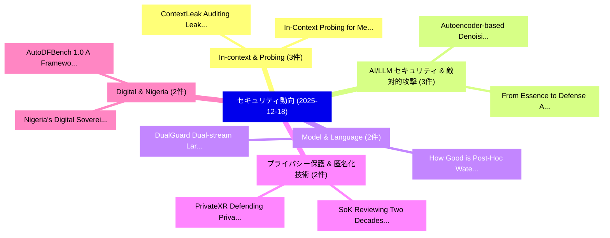

# 📅 02_daily: 日次エグゼクティブサマリー報告書 (2025-12-18)

**集計日時**: 2026-10-02 23:05:51 UTC  
**対象日付**: 2025-12-18  
**本日収集論文数**: 31 件  

---

## 💡 主要セキュリティ動向・脅威インサイト (Executive Insights)

本日の収集論文（計 31 件）において、以下の重点セキュリティ領域で活発な研究動向が確認されました：
- **In-context & Probing** (3 件): 注目論文として 「ContextLeak: Auditing Leakage ...」、「In-Context Probing for Members...」 等が発表され、実務防御および攻撃検証の進展が見られます。
- **AI/LLM セキュリティ & 敵対的攻撃** (3 件): 注目論文として 「Autoencoder-based Denoising De...」、「From Essence to Defense: Adapt...」 等が発表され、実務防御および攻撃検証の進展が見られます。
- **Model & Language** (2 件): 注目論文として 「DualGuard: Dual-stream Large L...」、「How Good is Post-Hoc Watermark...」 等が発表され、実務防御および攻撃検証の進展が見られます。
- **プライバシー保護 & 匿名化技術** (2 件): 注目論文として 「SoK: Reviewing Two Decades of ...」、「PrivateXR: Defending Privacy A...」 等が発表され、実務防御および攻撃検証の進展が見られます。
- **Digital & Nigeria** (2 件): 注目論文として 「AutoDFBench 1.0: A Framework f...」、「Nigeria's Digital Sovereignty:...」 等が発表され、実務防御および攻撃検証の進展が見られます。

### 🗺️ 技術・脅威トピックマインドマップ

---

## 📌 日次セキュリティ論文一覧 (日本語表形式)

| No | arXiv ID | 論文タイトル (日本語訳) | 重要キーワード | 構造化エグゼクティブ要約 (背景・提案・影響) | 脅威分類 | 詳細リンク |
|---|---|---|---|---|---|---|
| 1 | `2512.16059v2` | [ContextLeak: Auditing Leakage in Private In-Context Learning Methods（セキュリティ分析論文）](../../okf/papers/2025-12-18/2512.16059.md) | `Context Learning Methods`, `Auditing Leakage`, `In-Context Learning` | 【提案】概要 (Overview & Key Finding) 本論文「ContextLeak: Auditing Leakage in Private In-Context Lea...。実証評価により経営層・セキュリティ管理者向け推奨アクション (E... | `executive-summary` | [arXiv](https://arxiv.org/abs/2512.16059v2) &#124; [OKF](../../okf/papers/2025-12-18/2512.16059.md) |
| 2 | `2512.16080v1` | [Design of a Decentralized Fixed-Income Lending Automated Market Maker Protocol Supporting Arbitrary Maturities（セキュリティ分析論文）](../../okf/papers/2025-12-18/2512.16080.md) | `Income Lending Automated Market Maker Protocol Supporting Arbitrary Maturities`, `Decentralized Fixed`, `Fixed-Income Lending` | 【提案】概要 (Overview & Key Finding) 本論文「Design of a Decentralized Fixed-Income Lending Automate...。実証評価により経営層・セキュリティ管理者向け推奨アクション (E... | `q-fin.TR` | [arXiv](https://arxiv.org/abs/2512.16080v1) &#124; [OKF](../../okf/papers/2025-12-18/2512.16080.md) |
| 3 | `2512.16123v1` | [Autoencoder-based Denoising Defense against Object Detectionに対する敵対的攻撃](../../okf/papers/2025-12-18/2512.16123.md) | `Denoising Defense`, `Autoencoder-based Denoising`, `Adversarial Attacks` | 【提案】概要 (Overview & Key Finding) 本論文「Autoencoder-based Denoising Defense against Object Dete...。実証評価により経営層・セキュリティ管理者向け推奨アクション (E... | `cs.AI` | [arXiv](https://arxiv.org/abs/2512.16123v1) &#124; [OKF](../../okf/papers/2025-12-18/2512.16123.md) |
| 4 | `2512.16182v2` | [DualGuard: Dual-stream Large Language Model Watermarking Defense against Paraphrase and Spoofing Attack（セキュリティ分析論文）](../../okf/papers/2025-12-18/2512.16182.md) | `Large Language Model Watermarking Defense`, `Dual-stream Large`, `Spoofing Attack` | 【提案】概要 (Overview & Key Finding) 本論文「DualGuard: Dual-stream Large Language Model Watermarkin...。実証評価により経営層・セキュリティ管理者向け推奨アクション (E... | `executive-summary` | [arXiv](https://arxiv.org/abs/2512.16182v2) &#124; [OKF](../../okf/papers/2025-12-18/2512.16182.md) |
| 5 | `2512.16280v3` | [Love, Lies, and Language Models: Investigating AI's Role in Romance-Baiting Scams（セキュリティ分析論文）](../../okf/papers/2025-12-18/2512.16280.md) | `Language Models`, `Baiting Scams`, `Romance-Baiting Scams` | 【提案】概要 (Overview & Key Finding) 本論文「Love, Lies, and Language Models: Investigating AI's Rol...。実証評価により経営層・セキュリティ管理者向け推奨アクション (E... | `cs.AI` | [arXiv](https://arxiv.org/abs/2512.16280v3) &#124; [OKF](../../okf/papers/2025-12-18/2512.16280.md) |
| 6 | `2512.16284v2` | [Empirical Evaluation of Structured Synthetic Data Privacy Metrics: Novel experimental framework（セキュリティ分析論文）](../../okf/papers/2025-12-18/2512.16284.md) | `Structured Synthetic Data Privacy Metrics`, `Andrea Filippo Ferraris`, `Plasencia Palacios` | 【提案】概要 (Overview & Key Finding) 本論文「Empirical Evaluation of Structured Synthetic Data Priva...。実証評価により# Empirical Evaluation of... | `cybersecurity` | [arXiv](https://arxiv.org/abs/2512.16284v2) &#124; [OKF](../../okf/papers/2025-12-18/2512.16284.md) |
| 7 | `2512.16292v2` | [In-Context Probing for Membership Inference in Fine-Tuned Language Models（セキュリティ分析論文）](../../okf/papers/2025-12-18/2512.16292.md) | `Tuned Language Models`, `Context Probing`, `Membership Inference` | 【提案】概要 (Overview & Key Finding) 本論文「In-Context Probing for Membership Inference in Fine-Tun...。実証評価により経営層・セキュリティ管理者向け推奨アクション (E... | `executive-summary` | [arXiv](https://arxiv.org/abs/2512.16292v2) &#124; [OKF](../../okf/papers/2025-12-18/2512.16292.md) |
| 8 | `2512.16307v1` | [Beyond the Benchmark: Innovative Defenses Against Prompt Injection Attacks（セキュリティ分析論文）](../../okf/papers/2025-12-18/2512.16307.md) | `Mohammad Rafid Hamid`, `Tahsin Zaman Jilan`, `Safwan Shaheer` | 【提案】概要 (Overview & Key Finding) 本論文「Beyond the Benchmark: Innovative Defenses Against プロンプト...。実証評価により経営層・セキュリティ管理者向け推奨アクション (E... | `cs.AI` | [arXiv](https://arxiv.org/abs/2512.16307v1) &#124; [OKF](../../okf/papers/2025-12-18/2512.16307.md) |
| 9 | `2512.16310v3` | [Agent Tools Orchestration Leaks More: Dataset, Benchmark, and Mitigation（セキュリティ分析論文）](../../okf/papers/2025-12-18/2512.16310.md) | `Yuxuan Qiao`, `Dongqin Liu`, `Hongchang Yang` | 【提案】概要 (Overview & Key Finding) 本論文「Agent Tools Orchestration Leaks More: Dataset, Benchmar...。実証評価により経営層・セキュリティ管理者向け推奨アクション (E... | `cs.AI` | [arXiv](https://arxiv.org/abs/2512.16310v3) &#124; [OKF](../../okf/papers/2025-12-18/2512.16310.md) |
| 10 | `2512.16369v1` | [A first look at common RPKI publication practices（セキュリティ分析論文）](../../okf/papers/2025-12-18/2512.16369.md) | `Lisa Bruder`, `Caspar Schutijser`, `Ralph Koning` | 【提案】概要 (Overview & Key Finding) 本論文「A first look at common RPKI publication practices（セキュリテ...。実証評価により経営層・セキュリティ管理者向け推奨アクション (E... | `cybersecurity` | [arXiv](https://arxiv.org/abs/2512.16369v1) &#124; [OKF](../../okf/papers/2025-12-18/2512.16369.md) |
| 11 | `2512.16394v1` | [SoK: Reviewing Two Decades of Security, Privacy, Accessibility, and Usability Studies on Internet of Things for Older Adults（セキュリティ分析論文）](../../okf/papers/2025-12-18/2512.16394.md) | `Reviewing Two Decades`, `Usability Studies`, `Older Adults` | 【提案】概要 (Overview & Key Finding) 本論文「SoK: Reviewing Two Decades of Security, Privacy, Access...。実証評価により経営層・セキュリティ管理者向け推奨アクション (E... | `executive-summary` | [arXiv](https://arxiv.org/abs/2512.16394v1) &#124; [OKF](../../okf/papers/2025-12-18/2512.16394.md) |
| 12 | `2512.16419v1` | [大規模言語モデル as a (Bad) Security Norm in the Context of Regulation and Compliance](../../okf/papers/2025-12-18/2512.16419.md) | `Security Norm`, `Large Language Models`, `Kaspar Rosager Ludvigsen` | 【提案】概要 (Overview & Key Finding) 本論文「大規模言語モデル as a (Bad) Security Norm in the Context of Reg...。実証評価により経営層・セキュリティ管理者向け推奨アクション (E... | `executive-summary` | [arXiv](https://arxiv.org/abs/2512.16419v1) &#124; [OKF](../../okf/papers/2025-12-18/2512.16419.md) |
| 13 | `2512.16439v1` | [From Essence to Defense: Adaptive Semantic-aware Watermarking for Embedding-as-a-Service Copyright Protection（セキュリティ分析論文）](../../okf/papers/2025-12-18/2512.16439.md) | `Service Copyright Protection`, `Adaptive Semantic`, `Semantic-aware Watermarking` | 【提案】概要 (Overview & Key Finding) 本論文「From Essence to Defense: Adaptive Semantic-aware Waterm...。実証評価により経営層・セキュリティ管理者向け推奨アクション (E... | `executive-summary` | [arXiv](https://arxiv.org/abs/2512.16439v1) &#124; [OKF](../../okf/papers/2025-12-18/2512.16439.md) |
| 14 | `2512.16538v1` | [A Systematic Study of Code Obfuscation Against LLM-based 脆弱性検出](../../okf/papers/2025-12-18/2512.16538.md) | `Vulnerability Detection`, `LLM-based Vulnerability`, `Xiao Li` | 【提案】概要 (Overview & Key Finding) 本論文「A Systematic Study of Code Obfuscation Against LLM-base...。実証評価により経営層・セキュリティ管理者向け推奨アクション (E... | `executive-summary` | [arXiv](https://arxiv.org/abs/2512.16538v1) &#124; [OKF](../../okf/papers/2025-12-18/2512.16538.md) |
| 15 | `2512.16650v1` | [Prefix Probing: Lightweight Harmful Content Detection for 大規模言語モデル](../../okf/papers/2025-12-18/2512.16650.md) | `Lightweight Harmful Content Detection`, `Prefix Probing`, `Large Language Models` | 【提案】概要 (Overview & Key Finding) 本論文「Prefix Probing: Lightweight Harmful Content Detection f...。実証評価により経営層・セキュリティ管理者向け推奨アクション (E... | `cs.AI` | [arXiv](https://arxiv.org/abs/2512.16650v1) &#124; [OKF](../../okf/papers/2025-12-18/2512.16650.md) |
| 16 | `2512.16658v2` | [Protecting Deep Neural Network Intellectual Property with Chaos-Based White-Box Watermarking（セキュリティ分析論文）](../../okf/papers/2025-12-18/2512.16658.md) | `Protecting Deep Neural Network Intellectual Property`, `Based White`, `Box Watermarking` | 【提案】概要 (Overview & Key Finding) 本論文「Protecting Deep Neural Network Intellectual Property wi...。実証評価により経営層・セキュリティ管理者向け推奨アクション (E... | `cs.AI` | [arXiv](https://arxiv.org/abs/2512.16658v2) &#124; [OKF](../../okf/papers/2025-12-18/2512.16658.md) |
| 17 | `2512.16683v2` | [Efficient Bitcoin Meta-Protocol Transaction and Data Discovery Through nLockTime Field Repurposing（セキュリティ分析論文）](../../okf/papers/2025-12-18/2512.16683.md) | `Efficient Bitcoin Meta`, `Protocol Transaction`, `Meta-Protocol Transaction` | 【提案】概要 (Overview & Key Finding) 本論文「Efficient Bitcoin Meta-Protocol Transaction and Data Di...。実証評価により経営層・セキュリティ管理者向け推奨アクション (E... | `executive-summary` | [arXiv](https://arxiv.org/abs/2512.16683v2) &#124; [OKF](../../okf/papers/2025-12-18/2512.16683.md) |
| 18 | `2512.16717v1` | [Phishing Detection System: An Ensemble Approach Using Character-Level CNN and Feature Engineering（セキュリティ分析論文）](../../okf/papers/2025-12-18/2512.16717.md) | `Phishing Detection System`, `Feature Engineering`, `Character-Level CNN` | 【提案】概要 (Overview & Key Finding) 本論文「Phishing Detection System: An Ensemble Approach Using C...。実証評価により経営層・セキュリティ管理者向け推奨アクション (E... | `executive-summary` | [arXiv](https://arxiv.org/abs/2512.16717v1) &#124; [OKF](../../okf/papers/2025-12-18/2512.16717.md) |
| 19 | `2512.16719v1` | [Channel State Information Preprocessing for CSI-based Physical-Layer Authentication Using Reconciliation（セキュリティ分析論文）](../../okf/papers/2025-12-18/2512.16719.md) | `Channel State Information Preprocessing`, `Layer Authentication Using Reconciliation`, `CSI-based Physical` | 【提案】概要 (Overview & Key Finding) 本論文「Channel State Information Preprocessing for CSI-based P...。実証評価により経営層・セキュリティ管理者向け推奨アクション (E... | `executive-summary` | [arXiv](https://arxiv.org/abs/2512.16719v1) &#124; [OKF](../../okf/papers/2025-12-18/2512.16719.md) |
| 20 | `2512.16778v1` | [Non-Linear Strong Data-Processing for Quantum Hockey-Stick Divergences（セキュリティ分析論文）](../../okf/papers/2025-12-18/2512.16778.md) | `Linear Strong Data`, `Quantum Hockey`, `Stick Divergences` | 【提案】概要 (Overview & Key Finding) 本論文「Non-Linear Strong Data-Processing for 量子 Hockey-Stick D...。実証評価により経営層・セキュリティ管理者向け推奨アクション (E... | `executive-summary` | [arXiv](https://arxiv.org/abs/2512.16778v1) &#124; [OKF](../../okf/papers/2025-12-18/2512.16778.md) |
| 21 | `2512.16851v1` | [PrivateXR: Defending Privacy Attacks in Extended Reality Through Explainable AI-Guided Differential Privacy（セキュリティ分析論文）](../../okf/papers/2025-12-18/2512.16851.md) | `Defending Privacy Attacks`, `Guided Differential Privacy`, `AI-Guided Differential` | 【提案】概要 (Overview & Key Finding) 本論文「PrivateXR: Defending Privacy Attacks in Extended Realit...。実証評価により経営層・セキュリティ管理者向け推奨アクション (E... | `cs.AI` | [arXiv](https://arxiv.org/abs/2512.16851v1) &#124; [OKF](../../okf/papers/2025-12-18/2512.16851.md) |
| 22 | `2512.16874v1` | [Pixel Seal: Adversarial-only training for invisible image and video watermarking（セキュリティ分析論文）](../../okf/papers/2025-12-18/2512.16874.md) | `Pixel Seal`, `Adversarial-only training`, `Pierre Fernandez` | 【提案】概要 (Overview & Key Finding) 本論文「Pixel Seal: Adversarial-only training for invisible ima...。実証評価により経営層・セキュリティ管理者向け推奨アクション (E... | `cs.AI` | [arXiv](https://arxiv.org/abs/2512.16874v1) &#124; [OKF](../../okf/papers/2025-12-18/2512.16874.md) |
| 23 | `2512.16904v2` | [How Good is Post-Hoc Watermarking With Language Model Rephrasing?（セキュリティ分析論文）](../../okf/papers/2025-12-18/2512.16904.md) | `Post-Hoc Watermarking`, `Pierre Fernandez`, `Tom Sander` | 【提案】### (日本語題名: How Good is Post-Hoc Watermarking With Language Model Rephrasing?（セキュリティ分析論...。実証評価により経営層・セキュリティ管理者向け推奨アクション (E... | `executive-summary` | [arXiv](https://arxiv.org/abs/2512.16904v2) &#124; [OKF](../../okf/papers/2025-12-18/2512.16904.md) |
| 24 | `2512.16957v1` | [CAPIO: Safe Kernel-Bypass of Commodity Devices using Capabilities（セキュリティ分析論文）](../../okf/papers/2025-12-18/2512.16957.md) | `Safe Kernel`, `Commodity Devices`, `Friedrich Doku` | 【提案】概要 (Overview & Key Finding) 本論文「CAPIO: Safe Kernel-Bypass of Commodity Devices using Ca...。実証評価により経営層・セキュリティ管理者向け推奨アクション (E... | `cybersecurity` | [arXiv](https://arxiv.org/abs/2512.16957v1) &#124; [OKF](../../okf/papers/2025-12-18/2512.16957.md) |
| 25 | `2512.16962v1` | [MemoryGraft: Persistent Compromise of LLMエージェント via Poisoned Experience Retrieval](../../okf/papers/2025-12-18/2512.16962.md) | `Poisoned Experience Retrieval`, `Persistent Compromise`, `Saksham Sahai Srivastava` | 【提案】概要 (Overview & Key Finding) 本論文「MemoryGraft: Persistent Compromise of LLMエージェント via Poi...。実証評価により経営層・セキュリティ管理者向け推奨アクション (E... | `cs.AI` | [arXiv](https://arxiv.org/abs/2512.16962v1) &#124; [OKF](../../okf/papers/2025-12-18/2512.16962.md) |
| 26 | `2512.16965v1` | [AutoDFBench 1.0: A Framework for Digital Forensic Tool Testing and Generated Code Evaluationのベンチマーク評価](../../okf/papers/2025-12-18/2512.16965.md) | `Digital Forensic Tool Testing`, `Generated Code`, `Akila Wickramasekara` | 【提案】概要 (Overview & Key Finding) 本論文「AutoDFBench 1.0: A Framework for Digital Forensic Tool ...。実証評価により経営層・セキュリティ管理者向け推奨アクション (E... | `executive-summary` | [arXiv](https://arxiv.org/abs/2512.16965v1) &#124; [OKF](../../okf/papers/2025-12-18/2512.16965.md) |
| 27 | `2512.17029v1` | [Adversarial VR: An Open-Source Testbed for Evaluating Adversarial Robustness of VR Cybersickness Detection and Mitigation（セキュリティ分析論文）](../../okf/papers/2025-12-18/2512.17029.md) | `Evaluating Adversarial Robustness`, `Source Testbed`, `Cybersickness Detection` | 【提案】概要 (Overview & Key Finding) 本論文「Adversarial VR: An Open-Source Testbed for Evaluating A...。実証評価により経営層・セキュリティ管理者向け推奨アクション (E... | `cs.AI` | [arXiv](https://arxiv.org/abs/2512.17029v1) &#124; [OKF](../../okf/papers/2025-12-18/2512.17029.md) |
| 28 | `2512.17045v2` | [Sedna: Sharding transactions in multiple concurrent proposer blockchains（セキュリティ分析論文）](../../okf/papers/2025-12-18/2512.17045.md) | `Alejandro Ranchal`, `Benjamin Marsh`, `Lefteris Kokoris` | 【提案】概要 (Overview & Key Finding) 本論文「Sedna: Sharding transactions in multiple concurrent pro...。実証評価により経営層・セキュリティ管理者向け推奨アクション (E... | `executive-summary` | [arXiv](https://arxiv.org/abs/2512.17045v2) &#124; [OKF](../../okf/papers/2025-12-18/2512.17045.md) |
| 29 | `2512.22174v2` | [BitFlipScope: Scalable Fault Localization and Recovery for Bit-Flip Corruptions in LLMs（セキュリティ分析論文）](../../okf/papers/2025-12-18/2512.22174.md) | `Scalable Fault Localization`, `Flip Corruptions`, `Bit-Flip Corruptions` | 【提案】概要 (Overview & Key Finding) 本論文「BitFlipScope: Scalable Fault Localization and Recovery ...。実証評価により経営層・セキュリティ管理者向け推奨アクション (E... | `cs.AI` | [arXiv](https://arxiv.org/abs/2512.22174v2) &#124; [OKF](../../okf/papers/2025-12-18/2512.22174.md) |
| 30 | `2601.03265v1` | [Jailbreak-Zero: A Path to Pareto Optimal Red Teaming for 大規模言語モデル](../../okf/papers/2025-12-18/2601.03265.md) | `Pareto Optimal Red Teaming`, `Large Language Models`, `Kai Hu` | 【提案】概要 (Overview & Key Finding) 本論文「ジェイルブレイク-Zero: A Path to Pareto Optimal Red Teaming for...。実証評価により経営層・セキュリティ管理者向け推奨アクション (E... | `executive-summary` | [arXiv](https://arxiv.org/abs/2601.03265v1) &#124; [OKF](../../okf/papers/2025-12-18/2601.03265.md) |
| 31 | `2601.06050v1` | [Nigeria's Digital Sovereignty: Cybersecurity Legislation, Policies, and Strategiesの分析](../../okf/papers/2025-12-18/2601.06050.md) | `Digital Sovereignty`, `Cybersecurity Legislation`, `Polra Victor Falade` | 【提案】概要 (Overview & Key Finding) 本論文「Nigeria's Digital Sovereignty: Cybersecurity Legislatio...。実証評価により経営層・セキュリティ管理者向け推奨アクション (E... | `executive-summary` | [arXiv](https://arxiv.org/abs/2601.06050v1) &#124; [OKF](../../okf/papers/2025-12-18/2601.06050.md) |

