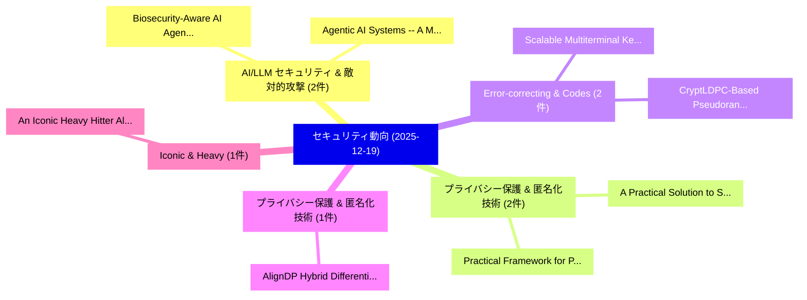

# 📅 02_daily: 日次エグゼクティブサマリー報告書 (2025-12-19)

**集計日時**: 2026-10-02 23:05:51 UTC  
**対象日付**: 2025-12-19  
**本日収集論文数**: 28 件  

---

## 💡 主要セキュリティ動向・脅威インサイト (Executive Insights)

本日の収集論文（計 28 件）において、以下の重点セキュリティ領域で活発な研究動向が確認されました：
- **AI/LLM セキュリティ & 敵対的攻撃** (2 件): 注目論文として 「Biosecurity-Aware AI: Agentic ...」、「Agentic AI Systems -- A Multil...」 等が発表され、実務防御および攻撃検証の進展が見られます。
- **プライバシー保護 & 匿名化技術** (2 件): 注目論文として 「Practical Framework for Privac...」、「A Practical Solution to System...」 等が発表され、実務防御および攻撃検証の進展が見られます。
- **Error-correcting & Codes** (2 件): 注目論文として 「CryptLDPC-Based Pseudorandom E...」、「Scalable Multiterminal Key Agr...」 等が発表され、実務防御および攻撃検証の進展が見られます。
- **プライバシー保護 & 匿名化技術** (1 件): 注目論文として 「AlignDP: Hybrid Differential P...」 等が発表され、実務防御および攻撃検証の進展が見られます。
- **Iconic & Heavy** (1 件): 注目論文として 「An Iconic Heavy Hitter Algorit...」 等が発表され、実務防御および攻撃検証の進展が見られます。

### 🗺️ 技術・脅威トピックマインドマップ

---

## 📌 日次セキュリティ論文一覧 (日本語表形式)

| No | arXiv ID | 論文タイトル (日本語訳) | 重要キーワード | 構造化エグゼクティブ要約 (背景・提案・影響) | 脅威分類 | 詳細リンク |
|---|---|---|---|---|---|---|
| 1 | `2512.17146v1` | [Biosecurity-Aware AI: Agentic Risk Auditing of Soft Prompt Attacks on ESM-Based Variant Predictors（セキュリティ分析論文）](../../okf/papers/2025-12-19/2512.17146.md) | `Agentic Risk Auditing`, `Soft Prompt Attacks`, `Based Variant Predictors` | 【提案】概要 (Overview & Key Finding) 本論文「Biosecurity-Aware AI: Agentic Risk Auditing of Soft Pro...。実証評価により経営層・セキュリティ管理者向け推奨アクション (E... | `executive-summary` | [arXiv](https://arxiv.org/abs/2512.17146v1) &#124; [OKF](../../okf/papers/2025-12-19/2512.17146.md) |
| 2 | `2512.17251v1` | [AlignDP: Hybrid Differential Privacy with Rarity-Aware Protection for LLMs（セキュリティ分析論文）](../../okf/papers/2025-12-19/2512.17251.md) | `Hybrid Differential Privacy`, `Aware Protection`, `Rarity-Aware Protection` | 【提案】概要 (Overview & Key Finding) 本論文「AlignDP: Hybrid 差分プライバシー with Rarity-Aware Protection f...。実証評価により経営層・セキュリティ管理者向け推奨アクション (E... | `cs.AI` | [arXiv](https://arxiv.org/abs/2512.17251v1) &#124; [OKF](../../okf/papers/2025-12-19/2512.17251.md) |
| 3 | `2512.17254v1` | [Practical Framework for Privacy-Preserving and Byzantine-robust 連合学習](../../okf/papers/2025-12-19/2512.17254.md) | `Federated Learning`, `Byzantine-robust Federated`, `Baolei Zhang` | 【提案】概要 (Overview & Key Finding) 本論文「Practical Framework for Privacy-Preserving and Byzantin...。実証評価により経営層・セキュリティ管理者向け推奨アクション (E... | `executive-summary` | [arXiv](https://arxiv.org/abs/2512.17254v1) &#124; [OKF](../../okf/papers/2025-12-19/2512.17254.md) |
| 4 | `2512.17295v2` | [An Iconic Heavy Hitter Algorithm Made Private（セキュリティ分析論文）](../../okf/papers/2025-12-19/2512.17295.md) | `Rayne Holland`, `Raw Meta`, `Executive Summary` | 【提案】概要 (Overview & Key Finding) 本論文「An Iconic Heavy Hitter Algorithm Made Private（セキュリティ分析論...。実証評価により経営層・セキュリティ管理者向け推奨アクション (E... | `cybersecurity` | [arXiv](https://arxiv.org/abs/2512.17295v2) &#124; [OKF](../../okf/papers/2025-12-19/2512.17295.md) |
| 5 | `2512.17310v4` | [CryptLDPC-Based Pseudorandom Error-Correcting Codesの分析](../../okf/papers/2025-12-19/2512.17310.md) | `Based Pseudorandom Error`, `Correcting Codes`, `LDPC-Based Pseudorandom` | 【提案】概要 (Overview & Key Finding) 本論文「CryptLDPC-Based Pseudorandom Error-Correcting Codesの分析」...。実証評価により経営層・セキュリティ管理者向け推奨アクション (E... | `cybersecurity` | [arXiv](https://arxiv.org/abs/2512.17310v4) &#124; [OKF](../../okf/papers/2025-12-19/2512.17310.md) |
| 6 | `2512.17363v3` | [What You Trust Is Insecure: Demystifying How Developers (Mis)Use Trusted Execution Environments in Practice（セキュリティ分析論文）](../../okf/papers/2025-12-19/2512.17363.md) | `Use Trusted Execution Environments`, `Yuqing Niu`, `Jieke Shi` | 【提案】概要 (Overview & Key Finding) 本論文「What You Trust Is Insecure: Demystifying How Developers...。実証評価により経営層・セキュリティ管理者向け推奨アクション (E... | `executive-summary` | [arXiv](https://arxiv.org/abs/2512.17363v3) &#124; [OKF](../../okf/papers/2025-12-19/2512.17363.md) |
| 7 | `2512.17375v2` | [AdvJudge-Zero: Binary Decision Flips in LLM-as-a-Judge via Adversarial Control Tokens（セキュリティ分析論文）](../../okf/papers/2025-12-19/2512.17375.md) | `Binary Decision Flips`, `Adversarial Control Tokens`, `a-Judge via` | 【提案】概要 (Overview & Key Finding) 本論文「AdvJudge-Zero: Binary Decision Flips in LLM-as-a-Judge ...。実証評価により経営層・セキュリティ管理者向け推奨アクション (E... | `executive-summary` | [arXiv](https://arxiv.org/abs/2512.17375v2) &#124; [OKF](../../okf/papers/2025-12-19/2512.17375.md) |
| 8 | `2512.17398v1` | [DeepShare: Sharing ReLU Across Channels and Layers for Efficient Private Inference（セキュリティ分析論文）](../../okf/papers/2025-12-19/2512.17398.md) | `Efficient Private Inference`, `Across Channels`, `Yonathan Bornfeld` | 【提案】概要 (Overview & Key Finding) 本論文「DeepShare: Sharing ReLU Across Channels and Layers for ...。実証評価により経営層・セキュリティ管理者向け推奨アクション (E... | `executive-summary` | [arXiv](https://arxiv.org/abs/2512.17398v1) &#124; [OKF](../../okf/papers/2025-12-19/2512.17398.md) |
| 9 | `2512.17411v1` | [Detection and Sensitive and Illegal Content on the Ethereum Blockchain Using Machine Learning Techniquesの分析](../../okf/papers/2025-12-19/2512.17411.md) | `Illegal Content`, `Ethereum Blockchain Using Machine Learning`, `Ethereum Blockchain Using Machine Learning Techniques` | 【提案】概要 (Overview & Key Finding) 本論文「Detection and Sensitive and Illegal Content on the Ethe...。実証評価により経営層・セキュリティ管理者向け推奨アクション (E... | `cs.AI` | [arXiv](https://arxiv.org/abs/2512.17411v1) &#124; [OKF](../../okf/papers/2025-12-19/2512.17411.md) |
| 10 | `2512.17519v1` | [Key-Conditioned Orthonormal Transform Gating (K-OTG): Multi-Key Access Control with Hidden-State Scrambling for LoRA-Tuned Models（セキュリティ分析論文）](../../okf/papers/2025-12-19/2512.17519.md) | `Conditioned Orthonormal Transform Gating`, `Key Access Control`, `State Scrambling` | 【提案】概要 (Overview & Key Finding) 本論文「Key-Conditioned Orthonormal Transform Gating (K-OTG): M...。実証評価により経営層・セキュリティ管理者向け推奨アクション (E... | `cs.AI` | [arXiv](https://arxiv.org/abs/2512.17519v1) &#124; [OKF](../../okf/papers/2025-12-19/2512.17519.md) |
| 11 | `2512.17527v1` | [SafeBench-Seq: A Homology-Clustered, CPU-Only Baseline for Protein Hazard Screening with Physicochemical/Composition Features and Cluster-Aware Confidence Intervals（セキュリティ分析論文）](../../okf/papers/2025-12-19/2512.17527.md) | `Protein Hazard Screening`, `Aware Confidence Intervals`, `Composition Features` | 【提案】概要 (Overview & Key Finding) 本論文「SafeBench-Seq: A Homology-Clustered, CPU-Only Baseline ...。実証評価により経営層・セキュリティ管理者向け推奨アクション (E... | `cs.AI` | [arXiv](https://arxiv.org/abs/2512.17527v1) &#124; [OKF](../../okf/papers/2025-12-19/2512.17527.md) |
| 12 | `2512.17538v1` | [Binding Agent ID: Unleashing the Power of AI Agents with accountability and credibility（セキュリティ分析論文）](../../okf/papers/2025-12-19/2512.17538.md) | `Binding Agent`, `Zibin Lin`, `Shengli Zhang` | 【提案】概要 (Overview & Key Finding) 本論文「Binding Agent ID: Unleashing the Power of AI Agents wit...。実証評価により経営層・セキュリティ管理者向け推奨アクション (E... | `cs.NI` | [arXiv](https://arxiv.org/abs/2512.17538v1) &#124; [OKF](../../okf/papers/2025-12-19/2512.17538.md) |
| 13 | `2512.17594v1` | [MAD-OOD: A Deep Learning Cluster-Driven Framework for an Out-of-Distribution マルウェア検出 and Classification](../../okf/papers/2025-12-19/2512.17594.md) | `Deep Learning Cluster`, `Distribution Malware Detection`, `Tosin Ige` | 【提案】概要 (Overview & Key Finding) 本論文「MAD-OOD: A Deep Learning Cluster-Driven Framework for a...。実証評価により経営層・セキュリティ管理者向け推奨アクション (E... | `cs.AI` | [arXiv](https://arxiv.org/abs/2512.17594v1) &#124; [OKF](../../okf/papers/2025-12-19/2512.17594.md) |
| 14 | `2512.17602v1` | [Sandwiched and Silent: Behavioral Adaptation and Private Channel Exploitation in Ethereum MEV（セキュリティ分析論文）](../../okf/papers/2025-12-19/2512.17602.md) | `Private Channel Exploitation`, `Behavioral Adaptation`, `Davide Mancino` | 【提案】概要 (Overview & Key Finding) 本論文「Sandwiched and Silent: Behavioral Adaptation and Privat...。実証評価により経営層・セキュリティ管理者向け推奨アクション (E... | `cs.CE` | [arXiv](https://arxiv.org/abs/2512.17602v1) &#124; [OKF](../../okf/papers/2025-12-19/2512.17602.md) |
| 15 | `2512.17613v2` | [A Post-Quantum Secure End-to-End Verifiable E-Voting Protocol Based on Multivariate Polynomials（セキュリティ分析論文）](../../okf/papers/2025-12-19/2512.17613.md) | `Quantum Secure End`, `Voting Protocol Based`, `End Verifiable` | 【提案】概要 (Overview & Key Finding) 本論文「A Post-量子 Secure End-to-End Verifiable E-Voting Protoco...。実証評価により経営層・セキュリティ管理者向け推奨アクション (E... | `cybersecurity` | [arXiv](https://arxiv.org/abs/2512.17613v2) &#124; [OKF](../../okf/papers/2025-12-19/2512.17613.md) |
| 16 | `2512.17667v1` | [STAR: Semantic-Traffic Alignment and Retrieval for Zero-Shot HTTPS Website Fingerprinting（セキュリティ分析論文）](../../okf/papers/2025-12-19/2512.17667.md) | `Traffic Alignment`, `Semantic-Traffic Alignment`, `Zero-Shot HTTPS` | 【提案】概要 (Overview & Key Finding) 本論文「STAR: Semantic-Traffic Alignment and Retrieval for Zero...。実証評価により経営層・セキュリティ管理者向け推奨アクション (E... | `cs.NI` | [arXiv](https://arxiv.org/abs/2512.17667v1) &#124; [OKF](../../okf/papers/2025-12-19/2512.17667.md) |
| 17 | `2512.17710v1` | [A Practical Solution to Systematically Monitor Inconsistencies in SBOM-based Vulnerability Scanners（セキュリティ分析論文）](../../okf/papers/2025-12-19/2512.17710.md) | `Systematically Monitor Inconsistencies`, `Practical Solution`, `Vulnerability Scanners` | 【提案】概要 (Overview & Key Finding) 本論文「A Practical Solution to Systematically Monitor Inconsis...。実証評価により経営層・セキュリティ管理者向け推奨アクション (E... | `executive-summary` | [arXiv](https://arxiv.org/abs/2512.17710v1) &#124; [OKF](../../okf/papers/2025-12-19/2512.17710.md) |
| 18 | `2512.17722v1` | [Digital and Web Forensics Model Cards, V1（セキュリティ分析論文）](../../okf/papers/2025-12-19/2512.17722.md) | `Web Forensics Model Cards`, `Paola Di Maio`, `Raw Meta` | 【提案】概要 (Overview & Key Finding) 本論文「Digital and Web Forensics Model Cards, V1（セキュリティ分析論文）」（...。実証評価により経営層・セキュリティ管理者向け推奨アクション (E... | `cs.AI` | [arXiv](https://arxiv.org/abs/2512.17722v1) &#124; [OKF](../../okf/papers/2025-12-19/2512.17722.md) |
| 19 | `2512.17748v2` | [Methods and Tools for Secure Quantum Clouds with a specific Case Study on Homomorphic Encryption（セキュリティ分析論文）](../../okf/papers/2025-12-19/2512.17748.md) | `Secure Quantum Clouds`, `Homomorphic Encryption`, `Aurelia Kusumastuti` | 【提案】概要 (Overview & Key Finding) 本論文「Methods and Tools for Secure 量子 Clouds with a specific ...。実証評価により経営層・セキュリティ管理者向け推奨アクション (E... | `executive-summary` | [arXiv](https://arxiv.org/abs/2512.17748v2) &#124; [OKF](../../okf/papers/2025-12-19/2512.17748.md) |
| 20 | `2512.17902v1` | [Adversarial Robustness of Vision in Open Foundation Models（セキュリティ分析論文）](../../okf/papers/2025-12-19/2512.17902.md) | `Open Foundation Models`, `Adversarial Robustness`, `Jonathon Fox` | 【提案】概要 (Overview & Key Finding) 本論文「Adversarial Robustness of Vision in Open Foundation Mod...。実証評価により経営層・セキュリティ管理者向け推奨アクション (E... | `cs.AI` | [arXiv](https://arxiv.org/abs/2512.17902v1) &#124; [OKF](../../okf/papers/2025-12-19/2512.17902.md) |
| 21 | `2512.18025v1` | [Scalable Multiterminal Key Agreement via Error-Correcting Codes（セキュリティ分析論文）](../../okf/papers/2025-12-19/2512.18025.md) | `Scalable Multiterminal Key Agreement`, `Correcting Codes`, `Error-Correcting Codes` | 【提案】概要 (Overview & Key Finding) 本論文「Scalable Multiterminal Key Agreement via Error-Correcti...。実証評価によりVarshney - **公開日時**: `202... | `executive-summary` | [arXiv](https://arxiv.org/abs/2512.18025v1) &#124; [OKF](../../okf/papers/2025-12-19/2512.18025.md) |
| 22 | `2512.18035v1` | [Benchmarking Privacy Vulnerabilities in Selective Forgetting with Large Language Modelsに向けて](../../okf/papers/2025-12-19/2512.18035.md) | `Selective Forgetting`, `Towards Benchmarking Privacy Vulnerabilities`, `Benchmarking Privacy Vulnerabilities` | 【提案】概要 (Overview & Key Finding) 本論文「Benchmarking Privacy Vulnerabilities in Selective Forge...。実証評価により経営層・セキュリティ管理者向け推奨アクション (E... | `executive-summary` | [arXiv](https://arxiv.org/abs/2512.18035v1) &#124; [OKF](../../okf/papers/2025-12-19/2512.18035.md) |
| 23 | `2512.18043v1` | [Agentic AI Systems -- A Multilayer Security Frameworkのセキュリティ強化](../../okf/papers/2025-12-19/2512.18043.md) | `Securing Agentic`, `Multilayer Security`, `Sunil Arora` | 【提案】概要 (Overview & Key Finding) 本論文「Agentic AI Systems -- A Multilayer Security Frameworkのセ...。実証評価により経営層・セキュリティ管理者向け推奨アクション (E... | `cs.AI` | [arXiv](https://arxiv.org/abs/2512.18043v1) &#124; [OKF](../../okf/papers/2025-12-19/2512.18043.md) |
| 24 | `2512.18102v1` | [From Coverage to Causes: Data-Centric Fuzzing for JavaScript Engines（セキュリティ分析論文）](../../okf/papers/2025-12-19/2512.18102.md) | `Centric Fuzzing`, `Data-Centric Fuzzing`, `Kishan Kumar Ganguly` | 【提案】概要 (Overview & Key Finding) 本論文「From Coverage to Causes: Data-Centric Fuzzing for JavaS...。実証評価により経営層・セキュリティ管理者向け推奨アクション (E... | `executive-summary` | [arXiv](https://arxiv.org/abs/2512.18102v1) &#124; [OKF](../../okf/papers/2025-12-19/2512.18102.md) |
| 25 | `2512.18132v1` | [PermuteV: A Performant Side-channel-Resistant RISC-V Core Edge AI Inferenceのセキュリティ強化](../../okf/papers/2025-12-19/2512.18132.md) | `Performant Side`, `RISC-V Core`, `Core Securing Edge` | 【提案】概要 (Overview & Key Finding) 本論文「PermuteV: A Performant サイドチャネル攻撃-Resistant RISC-V Core ...。実証評価により経営層・セキュリティ管理者向け推奨アクション (E... | `executive-summary` | [arXiv](https://arxiv.org/abs/2512.18132v1) &#124; [OKF](../../okf/papers/2025-12-19/2512.18132.md) |
| 26 | `2512.18133v1` | [Grad: Guided Relation Diffusion Generation for Graph Augmentation in Graph Fraud Detection（セキュリティ分析論文）](../../okf/papers/2025-12-19/2512.18133.md) | `Guided Relation Diffusion Generation`, `Graph Fraud Detection`, `Graph Augmentation` | 【提案】概要 (Overview & Key Finding) 本論文「Grad: Guided Relation Diffusion Generation for Graph Au...。実証評価により経営層・セキュリティ管理者向け推奨アクション (E... | `cs.AI` | [arXiv](https://arxiv.org/abs/2512.18133v1) &#124; [OKF](../../okf/papers/2025-12-19/2512.18133.md) |
| 27 | `2512.22179v3` | [Latent Sculpting for Zero-Shot Generalization: A Manifold Learning Approach to Out-of-Distribution Anomaly Detection（セキュリティ分析論文）](../../okf/papers/2025-12-19/2512.22179.md) | `Distribution Anomaly Detection`, `Latent Sculpting`, `Shot Generalization` | 【提案】概要 (Overview & Key Finding) 本論文「Latent Sculpting for Zero-Shot Generalization: A Manifo...。実証評価により経営層・セキュリティ管理者向け推奨アクション (E... | `executive-summary` | [arXiv](https://arxiv.org/abs/2512.22179v3) &#124; [OKF](../../okf/papers/2025-12-19/2512.22179.md) |
| 28 | `2601.04215v1` | [Social Engineering Attacks: A Systemisation of Knowledge on People Against Humans（セキュリティ分析論文）](../../okf/papers/2025-12-19/2601.04215.md) | `Social Engineering Attacks`, `Scott Thomson`, `Michael Bewong` | 【提案】概要 (Overview & Key Finding) 本論文「Social Engineering Attacks: A Systemisation of Knowledg...。実証評価により経営層・セキュリティ管理者向け推奨アクション (E... | `executive-summary` | [arXiv](https://arxiv.org/abs/2601.04215v1) &#124; [OKF](../../okf/papers/2025-12-19/2601.04215.md) |

