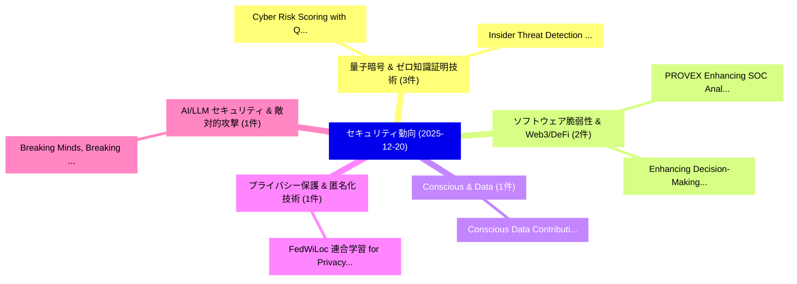

# 📅 02_daily: 日次エグゼクティブサマリー報告書 (2025-12-20)

**集計日時**: 2026-10-02 23:05:51 UTC  
**対象日付**: 2025-12-20  
**本日収集論文数**: 17 件  

---

## 💡 主要セキュリティ動向・脅威インサイト (Executive Insights)

本日の収集論文（計 17 件）において、以下の重点セキュリティ領域で活発な研究動向が確認されました：
- **量子暗号 & ゼロ知識証明技術** (3 件): 注目論文として 「Cyber Risk Scoring with QUBO: ...」、「Insider Threat Detection Using...」 等が発表され、実務防御および攻撃検証の進展が見られます。
- **ソフトウェア脆弱性 & Web3/DeFi** (2 件): 注目論文として 「PROVEX: Enhancing SOC Analyst ...」、「Enhancing Decision-Making in W...」 等が発表され、実務防御および攻撃検証の進展が見られます。
- **Conscious & Data** (1 件): 注目論文として 「Conscious Data Contribution vi...」 等が発表され、実務防御および攻撃検証の進展が見られます。
- **プライバシー保護 & 匿名化技術** (1 件): 注目論文として 「FedWiLoc: 連合学習 for Privacy-Pre...」 等が発表され、実務防御および攻撃検証の進展が見られます。
- **AI/LLM セキュリティ & 敵対的攻撃** (1 件): 注目論文として 「Breaking Minds, Breaking Syste...」 等が発表され、実務防御および攻撃検証の進展が見られます。

### 🗺️ 技術・脅威トピックマインドマップ

---

## 📌 日次セキュリティ論文一覧 (日本語表形式)

| No | arXiv ID | 論文タイトル (日本語訳) | 重要キーワード | 構造化エグゼクティブ要約 (背景・提案・影響) | 脅威分類 | 詳細リンク |
|---|---|---|---|---|---|---|
| 1 | `2512.18174v1` | [Conscious Data Contribution via Community-Driven Chain-of-Thought Distillation（セキュリティ分析論文）](../../okf/papers/2025-12-20/2512.18174.md) | `Conscious Data Contribution`, `Driven Chain`, `Community-Driven Chain` | 【提案】概要 (Overview & Key Finding) 本論文「Conscious Data Contribution via Community-Driven Chain-...。実証評価により経営層・セキュリティ管理者向け推奨アクション (E... | `executive-summary` | [arXiv](https://arxiv.org/abs/2512.18174v1) &#124; [OKF](../../okf/papers/2025-12-20/2512.18174.md) |
| 2 | `2512.18199v1` | [PROVEX: Enhancing SOC Analyst Trust with Explainable Provenance-Based IDS（セキュリティ分析論文）](../../okf/papers/2025-12-20/2512.18199.md) | `Analyst Trust`, `Explainable Provenance`, `Provenance-Based IDS` | 【提案】概要 (Overview & Key Finding) 本論文「PROVEX: Enhancing SOC Analyst Trust with Explainable Pr...。実証評価により経営層・セキュリティ管理者向け推奨アクション (E... | `cs.AI` | [arXiv](https://arxiv.org/abs/2512.18199v1) &#124; [OKF](../../okf/papers/2025-12-20/2512.18199.md) |
| 3 | `2512.18207v1` | [FedWiLoc: 連合学習 for Privacy-Preserving WiFi Indoor Localization](../../okf/papers/2025-12-20/2512.18207.md) | `Indoor Localization`, `Privacy-Preserving WiFi`, `Federated Learning` | 【提案】概要 (Overview & Key Finding) 本論文「FedWiLoc: 連合学習 for Privacy-Preserving WiFi Indoor Local...。実証評価により経営層・セキュリティ管理者向け推奨アクション (E... | `executive-summary` | [arXiv](https://arxiv.org/abs/2512.18207v1) &#124; [OKF](../../okf/papers/2025-12-20/2512.18207.md) |
| 4 | `2512.18244v1` | [Breaking Minds, Breaking Systems: Jailbreaking 大規模言語モデル via Human-like Psychological Manipulation](../../okf/papers/2025-12-20/2512.18244.md) | `Breaking Minds`, `Breaking Systems`, `Psychological Manipulation` | 【提案】概要 (Overview & Key Finding) 本論文「Breaking Minds, Breaking Systems: ジェイルブレイクing 大規模言語モデル ...。実証評価により経営層・セキュリティ管理者向け推奨アクション (E... | `cs.AI` | [arXiv](https://arxiv.org/abs/2512.18244v1) &#124; [OKF](../../okf/papers/2025-12-20/2512.18244.md) |
| 5 | `2512.18264v1` | [Who Can See Through You? Adversarial Shielding Against VLM-Based Attribute Inference Attacks（セキュリティ分析論文）](../../okf/papers/2025-12-20/2512.18264.md) | `Based Attribute Inference Attacks`, `VLM-Based Attribute`, `Yucheng Fan` | 【提案】Adversarial Shielding Against VLM-Based Attribute Inference Attacks ### (日本語題名: Who Can...。実証評価により経営層・セキュリティ管理者向け推奨アクション (E... | `cs.AI` | [arXiv](https://arxiv.org/abs/2512.18264v1) &#124; [OKF](../../okf/papers/2025-12-20/2512.18264.md) |
| 6 | `2512.18303v2` | [MORPHEUS: A Multidimensional Framework for Modeling, Measuring, and Mitigating Human Factors in サイバーセキュリティ](../../okf/papers/2025-12-20/2512.18303.md) | `Mitigating Human Factors`, `Giuseppe Desolda`, `Francesco Greco` | 【提案】概要 (Overview & Key Finding) 本論文「MORPHEUS: A Multidimensional Framework for Modeling, Me...。実証評価により経営層・セキュリティ管理者向け推奨アクション (E... | `executive-summary` | [arXiv](https://arxiv.org/abs/2512.18303v2) &#124; [OKF](../../okf/papers/2025-12-20/2512.18303.md) |
| 7 | `2512.18305v2` | [Cyber Risk Scoring with QUBO: A Quantum and Hybrid Benchmark Study（セキュリティ分析論文）](../../okf/papers/2025-12-20/2512.18305.md) | `Cyber Risk Scoring`, `Remo Marini`, `Riccardo Arpe` | 【提案】概要 (Overview & Key Finding) 本論文「Cyber Risk Scoring with QUBO: A 量子 and Hybrid Benchmark...。実証評価により経営層・セキュリティ管理者向け推奨アクション (E... | `executive-summary` | [arXiv](https://arxiv.org/abs/2512.18305v2) &#124; [OKF](../../okf/papers/2025-12-20/2512.18305.md) |
| 8 | `2512.18345v2` | [Theodosian: A Deep Dive into Memory-Hierarchy-Centric FHE Acceleration（セキュリティ分析論文）](../../okf/papers/2025-12-20/2512.18345.md) | `Deep Dive`, `Jung Ho Ahn`, `Wonseok Choi` | 【提案】概要 (Overview & Key Finding) 本論文「Theodosian: A Deep Dive into Memory-Hierarchy-Centric F...。実証評価により経営層・セキュリティ管理者向け推奨アクション (E... | `executive-summary` | [arXiv](https://arxiv.org/abs/2512.18345v2) &#124; [OKF](../../okf/papers/2025-12-20/2512.18345.md) |
| 9 | `2512.18432v1` | [連合学習 Based Decentralized Adaptive Intelligent Transmission Protocol for Privacy Preserving 6G Networks](../../okf/papers/2025-12-20/2512.18432.md) | `Based Decentralized Adaptive Intelligent Transmission Protocol`, `Privacy Preserving`, `Federated Learning Based Decentralized Adaptive Intelligent Transmission Protocol` | 【提案】概要 (Overview & Key Finding) 本論文「連合学習 Based Decentralized Adaptive Intelligent Transmiss...。実証評価により経営層・セキュリティ管理者向け推奨アクション (E... | `cs.AI` | [arXiv](https://arxiv.org/abs/2512.18432v1) &#124; [OKF](../../okf/papers/2025-12-20/2512.18432.md) |
| 10 | `2512.18456v1` | [SoK: Understanding (New) Security Issues Across AI4Code Use Cases（セキュリティ分析論文）](../../okf/papers/2025-12-20/2512.18456.md) | `Security Issues Across`, `Use Cases`, `Qilong Wu` | 【提案】概要 (Overview & Key Finding) 本論文「SoK: Understanding (New) Security Issues Across AI4Code...。実証評価により経営層・セキュリティ管理者向け推奨アクション (E... | `cs.AI` | [arXiv](https://arxiv.org/abs/2512.18456v1) &#124; [OKF](../../okf/papers/2025-12-20/2512.18456.md) |
| 11 | `2512.18483v1` | [Insider Threat Detection Using GCN and Bi-LSTM with Explicit and Implicit Graph Representations（セキュリティ分析論文）](../../okf/papers/2025-12-20/2512.18483.md) | `Insider Threat Detection Using`, `Implicit Graph Representations`, `Seibu Mary Jacob` | 【提案】概要 (Overview & Key Finding) 本論文「Insider 脅威 Detection Using GCN and Bi-LSTM with Explici...。実証評価により経営層・セキュリティ管理者向け推奨アクション (E... | `cs.AI` | [arXiv](https://arxiv.org/abs/2512.18483v1) &#124; [OKF](../../okf/papers/2025-12-20/2512.18483.md) |
| 12 | `2512.18488v1` | [QLink: Quantum-Safe Bridge Architecture for Blockchain Interoperability（セキュリティ分析論文）](../../okf/papers/2025-12-20/2512.18488.md) | `Safe Bridge Architecture`, `Blockchain Interoperability`, `Quantum-Safe Bridge` | 【提案】概要 (Overview & Key Finding) 本論文「QLink: 量子-Safe Bridge Architecture for Blockchain Inter...。実証評価により経営層・セキュリティ管理者向け推奨アクション (E... | `cybersecurity` | [arXiv](https://arxiv.org/abs/2512.18488v1) &#124; [OKF](../../okf/papers/2025-12-20/2512.18488.md) |
| 13 | `2512.18493v1` | [Cyber Threat Detection Enabled by Quantum Computing（セキュリティ分析論文）](../../okf/papers/2025-12-20/2512.18493.md) | `Cyber Threat Detection Enabled`, `Quantum Computing`, `Zisheng Chen` | 【提案】概要 (Overview & Key Finding) 本論文「Cyber 脅威 Detection Enabled by 量子 Computing（セキュリティ分析論文）」...。実証評価により経営層・セキュリティ管理者向け推奨アクション (E... | `executive-summary` | [arXiv](https://arxiv.org/abs/2512.18493v1) &#124; [OKF](../../okf/papers/2025-12-20/2512.18493.md) |
| 14 | `2512.18495v1` | [Enhancing Decision-Making in Windows PE Malware Classification During Dataset Shifts with Uncertainty Estimation（セキュリティ分析論文）](../../okf/papers/2025-12-20/2512.18495.md) | `Enhancing Decision`, `Uncertainty Estimation`, `Seibu Mary Jacob` | 【提案】概要 (Overview & Key Finding) 本論文「Enhancing Decision-Making in Windows PE マルウェア Classific...。実証評価により経営層・セキュリティ管理者向け推奨アクション (E... | `cs.AI` | [arXiv](https://arxiv.org/abs/2512.18495v1) &#124; [OKF](../../okf/papers/2025-12-20/2512.18495.md) |
| 15 | `2512.18517v1` | [Exploring Runtime Evolution in Android: A Cross-Version Analysis and Its Implications for Memory Forensics（セキュリティ分析論文）](../../okf/papers/2025-12-20/2512.18517.md) | `Exploring Runtime Evolution`, `Memory Forensics`, `Babangida Bappah` | 【提案】概要 (Overview & Key Finding) 本論文「Exploring Runtime Evolution in Android: A Cross-Version...。実証評価により経営層・セキュリティ管理者向け推奨アクション (E... | `cybersecurity` | [arXiv](https://arxiv.org/abs/2512.18517v1) &#124; [OKF](../../okf/papers/2025-12-20/2512.18517.md) |
| 16 | `2512.18529v2` | [Protecting Human Activity Signatures in Compressed IEEE 802.11 CSI Feedback（セキュリティ分析論文）](../../okf/papers/2025-12-20/2512.18529.md) | `Protecting Human Activity Signatures`, `Mohamed Seif`, `Atsutse Kludze` | 【提案】概要 (Overview & Key Finding) 本論文「Protecting Human Activity Signatures in Compressed IEEE...。実証評価により経営層・セキュリティ管理者向け推奨アクション (E... | `cs.NI` | [arXiv](https://arxiv.org/abs/2512.18529v2) &#124; [OKF](../../okf/papers/2025-12-20/2512.18529.md) |
| 17 | `2512.18542v3` | [SecureCode: A Production-Grade Multi-Turn Dataset for Training Security-Aware Code Generation Models（セキュリティ分析論文）](../../okf/papers/2025-12-20/2512.18542.md) | `Aware Code Generation Models`, `Grade Multi`, `Turn Dataset` | 【提案】概要 (Overview & Key Finding) 本論文「SecureCode: A Production-Grade Multi-Turn Dataset for T...。実証評価により経営層・セキュリティ管理者向け推奨アクション (E... | `cs.AI` | [arXiv](https://arxiv.org/abs/2512.18542v3) &#124; [OKF](../../okf/papers/2025-12-20/2512.18542.md) |

