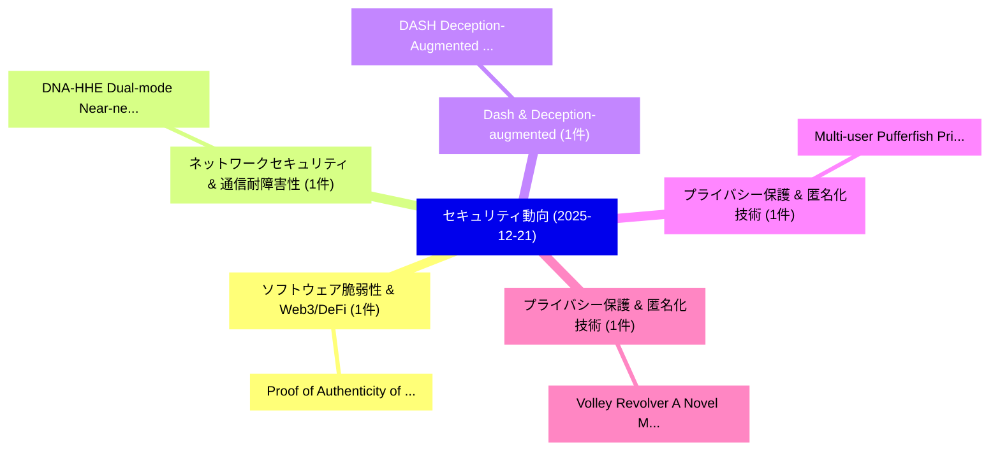

# 📅 02_daily: 日次エグゼクティブサマリー報告書 (2025-12-21)

**集計日時**: 2026-10-02 23:05:51 UTC  
**対象日付**: 2025-12-21  
**本日収集論文数**: 10 件  

---

## 💡 主要セキュリティ動向・脅威インサイト (Executive Insights)

本日の収集論文（計 10 件）において、以下の重点セキュリティ領域で活発な研究動向が確認されました：
- **ソフトウェア脆弱性 & Web3/DeFi** (1 件): 注目論文として 「Proof of Authenticity of Gener...」 等が発表され、実務防御および攻撃検証の進展が見られます。
- **ネットワークセキュリティ & 通信耐障害性** (1 件): 注目論文として 「DNA-HHE: Dual-mode Near-networ...」 等が発表され、実務防御および攻撃検証の進展が見られます。
- **Dash & Deception-augmented** (1 件): 注目論文として 「DASH: Deception-Augmented Shar...」 等が発表され、実務防御および攻撃検証の進展が見られます。
- **プライバシー保護 & 匿名化技術** (1 件): 注目論文として 「Multi-user Pufferfish Privacy（...」 等が発表され、実務防御および攻撃検証の進展が見られます。
- **プライバシー保護 & 匿名化技術** (1 件): 注目論文として 「Volley Revolver: A Novel Matri...」 等が発表され、実務防御および攻撃検証の進展が見られます。

### 🗺️ 技術・脅威トピックマインドマップ

---

## 📌 日次セキュリティ論文一覧 (日本語表形式)

| No | arXiv ID | 論文タイトル (日本語訳) | 重要キーワード | 構造化エグゼクティブ要約 (背景・提案・影響) | 脅威分類 | 詳細リンク |
|---|---|---|---|---|---|---|
| 1 | `2512.18560v1` | [Proof of Authenticity of General IoT Information with Tamper-Evident Sensors and Blockchain（セキュリティ分析論文）](../../okf/papers/2025-12-21/2512.18560.md) | `Evident Sensors`, `Tamper-Evident Sensors`, `Kenji Saito` | 【提案】概要 (Overview & Key Finding) 本論文「Proof of Authenticity of General IoT Information with T...。実証評価により経営層・セキュリティ管理者向け推奨アクション (E... | `executive-summary` | [arXiv](https://arxiv.org/abs/2512.18560v1) &#124; [OKF](../../okf/papers/2025-12-21/2512.18560.md) |
| 2 | `2512.18589v1` | [DNA-HHE: Dual-mode Near-network Accelerator for Hybrid Homomorphic Encryption on the Edge（セキュリティ分析論文）](../../okf/papers/2025-12-21/2512.18589.md) | `Hybrid Homomorphic Encryption`, `Dual-mode Near`, `Yifan Zhao` | 【提案】概要 (Overview & Key Finding) 本論文「DNA-HHE: Dual-mode Near-network Accelerator for Hybrid ...。実証評価により経営層・セキュリティ管理者向け推奨アクション (E... | `executive-summary` | [arXiv](https://arxiv.org/abs/2512.18589v1) &#124; [OKF](../../okf/papers/2025-12-21/2512.18589.md) |
| 3 | `2512.18616v1` | [DASH: Deception-Augmented Shared Mental Model for a Human-Machine Teaming System（セキュリティ分析論文）](../../okf/papers/2025-12-21/2512.18616.md) | `Augmented Shared Mental Model`, `Machine Teaming System`, `Deception-Augmented Shared` | 【提案】概要 (Overview & Key Finding) 本論文「DASH: Deception-Augmented Shared Mental Model for a Hum...。実証評価により経営層・セキュリティ管理者向け推奨アクション (E... | `cs.AI` | [arXiv](https://arxiv.org/abs/2512.18616v1) &#124; [OKF](../../okf/papers/2025-12-21/2512.18616.md) |
| 4 | `2512.18632v2` | [Multi-user Pufferfish Privacy（セキュリティ分析論文）](../../okf/papers/2025-12-21/2512.18632.md) | `Pufferfish Privacy`, `Multi-user Pufferfish`, `Ni Ding` | 【提案】概要 (Overview & Key Finding) 本論文「Multi-user Pufferfish Privacy（セキュリティ分析論文）」（原題: Multi-us...。実証評価により経営層・セキュリティ管理者向け推奨アクション (E... | `cybersecurity` | [arXiv](https://arxiv.org/abs/2512.18632v2) &#124; [OKF](../../okf/papers/2025-12-21/2512.18632.md) |
| 5 | `2512.18646v1` | [Volley Revolver: A Novel Matrix-Encoding Method for Privacy-Preserving Deep Learning (Inference++)（セキュリティ分析論文）](../../okf/papers/2025-12-21/2512.18646.md) | `Preserving Deep Learning`, `Volley Revolver`, `Privacy-Preserving Deep` | 【提案】概要 (Overview & Key Finding) 本論文「Volley Revolver: A Novel Matrix-Encoding Method for Pri...。実証評価により経営層・セキュリティ管理者向け推奨アクション (E... | `cybersecurity` | [arXiv](https://arxiv.org/abs/2512.18646v1) &#124; [OKF](../../okf/papers/2025-12-21/2512.18646.md) |
| 6 | `2512.18714v3` | [An Evidence-Driven Threat Information Sharing Challenges for Industrial Control Systems and Future Directionsの分析](../../okf/papers/2025-12-21/2512.18714.md) | `Industrial Control Systems`, `Driven Threat Information Sharing Challenges`, `Threat Information Sharing Challenges` | 【提案】概要 (Overview & Key Finding) 本論文「An Evidence-Driven 脅威 Information Sharing Challenges fo...。実証評価により経営層・セキュリティ管理者向け推奨アクション (E... | `cybersecurity` | [arXiv](https://arxiv.org/abs/2512.18714v3) &#124; [OKF](../../okf/papers/2025-12-21/2512.18714.md) |
| 7 | `2512.18733v1` | [Explainable and Fine-Grained Safeguarding of LLM Multi-Agent Systems via Bi-Level Graph Anomaly Detection（セキュリティ分析論文）](../../okf/papers/2025-12-21/2512.18733.md) | `Level Graph Anomaly Detection`, `Grained Safeguarding`, `Agent Systems` | 【提案】概要 (Overview & Key Finding) 本論文「Explainable and Fine-Grained Safeguarding of LLM Multi-...。実証評価により経営層・セキュリティ管理者向け推奨アクション (E... | `cs.AI` | [arXiv](https://arxiv.org/abs/2512.18733v1) &#124; [OKF](../../okf/papers/2025-12-21/2512.18733.md) |
| 8 | `2512.18751v1` | [ISADM: An Integrated STRIDE, ATT&CK, and D3FEND Model for Threat Modeling Against Real-world Adversaries（セキュリティ分析論文）](../../okf/papers/2025-12-21/2512.18751.md) | `Real-world Adversaries`, `Khondokar Fida Hasan`, `Hasibul Hossain Shajeeb` | 【提案】概要 (Overview & Key Finding) 本論文「ISADM: An Integrated STRIDE, ATT&CK, and D3FEND Model f...。実証評価により経営層・セキュリティ管理者向け推奨アクション (E... | `cybersecurity` | [arXiv](https://arxiv.org/abs/2512.18751v1) &#124; [OKF](../../okf/papers/2025-12-21/2512.18751.md) |
| 9 | `2512.18791v1` | [Smark: A Watermark for Text-to-Speech Diffusion Models via Discrete Wavelet Transform（セキュリティ分析論文）](../../okf/papers/2025-12-21/2512.18791.md) | `Speech Diffusion Models`, `Discrete Wavelet Transform`, `Discrete Wavelet Tra` | 【提案】概要 (Overview & Key Finding) 本論文「Smark: A Watermark for Text-to-Speech Diffusion Models ...。実証評価により経営層・セキュリティ管理者向け推奨アクション (E... | `cs.AI` | [arXiv](https://arxiv.org/abs/2512.18791v1) &#124; [OKF](../../okf/papers/2025-12-21/2512.18791.md) |
| 10 | `2512.20677v6` | [Learning-Based Automated Adversarial Red-Teaming for Robustness Evaluation of 大規模言語モデル](../../okf/papers/2025-12-21/2512.20677.md) | `Based Automated Adversarial Red`, `Learning-Based Automated`, `Large Language Models` | 【提案】概要 (Overview & Key Finding) 本論文「Learning-Based Automated Adversarial Red-Teaming for Ro...。実証評価により# Learning-Based Automate... | `executive-summary` | [arXiv](https://arxiv.org/abs/2512.20677v6) &#124; [OKF](../../okf/papers/2025-12-21/2512.20677.md) |

