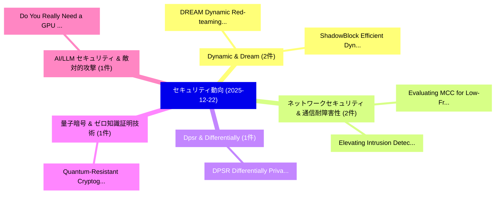

# 📅 02_daily: 日次エグゼクティブサマリー報告書 (2025-12-22)

**集計日時**: 2026-10-02 23:05:51 UTC  
**対象日付**: 2025-12-22  
**本日収集論文数**: 16 件  

---

## 💡 主要セキュリティ動向・脅威インサイト (Executive Insights)

本日の収集論文（計 16 件）において、以下の重点セキュリティ領域で活発な研究動向が確認されました：
- **Dynamic & Dream** (2 件): 注目論文として 「DREAM: Dynamic Red-teaming acr...」、「ShadowBlock: Efficient Dynamic...」 等が発表され、実務防御および攻撃検証の進展が見られます。
- **ネットワークセキュリティ & 通信耐障害性** (2 件): 注目論文として 「Elevating Intrusion Detection ...」、「Evaluating MCC for Low-Frequen...」 等が発表され、実務防御および攻撃検証の進展が見られます。
- **Dpsr & Differentially** (1 件): 注目論文として 「DPSR: Differentially Private S...」 等が発表され、実務防御および攻撃検証の進展が見られます。
- **量子暗号 & ゼロ知識証明技術** (1 件): 注目論文として 「Quantum-Resistant Cryptographi...」 等が発表され、実務防御および攻撃検証の進展が見られます。
- **AI/LLM セキュリティ & 敵対的攻撃** (1 件): 注目論文として 「Do You Really Need a GPU to Gu...」 等が発表され、実務防御および攻撃検証の進展が見られます。

### 🗺️ 技術・脅威トピックマインドマップ

---

## 📌 日次セキュリティ論文一覧 (日本語表形式)

| No | arXiv ID | 論文タイトル (日本語訳) | 重要キーワード | 構造化エグゼクティブ要約 (背景・提案・影響) | 脅威分類 | 詳細リンク |
|---|---|---|---|---|---|---|
| 1 | `2512.18932v1` | [DPSR: Differentially Private Sparse Reconstruction via Multi-Stage Denoising for Recommender Systems（セキュリティ分析論文）](../../okf/papers/2025-12-22/2512.18932.md) | `Differentially Private Sparse Reconstruction`, `Stage Denoising`, `Recommender Systems` | 【提案】概要 (Overview & Key Finding) 本論文「DPSR: Differentially Private Sparse Reconstruction via ...。実証評価により経営層・セキュリティ管理者向け推奨アクション (E... | `executive-summary` | [arXiv](https://arxiv.org/abs/2512.18932v1) &#124; [OKF](../../okf/papers/2025-12-22/2512.18932.md) |
| 2 | `2512.19005v1` | [Quantum-Resistant Cryptographic Models for Next-Gen サイバーセキュリティ](../../okf/papers/2025-12-22/2512.19005.md) | `Resistant Cryptographic Models`, `Quantum-Resistant Cryptographic`, `Gen Cybersecurity` | 【提案】概要 (Overview & Key Finding) 本論文「量子-Resistant Cryptographic Models for Next-Gen サイバーセキュリ...。実証評価により経営層・セキュリティ管理者向け推奨アクション (E... | `cybersecurity` | [arXiv](https://arxiv.org/abs/2512.19005v1) &#124; [OKF](../../okf/papers/2025-12-22/2512.19005.md) |
| 3 | `2512.19011v3` | [Do You Really Need a GPU to Guard Your LLM? CPU-Class Classifiers and Multi-Stage Pipelines for Safety Enforcement at Scale（セキュリティ分析論文）](../../okf/papers/2025-12-22/2512.19011.md) | `Class Classifiers`, `Stage Pipelines`, `Safety Enforcement` | 【提案】CPU-Class Classifiers and Multi-Stage Pipelines for Safety Enforcement at Scale ### (日本...。実証評価により経営層・セキュリティ管理者向け推奨アクション (E... | `cs.AI` | [arXiv](https://arxiv.org/abs/2512.19011v3) &#124; [OKF](../../okf/papers/2025-12-22/2512.19011.md) |
| 4 | `2512.19016v2` | [DREAM: Dynamic Red-teaming across Environments for AI Models（セキュリティ分析論文）](../../okf/papers/2025-12-22/2512.19016.md) | `Dynamic Red`, `Red-teaming across`, `Liming Lu` | 【提案】概要 (Overview & Key Finding) 本論文「DREAM: Dynamic Red-teaming across Environments for AI M...。実証評価により経営層・セキュリティ管理者向け推奨アクション (E... | `cybersecurity` | [arXiv](https://arxiv.org/abs/2512.19016v2) &#124; [OKF](../../okf/papers/2025-12-22/2512.19016.md) |
| 5 | `2512.19025v2` | [The Erasure Illusion: Stress-Testing the Generalization of LLM Forgetting Evaluation（セキュリティ分析論文）](../../okf/papers/2025-12-22/2512.19025.md) | `Hengrui Jia`, `Taoran Li`, `Jonas Guan` | 【提案】概要 (Overview & Key Finding) 本論文「The Erasure Illusion: Stress-Testing the Generalization...。実証評価により経営層・セキュリティ管理者向け推奨アクション (E... | `cs.AI` | [arXiv](https://arxiv.org/abs/2512.19025v2) &#124; [OKF](../../okf/papers/2025-12-22/2512.19025.md) |
| 6 | `2512.19037v1` | [Elevating Intrusion Detection and Security Fortification in Intelligent Networks through Cutting-Edge Machine Learning Paradigms（セキュリティ分析論文）](../../okf/papers/2025-12-22/2512.19037.md) | `Edge Machine Learning Paradigms`, `Elevating Intrusion Detection`, `Security Fortification` | 【提案】概要 (Overview & Key Finding) 本論文「Elevating Intrusion Detection and Security Fortificatio...。実証評価により経営層・セキュリティ管理者向け推奨アクション (E... | `executive-summary` | [arXiv](https://arxiv.org/abs/2512.19037v1) &#124; [OKF](../../okf/papers/2025-12-22/2512.19037.md) |
| 7 | `2512.19124v1` | [ShadowBlock: Efficient Dynamic Anonymous Blocklisting and Its Cross-chain Application（セキュリティ分析論文）](../../okf/papers/2025-12-22/2512.19124.md) | `Efficient Dynamic Anonymous Blocklisting`, `Cross-chain Application`, `Efficient Dynamic Anonymous` | 【提案】概要 (Overview & Key Finding) 本論文「ShadowBlock: Efficient Dynamic Anonymous Blocklisting a...。実証評価により経営層・セキュリティ管理者向け推奨アクション (E... | `cybersecurity` | [arXiv](https://arxiv.org/abs/2512.19124v1) &#124; [OKF](../../okf/papers/2025-12-22/2512.19124.md) |
| 8 | `2512.19203v2` | [Evaluating MCC for Low-Frequency Cyberattack Detection in Imbalanced Intrusion Detection Data（セキュリティ分析論文）](../../okf/papers/2025-12-22/2512.19203.md) | `Imbalanced Intrusion Detection Data`, `Frequency Cyberattack Detection`, `Low-Frequency Cyberattack` | 【提案】概要 (Overview & Key Finding) 本論文「Evaluating MCC for Low-Frequency Cyberattack Detection ...。実証評価により経営層・セキュリティ管理者向け推奨アクション (E... | `cybersecurity` | [arXiv](https://arxiv.org/abs/2512.19203v2) &#124; [OKF](../../okf/papers/2025-12-22/2512.19203.md) |
| 9 | `2512.19286v2` | [GShield: Mitigating Poisoning Attacks in 連合学習](../../okf/papers/2025-12-22/2512.19286.md) | `Mitigating Poisoning Attacks`, `Federated Learning`, `Serena Nicolazzo` | 【提案】概要 (Overview & Key Finding) 本論文「GShield: Mitigating Poisoning Attacks in 連合学習」（原題: GShi...。実証評価によりA - **公開日時**: `2025-12-22... | `executive-summary` | [arXiv](https://arxiv.org/abs/2512.19286v2) &#124; [OKF](../../okf/papers/2025-12-22/2512.19286.md) |
| 10 | `2512.19297v1` | [Causal-Guided Detoxify Backdoor Attack of Open-Weight LoRA Models（セキュリティ分析論文）](../../okf/papers/2025-12-22/2512.19297.md) | `Guided Detoxify Backdoor Attack`, `Causal-Guided Detoxify`, `Open-Weight LoRA` | 【提案】概要 (Overview & Key Finding) 本論文「Causal-Guided Detoxify Backdoor Attack of Open-Weight L...。実証評価により経営層・セキュリティ管理者向け推奨アクション (E... | `cs.AI` | [arXiv](https://arxiv.org/abs/2512.19297v1) &#124; [OKF](../../okf/papers/2025-12-22/2512.19297.md) |
| 11 | `2512.19314v1` | [Protecting Quantum Circuits Through Compiler-Resistant Obfuscation（セキュリティ分析論文）](../../okf/papers/2025-12-22/2512.19314.md) | `Resistant Obfuscation`, `Compiler-Resistant Obfuscation`, `Pradyun Parayil` | 【提案】概要 (Overview & Key Finding) 本論文「Protecting 量子 Circuits Through Compiler-Resistant Obfus...。実証評価により経営層・セキュリティ管理者向け推奨アクション (E... | `executive-summary` | [arXiv](https://arxiv.org/abs/2512.19314v1) &#124; [OKF](../../okf/papers/2025-12-22/2512.19314.md) |
| 12 | `2512.19414v1` | [From Retrieval to Reasoning: A Framework for Cyber Threat Intelligence NER with Explicit and Adaptive Instructions（セキュリティ分析論文）](../../okf/papers/2025-12-22/2512.19414.md) | `Cyber Threat Intelligence`, `Adaptive Instructions`, `Jiaren Peng` | 【提案】概要 (Overview & Key Finding) 本論文「From Retrieval to Reasoning: A Framework for Cyber 脅威 I...。実証評価により経営層・セキュリティ管理者向け推奨アクション (E... | `executive-summary` | [arXiv](https://arxiv.org/abs/2512.19414v1) &#124; [OKF](../../okf/papers/2025-12-22/2512.19414.md) |
| 13 | `2512.19935v1` | [Conditional Adversarial Fragility in Financial Machine Learning under Macroeconomic Stress（セキュリティ分析論文）](../../okf/papers/2025-12-22/2512.19935.md) | `Conditional Adversarial Fragility`, `Financial Machine Learning`, `Macroeconomic Stress` | 【提案】概要 (Overview & Key Finding) 本論文「Conditional Adversarial Fragility in Financial Machine ...。実証評価により経営層・セキュリティ管理者向け推奨アクション (E... | `cs.AI` | [arXiv](https://arxiv.org/abs/2512.19935v1) &#124; [OKF](../../okf/papers/2025-12-22/2512.19935.md) |
| 14 | `2512.20686v2` | [Sequential Apportionment from Stationary Divisor Methods（セキュリティ分析論文）](../../okf/papers/2025-12-22/2512.20686.md) | `Stationary Divisor Methods`, `Sequential Apportionment`, `Brittany Ohlinger` | 【提案】概要 (Overview & Key Finding) 本論文「Sequential Apportionment from Stationary Divisor Method...。実証評価によりJones, Brittany Ohlinger,... | `math.GM` | [arXiv](https://arxiv.org/abs/2512.20686v2) &#124; [OKF](../../okf/papers/2025-12-22/2512.20686.md) |
| 15 | `2512.21354v1` | [Reflection-Driven Control for Trustworthy Code Agents（セキュリティ分析論文）](../../okf/papers/2025-12-22/2512.21354.md) | `Trustworthy Code Agents`, `Driven Control`, `Reflection-Driven Control` | 【提案】概要 (Overview & Key Finding) 本論文「Reflection-Driven Control for Trustworthy Code Agents（セ...。実証評価により経営層・セキュリティ管理者向け推奨アクション (E... | `cs.AI` | [arXiv](https://arxiv.org/abs/2512.21354v1) &#124; [OKF](../../okf/papers/2025-12-22/2512.21354.md) |
| 16 | `2601.00816v1` | [MathLedger: A Verifiable Learning Substrate with Ledger-Attested Feedback（セキュリティ分析論文）](../../okf/papers/2025-12-22/2601.00816.md) | `Verifiable Learning Substrate`, `Attested Feedback`, `Ledger-Attested Feedback` | 【提案】概要 (Overview & Key Finding) 本論文「MathLedger: A Verifiable Learning Substrate with Ledger...。実証評価により経営層・セキュリティ管理者向け推奨アクション (E... | `cs.AI` | [arXiv](https://arxiv.org/abs/2601.00816v1) &#124; [OKF](../../okf/papers/2025-12-22/2601.00816.md) |

